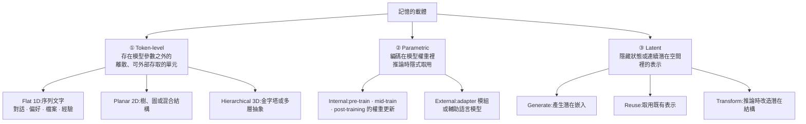
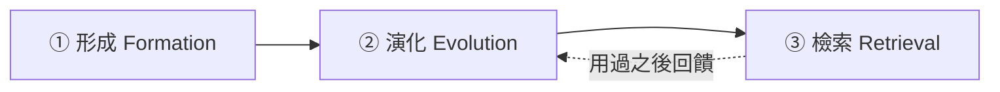

# Agent Memory 綜述:用「形式 / 功能 / 動態」三個切面收拾一個亂掉的領域

> 整理自 arXiv 論文 **《Memory in the Age of AI Agents》**(arXiv:2512.13564,**v1 2025-12-15 / v2 2026-01-13**,CC BY 4.0)。
> 由 47 位作者共同完成的綜述,並附有 [Agent-Memory-Paper-List](https://github.com/Shichun-Liu/Agent-Memory-Paper-List) 論文清單。

> ⚠️ **時效性提醒**:這是 **2025 年底提交、2026 年初修訂**的綜述,不是最新論文。它的價值在於**概念框架與術語釐清**,而非收錄最新方法。

> 📎 本篇適合當作本倉庫 `memory-retrieval` 這一區的**索引篇**,把既有筆記歸位:
> [[memharness-memory-reconstructed-not-replayed]]、[[project-cairn-experience-to-knowledge-skill]]、[[self-improving-knowledge-base-claude-cowork]]、[[codebase-memory-vs-codegraph-two-routes]]、[[graphify-code-knowledge-graph-real-world-test]]

---

## 一句話總結

**這個領域亂在術語**:大家講的「memory」其實混雜了四種不同的東西。這篇綜述先把 **agent memory 跟 LLM memory / RAG / context engineering 切開**,再用**形式(什麼載著記憶)、功能(為什麼需要)、動態(怎麼運作與演化)** 三個切面把研究重新歸位。

---

## 一、⭐⭐ 最有價值的一段:四個常被混用的概念

論文開宗明義處理的問題是:**「memory」這個詞被過度載入,導致研究之間難以比較。**

| | **Agent Memory** | **LLM Memory** | **RAG** | **Context Engineering** |
|---|---|---|---|---|
| **範圍** | 跨任務持續演化的認知狀態 | 模型內部動態與 KV cache 管理 | 靜態外部知識檢索 | 在上下文窗口內做資源最佳化 |
| **持久性** | **跨任務累積** | 單次推論會話 | 任務時的查找 | **短暫(僅在窗口內)** |
| **演化** | **透過互動自我改進** | 訓練後固定 | 幾乎沒有 | 沒有 |
| **主要目標** | **自適應的 agent 自主性** | 擴充模型容量 | 事實接地 | 效率與限制滿足 |

> ⭐ **這張表本身就值回票價。** 很多「我的 agent 有記憶」的說法,拆開來看其實只是 RAG 或 context engineering —— **沒有跨任務累積,也沒有自我演化。**

**拿它檢查本倉庫既有的筆記,分類立刻清楚:**

| 既有筆記 | 依這張表屬於 |
|---|---|
| [[memharness-memory-reconstructed-not-replayed]] | ✅ **Agent Memory**(記憶條目跨任務,且被重建而非重播) |
| [[project-cairn-experience-to-knowledge-skill]] | ✅ **Agent Memory**(經驗知識化,跨 session 累積) |
| [[self-improving-knowledge-base-claude-cowork]] | ✅ **Agent Memory**(raw/wiki/outputs 三層 + 健檢) |
| [[codebase-memory-vs-codegraph-two-routes]]、[[graphify-code-knowledge-graph-real-world-test]] | ⚠️ **比較接近 RAG / 結構化檢索** —— 它們檢索的是**程式碼的靜態結構**,不是 agent 的經驗 |
| [[claude-md-cut-82-percent-and-maintain-it]] 講的 CLAUDE.md | ⚠️ **Context Engineering** —— 沒有演化,只有窗口內的資源分配 |

---

## 二、切面一:形式(Forms)—— 什麼載著記憶?



> ⭐ **這個切面最實用的地方是「維度」的比喻**:Flat(1D)是一串文字、Planar(2D)是圖或樹、Hierarchical(3D)是多層抽象。**大多數產品級的 agent 記憶都還停在 1D**,而本倉庫看過的 Graphify、CodeGraph 屬於 2D。

---

## 三、切面二:功能(Functions)—— 為什麼需要記憶?

| 類別 | 存什麼 | 子類 |
|---|---|---|
| **Factual 事實記憶** | 關於使用者與環境的知識 | **使用者面**:對話連貫性、目標一致性、個人檔案<br/>**環境面**:知識持久化、多 agent 共享存取 |
| **Experiential 經驗記憶** | 從任務執行中累積的學習 | **Case-based**:軌跡與已解決的方案<br/>**Strategy-based**:洞見、工作流、模式<br/>**Skill-based**:程式碼片段、函式、API、MCP<br/>**Hybrid** |
| **Working 工作記憶** | 任務當下的操作性上下文 | **單輪**:輸入濃縮、觀察抽象化<br/>**多輪**:狀態整併、階層式摺疊、認知規劃 |

> ⭐ **Skill-based 經驗記憶這一格值得注意** —— 論文把「程式碼片段、函式、API、MCP」歸為記憶的一種。
> 這正好給了 [[agent-skill-three-layer-run-do-verify]] 裡的 Skill 一個理論位置:**Skill 是把高手的操作順序寫成可調用的程序性知識** —— 用這篇的語彙,那就是**外化的 skill-based experiential memory**。

---

## 四、切面三:動態(Dynamics)—— 記憶怎麼運作與演化

這是三個切面裡最工程化的一段,分三個階段:



### ① 形成(Formation)

| 方法 | 說明 |
|---|---|
| 語意摘要 | 增量式 / 分區式 |
| 知識蒸餾 | 事實型 / 經驗型 |
| 結構化建構 | 實體層級 / chunk 層級 |
| 潛在表示 | 文字 / 多模態 |
| 參數內化 | 知識 / 能力 |

### ② 演化(Evolution)

| 機制 | 子類 |
|---|---|
| **Consolidation 整併** | 局部 / 叢集層級 / 全域 |
| **Updating 更新** | 外部更新 / 模型編輯 |
| **⭐ Forgetting 遺忘** | **時間式 / 頻率式 / 重要性驅動** |

> ⭐ **「遺忘」被列為一等公民,是這個框架的重點之一。** 多數實作只做「加」不做「減」,而論文把遺忘的三種策略明確列出 —— 這與 [[claude-md-cut-82-percent-and-maintain-it]] 的核心結論相呼應:**只增不減的記憶,半年後就會變成負擔。**

### ③ 檢索(Retrieval)

| 環節 | 內容 |
|---|---|
| **時機與意圖** | 自動觸發條件與檢索目標 |
| **查詢建構** | 分解、改寫 |
| **策略** | 詞彙式、語意式、圖式、生成式、混合 |
| **後處理** | 重排序、過濾、聚合、壓縮 |

> ⚠️ **「時機」這一項最常被忽略**:多數系統把記憶檢索寫死在每輪開頭,而論文把「什麼時候該去取記憶」列為獨立的設計決策。

---

## 五、它盤點的評測與框架

**Benchmarks**:LoCoMo、LongMemEval(長上下文對話)、GAIA、XBench、BrowseComp(複雜推理)、SWE-bench Verified(程式任務)、StreamBench(終身學習)、HotpotQA、2WikiMQA、MuSiQue(多跳問答)。

**開源框架**:Memary、MemOS、Mem0、Zep、PlanRAG / Self-RAG。

> ⚠️ 這份清單以 2025 年底為準,**2026 年出現的框架不在其中**(例如本倉庫看過的 Project Cairn)。

---

## 六、它指出的八個未來方向

1. **檢索 → 生成**:從「取出記憶」轉向**生成式記憶合成**
2. **自動化記憶管理**:從手工設計走向自主系統
3. **與強化學習整合**:把記憶控制策略內化進模型
4. **多模態記憶**
5. **多 agent 的共享記憶**:集體認知基質
6. **給世界模型用的記憶**
7. **⭐ 可信賴的記憶**:可驗證性、幻覺緩解、來源追溯
8. **與人類認知科學的對照**

---

## 應用案例

### 案例 1|⭐ 用四欄表檢查「你的 agent 真的有記憶嗎」

拿你手上的系統逐項回答:

```
① 這個資訊能跨「任務」存活嗎?
   不能 → 那是 context engineering,不是記憶
② 它會隨著互動而改變嗎?
   不會 → 那是 RAG(靜態知識查找)
③ 改變是誰驅動的?
   只有人工更新 → 還不到「自我演化」
   系統自己從執行結果更新 → ✅ 這才是 agent memory
```

⚠️ **多數「記憶功能」停在第 ①、② 關。** 認清這點不是為了貶低,而是**避免用錯的期待去設計**:RAG 解決的是接地,不是累積。

### 案例 2|把「三個功能」當成記憶分層的設計起點

很多實作把所有東西塞進同一個 store,結果檢索品質很差。照論文分三層:

| 層 | 存什麼 | 生命週期 | 檢索時機 |
|---|---|---|---|
| **Working** | 這次任務的中間狀態 | 任務結束即棄 | 每步 |
| **Factual** | 使用者偏好、專案設定、環境常識 | 長期,少變 | 任務開始 |
| **Experiential** | 踩過的坑、成功的流程、可複用的 skill | 長期,持續累積 | **相關時才取** |

⭐ **分層的實際好處是「遺忘策略可以不同」**:Working 用時間式(結束就丟)、Factual 用重要性驅動、Experiential 用頻率式(久沒用到的降權)。

### 案例 3|「遺忘」是本倉庫已經驗證過的真問題

論文把遺忘列為記憶演化的三大機制之一,而這在本倉庫有兩個實證:

- [[claude-md-cut-82-percent-and-maintain-it]]:**CLAUDE.md 砍掉 82% 反而更聽話**,而且半年後一定會漲回來(每次踩坑就補一條)—— 這正是缺乏遺忘機制的後果
- [[memharness-memory-reconstructed-not-replayed]]:記憶是**被重建而非重播**,本身就是一種主動的取捨

⭐ **可操作的做法**:給每條記憶加上 `last_used` 與 `use_count`,定期把「久沒用 + 少被用」的降權或歸檔 —— 這就是頻率式遺忘的最小實作。

### 案例 4|檢索的「時機」值得單獨設計

多數系統在每輪開頭無條件撈記憶,代價是**每次都付 token,而且撈到不相關的東西會干擾注意力**。論文把時機列為獨立決策,實務上可以:

```
不要:每輪都撈
改成:先讓模型判斷「這一步需要過去的經驗嗎」
      → 需要才觸發檢索(等於把檢索變成一個工具)
```

> 這與 [[pi-minimal-agent-harness-teardown]] 的極簡哲學一致:**能力放在那裡,但只在需要時才進上下文。**

### 案例 5|⚠️ 這篇綜述的邊界

| 限制 | 說明 |
|---|---|
| **時效** | v2 停在 2026-01,**2026 年的方法與框架不在內** |
| **綜述的本質** | 它整理概念、不做實證比較 —— **不會告訴你哪個方法更好** |
| **分類邊界模糊** | 例如 skill-based 經驗記憶與工具註冊表的界線,論文並未細究 |

⭐ **正確的用法是把它當「地圖」而非「排行榜」** —— 讀新論文或評估新框架時,先問它落在哪個切面的哪一格。

---

## 重點回顧(TL;DR)

1. **⭐⭐ 最有價值的是四欄對照表**:Agent Memory(跨任務累積、自我演化)vs LLM Memory(單次推論、KV cache)vs RAG(靜態查找)vs Context Engineering(窗口內最佳化)。**很多「有記憶」的說法拆開來只是後兩者。**
2. **形式(Forms)**:Token-level(1D 序列 / 2D 圖樹 / 3D 階層)、Parametric(權重內或 adapter)、Latent(生成 / 取用 / 改造)。**多數產品還停在 1D。**
3. **功能(Functions)**:Factual(使用者與環境)、Experiential(case / strategy / **skill**)、Working(單輪 / 多輪)。⭐ **Skill 被歸為經驗記憶的一種** —— 這給了 Agent Skills 一個理論位置。
4. **動態(Dynamics)**:形成(摘要 / 蒸餾 / 結構化 / 潛在 / 參數內化)→ 演化(整併 / 更新 / **遺忘**)→ 檢索(**時機** / 查詢建構 / 策略 / 後處理)。
5. **⭐ 遺忘是一等公民**(時間式 / 頻率式 / 重要性驅動)—— 多數實作只做加法,而本倉庫的 CLAUDE.md 精簡經驗正是反例。
6. **⚠️ 檢索的「時機」常被忽略** —— 每輪無條件撈記憶既費 token 又干擾注意力,應該把檢索本身變成一個「需要才用」的決策。
7. **盤點了 benchmarks**(LoCoMo、LongMemEval、GAIA、SWE-bench Verified、StreamBench…)**與框架**(Memary、MemOS、Mem0、Zep…)。⚠️ 清單停在 2025 年底。
8. **八個未來方向**中最值得留意的是**「檢索 → 生成式記憶合成」**與**「可信賴的記憶」**(可驗證、可追溯來源)。
9. **⚠️ 用法**:這是一張**地圖**,不是排行榜 —— 它整理概念、不做實證比較。

---

## 來源

- [Memory in the Age of AI Agents — arXiv:2512.13564](https://arxiv.org/abs/2512.13564)(v1 2025-12-15,v2 2026-01-13,CC BY 4.0,47 位作者)
- [Agent-Memory-Paper-List — 論文清單](https://github.com/Shichun-Liu/Agent-Memory-Paper-List)
- 本倉庫相關筆記:[[memharness-memory-reconstructed-not-replayed]]、[[project-cairn-experience-to-knowledge-skill]]、[[self-improving-knowledge-base-claude-cowork]]、[[codebase-memory-vs-codegraph-two-routes]]、[[claude-md-cut-82-percent-and-maintain-it]]、[[agent-skill-three-layer-run-do-verify]]、[[pi-minimal-agent-harness-teardown]]

> ⚠️ 本文依論文摘要頁與 HTML 全文的分類結構整理,**未逐頁精讀全文**;細部定義與各分類下引用的具體方法請以原文為準。
