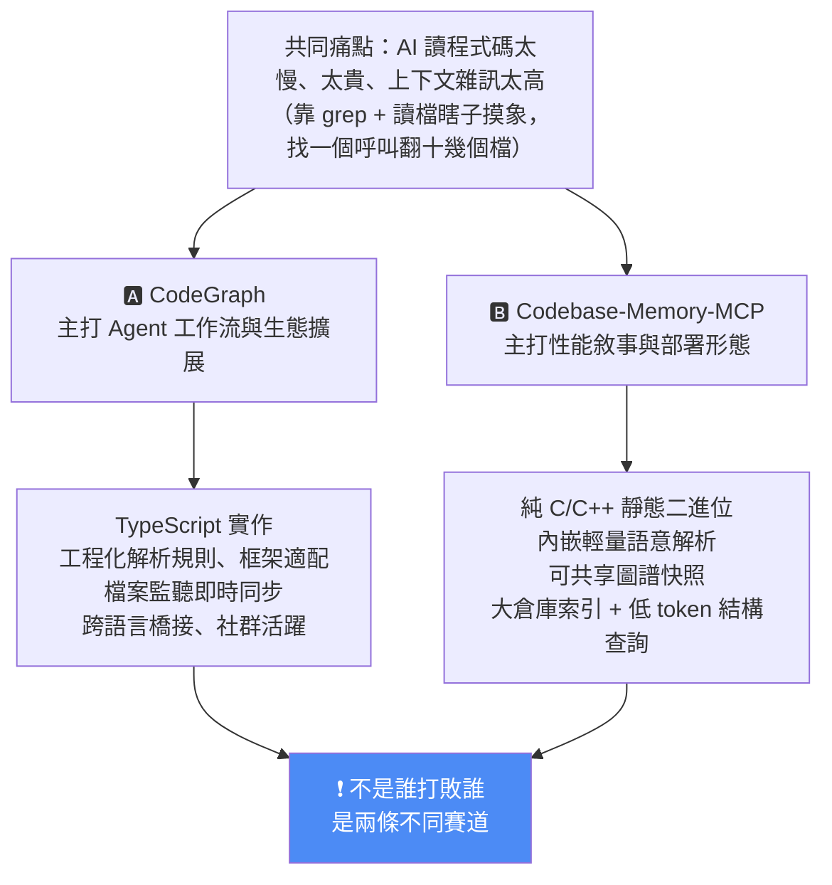
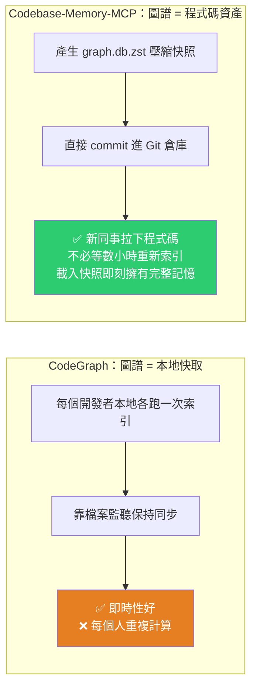
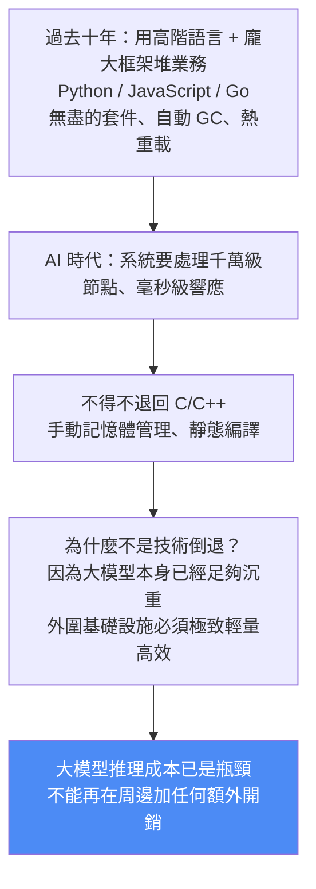

# 「Token 省 120 倍」該怎麼讀?Codebase-Memory-MCP vs CodeGraph:同一個痛點的兩條路線

> 整理自 YouTube 頻道 **Why QQ(為什麼叫 QQ)**〈Token 消耗減少 120 倍?Codebase-Memory-MCP 的性能突破原理解析〉(2026-07-04,約 10 分鐘,官方簡中字幕)。
>
> 這篇是本庫 [[codebase-memory-treesitter-knowledge-graph-mcp]](從 arXiv 論文整理)的**工程視角補充**:那篇講「這套系統怎麼做的、評測數字如何」,**這篇講「120 倍該怎麼正確解讀」,以及它跟先行者 CodeGraph 為什麼走了完全不同的兩條路。**
>
> 全片最精煉的一句:**別用戰術上的堆 Token,掩蓋戰略上的索引缺失。**

---

## 一句話總結

---

## 一、先把「120 倍」講清楚(本片最該記的一段)

影片作者的處理方式很誠實,直接把三個層次的數字拆開:

| 來源 | 數字 | 適用範圍 |
|---|---|---|
| **arXiv 論文評估** | token 約減少 **10 倍**、工具呼叫減少 **2.1 倍** | 12 類標準化問題 × 31 語言的系統性評測 |
| **README 的 120 倍** | 約 **3,400 token 取代約 412,000 token** | **僅針對 5 個結構查詢的 micro-benchmark** |
| 索引效能 | Linux kernel(2,800 萬行、7.5 萬檔)**約 3 分鐘** | — |

> **「這個數據很強,但不能泛化成所有任務都省 120 倍。」**

這是評估任何 AI 基礎設施工具時該有的基本紀律:**先問這個數字是 micro-benchmark 還是系統性評測、樣本是什麼、能不能外推。** 10 倍(論文,廣泛任務)與 120 倍(README,5 個精選結構查詢)是兩種完全不同性質的宣稱,不該混用。

---

## 二、背景:為什麼社群要做程式碼知識圖譜

現在用 Cursor 或 Claude Code 寫程式,**AI 理解專案的方式基本上是「瞎子摸象」**:靠不斷呼叫 grep 或讀檔找上下文,找一個函式呼叫可能要來回翻十幾個檔、吃掉幾十萬 token。

算一筆帳:一個中等規模專案,AI 可能發起**幾百次工具呼叫**,每次幾千 token——一個月下來光這個專案的 API 帳單就很可觀。

**解法思路**:把程式碼的結構關係**預先計算好**,AI 查詢時直接走圖遍歷。

---

## 三、三個核心差異(拆原始碼看出來的)

### 差異 ①|技術棧與部署形態

| | **CodeGraph** | **Codebase-Memory-MCP** |
|---|---|---|
| 實作語言 | **TypeScript** | **純 C/C++** |
| 部署 | CLI 與 MCP 已以**自包含二進位**發布(不需裝 Node.js);**嵌入式 Library API 才需要 Node 22.5+** | **單一靜態二進位、零依賴** |
| 優勢 | 開發快、社群套件多,能輕易搞定各種 Web 框架的路由識別 | 極致效能 + 極簡部署,一行命令給整個團隊裝上,不用擔心版本衝突與依賴鏈 |

Codebase-Memory-MCP 用的兩個算法都是工業級的選擇:

- **LZ4** 做記憶體壓縮 —— 壓縮與解壓速度都遠超通用壓縮算法。
- **Aho-Corasick 自動機** 做多模式匹配 —— 多模式匹配的標準方案,**單次掃描就能找出所有匹配**。

索引 Linux kernel 時記憶體佔用控制得很嚴格,**建完圖立刻釋放**。

> 影片的評語:**這不是小優化,這是系統設計的根本差異。**

### 差異 ②|解析精度:靠外部規則 vs 內嵌語意解析

先講共同的難題:**Tree-sitter 很強,但它只能做語法解析**——它知道「這裡有個函式呼叫」,但**不知道這個函式具體在哪個檔案定義**,遇到同名函式或多型就更難。這正是傳統程式碼搜尋常回傳一堆無關結果的原因。

| | 做法 | 代價 |
|---|---|---|
| **CodeGraph** | 強調**工程化的解析規則與框架適配**(路由識別、動態分發、跨語言橋接) | 很實用也很成熟,但**每多支援一個新框架或複雜語言語意,規則維護成本就持續上升** |
| **Codebase-Memory-MCP** | **不依賴外部 LSP**,在 C 程式碼裡自己內嵌一套**輕量級符號與型別解析**,覆蓋 Python / TypeScript / Go / Java 等語言族,能識別常見的呼叫、匯入、繼承、多載關係 | 覆蓋面靠自己實作,深度受限 |

**內嵌語意解析的實際效果**:當 AI 問「這個介面被誰呼叫」時,回傳的更接近**符號級 / 檔案級 / 行號級的呼叫路徑**,而不是一堆「可能相關」的程式碼片段。

> **資訊密度提升、雜訊降低 → AI 需要處理的上下文就少了。這才是 benchmark 上 token 大幅下降的真正原因。**

### 差異 ③|對「圖譜」的定位:個人快取 vs 團隊資產

這是影片認為最有工程巧思的一點:

快照用 **zstd** 壓縮,README 稱典型壓縮率約 **8–13 倍**(實際大小視倉庫而定)。

> **把計算成本前置、讓團隊共享成果**,是典型的工程思維——它把知識圖譜**從「個人工具」變成「團隊資產」**。

---

## 四、社群現況:不是誰打敗誰,是兩條賽道

影片作者翻了兩個專案的 GitHub(以 2026-07 影片發布時為準):

| | CodeGraph | Codebase-Memory-MCP |
|---|---|---|
| Star | **57.3k** | **25.5k** |
| 起步 | **更早,生態更成熟** | 帶著一篇 arXiv 論文空降 |
| 語言覆蓋 | **20+ 語言(含 COBOL)** | Tree-sitter 層宣稱覆蓋 **158 種語言**(含 CUDA、Erlang) |
| 不可取代之處 | **跨語言橋接**(例如 React Native 與 iOS 原生程式碼之間的呼叫);社群活躍,200+ PR 待審 | 大倉庫索引、低 token 結構查詢、可共享快照 |
| 路線 | 面向 **Agent 工作流**的本地圖譜工具(框架路由、檔案監聽、開發者體驗) | 把**性能敘事推到極致** |

> 星數更多的是 CodeGraph,但近期聲量明顯是 Codebase-Memory-MCP 衝上來——**這說明的不是功能對比的勝負,而是兩個專案走了不同路線。**

---

## 五、影片真正的論點:瓶頸不是模型智商,是「輸入頻寬」

> **我們以為 AI 編程的瓶頸是模型智商,其實現在的瓶頸是「輸入頻寬」。**
>
> 你用 GPT-5.6 或 Fable 5,這些模型的智商已經不是問題了;問題是**你給它們的上下文品質太差**。
>
> **大模型就像一個頂級學霸,但我們偏偏讓他去翻垃圾桶找線索。**

由此得出的範式轉變:**在提升模型參數之前,先提升上下文的信噪比,收益要大得多**——從「給模型更多能力」轉向「給模型更好的資訊」。

### 延伸出的思維框架:AI 時代的「基建降級」

> **在延遲與部署成本敏感的鏈路裡,複雜執行時會被更輕量的實作持續擠壓。** 我們會看到越來越多 AI 基礎設施被用 C/C++、Rust 重寫——**效能不再是可選項,而是必選項。**

### 作者的三個預測

1. **預計算知識圖譜會成為標準做法**(不是說 CodeGraph 會消失,而是這個模式會標準化)。
2. **未來的程式碼倉庫裡,除了原始碼一定還會有一個標準化的知識圖譜檔案**——就像現在的 `package.json` 或 `requirements.txt` 一樣,每個專案都會有一個 `.graph.db` 或類似的東西。**AI 不再需要「閱讀」程式碼,它直接「查詢」程式碼的結構。**
3. **這類工具會逐漸被 IDE 內建**(Cursor、VS Code、JetBrains 都會整合),到那時獨立工具可能就沒那麼重要——但在那之前,先驅者已經改變了整個行業的思維方式。

影片還點出一個常被忽略的後果:**當 AI 能精確定位每一處呼叫關係時,百萬行級的祖傳屎山程式碼才迎來真正的重構曙光——重構會從「人工的噩夢」變成「一個可計算的問題」。**

---

## 六、應用案例

### 案例 1|讀到任何「省 N 倍 token」宣稱時的三個追問

直接把本片的處理方式當成 checklist:

1. **這個數字是 micro-benchmark 還是系統性評測?**(120 倍來自 5 個精選結構查詢,10 倍才是 31 語言的系統評測)
2. **樣本與任務型態是什麼?**(結構查詢 vs 需要完整原始碼的任務,結果會差很多)
3. **誰做的評測?**(專案自己的 README vs 有審查的論文)

**這三問可以直接套用到任何 agent 工具、RAG 方案、context 壓縮方案的宣傳數字上。**

### 案例 2|選型:你該用哪一個?

| 你的情境 | 建議 |
|---|---|
| 多語言混合、有**跨語言橋接**需求(RN ↔ iOS 原生)、需要框架路由識別 | **CodeGraph** —— 這是它不可取代的優勢 |
| **超大單體倉庫**、想壓低結構查詢的 token、部署環境受限(不想裝 runtime) | **Codebase-Memory-MCP** —— 單一靜態二進位、零依賴 |
| **團隊多人**、新人 onboarding 成本高 | **Codebase-Memory-MCP** —— 圖譜快照 commit 進 Git,新人拉下程式碼即刻有完整記憶 |
| 需求還不明確、只是想試試 | 先都別裝。**先確認你的 AI 真的把大量 token 花在「找檔案」上**(看帳單與 trace),再決定 |

### 案例 3|把「圖譜快照」的思路套到自己的專案

即使不用這兩個工具,**「把昂貴的預計算結果變成可提交的資產」**這個模式本身就值得抄:

- 把 codebase 的架構摘要、模組依賴圖、關鍵約定,**產出成檔案並 commit 進 repo**,而不是每次讓 agent 重新探索一遍。
- 這其實就是 CLAUDE.md / AGENTS.md 的延伸邏輯——**只是把「人寫的規則」擴大成「機器算出來的結構」**。
- 呼應本庫 [[llm-wiki-karpathy]] 的「編譯一次、之後保持更新」與 [[claude-md-from-zero-to-mastery]] 的「Explore subagent 找得到的別寫進 CLAUDE.md」——**兩者的分界正是:能被機器精確算出來的,就別讓模型每次重新猜。**

### 案例 4|對照本庫既有的兩篇實測,得出更完整的判斷

把三篇放在一起看,結論比任一篇單獨看都清楚:

| 來源 | 結論 |
|---|---|
| [[codebase-memory-treesitter-knowledge-graph-mcp]](arXiv 論文,31 repo) | 品質 83% vs 檔案探索 92%,**token 少 10 倍**;結構查詢圖贏,需要完整原始碼時文字探索贏 |
| [[graphify-code-knowledge-graph-real-world-test]](wow,單一真實系統 35 檔) | 前 8 題**與純 grep 打平**,只省 24% token;跨語言(Shell→Python)邊建不起來 |
| 本篇(Why QQ,兩專案原始碼對比) | 120 倍是 micro-benchmark;真正價值在**資訊密度提升、雜訊降低** |

**合起來的判準:codebase 越大、問題越偏「結構關係」,圖譜的邊際效益越高;小 codebase + 強模型 + 找特徵型問題,grep 就夠了。**

### 案例 5|「基建降級」對技術選型的實際意義

如果你正在做 AI 周邊的基礎設施(索引器、快取層、代理層、監控),本片的論點值得認真對待:**大模型推理成本已經是瓶頸,你不能再在周邊加任何額外開銷。**

實務判準:**這段程式碼在請求鏈路上嗎?** 在鏈路上的(每次呼叫都要跑)→ 往輕量、靜態編譯、零依賴的方向做;不在鏈路上的(離線、批次)→ 用開發效率高的語言就好。**別對整個系統一刀切。**

---

## 重點回顧(TL;DR)

- **120 倍要打折讀**:那是 **5 個結構查詢的 micro-benchmark**(3,400 取代 412,000 token);**論文的系統性評測是 10 倍 token、2.1 倍工具呼叫**。不能泛化。
- **三個核心差異**:①TypeScript + 框架規則 vs **純 C/C++ 靜態二進位**(LZ4 + Aho-Corasick);②外部工程化規則 vs **內嵌輕量符號/型別解析**(不依賴 LSP);③圖譜是**本地快取**(各自索引 + 檔案監聽)vs **團隊資產**(`graph.db.zst` 快照 commit 進 Git,zstd 壓縮約 8–13 倍)。
- **不是誰打敗誰**:CodeGraph 星數更多(57.3k vs 25.5k)、生態更成熟、**跨語言橋接不可取代**;Codebase-Memory-MCP 把性能敘事推到極致。兩條賽道。
- **真正的論點**:**瓶頸不是模型智商,是輸入頻寬。** 大模型是頂級學霸,我們卻讓他翻垃圾桶找線索。**先提升上下文信噪比,收益大過提升模型參數。**
- **基建降級**:大模型本身夠沉重,外圍基礎設施必須極致輕量 → AI 基礎設施會持續被 C/C++/Rust 重寫,**效能不再是可選項**。
- **預測**:每個 repo 都會有一個標準化的圖譜檔(像 `package.json` 一樣);AI 從「閱讀」程式碼轉向「查詢」結構;**祖傳屎山的重構會從人工噩夢變成可計算的問題**。
- **金句**:**別用戰術上的堆 Token,掩蓋戰略上的索引缺失。**

---

## 來源

- Why QQ(為什麼叫 QQ,YouTube),〈Token 消耗減少 120 倍?Codebase-Memory-MCP 的性能突破原理解析〉(2026-07-04,約 10 分鐘):<https://www.youtube.com/watch?v=7pSZx9-VT3k>
  - 本文依該片**官方簡體中文字幕**整理並轉寫為繁體中文(非 Whisper 轉錄)。星數等社群數據為影片發布時(2026-07)的狀態。
- Codebase-Memory-MCP 專案(DeusData,MIT):<https://github.com/DeusData/codebase-memory-mcp>
- 延伸(本庫):
  - [Codebase-Memory:Tree-Sitter 知識圖譜 + MCP(arXiv 論文完整拆解)](./codebase-memory-treesitter-knowledge-graph-mcp.md) —— 系統架構、14 個 MCP 工具、31 repo 評測、供應鏈資安管線
  - [Graphify 實戰壓測:知識圖譜打不贏 grep?](./graphify-code-knowledge-graph-real-world-test.md) —— 真實生產系統的反直覺負面結果
  - [到底需不需要 GraphRAG?9 種 RAG 方案實測](./is-graphrag-needed-rag-variants-comparison.md) · [Grep 就夠了嗎?](./grep-vs-vector-agentic-search.md) · [LLM Wiki(Karpathy)](./llm-wiki-karpathy.md)
