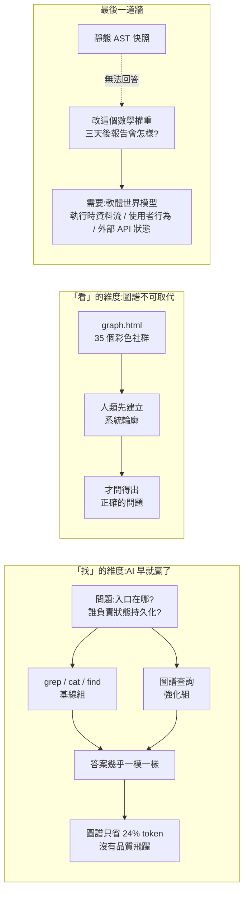
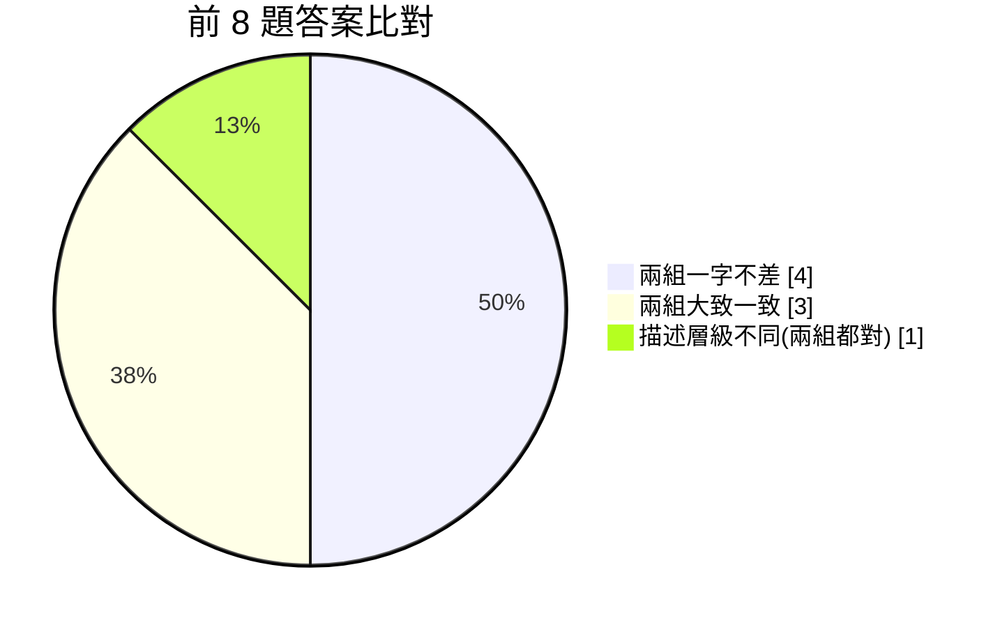
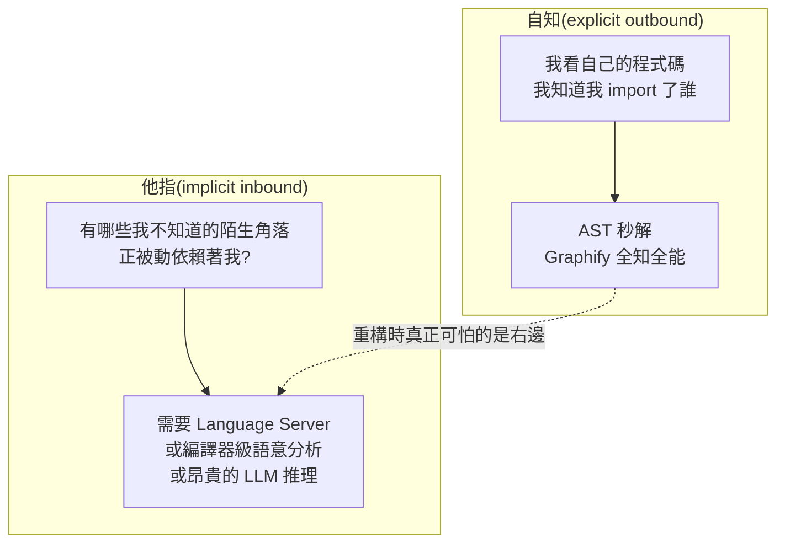
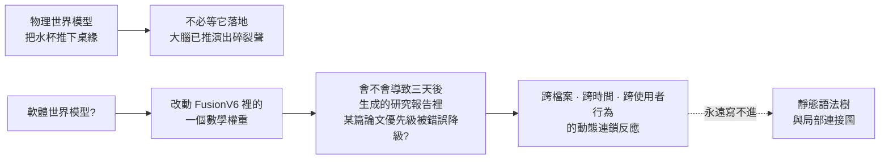

# Graphify 實戰壓測:10 萬 Star 的程式碼知識圖譜,打不贏 grep?「找」與「看」的分水嶺

> 整理自 YouTube 頻道 **wow**〈AI Coding 的最後一道牆:我用 10 萬 Star 開源知識圖譜挑戰真實軟體系統〉(2026-07-28,18:52)。作者把 GitHub 上近 10 萬星的 [Graphify](https://github.com/Graphify-Labs/graphify) 接進自己的 Hermes Agent / Codex 框架,對**真實生產環境**(自建的量化情報系統 OmniHunter)做了一次 A/B 壓測。結論反直覺:**在「找檔案、找呼叫鏈」這件事上,知識圖譜並沒有降維打擊 grep;它真正無可取代的價值,是給「人」建立系統認知,以及暴露出 AI Coding 的最後一道牆——缺少軟體世界模型。**

---

## 一句話總結



---

## 一、受測方:Graphify 是什麼(已 clone 原始碼確認)

Graphify(Graphify-Labs,YC S26,PyPI 套件名 `graphifyy`)是一個**掛在 AI coding assistant 上的 skill**:在任何 repo 打 `/graphify .`,它把整個專案(程式碼 + 文件 + SQL schema + config + PDF)變成**可查詢的知識圖譜**,取代 grep。

### 核心管線(`ARCHITECTURE.md`)

```
detect() → extract() → build_graph() → cluster() → analyze() → report() → export()
```

各階段各自一個模組、只透過 plain dict 與 NetworkX graph 溝通,除了 `graphify-out/` 之外**沒有共享狀態、沒有副作用**。

| 模組 | 職責 |
|---|---|
| `detect.py` | 目錄 → 過濾後的檔案清單 |
| `extract.py` | 單檔 → `{nodes, edges}`(tree-sitter AST 解析) |
| `build.py` | 抽取結果 → `nx.Graph` |
| `cluster.py` | 圖 → 每個節點掛上 `community` 屬性 |
| `analyze.py` | 圖 → god nodes / 意外連結 / 建議提問 |
| `export.py` | 圖 → Obsidian vault、`graph.json`、`graph.html`、`graph.svg` |
| `serve.py` | 圖檔 → MCP stdio server |
| `benchmark.py` | 圖 → 「整個 corpus 的 token」vs「子圖查詢的 token」對照 |

### 三個關鍵設計決策

1. **程式碼零 LLM、全本地**:走 tree-sitter AST,**確定性解析**,不出機器。只有文件/PDF/圖片/影片才走語意 pass(用你 assistant 的模型或自備 API key)。
2. **每條邊都要標可信度**:
   | 標籤 | 意義 |
   |---|---|
   | `EXTRACTED` | 原始碼白紙黑字寫死的(import 陳述、直接呼叫) |
   | `INFERRED` | 合理推導(call-graph 第二輪、上下文共現) |
   | `AMBIGUOUS` | 不確定,寫進 `GRAPH_REPORT.md` 交給人審 |
   `validate.py` 會在 `build_graph()` 吃進去之前強制檢查 schema。
3. **不是向量索引**:沒有 embedding、沒有 vector store,是一張**真的可以走訪**的圖——問問題、追兩個東西之間的路徑、解釋某個概念。

### MCP 工具面(`serve.py`)

`query_graph`(BFS/DFS 搜尋,回傳相關節點與邊的文字上下文)、`get_node`、`get_neighbors`、`get_community`、`god_nodes`(最多連線的節點 = 核心抽象)、`graph_stats`、`shortest_path`,另有 PR 相關的 `list_prs` / `get_pr_impact` / `triage_prs`。extractors 目錄涵蓋 Rust/Go/C#/Dart/Elixir/Julia/Fortran/Verilog/Pascal/PowerShell/Terraform/SQL/Blade/Razor… 數十種語言。

官方 `BENCHMARKS.md`(2026-07-05)自報:LOCOMO recall@10 **0.497**(mem0 0.048、BM25 0.362)、LOCOMO QA **45.3%**、LongMemEval-S **76%**,建圖 LLM 成本 **$0**、ingest 約 $1.40(supermemory $15.67)。

---

## 二、測試靶場:OmniHunter(真實生產系統,不是玩具)

作者刻意不用範例專案,而是拿自己每天在區域網路伺服器上**全自動運轉**的多 agent 情報系統開刀:

- **35 個核心檔案、接近 18,000 行 Python**。
- 每天吞吐 GitHub / Hacker News / arXiv 論文庫 / 華爾街日報等 **13 種異構資料源**。
- 內部 **4 個分工不同的 AI agent 非同步協作**,有各自的 `SOMD` 核心憲法、互相校驗的**紅隊審查機制**、一個負責核心反身性計算的 **V9.1 數學引擎**。
- 最終把情報匯進一份含 100 多項預測狀態的 master lock JSON 帳本。

作者的形容很到位:面對這種**充滿時序狀態、檔案互相交織**的系統,即便是寫了十幾年程式的資深架構師,不用 IDE 順藤摸瓜看上兩天,也像在看天書。

### 建圖成績:2 秒、0 token

在這個 repo 根目錄敲下建圖指令,結果是:

| 指標 | 數字 |
|---|---|
| 耗時 | **不到 2 秒** |
| input token | **0** |
| output token | **0** |
| 產出 | `graph.html`(可視化)+ `GRAPH_REPORT.md`(架構報告)+ `graph.json`(圖譜) |
| 圖規模 | **280 個節點、283 條邊、35 個社群** |
| 抽取率 | **100%** |

作者強調這個「100% 提取」的含金量:**這張圖裡的每一條連線,都是原始碼裡寫死的物理事實,沒有任何一條邊是大模型靠機率猜出來的。** 在所有工具都在拚命把程式碼塞給 LLM 讓它總結、泛化的時代,Graphify 保持了一種罕見甚至有點古典的克制——**它拒絕幻想,只提供 100% 確定性的結構。**

---

## 三、實驗設計:9 個硬核架構問題,兩組平行宇宙

- **模型刻意選弱的**:底層掛 **MiniMax M2.7**。作者的理由很清楚——「如果用 GPT-5.6 或 Opus 5 這種強模型,我這個小型 codebase 可能根本不需要 Graphify」。要驗證圖譜的邊際價值,就不能讓強模型的原生能力把差異吃掉。
- **對照組(基線)**:AI 關小黑屋,沒有任何圖譜,只能像人類工程師一樣用 grep 全域搜尋、cat 看檔、find 找路徑。
- **實驗組(強化)**:AI 可任意呼叫圖譜工具——找兩個節點之間的最短路徑、解釋某模組的全部鄰接節點。

題目範例:
1. 這個系統真正的執行入口在哪裡?
2. 狀態持久化操作到底有哪幾個檔案負責?
3. 如果外部的 Brave 搜尋 API 失效,整個 codebase 的錯誤鏈會怎麼傳導?

---

## 四、結果 (1):前 8 題——**幾乎打平**



| 指標 | 基線組(純 grep) | 強化組(有圖譜) |
|---|---|---|
| 耗時 | 142 秒 | **148 秒(反而略慢)** |
| token 消耗 | 48,494 | **36,787** |
| 節省 | — | **約 24% token** |
| 實質答案品質 | — | **幾乎相同** |

省 token 的機制很單純:強化組不需要像無頭蒼蠅一樣把整個檔案印出來看,直接查圖譜節點,砍掉大量失措的對話與無效的 cat 操作。

**但關鍵在於:兩組交出的實質架構答案幾乎打平。** 無論是找核心檔案的呼叫鏈、追溯系統入口,還是排查 API 故障傳導路線,有圖譜的 AI 和只有 grep 的 AI,**答案品質與找出的檔案行號幾乎一模一樣**。

甚至在某些題目上**基線組略佔上風**:找狀態持久化檔案時,**純搜尋找出 6 個關聯檔案,而過度依賴局部圖譜的強化組只找出 4 個**。

### 為什麼?因為我們低估了現代 AI 的基礎能力

作者的比喻:這 8 題本質上都是「在 codebase 裡找特徵」,像在一座極大的圖書館裡找一句莎士比亞名言。

- **圖譜組** = 拿到一張極其精密的數位索引卡片。
- **基線組** = 沒有卡片,但擁有**一秒鐘翻完十萬頁書且過目不忘**的超能力。

而後者連 MiniMax M2.7 這種中階模型都能輕易做到。**找檔案、找行號、找顯性函式呼叫,早就不再是頂級大模型的核心瓶頸了。** 圖譜在這類任務上只能讓它更優雅、更省 token,**不能讓它產生質的認知飛躍**。

> 第一個反思:**知識圖譜不是 agent 提升自動化效率的萬靈丹;在「找」的維度上,AI 早就贏了。**

---

## 五、結果 (2):第 9 題——變更影響分析,牆出現了

第 9 題是作者請 ChatGPT review 實驗方案時**堅持要加進去**的,它直擊軟體工程的靈魂:

> 假設我要重構 `FusionV6.py`(最核心的反身性計算引擎模組),請告訴我:改動它會牽連炸掉全系統裡的哪些外部檔案與資料流?

這不是搜尋,這是**變更影響分析(change impact analysis)**。

強化組的 AI 顯然意識到這是重量級任務,在後台**連續觸發了三次圖譜查詢**,試圖找出 `FusionV6.py` 到其他核心業務腳本之間的路徑。

**但 `shortest_path` 回傳了 `NoPathFound`。**

原因很物理:`hunter.py` 的外層是 **Shell 腳本**,`FusionV6.py` 是 **Python**,而 **AST 解析不會建立 Shell → Python 的呼叫邊**。

最終圖譜組仍然整理出一份分層影響分析報告(直接呼叫鏈、輸入依賴、輸出依賴、高風險文件約束),也就是說**它不是什麼都沒找到——它找到了「直接呼叫鏈 + 資料依賴 + 文件約束」這三層**,但它確實**沒有找到 Shell → Python 這種隱性的層級關係**。代價是:圖譜組這題比基線組**慢了三倍**。

### 根因:`AST Only` 是取捨,不是失誤

Codex 在推理日誌裡寫下的那句話,其實就是答案:

> `AST Only Mode, No Cross-File Relation Engine`

作者從中提煉出一組非常有哲學意味的區別:



- **自知**:「我引用了誰」——顯性,AST 一掃就有。
- **他指**:「有哪些我不知道的角落在被動依賴我」——隱性,而**重構時真正讓人害怕的正是這個**。

在這張圖譜的認知世界裡,它非常清楚 `FusionV6.py` **內部**哪個函式怎麼呼叫 `compute_matrix`——**在檔案內部它是全知全能的神**;但它不知道有哪幾個外部檔案在頂部偷偷 `import` 了 FusionV6。

要建立精準的「他指」關係,往往需要極度消耗資源的 language server、甚至編譯器級語意分析,或讓大模型介入做昂貴推理。**Graphify 為了保住「不到 2 秒、零 token、純本地」的極致優雅,選了輕量的結構抽取路徑。** 因此它天然更擅長描述**程式碼內部結構**,而不是完整的**軟體執行依賴**。

> 這不是失誤,是極其高級的工程取捨。但正是這個取捨讓我們看清:**單純的靜態程式碼圖譜,根本無法回答「牽一髮而動全身」的工程影響問題。**

---

## 六、那 10 萬顆星是虛的嗎?不是——價值在「看」不在「找」

當作者關掉命令列,在瀏覽器裡直接打開那個**不需要任何伺服器、本地渲染**的 `graph.html` 時:

OmniHunter 這個在他腦海裡始終只是一堆冷冰冰檔名的系統,**第一次以一種有機生命體的物理形態展現出來**。Graphify 用內建的 Leiden 社群發現演算法,自動把 280 個散落節點聚成 **35 個彩色群落**,而且神奇地給群落打上了標籤:「這裡是大一統加權法的聚落」、「那裡是反身性計算引擎的聚落」、「邊緣是特權注入通道的護城河」。

作者由此提出全文最重要的一句分水嶺:

> **圖譜是讓 AI 去「找」,而這張圖是讓我「看」。**

| | 找(AI) | 看(人) |
|---|---|---|
| 是否帶目的 | **有**——我要修一個 bug、找一行具體的程式碼 | **沒有**——我還不知道該問什麼問題 |
| 比喻 | 黑暗房間裡的手電筒,光斑很亮,但**永遠看不見整個房間** | 站在高處,先讓 35 個色彩斑斕的聚落與樞紐節點**砸在視網膜上** |
| 工具 | 全文搜尋能力已經是一把極強的手電筒 | 只有可視化圖譜做得到 |
| 產出 | 一個答案 | **一個「能問出正確問題」的認知高地** |

當你接手一個龐大的祖傳 codebase 時,你需要先在大腦裡建立起這座「程式碼城市」的輪廓,**然後才能向 AI 問出那個正確的問題**。

> 第二個反思:**在今天,圖譜的價值更多體現在「幫助人類建立系統認知」,而不是直接替代 AI 的搜尋過程。**

---

## 七、最後一道牆:AI Coding 缺的是「軟體世界模型」

作者跳出這個開源專案,拋出終極問題:

現在的 AI 缺智力嗎?**不缺**——它們看程式碼比人快一萬倍。AI Coding Agent 真正缺少的,是**一個面向軟體系統的世界模型**。



**真正的系統是活的。** 它的依賴關係存在於:

- **執行時的資料流**裡,
- **使用者的點擊**裡,
- **極其脆弱的外部 API 狀態**裡。

當前的外掛圖譜無論多精妙,都只是給程式碼骨架**拍了一張極高解析度的靜態 X 光片**。而真正能讓 AI 從「高級打字員」進化為「獨立軟體架構師」的,不是一張更龐大更緻密的靜態節點圖,而是**能模擬程式碼在不同環境下如何動態形變、如何傳導風險的軟體世界模型**——這可能得靠最前沿模型的內化能力。

但作者的收尾很有力:**當我們開始意識到「看」與「找」的區別,開始區分「靜態拓撲」與「動態因果」的鴻溝時,我們其實已經站在了下一次認知升級的起點。**

---

## 應用案例:這篇實驗怎麼改變你的做法

### 案例 1|接手祖傳專案的第一天:先建圖給「人」看,不是給 agent 用

新人 onboarding 一個 18,000 行的服務。過去做法是叫 Claude Code「幫我總結這個 repo 架構」——它會讀一堆檔、燒幾萬 token、交出一段扁平的文字。改成:

```bash
uv tool install graphifyy
graphify install
# 在 AI assistant 裡:
/graphify .
```

2 秒後打開 `graph.html`,先用眼睛掃 35 個社群、找出 `god_nodes`(連線最多的核心抽象),再拿 `GRAPH_REPORT.md` 裡的「建議提問」當作跟 agent 對話的起手式。**圖是給你建立輪廓用的,提問才交給 agent。**

### 案例 2|不要為了省 token 而在「找檔案」上加一層圖譜

如果你的 agent 已經跑在 Opus 5 / GPT-5.6 這類強模型上,而 codebase 又只有幾十個檔案,**這個實驗直接告訴你:別加了**。24% token 節省換來的是額外的建圖維護成本、一層新的失效模式(`NoPathFound`),而且某些題目上還輸給純 grep。真正該加圖譜的門檻是:**模型偏弱、codebase 巨大、或問題本身是關係型的**(呼應 [[grep-vs-vector-agentic-search]]:沒有單一最優,要看問題型態與 harness)。

### 案例 3|做變更影響分析時,一定要補上「他指」那一半

若你真的要靠工具回答「改這個模組會炸到誰」,靜態 AST 圖只給你一半答案。實務上要補:

1. **LSP / 編譯器級的 find-references**(補跨檔案 inbound import)。
2. **跨語言黏合層的人工標註**——像本例的 Shell → Python,AST 天生連不起來,得靠 config、CI 設定檔或手動邊補進圖裡。
3. **執行時 tracing**(OpenTelemetry / 日誌)補動態資料流。

也就是說:把 `EXTRACTED`(AST 給的)當成**地基**,把 `INFERRED` / `AMBIGUOUS` 當成**待人審清單**,別把整張圖當成完整真相。

### 案例 4|設計自家 agent 評測時,刻意選弱模型

本片最值得抄的方法論細節:**作者刻意用 MiniMax M2.7 而不是最強模型**。因為強模型的原生能力會把工具的邊際價值整個吃掉,你會得到「加了也差不多」的假結論——但你分不清是工具沒用,還是模型太強根本不需要它。**要量測工具價值,就要把模型能力壓到工具該發揮作用的區間。** 這個技巧同樣適用於評估 skill、MCP、RAG 管線。

### 案例 5|「我不知道該問什麼」是一種真實的工作狀態,值得為它配工具

多數 AI 工具都預設你已經有一個明確問題。但接手陌生系統、做技術債盤點、寫架構決策紀錄(ADR)時,你處在「不知道該問什麼」的狀態。這時該配的是**可視化 / 索引 / 社群聚類**這類「看」的工具,而不是更強的搜尋。這也是本倉庫 [[llm-wiki-karpathy]] 主張「先讀 index 導航再鑽入」的同一件事。

---

## 我的重點筆記

- **確定性 vs 覆蓋率,是圖譜工具的核心取捨。** Graphify 選了「2 秒 / 0 token / 100% 確定」,代價是放棄跨檔案 inbound 關係。任何宣稱「全都要」的工具,你都該去問它把成本藏在哪(LSP?編譯?LLM 推理?)。
- **`EXTRACTED` / `INFERRED` / `AMBIGUOUS` 這種可信度標註值得抄進你自己的任何抽取管線。** 它讓「工具說的」與「工具猜的」在下游可分辨,這是把 AI 產物拿去做決策的前提。
- **token 省下來 ≠ 品質變好。** 這次實驗省了 24% token 但答案打平、時間還略長。評估任何 context 工程手段時,**品質、token、延遲要三個一起看**(對照 [[is-graphrag-needed-rag-variants-comparison]] 的結論:精緻 GraphRAG 常輸給簡單 1-hop)。
- **與 [[codebase-memory-treesitter-knowledge-graph-mcp]] 對照著讀最有意思**:那篇論文在 31 個 repo 上測出「品質 83% vs 92%、token 省 10 倍」,本片在單一真實系統上測出「品質打平、token 省 24%」。差異來源很可能是:論文用的 repo 更大、問題更偏關係型,而本片 codebase 只有 35 檔、問題偏「找特徵」。**兩者一起看的結論是:codebase 越大、問題越關係型,圖譜的邊際效益越高。**
- **最後一道牆的判準很好用**:當你評估任何 AI coding 工具時,問它一句「它能不能回答『改這裡,三天後的下游輸出會怎樣』?」——回答不了的,都還在靜態 X 光片的層次。

---

## 來源

- wow(YouTube),〈AI Coding 的最後一道牆:我用 10 萬 Star 開源知識圖譜挑戰真實軟體系統〉(2026-07-28,18:52):<https://www.youtube.com/watch?v=luN-yydHpYY>
  - ⚠️ 該片無官方字幕也無自動字幕,**逐字稿以 CPU 版 faster-whisper(small/int8,`vad_filter=True`)轉錄取得,非官方字幕**,可能有少量聽寫誤差(專有名詞如 tree-sitter、Codex、Hermes、Leiden 已依上下文與原始碼校正)。
- Graphify 原始碼(Graphify-Labs,Apache-2.0 / MIT 雙授權,YC S26):<https://github.com/Graphify-Labs/graphify> — 本文的架構、管線、MCP 工具、可信度標籤等技術細節,係 clone 後直接閱讀 `ARCHITECTURE.md`、`README.md`、`BENCHMARKS.md`、`graphify/serve.py`、`graphify/benchmark.py`、`graphify/extractors/` 整理而得。
- Graphify 官方網站與 waitlist:<https://graphify.com>
- 相關背景技術:tree-sitter(增量解析)、Leiden 社群發現演算法、Model Context Protocol(MCP)。
