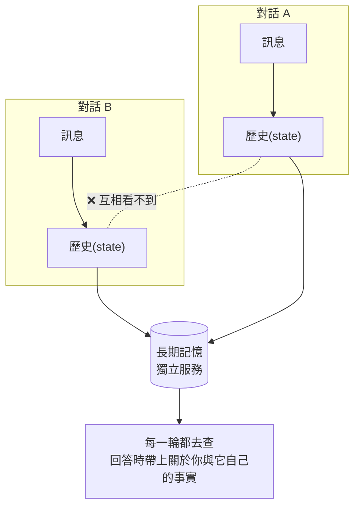
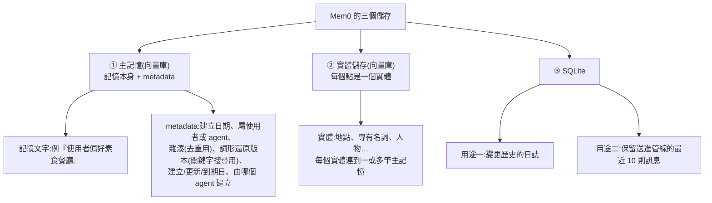
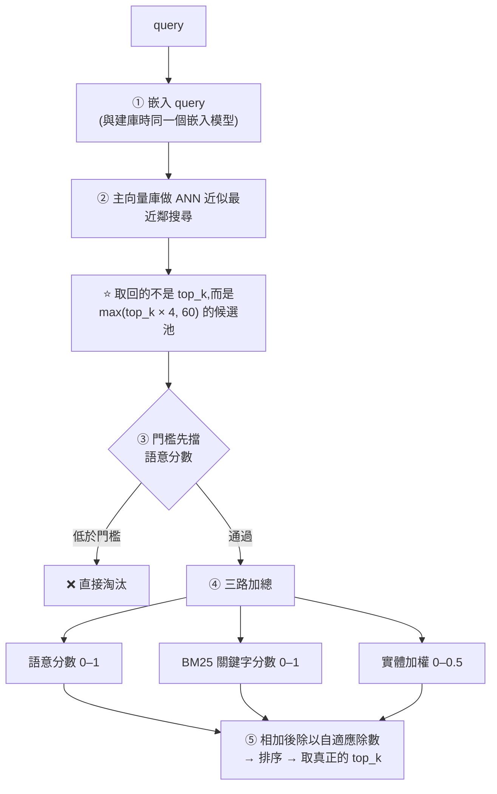
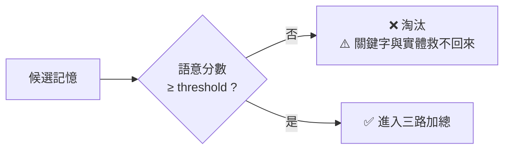

# Mem0 記憶架構拆解:三個儲存、抽取管線,與那個「加起來再除以 2.5」的混合排序

> 整理自 YouTube 頻道 **Hugging Face**〈Agent Memory EXPLAINED - Complete Architecture〉(2026-08-17,約 28.5 分鐘,主講 Alejandro AO,官方字幕)。
> 依 CLAUDE.md 慣例,另**實地 clone `mem0ai/mem0` 讀原始碼核實**(63.6K stars,Apache-2.0),文中標出**兩處影片講得不夠精確的地方**。

> 📎 **強烈建議搭配 [[agent-memory-survey-forms-functions-dynamics]] 看** —— 那篇是**地圖**(形式/功能/動態三切面),這篇是**其中一個實作走一遍**。兩篇正好互為表裡。
> 其他相關:[[memharness-memory-reconstructed-not-replayed]]、[[project-cairn-experience-to-knowledge-skill]]、[[self-improving-knowledge-base-claude-cowork]]

---

## 一句話總結

**長期記憶不是「向量搜尋」四個字就能打發的。** Mem0 用三個儲存、一條 LLM 抽取管線,和一套「語意 + 關鍵字 + 實體」三路加總的混合排序 —— **而排序裡最關鍵的設計,是門檻只擋語意分數,關鍵字與實體救不回語意上不相關的記憶。**

---

## 一、先分清楚:對話記憶 ≠ 長期記憶

影片開場的區分很乾淨:

> **LLM 是無狀態機器。** 你送一個 prompt,它處理完給你 completion;再送一個,它不記得前一個。
> 所以要它記得剛才講過什麼,就得**把整段對話歷史連同新 prompt 一起送過去** —— **這就是對話記憶**。

而 agent harness 幫你做的正是這件事:每次把訊息與回應追加進 state 裡的歷史,下次整包再送。

**但開一個新對話,它就什麼都不記得了 —— 因為那是另一個 context。**



### ⭐ 三條設計原則(影片點出的)

1. **必須外置於對話** —— 不能跟 session 放在同一個檔案或同一個 store,要**跨 session 持久**
2. **可以跨 agent 共用** —— 如果記憶是以**使用者**為中心的,那同一份記憶可以給 ChatGPT、Claude、Pi 等不同 agent 共用
3. **要嘛給 agent 工具讓它自己探索記憶,要嘛在每一輪自動做攝取與檢索**(至少每次對話結束後做一次)

> 用 [[agent-memory-survey-forms-functions-dynamics]] 的語彙:這裡談的是 **Agent Memory**(跨任務累積),不是 context engineering(窗口內最佳化)。**第 1 條原則正是兩者的分界線。**

---

## 二、三個儲存



**② 實體儲存的用途**,影片舉的例子很好懂:

> 如果記憶是「我在巴黎最喜歡的區是蒙馬特」,那實體就是**蒙馬特**與**巴黎**。
> 當我問關於巴黎的問題時,系統會取出「巴黎」這個實體,**再看有哪些記憶連到它** —— 其中就有我那條偏好。

**③ SQLite 保留最近 10 則訊息的用途**很實際:**判斷代名詞**。新訊息如果是「它很棒」或「他很擅長這個」,沒有前文就不知道「它/他」指什麼。

**✅ 原始碼核實**:`storage.py` 裡確實是 `... ORDER BY created_at DESC LIMIT 10` —— **「最近 10 則」是寫死的數字,不是約略說法。**

---

## 三、攝取(Ingestion):三種模式,只有一種是主角

攝取在**每個 agent 回合結束後**執行,輸入是該回合產生的訊息。

| 模式 | 做什麼 | 影片的評價 |
|---|---|---|
| **Procedural memory** | 把一串訊息**摘要成流程與動作**,之後可重現當時的工具呼叫與結果 | ⚠️ **「我覺得現在不太常用了」** —— 因為**直接從對話逐字稿抽出一個 skill 效果好得多** |
| **`infer=False`** | 把輸入訊息**直接嵌入丟進資料庫**,不做加工 | 最陽春 |
| **⭐ `infer=True`(預設)** | **觸發 LLM 抽取管線** | 最進階,也是影片的主軸 |

**✅ 原始碼核實**:`main.py` 的 `add()` 簽章確實是 `infer: bool = True`,而 `_add_to_vector_store()` 一開頭就 `if not infer:` 分流。

> ⭐ 影片對 procedural memory 的評語值得記:**「你可以直接從對話逐字稿抽出一個 skill,那樣效果好得多。」**
> 這正好對應 [[agent-memory-survey-forms-functions-dynamics]] 把 **skill 歸類為 skill-based 經驗記憶**,以及 [[project-cairn-experience-to-knowledge-skill]] 的整套做法。

### ⭐ 抽取用的 prompt 帶了哪些上下文

這段是攝取的核心 —— **LLM 要能抽出有用的記憶,靠的是餵給它的上下文**:

| 組成 | 來源 | 為什麼需要 |
|---|---|---|
| 角色設定(memory extractor) | 固定 | — |
| **使用者摘要** | — | 知道在跟誰講話 |
| **本次輸入訊息** | 管線輸入 | 抽取的素材 |
| **最近儲存的記憶** | 主向量庫 | 知道已經記過什麼 |
| **⭐ 相關記憶** | 主向量庫 | **把訊息攤平成單一字串 → 嵌入 → 搜尋既有記憶** |
| **⭐ 最近 10 則訊息** | SQLite | **解代名詞** |
| 對話日期與當前日期 | — | 時間錨點 |

輸出是**結構化 JSON**,例如「使用者偏好素食餐廳」。

### 存進去時發生什麼

1. 寫入主向量庫,附上日期、屬使用者或 agent
2. **雜湊並與既有資料庫去重**
3. **產生詞形還原(lemmatized)版本**,與記憶並存,供之後的關鍵字搜尋用
4. 同步寫進 SQLite(保留最近訊息)

> ⚠️ **影片自己點出的弱點**:因為用的是**雜湊去重**,**只對「字面完全相同」的記憶有效** —— 講者的評語是「大概不是最有用的去重系統,但現況就是這樣」。

⭐ 另一個實用資訊:**抽取這件事可以用很小的模型做**。Mem0 預設用 GPT-5 Mini 之類的小模型,而影片指出**你完全可以換成開源小模型在本機跑**,因為任務很直接。

---

## 四、檢索(Retrieval):比攝取複雜得多

### 兩種觸發時機

| 時機 | 說明 |
|---|---|
| **顯式** | agent 主動搜尋記憶 —— **理想上做成一個 agent 工具**(例如 `search_memory`) |
| **自動** | 每個 agent 回合自動觸發,找出相關記憶附加到 context 再送給 LLM |

**兩者走的是同一條管線。**

### 輸入參數

- **query** —— 使用者訊息本身就可以是 query
- **top_k** —— 要幾筆記憶
- **threshold** —— 最低分數門檻
- **identity** —— ⭐ **不是 ID,是身分**:這是屬於 agent、使用者,還是這次 run 的記憶?

> ⭐ identity 這個維度很重要:**agent 的記憶是它學到的世界知識與操作流程;使用者的記憶是偏好與過往經驗** —— 兩者混在一起檢索會互相干擾。

### 管線



**✅ 原始碼核實候選池**:`main.py` 裡是 `max(limit * 4, 60)` —— **影片說「top_k 乘 4 或最少 60」完全正確**。所以 top_k 設 10 時,向量搜尋實際撈 60 筆。

**為什麼要撈多?** 因為後面要重排序,而**重排序在候選池較大時效果較好**。

### 兩個加分項

**① BM25 關鍵字分數**:query 也做詞形還原,與記憶 metadata 裡已存的 lemma 比對詞彙重疊。

**✅ 原始碼補充(影片未提)**:BM25 原始分數是用 **sigmoid 正規化**成 0–1:`1 / (1 + exp(-steepness × (raw − midpoint)))`,而 **(midpoint, steepness) 會依 query 長度改變**(短 query 用 `(5.0, 0.7)`,長 query 到 `(12.0, 0.5)`)。**不是線性縮放。**

**② 實體加權**:從 query 抽出實體 → 在實體庫搜尋 → 取這些實體連到的記憶 → **只保留原本就在候選池裡的**,給它們額外加分。

> ⭐ **加分規則很聰明:連到該實體的記憶越少,分數越高。**
> 影片的例子:如果「巴黎」連著一千條記憶,那分數就低;如果只連著兩條,那這兩條**更可能真的跟你要問的事有關**。

**✅ 原始碼核實**:`boost = similarity * ENTITY_BOOST_WEIGHT * memory_count_weight`,而 `ENTITY_BOOST_WEIGHT = 0.5` —— **上限 0.5 正確,而且加權同時考慮實體相似度與記憶數量。**

⚠️ **關鍵限制(影片有講,值得重複)**:**這兩個加分項都不能往候選池裡「加」新記憶**,只能對池內的重新排序。**沒被向量搜尋撈到的,關鍵字再吻合也進不來。**

---

## 五、⭐⭐ 兩處影片講得不夠精確的地方(讀原始碼才發現)

### 修正一:除數不是固定的 2.5,是自適應的

影片說:語意 0–1 + BM25 0–1 + 實體 0–0.5 = 總分上限 2.5,**所以除以 2.5**。

**原始碼的實際做法是依「哪些訊號有作用」動態決定除數:**

| 啟用的訊號 | max_possible |
|---|---|
| 只有語意 | **1.0** |
| 語意 + BM25 | **2.0** |
| 語意 + BM25 + 實體 | **2.5** |
| 語意 + 實體(無 BM25) | **1.5** |

而且最後還有一道 `min(raw / max_possible, 1.0)` —— **最終分數被壓在 1.0 以內**。

> ⭐ **這個差別有實際意義**:如果照影片的理解永遠除以 2.5,那**在沒有實體命中的查詢裡,所有記憶的分數都會被系統性壓低** —— 而自適應除數讓不同查詢的分數彼此可比。

### ⭐⭐ 修正二(更重要):門檻只擋語意分數,而且擋在加總之前

原始碼的註解寫得很直白:

> **門檻在合併「之前」就先卡語意分數 —— 低於門檻的候選會被排除,即使 BM25 與實體加權本來能把它拉上來。**



> ⭐ **這是整套設計裡最該記住的一條**,而影片沒有提到。
> 它的意思是:**BM25 與實體加權只能「錦上添花」,不能「雪中送炭」。**
> 如果你發現某些明明關鍵字完全命中的記憶撈不出來,**問題不在關鍵字權重,而在 threshold 設太高或嵌入模型不合適。**

---

## 六、影片給的本機化建議

| 環節 | 建議 |
|---|---|
| **抽取模型** | ⭐ **選小模型就好** —— 抽取是相對簡單的任務,**1B–12B 參數就夠**;講者點名 Qwen3 8B 之類 |
| **嵌入模型** | 到 Hugging Face 用 `feature-extraction` 篩選;參考 **MTEB leaderboard**,而且可以按領域挑(例如醫療) |
| **長期使用** | 建議**微調自己的小模型**,效果更好也更適合本機跑 |

⚠️ **Mem0 預設用的是閉源模型**,但整條管線都可以換成本機開源模型。

### 影片自陳的另一個缺口

> **Mem0 預設沒有 query rewriting。** 如果想讓檢索更好,建議**在 harness 那一側加一個小 LLM 把使用者的問題改寫成更好的查詢**。

**✅ 這點與 [[agent-memory-survey-forms-functions-dynamics]] 的分類吻合** —— 那篇把「查詢建構(分解、改寫)」列為檢索的獨立環節,而 Mem0 把它留給了呼叫方。

---

## 應用案例

### 案例 1|⭐ 把兩篇筆記合起來用:地圖 + 實作

拿綜述的三切面去定位 Mem0,整個架構立刻有座標:

| 切面 | Mem0 的選擇 |
|---|---|
| **形式** | **Token-level**,主記憶是 **Flat(1D)** 文字 + metadata;實體庫算是往 **2D** 靠了一步 |
| **功能** | 以 **Factual**(使用者偏好)為主;procedural 模式對應 **Experiential**,但講者說已較少用 |
| **動態:形成** | LLM 抽取(知識蒸餾)+ 結構化建構(實體) |
| **動態:演化** | 有雜湊去重與更新,**⚠️ 但沒有看到主動的「遺忘」機制**(只有 metadata 上的到期日) |
| **動態:檢索** | 混合策略(語意 + 詞彙 + 圖式的實體連結)+ 後處理重排序;**⚠️ 缺查詢改寫** |

⭐ **這樣一比,兩個缺口就很明顯了:遺忘與查詢改寫。** 而綜述正好把這兩者都列為一等公民。

### 案例 2|⚠️ 撈不到記憶時的排查順序

因為門檻只擋語意分數,排查要照這個順序:

```
① 這條記憶真的被存進去了嗎?
   → 檢查攝取:infer=True 時 LLM 抽取有沒有把它抽出來
② 它有沒有進到候選池?(池大小 = max(top_k × 4, 60))
   → 沒進池 → 關鍵字再準也沒用,問題在嵌入或 top_k 太小
③ 它的語意分數有沒有過 threshold?
   → ⚠️ 沒過就直接淘汰,BM25 與實體救不回來 → 調低 threshold 或換嵌入模型
④ 過了門檻但排不上前面?
   → 這時才輪到調關鍵字/實體的貢獻
```

⭐ **多數人會從 ④ 開始調,但真正的問題通常在 ② 或 ③。**

### 案例 3|實體加權的「稀有度加分」可以推廣

「連到某實體的記憶越少,加分越高」本質上是一種 **IDF 式的稀有度加權** —— 常見實體資訊量低,罕見實體資訊量高。

這個想法可以用在任何有標籤的檢索系統:

```
不要:所有標籤命中都給同樣的分
改成:標籤下的項目越少,命中它的加分越高
```

⚠️ 但要小心**過度加權長尾**:只有一條記憶的實體可能只是拼字錯誤或雜訊。實務上該給一個下限。

### 案例 4|把「identity」當成必要的檢索維度

Mem0 把「這是 agent 的記憶、使用者的記憶,還是這次 run 的記憶」列為檢索輸入。這個區分值得抄:

| identity | 存什麼 | 檢索時機 |
|---|---|---|
| **user** | 偏好、過往經驗、個人設定 | 幾乎每輪都要 |
| **agent** | 學到的世界知識、操作流程 | 做該類任務時 |
| **run** | 這次執行的中間狀態 | 只在本次 |

⚠️ **混在一起檢索會互相稀釋** —— 使用者偏好與操作流程搶同一個 top_k 名額,結果兩邊都不夠。

### 案例 5|對照本倉庫的記憶類筆記

| 筆記 | 與 Mem0 的關係 |
|---|---|
| [[memharness-memory-reconstructed-not-replayed]] | ⭐ **對比鮮明**:MemHarness 主張記憶要被**重建**而非重播;Mem0 則是把抽好的記憶**原文取回**。兩種路線 |
| [[project-cairn-experience-to-knowledge-skill]] | 對應 Mem0 那個「不太用了」的 procedural 模式 —— **Cairn 走的正是講者推薦的「抽成 skill」路線** |
| [[self-improving-knowledge-base-claude-cowork]] | 三層(raw/wiki/outputs)+ 健檢 —— **它有 Mem0 缺的那個「演化/整理」環節** |

---

## 重點回顧(TL;DR)

1. **對話記憶 ≠ 長期記憶**:LLM 無狀態,harness 幫你把歷史整包重送 = 對話記憶;**換一個對話就全忘 —— 所以長期記憶必須是外置、跨 session 的獨立服務。**
2. **三條設計原則**:外置於 session、**可跨 agent 共用(若以使用者為中心)**、要嘛給 agent 工具自己查、要嘛每輪自動攝取與檢索。
3. **三個儲存**:①主記憶向量庫(記憶 + metadata:雜湊、**詞形還原版**、日期、屬使用者或 agent)②**實體向量庫**(每個點是實體,連到一或多筆記憶)③**SQLite**(變更日誌 + **最近 10 則訊息**)。✅ 原始碼確認是寫死的 `LIMIT 10`。
4. **SQLite 那 10 則訊息是拿來解代名詞的** —— 「它很棒」沒有前文就不知道指什麼。
5. **攝取三模式**:procedural(⚠️ 講者說**現在不太用了,直接抽 skill 效果好得多**)、`infer=False`(直接嵌入)、**`infer=True`(LLM 抽取,預設)**。✅ 簽章核實。
6. **抽取 prompt 帶六樣東西**:角色、使用者摘要、輸入訊息、最近記憶、**相關記憶**(訊息攤平後嵌入去搜)、**最近 10 則訊息**,加上日期。
7. **⚠️ 去重用雜湊 ⇒ 只擋字面完全相同的記憶**,講者自己說「大概不是最有用的去重系統」。
8. **抽取可以用很小的模型跑** —— 1B–12B 就夠,能完全本機化。
9. **檢索兩種觸發**:顯式(做成 agent 工具)與自動(每輪);**同一條管線**。輸入含 query、top_k、threshold、**identity(agent / user / run)**。
10. **⭐ 候選池 = `max(top_k × 4, 60)`** ✅ 原始碼核實。撈多是為了讓重排序有得排。
11. **三路加總**:語意 0–1 + BM25 0–1 + **實體加權 0–0.5**(`ENTITY_BOOST_WEIGHT = 0.5` ✅)。**⚠️ 兩個加分項都不能往池裡加新記憶,只能重排。**
12. **實體加權的巧思:連到該實體的記憶越少,分數越高**(稀有度加權)。✅ 原始碼:`similarity × 0.5 × memory_count_weight`。
13. **⭐ 修正一:除數不是固定 2.5,是自適應的**(只有語意 1.0 / +BM25 2.0 / +實體 2.5 / 語意+實體 1.5),而且最終分數 `min(…, 1.0)` 封頂。
14. **⭐⭐ 修正二(最重要):門檻只擋語意分數,而且擋在加總之前** —— **低於門檻的候選直接淘汰,BM25 與實體救不回來**。所以「關鍵字明明命中卻撈不到」的問題出在 threshold 或嵌入模型,不在關鍵字權重。
15. **⚠️ Mem0 預設沒有 query rewriting** —— 想讓檢索更好,要在 harness 那側自己加。
16. **用綜述的三切面定位 Mem0**,兩個缺口很明顯:**沒有主動的遺忘機制、沒有查詢改寫** —— 而綜述把這兩者都列為一等公民。

---

## 來源

- [Agent Memory EXPLAINED - Complete Architecture — Hugging Face(主講 Alejandro AO)](https://www.youtube.com/watch?v=aYfZN8t6AQs)(2026-08-17,約 28.5 分鐘,官方字幕)
- [mem0ai/mem0](https://github.com/mem0ai/mem0) —— 已 clone 核實:`mem0/memory/main.py`(`infer` 分流、`max(limit * 4, 60)` 候選池、`_compute_entity_boosts`)、`mem0/utils/scoring.py`(`ENTITY_BOOST_WEIGHT = 0.5`、自適應除數、門檻先擋語意、BM25 sigmoid 正規化)、`mem0/memory/storage.py`(`LIMIT 10`)。63.6K stars,Apache-2.0
- [Mem0 官方文件](https://docs.mem0.ai/)
- [MTEB leaderboard](https://huggingface.co/spaces/mteb/leaderboard)(挑嵌入模型用)
- 本倉庫相關筆記:[[agent-memory-survey-forms-functions-dynamics]]、[[memharness-memory-reconstructed-not-replayed]]、[[project-cairn-experience-to-knowledge-skill]]、[[self-improving-knowledge-base-claude-cowork]]

> ⚠️ 原始碼細節以本文整理時的 main 分支為準;Mem0 迭代快速,權重與參數可能已變動。文中只描述設計與數值常數,未轉錄原始碼內容。
