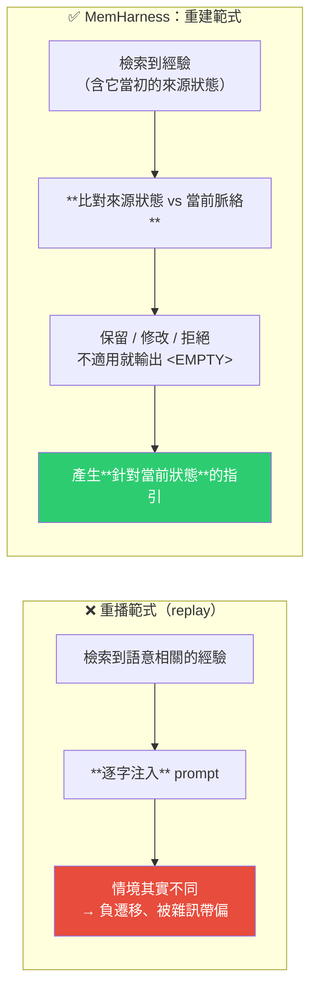
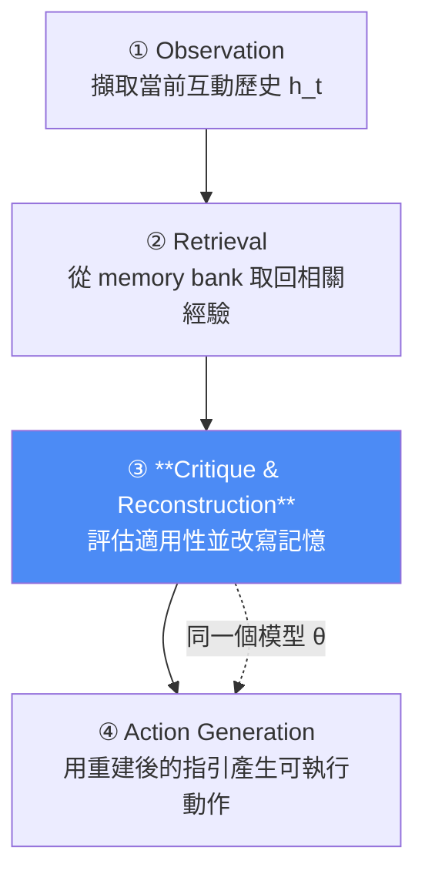
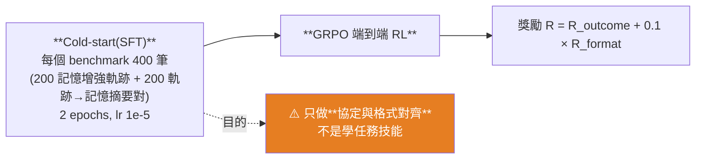

# MemHarness:記憶是「重建」出來的,不是「重播」——用 RL 讓 agent 學會批判自己的經驗

> 整理自論文〈MemHarness: Memory Is Reconstructed, Not Replayed〉(Rong Wu、Daocheng Fu、Licheng Wen、Xuemeng Yang、Shu Zou、Jianbiao Mei、Yuxin Wang、Hairong Zhang、Yu Yang、Tao Hu、Cong Zhang、Botian Shi、Pinlong Cai,arXiv:2607.28272,2026-07-30)。
>
> 核心主張一句話:**現有的記憶增強 agent 把存下來的經驗當成靜態紀錄逐字重播,結果在情境不同時造成「負遷移」(negative transfer)。MemHarness 讓 agent 依當前狀態主動「批判並重建」取回的經驗——留下、修改,或直接拒絕。**
>
> 最出乎意料的結果:**這種重建訓練不只是防止負遷移,它還會提升模型本身的推理能力**——測試時把記憶整個關掉,表現仍然勝過純 RL。

---

## 一句話總結



---

## 一、問題:語意相關 ≠ 現在適用

論文對現況的診斷很精準:**「重播範式」忽略了「抽象的儲存知識」與「具體的當前狀態」之間的落差。** 一段記憶可能在語意上高度相關,**卻因為環境條件不同而完全不適用於眼前這個互動情境**——照搬進去反而有害。

這正是所謂 **negative transfer(負遷移)**:記憶不但沒幫上忙,還把 agent 帶歪。

---

## 二、方法:五階段決策管線 + 單一策略模型



> **關鍵設計:重建與行動由「同一個策略模型 θ」負責**,不是外掛一個獨立的記憶改寫模組。

### 記憶條目長什麼樣(這是整套設計的支點)

每一條記憶 `m_i = (e_i, o_i^src)` 只有兩個欄位:

| 欄位 | 內容 |
|---|---|
| `e_i` | **抽象策略**(自然語言原則) |
| `o_i^src` | **它當初被萃取出來時的來源觀察狀態** |

> ⭐ **把「來源狀態」跟策略綁在一起存,是整篇論文的關鍵。** 沒有它,模型就無從比較「當時 vs 現在」,也就無法判斷該不該用這條記憶。論文的說法是:**透過比對每一條來源觀察與當前脈絡,策略能識別出狀態偏移,進而保留、修改或拒絕這條經驗。**

### 重建的輸出與 `<EMPTY>` 機制

如果沒有任何取回的經驗適用,**策略直接輸出 `<EMPTY>`**,下游會切換成「自我推理」的 fallback:

```
最終指引 g̃_t = { p_self   若 g_t = <EMPTY>
                { g_t      否則
```

其中 `p_self` 就是指示 agent **不依賴記憶、獨立推理**。

> **這個設計等於給了模型一個「合法的說不知道/不適用」的出口**——不必硬用一條不合適的記憶。呼應本庫 [[reliable-structured-json-output-tool-use]] 提到的:**給模型一個表達「不適用」的合法方式,能顯著降低被迫瞎湊的行為。**

---

## 三、記憶庫怎麼來的?訓練中長出來,測試時不長

| 面向 | 做法 |
|---|---|
| 初始狀態 | **記憶庫從空的開始** |
| 何時填充 | **只在 RL 訓練期間**——策略把成功與失敗的軌跡蒸餾成簡潔的自然語言原則,配上來源狀態後寫進記憶庫 |
| 蒸餾比例 | **只對 50% 的軌跡做蒸餾**(效率考量),並刻意**平衡保留成功與失敗**兩類 |
| 測試時 | **記憶庫不再成長** |

> 💡 **「失敗軌跡也要蒸餾成記憶」這點值得特別注意**——大多數人做 agent 記憶只記成功經驗,但失敗經驗恰恰是「什麼情況下不該這樣做」的來源。

### 檢索機制

- Embedding 模型:**BGE-M3**,同時編碼檢索 query 與庫中條目;
- **餘弦相似度排序、取 top-k(k=3)**;
- **檢索時做去重**,確保語意多樣性。

---

## 四、訓練:端到端 RL,而且沒有 ground truth 監督



**獎勵設計極簡:**

| 項目 | 內容 |
|---|---|
| **成果獎勵** | 任務成功 **+10**、失敗 **0** |
| **格式獎勵**(權重 0.1,分數 0–1) | 三項等權:①每步剛好一組合法的 `<think>` 與 `<action>` ②整回合 `<retrieve_memory>` 呼叫 1–5 次 ③嚴格英文輸出 |

> ⭐ **重建能力是在「沒有任何 ground-truth 監督」的情況下自己長出來的**——只靠任務層級的獎勵加上小小的格式加分,單一策略就隱式學會了有鑑別力的重建策略。
>
> Cold-start 資料由 AgentGym 種子資料經 GPT-5.1 生成,但論文強調**它的目的只是格式對齊,不是學會任務**。

---

## 五、結果

**設定**:backbone 都是 **Qwen2.5-7B-Instruct**。
- **ALFWorld**:具身家務任務,六類(Pick / Look / Clean / Heat / Cool / Pick2),50 步上限。
- **WebShop**:電商購物模擬,110 萬件商品,15 步上限。

| 方法 | ALFWorld | WebShop |
|---|---|---|
| **MemHarness** | **85.2%** | **75.6** |
| GRPO(純 RL) | 76.4% | 66.1 |
| EvolveR | 70.1% | 72.6 |
| Gemini-2.5-Pro(閉源) | 62.1% | 35.9 / 42.5 ※ |
| SimpleMem + GRPO(靜態記憶) | 54.5% | 46.9 |
| Base model | 14.5% | 7.8 |

> ※ Gemini 的 WebShop 數字在不同來源表格中略有出入,採用時請以論文原表為準。

### 分布外(OOD)泛化 —— 這才是主張的核心證據

在 ALFWorld 的 OOD 設定(**未見過的場景佈局**)下:

| 方法 | OOD 成功率 |
|---|---|
| **MemHarness** | **85.9%** |
| 原始記憶直接注入 | 76.3% |

> **這證實了動態過濾確實擋掉了「來自不匹配環境脈絡的雜訊」。**

---

## 六、消融實驗(這一節比主結果更有價值)

| 消融 | 結果 | 意義 |
|---|---|---|
| **只做 cold-start、不做 RL** | **7.6%** | Cold-start 真的只是格式對齊,**RL 是不可或缺的** |
| **注入未經精煉的原始記憶** | **表現變差** | ⭐ **證實了負遷移是真的**——記憶不是越多越好 |
| **⭐ 測試時把記憶整個關掉** | **83.0% vs 純 RL 的 76.4%** | **重建訓練本身提升了模型的基礎推理能力**,不只是防負遷移 |
| **改用通用 LLM 做重建** | **77.7% vs 85.2%** | 重建能力是**任務特定**的;端到端 RL 才抓得到任務動態,外掛一個通用模型改寫記憶效果差很多 |

### 機制分析:它到底在依據什麼過濾?

- **宏觀**:把來源狀態資訊拿掉後,**拒絕率下降但成功率也下降** → 證實「狀態比對」正是驅動過濾的機制。
- **微觀**:反事實探測顯示策略會**對細粒度的狀態變化做出反應**——條件吻合時接受記憶,但只要做最小幅度的改動,它就會改寫或拒絕。

---

## 七、應用案例

### 案例 1|做 agent 記憶時,一定要把「來源狀態」一起存

這是本文最可直接落地的一條:**只存「結論/原則」是不夠的,要連同「這條原則是在什麼情況下得到的」一起存。**

```
❌ 只存：「部署前要先跑 smoke test」
✅ 連來源狀態一起存：
   策略：部署前要先跑 smoke test
   來源狀態：專案 A、單體架構、有完整 E2E 測試、每週發版一次
```

**有了來源狀態,下游才有辦法判斷「現在這個情境還適用嗎」。** 否則你只能語意相似度一比就硬套 —— 那正是論文說的重播範式。

📌 對照本庫 [[project-cairn-experience-to-knowledge-skill]]:它的「知識畢業」流程要求**記錄 provenance**(`graduated_from`、`contributors`、`authoring_mode`),與這篇的 `o_i^src` 是同一個直覺的兩種實作。

### 案例 2|給記憶一個「不適用」的合法出口

`<EMPTY>` → 切換 `p_self`(獨立推理)這個設計非常值得抄。在任何 RAG / 記憶增強的 prompt 裡,**明確允許模型說「這些檢索結果都不適用,我要自己想」**,比逼它一定要用檢索結果好得多。

實作上就是在 prompt 裡加一條:「若取回的資料都不適用於當前情境,直接回覆 `NOT_APPLICABLE` 並依自身知識作答」,並在程式端處理這個分支。

### 案例 3|把失敗經驗也蒸餾進記憶庫

論文刻意**平衡保留成功與失敗軌跡**。多數人的 agent 記憶只記「做對的事」,但**「什麼情況下這招會失敗」往往是更高密度的資訊**。

📌 這跟本庫 [[google-agentic-engineering-day4-5]] 的驗收招式四完全同構:**把你每一句罵它的話存起來**——那精準標記了「AI 以為對、你認為錯」的認知落差,而且錯誤通常集中在少數幾類。

### 案例 4|「記憶越多越好」是錯的,而且這篇給了實證

消融實驗明確顯示:**注入未經精煉的原始記憶會讓表現變差**。

實務判準:如果你的 agent 加了記憶之後**在新情境下反而變笨**,那很可能不是記憶不夠多,而是**缺少一層「這條記憶現在適用嗎」的過濾**。先加過濾,不要先加量。

📌 呼應本庫 [[codebase-memory-vs-codegraph-two-routes]] 的結論:**瓶頸是輸入的信噪比,不是資訊量。**

### 案例 5|但也要認清這篇的邊界

在把結論套到自己的系統前,幾件事要先想清楚:

| 限制 | 說明 |
|---|---|
| **記憶庫測試時不成長** | 這是離線訓練出來的記憶,**不是線上持續學習**。你的場景若需要邊用邊累積,這套架構要改 |
| **需要端到端 RL 訓練** | 消融顯示「外掛通用 LLM 做重建」效果差很多(77.7% vs 85.2%)——**這意味著你不太可能只靠 prompt engineering 複製它的完整效果** |
| **模型與環境規模有限** | backbone 是 7B,環境是 ALFWorld / WebShop 這類**任務明確、有清楚成敗訊號**的 benchmark。論文自陳未來要探索「擴展到更大模型與開放式環境」 |
| **獎勵訊號要夠乾淨** | 成功 +10、失敗 0 的二元獎勵能work,前提是任務成敗可自動判定。**開放式知識工作沒有這種訊號** |

**所以對多數人來說,可直接遷移的是「設計直覺」(存來源狀態、允許拒絕、記失敗、先過濾再加量),而不是整套訓練管線。**

---

## 重點回顧(TL;DR)

- **核心主張**:記憶應該被**重建**而非**重播**;語意相關 ≠ 現在適用,逐字照搬會造成**負遷移**。
- **記憶條目 = (抽象策略, 來源觀察狀態)** —— ⭐ **存來源狀態是整套方法的支點**,讓模型能比對「當時 vs 現在」。
- **五階段管線**:Observation → Retrieval → **Critique & Reconstruction** → Action;**重建與行動由同一個策略模型 θ 負責**。
- **`<EMPTY>` 機制**:沒有適用的記憶就直接說沒有,切換到獨立推理的 fallback。
- **記憶庫在 RL 訓練中長出來(成功與失敗軌跡各半、只蒸餾 50%),測試時不成長**;檢索用 BGE-M3 + 餘弦相似度 top-3 + 去重。
- **訓練**:cold-start SFT(400 筆,**只為格式對齊**)+ **GRPO 端到端 RL**;獎勵極簡(成功 +10、失敗 0,加 0.1× 格式分)——**重建能力在沒有 ground-truth 監督下自己長出來**。
- **成績**(Qwen2.5-7B-Instruct):ALFWorld **85.2%** / WebShop **75.6**,大幅勝過純 GRPO(76.4 / 66.1)、靜態記憶(54.5 / 46.9)與 Gemini-2.5-Pro。**OOD 佈局下 85.9% vs 原始記憶注入 76.3%。**
- **⭐ 最反直覺的消融**:**測試時把記憶關掉仍有 83.0%,勝過純 RL 的 76.4%** —— 重建訓練**提升了模型本身的推理能力**,不只是防負遷移。
- **另一個關鍵消融**:**注入未精煉的原始記憶會讓表現變差**(記憶不是越多越好);**改用通用 LLM 做重建只有 77.7%**(重建能力是任務特定的)。

---

## 來源

- Rong Wu, Daocheng Fu, Licheng Wen, Xuemeng Yang, Shu Zou, Jianbiao Mei, Yuxin Wang, Hairong Zhang, Yu Yang, Tao Hu, Cong Zhang, Botian Shi, Pinlong Cai,〈MemHarness: Memory Is Reconstructed, Not Replayed〉,arXiv:2607.28272(2026-07-30):<https://arxiv.org/abs/2607.28272>(HTML 全文:<https://arxiv.org/html/2607.28272v1>)
  - ⚠️ 本文依論文摘要與 HTML 全文整理;**部分基準表格數字在不同段落略有出入(如 Gemini-2.5-Pro 的 WebShop 分數),採用前請以論文原表為準**。
- 相關技術:GRPO(Group Relative Policy Optimization)、BGE-M3(embedding)、ALFWorld、WebShop、AgentGym(cold-start 種子資料)、Qwen2.5-7B-Instruct(backbone)。
- 延伸(本庫):[Project Cairn:把做過的事沉澱成可複用知識](./project-cairn-experience-to-knowledge-skill.md)(provenance 的工程實作) · [用 Claude 蓋會自我改進的知識庫](./self-improving-knowledge-base-claude-cowork.md) · [Codebase-Memory-MCP vs CodeGraph](./codebase-memory-vs-codegraph-two-routes.md)(信噪比 > 資訊量) · [到底需不需要 GraphRAG?9 種 RAG 方案實測](./is-graphrag-needed-rag-variants-comparison.md) · [Google 課程 Day 4+5](../foundations/google-agentic-engineering-day4-5.md)(把糾正存起來當教材)
