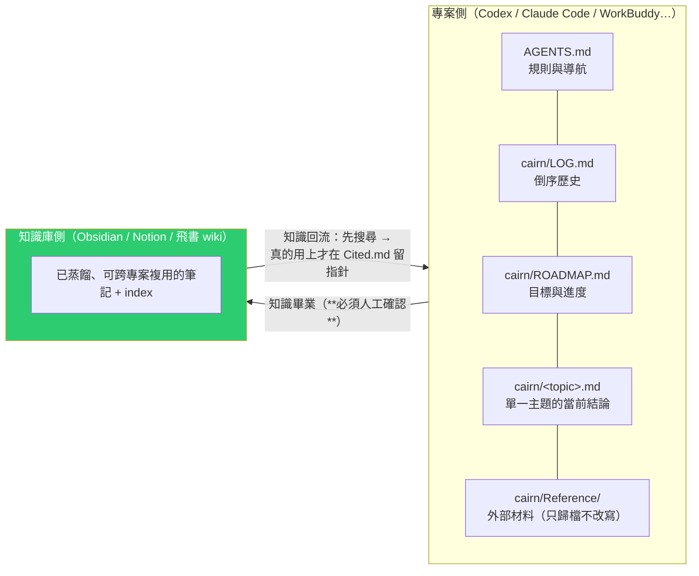
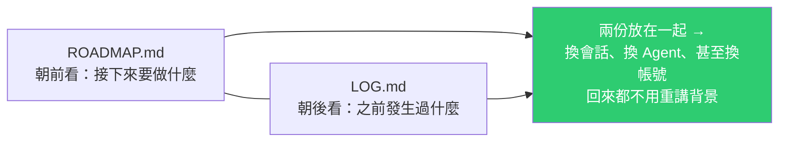
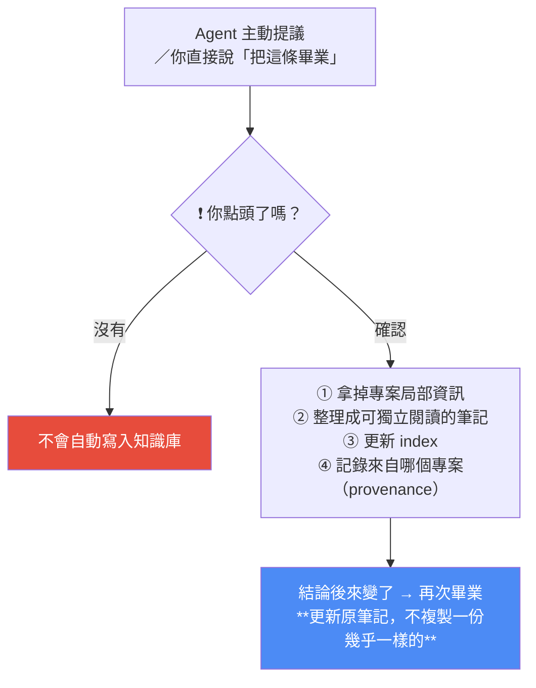
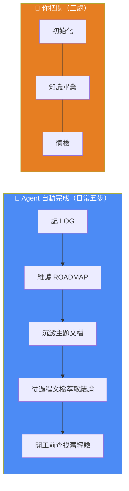

# Project Cairn:把「做過的事」沉澱成可複用知識的開源 Skill(高體感 × 低阻力)

> 整理自 YouTube 頻道 **Blink 的 AI 筆記**〈我開源了一個 Skill,把專案經驗沉澱成可複用的知識〉(2026-07-30,約 12 分半);技術細節另**直接 clone [`iBlinkQ/project-cairn`](https://github.com/iBlinkQ/project-cairn) 讀原始碼**(`SKILL.md`、`references/`、`assets/templates/`)核實。
>
> 一句話:**你照常跟 Agent 推專案,經驗會自動留下來。** Cairn(石堆路標)是旅人為後來者留下的記號——上一個專案解決過的問題,下一個專案不必再摸黑走一遍。

---

## 一句話總結

---

## 一、痛點:同一個坑,換個專案再踩一遍

作者的真實經歷:某專案要對接飛書機器人,以為一句話就搞定,結果卡在「機器人收不到訊息」,跟 AI 來回排查好幾輪才解決。**後來第二個專案又遇到同一個問題**——他得回到舊專案翻聊天記錄、讓 AI 把當時的解法總結成一篇 Markdown,再帶到新專案。

> **這次他還記得自己在哪個專案踩過;想不起來的時候呢?** 如果你同時在用 Codex、Claude Code 等多個 Agent,**可能連該去哪裡翻都不知道。**

歸納出的四個症狀:

- 同一個坑,換個專案又踩一遍。
- 會話一斷、Agent 一換,背景與規則又得從頭解釋。
- 計畫、進度、結論散落各處,AI 在新舊方案之間反覆橫跳。
- 明明解決過,真正需要時卻只剩一堆翻不完的聊天記錄。

### 先走過的笨辦法(這段很誠實)

作者一開始讓 Agent 把踩坑經驗、決策依據、目標與計畫**全部塞進同一個 Markdown**,每次開工前先讀一遍、有進展就往裡補。**用下來真香,但問題也來了**:

| 問題 | 說明 |
|---|---|
| 大雜燴 | 所有內容擠在一個檔案裡,越來越難讀 |
| 命名混亂 | 每個專案叫的名字都不一樣——`Memory`、`Plan`、`Learn`… |
| 格式全靠臨場發揮 | 幾個專案同時推進時,**別說 AI 了,自己都對不上號** |

> 但這個笨辦法至少證明了一件事:**把專案經驗留下來確實有用。** 接下來要解決的只是——**怎麼把它做成一套穩定的規則。**

---

## 二、核心設計:兩側分離

Project Cairn 是一個 **Agent Skill**,把它做的事叫做**「經驗知識化」**:專案裡親身經歷過的踩坑經驗、關鍵決策、探索成果、靈感洞見**先留在專案裡**;真正具備複用價值的,**經過你的確認才進入長期知識庫**。日常記錄由 Agent 自動完成。

| 側 | 存什麼 | 典型位置 | 何時讀 |
|---|---|---|---|
| **專案側** | 規則、進度、當前結論、在地案例 | 根目錄 `AGENTS.md` + `cairn/` | 進入與推進專案時 |
| **知識庫側** | 已蒸餾、可跨專案複用的知識 | Obsidian / Notion / 飛書 wiki | 新工作需要舊教訓時 |

> **兩側各自對自己的範圍保持權威**,而不是把所有東西塞進一個無限成長的檔案。

---

## 三、走一遍完整流程

### ① 初始化

裝好之後對 Agent 說一句「初始化 Project Cairn」,它會做一輪互動問答:專案的一句話定位、經驗要存到哪個知識庫(Obsidian / Notion / 飛書)。**知識庫可以先不配置**,等之後真有內容想保存再說。

**不只新專案,進行中的老專案也能隨時接入。**

初始化後:
- 專案規則寫進 **`AGENTS.md`**,以後 Agent 每次進來都先照這套規則做事。
- 專案裡多出一個 **`cairn/` 資料夾**。

> **關鍵設計:`cairn/` 與「專案最終要交付的程式碼、成果文檔」隔離,互不打擾。** 因為那些工程資產往往隨著專案交付就交出去了,**而專案裡累積的經驗會留在 `cairn/`,持續為你所用。**

### ② `LOG.md` —— 朝後看

專案有實質進展時,Agent 在 `LOG.md` **頂部**記一條:做了什麼、定了什麼、詳細內容放在哪裡。

| 規則 | 內容 |
|---|---|
| 只寫**摘要 + 指針** | 詳細內容另放主題文檔,LOG 只放連結指過去 |
| **單條不超過 20 行** | 保持日誌輕快 |
| 就算沒沉澱主題文檔也記 | 只要有實質動作就記一筆 |

> 以後回來**先掃一眼 LOG,就知道這段時間發生了什麼,不必從茫茫對話裡考古。**

### ③ `ROADMAP.md` —— 朝前看

一件事沒法在一個會話裡做完時,Agent 會建立 `ROADMAP.md`,只維護三類資訊:**里程碑、當前焦點、還沒解決的問題**。專案前進一步就勾掉里程碑、焦點移到下一件事;不展開長篇細節,有對應主題文檔就用指針指過去。

> 💡 影片提到一個很實際的附加價值:**ROADMAP 還能管住那些「很軸」的 AI**——有些方案明明已經否決了,它過幾輪又想試一次;有些功能說好放二期,它一會兒又提出來。**把決定寫清楚後,人和 AI 看到的是同一份路線圖。**

### ④ `Reference/` —— 外部材料只歸檔,不改寫

甲方給的業務規則、輸出模板、不能改動的原始文檔,交給 Agent 後會放進 `Reference/`。規則很簡單:**原件只歸檔、不改寫**;Agent 對材料的理解與後來形成的結論,才進入主題文檔。

> **這樣「哪句話來自原文、哪句話來自專案判斷」不會混在一起。**

### ⑤ 主題文檔 —— 單一主題的當前真相

找到原因並驗證解法後,Agent 把結論寫進對應的主題文檔;**已有相關主題就在原文更新**。所以想知道某個主題現在的結論,**看那一篇就夠了**。

格式對齊 Google 的 **Open Knowledge Format(OKF)** 慣例:**Markdown + YAML frontmatter**(至少要有 `type` 欄位)。

> 好處:**既能讓人直接打開看,也方便 Agent 檢索與更新,不會被鎖在某個特定產品裡。**
>
> (原始碼註明:專案只採用 OKF 的最小慣例,**並未宣稱實作完整的 OKF bundle**。)

### ⑥ 從「過程文檔」萃取結論

有些結論不是在聊天裡直接冒出來的,而是藏在**設計文檔、實施文檔、評審意見、復盤文檔**裡。一旦形成穩定結論,Agent 也會把它收進主題文檔——**過程材料留在原地**。

影片舉了跟 **Superpowers** 的分工當例子:

| 工具 | 職責 |
|---|---|
| Superpowers(specs / plans) | **負責可靠地完成工作**——細化任務,讓工作做得更穩 |
| Project Cairn | **負責沉澱工作成果**——從那些文檔裡提取可長期保留的結論 |

> 📌 本庫對 Superpowers 的評估見 [[superpowers-vs-matt-skills-strong-model]]:強模型下把 code 全寫進計畫是累贅。**但那些計畫文檔作為「結論的原料」仍有價值**——這正是 Cairn 補上的環節。

### ⑦ 知識畢業(graduation)

當一條經驗**已真實驗證過、而且換個專案仍然有用**,才適合進入長期知識庫。作者把這個過程叫「知識畢業」。

**各平台的 index 形態不同,但你發起畢業的方式不變:**

| 平台 | index 的形態 |
|---|---|
| **Obsidian** | index 本身就是一篇筆記,知識之間用雙鏈連接 |
| **Notion** | 資料庫本身就是 index,一條知識一行;**Notion 的屬性直接用來存 frontmatter** |
| **飛書 wiki** | 進入 wiki 節點樹 |

> 原始碼補充:每個 provider 都遵循 `references/provider-interface.md` 的行為契約,寫入前可先跑**唯讀的 preflight 腳本**檢查安裝、認證與存取權限。畢業後的筆記帶有 `graduated_from`、`contributors`、`graduated_by`、`authoring_mode` 等來源欄位,**可以追溯一條結論是由誰、哪個專案、哪份材料產生的**。

### ⑧ 體檢(audit)

專案做久了,知識難免過時、走樣。對 Agent 說一句「做個體檢」,它會檢查:**主題文檔有沒有互相打架、連結有沒有失效、哪些經驗一直壓在專案裡沒處理。**

> 邊界很明確:**體檢只報告矛盾、過時與遺漏,不會靜默改寫重要決策。**

### ⑨ 知識回流(consume)

Agent 動手前**先找一找這件事有沒有現成結論**:專案裡有對應主題就直接用;沒有再到知識庫查 index。**真正用上的知識,才在 `Cited.md` 記一條摘要 + 一個指向知識庫的指針——不複製全文。**

---

## 四、日常分工:五步自動 + 三處把關

> **你平時還是照常跟 Agent 推專案,經驗會自動留下來。**

**明確的自動化邊界**(原始碼 `SKILL.md` 寫得很清楚):沒有背景 hook、沒有聊天結束觸發、沒有 CLI、沒有 MCP server。**日常維護之所以會發生,單純是因為 `AGENTS.md` 被當成專案規則讀進去。**

---

## 五、跟 Karpathy 的 LLM Wiki 差在哪?——「體感 × 阻力」框架

這是全片最有遷移價值的一段。作者把「記知識」分成三種:

| 方式 | 體感(這條知識跟你的連結有多深) | 阻力(記下來有多費勁) | 問題 |
|---|---|---|---|
| **傳統筆記** | **高** | **高** | 每句話都要自己想明白、自己寫;還得在專案忙完後專門留時間整理。**多數時候不是記不起,是真的記不動** |
| **LLM Wiki 式自動生成** | **低** | **低** | 給一批資料就自動拆成很多篇互鏈的 wiki,知識庫迅速變大——但 **token 燒了不少、有些原始資料你根本沒認真讀過**,它只是從一個資料夾搬到更多 Markdown 裡 |
| **Project Cairn** | **高** | **低** | 知識來自你親身參與的專案,日常記錄由 Agent 完成 |

### 兩個很到位的批評

> **「這有點像雇了一個機器人替你跑步——他每天跑 10 公里,你站在旁邊看數據,自己的身體並沒有因此變得更好。」**

第二個問題更技術性:**原文可能按一條故事線從基礎講到進階,但拆成很多原子筆記之後,單篇看起來都很完整,你卻不知道該從哪篇開始讀。**

> 作者的結論:**LLM Wiki 更像一個自動生成的私有百科**——他會用它整理資料,**但不會拿它取代自己的學習過程**。

### 根本差異

> **如果說 LLM Wiki 整理的是「給到的資料」,Project Cairn 沉澱的就是「做過的事情」。**

Cairn 的來源不是一批丟進去的資料,而是**你正在參與的專案**。一條知識之所以出現,是因為**你真的碰到了問題、你和 Agent 一起做了判斷、你也看到了最後的結果**——所以再看到這條筆記時,你會知道它當時為什麼會有、以及它有什麼作用。

> 📌 對照本庫 [[llm-wiki-karpathy]]:那篇主張「別只靠 RAG 臨時拼湊,wiki 編譯一次後保持更新」。**兩者其實不衝突——差別在知識的來源是「外部資料」還是「自身經歷」。** 理想狀態是兩條線並行:資料類走 wiki,經歷類走 Cairn。

---

## 六、應用案例

### 案例 1|先做那個「笨辦法」,再考慮上工具

作者的路徑值得照抄:**先用一個 Markdown 檔手動記,證明對自己真的有用,再談規則化。** 如果你連手動版都堅持不了兩週,裝再好的 skill 也不會用。

從笨辦法升級的觸發訊號很明確:**檔案變成大雜燴、幾個專案的命名格式全不一樣、自己都對不上號。**

### 案例 2|把「經驗」與「工程資產」分開放

這是 Cairn 最值得單獨抄走的一條設計:**交付物會隨專案交出去,經驗要留下來。**

即使不裝這個 skill,你也可以在自己的專案裡建一個 `cairn/`(或任何名字)資料夾,只放「為什麼這樣做、試過哪些替代方案、實作時踩了什麼坑」——**這些恰恰是 schema、config、contract 這類程式碼資產不會記錄的東西**。

### 案例 3|用 ROADMAP 治「很軸的 AI」

如果你常遇到 Agent 反覆提議已經否決的方案、或把說好放二期的功能又端出來,**這是上下文問題,不是模型問題**。把「已否決的方案 + 理由」「明確延到二期的項目」寫進一份 Agent 每次都會讀到的檔案,比每次在對話裡重講有效得多。

📌 這跟 [[claude-md-from-zero-to-mastery]] 的判準一致:**「怎麼翻程式碼都猜不到的隱性知識」才值得寫進 always-read 檔案**——「我們為什麼否決了方案 B」正是這種知識的典型。

### 案例 4|「摘要 + 指針」是對抗上下文膨脹的通用手法

LOG 單條不超過 20 行、只寫摘要與連結;Cited.md 只留指針不複製全文。**這個模式可以直接套用到任何 agent 記憶設計上**——把「索引」與「內容」分層,agent 讀索引決定要不要展開,而不是每次把全文都塞進 context。

📌 同一原則見 [[llm-wiki-karpathy]](先讀 index 導航再鑽入)與 [[claude-md-from-zero-to-mastery]](CLAUDE.md 只告訴 AI 資料放哪,真需要時再去讀)。

### 案例 5|不限軟體開發

影片明確提到:**法律、諮詢、策劃這些知識密集型工作,一樣會在過程中產生大量值得留住的經驗。** 判準不是「你寫不寫程式」,而是「**你的工作會不會反覆遇到同類問題、而解法散落在對話與文件裡**」。

### 案例 6|本倉庫的對照

我們自己的 `SCHEDULES.md` 其實就是一份手動版的 Cairn 主題文檔:它記錄的正是「**踩過的坑(grep `--include` 位置、`git add -A` 誤入 stackdump、LFS locksverify、403 要提高 retries 而非改 client)+ 已驗證的解法**」,而且是因為**真的踩過**才寫下來的——高體感、低阻力。

而 `CLAUDE.md` 對應 Cairn 的 `AGENTS.md`(always-read 規則),README 對應 index。**差別在我們還沒有「畢業」這一層**——這些踩坑經驗目前只留在 Knowledge repo,沒有蒸餾成跨專案可複用的形式。若哪天要做,`SCHEDULES.md` 裡的 Whisper 配方與 yt-dlp 參數就是最典型的畢業候選。

---

## 重點回顧(TL;DR)

- **痛點**:同一個坑換專案再踩、換 Agent 就要重講背景、結論散落在翻不完的聊天記錄裡。
- **笨辦法證明了價值**(全塞一個 Markdown 真香),**但命名與格式各異會變大雜燴** → 需要一套穩定規則。
- **兩側分離**:**專案側**(`AGENTS.md` + `cairn/`)保在地事實與當前結論;**知識庫側**(Obsidian / Notion / 飛書)保跨專案可複用的蒸餾知識。
- **檔案分工**:`LOG.md`(朝後看,摘要+指針、單條 ≤20 行)、`ROADMAP.md`(朝前看,里程碑/焦點/未解問題,**能管住很軸的 AI**)、`<topic>.md`(單一主題的當前真相,OKF 式 Markdown+YAML)、`Reference/`(**只歸檔不改寫**)、`Cited.md`(**只留指針不複製全文**)。
- **關鍵隔離**:`cairn/` 與交付用的工程資產分開——**成果會交出去,經驗留下來。**
- **知識畢業**:**你不點頭就不會寫進知識庫**;去掉專案局部資訊、更新 index、記錄 provenance;結論變了就**更新原筆記而非複製新的**。
- **五步自動 + 三處把關**:Agent 自動做 LOG / ROADMAP / 主題沉澱 / 過程文檔萃取 / 開工前查找;人只在**初始化、畢業、體檢**把關。
- **沒有背景 hook、沒有 CLI、沒有 MCP**——維護之所以發生,是因為 `AGENTS.md` 被當成規則讀進去。
- **⭐ 核心框架:體感 × 阻力**。傳統筆記高體感高阻力(**不是記不起,是記不動**);LLM Wiki 低阻力低體感(**像雇機器人替你跑步**);**Cairn 高體感低阻力**。
- **⭐ 根本差異:LLM Wiki 整理「給到的資料」,Cairn 沉澱「做過的事情」。**

---

## 來源

- Blink 的 AI 筆記(YouTube),〈我開源了一個 Skill,把專案經驗沉澱成可複用的知識〉(2026-07-30,約 12 分半):<https://youtu.be/HcbjFO1mRIw>
  - ⚠️ 該片無官方字幕也無自動字幕,**逐字稿以 CPU 版 faster-whisper(small/int8,`vad_filter=True`)轉錄取得,非官方字幕**,可能有少量聽寫誤差(專有名詞如 Cairn、Codex、Obsidian、Notion、OKF、frontmatter、Superpowers、LLM Wiki 已依原始碼與上下文校正)。
- **專案原始碼**(本文的檔案職責、provider 契約、frontmatter 欄位、自動化邊界等均據此核實):<https://github.com/iBlinkQ/project-cairn>
  - 互動式導覽:<https://iblinkq.github.io/project-cairn/>
  - 安裝:Claude Code → `git clone … ~/.claude/skills/project-cairn`;Codex → `~/.agents/skills/project-cairn`;WorkBuddy 可直接上傳 ZIP。**前置需求:`git`,`scripts/*.sh` 需 bash(Windows 需 WSL 或 Git Bash),Python 腳本需 Python 3;目前尚無套件管理器發行版。**
- 相關規範:Google 的 [Open Knowledge Format](https://cloud.google.com/blog/products/data-analytics/how-the-open-knowledge-format-can-improve-data-sharing)(專案僅採用其最小慣例)。
- 延伸(本庫):[LLM Wiki(Karpathy)](./llm-wiki-karpathy.md) · [AI Agent 記憶管理:有時候 Markdown 就夠了](./markdown-agent-memory.md) · [15 分鐘學完 CLAUDE.md](../../claude-code/claude-md-from-zero-to-mastery.md) · [模型越強該刪 Superpowers 還是 Matt Skills](../applications/superpowers-vs-matt-skills-strong-model.md)
