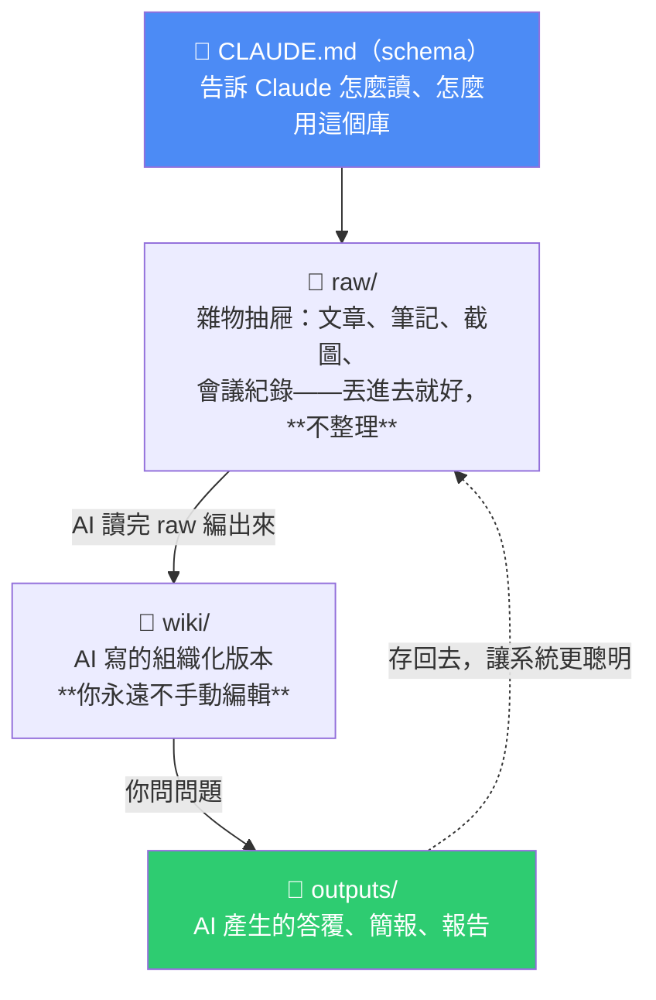
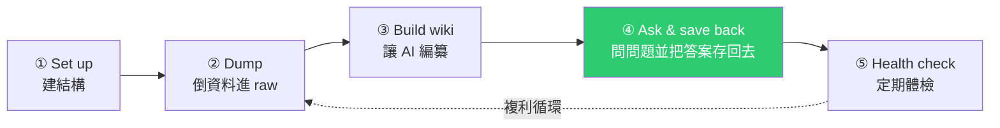
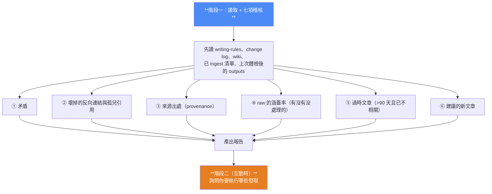
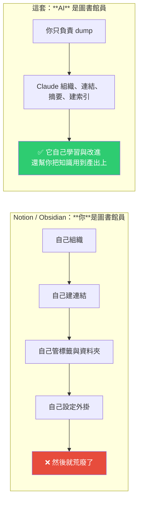

# 用 Claude 蓋一個「會自我改進」的知識庫:三個資料夾 + 一個 CLAUDE.md + 五步驟

> 整理自 YouTube 頻道 **Systems Made Better**〈Build A Claude Knowledge Base That Self-Improves!〉(2026-05-23,約 36 分鐘)。作者在 **Claude CoWork** 裡從零實作 **Karpathy 那套個人知識庫**——**不用 Obsidian、不用向量資料庫、不寫程式**,一個週末約 45 分鐘就能搭起來。
>
> 核心轉變一句話:**Notion / Obsidian 要求「你來當圖書館員」——你自己整理、自己連結、自己管標籤與外掛,然後就荒廢了。Karpathy 這套的洞見是:讓 AI 當圖書館員。**

---

## 一句話總結

**就這樣:三個資料夾 + 一個檔案。** 沒有資料庫、沒有 Obsidian vault、沒有 RAG embedding、沒有 vector store。

> 影片引用的佐證:**Karpathy 自己的知識庫約 100 篇文章、40 萬字,LLM 靠「維護一個 index + 只讀需要的部分」就處理得很好。** 對一位頂尖 AI 研究者管用的東西,對你的業務大概也管用。

---

## 五步驟框架

---

## 步驟一|Set up:建立結構(可多庫並存)

在 Claude CoWork 的工作資料夾裡新增一個 `knowledge` 資料夾,然後對 Claude 說一句大意如下的話:

> 「我要建一個**你來當圖書館員(librarian)管理的自我改進知識庫**。在這個資料夾裡建三個子資料夾:`raw`、`wiki`、`outputs`,並在根目錄放一個 `CLAUDE.md`。」

**兩層結構讓你可以有多個知識庫**:

| 層級 | 角色 |
|---|---|
| **頂層**(例如 `second-brain-knowledge/`)+ 它自己的 `CLAUDE.md` | 容器:說明「新知識庫該長什麼樣、怎麼建」 |
| **各個知識庫**(例如 `productivity-knowledge-base/`)+ 各自的 `CLAUDE.md` | 獨立運作,各有自己的主題聚焦 |

**作者在跟 Claude 來回打磨 `CLAUDE.md` 時定下的幾件事:**

- **Focused areas**:明確列出這個庫要深化的三個主題(他的例子是「少而精、注意力與精力管理、系統設計、深度工作、essentialism」)。**這決定了 AI 編 wiki 時的取捨。**
- **圖書館員的積極度**:設定成「active」到「aggressive」之間。
- **一個 memory / change log 檔**:記錄**上次處理到哪裡**,這樣自動化流程才知道 `raw` 裡哪些是新的、哪些已經處理過。

> 💡 **這個 change log 兼作系統記憶的設計,是整套東西能「自動化」的關鍵**——沒有它,每次都得重掃全部。
>
> 📌 同樣的思路見本庫 [[project-cairn-experience-to-knowledge-skill]] 的 `LOG.md`(摘要 + 指針、單條 ≤20 行)。

---

## 步驟二|Dump:把東西倒進 `raw`(約 10 分鐘)

**這一步的精神是「不要整理」:**

> **你不需要弄得整齊。** 文章、筆記、截圖、會議逐字稿,直接複製貼上進 `raw`,甚至直接貼進對話讓 AI 幫你存檔。**不要把它弄漂亮——這是一個「捕捉用」的資料夾,組織是 AI 的工作。**

實務上的幾種進料方式:

| 方式 | 說明 |
|---|---|
| 直接貼進對話 | 讓 Claude 存成 `.md`(**會消耗 credits**) |
| 手動建 Markdown | 影片示範用 Xcode 的 `File → New from Template → Markdown File`(免費、快) |
| 瀏覽器剪藏 | Obsidian 的 Web Clipper 擴充功能可一鍵把網頁轉成乾淨 Markdown(免費) |
| 連接器 | 作者接了 Notion connector,直接叫 Claude 從指定資料庫抓 10–20 筆長文進來 |
| 拖檔案 | 圖片、PDF 直接丟(**PDF 對 AI 較難讀**,作者也承認) |

> 💡 作者提到自己的系統裡有 **about me** 與 **context map**——context map 列出 Notion 裡所有關鍵資料庫,**所以 Claude 其實本來就該知道去哪裡找**,不必他每次指路。**這個「給 agent 一張資料地圖」的做法值得單獨抄走。**

---

## 步驟三|Build wiki:一句話讓 AI 編纂(約 30 分鐘)

指向資料夾,給一個 prompt,大意是:

> 「讀完 `raw` 裡的所有東西,依照 `CLAUDE.md` 的規則在 `wiki` 編一份 wiki。**先建 `index.md`,然後每個主要主題一個 `.md`,並把相關主題互相連結。**」

然後你就走開,讓它做完。回來時你會得到:主題頁與摘要、**你原本不知道存在的概念之間的連結**、一個讓一切秒搜的索引。

**產出結構**(影片實例):`index.md` → foundational articles → method articles → thematic articles → `questions.md` → `changelog.md`。

### ⚠️ 一個很重要的小技巧:先給它「反 AI 腔寫作規則」

作者的做法:**把 Wikipedia 的「Signs of AI writing」貼給 Claude,叫它據此寫一份「永遠不要這樣寫」的自我指令**,存成 `writing-rules.md`,讓它編 wiki 時遵守。

> 否則你會得到一整個 wiki 的 AI 腔文字,讀起來很累也很難信任。

### 成本現實

這一步**相當吃 token**。作者是 **Claude Max 5x 方案**,跑完這段大約用掉當期 session 的 39%。**沒有大方案的人建議分次進行(分 session 做)。**

---

## 步驟四|Ask & save back:這一步才是「複利」的來源

**每次你問 agent 一個問題、而你喜歡那個答案,就把它存回 `raw` 或 `wiki`——系統就變聰明一點。每個問題都讓下一個答案更好。**

影片的實測很有說服力:他問「怎麼在短時間達成大量產出、同時管理精力與健康」,Claude 讀 index → 讀最相關的 wiki 條目 → **交叉比對多位作者的觀點,指出「你不可能同時最大化兩邊,硬要就是 burnout 的來源」,並列出知識庫支持的七個可執行做法,還標明出處**。

### 但他也踩到一個坑,值得記

第一次測試時**答案沒有被寫進 `outputs`**。他的處理方式是三件事一起做:

1. **更新 `CLAUDE.md`,把「問問題就要生成報告到 outputs」寫成規則**;
2. 把剛才那個答案補存成報告;
3. 用新規則重跑。

> **這正是「規則檔要在使用中演化」的實例**——不是一開始就寫得完美,而是**發現行為不對就把規則補進去**。呼應本庫 [[claude-md-from-zero-to-mastery]] 的「維護 = 新增 + 修剪」。

### 最有價值的一種問法:問「我的盲點在哪」

他接著問:**「根據 wiki 裡的一切,我對這個主題理解的三個最大缺口是什麼?」**

回答出乎意料地好——指出這個庫幾乎沒有涵蓋「大多數人的起點(過度承諾、注意力碎片化、預設連線)」、缺少「停止的機制」、缺少「什麼算 essential 的實際決策方法」,而且**整體預設你是一個人工作,缺少與他人協作的部分**。

> **這些缺口清單可以直接餵回去驅動下一輪擴充——AI 開始改進自己。** 只要在指令裡寫明「讀 outputs 並從那裡繼續」。

---

## 步驟五|Health check:每月體檢(這一步真的重要)

**為什麼必要:AI 有時會寫得有點錯,你把它存回去,下一個答案就悄悄建立在這個錯誤上。**

手動版的 prompt 大意是:審視整個 wiki → **標出文章之間的矛盾與不一致的數據** → 找出缺漏並用網路搜尋補上 → **列出在 `raw` 裡沒有來源支持的主張** → 建議尚未建立的文章間連結 → 提出三個新文章候選。

### 作者做成了 Skill + 排程任務

他用 skill-creator 做了一個 **Knowledge Base Health Check Skill**,再掛上**每月排程任務**(Claude 的排程支援自訂週期,不限選單裡的選項)。

**Skill 的運作分兩階段:**

**實際跑出來的結果**(這段最能說明價值):抓到「努力 vs 毫不費力」的哲學矛盾、數字與框架不一致、**歸因漂移(attribution drift)**、無來源或來源不足的主張、**一個沒被處理的檔案與一張沒被計入的 JPEG**,還找出幾條他沒注意到的文章間連結,並建議了新文章候選。

> 作者認為 **suggested new articles 才是真正的價值所在**。

### 成本與節奏

排程跑一次約 **12 分鐘**;含前面兩次示範,當期 session 用掉 Max 5x 方案的 **45%**。**所以他只設成每月一次**,並建議**多個知識庫錯開不同日子跑**,免得一次燒光額度。

> 💡 熟悉之後的簡化:不必分兩階段,直接叫它「report and action」一次做完會更省事——**把指令調到「嚴謹但不燒爆 credits」的平衡點。**

---

## 為什麼這比 Obsidian + 一堆外掛好?

> 影片對「second brain 熱潮」的觀察很準:**X 上每隔一陣就有人貼 Obsidian vault 或 Notion 設定的截圖——滿滿的連結、graph view、外掛,大家收藏了,然後就忘了。我們找到很棒的東西、存起來,然後弄丟它。**

**作者對這套系統的長期判斷:** 第一天它很陽春(只有你週末倒進去的東西);**但第 100 天,它會變成一項別人沒有的資產——你的觀點、你的來源、你的判斷,集中在一個地方,而且幾乎無法被複製,因為沒有別人讀過你讀的、存過你存的。**

---

## 應用案例

### 案例 1|先決定「這個庫是為了回答哪一類問題」再開始倒資料

影片裡 `CLAUDE.md` 的 **Focused areas** 是最容易被略過、但影響最大的一欄。它決定 AI 編 wiki 時什麼該深化、什麼該略過。**沒有聚焦的知識庫會變成第二個雜物抽屜,只是換成 AI 幫你堆。**

實務建議:一個庫只服務一個主題領域,寧可開多個庫(頂層容器 + 各自 `CLAUDE.md`)。

### 案例 2|一定要先做「反 AI 腔寫作規則」再讓它編 wiki

這是 30 分鐘的自動編纂裡最便宜的品質保險。做法:把 Wikipedia 的「Signs of AI writing」丟給 Claude,讓它產出一份 `writing-rules.md`,並在 `CLAUDE.md` 裡要求所有寫作動作先讀它。

> 📌 本倉庫的 skill 生態裡也有 `humanizer` 這類同性質工具,原理一致:**把「不要怎麼寫」寫成可重複載入的規則,而不是每次在對話裡提醒。**

### 案例 3|把「問我的盲點在哪」變成固定動作

`「根據知識庫裡的一切,我對這個主題理解的三個最大缺口是什麼?」`

這個問法的價值在於:**它把知識庫從「查詢對象」變成「診斷工具」**。而且產出的缺口清單可以直接當成下一輪的採集清單——這是整套系統「自我改進」的實際機制,不是行銷詞。

### 案例 4|health check 的七項稽核可以直接抄

即使你不用 Claude CoWork,這七項對**任何**長期維護的知識庫都適用:①矛盾 ②壞連結/孤兒引用 ③來源出處 ④原始素材涵蓋率 ⑤過時內容 ⑥新文章建議 ⑦(互動時)要不要執行。

**特別是第③項「無來源支持的主張」與第④項「有沒有沒處理的檔案」**——這兩項最容易在日積月累中失控,而且靠人力幾乎不可能定期查。

### 案例 5|對照 Project Cairn:兩者互補而非競爭

本庫剛整理過 [[project-cairn-experience-to-knowledge-skill]],兩者放在一起看差異就很清楚:

| | 本篇(Karpathy 式知識庫) | Project Cairn |
|---|---|---|
| 知識來源 | **你讀到、蒐集到的外部資料** | **你在專案裡做過、驗證過的事** |
| 誰整理 | AI 當圖書館員,你只 dump | Agent 在正常工作中順手記錄 |
| 體感 / 阻力 | 低阻力,**但體感取決於你有沒有真的讀過** | 高體感、低阻力 |
| 進入長期庫 | 直接編進 wiki | **需人工確認的「畢業」** |

> Project Cairn 作者對 LLM Wiki 式做法的批評(「像雇機器人替你跑步」)在這裡同樣成立。**理想解是兩條線並行:資料類走本篇這套,經歷類走 Cairn。**

### 案例 6|本倉庫其實已經是這個架構的變體

對照一下就很有意思:

| 本片元素 | 本倉庫的對應 |
|---|---|
| 根目錄 `CLAUDE.md`(schema) | `CLAUDE.md`(寫作規範、三層目錄、Whisper 流程) |
| `index.md` | `README.md`(分類地圖 + 作者索引) |
| `wiki/` 主題文章 | `technology/` `investing/` 底下的各篇筆記 |
| change log / memory | git 歷史 + `SCHEDULES.md` |
| **`raw/`** | ❌ **我們沒有** —— 逐字稿與 clone 的原始碼都在寫完後刪掉了 |
| **每月 health check** | ❌ **我們沒有** |

**最值得補的是 health check。** 現在 165 篇裡,主題重疊(例如三篇談程式碼知識圖譜)、結論是否互相矛盾、哪些連結失效、哪些筆記已過時(例如 MCP 2026-07-28 改版之後,舊的 MCP 筆記有沒有需要標注),**都沒有系統性檢查過**。這七項稽核可以直接套用。

---

## 重點回顧(TL;DR)

- **架構極簡**:`raw/`(雜物抽屜,不整理)+ `wiki/`(AI 寫,**你不手動編**)+ `outputs/`(AI 產的答覆/報告)+ 根目錄 `CLAUDE.md`(schema)。**沒有資料庫、沒有 vector store、不寫程式。**
- **Karpathy 的規模佐證**:約 100 篇文章、40 萬字,LLM 靠 index + 按需讀取就處理得了。
- **五步驟**:Set up → Dump → Build wiki → **Ask & save back(複利來源)** → Health check。
- **核心轉變**:**Obsidian/Notion 要你當圖書館員(然後你就荒廢了);這套讓 AI 當圖書館員。**
- **編 wiki 前先給「反 AI 腔寫作規則」**(源自 Wikipedia 的 Signs of AI writing)。
- **`CLAUDE.md` 要在使用中演化**:發現「問答沒進 outputs」就把規則補進去。
- **最有價值的問法**:「根據知識庫,我理解的三個最大缺口是什麼?」——把知識庫從查詢對象變成診斷工具。
- **每月 health check 七項稽核**:矛盾 / 壞連結 / 來源出處 / raw 涵蓋率 / 過時文章 / 新文章建議 /(互動時)執行選單。**新文章建議是真正的價值所在。**
- **成本要認**:編 wiki 與 health check 都很吃 token(Max 5x 方案跑完約用掉當期 45%),**所以體檢設每月一次、多庫錯開日子**。
- **心法**:**第一天很陽春,第 100 天是一項別人無法複製的資產——因為沒人讀過你讀的、存過你存的。**

---

## 來源

- Systems Made Better(YouTube),〈Build A Claude Knowledge Base That Self-Improves!〉(2026-05-23,約 36 分鐘):<https://youtu.be/ib74sLgjIBM>
  - ⚠️ 該片無官方字幕,本文依 **YouTube 自動英文字幕**整理並轉寫為繁體中文,可能有少量聽寫誤差(人名與工具名如 Karpathy、Claude CoWork、Cal Newport、WisprFlow、Speechify 等已依上下文校正)。
  - 影片以 **Claude CoWork** 實作,並示範了 Claude 的 **Skill + 排程任務(scheduled task)** 功能;作者另有付費產品 Claude CoWork OS 與免費模板包(本文不轉述其內容)。
  - 原始構想出處:Andrej Karpathy 在 X 上關於個人知識庫的貼文。
- 延伸(本庫):[LLM Wiki(Karpathy):讓 LLM 增量維護會複利的知識庫](./llm-wiki-karpathy.md)(**本片的理論來源**) · [Project Cairn:把做過的事沉澱成可複用知識](./project-cairn-experience-to-knowledge-skill.md)(互補的另一條線) · [AI Agent 記憶管理:有時候 Markdown 就夠了](./markdown-agent-memory.md) · [15 分鐘學完 CLAUDE.md](../../claude-code/claude-md-from-zero-to-mastery.md)
