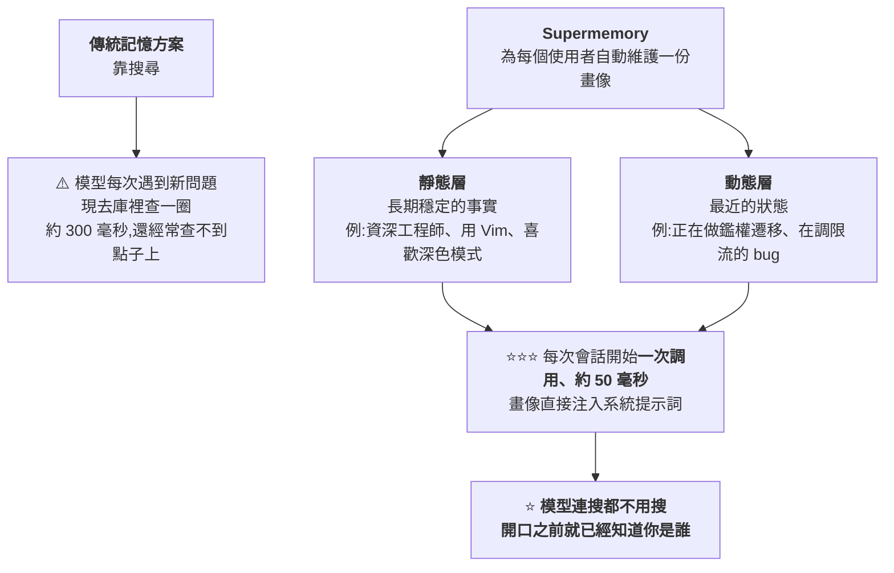
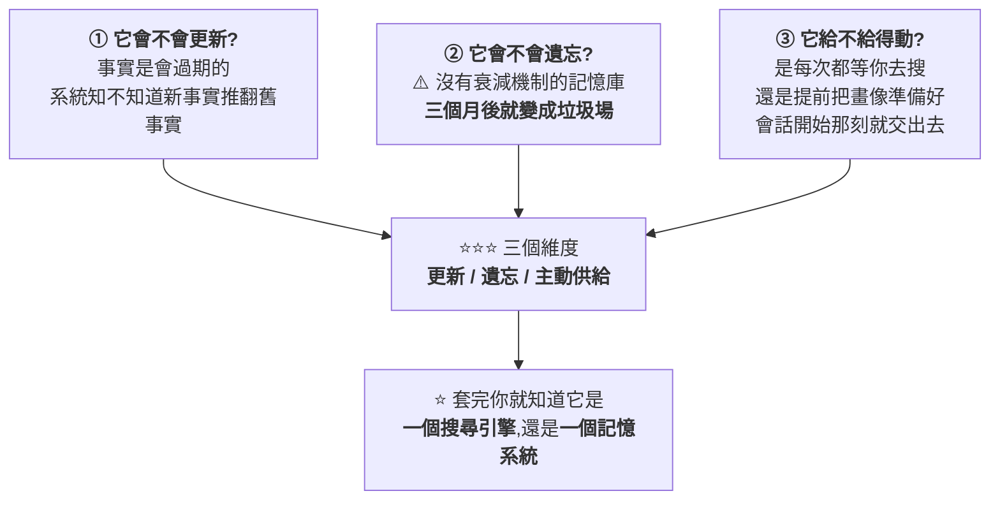

# 好的記憶系統贏在「會忘記」:Supermemory 拆解,與評估任何記憶方案的三個問題

> 整理自 YouTube 頻道 **Why QQ**〈[20岁辍学生做出 AI 记忆基准第一:Supermemory 怎么解决 AI 失忆?](https://www.youtube.com/watch?v=SHRkOI0yO4Q)〉(2026-09-21,約 11.6 分鐘,官方 zh-Hans 字幕)。
>
> ⭐⭐⭐ **本文已 `git clone` [supermemoryai/supermemory](https://github.com/supermemoryai/supermemory) 讀過 README 與 monorepo 結構**,
> **全部跑分數字、port、MCP 工具、本地部署說明皆已核實**,
> ⚠️ **並抓到兩處需補正、補上一組影片沒給但很關鍵的數字**(見 §七)。
>
> ⚠️⚠️ **最重要的一句先說在前面,而且這是影片自己講的:**
> **「所有廠商的基準分數,**都是自報的**。」** —— 本文完全同意,詳見 §六。

---

## 一句話總結

> ⭐⭐⭐ **「好的記憶系統,**贏在會忘記**。」**
>
> ⭐⭐⭐ **而最該帶走的不是這個專案,是 §八那個**評估任何記憶系統的三個問題**:
> **會不會更新、會不會遺忘、給不給得動。****

---

## 一、⭐⭐ 問題不是「窗口不夠大」

> ⚠️ **「你的 Claude Code 其實患有失憶症。早上花半小時講清楚專案結構,下午開個新會話,它又是一張白紙。」**

**⭐ 而「上下文窗口都一百萬 token 了,把歷史全塞進去不就行了?」——影片說這恰恰是最大的誤區:**

| ⚠️ 為什麼塞更多沒用 |
|---|
| **塞得越多,模型越抓不住重點,帳單也越難看** |
| ⭐⭐ **關鍵資訊埋在長上下文中間時準確率明顯下滑** —— 也就是 **lost in the middle** |

> ⭐⭐⭐ **「真正的解法,是讓系統知道**該記住什麼、該忘掉什麼**。」**

📎 **這與本庫 [[kv-cache]]、[[claude-md-cut-82-percent-and-maintain-it]] 的上下文預算思路是同一條線。**

---

## 二、⭐ 專案本身(⭐ 數據為本文 2026-09-22 實查 GitHub API)

| 項目 | 數值 |
|---|---|
| **倉庫** | `supermemoryai/supermemory` |
| ⭐ **star** | **30,776**(⚠️ 影片寫稿時 30,386,兩天內仍在漲) |
| **fork** | **2,684** |
| **授權** | ⭐ **MIT**(商用無障礙) |
| **主語言** | **TypeScript** |
| **建立** | **2024-02-27** ✅(與影片「2024 年 2 月」一致) |
| **官方定位** | **"State-of-the-art memory and context engine for AI"** |

### ⭐ monorepo 結構(本文實際清點)

| 目錄 | 內容 |
|---|---|
| **`apps/`** | **docs、web、mcp、raycast-extension、memory-graph-playground、sdk-playground** |
| **`packages/`** | **ai-sdk、openai-sdk-python、agent-framework-python、pipecat-sdk-python、cartesia-sdk-python、memory-graph、hooks、lib、tools、ui、validation** |
| **`skills/`** | **supermemory** |

> ⚠️ **補正一:影片說 packages 底下「Vercel、LangChain、LangGraph、OpenAI、Mastra 都有現成的封裝」——
> ⭐ **本文實際清點:monorepo 裡有 `ai-sdk`(Vercel)與 `openai-sdk-python`,
> 但**沒有 LangChain、LangGraph、Mastra 的套件目錄****(可能在別處或只是文件整合,本文未進一步查證)。**

### ⭐ 創辦人背景(⚠️ 影片轉述,本文未核實)

> **Dhravya Shah,孟買人,自學程式;16 歲把一個推文截圖工具賣給 Hypefury;
> 在 Mem0 做過 AI 工程師、在 Cloudflare 做過開發者關係;
> 定了個「40 週、每週做一個新專案」的挑戰,**Supermemory 就是從這 40 個專案裡長出來的**。
> 2025-10 拿到 260 萬美元種子輪,Susa Ventures 領投。**

---

## 三、⭐⭐⭐ 核心主張:記憶和 RAG 是兩件事

**⭐ README 原文本文已核實:**

> ⭐⭐⭐ **"**Memory is not RAG.** RAG retrieves document chunks — stateless, same results for everyone.
> Memory extracts and tracks *facts about users* over time."**

| | **RAG** | ⭐ **記憶** |
|---|---|---|
| **檢索的是** | **文件片段** | **關於人的事實** |
| **狀態** | ⚠️ **無狀態** | ⭐ **有狀態,而且事實會變** |
| **結果** | **對所有人一樣** | **因人而異** |

### ⭐⭐⭐ 官方那個例子很好懂(README 原文已核實)

> **三月你說「我住在紐約」,七月你說「我剛搬去舊金山」。**

| 系統 | 行為 |
|---|---|
| ⚠️ **RAG** | **把兩句話都檢索出來 → 模型看著兩條矛盾記錄自己猜** |
| ⭐⭐ **Supermemory** | **後一條事實直接覆蓋前一條,同時保留時間線** —— 官方原文:**"It understands that 'I just moved to SF' supersedes 'I live in NYC.'"** |

> ⭐⭐⭐ **「記憶的難點從來不是**存**,是**改**。」**

---

## 四、⭐⭐⭐ 三個設計,一個比一個反直覺

### 4.1 ⭐⭐⭐ 它會**主動遺忘**

**⭐ README 原文已核實:**

> **"**Automatic forgetting.** Temporary facts ('I have an exam tomorrow') expire after the date passes.
> Contradictions are resolved automatically. **Noise never becomes permanent memory.**"**

> ⭐⭐⭐ **影片的觀察很準:「**大多數做記憶的團隊,都在卷怎麼記得更多;這個專案在做怎麼忘得乾淨。**」**

### 4.2 ⭐⭐⭐ 用戶畫像:不等你搜,開口前就給



📌 **⭐ README 已核實:"User Profiles — Auto-maintained user context — stable facts + recent activity. **One call, ~50ms**."**

> ⭐⭐ **影片預先回答了一個很自然的質疑:「這不就是把使用者資料提前快取了嗎?」**
> **「對,**但快取的內容是機器自己提煉和更新的** —— 這才是難點。」**

### 4.3 ⭐⭐ fail-open:記憶掛了,聊天不能掛

> **「他們做了透明代理:請求經過 Supermemory 時,**如果記憶服務報錯,原始請求會原封不動地轉發給模型提供商**。」**
>
> ⭐⭐⭐ **「fail-open 這個設計,做過後端的人都懂 —— **這是把可靠性放在功能前面的思路**。」**

⚠️ **本文未能在 README 中找到這段透明代理與 fail-open 的描述,列為未核實(見 §七)。**

---

## 五、⭐⭐ 跑分(⭐ 全部已對 README 核實)

| 基準 | 測什麼 | 結果 |
|---|---|---|
| **LongMemEval** | **跨會話長期記憶與知識更新** | ⭐ **#1** |
| **LoCoMo** | **長對話裡的事實回憶**(單跳、多跳、時序、對抗樣本) | ⭐ **#1** |
| **ConvoMem** | **個性化與偏好學習** | ⭐ **#1** |

> ⭐⭐⭐ **最能打的不是排名,是效率:**
> **「95% Recall@15,同時只往上下文加了約 **720 個 token** —— **上下文占用壓縮 99.4%**。」**
> **(@10 是 99.6%、@5 是 99.8%。)**

### ⭐⭐ 本文補上影片沒給、但很重要的分項召回率

| 類別 | 召回率 |
|---|---|
| **Assistant recall** | **100%** |
| **Knowledge Updates** | **99%** |
| **User recall** | **97%** |
| **Multi-session** | **93%** |
| ⚠️ **Temporal Reasoning** | **91%** |
| ⚠️⚠️ **Preference** | **90%** |

> ⭐⭐⭐ **這組分項很值得看:**
> ⚠️ **最弱的兩項正好是「時序推理」與「偏好」** ——
> **而這兩項恰恰是它主打的「時序事實圖譜」與「個性化畫像」想解決的問題。**
> ⭐ **不是說它做不好(90–91% 已經很高),而是**這裡仍是最難的部分**,別因為排名第一就假設它已經解決了。**

### ⭐ SMFS 檔案系統(已核實)

> **他們還做了 **Supermemory Filesystem(SMFS)**,在 110 題的 xAFS 基準上:**
> **Claude 上 token 消耗 **從 7,200 萬降到 2,400 萬(3.0×)**、Codex 上省 **1.75×**。**

---

## 六、⚠️⚠️⚠️ 影片自己潑的那盆冷水,本文完全同意

> ⚠️⚠️ **「所有廠商的基準分數,**都是自報的**。」**

| 廠商 | 自報數字 |
|---|---|
| **Supermemory** | **95% 召回、三項第一** |
| **Mem0** | **93.4%** |
| ⚠️ **Zep** | **在不同口徑下報過 71.2% 和 94.7%** |

**⭐⭐⭐ 而最關鍵的一組觀察來自第三方論文:**

> **同一套 LongMemEval,**Supermemory 換三個答題模型,跑出 85.2 / 84.6 / 81.6 三個分數**。**
>
> ⭐⭐⭐ **「結論很清楚:**分數跟著配置走,不跟著品牌走。**」**

### ⭐⭐ 值得肯定的一件事:他們把評測工具開源了

> **Supermemory 開源了 **MemoryBench** ——
> ⭐ README 明寫:**"Compare Supermemory, Mem0, Zep, and others head-to-head"**,附可跑的指令。**

> ⭐⭐⭐ **影片的結論本文照錄:「選型的唯一標準,是**在你的真實對話歷史上實測**。」**

---

## 七、⚠️ 本文核實後的補正與未核實項

### ⚠️ 需補正

| # | 影片說法 | ⭐ **實際** |
|---|---|---|
| **①** | **packages 底下 LangChain、LangGraph、Mastra 都有現成封裝** | ⚠️ **monorepo 裡沒有這三個套件目錄**(有 `ai-sdk` 與 `openai-sdk-python`) |
| ⚠️ **②** | **框架描述為「Supermemory 三萬星,是這個賽道的領先者」的隱含印象** | ⚠️⚠️ **本文實查:Mem0 有 **65,790 star**(超過兩倍)、Zep 的 Graphiti **31,060 star**(略高於 Supermemory 的 30,776)** —— ⭐ **star 數不等於品質,但「三萬星」這個數字在賽道裡不是特別突出,影片沒給對手的數字** |

### ⚠️ 未能核實

| 項目 |
|---|
| ⚠️ **`dynamic dreaming`(後台重讀文件與記憶、調和矛盾的持續運行引擎)** —— **README 中查無此詞**,可能在官方文件站,本文未取得 |
| ⚠️ **透明代理與 fail-open 設計** —— **README 中查無** |
| ⚠️ **創辦人經歷、260 萬美元種子輪、投資人名單、YC 找過但沒去** —— **未獨立查證** |
| ⚠️ **傳統記憶方案「一次查詢約 300 毫秒」** —— **無出處** |
| ⚠️ **Mem0 / Zep / Letta / LangMem 的技術路線描述與自報分數** —— **未逐項查證**(⭐ 但四個 repo 的 star / 授權 / 語言本文已實查) |
| ⚠️ **「第三方論文」的 85.2 / 84.6 / 81.6 三個分數** —— **未取得該論文原文** |

---

## 八、⭐⭐⭐ 最該帶走的:評估任何記憶系統的三個問題



> ⭐⭐⭐ **「你以後看到任何記憶類產品 —— Mem0、Zep,或者模型廠商自帶的功能 —— 都可以拿這三條去套。」**

---

## 九、⭐ 這個賽道上還有誰(⭐ star 數為本文實查)

| 專案 | ⭐ **star** | 授權 | 路線 |
|---|---|---|---|
| ⭐ **Mem0** | **65,790** | **Apache-2.0** | **抽取 + 檢索;向量庫加一層可選圖譜。⚠️ 影片說 2026-04 更新演算法後 LongMemEval 衝到 93.4%(未核實)** |
| **Graphiti(Zep)** | **31,060** | **Apache-2.0** | ⭐ **雙時序知識圖譜**:每條事實帶生效與失效時間,**舊事實不刪除只作廢,歷史全程可溯源** |
| **Supermemory** | **30,776** | ⭐ **MIT** | **時序事實圖譜 + 主動畫像** |
| **Letta**(前身 MemGPT) | **24,830** | **Apache-2.0** | ⭐⭐ **思路最野:把作業系統的記憶體管理搬進 Agent,模型自己決定什麼留在上下文、什麼換出去** |
| **LangMem** | — | — | **綁在 LangGraph 生態裡** |

> ⭐⭐ **「共識已經形成:**記憶需要獨立一層**。分歧只在怎麼實現。」**

### ⭐ 差異集中在三個地方(影片整理,本文認為很到位)

| 維度 | 差異 |
|---|---|
| **① 運維成本** | ⚠️ **Zep 自託管要自己養一個 Neo4j 或 FalkorDB;⭐ Supermemory 本地版是一個二進位檔、零配置、資料全在一個資料夾** |
| ⭐⭐ **② 主動供給** | **Mem0 與 Zep 的主力路徑是**查詢觸發**(你問才給);⭐ Supermemory 把畫像做成一等公民,**會話開始就主動交出去**** |
| **③ 輸入面** | **競品主要吃對話;⭐ Supermemory 直接吃檔案(PDF、圖片、影片、程式碼)與 Gmail / Notion 即時同步** |

> ⚠️⚠️ **代價也明顯,影片講得很誠實:**
> **「每一步都要過 LLM,**寫入成本和延遲比純向量方案高**。有第三方論文測過,它每個操作都涉及模型調用 ——
> **貴有貴的道理,也確實更貴。**」**

---

## 十、⭐⭐ 對程式設計師最友好的一點:可以完全本地跑

**⭐ README 原文已核實:**

```bash
curl -fsSL https://supermemory.ai/install | bash
# 或
npx supermemory local

supermemory-server
```

| 項目 | ⭐ **已核實** |
|---|---|
| **本地服務 port** | **`http://localhost:6767`** |
| ⭐⭐ **上雲只要改一行** | **`baseURL: "http://localhost:6767"` ← "that's the only change"** |
| **模型** | **OpenAI / Anthropic / Gemini / Groq,或任何相容 OpenAI 的端點;首次啟動有互動向導** |
| ⭐ **Embedding 預設** | **本地 `Xenova/bge-base-en-v1.5`,**不需要任何 API key**** |
| ⭐⭐ **完全離線** | **接 Ollama(README 明寫 `gpt-oss:20b` works great),**一個位元組都不會離開你的機器**** |
| **資料位置** | **全在 `./.supermemory` 資料夾,備份遷移就是複製貼上** |

### ⭐ MCP 服務只暴露三個工具(README 已核實,與影片完全一致)

| 工具 | 做什麼 |
|---|---|
| **`memory`** | **存與忘** —— "Save or forget information" |
| **`recall`** | **依查詢搜記憶**,回傳相關記憶 + 使用者畫像摘要 |
| ⭐ **`context`** | **在會話開頭注入完整畫像**(Cursor 與 Claude Code 裡直接打 `/context`) |

**⭐ 官方支援的用戶端(README 原文):Claude Desktop、Cursor、Windsurf、VS Code、Claude Code、OpenCode、OpenClaw、Hermes。**

---

## 應用案例

### 案例 1|⭐⭐⭐ 拿那三個問題去審視你現在的方案

| 問題 | 如果答案是「不會 / 不給」 |
|---|---|
| **會不會更新?** | ⚠️ **你的知識庫裡遲早同時存在「住紐約」和「住舊金山」,而模型會自己猜** |
| **會不會遺忘?** | ⚠️⚠️ **三個月後變垃圾場** —— **這是最常被忽略的一條** |
| **給不給得動?** | ⚠️ **每次都要花一次檢索(約 300ms)去撈,還經常撈不到點上** |

⭐ **就算你不打算換方案,把這三題問過一遍也會知道下一步該補哪裡。**

### 案例 2|⭐⭐ 花十分鐘把本地版跑起來,感受畫像注入前後的差別

```bash
npx supermemory local && supermemory-server
# 首次啟動:互動向導選模型、印出 API key
# 然後把你現有的 client baseURL 改成 http://localhost:6767
```

> ⭐⭐⭐ **影片的建議本文認為是全片最實在的一句:**
> **「想想你的產品裡,**哪些東西值得被記住、哪些應該被遺忘** ——
> **這個思考本身,比任何一個 SDK 都值錢。**」**

### 案例 3|⭐⭐⭐ 別看廠商自報分數,用 MemoryBench 跑你自己的資料

```bash
bun run src/index.ts run -p supermemory -b longmemeval -j gpt-4o -r my-run
```

> ⚠️⚠️ **§六已經給了最強的理由:**同一套 LongMemEval,換三個答題模型就跑出 85.2 / 84.6 / 81.6**。
> ⭐⭐⭐ **分數跟著配置走,不跟著品牌走。**

📌 ⭐ **公平地說,一個廠商願意開源「能把自己跟對手擺在一起比」的評測框架,這個動作值得肯定。**

### 案例 4|⭐⭐ 把 fail-open 的思路抄走

> ⭐⭐⭐ **「記憶服務掛掉時,**原始請求原封不動轉發給模型** —— 記憶掛了,聊天不掛。」**

```python
def with_memory(request, memory_client, model_client, timeout_s: float = 0.2):
    """替請求補上記憶上下文;記憶層失敗時直接放行原始請求。

    Args:
        request: 原始請求物件。
        memory_client: 記憶服務用戶端。
        model_client: 模型提供商用戶端。
        timeout_s: 記憶查詢的逾時秒數,超過就放棄補上下文。

    Returns:
        模型回應。記憶層任何失敗都不影響主流程。
    """
    try:
        profile = memory_client.profile(request.user_id, timeout=timeout_s)
        request = request.with_system_prefix(profile)
    except Exception:
        pass  # ⭐ fail-open:寧可少了畫像,也不能讓對話整個掛掉
    return model_client.send(request)
```

⚠️ **注意:這段是依影片描述寫的概念示範,**本文未能在 repo 中找到對應實作**(見 §七)。**

---

## 重點回顧(TL;DR)

1. ⚠️ **問題不是「窗口不夠大」** —— 塞得越多模型越抓不住重點,而且有 **lost in the middle**。**真正的解法是讓系統知道該記住什麼、該忘掉什麼。**
2. ⭐⭐⭐ **核心主張:記憶和 RAG 是兩件事。** RAG 檢索文件片段、無狀態、對所有人一樣;**記憶追蹤的是關於人的事實,而且事實會變**(「我剛搬去舊金山」會覆蓋「我住在紐約」,同時保留時間線)。
3. ⭐⭐⭐ **它會主動遺忘**:臨時事實(「我明天有考試」)過期自動作廢 —— **「大多數團隊在卷怎麼記得更多,這個專案在做怎麼忘得乾淨。」**
4. ⭐⭐⭐ **用戶畫像是一等公民**:靜態層(資深工程師、用 Vim)+ 動態層(正在做鑑權遷移);**會話開始一次調用約 50 毫秒直接注入系統提示詞,模型連搜都不用搜**。
5. ⭐ **fail-open**:記憶服務報錯時原始請求原封不動轉發 —— **記憶掛了,聊天不掛**。⚠️ 此項 README 查無。
6. ⭐⭐ **跑分(已核實)**:LongMemEval / LoCoMo / ConvoMem **三項第一**;**95% Recall@15 只加約 720 token,上下文壓縮 99.4%**;SMFS 在 xAFS 110 題上讓 Claude 的 token 從 7,200 萬降到 2,400 萬。
7. ⭐⭐ **本文補上的分項召回率**:Assistant 100%、Knowledge Updates 99%、User 97%、Multi-session 93%、⚠️ **Temporal Reasoning 91%、Preference 90%** —— **最弱的兩項正好是它主打要解決的**。
8. ⚠️⚠️⚠️ **「所有廠商的基準分數都是自報的」** —— **同一套 LongMemEval,Supermemory 換三個答題模型就跑出 85.2 / 84.6 / 81.6**。⭐ **分數跟著配置走,不跟著品牌走。**
9. ⭐ **值得肯定:他們開源了 MemoryBench,明文支援把自己跟 Mem0、Zep 擺在一起比。**
10. ⚠️⚠️ **本文兩處補正**:①**monorepo 裡沒有 LangChain / LangGraph / Mastra 的套件目錄**;②**star 數上 Mem0(65,790)是它的兩倍多、Graphiti(31,060)也略高於它(30,776)** —— 影片沒給對手數字。
11. ⭐⭐ **可以完全本地跑**:一個二進位檔、零配置、port **6767**、預設本地 embedding 不需 API key、接 Ollama 可完全離線、資料全在 `./.supermemory`;**上雲只要改一行 `baseURL`**。
12. ⭐ **MCP 只暴露三個工具**:`memory`(存與忘)、`recall`(查)、`context`(會話開頭注入畫像)。
13. ⚠️ **代價很誠實**:每一步都要過 LLM,**寫入成本與延遲比純向量方案高** —— 貴有貴的道理,也確實更貴。
14. ⭐⭐⭐ **最該帶走的:評估任何記憶系統的三個問題 —— 會不會更新、會不會遺忘、給不給得動。** 套完就知道它是搜尋引擎還是記憶系統。
15. ⭐⭐⭐ **一句話:「好的記憶系統,贏在會忘記。」**

---

## 核實狀態

### ✅ 已核實(已 clone 讀 README 與 monorepo + GitHub API)

| 項目 | 結果 |
|---|---|
| **star 30,776 / fork 2,684 / MIT / TypeScript / 2024-02-27 建立** | ✅ |
| **三項基準 #1、95% Recall@15、約 720 token、99.4% 壓縮** | ✅ |
| **分項召回率(100/99/97/93/91/90)** | ✅(⭐ 影片未提) |
| **SMFS:xAFS 110 題,Claude 7,200 萬 → 2,400 萬、Codex 1.75×** | ✅ |
| **"Memory is not RAG"、紐約→舊金山例子、自動遺忘與考試例子** | ✅(README 原文逐句一致) |
| **本地版:一行安裝、port 6767、預設本地 bge embedding、Ollama 可完全離線、`./.supermemory`、改 baseURL 上雲** | ✅ |
| **MCP 三個工具 `memory` / `recall` / `context`** | ✅ |
| **MemoryBench 開源且明文支援與 Mem0、Zep 對比** | ✅ |
| **Mem0 / Graphiti / Letta 的 star、授權、語言** | ✅(2026-09-22 實查) |

### ⚠️ 未能核實

**見 §七** —— 主要是 `dynamic dreaming`、fail-open 透明代理、創辦人經歷與融資、「300 毫秒」、各家自報分數與那篇第三方論文。

> 📌 **⭐ 依本庫慣例,clone 已在整理完成後刪除,未進版控。**
> ⚠️⚠️ **本文未實際部署或執行 Supermemory**,所有描述皆出自閱讀影片逐字稿與 repo 文件。

---

## 來源

- [20岁辍学生做出 AI 记忆基准第一:Supermemory 怎么解决 AI 失忆? — Why QQ](https://www.youtube.com/watch?v=SHRkOI0yO4Q)(2026-09-21,約 11.6 分鐘,官方 zh-Hans 字幕)
- ⭐⭐⭐ **一手素材(已 clone 讀過)**:[supermemoryai/supermemory — GitHub](https://github.com/supermemoryai/supermemory)(MIT;本文查詢時 30,776 star)
- **基準測試原始倉庫**:[LongMemEval](https://github.com/xiaowu0162/LongMemEval) · [LoCoMo](https://github.com/snap-research/locomo) · [ConvoMem](https://github.com/Salesforce/ConvoMem)
- **同賽道專案**:[mem0ai/mem0](https://github.com/mem0ai/mem0)(65,790 star)· [getzep/graphiti](https://github.com/getzep/graphiti)(31,060 star)· [letta-ai/letta](https://github.com/letta-ai/letta)(24,830 star)
- 延伸:本庫 [[codebase-memory-vs-codegraph-two-routes]]、[[claude-md-cut-82-percent-and-maintain-it]](上下文預算)、[[kv-cache]]、[[milvus-architecture-vector-database]](⭐ 向量庫解決「找文件」,記憶層解決「懂使用者」)、[[token-vs-embedding-llm-and-rag]]。
