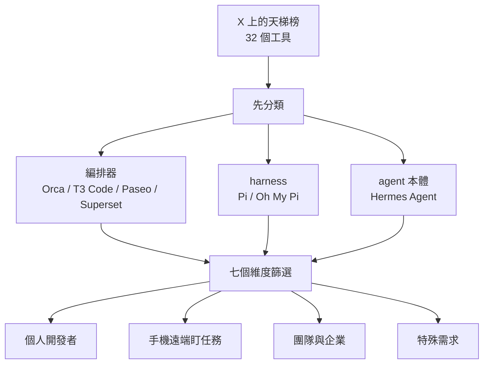
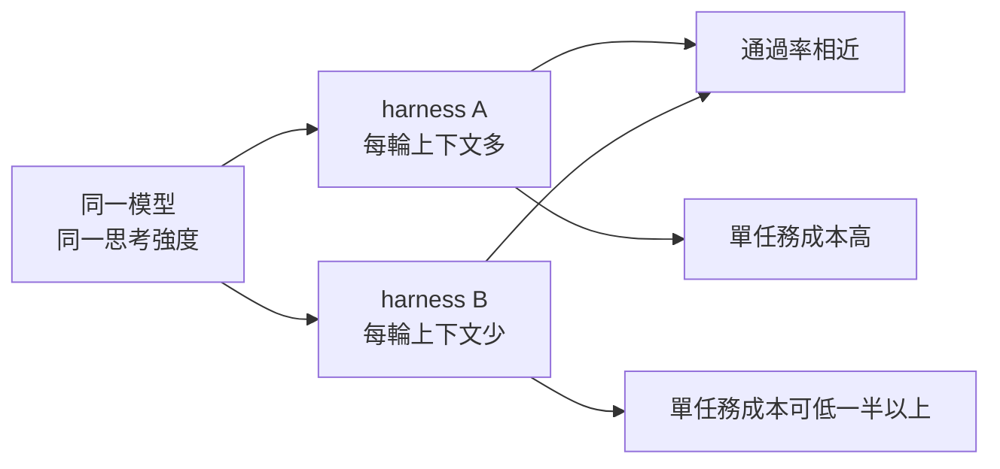
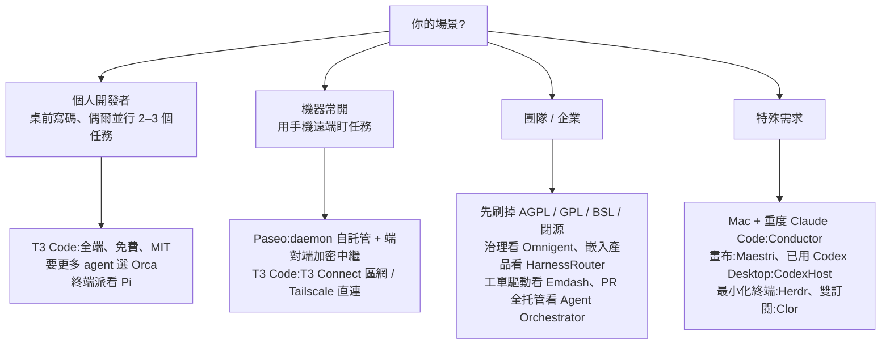

# 32 個 AI 編排器怎麼挑:星數第一的不是編排器,七個維度與四類場景選型清單(Why QQ)

**主題分類:** 科技 / AI Agent — 資源與工具選型(多 agent 編排器、harness、coding agent 工作台)
**來源:** YouTube〈25万星第一名主业竟然不是AI 编排器〉(Why QQ,2026-10-09,約 9 分;**依官方簡中字幕整理**)
**一手素材核實:** 影片說明欄附的[數據原文(lightnote 部落格)](https://blog.lightnote.com.cn/32-ai-orchestrators-benchmark-7-dimensions/)、GitHub API(2026-10-10 重新拉取)、[Databricks 2026-07-08 基準報告](https://databricks.com/blog/benchmarking-coding-agents-databricks-multi-million-line-codebase)
**整理日期:** 2026-10-10

> 📌 **立場:** 本片未見業配或付費社群推廣。影片不評價 X 上那張「天梯榜」(作者個人體驗排名),只借用名單,改用 GitHub 數據與官方文件重新比較。
>
> 📎 相關:Databricks 基準的四道條件與 Pi 原始碼拆解見 [[pi-minimal-agent-harness-teardown]];把 Hermes 改造成主 agent 路由中樞的實作見 [[hermes-main-agent-orchestration]]。

---

## TL;DR

1. **先分類再比較**:這份 32 個工具的名單混了三種東西——**編排器**(同時管多個 agent 的工作台)、**harness**(包住模型的那層殼,如 Pi)、**agent 本體**(如 Hermes Agent)。不先分開,星數比較就是空對空。
2. **星數第一的 Hermes Agent(約 25 萬星)主業是通用 agent runtime**,編排只是功能之一;第二名 Pi 是 harness;**嚴格意義的編排器第一名是 Orca(約 8.5 萬星,2026 年 3 月才建立)**。
3. **只看總星數會騙人**——要除以存活月數。Traycer 2024 年 5 月就存在,攤下來每月只有約 55 星。
4. **七個維度**:社群影響力、月均增星、能力廣度、開放程度(授權)、自動化、安全與可持續、成本。
5. **成本的大頭是 token 不是工具費**:Databricks 基準顯示**同模型、同思考強度,只換外殼,通過率持平但單任務成本可差兩倍以上**,差在每輪餵給模型的上下文量。
6. **授權是硬篩選**:要二次開發或商用,AGPL / GPL / BSL / ELv2 / 閉源會直接刷掉一大半候選。
7. 結論不是一張排名,而是**把七個維度當成自己的篩選器**:輸入場景 → 輸出候選 → 親手試兩天。



---

## 1. 口徑:數據從哪來

| 項目 | 來源 |
|---|---|
| 星數、fork、建立時間 | 2026-10-05 透過 GitHub API 拉取的快照 |
| 功能、平台、授權、價格 | 各專案官網與文件同日狀態 |
| 性能 / 成本比較 | Databricks 2026-07-08 內部基準(自家數百萬行生產程式碼庫,任務取自真實合併過的 PR) |

- 32 個裡 **24 個有公開倉庫**,其餘多為閉源產品(Conductor、Maestri、super.engineering、Solo、Jean、Agentastic、HarnessRouter、Clor)。
- ⚠️ **GitHub 的 `open_issues_count` 其實包含 open PR**,影片統一按合計值標註——自己查時別誤以為全是 bug。

---

## 2. 社群影響力與月均增星

| 名次 | 工具 | 類型 | 星數(10-05 快照) | 建立 | 月均增星 |
|---|---|---|---|---|---|
| 1 | Hermes Agent | agent runtime | 約 25.1 萬 | 2025-07 | 約 1.7 萬 |
| 2 | Pi | harness | 約 11.3 萬 | 2025-08 | 約 8,100 |
| 3 | **Orca** | **編排器** | 約 8.5 萬 | **2026-03** | 約 1.3 萬 |
| 4 | Herdr | 終端複用器 | 約 4.2 萬 | 2026-03 | 約 6,700 |
| 5 | Oh My Pi | harness 分叉 | 約 3.4 萬 | 2025-12 | 約 3,800 |
| 6 | T3 Code | 編排器 | 約 2.5 萬 | 2026-02 | 約 3,200 |
| 7 | Paseo | 編排器 | 約 1.95 萬 | 2025-10 | 約 1,700 |
| 8 | OpenCodeX | 見下方補正 | 約 1.7 萬 | 2026-06 | 約 4,700 |
| 9 | Superset | 編排器 | 約 1.5 萬 | 2025-10 | 約 1,300 |
| 10 | Agent Orchestrator | 編排器 | 約 1.3 萬 | 2026-02 | 約 1,700 |
| 11 | Omnigent | 元編排器 | 約 1.1 萬 | 2026-06 | 約 2,800 |
| — | Traycer | 編排器 | 約 1,600 | **2024-05** | **約 55** |

**影片的兩個結論:**

1. 天梯榜作者的日常體驗排序,和 GitHub 關注度排名**明顯錯位**——體驗好不等於熱門,反之亦然。
2. 增速只反映**當下動能**,三個月的新專案明年也可能停更。

### 核實(GitHub API,2026-10-10 重拉)

| 專案 | 倉庫 | 10-10 星數 | 建立日 | 授權 | 結果 |
|---|---|---|---|---|---|
| Hermes Agent | [NousResearch/hermes-agent](https://github.com/NousResearch/hermes-agent) | 252,294 | 2025-07-22 | MIT | ✅ |
| Pi | [earendil-works/pi](https://github.com/earendil-works/pi) | 113,801 | 2025-08-09 | MIT | ✅(倉庫已從原作者帳號搬到 earendil-works) |
| Orca | [stablyai/orca](https://github.com/stablyai/orca) | 88,610 | 2026-03-17 | MIT | ✅(五天又多約 3,600 星) |
| Herdr | [herdrdev/herdr](https://github.com/herdrdev/herdr) | 43,117 | 2026-03-27 | Apache-2.0 | ✅ |
| Oh My Pi | [can1357/oh-my-pi](https://github.com/can1357/oh-my-pi) | 34,798 | 2025-12-31 | MIT | ✅ |
| T3 Code | [pingdotgg/t3code](https://github.com/pingdotgg/t3code) | 26,632 | 2026-02-08 | MIT | ✅ |
| Paseo | [getpaseo/paseo](https://github.com/getpaseo/paseo) | 20,275 | 2025-10-13 | Apache-2.0 | ✅(GitHub 顯示 NOASSERTION,LICENSE 檔內文為 Apache 2.0) |
| OpenCodeX | [lidge-jun/opencodex](https://github.com/lidge-jun/opencodex) | 17,194 | 2026-06-18 | MIT | ⚠️ 見下 |
| Superset | [superset-sh/superset](https://github.com/superset-sh/superset) | 15,036 | 2025-10-21 | ELv2 | ✅ |
| Agent Orchestrator | [OrchestratorInc/agent-orchestrator](https://github.com/OrchestratorInc/agent-orchestrator) | 13,004 | 2026-02-13 | Apache-2.0 | ✅ |
| Omnigent | [omnigent-ai/omnigent](https://github.com/omnigent-ai/omnigent) | 10,706 | 2026-06-11 | Apache-2.0 | ✅ |
| Emdash | [generalaction/emdash](https://github.com/generalaction/emdash) | 5,946 | 2025-08-28 | Apache-2.0 | ✅(⚠️ 另有同名的 emdash-cms/emdash 是 CMS,別搜錯) |

> ⚠️ **補正 OpenCodeX 的定位**:影片說它「資料不足,不歸入任何組」。其倉庫描述是「OpenAI Codex 與 Claude Code 的**通用模型供應商代理**(讓它們接任意 LLM)」——**它比較像換模型的轉接層,不是編排器**,放進這份名單本身就是分類問題的又一例。

---

## 3. 能力廣度:官方支援幾個 agent

| 工具 | 官方支援的 agent |
|---|---|
| Agentastic | 內建 55 個定義,30 個支援結構化 Chat |
| Paseo | 官方目錄 40 多個,另可接任意 ACP agent |
| Orca | 30 多個常見 agent,支援任意可在終端跑的 CLI |
| Agent Orchestrator | 約 27 個 |
| Superset | 22 個內建 + 自訂 CLI |
| T3 Code | 穩定版 6 個;10-02 的 V2 nightly 加入 Pi 與 ACP Registry |

- ⚠️ **Pi 的「15 家」是模型供應商,不是可編排的 agent**,口徑不同不能並排比。
- 數字按週在變,**「支援任意 CLI / 任意 ACP」這種機制比當下數字重要**。
- **平台**:全端(桌面 + 網頁 + 手機)只有 Orca、T3 Code、Paseo 三家;只做 Mac 五家、只做終端四家。
- **自動化**:至少七家有定時任務;**會自己修 CI 的只有 Agent Orchestrator**。

---

## 4. 開放程度:授權直接決定候選名單

| 授權 | 工具 | 意義 |
|---|---|---|
| MIT / Apache(約 20 家) | Orca、T3 Code、Paseo、Herdr、OpenCodeX 等 | 可自由商用與二次開發 |
| AGPL | Kandev | 傳染性強,網路服務也要開源 |
| GPL | Waku | 散布衍生作品須開源 |
| LGPL | CodexHost | 連結使用較寬,修改本體須開源 |
| ELv2 | Superset | 原始碼可見,**不能拿來做託管服務賣** |
| BSL | Reliant | 每個版本發布 **4 年後自動轉 Apache** |
| 閉源 | Conductor、Maestri、super.engineering | 公司方向一變,工作流就得跟著遷 |
| 混合 | Clor | 控制平面閉源,容器與技能部分開源 |

> 💡 **商用整合前讓法務看一眼**——對想二次開發的人,這一個維度就足以刷掉三分之一的名單。

---

## 5. 安全與可持續

- **權限越大、攻擊面越大**:Hermes Agent 功能強(能自己沉澱技能、掛各種訊息平台),影片稱 CVE 資料庫收錄 **44 筆**,另有一名社群研究者 4 月 11 日提交的獨立審計列出 **4 個嚴重 + 9 個高危**。ℹ️ 這兩個數字本筆記未能逐筆核實。
- **待處理量**(issue + PR 合計):Hermes 約 4.8 萬(✅ 10-10 實查 48,097)、Orca 約 7,500(10-10 已到 8,306)、T3 Code 約 2,200(10-10 為 2,945)。社群最大,待處理量也最大。
- **巴士因子**:Paseo 數據很好但**單人維護**,團隊採購要有備案。
- **閉源風險**:供應商轉向或收費策略改變,整套流程都得遷。

---

## 6. ⭐⭐⭐ 成本:工具免費,token 不免費

| 層 | 內容 | 例子 |
|---|---|---|
| 1. 工具費 | 多數免費 | Traycer 每月 8 美元起、Maestri 19 美元、Superset 遠端每人 20 美元、Conductor Pro 50 美元(含雲端工作區額度)、Solo Pro 每年 99 美元 |
| 2. 模型費 | 自備帳號 | API 額度或既有訂閱 |
| 3. **token 消耗** | **最容易翻車** | 外殼每輪餵多少上下文,直接決定帳單 |

**Databricks 2026-07-08 基準**(✅ 原文核實,細節見 [[pi-minimal-agent-harness-teardown]] §12):

- 同模型、同思考強度,只換 harness → **通過率基本持平,單任務成本在部分場景差兩倍以上**;
- 差距來自每輪送給模型的上下文量,**Pi 每輪約只有對照組的三分之一**;
- 簡單 harness 多次站上性價比前沿。
- ⚠️ **這份基準只測 Pi,沒測 Oh My Pi**,結論不能自動外推到分叉版。
- ⚠️ Databricks 自己也說,教訓不是「某個 harness 永遠比較便宜」,而是「模型的 token 單價是端到端成本的差勁指標」;若你用的是固定月費訂閱而不是 API 計價,這筆帳又不一樣。



---

## 7. 按數據分成五組

| 組別 | 成員 | 特點 |
|---|---|---|
| 全功能桌面 | Orca、Superset、T3 Code | 功能完整、社群大 |
| 自託管 + 手機 | Paseo、Kandev | daemon 架構,手機可用(Kandev 無原生 App,手機網頁可用) |
| 終端原生 | Pi、Oh My Pi、Herdr、Sidecar | 鍵盤流、輕量 |
| 治理 / 企業 | Omnigent、HarnessRouter、Traycer | 策略、預算、隔離 |
| 專用場景 | Conductor(綁 Claude 生態)、Maestri(畫布)、CodexHost(寄生 Codex Desktop)、Agent Orchestrator(PR 全流程)、Emdash(接工單)、Clor(容器隔離) | 對號入座 |

五組沒有誰輾壓誰,服務的是不同工作流。

---

## 8. ⭐⭐ 四類場景選型清單



| 場景 | 看哪三個維度 | 候選 |
|---|---|---|
| **個人開發者** | 平台覆蓋、接入數量、授權 | **T3 Code**(上手成本最低)→ 要更多 agent 選 **Orca** → 終端派看 **Pi** |
| **手機遠端盯任務** | 有無完整手機端(硬條件) | **Paseo**(daemon + E2E 加密中繼)、**T3 Code**(T3 Connect,區網 / Tailscale);權限請求在手機上就能批 |
| **團隊 / 企業** | 授權、治理、可持續結構 | 治理:**Omnigent**(策略引擎、預算熔斷、雲端沙箱、跨廠商 agent 互審);嵌入產品:**HarnessRouter**(統一 API、單容器自託管);工單:**Emdash**(Linear / Jira 直接派給 agent);全流程:**Agent Orchestrator**(CI 掛了自己修) |
| **特殊需求** | — | 只用 Mac 且深度用 Claude Code → **Conductor**(worktree 流程打磨最早);畫布連線 → **Maestri**;已在用 Codex Desktop → **CodexHost**(十幾個 agent 塞進同一視窗,`#` 委派);Apple 晶片要快 → **super.engineering**(冷啟動 50 ms 內,閉源);極簡 → **Herdr**(純 Rust 終端複用器);同時付 Claude 與 Codex → **Clor**(兩個官方 CLI 裝進隔離容器統一調度) |

---

## 9. 數據的兩條邊界

1. **星數與增速是關注度,不是品質**。熱度高的專案照樣可能有半成品功能;名單混入 agent 與 harness,比數字前先對齊口徑。
2. **快照有保質期**。這個品類以週為單位迭代:Paseo 8 月底還在換協議,Orca 半年從零漲到 8.5 萬星(本筆記重拉時五天又多 3,600 星)。

---

## 10. 應用案例

### 案例一:個人開發者第一次挑編排器

小陳用 Claude Code 寫 side project,常同時開兩個分支讓 agent 各做一件事。

1. 平台:筆電 Windows + 偶爾用手機看進度 → 刷掉只做 Mac 的五家。
2. 授權:只是自用,不卡授權。
3. 接入:目前只用 Claude Code、之後可能試 Codex → 6 個 agent 就夠。
4. 結論:先試 **T3 Code** 兩天;若想把 Gemini CLI、Aider 也拉進來,換 **Orca**。
5. 同時把每日 token 用量記下來——工具免費,真正要盯的是第三層成本。

### 案例二:新創團隊要把 agent 編排嵌進自家產品

團隊要做一個內部開發平台並可能對外銷售。

- 授權先刷:Superset(ELv2 不能做託管服務賣)、Kandev(AGPL)、Waku(GPL)、Reliant(BSL)、所有閉源 → 出局。
- 剩 MIT / Apache:看 **HarnessRouter**(統一 API、單容器自託管)與 **Omnigent**(策略引擎、預算熔斷)。
- 可持續:查兩者的維護者人數、issue + PR 積壓量與回應速度,單人專案要準備 fork 備案。

### 案例三:用 Databricks 的結論省 token

某團隊每月 API 帳單 8,000 美元,全跑在原生 harness 上。

- 取 50 個已合併的真實 PR 當測試集,同模型、同思考強度,分別用原生 harness 與 Pi 跑。
- 比「通過率」與「單任務成本」兩個數字,**不要只比 token 單價**。
- 若通過率相近、成本差一倍,把批次型任務(重構、補測試)移到較省的外殼,互動型任務留在原本的工具。
- ⚠️ 若團隊是固定月費訂閱而非 API 計價,省下的是額度不是現金,要另外算。

### 案例四:自己查 GitHub 數據別被口徑騙

```bash
# 星數、fork、建立時間、授權
gh api repos/stablyai/orca --jq '[.stargazers_count, .forks_count, .created_at, .license.spdx_id]'

# open_issues_count 含 open PR;要分開看就各自搜尋
gh api "search/issues?q=repo:stablyai/orca+is:issue+is:open" --jq '.total_count'
gh api "search/issues?q=repo:stablyai/orca+is:pr+is:open" --jq '.total_count'

# 授權顯示 NOASSERTION 時,直接讀 LICENSE 檔
gh api repos/getpaseo/paseo/license --jq '.content | @base64d' | head -20
```

月均增星 = 星數 ÷ (今天 − 建立日)的月數;拿來比較新舊專案比總星數公平。

---

## 11. 核實總表

| 類別 | 項目 |
|---|---|
| ✅ 已核實 | 主要 12 個專案的星數、建立時間與授權(GitHub API);Superset 為 ELv2;Hermes issue + PR 合計約 4.8 萬;Databricks 2026-07-08 基準「同模型換外殼、品質持平、成本差兩倍以上、Pi 每輪上下文約三分之一」 |
| ⚠️ 需補正 / 補充 | OpenCodeX 實為 Codex / Claude Code 的模型供應商代理,不是編排器;Pi 倉庫已搬到 earendil-works/pi;Paseo 的 GitHub 授權欄顯示 NOASSERTION,實際 LICENSE 為 Apache 2.0;Emdash 有同名 CMS 專案易混淆;Orca、T3 Code 的待處理量在 10-10 已明顯增加 |
| ℹ️ 未能核實 | Hermes Agent CVE 44 筆與 4 月 11 日獨立審計的嚴重度分布;各閉源產品的價格與功能(僅能依官網自述);各工具支援的 agent 數量(依官方文件,按週變動) |

---

## 來源

- YouTube:[25万星第一名主业竟然不是AI 编排器](https://www.youtube.com/watch?v=qMYLjyqJzDU)(Why QQ,2026-10-09)——依官方簡中字幕整理。
- [lightnote:32 個 AI 編排器七維度評測(影片數據原文)](https://blog.lightnote.com.cn/32-ai-orchestrators-benchmark-7-dimensions/)
- [X 上的 AI 編排器天梯榜原帖](https://x.com/Ga_Vasques/status/2106391784913772883)
- [Databricks:Benchmarking Coding Agents on Databricks' Multi-Million Line Codebase](https://databricks.com/blog/benchmarking-coding-agents-databricks-multi-million-line-codebase)
- GitHub 倉庫:[NousResearch/hermes-agent](https://github.com/NousResearch/hermes-agent)、[earendil-works/pi](https://github.com/earendil-works/pi)、[stablyai/orca](https://github.com/stablyai/orca)、[herdrdev/herdr](https://github.com/herdrdev/herdr)、[can1357/oh-my-pi](https://github.com/can1357/oh-my-pi)、[pingdotgg/t3code](https://github.com/pingdotgg/t3code)、[getpaseo/paseo](https://github.com/getpaseo/paseo)、[lidge-jun/opencodex](https://github.com/lidge-jun/opencodex)、[superset-sh/superset](https://github.com/superset-sh/superset)、[OrchestratorInc/agent-orchestrator](https://github.com/OrchestratorInc/agent-orchestrator)、[omnigent-ai/omnigent](https://github.com/omnigent-ai/omnigent)、[generalaction/emdash](https://github.com/generalaction/emdash)
