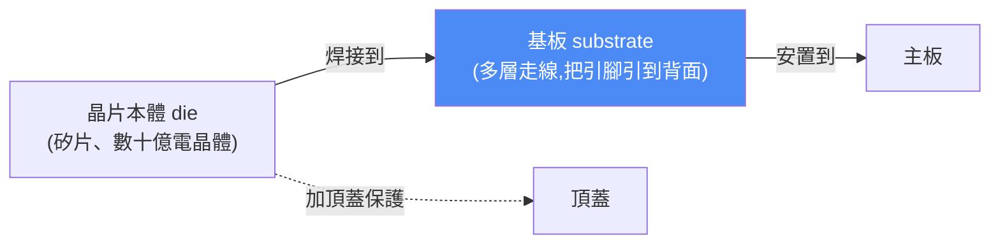
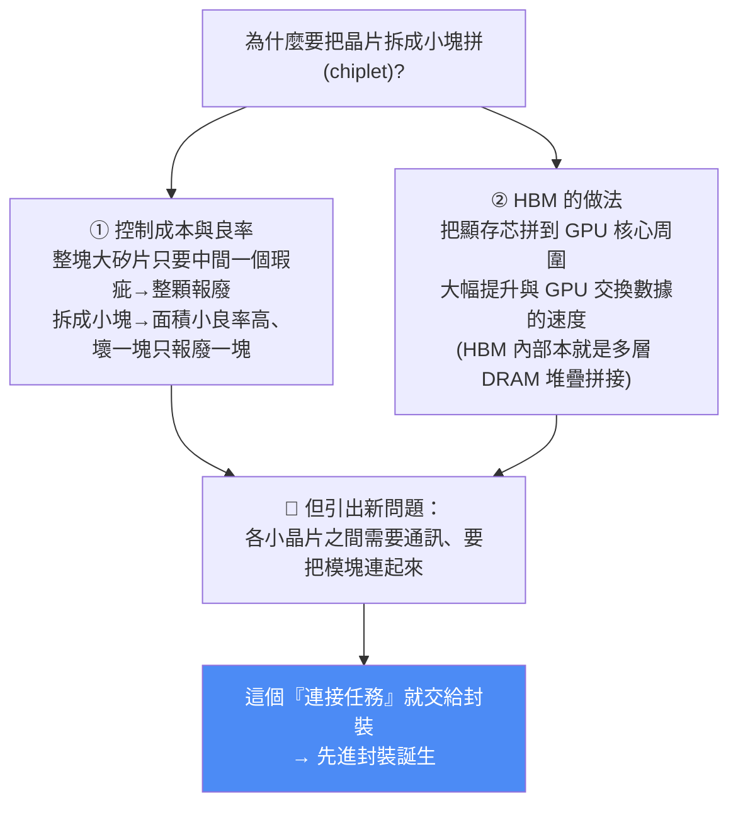
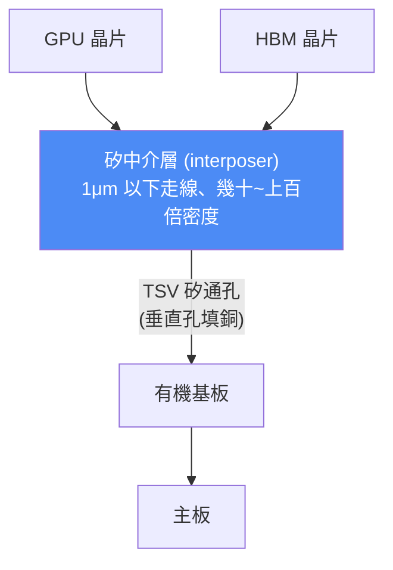

# 什麼是先進封裝?從有機基板到矽中介層、TSV、矽橋、玻璃基板一次看懂

> Redknot(喬紅)。用動畫講半導體「封裝」——一個過去的幕後配角,為什麼近幾年突然變成主角?本篇拆解:常規封裝(有機基板/ABF)怎麼做、為什麼不夠用、以及**先進封裝**(2.5D、矽中介層、TSV、矽橋、玻璃基板)解決什麼問題。與 [[hbm-high-bandwidth-memory-principle]] 同系列,兩篇互補。

---

## 一、先搞懂:什麼是「封裝」?

拿 Intel i9-13900KS 打開頂蓋:中間那個小方框是**晶片本體(die)**,一塊矽片、上面雕了數十億個電晶體與走線。但——**矽片上的觸點太小,沒法直接裝到主板上**。

> **封裝 = 製作一塊「基板」、並把晶片焊到上面的過程。** 基板內部有多層走線,把晶片的引腳引導到基板背面,你就能透過基板把晶片裝到主板上。

**過去封裝是半導體的幕後角色**:技術成熟、利潤不高。但近幾年**突然從配角變主角**,整個行業都在談「先進封裝」——為什麼一個「包晶片」的技術突然這麼重要?

---

## 二、常規封裝:有機基板(ABF 基板)怎麼做

i9-13900KS 就是常規封裝代表。它的基板核心骨架這樣做:

### 骨架:從電子布到覆銅板
1. 取一張**玻璃纖維編織的布**(行業叫「電子級玻纖布」,簡稱電子布)→ 浸有機樹脂 → 烘烤讓樹脂**半固化**(這種材料叫 **Prepreg / PP 片**);
2. 兩張銅箔把 PP 片夾中間 → 壓制,PP 片樹脂受熱流動、完全固化,和兩邊銅箔黏牢 → 成為**覆銅板**。

### 內層電路:減成法(精度低)
在覆銅板貼感光膜 → 蓋電路模板(行業叫 film / 菲林)→ 紫外光照射使感光膜變性 → 顯影洗掉未照射部分 → 裸露的銅泡進蝕刻液腐蝕掉 → 去感光膜,電路做出來。多層堆疊 + PP 片壓制 = 我們熟悉的 **PCB 電路板**。

> ⚠️ **減成法的問題:靠腐蝕銅箔形成電路,腐蝕時「側面」也會被嚴重腐蝕**。要蝕掉 35 微米厚的銅,側面也會同樣被蝕 → **線寬做不細、走線密度上不去**。做 PCB 夠用,但**做承載晶片的基板就不夠**。所以基板只用減成法做最中間兩層(走供電/信號屏蔽這種對精度要求不高的)。

### 其他層:半加成法 + ABF 膜(精度高)
1. 內層做好後貼一層 **ABF 薄膜**(全稱 Ajinomoto Build-up Film——就是日本**味之素**公司在做味精之餘發現的材料;表面平整、熱膨脹係數低、絕緣好);
2. 雷射在 ABF 上打孔 → 泡鈀活化液讓鈀附著 → 泡化學銅液(硫酸銅+甲醛),鈀催化下甲醛把銅離子還原成金屬銅、沉積成約 1 微米薄銅膜;
3. 貼感光膜 → 曝光顯影 → 露出部分銅膜 → **電鍍把裸露處大幅增厚**(雷射打的孔也被銅填滿)→ 去感光膜;
4. 此時銅層有厚有薄 → 泡蝕刻液做**閃蝕**(flash etch):薄的地方(約 1 微米)幾十秒就蝕乾淨,厚的地方大部分保留 → 因持續時間短、側蝕不嚴重 → **精度更高、走線更密**。

> **這種「先在薄膜表面長出電路、再用極短閃蝕去掉多餘薄銅」的方式叫「半加成法(SAP)」**。大量用到 ABF 膜、有機樹脂 → 這種基板叫 **ABF 基板 / 有機基板**。線寬線距約 **10 微米上下**。

**對 i9-13900KS 這種前幾年的晶片,10 微米夠用。但對今天的晶片就不夠了——為什麼?**

---

## 三、轉折:晶片從「一整塊」變「拼起來」(chiplet)

i9-13900KS 發布一年後(2024),Intel 發布 **Ultra 9 285K**——打開頂蓋,晶片表面有**幾條明顯縫隙**(13900KS 是完整光滑一整塊)。因為 285K 是**多個小晶片拼接而成**,縫隙就是各小晶片的邊界。

> **關鍵轉變:** 原來封裝只需解決「晶片和外部連接」;現在還要解決「**晶片內部不同模塊之間的通訊**」——這就是**先進封裝**。

---

## 四、先進封裝:矽中介層(Silicon Interposer)+ TSV = 2.5D 封裝

晶片之間通訊需要的走線密度**非常高**:例如 HBM 和 GPU 之間,為保證 **1024-bit 位寬**,加上地址/控制/電源,總共約需 **4000 根連線**——**有機基板(10 微米)無法滿足**。

工程師的辦法:**直接做一塊大矽片**,用製作晶片的技術在上面做多層走線,HBM 和 GPU 直接焊到這塊矽片上互聯。

- **這片專門「牽線搭橋」的大號矽片 = 矽中介層(silicon interposer)**——本質是一片**沒有電晶體電路**的晶片,用晶圓廠成熟的光刻/刻蝕/薄膜沉積做出精密金屬線路,輕鬆做到 **1 微米以下、甚至幾百奈米**。→ 同樣面積能容納的走線是有機基板的**幾十到上百倍**。
- **TSV(矽通孔)**:矽中介層還要把信號引到背面、再連到有機基板 → 需在矽片上打**貫穿的垂直孔洞**、孔裡填銅。打孔用「深反應離子刻蝕(DRIE)」(見 [[hbm-high-bandwidth-memory-principle]])。

> **為什麼叫 2.5D 封裝?** 矽中介層和晶片是「數值堆疊」的,但被集成的晶片**還是水平放置**(不是垂直疊在彼此上),所以叫 **2.5D**。Intel Ultra 9 285K 也是這做法,只是它的互聯層不叫矽中介層,而叫 **Base Tile**。

---

## 五、矽中介層的問題,與三條替代路線

> ⚠️ **矽中介層最大的問題:它用「晶片工藝」製造,會佔用寶貴的晶片產能 → 成本很高。** 於是行業誕生多種替代方案:

| 方案 | 做法 | 推動者 |
|---|---|---|
| **矽橋(Silicon Bridge)** | 不做一整片大矽片,只做**幾條細長的矽橋**,在有機基板層壓時直接嵌入需要高密度互聯的位置下方;晶片互連處剛好在矽橋上方,靠矽橋實現**局部**高速互聯(省矽) | Intel EMIB 即此類 |
| **玻璃核心基板** | 用**玻璃**取代有機基板的核心層,解決大面積基板翹曲、布線密度問題 | **Intel** 大力推進 |
| **玻璃中介層** | 在玻璃上布線、打孔,用玻璃**替代矽中介層**,降成本同時保持高精度互連 | **台積電** 探索中 |

> 玻璃的工藝還有較長的路要走(作者預告會單獨出一期玻璃基板詳解)。

> 🔎 **對照本庫:** 玻璃基板/中介層的技術門檻與量產時程,見 [[glass-substrate-supply-chain]](欣興/群創/友達的路線與進度);先進封裝的產能緊繃是 [[hbm-high-bandwidth-memory-principle]] 與股癌記憶更新裡「CoWoS/封測供不應求」的上游成因。

---

## 六、應用案例(這篇知識怎麼用)

1. **看懂「先進封裝為什麼是 AI 算力瓶頸」:** HBM+GPU 要 4000 根連線、有機基板做不到 → 非用矽中介層(CoWoS 這類 2.5D)不可,而矽中介層佔晶圓產能 → 這就是為什麼「先進封裝/CoWoS 產能」長期供不應求、成為投資主線(呼應美投君筆記與股癌記憶的「封測接力轉強」)。
2. **分清 PCB / 有機基板 / 矽中介層三個層級:** 讀半導體供應鏈新聞時,別把「基板漲價(ABF 有機基板)」和「先進封裝(矽中介層/CoWoS)」混為一談——前者是載板廠(如欣興、日月光的基板),後者是晶圓廠級的封裝(台積電 CoWoS)。
3. **理解 chiplet 趨勢的必然性:** 良率經濟學(大晶片一個瑕疵全報廢 vs 小晶片壞一塊只損一塊)決定了 CPU/GPU 都在走「拼起來」——這也解釋了為什麼封裝從配角變主角。
4. **追蹤玻璃基板的投資/技術賽道:** Intel(玻璃核心基板)vs 台積電(玻璃中介層)兩條路線,是下一輪先進封裝的關鍵變量。

---

## 七、重點回顧(TL;DR)

- **封裝** = 做一塊「基板」把晶片焊上去、引腳引到背面裝上主板。
- **常規封裝(有機/ABF 基板)**:電子布+PP 片→覆銅板;內層用**減成法**(側蝕嚴重、精度低),其他層貼 ABF 膜用**半加成法**(閃蝕、精度高);線寬約 **10 微米**。
- **轉折**:晶片走 **chiplet(拼小晶片)**——良率/成本考量、HBM 貼 GPU 提速;引出「晶片內部模塊互聯」需求 = **先進封裝**。
- **矽中介層 + TSV = 2.5D 封裝**:用晶片工藝做的大矽片(無電晶體),走線密度是有機基板幾十~上百倍,滿足 HBM-GPU 的 4000 連線；TSV 打垂直孔引到背面。晶片仍水平放置 → 2.5D。
- **矽中介層貴(佔晶圓產能)** → 替代路線:**矽橋(Intel EMIB)、玻璃核心基板(Intel)、玻璃中介層(台積電)**。

---

## 來源

- 影片:[用最好的动画为你讲解——什么是先进封装(Redknot-乔红,2026-07-24)](https://youtu.be/T3R3CFtYUww)
  - ⚠️ 該片無字幕,逐字稿以 **CPU 版 faster-whisper(small)** 轉錄取得、**非官方字幕**,可能有少量聽寫誤差(如 ABF/Ajinomoto、TSV、Prepreg、EMIB 等專有名詞)。
- 延伸(本庫):[HBM 高頻寬記憶體原理:矽中介層、TSV、堆疊鍵合](./hbm-high-bandwidth-memory-principle.md)、[玻璃基板取代有機載板?欣興/群創/友達的技術門檻](../../investing/equity-research/glass-substrate-supply-chain.md)
