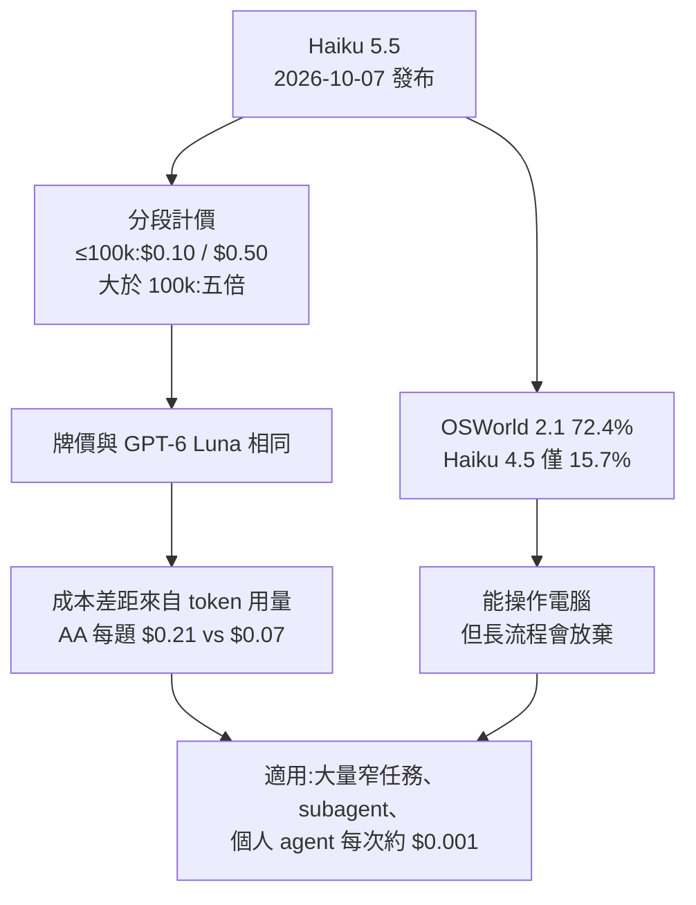
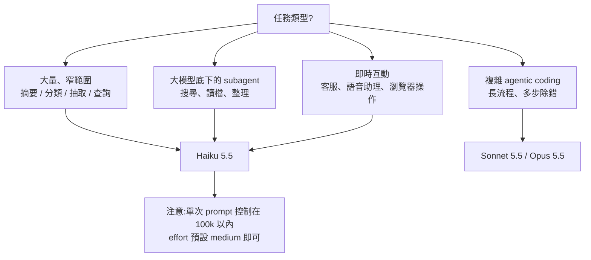

# Claude Haiku 5.5:十分錢的小模型能做什麼——分段計價、電腦操作與「每次互動 0.1 美分」的個人 agent

**主題分類:** 科技 / AI 產業動態 — 模型發布、小模型選型、computer use
**來源:** YouTube〈Haiku 5 5 explained in 7min..〉(Caleb Writes Code,2026-10-08,約 7 分;該片僅有英文自動字幕且下載連續 HTTP 429,逐字稿以 CPU faster-whisper 轉錄、非官方字幕)
**一手素材核實:** [Anthropic 官方產品頁](https://www.anthropic.com/claude-haiku-5-5)(2026-10-07)、[Artificial Analysis:Haiku 5.5](https://artificialanalysis.ai/models/claude-haiku-5-5)、[Artificial Analysis:GPT-6 Luna](https://artificialanalysis.ai/models/gpt-6-luna)、[DataCamp 整理](https://www.datacamp.com/blog/claude-haiku-5-5)
**整理日期:** 2026-10-09

> 📌 **立場:** 影片 03:12–04:08 是 **Micro Center 業配段落**(推 Mac mini、DGX Spark、顯示卡與門市活動),本筆記不轉述業配內容。片中示範的個人 agent「Atticus」是作者自建工具,說明欄未附原始碼連結,無法獨立檢驗。
>
> 📎 同家族:**Sonnet 5.5** 的定價、遷移與選型見 [[claude-sonnet-5-5-release-effort-migration]];**Opus 5.5** 背景見 [[rsi-recursive-self-improvement-anthropic]] §11。對手 Luna 系列的定價邏輯見 [[gpt-5-6-sol-kernel-self-optimization-luna-pricing]]。

---

## TL;DR

1. **Haiku 5.5 於 2026-10-07 發布**,API 價格分兩段:**prompt ≤ 100k token 時輸入 $0.10 / 輸出 $0.50(每百萬 token)**;**超過 100k 時五倍**($0.50 / $2.50)。✅ 官方核實。
2. 相對 Haiku 4.5($1 / $5):100k 以內便宜 90%、以上便宜 50%,**官方說平均約省 75%**(新 tokenizer 同樣內容會吃多一點 token)。
3. **OSWorld 2.1(離線子集)72.4%**,Haiku 4.5 只有 15.7%、GPT-6 Luna 48.9%、Sonnet 5.5 83.9%。✅ 官方自報。
4. 影片的核心論點:**「Haiku 比 Luna 聰明,但換成成本效率看就被拉開」**——Artificial Analysis 每題成本 Haiku 約 $0.21、Luna 約 $0.07。⚠️ 補正:兩者**牌價其實一樣**(都是 $0.10 / $0.50),差距主要來自 **token 用量**(AA 跑的是 Haiku 最高 effort),而不只是影片說的「分段計價」。
5. 作者把自建語音 agent Atticus 的後端從**家裡跑的 Qwen** 換成 Haiku 5.5 API,理由是**每次互動平均約 $0.001**,可能比自己在家燒電還便宜(他所在的密西根電價約每度 23 美分)。
6. Computer use 實測有落差:讓 Haiku 在 Artificial Analysis 網站篩「$1 以下的模型」,**第一次自己判定做不到而提早結束,補一句提示後也只做到一半,整段花約 33 秒**——小模型能用,但長流程還不穩。
7. 官方定位:**大量、對成本敏感的窄任務**(摘要、壓縮、資料庫查詢、分類)、**大模型的 subagent**、即時客服與瀏覽器操作;複雜 agentic coding 仍建議 Sonnet / Opus。

---

## 1. 基本盤(✅ 官方產品頁核實)

| 項目 | 數值 |
|---|---|
| 發布日 | 2026-10-07(Opus 5.5 後兩週、Sonnet 5.5 後九天) |
| 模型 ID | `claude-haiku-5-5`(Bedrock 為 `anthropic.claude-haiku-5-5`) |
| 上下文 / 最大輸出 | 100 萬 / 128k(依 DataCamp 引官方文件) |
| Effort | **第一個可調 effort 的 Haiku**(Low、Med、High、Xhigh、Max),預設 medium |
| 速度 | 官方稱「標準速度下最快的模型」,但註腳說**不如 Opus 的 Fast Mode** |
| 平台 | Claude API、AWS、Google Cloud、Azure;claude.ai 各方案可選 |
| 退役承諾 | 不早於 2027-10-07 |

### 價格表(每百萬 token)

| 模型 | 輸入 | 輸出 | 快取讀 | 快取寫(5 分) |
|---|---|---|---|---|
| **Haiku 5.5(≤100k)** | **$0.10** | **$0.50** | $0.01 | $0.125 |
| **Haiku 5.5(大於 100k)** | $0.50 | $2.50 | $0.05 | $0.625 |
| Haiku 4.5 | $1.00 | $5.00 | $0.10 | $1.25 |
| Sonnet 5.5 | $2.00 | $10.00 | **$0.10**(同日由 $0.20 砍半) | $2.50 |

- 官方註腳:「90% / 50% 更便宜」**已把新 tokenizer 每個任務稍多用一些 token 算進去**;平均約省 75%。
- Batch API 依慣例再打五折(DataCamp 整理)。

> ⭐ **分段的門檻是「單次請求的 prompt 長度」**,不是累積用量。100k 以內是地板價,一旦把整個 repo 或長文件塞進同一個請求,整筆就跳到五倍價。

---

## 2. 跑分(✅ 官方自報,第三方尚未全數重跑)

| 基準 | Haiku 5.5 | Haiku 4.5 | GPT-6 Luna | Sonnet 5.5 |
|---|---|---|---|---|
| OSWorld 2.1(離線子集) | **72.4%** | 15.7% | 48.9% | 83.9% |
| Terminal-Bench 4.0 | 39.2% | 0.0% | 16.4% | 70.6% |
| GDPval-AA v2.1(Elo) | 1620 | 735 | 1437 | 1840 |
| FrontierCode 1.1(Main) | 46.4% | — | 42.4% | 52.1%(Xhigh) |
| HLE(無工具 / 有工具) | 45.9% / 57.4% | 10.2% / 18.7% | — | 56.9% / 64.5% |

- 在官方表格裡,**Haiku 5.5 每一項都贏 Luna、每一項都輸 Sonnet 5.5**。
- ⚠️ Terminal-Bench 39.2% vs Sonnet 70.6% 的落差,正是官方「複雜 agentic coding 請用 Sonnet / Opus」的理由。
- ⚠️ 影片說的「OS World 2.1 computer use 72.4%」正確,但沒提這是**離線子集**;Haiku 4.5 當年在舊版 OSWorld-Verified 是 50.7%,和 2.1 的 15.7% **不能直接比**。

---

## 3. ⭐⭐ 影片主論點:智力效率 vs 成本效率

影片拿 Artificial Analysis 的兩張圖比:

- **以 token 效率看**(同樣智力用多少 token),Haiku 5.5 比 Luna 好;
- **換成成本效率**(同樣智力花多少錢),智力越高 Haiku 離 Luna 越遠。
- 作者的結論:跟前沿大模型一比,**這點差距可以忽略**——「像是花 21 美分讓 Haiku 做完,而不是花 7 美分給 Luna」,多付的錢換到更高智力與略快的輸出。

### 核實

| 影片說法 | 核實結果 |
|---|---|
| 21 美分 vs 7 美分 | ✅ 對得上 AA 的「每個 Intelligence Index 任務成本」:Haiku 5.5(Max)約 **$0.21**、GPT-6 Luna 約 **$0.07** |
| 差距源於分段計價 | ⚠️ **只說對一部分**。AA 列出 **Luna 牌價也是 $0.10 / $0.50**,和 Haiku 100k 以內完全相同;每題成本差三倍,主因是 **Haiku 在最高 effort 下吃更多 token**(以及長 prompt 跳級)。選型時要比「每任務成本」,不是比牌價 |
| Haiku 智力高於 Luna | ✅ AA Intelligence Index:Haiku 5.5(Max)43 vs Luna 38 |
| Haiku 輸出較快 | ✅ AA:Haiku 約 242 token/s vs Luna 約 123 token/s |
| 實測 173 token/s | ℹ️ 作者自己 demo 的觀察值,低於 AA 量測,可能與 effort、截圖輸入量有關,未能核實 |

> 💡 **啟示:** 小模型之間「誰比較便宜」不能看牌價表。同樣 $0.10 的模型,一個想得多、一個想得少,實際帳單可以差三倍。把 effort 從 Max 降到 medium(Haiku 5.5 預設值),成本與表現都會一起變。

---

## 4. 個人 agent「Atticus」:每次互動 0.1 美分

作者自建的語音 agent(類似鋼鐵人的 Jarvis):

| 元件 | 跑在哪 |
|---|---|
| 語音辨識 | 本機 GPU |
| 推理模型 | **Haiku 5.5 API**(原本是家裡區網跑的 Qwen) |
| 動作 | 控制電腦:開視窗、截圖看桌面、把文件貼到螢幕左側 |

示範:

- 讀論文時用語音叫它在背景找相關論文,**不打斷手上的工作**;
- 寫 PyTorch 時叫它看 VS Code 畫面,把對應官方文件開在左半邊;
- 每次互動平均約 **$0.001**。

**為什麼從本機模型換成 API:** 作者算過,密西根電價約每度 23 美分,本機 24 小時跑模型的電費加上設備成本,可能比按量付費的 Haiku 還貴;再加上 RTX 5090 零售價已超過 6,000 美元,**「為了跑本地模型買高價顯卡」的帳越來越難算**。

> ⚠️ 這是作者個人情境的估算(電價、用量、硬體都因人而異),而且同一支影片接著就是推銷本機 AI 硬體的業配段落——兩個論點方向相反,讀者自行判斷。本機推論仍有**隱私**與**無用量上限**的優勢。

---

## 5. Computer use:能跑,但長流程不穩

### OSWorld 在測什麼

在虛擬機裡給模型一個真實作業系統,完成像「排版一份簡報(約 62 步)」「在網站上訂一趟旅程」這類長任務。流程是:**環境回傳截圖 → 模型決定下一個動作 → 執行 → 再截圖**,來回直到完成。

### 作者的兩個實測

| 任務 | 結果 |
|---|---|
| 「打開 Excel,改成深色模式」 | ✅ 一路點過設定選單完成 |
| 「到 Artificial Analysis 的 Haiku 5.5 頁面,把成本圖篩到只剩 $1 以下的模型」 | ❌ 第一次點過篩選器後**自判「無法依成本篩選」提早結束**;補一句「把超過 $1 的模型關掉」後,勾掉 Opus 5.5、GPT-6 等幾個就**半途放棄**。全程約 33 秒,作者說自己手動更快 |

作者推測 4K 螢幕截圖較大可能拖慢速度。

**為什麼不直接用 API?** 作者自己先提出反論:很多應用有 API,用 Claude Code CLI 在背景呼叫就好;但**很多網站和軟體沒有 API**,只能用「看畫面點按鈕」的方式操作,這正是便宜小模型 + computer use 的位置。

> ⭐ 官方同步把 computer use / browser use 加進 Claude Python 與 TypeScript SDK(beta)。

---

## 6. 選型表:什麼時候用 Haiku 5.5

| 情境 | 建議 |
|---|---|
| 每天上萬筆的分類 / 摘要 | Haiku 5.5,prompt 切在 100k 內,能 batch 就 batch |
| Opus 主 agent 底下的檔案搜尋 subagent | Haiku 5.5(官方明列的用途) |
| 語音助理、即時客服 | Haiku 5.5,速度是主要優勢 |
| 只要最低每任務成本、智力要求不高 | 實測 Luna 與低 effort Haiku 的每任務成本再決定 |
| 長流程程式修改、Terminal 類任務 | Sonnet 5.5 以上(Terminal-Bench 39% vs 71%) |

---

## 7. 應用案例

### 案例一:客服工單分類從 Haiku 4.5 遷移

某電商每天 5 萬張工單,每張 prompt 約 3k token、輸出約 200 token。

- Haiku 4.5:輸入 150M × $1 + 輸出 10M × $5 = **約 $200 / 天**
- Haiku 5.5(≤100k 段):輸入 150M × $0.10 + 輸出 10M × $0.50 = **約 $20 / 天**,再把新 tokenizer 多出來的 token 算進去,仍約為原本的一到兩成。
- ⚠️ 遷移前先抽 200 張跑一遍比對分類結果,並確認 effort 設定——預設 medium,不要為了「保險」開到 Max,否則每任務 token 會膨脹。

### 案例二:長文件摘要要避開 100k 門檻

把 300 頁合約(約 150k token)一次塞進 Haiku 5.5,整個請求按 $0.50 / $2.50 計價。改成**按章節切成 3 段、各 50k token 分別摘要,再合併**,每段都落在 $0.10 / $0.50,輸入成本降到約五分之一,而且分段摘要通常更不容易漏細節。

### 案例三:沒有 API 的內部系統

公司的老舊報帳系統只有網頁介面。用 Haiku 5.5 + browser use 每天幫同事把 Email 收據填進系統:

- 單筆流程短(打開頁面、填 6 個欄位、送出),適合小模型;
- 參考作者的篩選器失敗經驗,**每一步都檢查畫面狀態、失敗就停下回報**,不要讓模型自己判定「做不到」後默默結束;
- 長流程(跨多頁、需要判斷例外)交給 Sonnet 5.5 處理或交回人工。

### 案例四:本機模型 vs API 的電費帳

照作者的思路自己算:一台 GPU 主機待機加推論平均 300W,24 小時約 7.2 度,台灣住宅電價以每度約 3–5 元計,每月電費約 650–1,100 元。若每天用個人 agent 互動 300 次、每次約 $0.001,一個月 API 費用約 9 美元。**純看錢 API 較划算;要隱私、離線或無用量上限才值得自架。**

---

## 8. 核實總表

| 類別 | 項目 |
|---|---|
| ✅ 已核實 | 分段計價 $0.10 / $0.50(≤100k)與五倍級距;OSWorld 2.1 72.4%;Haiku 智力與速度高於 Luna;每任務成本約 $0.21 vs $0.07 |
| ⚠️ 需補正 | 成本差距不只是分段計價:Luna 牌價與 Haiku 相同,差距主要來自 token 用量與 effort;OSWorld 2.1 為離線子集,不能和 Haiku 4.5 舊版 OSWorld-Verified 50.7% 直接比 |
| ℹ️ 未能核實 | Atticus 每次互動 $0.001、實測 173 token/s、RTX 5090 零售價超過 6,000 美元、密西根電價每度 23 美分(皆為作者自述) |

---

## 來源

- YouTube:[Haiku 5 5 explained in 7min..](https://www.youtube.com/watch?v=PVe-ibLRLaw)(Caleb Writes Code,2026-10-08)——該片僅有英文自動字幕且下載連續 HTTP 429,逐字稿以 CPU 版 faster-whisper 轉錄取得,非官方字幕。含 Micro Center 業配段落。
- [Anthropic:Claude Haiku 5.5 產品頁](https://www.anthropic.com/claude-haiku-5-5)
- [Artificial Analysis:Claude Haiku 5.5](https://artificialanalysis.ai/models/claude-haiku-5-5)
- [Artificial Analysis:GPT-6 Luna](https://artificialanalysis.ai/models/gpt-6-luna)
- [DataCamp:Claude Haiku 5.5: Features, Benchmarks, and Pricing](https://www.datacamp.com/blog/claude-haiku-5-5)
- Whisper 專有名詞還原:「Hyku / Hyco / Hykel」→ Haiku、「GBT6」→ GPT-6、「Peruda Frontier」→ Pareto frontier、「Quen」→ Qwen、「Clotcode」→ Claude Code、「OS world」→ OSWorld。
