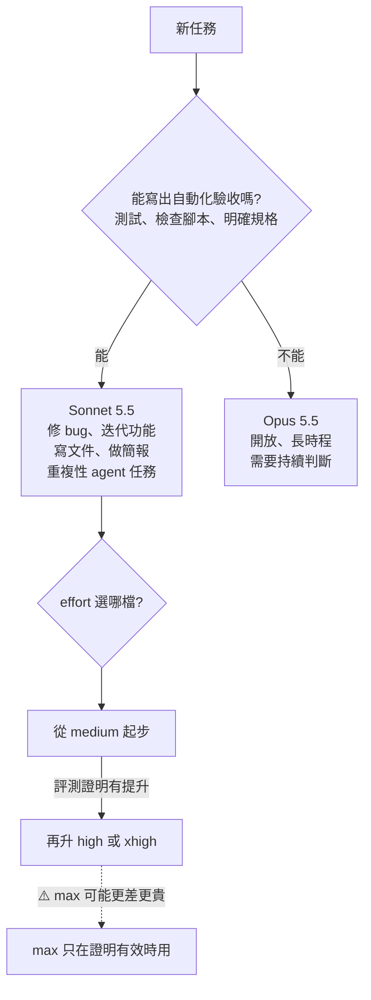

# Claude Sonnet 5.5:價格不變、效率拉高,以及「檔位開最高反而更差」與五個會報 400 的遷移變更

**主題分類:** 科技 / AI 產業動態 — 模型發布、成本控制、API 遷移
**來源:** YouTube〈Sonnet 5.5 更新了什么?〉(Why QQ,2026-09-29,約 8.5 分;**依官方簡中字幕整理**)
**一手素材核實:** [Anthropic 官方公告](https://www.anthropic.com/claude-sonnet-5-5)(2026-09-28)、[官方遷移指南](https://platform.claude.com/docs/en/models/sonnet-5-5/migration-guide)、[Simon Willison 部落格](https://simonwillison.net/2026/Sep/28/claude-sonnet-5-5/)
**整理日期:** 2026-09-30

> 📎 同家族的 **Opus 5.5**(2026-09-22)發布背景、價格與跑分,見本庫 [[rsi-recursive-self-improvement-anthropic]] §11;實際做事的差異見 [[opus-5-5-video-agent-tool-selection-self-check]]。

---

## TL;DR

1. ⭐ **定位:** Claude 5.5 家族第二個模型;**價格與 Sonnet 5 完全相同**(輸入 $2、輸出 $10、快取讀取 $0.20 / 百萬 token),**生成快 30% 以上、多數任務最多便宜 30%**。
2. ⭐⭐ **跑分大躍進:** Terminal-Bench 4.0 從 **10.3 → 70.6**(還高於 Opus 5.5 的 66.4);OSWorld 57.0 → 80.1;圖表辨識 15.6 → 61.6。但**開放式、長時程、需要持續判斷的編碼任務,Opus 5.5 仍明顯領先**(FrontierCode 54.4 vs 46.2)。
3. ⭐⭐⭐ **最反直覺的一點:effort 檔位是「成本旋鈕」,不是越高越好。** 官方 FrontierCode 圖上,**xhigh 52.1 分、max 反而掉到 46.2**,token 還多花好幾倍;Simon Willison 的鵜鶘測試,**max 檔燒光 128k 思考 token 還交不出圖**。
4. ⚠️⚠️ **五個會直接回 400 的破壞性變更**,外加幾個「不報錯但會咬人」的行為改變(見 §4)。
5. ⭐⭐ **選型一條線:** 「**你能不能替這個任務寫出自動化的驗收?**寫得出來,Sonnet 夠用;寫不出來,才輪到 Opus。」

---

## 1. 基本盤(✅ 官方公告核實)

| 項目 | 內容 |
|---|---|
| **發布** | 2026-09-28,Claude 5.5 家族第二個模型(排在 Opus 5.5 之後) |
| **價格** | 輸入 **$2**、輸出 **$10**、快取讀取 **$0.20**、快取寫入 $2.50(每百萬 token)——**與 Sonnet 5 相同** |
| **速度 / 成本** | 生成**快 30% 以上**;多數工作**每任務最多便宜 30%** |
| **平台** | Claude API、AWS、Google Cloud、Azure;claude.ai |
| **影片另外提到** | 知識截止 2026 年 6 月、上下文 100 萬、最大輸出 128k、**claude.ai 免費方案同步換成它**、Haiku 5.5 幾週內跟上(⚠️ 本文未逐項核實) |

---

## 2. 跑分:大幅進步,但塔尖仍是 Opus

| 基準 | Sonnet 5 | ⭐ Sonnet 5.5 | Opus 5.5 | 其他 |
|---|---|---|---|---|
| **Terminal-Bench 4.0**(終端多步任務) | 10.3 | ⭐ **70.6** | 66.4 | GPT-6 Astra 57.9(影片) |
| **OSWorld 2.1**(電腦操作) | 57.0 | **80.1** | 81.8 | |
| **Chartography**(圖表辨識) | 15.6 | **61.6** | 64.4 | GPT-6 Sol 53.6 |
| **GDPval-AA**(44 種職業的真實工作) | 1449 | **1844** | 1846 | |
| **CursorBench 4.0** | 34.1 | 55.5 | 57.8 | |
| ⚠️ **FrontierCode 1.1 Main**(Cognition 的編碼基準) | 42.4 | **46.2(max)** | **54.4** | GPT-6 Sol 49.3 |
| Humanity's Last Exam(有工具) | 54.9 | 64.5 | 67.7 | |

- ✅ 「**第一個只靠截圖打通《寶可夢 紅》的 Sonnet**」(官方公告)。
- 影片另提:SWE-Bench Pro 63.2 → 81.3(Opus 5.5 為 89.9)、AutomationBench 44.7 反超 Opus 5.5 的 42.5、HealthBench Professional 69.2 對 65.6 反超 Opus(⚠️ 這三項本文在官方公告頁未找到,未核實)。

> ⭐ Why QQ 的提問:「**Terminal-Bench 大半年從 10 分飆到 70 分,是模型真強了七倍,還是基準本身在通膨?**」——值得放在心上,本庫多篇筆記都提醒過「頭條數字要看條件」。

---

## 3. ⭐⭐⭐ 成本:單價沒變,省的錢全來自 token 效率

### 3.1 客戶實測

| 客戶 | ✅ 官方引述 |
|---|---|
| **Slack** | 沒改任何提示詞,離線評測「幾乎全面優於 Sonnet 5,**步驟更少、輸出 token 少約 14%**」 |
| **Epic Games** | 「在系統設計稽核上達到你預期**更高階模型**才有的品質」 |

影片補充:官方 Terminal-Bench 圖上,**medium 檔的 Sonnet 5.5 就超過 Sonnet 5 的最高分,單任務成本不到十分之一**;早期測試者注意到它會**把工具呼叫打包**,步驟更少。

### 3.2 ⚠️⚠️ effort 是成本旋鈕,不是越高越好

| 證據 | 內容 |
|---|---|
| **Artificial Analysis(影片引)** | low 檔單任務 **$0.41**、max 檔 **$7.60**,差 **18 倍**;智慧指數從 36 爬到 56 |
| ⭐ **官方 FrontierCode 圖(影片引系統卡)** | **xhigh 52.1 分 → max 掉到 46.2 分**,token 還多花好幾倍 |
| ✅ **Simon Willison 的鵜鶘測試** | **max 檔思考 15 分鐘、燒掉 128,000 個思考 token($1.28),把輸出上限用光,一張 SVG 都沒交出來**;同一個 prompt,xhigh 檔 5.7 美分、41 秒就畫好 |

📌 **本文補正:** 影片說鵜鶘測試「超時」;Simon Willison 原文的說法是 **token 用完**——**`max_tokens` 包含思考 token**,max 檔把 128k 上限全花在思考,沒有剩下任何額度寫答案。他也指出 **Opus 5.5 有同樣的問題**。

### 3.3 官方建議怎麼選檔

| 場景 | 建議 |
|---|---|
| Claude Code 預設 | **medium**(影片) |
| API 預設 | **high**(影片) |
| ⭐ agentic coding | **從 medium 起步**,任務變難再升 high |
| xhigh / max | **只留給評測證明真的有提升的場景** |
| ⚠️ 想讓模型少想一點 | **在系統提示裡叫它少思考不可靠,直接降檔才有效** |

---

## 4. ⚠️⚠️ 遷移:五個破壞性變更 + 幾個暗坑(✅ 官方遷移指南核實)

### 4.1 會直接回 400 的五件事

| # | 變更 | 怎麼改 |
|---|---|---|
| **①** | `thinking: {"type": "disabled"}` **回 400** | 改成 `{"type": "between_tools"}`(不做事前思考,只在工具之間思考) |
| **②** | `tool_choice` 的 **`any` 與 `tool` 不再支援** | 改用 `auto`,搭配 **strict 嚴格工具輸入**並自行驗證結果 |
| **③** | 舊版 computer use 工具 `computer_20251124` **在 Claude API 與 Google Cloud 上回 400** | 改用 **`computer_toolset_20260801`** |
| **④** | **advisor 工具**要搭配受支援的 advisor 模型(影片:不再接受 Sonnet 5 當顧問),且建議內容是加密的 | 換成受支援的 advisor |
| **⑤** | **思考區塊綁定模型與對話**:中途換模型,之前的推理就丟了;**2026-08-31 00:00 UTC 之後建立的帳號**,若**修改過歷史訊息再重放思考區塊,直接回 400** | ⭐ **對話保持「只追加、不改寫」** |

### 4.2 不報錯、但會咬人的變化

| 變化 | 影響 | 對策 |
|---|---|---|
| **思考文字預設不回傳**(`thinking` 欄位為空,只有 signature);工具呼叫之間的進度說明也放在 thinking 區塊 | ⚠️ **串流介面會在工具呼叫之間突然安靜**,不報錯 | 設 `display: "summarized"` 取回摘要 |
| **`max_tokens` 包含思考 token** | 預算給太少,答案會被截斷(鵜鶘事件) | agentic coding 建議 `max_tokens` 設到 **128000** 並開串流(影片) |
| **高解析度圖片檔位**:長邊最大 2576 px、每張最多 4,784 個視覺 token | ⚠️ **一張 2000×1500 的圖,token 約是 Sonnet 4.6 時代的 2.5 倍** | 不需要細節就先壓縮 |
| **安全分類器拒答** | 影片:分 cyber、bio 等五類;cyber 類可自動 fallback 到 Sonnet 5,**API 上要手動開啟** | 設定 fallback;正當資安工作可申請 Cyber Verification Program |
| **快取門檻從 1,024 降到 512 token** | ✅ 短系統提示也能快取,讀取只要輸入價的十分之一 | 善用 |

### 4.3 ⚠️ 關於「逐輪換檔」的補正

影片建議:「改頂層 effort 會讓快取失效,想單輪換檔用 per-message effort。」
✅ 官方文件補充了一個條件:**在 `between_tools` 模式下,effort 不能在對話中途改變**——per-message effort 與目前檔位不同會**回 400**。**要逐輪換檔,必須用 adaptive thinking**(不填 `thinking` 欄位或設 `{"type": "adaptive"}`)。

### 4.4 ⭐ 讓 Claude Code 幫你遷移

✅ 官方指南:在 Claude Code 裡執行
```text
/claude-api migrate this project to claude-sonnet-5-5
```
它會替換模型 ID、處理破壞性參數、取代 prefill、校準 effort,**動檔案前會先確認範圍**,最後產出一份要人工確認的清單。

---

## 5. ⭐⭐ 落地五條(影片)

| # | 動作 |
|---|---|
| **①** | 遷移交給 `/claude-api migrate` |
| **②** | **刪掉 Sonnet 5 時代的提示詞補丁**(「別偷懶」、重試 shim),刪完再跑評測 |
| **③** | ⚠️ **low 檔可能沒跑測試就回報完成**——官方給了一段系統提示,要求改動必須跑真實檢查,跑不了要說明原因 |
| **④** | 改頂層 effort 會讓快取失效;要逐輪換檔請用 adaptive thinking(見 §4.3) |
| **⑤** | agentic coding 把 `max_tokens` 設到 128000 並開串流 |

---

## 6. ⭐⭐⭐ 選型表:Sonnet 還是 Opus?



> ⭐⭐ Why QQ:「**規格和驗收,就是這條分工線。**這個標準,以後每次模型發布都能拿出來用。」
> 「**檔位跟著任務走,錢包跟著檔位走。**」

📎 這與 [[claude-code-hooks-complete-guide]] 用 hook 做驗收、[[shopify-helix-checkpoints-and-gates]] 把「完成」寫成關卡,是同一件事的另一面:**驗收寫得越清楚,越能放心用便宜的模型**。

---

## 7. 社群反應(HN 523 讚 / 353 則留言;自述性質)

| 話題 | 內容 |
|---|---|
| **免費方案之爭** | claude.ai 免費用 Sonnet 5.5,ChatGPT 免費用 GPT-6 Luna;Simon Willison 認為 **Anthropic 的免費方案明顯更強** |
| **中國模型價格壓力** | 多則高讚說:這個價位的中階智能,GLM、DeepSeek 只要零頭 |
| **token 需求會不會飽和** | 有人說 Opus 5.5 已吃滿他的工作量;有人回「**十個 agent 並發跑 worktree,燒起來快得很**」 |
| ⚠️ **教訓** | 讓模型自動 review 改動,**二十輪都在重寫同樣的註解** |
| 趣聞 | 一次生成的 Pac-Man 複製品近乎完美,僅次於 Opus |

---

## 8. 應用案例

### 案例一:團隊的 effort 預設值

| 用途 | 模型 | effort |
|---|---|---|
| CI 裡自動修 lint / 型別錯誤 | Sonnet 5.5 | **low 或 medium**(有測試兜底) |
| 日常功能開發 | Sonnet 5.5 | **medium**,卡住再 high |
| 架構設計、跨模組重構 | Opus 5.5 | high |
| 評測過確定有提升的困難題 | 依評測結果 | xhigh |

⚠️ 搭配一條系統提示:「**每次改動都必須實際執行測試;無法執行時,明確說明原因,不得回報完成。**」

### 案例二:遷移前的五分鐘自查

```bash
# 找出會回 400 的舊設定
grep -rn '"type": *"disabled"' src/          # thinking disabled
grep -rn 'tool_choice' src/ | grep -E '"(any|tool)"'
grep -rn 'computer_20251124' src/
# 有沒有「修改歷史訊息再重送」的程式碼(例如刪掉失敗的工具結果)
grep -rn 'messages\[.*\] *=' src/
```
然後在 Claude Code 跑 `/claude-api migrate`,最後逐項核對它產出的清單。

### 案例三:用「能不能寫驗收」做模型分派

把工作拆成兩類:
- **有驗收的**(單元測試、schema 驗證、截圖比對)→ 先丟 Sonnet 5.5,失敗再升級。
- **沒有驗收的**(「這個架構合不合理」「這段需求怎麼解讀」)→ 直接 Opus,或先花時間**把驗收寫出來**,再交給 Sonnet。

---

## 9. 核實總表

| 說法 | 結果 |
|---|---|
| 價格 $2 / $10 / 快取讀取 $0.20,與 Sonnet 5 相同 | ✅ 官方公告 |
| 快 30% 以上、每任務最多便宜 30% | ✅ 官方公告 |
| Terminal-Bench 10.3 → 70.6、Opus 5.5 66.4 | ✅ |
| OSWorld 80.1 / Opus 81.8、Chartography 61.6、GDPval 1844 vs 1846、FrontierCode 46.2 vs 54.4、CursorBench 55.5 vs 57.8 | ✅ |
| 寶可夢紅、Slack 少 14% 輸出 token、Epic Games 引述 | ✅ |
| 五個破壞性變更、2026-08-31 帳號規則、2.5 倍圖片 token、快取門檻 512、`/claude-api migrate` | ✅ 官方遷移指南 |
| Simon Willison 鵜鶘 max 檔失敗 | ✅ 屬實;📌 原因是 **token 用完**,影片說「超時」不精確 |
| 「單輪換檔用 per-message effort」 | 📌 補正:`between_tools` 下會回 400,需用 adaptive thinking |
| SWE-Bench Pro 81.3、AutomationBench 44.7、HealthBench 69.2、Artificial Analysis 的 18 倍 | ❓ 本文未在官方公告頁找到,未核實 |

---

## 來源

- YouTube:[Sonnet 5.5 更新了什么?](https://www.youtube.com/watch?v=s87lkkWk9rQ)(Why QQ,2026-09-29;官方簡中字幕)
- Anthropic 官方:[Introducing Claude Sonnet 5.5](https://www.anthropic.com/claude-sonnet-5-5)
- 官方文件:[Migrating to Claude Sonnet 5.5](https://platform.claude.com/docs/en/models/sonnet-5-5/migration-guide)、[What's new in Claude Sonnet 5.5](https://platform.claude.com/docs/en/models/sonnet-5-5/whats-new-sonnet-5-5)、[Prompting Claude Sonnet 5.5](https://platform.claude.com/docs/en/build-with-claude/prompt-engineering/prompting-claude-sonnet-5-5)
- Simon Willison:[Claude Sonnet 5.5](https://simonwillison.net/2026/Sep/28/claude-sonnet-5-5/)
- 討論:[Hacker News — Sonnet 5.5](https://news.ycombinator.com/item?id=49881850)
- 報導:[TechCrunch](https://techcrunch.com/2026/09/28/anthropic-releases-sonnet-5-5-which-it-calls-a-significantly-cheaper-faster-work-partner/)、[VentureBeat](https://venturebeat.com/technology/anthropic-launches-claude-sonnet-5-5-with-30-cost-reduction-per-task-due-to-faster-speeds-and-fewer-tool-calls)、[Help Net Security](https://www.helpnetsecurity.com/2026/09/29/anthropic-claude-sonnet-5-5/)
