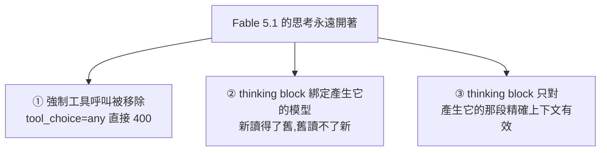
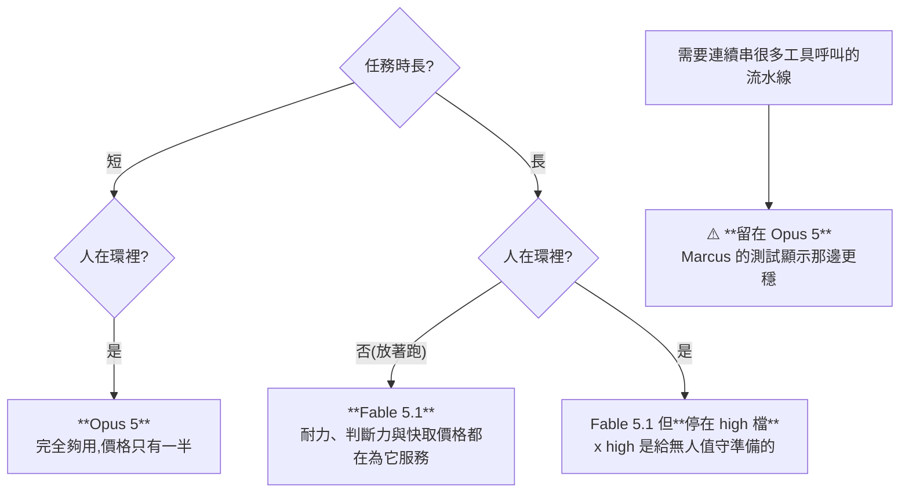

# Fable 5.1:榜單全線第一,官方卻叫你先用 Opus 5 —— 旗艦模型開始為「可用性」讓路

**主題分類:** AI 產業 —— 模型發布與選型
**來源影片:** YouTube〈Fable 5.1 發布!榜單第一!官方勸你別用它 | 10 分鐘掌握 Fable 5.1 的玩法〉(Why QQ / 為什麼叫 QQ,2026-09-02,約 9.8 分鐘,**官方 zh-Hans 字幕**)
**整理日期:** 2026-09-03

> 📎 相關筆記:[[claude-fable-72-hours-model-dependency]](Fable 5 在 2026-06 被政府勒令下線的事件)、
> [[model-routing-compute-allocation]](模型分工與算力配置)、
> [[claude-md-cut-82-percent-and-maintain-it]](§9 提到「換模型就該重測 prompt」,與本文的 effort 檔位建議同一件事)

---

## 0. 一句話總結

> **一個輸入 10 美元、輸出 50 美元(每百萬 token)的模型,官方文件第一句話卻是:
> 「大多數工作,請先用 Opus 5。」**

這在旗艦發布裡是很罕見的操作。而它透露的訊號是:
**能力封頂之後,競爭轉向「用起來煩不煩、算不算得過帳」。**

---

## 1. 先把背景講清楚:雙軌制

| 版本 | 定位 |
|---|---|
| **Fable 5.1** | **公開版**,帶全套安全分類器 |
| **Mythos 5.1** | **審查版**,只給通過審核的機構做網路安全與生命科學 |

這個雙軌制從 2026-06 的 Fable 5 就開始了。**5.1 是這條產品線的第一次點版本更新。**

**規格:** 上下文 100 萬 token、最大輸出 128K、知識截止 2026 年 6 月、**價格與 Fable 5 完全持平**。

---

## 2. ⭐⭐ 真正的變化在帳單:快取讀取砍 75%

輸入輸出單價一分未動,但**快取讀取價格降到每百萬 token 0.25 美元,砍掉 75%**。

Anthropic 用 8 月的真實用量算了一筆帳:

| 負載類型 | 整體成本變化 |
|---|---|
| 普通負載 | 便宜約 **25%** |
| **重度智能體任務** | 省到 **45%** |

> 道理很簡單:**一個跑一整天的 coding agent,大部分 token 開銷都花在反覆讀取快取的上下文上。**
> 快取讀取便宜了,長任務的帳單直接腰斬。

⭐ **最有說服力的佐證是實際遷移:** 做編程工具的 **Devin 在發布當天就把 Opus 5 的流量遷到 Fable 5.1**,
從程式碼審查場景開始。理由只有一條 —— **新的快取價格讓 Fable 等級的模型第一次在他們的負載上算得過帳。**

---

## 3. 能力:數字與案例

| 基準 | Fable 5 | Fable 5.1 |
|---|---|---|
| Terminal-Bench 4.0 | 42% | **55.8%**(Mythos 版 60.9%) |
| Terminal-Bench-Science | 24.7% | **52.6%**(直接翻倍) |

Every 團隊提前測了一週,幾個案例值得記:

- 一條提示詞複刻史丹佛那個 **AI 小鎮模擬** —— 25 個有記憶、有日程的 AI 居民,會聊天、傳八卦、討論鎮長選舉
- 從零重建自家文件編輯器,**一次通過**,還主動加了沒要求但合理的細節
- 對沖基金 **Millennium** 查了好幾年的罕見崩潰,**被它找到根因**

**比跑分更有說服力的是人的遷移:** Every 的 CEO Dan 原本日常 coding 全在 Codex,
拿到 5.1 後 **Claude Code 每天請求量漲了 5 倍**。

⭐ 而 Kieran 的說法點出了 5.1 真正解決的矛盾:
**Fable 5 很強,但只適合放出去跑長程任務,沒法坐在旁邊一起迭代;5.1 讓快慢都能用。**

> ⚠️ **也不是全員吹捧:** Marcus 提醒它動作快、省 token,
> **但在需要連續串 8 個工具呼叫的重負載上,表現可能反而不如 Opus 5。**

---

## 4. ⭐⭐⭐ 三個破壞性 API 變更(對開發者影響最大)

### ① 強制工具呼叫沒了

以前把 `tool_choice` 設成 `any` 或指定工具名來強制呼叫 —— **在 Fable 5.1 上直接回 400。**

官方理由:**這個模型的思考永遠開著,強制呼叫會跳過思考,
模型會把推理過程塞進工具參數裡,參數品質反而下降。**

**替代方案:** `tool_choice` 保持 `auto` + 工具加 `strict` 校驗 + **在提示詞裡明確寫一句「請使用某個工具」**。
官方說法是這個模型很聽話,顯式指令基本必執行。

### ② thinking block 綁定產生它的模型(方向性很重要)

**Fable 5.1 讀得了 Opus 5、Fable 5 的思考記錄,但反過來不行。**

⚠️ **所以如果你的系統裡有路由、重試或安全兜底,把對話中途切回舊模型 ——
API 會悄悄丟掉那些思考塊。** 請求照樣成功、也不收那部分費用,
**但模型是在失去前文推理的情況下重新規劃,品質與延遲都會波動。**

> **預設情況下這個過程是靜默的。** 想看見它,得加 `thinking binding controls` 這個 beta 請求頭,
> 回應裡才會列出所有被丟棄的塊。

### ③ thinking block 只對「產生它的那段精確上下文」有效

改了前面任何一輪對話、重建了 system prompt、增刪了工具 —— **後面所有思考塊全部作廢**,
新帳號直接報 400(訊息是「這個塊綁定到了另一段對話」)。

> ⚠️⚠️ **很多舊整合有個習慣:每次請求重拼系統提示詞、往裡塞個當天日期。
> 這個做法在新模型上會把快取和思考一起打爆。**

**正確姿勢:**

- 把對話當成**只追加的日誌**
- 想加指令 → 用**對話中段的 system message**
- 想裁上下文 → 用**服務端壓縮**

⚠️ **2026-08-31 之後註冊的帳號已強制開啟這個檢查;舊帳號建議現在就用 beta 頭自查。**

---

## 5. 五個純新增(舊程式碼不動也能跑)

| # | 新增 | 說明 |
|---|---|---|
| 1 | **effort 可逐訊息調整** | 普通輪次跑 low、關鍵步驟拉到 x high,**而且 prompt 快取不失效** |
| 2 | **回合級系統訊息** | 給某一回合下指令,用完自動失效,歷史保持乾淨 |
| 3 | **進度更新可讀化** | 設 `display` 參數,模型在工具呼叫之間吐簡短狀態文字;**原始思考鏈依然不暴露** |
| 4 | 快取讀取降價 | 見 §2 |
| 5 | **內容溯源** | 配合 EU AI Act 的浮水印要求,**2026-08-02 後發布的模型輸出都帶隱形浮水印** |

---

## 6. ⚠️ effort 檔位:兩個坑

官方提示詞文件的建議是:**從預設的 high 開始,然後拿你自己的 eval 把所有檔位掃一遍。**

**坑一:同名檔位在不同模型上的思考量完全不一樣** —— Fable 5 上調好的參數**別直接搬過來**。
(實測 **medium 檔基本能打平 Fable 5 的滿血表現**,成本卻低得多。)

**坑二 —— 這個更嚴重:**

> Kieran 在 **x high** 檔跑長任務,**模型會瘋狂建立子智能體,一天能燒進去 18 億 token**,
> 你打斷它問在幹嘛,它都不理你。

⭐ **所以結論很樸素:用 x high 之前,先設預算。**
**這個模型每一步都便宜,但你讓它走多少步,它就走多少步。**

---

## 7. ⭐⭐ 這次升級的主線不在分數,在「用起來煩不煩」

Fable 5 的評價很分裂:**能力封頂,相處難受。**

HN 上有個很火的討論叫 **「Claude 腔」** —— 那種「你的理解比大多數人都好」的諂媚味,
以及華麗但讀不懂的長句,像紐約客散文混進了程式碼審查。
有開發者說,在長會話裡讀這種交接文件是**一整天最消耗人的事**。

> **Anthropic 自己的員工也承認 5.1 的寫作自然多了、聽話多了。**
> Every 的 Dan 給團隊發的第一條訊息是:**「我終於能看懂它在說什麼了。」**

### 脾氣好轉還有個更實際的側面:安全誤報

⚠️ **Fable 5 時代,問個正常的安全工程問題經常被誤判成攻擊行為,請求被降級轉給 Opus 4.8 ——
花錢買了旗艦,幹活的是老二。**

5.1 的改善:

| 方向 | 誤報下降 |
|---|---|
| 網路安全分類器 | **60%** |
| 生物與醫療 | **85%** |

現在允許做**原始碼漏洞挖掘**這類防禦性工作;⚠️ 但**滲透測試、寫漏洞利用、二進位掃描仍會轉給 Opus**。

### 企業側:EFS

**EFS(企業前沿 safeguard)把資料存在客戶自己的雲裡,審核權也交給客戶** ——
等於變相實現零資料保留。**以前很多大公司卡在 30 天強制留存這條上,現在門開了。**

---

## 8. ⭐⭐⭐ 可複用的選型框架:兩個維度

> ⭐ **還有一條元規則:別信任何單一榜單,包括官方那張表。**
> **拿你自己的任務集跑一遍 eval** —— 這是 Anthropic 文件裡反覆說的話,也是這行唯一不會過期的建議。

---

## 9. 兩個後續值得盯

### ① 雙軌制會成為常態

同一個模型,**公開版帶完整限制、審查版給特定行業**。
**反蒸餾機制也在收緊** —— 新帳號已經不能靠竄改歷史來偷思考鏈了(見 §4③)。

⭐ 節奏上還有個細節:**這次更新距離 Fable 5 發布不到三個月 —— 旗艦模型進入了季度迭代。**

### ② ⭐⭐ 智能體負載的成本結構變了

> **當快取讀取占帳單大頭,模型的競爭力就從「單價」轉向「上下文管理設計」。**
>
> 你的歷史是不是只追加?壓縮是不是在服務端做?**這些工程細節直接決定帳單。**
> **以後評估一個模型,可能得先看它的快取定價,再看跑分。**

---

## 10. 與公開資料的核實

### ✅ 影片數字準確

| 影片說法 | 核實結果 |
|---|---|
| 2026-09-01 發布,與 Mythos 5.1 同時 | **屬實**,Mythos 為受限存取版,供通過審核的網路防禦與生命科學機構 |
| 價格 $10 / $50 per M,與 Fable 5 持平 | **屬實** |
| **快取讀取 $0.25 per M,砍 75%** | **屬實** |
| 普通負載省約 25%、重度智能體約 45% | **屬實**,為 Anthropic 自己的估計 |
| Terminal-Bench 4.0 42% → 55.8% | **屬實** |
| Terminal-Bench-Science 24.7% → 52.6% | **屬實** |
| 100 萬 context、128K 最大輸出、2026-06 知識截止 | **屬實**;API 識別碼為 `claude-fable-5-1`,並具**常開的自適應思考** |
| 減少誤報與限制 | 與報導方向一致 |

### ⭐ 影片未提的補充

**CursorBench 3.2 上以 73.4% 領先** —— 這是 agentic coding 的另一個基準,影片沒提到。

### ⚠️ 未能獨立查證(以影片轉述看待)

- **三個破壞性 API 變更的細節**(`tool_choice=any` 回 400、thinking block 的模型綁定與上下文綁定、
  `thinking binding controls` beta 頭、2026-08-31 後新帳號強制檢查)—— 搜尋未找到對應的公開說明,
  **實作前請務必以 Anthropic 官方 API 文件為準。**
- 誤報下降 60% / 85%、EFS 的具體條款
- Devin 遷移、Every 團隊各案例、Kieran 的 18 億 token 事件、Millennium 案例
- Mythos 版 Terminal-Bench 60.9%

---

## 11. 應用案例

### 案例 A|今天就該做的一次自查(15 分鐘)

如果你有在用 Anthropic API,依序檢查三件事:

1. **有沒有在用 `tool_choice: any` 或指定工具名?** → 改成 `auto` + `strict` + 提示詞明講。
2. **系統提示詞是不是每次請求重拼的(尤其有塞當天日期)?** → 這會同時打爆快取與思考塊。
   改成把對話當**只追加日誌**,指令用中段 system message。
3. **有沒有路由 / 重試 / 降級到舊模型的邏輯?** → 加 `thinking binding controls` beta 頭,
   看看有多少思考塊正在被**靜默丟棄**。

### 案例 B|重新算一次你的帳

⭐ **在快取讀取砍 75% 之後,「哪個模型比較貴」這個問題的答案可能變了。**

對長時間跑的 agent 負載:**先算「快取讀取占你帳單多少比例」,再比單價。**
Devin 的決策就是這樣做出來的 —— 不是因為 Fable 更強,是因為**它第一次算得過帳**。

### 案例 C|把 x high 當成「無人值守專用檔」

依 §8 的框架:**人在環裡就停在 high**。要用 x high 之前先設預算上限。

> 「每一步都便宜,但你讓它走多少步,它就走多少步」——
> 這句話值得貼在任何要放 agent 長跑的專案 README 上。

### 案例 D|把「換模型就重測」變成流程

同名 effort 檔位在不同模型上思考量不同,**舊參數不能直接搬**。
這與 [[claude-md-cut-82-percent-and-maintain-it]] §9 的結論是同一件事:
**模型更新時,用來指導它與用來測量它的方法都得跟著更新。**

---

## 來源

- [Fable 5.1 發布!榜單第一!官方勸你別用它 | 10 分鐘掌握 Fable 5.1 的玩法 — Why QQ](https://www.youtube.com/watch?v=bNMBbrplILM)(2026-09-02,約 9.8 分鐘,官方 zh-Hans 字幕)
- 核實用報導:
  - [Anthropic's new Fable release is cheaper, less restrictive — TechCrunch](https://techcrunch.com/2026/09/01/anthropics-new-fable-release-is-cheaper-less-restrictive/)
  - [Anthropic's Claude Fable 5.1 and Mythos 5.1 arrive with a 75% cost reduction for Fable cache reads — VentureBeat](https://venturebeat.com/technology/anthropics-claude-fable-5-1-and-mythos-5-1-arrive-with-a-75-cost-reduction-for-fable-cache-reads)
  - [Anthropic Launches Claude Fable 5.1 With Lower Costs and Fewer False Positives — MacRumors](https://www.macrumors.com/2026/09/01/anthropic-claude-fable-5-1/)

> ⚠️ **三個破壞性 API 變更的細節未能從公開報導佐證,實作前請以 Anthropic 官方 API 文件為準。**
> 模型與定價變動快速,文中數字為 2026-09-03 的查證結果。
