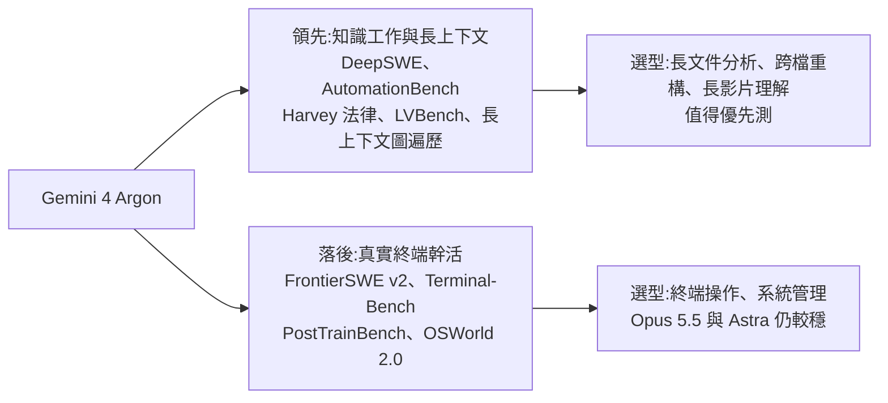

# Gemini 4 Argon:跑分領先但分布不均、定價是「首發優惠」、先給網安防禦者(Why QQ)

**主題分類:** 科技 / AI 產業動態 — 前沿模型發布
**來源:** YouTube〈Gemini 4 Argon 终于发布跻身第一梯队但真实水平怎么样?〉(Why QQ,2026-10-01,約 11 分;官方簡中字幕),數字已對照 VentureBeat、MarkTechPost、Artificial Analysis 報導
**整理日期:** 2026-10-02

> 📌 立場:本片未見業配或付費社群推廣。影片引用的基準分數**多為 Google 自報**,第三方尚未能獨立重跑(模型未公開)。

---

## TL;DR

1. ⭐ **發布方式比跑分更有資訊量**:9 月 30 日由 Koray Kavukcuoglu 官宣,**首批只給 Fairwind 計畫裡的網安防禦者**,並走美國政府的模型發布前自願審查流程;API、Gemini App、候補名單都沒有。下一步才是付費 API 客戶與 Google AI Ultra 訂閱者。
2. ⭐⭐ **單次輸出上限從 64K 提到 100 萬 token** ——對長程 agent 任務的價值可能大於榜單上幾個百分點(DeepSWE 單任務輸出常超過 10 萬 token)。
3. ⭐⭐ **跑分領先但分布不均**:知識工作、長上下文、法律、辦公自動化大幅領先;**在真實終端裡幹活的項目輸 5 項**(FrontierSWE v2、Terminal-Bench 4.0、Terminal-Bench Science、PostTrainBench、OSWorld 2.0),官方正文一項都沒提。
4. ⭐⭐⭐ **定價要看兩個坑**:$2/$10 是**首發優惠價**,✅ 之後會**翻倍到 $4/$20**(= Opus 5.5 現價);而且 Argon 輸出冗長,✅ 第三方換算**正常價下每任務 $3.98,反而比 Astra 的 $3.26 貴**。
5. ⭐ **網安是主線也是限發原因**:CWE-bench v1 68% 與 Astra 並列第一;提示注入 Gray Swan 攻擊成功率 0.7%(Opus/Fable 1.0%、Astra 8.5%)。

---

## 1. 這次更新了什麼

| 項目 | 內容 |
|---|---|
| 發布 | 2026-09-30,Google DeepMind 的 Koray Kavukcuoglu 官宣 |
| 開放順序 | **Fairwind 計畫**(受信任的網安防禦者)→ 付費 API 客戶與 AI Ultra 訂閱者 → 逐步擴大;未公布日期 |
| 政府審查 | 參與美國政府的**模型發布前自願審查**流程 |
| 價格(首發) | 每百萬 token 輸入 **$2**、輸出 **$10**;快取命中輸入 **$0.10**(95% 折扣) |
| 價格(之後) | ✅ **$4 / $20**,快取輸入 $0.20(影片只說「優惠價可能不永久」,沒講會翻倍) |
| 輸出上限 | **64K → 100 萬 token** |
| 上下文 | 影片說 100 萬(⚠️ 本次查到的報導未列出上下文窗口,未能核實) |

### Google 內部用例(✅ 與報導一致)

| 用例 | 成果 |
|---|---|
| 量子計算 | 幾分鐘內把已發表的量子演算法基線改進 **40%** |
| 全公司效能資料分析 + 自主記憶體優化 | 已釋放 **300+ TiB** 記憶體,預計總共 **500 TiB–1 PiB** |
| **C/C++ 遷移到 Rust** | 從 re2、libgav1 這類幾萬行的庫,到 **80 萬行以上的 Fuchsia Zircon 核心**;libgav1 在既有 Rust 移植版上替換 **3.2 萬行 SIMD 程式碼**,改用安全 Rust 讓編譯器自動向量化,**比原移植版快 2.7 倍、輸出完全一致** |

---

## 2. 跑分:贏在哪、輸在哪

### 領先項目

| 基準 | Argon | 對手 |
|---|---|---|
| DeepSWE v1.1(長程編碼) | **77.9%** | ✅ Opus 5.5 74.2%、Astra 74.1%、Fable 5.1 67.4% |
| AutomationBench(Zapier 辦公自動化) | **51.3%** | Opus 5.5 42.5% |
| Harvey 法律 agent | **19.6%** | ✅ Astra 5.4%、Opus 5.5 3.8%(📌 影片說「對手最高 6.7%」,與 VentureBeat 數字不符) |
| LVBench(長影片理解) | **91.7%** | — |
| 長上下文圖遍歷(256K–1M) | **84.2%** | Astra 71.8%(未能核實) |

### 落後項目(官方正文未提)

| 基準 | Argon | 領先者 | 差距 |
|---|---|---|---|
| FrontierSWE v2 | 55.0% | ✅ Astra 65.5% | −10.5 |
| Terminal-Bench 4.0 | 57.4% | ✅ Opus 5.5 66.4% | −9 |
| Terminal-Bench Science | 57.6% | ✅ Astra 68.1% | −10.5 |
| PostTrainBench(ML 工程) | 45.3% | ✅ Opus 5.5 49.3% | −4 |
| OSWorld 2.0(電腦操作) | 69.2% | Astra 72.6% | −3.4(未能核實) |

> 📌 **勝場數需修正**:影片引 VentureBeat 說「19 項裡贏下或打平 14 項」;VentureBeat 原文是**「已揭露的 18 項中,12 項領先、1 項並列」= 13 項**,其他報導也寫「19 項中 13 項」。

### 第三方與真實使用

| 來源 | 結果 |
|---|---|
| **Artificial Analysis 智能指數** | ✅ Argon **52.6**、Astra 52.7、**Opus 5.5 57.6**、Sonnet 5.5 56 ⇒ **Opus 5.5 仍居首,Argon 與 Astra 幾乎並列第二**(影片的「53 vs 58」是四捨五入) |
| AA 輸出量 | Argon 輸出偏冗長:✅ 每任務約 6.2 萬 token,Astra(Max)約 2.7 萬 |
| Arena 文字對話榜 | 影片:1525 分第 1,但只有約 5,000 票、掛「初步」標籤(未能核實) |
| Arena 智能體總榜 | 影片:第 8,任務勝率 7.92%,Fable 5.1 14.55%、Opus 5.5 13.78%;網頁開發子榜帕累托前沿上每任務 $0.63 vs Fable $4.17、Opus $1.57(未能核實) |

> 為什麼廠商表格與第三方差這麼多?測試集不同、努力檔位不同、廠商用自家最佳配置而第三方用統一腳手架——「**基準自帶地心引力:誰出題,誰佔優**」。

---

## 3. 成本帳:標價最低 ≠ 每任務最便宜

| | 輸入/輸出(每百萬 token) | AA 每任務成本 |
|---|---|---|
| Argon(首發價) | $2 / $10 | ✅ **$1.99** |
| Argon(正常價) | ✅ $4 / $20 | ✅ **$3.98** |
| GPT-6 Astra(Max) | $10 / $50 | ✅ $3.26 |
| Claude Opus 5.5(Max) | $4 / $20 | ✅ $5.98 |

⇒ ⭐⭐⭐ **影片沒講的關鍵**:首發價下 Argon 確實便宜;但**優惠結束、價格翻倍後,因為輸出 token 多,每任務成本反而比 Astra 高約 22%**,只比 Opus 5.5 便宜約三分之一。這正是影片說的「推理模型的真實成本在輸出端」,只是後果比影片講的更明確。

> 呼應 [[gpt-6-astra-token-efficiency-and-harness]]:Astra 的賣點正是 token 效率——每 token 單價高,但用得少。

---

## 4. 網安:主線,也是限發的閘門

- Argon 能**自主發現、驗證、修補漏洞**;✅ CWE-bench v1 **68%** 與 Astra 並列第一。
- 影片:Google 內部 20 種語言漏洞掃描 85.8%(上一代 3.8 Flash Cyber 71%)。
- ✅ **Wiz** 透過「Scan for Good」公益掃描,在一款全球醫院使用的醫療軟體中找到先前所有前沿模型都漏掉的嚴重漏洞。
- ⚠️ 受信任的防禦者拿到的是**無安全限制版**,公開版帶護欄。
- ✅ **提示注入(Gray Swan,15 次嘗試)攻擊成功率**:Argon **0.7%**、Opus 5.5 與 Fable 5.1 1.0%、Astra 8.5%;最差的模型超過 50%(影片)。
- ✅ Fairwind 計畫本身於 2026-09-02 隨 Gemini 3.8 Flash Cyber 啟動。

---

## 5. 社群反應(影片整理,屬論壇言論、無代表性)

| 社群 | 主要聲音 |
|---|---|
| Hacker News(約 845 讚、500+ 留言) | 吐槽「模型太危險不能直接發」成了標準行銷劇本;Argon(氬)命名,猜下一代叫 Barium;**自家 agent 工具 Antigravity 上下文到 25 萬 token 就強制壓縮**——「模型很強,工具鏈拖後腿」 |
| Linux.do | 首批只給 Ultra;家庭組分攤加反代很麻煩,多數人等實測 |
| Reddit | 「研究上開山鼻祖、產品上跟隨」;批評只給 Ultra、跳過 Pro;**網安爭議**:能防禦的模型只給大公司,小公司面對同樣威脅卻拿不到;反方認為先給防禦方是唯一理性順序 |

> 網安分發順序的爭論影片未下定論,本筆記亦不判斷。

---

## 6. 應用案例

### 案例一:API 開放後怎麼評估要不要遷移

1. **先分類自家負載**:長文件分析、跨檔重構、長影片理解 ⇒ 優先測 Argon;終端操作、系統管理 ⇒ 先維持 Opus 5.5 / Astra。
2. **用自己的任務跑小樣本**,記錄**每任務總 token 與成本**,不要按標價做預算。
3. **用正常價($4/$20)重算一次**——首發價只是暫時的;若正常價下每任務比現用模型貴,就只把它用在它明顯領先的任務類型。

### 案例二:長輸出上限要配合工具鏈

單次 100 萬輸出 token 的優勢,遇到「25 萬 token 就強制壓縮」的 agent 外殼就發揮不出來。評估時要**連腳手架一起測**:同一模型在不同 harness 下差 20 分是常態(見 [[ai-harness-explained]])。

### 案例三:做 agent 產品,看提示注入數字

若你的 agent 會讀外部網頁或信件,Gray Swan 這類**提示注入攻擊成功率**(0.7% vs 8.5%)比多數跑分更影響上線風險;仍應搭配權限邊界與人工審批,不能只靠模型(見 [[prompt-injection-5-techniques-defenses]])。

---

## 7. 核實總表

| 類別 | 項目 |
|---|---|
| ✅ 已核實 | 發布日與發布者、Fairwind 首發、政府自願審查、$2/$10 與快取 95% 折扣、64K→1M 輸出、內部用例全部數字、DeepSWE/FrontierSWE/Terminal-Bench/PostTrainBench/CWE-bench/Gray Swan、AA 指數與每任務成本 |
| 📌 需修正/補充 | 勝場數為 13 項(非 14);Harvey 對手最高為 5.4%(非 6.7%);首發價之後**確定翻倍到 $4/$20**;正常價下每任務成本高於 Astra |
| ⚠️ 未能核實 | 上下文窗口 100 萬、長上下文圖遍歷 84.2%、OSWorld 2.0 數字、Arena 各榜名次與票數、內部 20 語言掃描 85.8%、社群讚數 |

---

## 來源

- [YouTube:Gemini 4 Argon 终于发布跻身第一梯队但真实水平怎么样?(Why QQ,2026-10-01)](https://www.youtube.com/watch?v=mhqz6MkQpWY)
- [VentureBeat:Google unveils Gemini 4 Argon, retaking benchmark lead over OpenAI and Anthropic — but in limited release](https://venturebeat.com/technology/google-unveils-gemini-4-argon-retaking-benchmark-lead-over-openai-and-anthropic-but-in-limited-release)
- [MarkTechPost:Google DeepMind Unveils Gemini 4 Argon with 1M Output Tokens](https://www.marktechpost.com/2026/09/30/google-deepmind-unveils-gemini-4-argon-with-1m-output-tokens-for-coding-knowledge-work-and-cyber-defense/)
- [Trending Topics:Google Gemini 4 Matches GPT-6 Astra but Trails Anthropic's Opus 5.5(Artificial Analysis 數據)](https://www.trendingtopics.eu/gemini-4-artificial-analysis-en/)
- [Yahoo Finance:Google's Gemini 4 Argon Closes the Pricing Triangle](https://finance.yahoo.com/technology/ai/articles/google-gemini-4-argon-closes-235954585.html)
- [tbreak:Gemini 4 Argon release starts with cyber defenders](https://tbreak.com/gemini-4-argon-fairwind-release/)

📎 相關筆記:[[gpt-6-astra-token-efficiency-and-harness]]、[[astra-vs-fable-find-bugs-vs-fix-bugs]]、[[claude-sonnet-5-5-release-effort-migration]]、[[ai-harness-explained]]、[[prompt-injection-5-techniques-defenses]]
