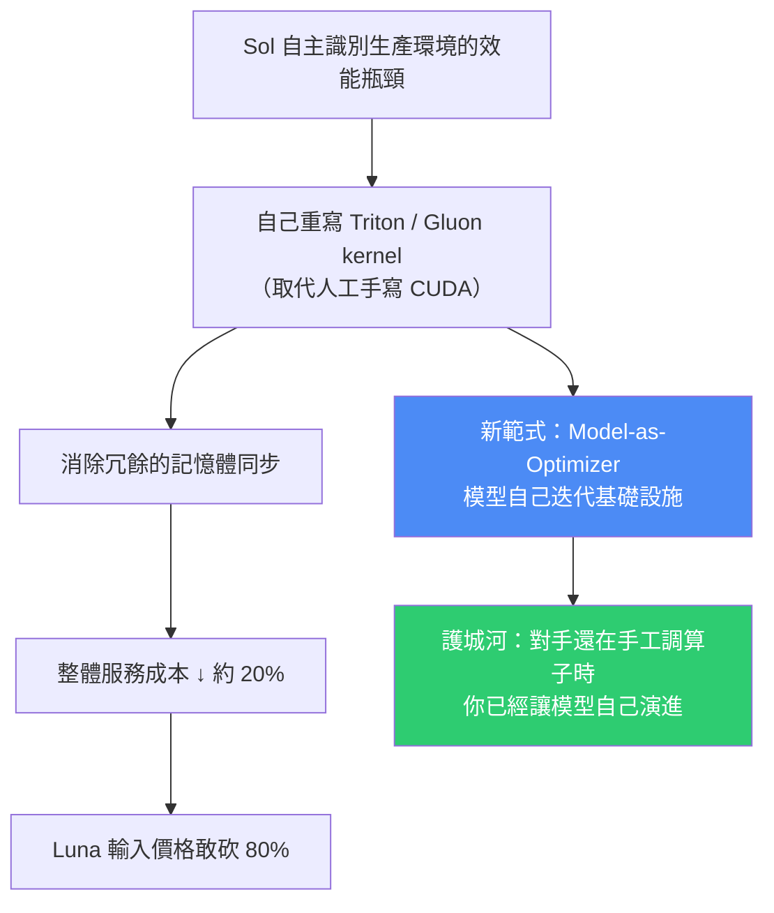
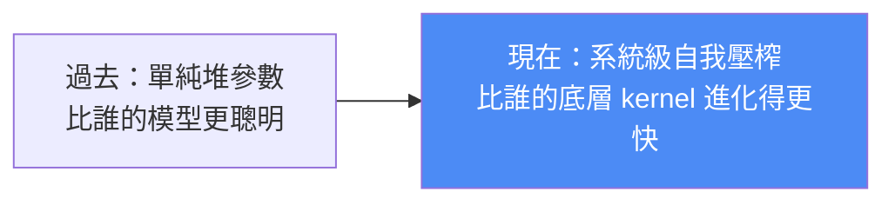

# 推理成本腰斬的背後:GPT-5.6 Sol 讓模型自己重寫核心,與 Luna 降價 80% 的算盤

> 整理自 YouTube 頻道 **智用 AI**〈推理成本腰斬背後:GPT-5.6 Sol 到底對算子動了什麼手腳?〉(2026-07-31,約 3 分半)。
>
> 一句話:**這次 GPT-5.6 最大的賣點不是「模型變聰明了」,而是 Sol 學會了自己寫程式碼去優化自己跑的那層基礎設施**——它重寫 Triton 與 Gluon kernel,把過去程式設計師手寫 CUDA 的苦力活接管過去,端到端服務成本因此降低約 20%。而 Luna 的輸入價格直接砍 80%,把小模型市場推進「成本出清」週期。

---

## 一句話總結

---

## 一、價格:Luna 把小模型的地板價又踩下去一截

| 模型 | 輸入價格(每百萬 token) | 相對關係 |
|---|---|---|
| **GPT-5.6 Luna** | **$0.20** | — |
| Claude Haiku 4.5 | — | **Luna 約為其 1/5** |
| Gemini 3.1 Flash-Lite | — | 原本的地板價,**被 Luna 再壓下去一截** |

**這不是紙上談兵的價目表比較。** 開發者 **Simon Willison** 維護的 demo 站點 `agent.datasette.io` 原本一直跑在 Gemini 3.1 Flash-Lite 上,這次更新後為了更極致的成本控制,**直接完成了遷移**。

> 影片的判斷:**想壓成本的開發者幾乎沒得選。**

---

## 二、方向變了:從「堆參數」轉向「系統級的自我壓榨」

從年初的長上下文競賽,到這次 5.6 的發布,OpenAI 的重心明顯轉移:

### Sol 做了什麼

- **自主識別生產環境中的效能瓶頸**,然後**重寫 Triton 與 Gluon kernel**。
- 具體收益來源:**消除冗餘的記憶體同步**——把沒用的算力損耗剔除掉。
- 結果:**整體服務成本壓低約 20%**。

> 這是 AI 進化的新階段:**自己優化自己的「肌肉」。**

### Sol Fast 模式

| 項目 | 內容 |
|---|---|
| 速度 | **2.5 倍提升** |
| 代價 | **價格翻倍** |
| 本質 | 影片的解讀是:這不是犧牲智力,而是 **OpenAI 把算力調度權交給了使用者**——你自己決定要延遲還是要成本 |

### 實測數據

**Notion** 的實測:Terra 任務在這套 kernel 加持下,**延遲直接砍掉 60%**。對企業級應用來說,這不是簡單提速,而是生產力層級的跳躍。

---

## 三、真正的重點:Model-as-Optimizer 這個範式

> **當對手還在手工調算子時,OpenAI 已經在讓模型自己迭代基礎設施了。**

這條護城河的特別之處在於它會**自我複利**:模型優化 kernel → 推理更便宜更快 → 有更多算力預算去跑優化 → 再優化。這也是影片標題「推理成本的摩爾定律正在加速」的意思。

### 對小模型生態位的衝擊

Luna 這樣的定價,實質上把小模型競爭推向了**「成本出清」週期**:

> **以後那些沒辦法透過自我優化降低推理成本的小模型,可能連入場券都拿不到了。**

價格戰的勝負手不再是「誰願意燒錢補貼」,而是**誰的單位推理成本結構性地更低**。影片對「Luna 敢降 80% 是不是被競爭對手逼的」這個質疑的回答是:更深層的原因是**他們的推理算力成本已經到了一個極具統治力的臨界點**。

---

## 四、隱憂:自動生成的 kernel 真的到處都穩嗎?

影片沒有一面倒吹捧,提出兩個值得深思的問題:

| 隱憂 | 說明 |
|---|---|
| **邊緣案例的可靠性** | AI 自動生成的 kernel,在**所有 edge case** 下都穩定嗎? |
| **效能過擬合(performance overfitting)** | 這種追求極端效率的訓練閉環,會不會針對**評測用的那些工作負載**過度優化,而在真實的長尾情境下退化? |

> 這個擔憂本質上跟本庫 [[production-agent-engineer-skills-2026]] 講的「不要讓同一個模型既當選手又當裁判」是同一類問題:**當優化者與被優化者是同一個系統時,共同盲區會被放大。**

社群目前的爭論也分兩派:一派認為這是技術進步的紅利,一派認為這是面對競爭時的被動防守。**但無論哪一種,對開發者來說「低成本調用」都是實實在在的好處。**

---

## 五、選型建議(影片給的實操結論)

| 你的情境 | 建議 |
|---|---|
| **對延遲極端敏感的 Agent 業務** | 直接切 **Sol Fast 模式**(2.5× 速度,價格翻倍) |
| **中等複雜度的常規生產任務** | **Luna 是目前的版本答案** |
| 高複雜度、需要深度推理的任務 | 影片未推薦 Luna——注意極低定價可能帶來**複雜邏輯任務上的隱形邊際品質降級** |

---

## 應用案例

### 案例 1|重新算一次你的 Agent 帳單

如果你的 agent 工作流跑在 Gemini 3.1 Flash-Lite 或 Claude Haiku 4.5 上做**中等複雜度的批次任務**(摘要、分類、抽取、格式轉換),Luna 的 $0.20/M 輸入值得認真評估——Simon Willison 的遷移就是這個場景。

**但別無腦切換。** 遷移前跑一組你自己的 golden dataset 對比品質,特別注意**複雜邏輯任務**上的表現:極低定價的模型在這類任務上可能有隱形的邊際品質降級,而這種降級**不會出現在平均分數上,只會出現在長尾案例裡**。

### 案例 2|把「延遲 vs 成本」做成可切換的參數,而不是寫死

Sol Fast 給了 2.5× 速度但價格翻倍——這其實是在提醒你:**模型選擇應該是一個可配置的策略,不是硬編碼。**

實務做法:在你的 agent 裡把「模型」抽成設定,依任務類型路由——使用者在等的互動式任務走快模式,背景批次任務走便宜模型。這正是本庫 [[six-ai-agent-trends-next-year]] 講的「看菜下飯」與 Token Budget,以及 [第 124 期 GitHub Weekly](../github-weekly/issue-124.md) 裡 OmniRoute 那類 AI 網關在做的事。

### 案例 3|「Model-as-Optimizer」值得套用到你自己的系統

不必是 kernel 這種層級。同樣的模式可以縮小規模套用:

- **讓 agent 分析自己的執行 trace,找出最花時間 / 最花 token 的步驟**,再提出優化建議。
- 本庫 [[claude-md-from-zero-to-mastery]] 提到的 `/insights`(分析歷史紀錄、找出反覆發生的問題、給出可直接複製的規則)就是這個模式的輕量版。
- **關鍵是要有可量測的目標**(延遲、token、成功率),否則「讓 AI 優化自己」只會產生看起來合理但無法驗證的改動。

### 案例 4|把「效能過擬合」加進你的驗收清單

如果你要採用任何宣稱「自動優化」的基礎設施,**別只看它的 benchmark 數字,要問它在你的真實長尾負載上表現如何**。具體做法:保留一組**刻意不用來優化**的 holdout 測試集,定期跑——這跟機器學習裡留驗證集是同一個道理。

---

## 重點回顧(TL;DR)

- **Luna 輸入 $0.20/M**,約為 Claude Haiku 4.5 的 1/5,把 Gemini 3.1 Flash-Lite 的地板價再壓一截;Simon Willison 已把 `agent.datasette.io` 從 Flash-Lite 遷過去。
- **最大賣點不是模型變聰明,是 Sol 學會自己寫程式碼優化自己**:重寫 Triton / Gluon kernel、消除冗餘記憶體同步 → **整體服務成本 ↓ 約 20%**。
- **Sol Fast**:2.5× 速度、價格翻倍——本質是**把算力調度權交給使用者**。
- **Notion 實測**:Terra 任務延遲 **↓60%**。
- **新範式 Model-as-Optimizer**:對手還在手工調算子,OpenAI 已讓模型自己迭代基礎設施——**這條護城河會自我複利**。
- **小模型進入「成本出清」週期**:無法靠自我優化降低推理成本的小模型,可能連入場券都拿不到。
- **兩個隱憂**:自動生成 kernel 的 edge case 可靠性、**效能過擬合**。
- **選型**:延遲敏感 → Fast 模式;中等複雜度常規生產任務 → Luna;**複雜邏輯任務要留意隱形的邊際品質降級**。
- **大方向**:**以後比的不只是模型誰更聰明,而是誰的底層 kernel 進化得更快。**

---

## 來源

- 智用 AI(YouTube),〈推理成本腰斬背後:GPT-5.6 Sol 到底對算子動了什麼手腳?〉(2026-07-31,約 3 分半):<https://youtu.be/thIPYsSsuIs>
  - 本文依該片**內建中文字幕軌**整理並轉寫為繁體中文(非 Whisper 轉錄)。
  - ⚠️ 影片為單一來源的市場評論,**價格與實測數字(Notion Terra 延遲 -60%、服務成本 -20%)均引自影片說法**,採用前請以 OpenAI 官方定價頁與自己的實測為準。
- 影片提及:開發者 **Simon Willison**(`agent.datasette.io` 的維護者)的遷移實例。
- 延伸(本庫):[未來一年的 6 個 AI Agent 趨勢(Token Budget 與開源追趕)](../ai-agents/foundations/six-ai-agent-trends-next-year.md) · [2026 Agent 工程師能力與面試題](../ai-agents/foundations/production-agent-engineer-skills-2026.md) · [GitHub Weekly 第 124 期(OmniRoute 多模型路由)](../github-weekly/issue-124.md) · [15 分鐘學完 CLAUDE.md](../claude-code/claude-md-from-zero-to-mastery.md)
