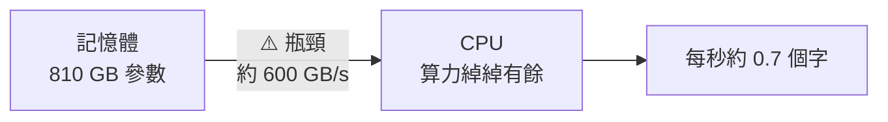
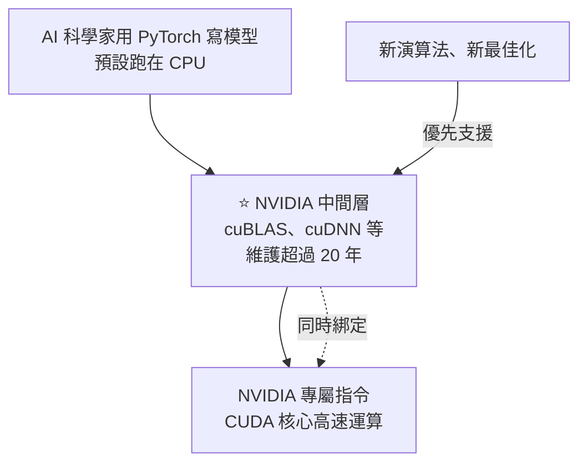

# 英偉達的護城河究竟是什麼?從「CPU 為什麼跑不動大模型」一路算到 CUDA 軟體生態

**主題分類:** 科技 / AI 產業 — 算力硬體、記憶體頻寬、軟體生態
**來源:** YouTube〈英伟达的护城河究竟是什么?〉(程序员老王,2026-07-16,約 18.7 分;**該片無字幕,逐字稿以 CPU faster-whisper 轉錄、非官方字幕**)
**整理日期:** 2026-10-02

> 📌 影片用「每生成一個字要搬多少資料、算多少次」的**粗估**一路推導;數量級正確即可,不必當精確規格。硬體規格已對照官方公開資料核實(見 §7)。價格屬市場報導,**本文未獨立核實**。

---

## TL;DR

1. ⭐⭐⭐ **反直覺的結論:CPU 跑大模型慢,瓶頸不在算力,在記憶體頻寬。** 以 Llama 405B(FP16 約 810 GB)為例:頂級伺服器 CPU 算力上每秒能生成 30 多個字,實際只有約 **0.7 字/秒**——因為**每生成一個字都要把 810 GB 參數從記憶體完整讀一遍**,12 通道 DDR5 約 600 GB/s,光讀就要 1.35 秒。
2. ⭐⭐ **解法一:HBM。** 封裝在晶片旁邊的高頻寬記憶體:H100 **3.35 TB/s**、B200 **8 TB/s**——一秒能把 800 GB 讀好幾到十幾遍。
3. ⭐⭐ **解法二:批次處理。** 單一請求無法重用參數,但**多個無關請求可以共用一次搬運**——瓶頸又回到算力 ⇒ 需要大量**只做 AI 運算的精簡核心**(CUDA core)。
4. ⭐ **訓練才是真正的挑戰:** 卡與卡之間要傳遞和參數一樣大的梯度 ⇒ PCIe 太慢,需要 **NVLink**(H100 900 GB/s、B200/B300 1.8 TB/s)。
5. ⭐⭐⭐ **但硬體不是護城河——AMD MI355X 的算力、記憶體與 B300 打平,價格約便宜四成,卻賣得不好。** 真正的護城河是**軟體**:PyTorch 底下的 **cuBLAS、cuDNN** 等中間層,**全世界科學家用了 20 年**共同建立的事實標準。
6. ⭐ **唯一繞過去的是 Google TPU**:不相容 CUDA,另起爐灶做 **OpenXLA**,只在自家雲端出租——Gemini 全靠 TPU 訓練。「**他們缺的不是錢、晶片或技術,而是時間。**」

---

## 1. ⭐⭐⭐ 先算一筆帳:CPU 為什麼跑不動大模型

**最簡單的架構:CPU + 記憶體 + 硬碟。** 模型參數從硬碟讀進記憶體一次(只在開頭),之後 CPU 每次都從記憶體拿參數來算。**理論上記憶體夠大,普通電腦能跑任何模型——只是非常非常慢。**

| 項目 | 數字 |
|---|---|
| **Llama 405B 參數** | 4.05 × 10¹¹ 個 |
| 每生成一個字的運算 | 每個參數乘一次、加一次 ≈ **8.1 × 10¹¹ 次浮點運算** |
| 頂級 CPU(AMD EPYC 9965)算力粗估 | ≈ **2.8 × 10¹³ 次/秒** ⇒ 理論上**每秒 30 多個字** |
| ⚠️ **實際速度** | 約 **0.7 字/秒** |

### 問題在頻寬,不在算力

| 項目 | 數字 |
|---|---|
| 模型大小(FP16,每參數 2 bytes) | **約 810 GB** |
| 12 通道 DDR5 峰值頻寬 | **約 600 GB/s** |
| 從頭讀一遍參數 | **約 1.35 秒** |
| CPU 快取 | 只有 MB 等級,**和 810 GB 差一千多倍** |

> ⭐ 生成一個字時,參數是**順序使用、幾乎不會重複使用**的;生成下一個字時,絕大部分參數早已不在快取裡 ⇒ **快取幾乎沒用**。
> ⇒ 可以近似理解成:**每生成一個字,CPU 都要從記憶體完整讀一遍 800 多 GB**——光讀就把速度壓到 0.7 字/秒。

📎 同一個原理在消費級硬體上的版本,見本庫 [[local-ai-every-hardware-size]](樹莓派和 iPhone 同為 8 GB,差在頻寬)。

---

## 2. ⭐⭐ 解法一:HBM 高頻寬記憶體

| 產品 | 記憶體 | 頻寬(✅ 官方規格) |
|---|---|---|
| 單一 HBM3 堆疊 | — | 約 0.82 TB/s |
| **H100** | 80 GB HBM3(5 個堆疊) | **3.35 TB/s**(為了穩定性跑在較低頻率) |
| **B200** | HBM3e | **8 TB/s** |

- 一秒能把 800 GB 讀**好幾到十幾遍** ⇒ 每秒幾個到十幾個字,**可以用了**。
- ⭐ HBM **和運算單元封裝在一起**,不是插在主機板上——要維持這麼快的速度,**實體線路必須夠短**。老王預測:就算未來有可插拔的 HBM,也會有不小的效能損失。

---

## 3. ⭐⭐ 解法二:批次處理,讓一次搬運被用很多次

- 伺服器要**同時服務大量請求**;每秒十個字對一個人夠用,對一千個人完全不夠。
- **單一請求**:參數順序使用,**無法重用**。
- ⭐ **多個無關的請求**:**可以重用**——先搬 100 MB 參數填滿快取,**同時算 1000 個請求**,再搬下一段 ⇒ **完整搬一次 800 GB,就能產生 1000 個字**。
- ⇒ 瓶頸又回到**算力**:就算最強 CPU 也只有一百多個核心。

**為什麼不用更多 CPU 核心?**
> CPU 功能太複雜:條件判斷、分支、例外、虛擬記憶體管理……**這些跟 AI 運算八竿子打不著**,太浪費。⇒ **砍掉用不著的功能,只留 AI 相關的運算**。

| 里程碑 | 內容 |
|---|---|
| **2006** | NVIDIA 在遊戲卡 GeForce 8800 GTX 推出 **CUDA 核心** |
| 今天 | 計算卡把 **HBM + 大量 CUDA 核心**整合在一起:H100 有 80 GB HBM、**16,896 個 CUDA 核心**;B300 有 **288 GB** HBM、FP16 算力約為 EPYC 的 90 倍 |

**塞不進一張卡怎麼辦?**(推理)
- 一張 H100 只有 80 GB,放不下 810 GB 的模型。
- ⭐ 因為參數是**順序使用**的,可以**一張卡放一段**,依序串起來(管線式);卡與卡之間只傳**中間計算結果**(幾十到幾百 MB),不成瓶頸。
- 要服務更多請求?**再插一組卡**就好——不同請求之間無關,組與組之間推理時**不需要傳資料**,可以無限擴展,甚至不在同一台機器上。

---

## 4. ⭐ 真正的挑戰:訓練

| 項目 | 內容 |
|---|---|
| **資料量** | Llama 3.1 405B 用了約 **15 兆 token** |
| **為什麼要很多組卡平行** | 只用一組串聯的卡,「估計一輩子也訓練不完」 |
| ⚠️ **和推理不同** | 訓練時**不同組之間要傳資料**:每個參數都會產生一個**梯度**,要把各組的梯度**加總取平均**才能更新一次參數 ⇒ **傳輸量和參數本身一樣大**(H100 每張就是 80 GB 等級) |

| 互連 | 頻寬 | 傳一次 810 GB |
|---|---|---|
| **PCIe 5.0 x16** | 約 64 GB/s(單向) | **十幾秒**——完全不可用 |
| **NVLink 4.0(H100)** | **約 900 GB/s** | 約 1 秒 |
| **NVLink 5.0(B200/B300)** | **約 1.8 TB/s** | 約 0.5 秒 |

> 📌 影片口述「PCIe 5.0 為 64 Gbps」,單位應為 **GB/s**(x16 單向約 64 GB/s),與影片「十幾秒」的計算一致。
> ⭐ PCIe 之於 NVLink,就像 CPU 之於 CUDA:**PCIe 追求通用、有太多 AI 用不到的功能;NVLink 專為 AI 而生,唯一目標是速度。**

📎 梯度怎麼來,見本庫程序员老王系列 [[pytorch-from-zero-transformer-series]]。

---

## 5. ⭐⭐⭐ 那 CUDA 和 NVLink 就是護城河嗎?——不是

**對手的硬體已經追上了:**

| 項目 | NVIDIA B300 | AMD MI355X |
|---|---|---|
| 運算單元 | CUDA 核心較多 | **16,384 個串流處理器** |
| FP16 算力 | 約 2.5 PFLOPS 級 | **約 2.5 PFLOPS 級**(打平) |
| 記憶體 | **288 GB HBM** | **288 GB HBM**(一樣) |
| 卡間互連 | NVLink 5.0 **1.8 TB/s** | Infinity Fabric **約 1.075 TB/s**(慢約四成,同一數量級) |
| 價格(市場報導) | **4 萬多美元**,預訂排到兩年後 | **約 2.5 萬美元** |

> 「照理說在算力嚴重短缺的時代,便宜將近一半的方案應該被瘋搶才對——**但 AMD 計算卡賣得並不算好。**」

### ⭐⭐⭐ 真正的護城河:軟體

- CUDA 核心**不是全能的**,PyTorch 寫的程式**不能直接跑在上面**。
- NVIDIA 在底層替 PyTorch 寫了**中間層**(cuBLAS、cuDNN 等):程式要做大型矩陣乘法時,PyTorch 不在 CPU 算,而是交給中間層,用 NVIDIA 獨有的指令在 CUDA 核心上跑。
- ⭐ 這個中間層**維護了 20 多年**,涵蓋**幾乎所有複雜科學運算的實作**,是**事實上的標準**:任何科學家發明新演算法或找到新最佳化,**都會優先支援它——也就同時綁定了 NVIDIA 硬體**。
- > 「**這整套體系不是 NVIDIA 一家公司,而是全世界的科學家花了 20 多年共同建立起來的**,不是哪家公司砸錢砸人就能替換掉的。」

| 挑戰者 | 處境 |
|---|---|
| **AMD** | 只能盡量複刻 NVIDIA 中間層(**ROCm**),支援針對 NVIDIA 寫的演算法,但**相容性還遠遠落後** |
| **華為昇騰** | 同樣面臨相容性問題,**還因政策因素卡在 7 奈米製程**;能從零做到穩定執行部分模型「非常非常不容易」 |

---

## 6. ⭐ 唯一繞過去的:Google TPU

| 層面 | Google 的做法 |
|---|---|
| **硬體** | 對標 CUDA 核心的 **MXU**、對標 NVLink 的 **ICI** |
| ⭐ **軟體** | **完全放棄 NVIDIA 的標準**,另建開源的 **OpenXLA**——不相容 CUDA、不追求支援所有科學演算法,**專為 AI 設計** |
| **代價** | 支援 OpenXLA 的上層軟體與下層硬體都有限;**目前發揮到極致的基本只有 Google 自家 TPU** |
| **成就** | **從推理到訓練全部跑通**——AMD、華為這類「相容 NVIDIA」路線暫時做不到 |
| **商業模式** | NVIDIA 賣卡;**Google 賣服務**——TPU 不單獨出售,只在 Google Cloud 出租,價格相對便宜,但對開發者要求更高 |
| **用戶** | **Gemini 完全用 TPU 訓練**;**Anthropic** 近來也租用 TPU 訓練 |

> ⭐⭐ 老王的結論:「英偉達最深的那道牆,並不是任何一塊晶片。華為把硬體做到不比英偉達差,AMD 把價格砍了一半,Google 乾脆另起爐灶——**他們缺的不是錢、不是晶片、也不是技術,而是時間。這條路英偉達一個人走了 20 年,別人又要走多少年呢?**」

📎 NVIDIA 的其他產品線:[[rtx-spark-gb10-soc]]、[[nvidia-n1x-vs-x86]];推論引擎怎麼榨乾這些硬體:[[inference-engines-llamacpp-vllm-sglang-tensorrt]]。

---

## 7. 核實

| 說法 | 結果 |
|---|---|
| EPYC 9965 為 12 通道 DDR5、約 600 GB/s 級 | ✅ 數量級正確(DDR5-6000 × 12 通道約 576 GB/s) |
| H100:80 GB HBM3、3.35 TB/s、16,896 CUDA 核心 | ✅(SXM 版) |
| B200 8 TB/s;B300 288 GB HBM | ✅ |
| NVLink 4.0 900 GB/s;NVLink 5.0 1.8 TB/s | ✅ |
| MI355X 288 GB、16,384 串流處理器、Infinity Fabric 約 1,075 GB/s | ✅ 與 AMD 公開規格一致 |
| CUDA 始於 2006 年 GeForce 8800 GTX | ✅ |
| Llama 3.1 405B 訓練約 15 兆 token | ✅(官方:超過 15 兆) |
| PCIe 5.0「64 Gbps」 | 📌 應為 x16 單向約 **64 GB/s** |
| 影片口述「2016 年發布 B300」 | 📌 轉錄或口誤;B300 為 2025 年產品 |
| 價格(H100 4 萬多、MI350 1.5 萬、B300 4 萬多、MI355X 2.5 萬) | ❓ 市場報導,未獨立核實 |

---

## 8. 應用案例

### 案例一:估算任何模型在任何硬體上的「單人生成速度上限」

**每秒 token 數 ≈ 記憶體頻寬 ÷ 模型大小(bytes)**
| 硬體 | 頻寬 | 70B 模型 4-bit(約 35 GB) |
|---|---|---|
| 雙通道 DDR5 桌機 | 約 90 GB/s | 約 2.5 token/s |
| Apple M 系列 Max | 約 400 GB/s | 約 11 token/s |
| RTX 4090(放得下的話) | 約 1 TB/s | 約 28 token/s |
| H100 | 3.35 TB/s | 約 95 token/s |

⚠️ 這是**單一請求、忽略計算與 KV cache** 的上限,實際會更低;但足以判斷「這台機器跑這個模型能不能用」。

### 案例二:評估「便宜的替代算力」

採購非 NVIDIA 的加速器前,先問:
1. 我們用的框架與模型(PyTorch、vLLM 等)**對它的支援度**如何?有沒有官方維護的後端?
2. 我們依賴的**客製 CUDA kernel**(例如 FlashAttention 某些版本)有沒有對應實作?
3. 遷移與除錯的**人力成本**,是否吃掉硬體省下的錢?
⇒ 這正是影片說的「軟體護城河」在採購決策上的具體樣子。

### 案例三:看懂 AI 晶片新聞

看到「某家新晶片算力超越 H100」時,補問三件事:**記憶體頻寬多少?卡間互連多快?軟體生態支援什麼?**——只比算力,常常比錯重點。

---

## 來源

- YouTube:[英伟达的护城河究竟是什么?](https://www.youtube.com/watch?v=E7qG6LvyEnc)(程序员老王,2026-07-16)——**該片無字幕,逐字稿以 CPU faster-whisper 轉錄、非官方字幕**
- NVIDIA:[H100](https://www.nvidia.com/en-us/data-center/h100/)、[Blackwell / B200](https://www.nvidia.com/en-us/data-center/technologies/blackwell-architecture/)、[NVLink](https://www.nvidia.com/en-us/data-center/nvlink/)、[CUDA-X 函式庫](https://developer.nvidia.com/gpu-accelerated-libraries)
- AMD:[Instinct MI355X](https://www.amd.com/en/products/accelerators/instinct/mi350/mi355x.html)、[EPYC 9005 系列](https://www.amd.com/en/products/processors/server/epyc/9005-series.html)、[ROCm](https://rocm.docs.amd.com/)
- Google:[Cloud TPU](https://cloud.google.com/tpu)、[OpenXLA](https://openxla.org/)
- Meta:[Llama 3.1 介紹](https://ai.meta.com/blog/meta-llama-3-1/)

**Whisper 專有名詞還原對照:** 因为达/英伪达/英估达 → 英偉達(NVIDIA);生疼/生腾 → 昇騰;jamini/Giminite → Gemini;Lama → Llama;IPK / EPYC-CPU → EPYC;枯大/库达/康大 → CUDA;CU Blast → cuBLAS;ROCK M → ROCm;M533X / MI35X → MI355X;Answerpick → Anthropic;T度 → 梯度;互称和/互成盒 → 護城河。
