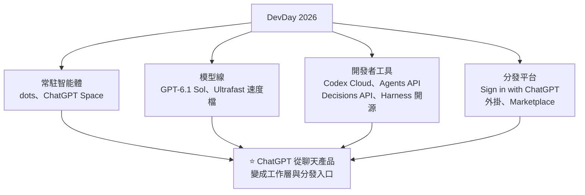

# OpenAI DevDay 2026:主角不是模型,是常駐 agent「dots」——以及 Sol、Ultrafast、Decisions API 與 Codex 上雲

**主題分類:** 科技 / AI 產業動態 — 開發者大會、常駐 agent、定價策略、平台化
**來源影片:**
- YouTube〈OpenAI DevDay 2026 全解析〉(Why QQ,2026-09-30,約 9.2 分;**依官方簡中字幕整理**)——§1–§7
- YouTube〈ChatGPT Dots 教程|关掉聊天后谁替你盯进度?〉(YAHA學堂,2026-09-30,約 12.4 分;**該片無字幕,逐字稿以 CPU faster-whisper 轉錄、非官方字幕**)——§8
**一手素材核實:** [Simon Willison 現場直播紀錄](https://simonwillison.net/2026/Sep/29/openai-devday-2026-live-blog/)、Latent Space AINews 整理、多篇發布會回顧
**整理日期:** 2026-10-01

> ⚠️ 兩支影片都沒有業配;YAHA學堂說明欄中的官方影片與說明文件連結作者標為「TBD」,本文改以其他公開報導核對。

---

## TL;DR

1. ⭐⭐ **反常的一點:** 53 分鐘主題演講、20 多項更新,**最前面、最長的演示給的不是新模型,而是常駐 agent「dots」**——Why QQ:「這在 OpenAI 開發者大會歷史上是頭一回。」
2. ⭐ **dots = 有編制的數位員工**:由 **GPT-6 Astra** 驅動,有自己的**雲端電腦與瀏覽器**,接 4,000 多個應用;交給它一個目標,**你關掉電腦它也繼續推進**。
3. ⭐⭐ **GPT-6.1 Sol:接近 Astra 的智慧、五分之一的價格**(輸入 $2、輸出 $10、快取輸入 $0.10)。另推 **Ultrafast 速度檔**:出字最快 8 倍,**價格 6 倍**。
4. ⭐⭐⭐ **最被低估的:Decisions API**——給上下文與一組預先定義的選項,**零點幾秒直接回傳一個選擇**,用來分類、路由、決定 agent 下一步。(📎 與本庫 Jev 筆記的「決策模型」是同一個方向)
5. ⭐⭐ **主線:** OpenAI 正把 ChatGPT 從聊天產品改造成**工作層與分發平台**(Sign in with ChatGPT、外掛、Marketplace),地基是 **12 億週活**。
6. ⚠️ **打折聽:** 性能數據全是官方自評;第三方 Artificial Analysis 智慧指數 **Sol 52 vs Claude Opus 5.5 58**;多項功能還是預覽;直播翻車兩次。

---

## 1. 大會概況

| 項目 | 內容 |
|---|---|
| **時間地點** | 2026-09-29,舊金山 Fort Mason,Sam Altman 主講 |
| **規模** | 官方稱史上最大;**20 多項重大更新**,橫跨 ChatGPT、Codex、模型與協作 |
| ✅ **ChatGPT 週活躍用戶** | **12 億**——「後半場所有關於分發的發布,都建立在這上面」 |



---

## 2. ⭐⭐ dots 與 Space

### 2.1 dots:常駐的數位員工

| 項目 | 內容 |
|---|---|
| **驅動模型** | ✅ **GPT-6 Astra**(Simon Willison 記錄:官方稱之為「最對齊的模型」) |
| **環境** | 雲端有**自己的電腦與瀏覽器**;透過外掛生態連接 **4,000 多個應用** |
| **典型用法** | 「盯緊新進來的 bug 報告 → 重現 → 修復 → 跑測試 → 提 PR」,**在背景持續推進** |
| **溝通入口** | ChatGPT、**Slack、Teams**;之後還能簡訊、電話 |
| **權限** | **主動研究預設唯讀**,敏感操作走人工審批 |
| **開放對象** | Pro、Business Premium;企業版需管理員開啟 |
| **計費** | 第一個 dot 包含在方案裡,**跟它對話不占用量** |

> Why QQ 的提問:「**把整個修 bug 流程交給常駐 agent,你敢嗎?**」

### 2.2 Space:dots 幹活的地方

- 共享工作區:**你、同事、各自的 dot** 放進同一個空間,圍繞共同目標與歷史工作協作。
- 新文件類型 **Pages**:人和 agent 可以同時編輯;對話可以直接沉澱成頁面;協作式簡報幾週內跟上。
- Slack、Teams 裡可以 @ChatGPT,**同一對話的人不需要都有訂閱**。
- Mac 端新增會議外掛,紀要與待辦自動存進 Space;官方說明**原始音訊用完即刪,不能回放**。

> ⭐ Why QQ:這塊對程式設計師直接價值有限,但透露了 OpenAI 的判斷——「**AI 的產出不該停在對話框裡,得落進文件、簡報這些能維護、能複用的載體。**」

---

## 3. ⭐⭐ 模型與定價:便宜和快,分開賣

### 3.1 GPT-6.1 Sol

| 項目 | ✅ 核實 |
|---|---|
| **定位** | 「接近 Astra 的智慧,**五分之一的價格**」 |
| **API 價格(每百萬 token)** | 輸入 **$2**、輸出 **$10**、快取輸入 **$0.10**(Astra:$10 / $50 / $1.00) |
| **上下文 / 輸出** | 1.05M / 128K(影片) |
| **上線範圍** | 當天進 API、ChatGPT Work、Codex;**一般聊天暫時沒有** |
| **與 Astra 的差距** | 影片:OSWorld 2.0 最高推理檔**只差 2 個百分點,成本七分之一**;**最難的科學任務 Astra 仍較強**(官方承認) |

> ⭐ 做 agent 應用要注意:**快取輸入 $0.10**(輸入價的二十分之一)讓系統提示、程式庫上下文、工具定義這些**重複前綴的成本幾乎可以忽略**——「0.1 美元的快取價會重寫你的成本結構」。

### 3.2 Ultrafast 速度檔

| 項目 | ✅ 核實 |
|---|---|
| **速度** | Codex 裡出字**最快 8 倍(約每秒 300 token)**,API 最快 6 倍 |
| **價格** | **標準價的 6 倍**——Astra Ultrafast:輸入 $60、輸出 $300 / 百萬 token |
| **上線** | Astra 當天可用;**Sol Ultrafast 還在路上** |

> ⚠️⚠️ Why QQ 點出的關鍵:「**8 倍說的是出字速度,任務總耗時快不了 8 倍**——工具執行和網路開銷都在原地。」

### 3.3 方案調整

| 方案 | 變化 |
|---|---|
| ✅ **Pro 500**(每月 $500) | 額度是 Plus 的 **25 倍**,**獨占 Ultrafast** |
| ✅ **Pro 200** | 重新開放給新用戶;影片:新用戶額度從 Plus 的 20 倍**調成 10 倍**,老用戶 10 月底前保留原額度,另送 2,500 美元 credits |

> ⭐ Why QQ:「**定價策略很清楚了——便宜和快,分開賣。**」

---

## 4. ⭐⭐⭐ Decisions API:最被低估的發布

| 項目 | 內容 |
|---|---|
| **原理** | 基於小模型 **Luna**;給它上下文與**一組預先定義的選項**,**直接回傳一個選擇** |
| **速度** | 影片引官方:**150 毫秒 vs 一般 Luna 呼叫的 1.6 秒,快約 10 倍**(Simon Willison 記錄為「零點幾秒」) |
| **用途** | **分類、路由、決定 agent 下一步動作** |
| **狀態** | ✅ 2026-09-29 進入**限量預覽**,官方說幾天內擴大開放 |

> ⭐⭐ Why QQ:「以前的做法是**拿大模型生成一段 JSON 再寫程式解析**,為一個判斷付出整段生成的延遲與費用。現在**判斷這一步被單獨抽出來,做成了 API 原語**。」
> 「做客服分流、審批路由、agent 狀態機的團隊,這東西值得第一時間試。」

📎 **這跟本庫 [[system-one-models-jev-calibrated-decisions]](TypeSafe 的 Jev 決策模型)是完全同一個方向**:把「選擇題」從「申論題模型」裡拆出來。Jev 筆記 §16.5 記錄的教訓同樣適用——**用分數或機率做門檻時,不要只看平均值,要讀分布,並規定不確定時怎麼辦**。

---

## 5. ⭐⭐ Codex 全家桶與平台能力

### 5.1 Codex(這次更新密度最高)

| 功能 | 內容 |
|---|---|
| ⭐ **Codex Cloud** | 開發環境設定一次,存成雲端環境;**任務在雲端託管電腦裡跑,闔上筆電也不停**。現場演示:一句話讓整個後端用 Rust 重寫,丟上雲端跑,人繼續開會 |
| **CLI 重做** | 支援雙向語音,新增 `/agents` 視圖 |
| **Code Review** | 桌面端加入;首輪審查在雲端自動跑,接 GitHub PR 與 GitLab MR |
| **Codex Security Cloud** | 持續掃描倉庫找漏洞,自動去重,附修復方案 |
| **補齊** | Linux 版、單一專案跨多資料夾、手機端 |

### 5.2 平台層

| 功能 | 內容 |
|---|---|
| **Agents API(公測)** | OpenAI 把驅動 Codex 的執行框架託管出來:你定義任務、接工具與資料,底層環境 OpenAI 扛;內建多智能體、工具搜尋、上下文壓縮 |
| ⭐ **電腦操作進 API** | agent 直接操作軟體介面:開瀏覽器、點流程、做測試;✅ Simon 記錄:延遲改善 2 倍 |
| **Bedrock Managed Agents** | 與 AWS 合作,讓 agent 貼著既有應用與資料跑 |
| **Private Intelligence** | 零資料保留 + 隱私安全處理;隱私推理秋季出預覽 |
| ⭐⭐ **Codex Harness 開源** | **Codex、ChatGPT Work、dots 共用同一套 agent 框架**,可以直接讀實作 |

📌 **本文補充:** 報導指出開源的部分在 **`openai/codex` 倉庫(Apache-2.0)**,官方文件列出 Codex CLI、SDK 與 app server 為開源專案——**其中 Codex CLI 早在 2025 年就已開源**;這次的重點是**官方確認 dots 也跑在同一套 harness 上**。Simon Willison 也對「哪些是新開源的」表示不確定。📎 本庫 [[codex-as-a-platform-open-agent-harness]] 有更早的拆解。

---

## 6. ⭐⭐ 主線:ChatGPT 變成分發平台

| 發布 | 內容 |
|---|---|
| **Sign in with ChatGPT** | 用戶**帶著自己的訂閱額度**登入第三方產品;影片:首批 16 家,含 Notion、Vercel、Devin;**聊天記錄與記憶不共享** |
| **外掛擴充** | 開發者能在 ChatGPT 裡做側邊欄、互動面板、檔案檢視器——「等於把應用蓋進對話框」 |
| **MCP Events** | 外部事件可以觸發 ChatGPT 裡的自動化——「**你不在線,活照樣啟動**」 |
| **Marketplace** | 面向企業;影片:首批 32 家,含 Figma、Adobe、Salesforce(✅ Simon 記錄到 Adobe、Canva、Figma、Notion、Salesforce、Vercel、Zendesk) |

> ⭐⭐ Why QQ:「這屆 DevDay 是對行業方向的確認——**模型能力的競爭還在,但重心正往三個地方移:長期上下文、執行環境、分發入口**。dots 押注前兩個,外掛平台和登入體系押注第三個。」
> ⚠️ 「對開發者,平台紅利期開始了;**平台依賴的風險也同步放大**——你在別人的地基上蓋房子,地租隨時可能漲。**Pro 200 的額度說改就改,就是現成的例子。**」

---

## 7. ⚠️ 打折聽的地方

| 項目 | 說明 |
|---|---|
| **性能數據全是官方自評** | 第三方 **Artificial Analysis 智慧指數:Sol 52、Claude Opus 5.5 58**;Sol 的優勢在成本(單任務花費不到對手八分之一) |
| **「內部已有 AI 研究實習生上崗」** | 影片:7 月以來模型獨立完成超過三分之一「以天計」的研究任務,無需人工介入。✅ Simon 記錄:8–16 小時任務零介入成功率 **35%**(2026 年 7 月,1 月時為 10%)。**沒有論文與外部評測,先當公司聲明聽** |
| **宣布 ≠ 能用** | Sol Ultrafast、協作簡報、隱私推理都還在路上;dots 有地區限制 |
| **直播翻車** | 兩次(語音沒聲音、3D 演示卡住);✅ Simon 也記錄多次演示出狀況,還在手機上建 dot 時收到「dots 在桌機上效果最好」的錯誤 |
| 收尾彩蛋 | 現場按下按鈕,**替全球 Codex 用戶重置額度** |

---

## 8. ⭐⭐⭐ dots 實用教學:怎麼交接、權限邊界在哪(YAHA學堂)

> YAHA學堂這支不講空話,只講**邊界**。

### 8.1 先判斷:你需要答案,還是需要有人一直跟下去?

> ⭐ 「我的判斷方法:**回想你每週反覆查的那件事——如果查完還得更新材料、提醒別人或做決定,它就值得交給 dot 試一輪。**只是臨時問一個概念,就不必設計長期任務。」

### 8.2 交接:一句話 vs 說清楚

| 寫法 | 例子(籌備團隊活動) | 結果 |
|---|---|---|
| ❌ 一句話 | 「幫我把活動安排好」 | 它得猜你在意價格還是交通、能不能回覆場地、預算變了要不要等你 → **來回確認** |
| ⭐ 說清楚 | 「根據這份活動計畫和場地郵件,**持續整理沒確定的事項**;**本週到期的先處理**;人數變了就更新清單;**涉及預算與對外回覆,先準備建議,交給我確認**」 | 給了**資料**、交代了**什麼算進展**、**什麼需要你決定** |

> 第一份結果回來後,糾正漏掉的細節,**再逐步擴大它負責的範圍**。

**開發情境:** dot 跟進用戶回饋、調查問題、準備修復與測試、把 PR 交給你審;還能把工作轉給 **ChatGPT Work**(工作任務)或 **Codex**(程式任務)。⚠️ 要用特定的 Codex 雲端環境,**得先把環境建好**,不能只丟一個倉庫名字。

### 8.3 ⭐⭐ 三種連接,先分開

| 連接 | 解決什麼 | ⚠️ 常見誤解 |
|---|---|---|
| **訊息渠道** | 你**在哪裡找它**(ChatGPT、Slack、Teams) | 接上聊天渠道 ≠ 把信箱和電腦也交給它 |
| **應用連接** | 它**能讀什麼資料、用什麼工具**(郵件、檔案、行事曆等外掛) | 你的帳戶能用哪些、能執行哪些動作,還要看支援與權限 |
| **本機電腦** | 它能不能用**你電腦裡的檔案、軟體、任務** | ⚠️ **預設關閉**;開啟後,**你的電腦必須在線、ChatGPT 桌面 app 也要開著** |

> ⚠️⚠️ 「聽到『全天候』,**別理解成筆電關機後它還能繼續用筆電上的工具**——得看這項工作究竟跑在哪裡。」雲端電腦可以查看、必要時接管;**本機瀏覽器與雲端瀏覽器的登入狀態要分開看**。

### 8.4 ⚠️⚠️ 最容易搞反:主動研究「唯讀」

- 背景的**主動研究使用唯讀工具**:從已獲准連接的資訊裡找線索、形成筆記;**不能發訊息、改應用內容、控制瀏覽器或電腦**。
- 例:它發現活動計畫與場地郵件的**日期對不上**,可以把問題帶回來;但「**發現衝突**」和「**直接替你改場地預訂**」之間,**隔著行動權限**。

**自訂規則與自動審核:**
| 層級 | 說明 |
|---|---|
| 自訂規則(四檔) | 某類動作**不用再問** / **你明確提出時才執行** / **每次確認** / **直接交回你本人** |
| 自動審核(三個出口) | 涉及帳戶影響或資訊分享的動作,會依你的要求、權限與安全規則判斷:**繼續 / 需要你批准 / 必須由你接手**(如修改密碼) |
| ⚠️ | 自訂規則**不能覆蓋內建安全要求**;規則和審核**都不代表絕對不會出錯** |

> ⭐ 建議:**第一次交接,把「對外發送」和「正式提交」留給自己確認**。驗收問題很具體:它找到依據沒有?漏了什麼?哪些結論需要我重新判斷?

### 8.5 記憶與資料

| 項目 | 說明 |
|---|---|
| **記憶** | 會用相關的 ChatGPT 記憶,也形成自己的筆記(偏好、決定、持續任務);**不是每次都帶上所有聊天記錄** |
| **跨渠道** | 可用相關背景,但**你私下說過的事,不會因此自動獲得發到團隊頻道的許可** |
| ⚠️ **斷開應用** | **不會刪除**它之前已從該應用取得的資訊 |
| ⚠️ **刪除 dot 自己的記憶** | 依目前說明,**要刪除這個 dot 本身**;刪除或重置也涉及對話與排程任務,**不會撤銷已在外部應用完成的修改或已發出的訊息** |
| **訓練** | Business、Enterprise、Edu 工作區內容**預設不用於訓練**;個人方案看自己的資料控制設定 |

> ⭐ 「**撤銷存取、停止工作、清除紀錄,是三件不同的事。**」

### 8.6 排程與觸發

- 有時間要求時說清楚:**時區、持續多久、結果發到哪裡**。例:「未來四週、每個工作日上午九點(台北時間)檢查活動進度;一般變化更新清單,**截止日有風險才通知我**。」
- ⭐ **檢查頻率 ≠ 打擾頻率**:每天檢查,不代表每天都要發一長串沒變化的匯報。
- **事件觸發**要連接的服務支援監控才行——**只把它加進 Slack 頻道,不等於已經安排了監看**。
- ⚠️ **別只看「已完成」**:程式修改、資料分析、對外材料要回到內容本身驗收。**結束聊天或掛斷語音,不一定停止已交出去的工作**——要分別檢查當前任務、已委派的任務與後續排程。

### 8.7 誰能用、怎麼收費

| 項目 | 說明(影片轉述官方說明,以最新公告為準) |
|---|---|
| **Pro** | 有地區限制:**歐洲經濟區、英國、瑞士暫不包含**;有成年用戶條件 |
| **Business Premium** | ChatGPT 支援的地區 |
| **Enterprise / Edu / 醫療工作區** | 需管理員啟用,**預設關閉** |
| **費用** | 第一個 dot 包含在 Pro 或 Business Premium;**深度工作有額度**(首月提高);跟 dot 聊天不計入用量,但**它發起的 Work / Codex 任務照各產品計算** ⇒ 「**全天候可聯繫 ≠ 無限量幹活**」 |
| **建立方式** | 只能在**桌面 app 或電腦瀏覽器**建立(桌面 app 支援 Windows);**手機目前不能建立** |
| **限制** | 可以主動語音交談,但首發時**不能主動打給你**;簡訊開放有限;**還不能給它獨立信箱地址** |
| **企業專職 dot** | 有獨立身分、平台與系統存取權限,從定向試點開始;與微軟 **Agent 365** 整合在推進中——**別和個人帳戶的第一個 dot 混為一談** |

---

## 9. 應用案例

### 案例一:程式設計師接下來兩週的優先順序(Why QQ)

| # | 動作 |
|---|---|
| **①** | 把**批次處理與 agent 任務切一部分到 Sol**,用真實任務比總成本;把穩定的長前綴設計成能命中快取 |
| **②** | 系統裡有路由與分類邏輯的,**等 Decisions API 開放後跑一次對比**——大概率能換掉一批大模型呼叫 |
| **③** | **去讀 Codex Harness 原始碼**:看頭部公司生產級 agent 框架的完整實作(編排迴圈、記憶、上下文管理) |
| **④** | 做 AI 應用的,認真評估 **Sign in with ChatGPT**:用戶自帶額度,**最燒錢的重度用戶可能從成本項變成中性項** |

### 案例二:把「每週查一次」的事交給 dot

例:每週追蹤三個開源依賴的安全公告。
```text
目標:每週一上午 9 點(台北時間),檢查 package.json 中 express、lodash、axios
的安全公告與新版本。
進展的定義:有影響我們版本的 CVE,就整理成表格(CVE、嚴重度、修復版本)。
需要我決定的事:是否升級、是否建 PR。⚠️ 不要自行開 PR 或發訊息。
沒有變化時:只在週報裡寫一行「無變化」,不要另外通知。
```

### 案例三:用 Decisions API 的思路改造客服分流

- 舊做法:大模型讀工單 → 輸出 JSON `{"category": ...}` → 解析 → 路由(約 1–2 秒、整段生成費用)。
- 新做法:把類別定義成**有限選項**(帳務 / 技術 / 退款 / 其他),交給決策型 API 直接選(零點幾秒)。
- ⭐ 加一道保險:**信心低或落在門檻附近時,回落到人工或大模型**(Jev 筆記 §16.5 的教訓)。

---

## 來源

- YouTube:[OpenAI DevDay 2026 全解析](https://www.youtube.com/watch?v=KOAKRtBHecs)(Why QQ,2026-09-30;官方簡中字幕)
- YouTube:[ChatGPT Dots 教程|关掉聊天后谁替你盯进度?](https://www.youtube.com/watch?v=imvTUmRoqK8)(YAHA學堂,2026-09-30)——**該片無字幕,逐字稿以 CPU faster-whisper 轉錄、非官方字幕**
- [Simon Willison — OpenAI DevDay 2026 live blog](https://simonwillison.net/2026/Sep/29/openai-devday-2026-live-blog/)
- [Latent Space AINews — OpenAI DevDay 2026: Dots, 6.1 Sol, Ultrafast, Decisions API…](https://www.latent.space/p/ainews-openai-devday-2026-dots-61)
- [Unite.AI — OpenAI Unveils GPT-6.1 Sol at DevDay](https://www.unite.ai/openai-unveils-gpt-6-1-sol-at-devday-with-new-codex-and-chatgpt-tools/)
- [Decrypt — OpenAI Gave AI Agents Their Own Computers at DevDay 2026](https://decrypt.co/379584/openai-ai-agents-computers-devday-2026-everything-announced)
- [DEV Community — every announcement, with prices and availability](https://dev.to/axrisi/openai-devday-2026-every-announcement-with-prices-and-availability-1mbh)
- Codex 開源倉庫:[github.com/openai/codex](https://github.com/openai/codex)

📎 相關筆記:[[system-one-models-jev-calibrated-decisions]](決策模型)、[[codex-as-a-platform-open-agent-harness]](Codex harness)、[[gpt-6-astra-token-efficiency-and-harness]](Astra)、[[claude-sonnet-5-5-release-effort-migration]](同週的 Anthropic 發布)

**Whisper 專有名詞還原對照(YAHA 段):** DOUDS/Dotus/Data/DWOET → dots;CHATGPTWORK → ChatGPT Work;CodeX → Codex;厂地 → 場地;預設 → 預算;雲斷/雋端 → 雲端;瀧覽機 → 瀏覽器;止毒 → 只讀;訊念 → 訓練。
