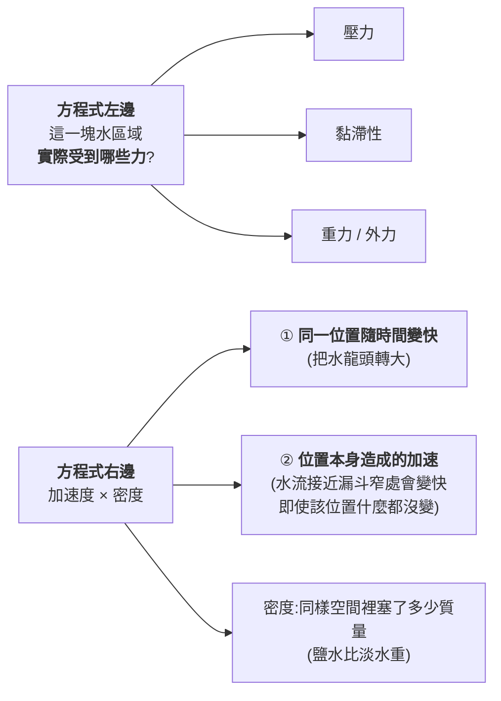
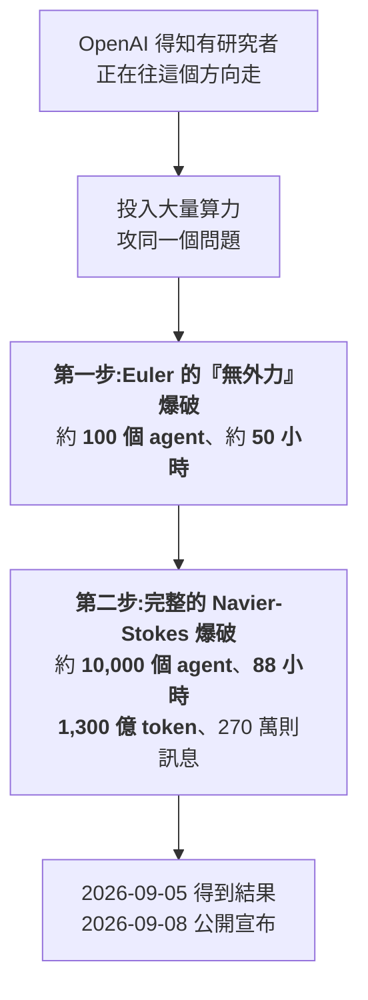
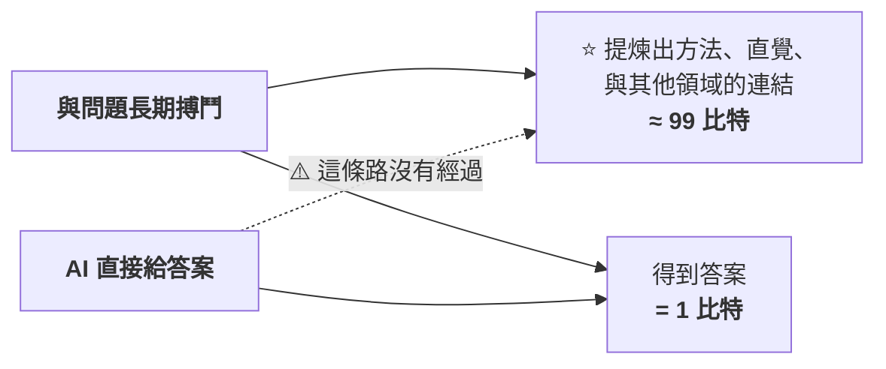
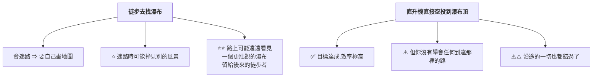
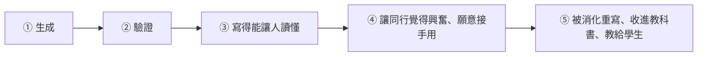
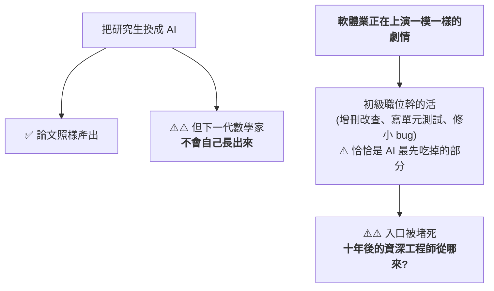
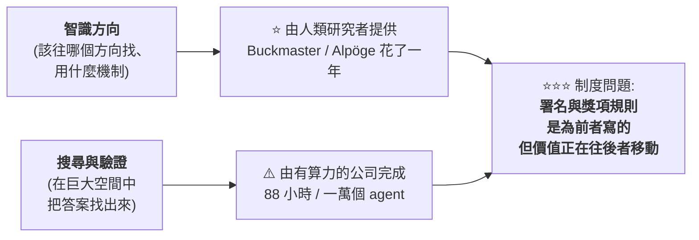

# 一萬個 agent 破解千禧年難題:Navier-Stokes、抄襲指控,與「誰該被署名」

> 整理自 YouTube 頻道 **Caleb Writes Code**〈[AI making breakthroughs explained..](https://www.youtube.com/watch?v=7DncQnIjZmA)〉(2026-09-12,約 10.9 分鐘,自動英文字幕)。
> ⚠️ **立場揭露:該片含 Incogni(個資移除服務)業配**,與內容主題無關,本文不轉述。
> ⭐ **關鍵事實已比對 OpenAI 官方公告、Scientific American、Fortune、Tom's Hardware 與 Clay 數學研究所的表態**,並補上影片未提的三點(見 §7),以及事件三天後整個數學界的集體回應(見 §8)。
>
> ⭐⭐⭐ **2026-09-15 增補 Why QQ**〈[最挺AI的陶哲轩说:数学中AI的严重错位](https://www.youtube.com/watch?v=9uq4FRJ0oEE)〉(2026-09-15,約 10.4 分鐘,官方 zh-Hans 字幕),成為 **§8:25 位菲爾茲獎得主聯名聲明** —— 本事件三天後,整個數學共同體做出了集體回應。**該聲明全文已直接讀取原文逐句核實。**

---

## 一句話總結

> **OpenAI 用約一萬個 agent、88 小時、1,300 億 token,宣稱找到 Navier-Stokes 方程「有限時間內爆破」的反例。**
>
> ⭐⭐⭐ **但作者真正關心的不是數學,是這句話:
> 當「科學發現的靈感來自聰明人,而實際的搜尋與驗證由有算力的公司完成」時 ——
> 誰該拿到署名?誰還有能力做科學發現?**

---

## 一、⭐ 先把數學講清楚:從 F = ma 到 Navier-Stokes

**牛頓第二定律 `F = ma` 對固體很好用,因為固體只有「一個質量、一個加速度」——
你隨便挑電梯的兩個部位,它們的加速度是一樣的。**

⚠️ **但流體完全不同:**

> **水不會當成單一物體移動 —— 不同部分的水可以**同時**往不同方向、以不同速度、甚至不同加速度移動。
> 而這些全都必須被寫進同一條方程式裡。**

**把牛頓第二定律套用到流體,就得到 Navier-Stokes 方程。用一條花園水管來理解它的各個部分:**

| 分量 | 水管裡的直覺 |
|---|---|
| **壓力(pressure)** | 靠近水龍頭那端把水推進管子,壓力**高於**另一端流出處(受大氣壓力影響) |
| **黏滯性(viscosity)** | ⭐ **貼近管壁的水被摩擦拖慢**,相對於管子中央的水 |
| **重力與其他外力** | 不同位置受到的力可能不同 |

> 📌 **這條方程式已經 181 年了,工程上一直很好用 —— 水在管中的流動、天氣預報系統、洋流模擬都靠它。**

---

## 二、⭐⭐ 那到底什麼還沒被證明?

> ⭐⭐⭐ **「Navier-Stokes 並不是有瑕疵 —— 它屬於『實務上工程可用,但數學上還沒被證明在所有條件下都成立』的那一類。」**

**正式的問題敘述:**

> **是否存在某種條件,讓這套數學在合理的情境下崩潰?還是它在 3D 空間中永遠產生平滑解?**

⭐ **注意「證明」在這裡有兩條路:**

| 路徑 | 內容 |
|---|---|
| **① 正面證明** | 證明 Navier-Stokes 在**所有情況下都平滑** |
| ⭐ **② 反例** | 找出一個**讓方程式爆破到奇異點(singularity)**的例子 |

📌 **OpenAI 走的是第二條。** 這是 Clay 數學研究所 2000 年列出的**千禧年大獎難題(Millennium Prize Problems)**之一,懸賞一百萬美元。

---

## 三、⭐⭐⭐ 事件經過:一場一年 vs 88 小時的對照

### 人類這邊:Buckmaster 與 Alpöge 的一年

| 項目 | 內容 |
|---|---|
| **人物** | **Tristan Buckmaster**(紐約大學 Courant 數學科學研究所教授)、**Levent Alpöge**(任職於 **Anthropic**) |
| **性質** | ⭐ Buckmaster 聲明這是「**純屬個人合作,沒有任何機構協議或雙方雇主的官方參與**」 |
| **策略** | ⭐⭐ **先在較簡單的 Euler 方程上找爆破機制** —— Euler 是**不考慮黏滯性**的版本,希望這個機制在之後加回黏滯性時仍然成立 |
| **成果(2026-08-15)** | 取得 **Boussinesq 與 Euler 的爆破結果,但是「有外力(forced)」的版本** |

> ⚠️ **「forced」這個字是關鍵:他們的證明依賴**外加一個力**來促成爆破 ——
> 走到這一步已經是突破,但還不是完整證明。**

### OpenAI 這邊:兩步走

> ⭐⭐ **OpenAI 做到了人類版本沒做到的事:在 Euler 上找到「不需要外加力」的爆破** —— 這確實更強。
> ⚠️ **但「用了相似的路徑」正是抄襲傳聞的起點。**

---

## 四、⚠️⚠️ 爭議:三件事讓慶祝變了調

### ① 時間點

**兩位研究者比 OpenAI 早一天發表相關成果。**
⚠️ **約在 2026-09-03,Alpöge 得知他們的進展已被傳到 OpenAI 那邊。**

### ② ⚠️⚠️ 署名條件

**據 Buckmaster 的說法,OpenAI 的 Sébastien Bubeck 給了他兩個選項:**

| 選項 | 內容 |
|---|---|
| **A** | 他和 Alpöge 發表部分解的論文,OpenAI **隔天**發表「我們的模型解決了完整問題」,並附註他們應得千禧年獎 |
| ⚠️⚠️ **B** | Buckmaster 自己發表並主張獎項 —— **但必須把 Alpöge 的名字拿掉**,因為 OpenAI 不喜歡他的 Anthropic 背景 |

### ③ ⚠️ 指控與否認

> **Buckmaster 稱 Bubeck 威脅他:「你為什麼要毀掉自己的職涯?」以及「如果你不想要我好好說話,那我也可以不好好說話。」**

⚠️ **另一項指控是 OpenAI 窺看了研究者在使用 Codex 時的訊息記錄,從中取得靈感。**
📌 **OpenAI 多次否認上述指控。**

> ⭐ **影片的定調很誠實:「這一切讓所有人處在一種奇怪的狀態 ——
> 我們到底該不該為這個顯然令人興奮的時刻慶祝?」**

---

## 五、⭐⭐⭐ 作者真正想問的問題(全片精華)

> **「把一切串起來的共同故事是:當科學發現**源自聰明人**,
> 但實際的**搜尋與驗證**是由**有算力的公司**用大規模算力與 agent 編排完成時,會發生什麼事?」**

**他列出三個具體的擔憂:**

| # | 問題 |
|---|---|
| **1** | ⭐⭐ **未來誰真的有能力做出科學發現?是那些跑得起一萬個 agent 的公司嗎?** |
| **2** | **這是否徹底顛倒了科學發現的權力結構?** |
| **3** | ⭐⭐⭐ **當前沿公司做了大部分工作、研究機構提供智識方向時,署名與認可該歸誰?** |

⭐ **一個很到位的觀察:**

> **「即使看千禧年大獎難題的規章,關於獎項授予的用語也沒有考慮到 AI 或 AI agent ——
> 它寫的是授予**個人或一群人**。」**

⚠️ **而且傳聞 OpenAI 已經在往下一題前進** —— 針對其他懸置數十年的千禧年難題,
**儘管 Navier-Stokes 這題可能還要幾年才會被機構接受或否決。**

---

## 六、⭐⭐ 這件事為什麼值得非數學家關心

📎 **本庫已經有兩篇筆記指向同一個張力,這篇補上了第三個角度:**

| 筆記 | 角度 |
|---|---|
| [[rsi-recursive-self-improvement-anthropic]] | **AI 研發 AI 的飛輪**(能力面) |
| [[anthropic-html-work-pages]] | **產出變便宜、理解變貴**(工作面) |
| ⭐ **本篇** | **算力落差如何改寫「誰能做研究」與「誰該被署名」**(制度面) |

---

## 七、⭐⭐⭐ 影片未提、但非常重要的三點(本文補充)

### ⚠️⚠️ 7.1 Clay 數學研究所並未認定這題已解

> **Clay 數學研究所**尚未接受 OpenAI 的證明。院長 **Martin Bridson** 表示評估將是
> **「刻意不趕時間的」(deliberately unhurried)與「絕對嚴謹的」**。
> ⭐⭐ **該研究所目前仍把 Navier-Stokes 列在「未解決」的千禧年難題清單上。**

📌 **所以「OpenAI 解決了千禧年難題」這個說法,目前是 OpenAI 的主張,不是機構認定。**

### ⭐⭐⭐ 7.2 陶哲軒的評論比爭議本身更值得記

**陶哲軒(Terence Tao)一方面稱 Buckmaster 與 Alpöge 的工作是「了不起的成就」,
另一方面提出一個更深的憂慮:**

> ⭐⭐⭐ **「出現了一種非常奇怪且前所未有的**脫鉤** —— 在『得到答案』與『得到理解』之間。」**

> 📎 **這句話的份量遠超這一題本身。** 它與 [[anthropic-html-work-pages]] 的「產出變便宜、理解變貴」
> 是同一個現象在**科學研究**這個場域的版本 —— **而且後果更嚴重:
> 工程上交付錯了可以回滾,數學上「有答案但沒人理解為什麼」會讓整個知識體系失去可累積性。**

⭐ **另一位數學家 Diego Córdoba 的一句玩笑則是另一種回應:**
> **「我不用 AI:我有 Luis。」**(指他的合作者 Luis Martínez-Zoroa —— ⭐ **而這兩條路徑的基礎技術都出自他**。)

### ⭐ 7.3 整體算力成本

| 項目 | 數字 |
|---|---|
| **Navier-Stokes 這一題** | **約 1,300 億 token、270 萬則訊息、88 小時、約 10,000 個 agent** |
| ⭐ **那一週的整體衝刺(涵蓋多個千禧年難題)** | **3,000 億輸出 token,算力成本約 2,250 萬美元** |

> 📌 **這個數字才是「算力落差」最具體的樣子:一週 2,250 萬美元的算力預算,
> 不是任何大學數學系能編出來的。**

---

## 八、⭐⭐⭐ 後續:25 位菲爾茲獎得主聯名《數學中 AI 的嚴重錯位》(2026-09-15 增補,來源:Why QQ)

**§1–§7 停在「爭議發生了」。三天後,整個數學共同體做出了集體回應 ——
而這份聲明的價值遠超這一起事件,它講的是所有知識工作的同一個陷阱。**

### 8.1 這份聲明為什麼罕見

| 項目 | 內容 |
|---|---|
| **時間** | **2026-09-11**,發表於陶哲軒的部落格 |
| **標題** | **《A Severe Misalignment of AI in Mathematics》(數學中 AI 的嚴重錯位)** |
| ⭐⭐ **初始簽署人** | **25 位,清一色菲爾茲獎得主** |
| **跨度** | 最資深的是 **1978 年得主 Pierre Deligne**,最新的是 **2026 年 7 月剛獲獎的華裔數學家鄧煜** |
| **知名簽署者** | Terence Tao(2006)、Peter Scholze(2018)、June Huh(2022)、James Maynard(2022)、Maryna Viazovska(2022)、Artur Avila(2014)、Manjul Bhargava(2014)、Hugo Duminil-Copin(2022) |

> ⭐ **菲爾茲獎四年才評一次,只發給 40 歲以下的數學家。
> 湊齊 25 位得主在同一份文件上簽名、橫跨將近半世紀 —— 這在數學史上幾乎沒有先例。**

### 8.2 ⭐⭐⭐ 牽頭的人是誰,比聲明本身更值得琢磨

**陶哲軒這幾年一直是數學圈對 AI 最開放的旗幟:**

- 公開演示過用 ChatGPT 配合 **Lean** 寫形式化證明
- 帶著社群用 AI 刷 **Erdős 問題**
- 曾預測 2026 年的 AI 會成為**值得信賴的合著者**

> ⭐⭐⭐ **就是這樣一個「最挺 AI 的數學家」,現在牽頭寫下「嚴重錯位」四個字。**

⚠️ **而陣營的分裂也擺上了檯面:** 2026 年 7 月頒獎禮上,另一位新科得主 **Zimmermann
宣布離開多倫多大學加入 OpenAI**,理由是他判斷 AI 很快會把數學家的工作做得更快更好。
**他沒有簽名。**

### 8.3 ⭐⭐ 聲明說了什麼(已對原文核實)

⭐ **全文沒有點名任何一家公司,但所有人都知道它在說誰。**
**《經濟學人》的報導標題毫不客氣:〈頂級數學家對 OpenAI 的做法感到憤怒〉。**

#### 核心指控

> **「AI 公司把解決數學問題當作跑分基準的做法,**對數學這門科學、對數學家共同體都是傷害**。」**

📌 **聲明解釋:著名問題在歷史上的功能是「**地標與燈塔**」——
用來衡量理解的進展。而這個功能正在被企業競爭侵蝕。**

#### 三個具體指控(原文引述)

| # | 原文 |
|---|---|
| **1** | **「這些解答常常是倉促宣布的,沒有時間做像樣的寫作、沒有時間提煉新方法與新想法、也沒有時間引用他人的相關前作。」** |
| **2** | ⭐ 這會引出**「嚴重的歸屬與抄襲問題」** |
| **3** | ⚠️⚠️ **「若沒有願意照料這些想法、把它們整合進數學經典體系的數學家,AI 構想出來的東西永遠不會真正活過來,而數學家之間**關鍵的人類傳承鏈條**就會斷掉。」** |

#### ⭐⭐⭐ 全篇最重的一句

> **「以越來越快的速度**大規模量產「真/假」命題**,可能會**摧毀沃土**,而不是為新思想注入生命。」**

#### ⚠️ 但它不反對使用 AI

> ⭐⭐ **聲明明確寫著:「AI 提供了增強並加速真正的數學研究與理解的潛力。」**
> **它反對的是**企業誘因與數學價值之間的錯位**,不是這項技術本身。**

📌 **這一點在社群討論中被大量誤讀,務必記住。**

### 8.4 ⭐⭐⭐ Thomas Wolf 的翻譯:1 比特 vs 99 比特

**Hugging Face 共同創辦人 Thomas Wolf 把聲明翻譯成了工程師最熟悉的語言:**

> **AI 模型橫掃這些問題,只給出 **1 比特**的信號(真/假),
> 卻殺死了數學家在與問題長期搏鬥時本來能提取的另外 **99 比特**的概念理解。**

> ⭐ **這個換算很粗暴,但方向感是對的。做技術的都懂:
> 一個通過測試的黑箱,和一套你能講清楚的實現,資訊量天差地別。**

⚠️ **當然也有反駁:有人回懟「這封信是 99 比特的自我安慰」。**

### 8.5 ⭐⭐⭐ 陶哲軒的悖論:產出報表很好看,但沒有人變強

**他在 Big Think 的訪談把矛盾講得最透:**

> **AI 越來越強、錯誤越來越少,它在跑實驗、分析資料、寫論文 ——
> 表面上把科學家該幹的事全幹了。任何大學和資助機構看產出報表,都會說科學運轉良好。**
>
> ⚠️⚠️ **但代價是:AI 學會了技能,**沒有任何一個人類科學家因此變得更強**;
> 甚至沒有人能講清楚剛才到底發生了什麼 —— 這個發現為什麼有趣、
> 這個證明新在哪裡、它和整個領域怎麼連接。**

> ⭐⭐⭐ **一句話:答案到了,理解沒有到貨。**

📌 **他由此提出:我們可能要重新設計「對科學本身的定義」,想清楚我們到底在優化什麼。**

### 8.6 ⭐⭐ 直升機與徒步(全文流傳最廣的比喻)

> ⭐⭐⭐ **「到達目標只是價值的一部分。」**
>
> ⚠️ **問題很樸素:當直升機成為預設選項,還有幾代人願意練徒步?
> 而沒有徒步者,就沒有新的地圖。**

### 8.7 ⭐⭐⭐ 陶哲軒直接點名寫程式(這一段是給工程師的)

> **「很多資深程式設計師報告,用上這些工具之後寫程式的速度提升了 **5 倍、10 倍,甚至 100 倍**。
> ⚠️⚠️ **但他們同時能感覺到,自己手寫程式碼的能力正在流失** ——
> 有時候已經看不明白 agent 吐出來的程式碼。」**

> ⭐⭐ **速度上去了,review 能力下來了。**
>
> 📌 **而影片補的那句最實際:「你可以讓 AI 一分鐘生成一個模組,
> 但線上出事的時候,排查問題的那雙手還是你的。」**

### 8.8 ⭐⭐⭐ 「證明消化不良」——一個每個做過大專案的人都認得的畫面

**一個證明有完整的生命週期:**

| 階段 | AI 的影響 |
|---|---|
| **①②** | ⭐ **被加速了幾十倍** |
| ⚠️⚠️ **③④⑤** | **紋絲不動 —— 還是得人來幹** |

> ⚠️ **結果:數學界突然被海量待消化的證明淹沒了。**
> **以前一個大問題被解決,所有專家會放下手裡的事去精讀 —— 因為稀缺所以珍貴。
> 現在 solution 多到需要「分診」。**

⭐⭐⭐ **影片給了一個工程師版本的對照,非常傳神:**

> **「AI 一天給你提 200 個 PR,測試全綠,但沒有資深工程師有空認真看。
> ⭐⭐ **積壓的從來不是程式碼,是理解。**」**

📎 **這與本庫 [[anthropic-html-work-pages]] 的「產出變便宜、理解變貴」完全同構 ——
差別在於這裡給出了「生命週期的哪幾步被加速、哪幾步沒有」這個更精確的診斷。**

### 8.9 ⚠️⚠️ 黑箱問題:就算結果完全正確,失去的也遠比一個答案多

**陶哲軒追問的幾個問題,正是 §7.3 「算力落差」的另一面:**

| 追問 | 為什麼重要 |
|---|---|
| **燒了多少算力?是十萬美元還是一百萬美元?** | 決定這是不是可複製的常態 |
| **試了多少道題?只做了一道還是一百道?** | ⭐⭐ **失敗率未知 ⇒ 無法判斷這是能力還是運氣** |
| **失敗率是多少?** | 同上 |

> ⚠️⚠️ **公司一概不公布。沒有這些數據,外界根本無法判斷
> 這到底是「可複製的常態」,還是「一次精心策劃的公關」。**

📎 **這一點與 §7.1(Clay 研究所不認定已解)互相呼應:
一個講程序上未被認定,一個講方法上無法被評估。**

### 8.10 ⭐⭐ 一個思想實驗:如果開普勒手裡有 AI

> **讓 AI 直接擬合行星軌道資料,它大概率會給**地心說模型打個補丁** ——
> 因為當時地心說的擬合精度更高。**
>
> ⚠️⚠️ **而「橢圓」這個更本質的答案,反而會因為早期誤差更大而被丟棄。**

> ⭐⭐⭐ **一句話:優化錯了目標,越努力偏得越遠。**

📌 **這個思想實驗可以直接搬到工程上:
當你用「通過測試」當唯一目標,AI 會給你一個通過測試的實作 ——
但「更本質的設計」在早期往往表現更差。**

### 8.11 社群兩派(HN 917 票、Reddit 400+ 票)

| 觀點 | 論點 |
|---|---|
| ⭐ **樂觀派(HN 最高讚)** | 用**望月新一的 abc 猜想**類比:當年他也扔下一個沒人看懂的巨型證明,**結果反而催生了大量會議、論文和走廊討論** —— 社群的消化能力也許比聲明擔心的更強 |
| ⚠️ **反駁** | **這種讀法恰好誤讀了聲明** —— 信裡從頭到尾沒有反對用 AI,陶哲軒本人就是用得最勤的;**它反對的是把數學變成 AI 公司的跑分廣告** |
| ⚠️⚠️ **悲觀派** | 翻出**李世乭退役訪談**:輸給 AI 之後「他的整個世界塌了,從此無法再享受圍棋」 |
| ⭐⭐ **Reddit 上最準的一條觀察** | **「年初陶哲軒還在興奮地討論『AI 輔助人類做數學』,現在的劇情已經變成『人類輔助 AI』。」** —— **這個主客互換,才是數學界真正不安的地方** |
| **冷嘲** | 「當年手搖織布機的工人,是不是終身拒絕穿機器織的布?」 |
| ⭐ **支持派最冷靜的一條** | **這封信比想像中克制 —— 它沒有否定 AI 的價值,只是要求把「從答案裡提煉概念理解」這件事補上** |

> ⭐ **影片的評語:「同樣的爭論,從紡織業到圍棋再到數學,劇本一個字都沒改過。」**

⭐ **另一個有意思的細節:「錯位(misalignment)」這個詞在 AI 圈有特定含義,
兩派人圍繞術語本身也吵了幾百樓。**

### 8.12 ⭐⭐⭐ 對軟體業最扎心的一段:入口被堵死

**聲明裡有一段講學生:**

> **「我們這一行最寶貴的資源是**學生與思想**,這些我們極為用心地培育……
> 我們常給學生出題,**核心意圖是培養技能,讓他們能站上研究前沿**。」**

⚠️⚠️ **而現在,這批訓練題恰好是 AI 最會刷的。**

> ⚠️ **影片誠實地說:「目前沒人給出過答案。」**

📎 **這與本庫 [[anthropic-html-work-pages]] §6 記的「被砍掉的 junior 是三年後不會出現的 senior」
是同一個判斷 —— 但這次是由 25 位菲爾茲獎得主在另一個領域獨立提出的。**

### 8.13 ⭐⭐⭐ 陶哲軒自己怎麼用 AI(可能讓 All-in AI 的人意外)

> **他說自己**幾乎不用 AI 做核心的解題過程**,只拿它幹二線任務:**
> **查文獻、校驗證明、寫輔助程式碼、給手稿挑毛病。**
>
> ⭐⭐ **價值密度最高的環節,他留給自己和合作者。**

⭐ **他還提到一個細節:和人類合作者工作久了會有默契 —— 你話沒說完對方就懂了;
而 AI 沒有記憶沉澱,每次都要從頭來。**

> ⭐⭐⭐ **這個分工很樸素,背後的判斷力很稀缺:**
> **哪些活交出去只是省時間,哪些活交出去會廢掉你的手藝。**
> ⚠️ **分不清這兩條線的區別,五倍的效率提升可能正好是手藝退化的速度。**

### 8.14 ⭐⭐⭐ 應用案例:給知識工作者的三個問題

#### 案例 1|把自己的工作分成「徒步」與「直升機」

| 問題 | 怎麼判斷 |
|---|---|
| **這件事交出去,我省的是時間還是手藝?** | ⭐ 省時間 ⇒ 放心交;**練手藝 ⇒ 想清楚再交** |
| **如果明天 AI 把我最核心的手藝全包了,我還剩下什麼?** | 這是影片留給觀眾的問題,也是最好的自我檢查 |
| ⭐⭐ **我還能不能脫離 AI 手寫一個完整功能?** | **這是最具體的體感指標** |

#### 案例 2|⭐⭐⭐ 一個可操作的能力判準

> ⭐⭐⭐ **「你的競爭力不取決於能用 AI 生成多少程式碼,
> 取決於**程式碼出事的時候,你能不能不看 AI 就把它講明白**。」**

📌 **影片的判斷值得記:**
> **「接下來幾年,**能審查 AI 輸出的人,會比會用 AI 生成的人稀缺得多**。
> 前者要靠時間餵養,後者只要一個訂閱。」**

#### 案例 3|⚠️ 別把「積壓」誤判成「產能不足」

> **當團隊出現「AI 一天提 200 個 PR、沒人有空認真看」的狀況時,
> ⚠️⚠️ **積壓的不是程式碼,是理解** ——
> 加更多 AI 產能只會讓積壓更嚴重。**

⭐ **正確的做法是**把瓶頸資源(資深工程師的審查時間)當成最稀缺的東西來排程**,
而不是繼續優化產出端。**

### 8.15 核實狀態

#### ✅ 已核實(直接讀取陶哲軒部落格原文)

| 說法 | 核實結果 |
|---|---|
| **2026-09-11 發表,標題《A Severe Misalignment of AI in Mathematics》** | **屬實** |
| **25 位初始簽署人、全為菲爾茲獎得主** | **屬實**;已確認含 Tao(2006)、Scholze(2018)、June Huh(2022)、Maynard(2022)、Viazovska(2022)、Deligne(1978)、Avila(2014)、Bhargava(2014)、Duminil-Copin(2022) |
| ⭐ **核心指控原文** | **屬實**:「把數學問題當跑分基準的做法,對數學這門科學與數學家共同體都是傷害」 |
| ⭐ **「倉促宣布、沒時間寫作、沒時間提煉方法、沒時間引用前作」** | **屬實**,為原文逐句 |
| ⭐ **「嚴重的歸屬與抄襲問題」** | **屬實** |
| ⭐⭐ **「人類傳承鏈條會斷掉」** | **屬實**,原文為「crucial human transmission chain between mathematicians would be lost」 |
| ⭐⭐⭐ **「大規模量產真/假命題可能摧毀沃土」** | **屬實**,原文為「could destroy fertile ground instead of breathing life into new ideas」 |
| ⭐⭐ **「最寶貴的資源是學生與思想」、給學生出題的核心意圖是培養技能** | **屬實** |
| ⚠️⚠️ **聲明並不反對使用 AI** | **屬實**,原文明言「AI 提供了增強並加速真正的數學研究與理解的潛力」 |
| **全文未點名任何公司** | **屬實** |
| **《經濟學人》標題〈頂級數學家對 OpenAI 的做法感到憤怒〉** | **屬實** |
| **簽署者另設網頁邀請更多人連署** | **屬實** |

#### ⚠️ 未能獨立查證(以影片轉述看待)

- **陶哲軒 Big Think 訪談的具體內容**(悖論、直升機比喻、5–100 倍與手感退化、證明消化不良、開普勒思想實驗、他自己的 AI 用法)——
  ⭐ **方向與其公開立場一致,但本文未取得訪談原文逐字核對。**
- **Thomas Wolf 的「1 比特 vs 99 比特」貼文與三萬多次瀏覽** —— **未回溯原帖。**
- **Zimmermann 於 2026-07 頒獎禮宣布離開多倫多大學加入 OpenAI** —— **未獨立查證。**
- **鄧煜為 2026 年 7 月獲獎的華裔數學家** —— **未獨立查證。**
- **HN 917 票 / 近 900 則留言、Reddit 400+ 票** —— **未回溯原帖。**
- **望月新一 abc 猜想的類比、李世乭退役訪談的引述** —— **屬社群討論內容。**

> ⚠️ **本節整理一份公開聲明與相關討論。聲明本身的文字已逐句對原文核實;
> 訪談與社群部分以影片轉述看待。**

---

## 應用案例

### 案例 1|⭐⭐⭐ 分辨「宣稱解決」與「被認定解決」

**看到「AI 解決了某個著名難題」時,依序問三個問題:**

| # | 問題 | 本案的答案 |
|---|---|---|
| **1** | **誰在宣稱?** | ⚠️ OpenAI 自己 |
| **2** | **權威機構怎麼說?** | ⚠️⚠️ **Clay 研究所仍列為未解決,評估「刻意不趕時間」** |
| **3** | **同行評審走到哪了?** | **可能還要數年** |

> ⭐ **這三問可以直接套用在任何「AI 做出重大突破」的新聞上。**

### 案例 2|⭐⭐ 從這件事讀「algorithmic vs compute」的分工變化

📌 **這個框架可以推廣到你自己的領域:凡是「方向判斷」與「大規模執行」可以被切開的工作,
都會出現同樣的歸屬爭議。** ⭐ **對個人的啟示是:把時間投在「方向判斷」那一側。**

### 案例 3|⚠️ 一個給工程師的直接警訊:你的 session 記錄是誰的?

> ⚠️⚠️ **本案的指控之一是「OpenAI 窺看了研究者在 Codex 中的訊息記錄」(OpenAI 否認)。**

📌 **不論該指控是否成立,它提出了一個每個人都該想的問題:**
**你把未發表的研究、未公開的商業構想丟進 AI coding agent 時,那份 context 的實際治理條件是什麼?**

⭐ **可操作的做法:**
- **查清楚你用的方案是否為零資料保留(ZDR)、是否有訓練排除條款**
- **真正敏感的構想,用本地模型或明確簽有 DPA 的企業方案**
- 📎 呼應 [[claude-cowork-overtime-pay-audit-prompt]] 案例裡那句「涉及公司程式碼與敏感資料時,先遵守所在組織的安全要求」

---

## 重點回顧(TL;DR)

1. **Navier-Stokes 是把牛頓第二定律套用到流體的結果** —— 難點在於流體各部分可以同時往不同方向、以不同加速度移動。
2. ⭐ **它不是有瑕疵,而是「工程上可用、數學上未證明在所有條件下成立」**;這是 Clay 研究所的千禧年難題之一。
3. **證明有兩條路:正面證明永遠平滑,或找出爆破到奇異點的反例。OpenAI 走第二條。**
4. **人類這邊**:Buckmaster(NYU)與 Alpöge(Anthropic)花約一年,2026-08-15 取得 **有外力(forced)** 的爆破結果。
5. **OpenAI 這邊**:先用約 100 個 agent、50 小時做出 **Euler 的無外力爆破**(比人類版本更強),再用**約 10,000 個 agent、88 小時、1,300 億 token** 做出完整的 Navier-Stokes 爆破。
6. ⚠️⚠️ **爭議三件事**:比對方晚一天但更完整;**要求拿掉 Alpöge 的名字**(因其 Anthropic 背景);以及**指控窺看 Codex 訊息記錄**(OpenAI 否認)。
7. ⭐⭐⭐ **作者的核心提問**:當靈感來自人、搜尋與驗證來自算力,**署名該歸誰?未來還有誰做得起科學發現?**
8. ⭐ **千禧年獎的規章寫的是授予「個人或一群人」—— 沒有為 AI 預留位置。**
9. ⚠️⚠️ **本文補正:Clay 研究所並未認定此題已解**,仍列為未解決,評估將「刻意不趕時間、絕對嚴謹」。
10. ⭐⭐⭐ **陶哲軒的評論最值得帶走:「在『得到答案』與『得到理解』之間,出現了前所未有的脫鉤。」**
11. ⭐ **算力落差的具體樣貌**:那一週的整體衝刺用掉 **3,000 億輸出 token、約 2,250 萬美元**。
12. ⭐⭐⭐ **§8:三天後,25 位菲爾茲獎得主聯名發表《數學中 AI 的嚴重錯位》** —— 橫跨 1978 至 2026 年得主,史上幾乎無先例;⭐ **牽頭的陶哲軒正是數學圈對 AI 最開放的人**。
13. ⭐⭐ **聲明不反對用 AI**(原文明言 AI 有加速真正數學理解的潛力),反對的是**把數學當成 AI 公司的跑分廣告**;最重的一句是「**大規模量產真/假命題可能摧毀沃土**」。
14. ⭐⭐⭐ **「答案到了,理解沒有到貨」** —— 證明生命週期的前兩步(生成、驗證)被加速幾十倍,後三步(寫得能讀懂、讓同行願意接手、消化進教科書)紋絲不動 ⇒ **積壓的從來不是程式碼,是理解**。
15. ⭐⭐⭐ **陶哲軒直接點名寫程式:速度 5–100 倍,但手寫能力正在流失、看不懂 agent 吐出來的碼** —— **速度上去了,review 能力下來了**。
16. ⭐⭐ **入口被堵死的問題**:給學生的訓練題正是 AI 最會刷的;軟體業同構 —— **初級職位的活最先被吃掉,十年後的資深工程師從哪來?目前沒人有答案**。
17. ⭐⭐⭐ **可操作的判準:你的競爭力不在能生成多少程式碼,在於出事時能不能不看 AI 把它講明白** —— 能審查 AI 輸出的人,會比會用 AI 生成的人稀缺得多。

---

## 核實狀態

### ✅ 已核實(對 OpenAI 官方、Scientific American、Fortune、Tom's Hardware、Cybernews 等比對)

| 影片說法 | 核實結果 |
|---|---|
| **OpenAI 宣稱找到 Navier-Stokes 有限時間爆破的反例** | **屬實**,2026-09-08 公開宣布,結果於 **09-05** 取得 |
| **約 10,000 個 agent、88 小時、1,300 億 token** | **屬實**;⭐ **官方另提 270 萬則訊息**(影片未提) |
| **先解 Euler 的「無外力(unforced)」版本,約 100 個 agent、約 50 小時** | **屬實** |
| **Buckmaster 與 Alpöge 合作約一年** | **屬實**;⭐ **Buckmaster 為 NYU Courant 數學教授、Alpöge 為 Anthropic 技術人員** |
| **他們的成果是「有外力(forced)」的版本** | **屬實**,2026-08-15 取得 **Boussinesq 與 Euler 的 forced blowup** |
| **兩位研究者比 OpenAI 早一天發表** | **屬實** |
| ⚠️ **OpenAI 提出「拿掉 Alpöge 名字」的條件** | **屬實**(依 Buckmaster 的公開聲明);⭐ **影片未指名的那位 OpenAI 研究者為 Sébastien Bubeck** |
| ⚠️ **「你為什麼要毀掉自己的職涯?」等威脅性說法** | **屬實**(同為 Buckmaster 聲明內容) |
| ⚠️ **指控 OpenAI 窺看 Codex 訊息記錄** | **屬實**(指控存在);📌 **OpenAI 多次否認** |
| **傳聞 OpenAI 已在攻其他千禧年難題** | **屬實** |
| **千禧年大獎難題由 Clay 研究所於 2000 年提出、共七題** | **屬實** |

### ⭐ 影片未提、本文補充(已核實)

| 項目 | 內容 |
|---|---|
| ⚠️⚠️ **Clay 研究所的立場** | **尚未接受該證明,仍列為未解決**;院長 Martin Bridson 稱評估將「刻意不趕時間、絕對嚴謹」 |
| ⭐⭐⭐ **陶哲軒的評論** | 稱人類方的工作為「了不起的成就」,並指出「**在得到答案與得到理解之間,出現了非常奇怪且前所未有的脫鉤**」 |
| ⭐ **Diego Córdoba 的回應** | 「我不用 AI:我有 Luis」——指其合作者 **Luis Martínez-Zoroa**,⭐ **兩條路徑的基礎技術均出自他** |
| ⭐ **整體算力成本** | 該週衝刺涵蓋多個千禧年難題,共 **3,000 億輸出 token、約 2,250 萬美元** |

### ⚠️ 未能獨立查證

- **方程式各分量的教學比喻**(花園水管、漏斗)—— **屬作者的教學設計,非事實主張。**
- **「Navier-Stokes 方程已有 181 年」** —— 量級合理(Navier 1822 / Stokes 1845),**確切起算點依定義而異。**
- ⚠️ **雙方各執一詞的細節**(誰先知道誰的進展、訊息如何傳到 OpenAI)—— **屬爭議中的當事人陳述,本文並陳雙方說法,不做判斷。**

> ⚠️ **本文為對一支公開影片與相關報導的整理。抄襲指控目前為當事人單方陳述且遭 OpenAI 否認,
> 尚無第三方調查結論;數學結果亦尚未經同行評審與 Clay 研究所認定。請以最新公開資訊為準。**

---

## 來源

- ⭐ [最挺AI的陶哲轩说:数学中AI的严重错位 程序员最该读 — Why QQ](https://www.youtube.com/watch?v=9uq4FRJ0oEE)(2026-09-15,約 10.4 分鐘,官方 zh-Hans 字幕;**§8 來源**)
- [AI making breakthroughs explained.. — Caleb Writes Code](https://www.youtube.com/watch?v=7DncQnIjZmA)(2026-09-12,約 10.9 分鐘,自動英文字幕。⚠️ 含 Incogni 業配,與主題無關)
- 核實用一手與權威來源:
  - ⭐⭐ [On the Navier–Stokes Millennium Prize Problem — OpenAI 官方](https://openai.com/index/navier-stokes-solution/)
  - ⭐⭐ [Clay Institute Won't Call Navier-Stokes Solved by OpenAI — Implicator.ai](https://www.implicator.ai/clay-institute-navier-stokes-openai-proof-claim/)(**§7.1 與陶哲軒評論的依據**)
  - ⭐⭐⭐ [A Severe Misalignment of AI in Mathematics — Terence Tao 部落格原文](https://terrytao.wordpress.com/2026/09/11/a-severe-misalignment-of-ai-in-mathematics/)(**§8 的一手素材,全文已逐句核實**)
  - [25 Fields Medalists Warn of a Severe Misalignment Between AI and Mathematics](https://getaibook.com/news/25-fields-medalists-declare-severe-misalignment-of-ai-in-mathematics/)
  - [Twenty-five Fields Medal winners warn of misalignment between AI and mathematics — Crypto Briefing](https://cryptobriefing.com/fields-medal-winners-ai-mathematics-misalignment/)
  - [OpenAI claims blockbuster math breakthrough amid swirl of controversy — Scientific American](https://www.scientificamerican.com/article/openai-claims-blockbuster-math-breakthrough-amid-swirl-of-controversy/)
  - [AI may have just solved a million-dollar math problem. The field will never be the same — Scientific American](https://www.scientificamerican.com/article/ai-may-have-just-solved-a-million-dollar-math-problem-the-field-will-never-be-the-same/)
  - [OpenAI says it cracked Navier-Stokes, one of math's grand challenges — Fortune](https://fortune.com/2026/09/08/openai-says-it-cracked-navier-stokes-math-grand-challenge-buckmaster-accusation-cheating-intimidation-tao-lament/)
  - [OpenAI's breakthrough solution … overshadowed by plagiarism controversy — Tom's Hardware](https://www.tomshardware.com/tech-industry/artificial-intelligence/openais-breakthrough-solution-for-the-elusive-navier-stokes-problem-overshadowed-by-plagiarism-controversy-researcher-says-openai-scraped-codex-session-and-issued-career-threats)
  - [OpenAI faces theft accusation over Navier-Stokes claim — Cybernews](https://cybernews.com/ai-news/openai-navier-stokes-theft-accusations/)
  - [10,000 OpenAI agents crack 90-year-old Navier-Stokes mystery in just 88 hours — Interesting Engineering](https://interestingengineering.com/ai-robotics/openai-navier-stokes-mystery-solved)
- 延伸:本庫 [[rsi-recursive-self-improvement-anthropic]]、[[anthropic-html-work-pages]]、[[gpt-6-astra-token-efficiency-and-harness]]、[[claude-cowork-overtime-pay-audit-prompt]]。
