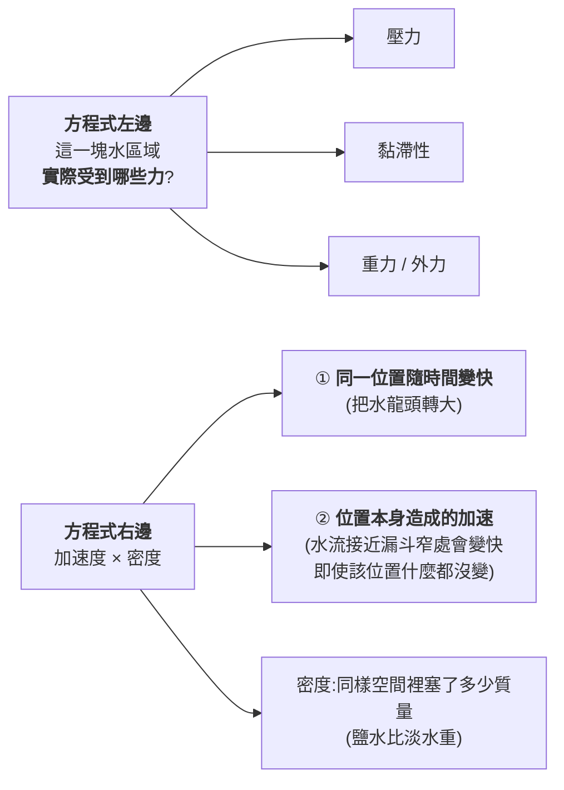
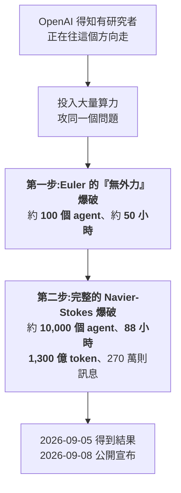
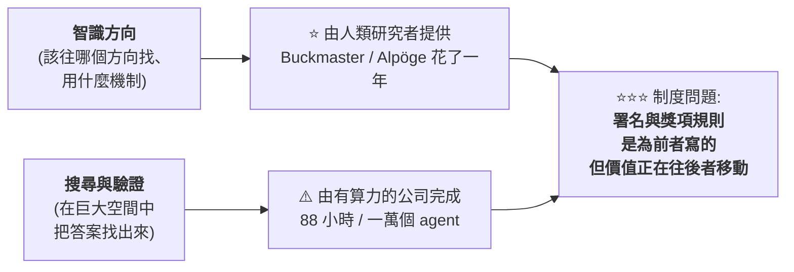

# 一萬個 agent 破解千禧年難題:Navier-Stokes、抄襲指控,與「誰該被署名」

> 整理自 YouTube 頻道 **Caleb Writes Code**〈[AI making breakthroughs explained..](https://www.youtube.com/watch?v=7DncQnIjZmA)〉(2026-09-12,約 10.9 分鐘,自動英文字幕)。
> ⚠️ **立場揭露:該片含 Incogni(個資移除服務)業配**,與內容主題無關,本文不轉述。
> ⭐ **關鍵事實已比對 OpenAI 官方公告、Scientific American、Fortune、Tom's Hardware 與 Clay 數學研究所的表態**,並補上影片未提的三點(見 §7)。

---

## 一句話總結

> **OpenAI 用約一萬個 agent、88 小時、1,300 億 token,宣稱找到 Navier-Stokes 方程「有限時間內爆破」的反例。**
>
> ⭐⭐⭐ **但作者真正關心的不是數學,是這句話:
> 當「科學發現的靈感來自聰明人,而實際的搜尋與驗證由有算力的公司完成」時 ——
> 誰該拿到署名?誰還有能力做科學發現?**

---

## 一、⭐ 先把數學講清楚:從 F = ma 到 Navier-Stokes

**牛頓第二定律 `F = ma` 對固體很好用,因為固體只有「一個質量、一個加速度」——
你隨便挑電梯的兩個部位,它們的加速度是一樣的。**

⚠️ **但流體完全不同:**

> **水不會當成單一物體移動 —— 不同部分的水可以**同時**往不同方向、以不同速度、甚至不同加速度移動。
> 而這些全都必須被寫進同一條方程式裡。**

**把牛頓第二定律套用到流體,就得到 Navier-Stokes 方程。用一條花園水管來理解它的各個部分:**

| 分量 | 水管裡的直覺 |
|---|---|
| **壓力(pressure)** | 靠近水龍頭那端把水推進管子,壓力**高於**另一端流出處(受大氣壓力影響) |
| **黏滯性(viscosity)** | ⭐ **貼近管壁的水被摩擦拖慢**,相對於管子中央的水 |
| **重力與其他外力** | 不同位置受到的力可能不同 |

> 📌 **這條方程式已經 181 年了,工程上一直很好用 —— 水在管中的流動、天氣預報系統、洋流模擬都靠它。**

---

## 二、⭐⭐ 那到底什麼還沒被證明?

> ⭐⭐⭐ **「Navier-Stokes 並不是有瑕疵 —— 它屬於『實務上工程可用,但數學上還沒被證明在所有條件下都成立』的那一類。」**

**正式的問題敘述:**

> **是否存在某種條件,讓這套數學在合理的情境下崩潰?還是它在 3D 空間中永遠產生平滑解?**

⭐ **注意「證明」在這裡有兩條路:**

| 路徑 | 內容 |
|---|---|
| **① 正面證明** | 證明 Navier-Stokes 在**所有情況下都平滑** |
| ⭐ **② 反例** | 找出一個**讓方程式爆破到奇異點(singularity)**的例子 |

📌 **OpenAI 走的是第二條。** 這是 Clay 數學研究所 2000 年列出的**千禧年大獎難題(Millennium Prize Problems)**之一,懸賞一百萬美元。

---

## 三、⭐⭐⭐ 事件經過:一場一年 vs 88 小時的對照

### 人類這邊:Buckmaster 與 Alpöge 的一年

| 項目 | 內容 |
|---|---|
| **人物** | **Tristan Buckmaster**(紐約大學 Courant 數學科學研究所教授)、**Levent Alpöge**(任職於 **Anthropic**) |
| **性質** | ⭐ Buckmaster 聲明這是「**純屬個人合作,沒有任何機構協議或雙方雇主的官方參與**」 |
| **策略** | ⭐⭐ **先在較簡單的 Euler 方程上找爆破機制** —— Euler 是**不考慮黏滯性**的版本,希望這個機制在之後加回黏滯性時仍然成立 |
| **成果(2026-08-15)** | 取得 **Boussinesq 與 Euler 的爆破結果,但是「有外力(forced)」的版本** |

> ⚠️ **「forced」這個字是關鍵:他們的證明依賴**外加一個力**來促成爆破 ——
> 走到這一步已經是突破,但還不是完整證明。**

### OpenAI 這邊:兩步走

> ⭐⭐ **OpenAI 做到了人類版本沒做到的事:在 Euler 上找到「不需要外加力」的爆破** —— 這確實更強。
> ⚠️ **但「用了相似的路徑」正是抄襲傳聞的起點。**

---

## 四、⚠️⚠️ 爭議:三件事讓慶祝變了調

### ① 時間點

**兩位研究者比 OpenAI 早一天發表相關成果。**
⚠️ **約在 2026-09-03,Alpöge 得知他們的進展已被傳到 OpenAI 那邊。**

### ② ⚠️⚠️ 署名條件

**據 Buckmaster 的說法,OpenAI 的 Sébastien Bubeck 給了他兩個選項:**

| 選項 | 內容 |
|---|---|
| **A** | 他和 Alpöge 發表部分解的論文,OpenAI **隔天**發表「我們的模型解決了完整問題」,並附註他們應得千禧年獎 |
| ⚠️⚠️ **B** | Buckmaster 自己發表並主張獎項 —— **但必須把 Alpöge 的名字拿掉**,因為 OpenAI 不喜歡他的 Anthropic 背景 |

### ③ ⚠️ 指控與否認

> **Buckmaster 稱 Bubeck 威脅他:「你為什麼要毀掉自己的職涯?」以及「如果你不想要我好好說話,那我也可以不好好說話。」**

⚠️ **另一項指控是 OpenAI 窺看了研究者在使用 Codex 時的訊息記錄,從中取得靈感。**
📌 **OpenAI 多次否認上述指控。**

> ⭐ **影片的定調很誠實:「這一切讓所有人處在一種奇怪的狀態 ——
> 我們到底該不該為這個顯然令人興奮的時刻慶祝?」**

---

## 五、⭐⭐⭐ 作者真正想問的問題(全片精華)

> **「把一切串起來的共同故事是:當科學發現**源自聰明人**,
> 但實際的**搜尋與驗證**是由**有算力的公司**用大規模算力與 agent 編排完成時,會發生什麼事?」**

**他列出三個具體的擔憂:**

| # | 問題 |
|---|---|
| **1** | ⭐⭐ **未來誰真的有能力做出科學發現?是那些跑得起一萬個 agent 的公司嗎?** |
| **2** | **這是否徹底顛倒了科學發現的權力結構?** |
| **3** | ⭐⭐⭐ **當前沿公司做了大部分工作、研究機構提供智識方向時,署名與認可該歸誰?** |

⭐ **一個很到位的觀察:**

> **「即使看千禧年大獎難題的規章,關於獎項授予的用語也沒有考慮到 AI 或 AI agent ——
> 它寫的是授予**個人或一群人**。」**

⚠️ **而且傳聞 OpenAI 已經在往下一題前進** —— 針對其他懸置數十年的千禧年難題,
**儘管 Navier-Stokes 這題可能還要幾年才會被機構接受或否決。**

---

## 六、⭐⭐ 這件事為什麼值得非數學家關心

📎 **本庫已經有兩篇筆記指向同一個張力,這篇補上了第三個角度:**

| 筆記 | 角度 |
|---|---|
| [[rsi-recursive-self-improvement-anthropic]] | **AI 研發 AI 的飛輪**(能力面) |
| [[anthropic-html-work-pages]] | **產出變便宜、理解變貴**(工作面) |
| ⭐ **本篇** | **算力落差如何改寫「誰能做研究」與「誰該被署名」**(制度面) |

---

## 七、⭐⭐⭐ 影片未提、但非常重要的三點(本文補充)

### ⚠️⚠️ 7.1 Clay 數學研究所並未認定這題已解

> **Clay 數學研究所**尚未接受 OpenAI 的證明。院長 **Martin Bridson** 表示評估將是
> **「刻意不趕時間的」(deliberately unhurried)與「絕對嚴謹的」**。
> ⭐⭐ **該研究所目前仍把 Navier-Stokes 列在「未解決」的千禧年難題清單上。**

📌 **所以「OpenAI 解決了千禧年難題」這個說法,目前是 OpenAI 的主張,不是機構認定。**

### ⭐⭐⭐ 7.2 陶哲軒的評論比爭議本身更值得記

**陶哲軒(Terence Tao)一方面稱 Buckmaster 與 Alpöge 的工作是「了不起的成就」,
另一方面提出一個更深的憂慮:**

> ⭐⭐⭐ **「出現了一種非常奇怪且前所未有的**脫鉤** —— 在『得到答案』與『得到理解』之間。」**

> 📎 **這句話的份量遠超這一題本身。** 它與 [[anthropic-html-work-pages]] 的「產出變便宜、理解變貴」
> 是同一個現象在**科學研究**這個場域的版本 —— **而且後果更嚴重:
> 工程上交付錯了可以回滾,數學上「有答案但沒人理解為什麼」會讓整個知識體系失去可累積性。**

⭐ **另一位數學家 Diego Córdoba 的一句玩笑則是另一種回應:**
> **「我不用 AI:我有 Luis。」**(指他的合作者 Luis Martínez-Zoroa —— ⭐ **而這兩條路徑的基礎技術都出自他**。)

### ⭐ 7.3 整體算力成本

| 項目 | 數字 |
|---|---|
| **Navier-Stokes 這一題** | **約 1,300 億 token、270 萬則訊息、88 小時、約 10,000 個 agent** |
| ⭐ **那一週的整體衝刺(涵蓋多個千禧年難題)** | **3,000 億輸出 token,算力成本約 2,250 萬美元** |

> 📌 **這個數字才是「算力落差」最具體的樣子:一週 2,250 萬美元的算力預算,
> 不是任何大學數學系能編出來的。**

---

## 應用案例

### 案例 1|⭐⭐⭐ 分辨「宣稱解決」與「被認定解決」

**看到「AI 解決了某個著名難題」時,依序問三個問題:**

| # | 問題 | 本案的答案 |
|---|---|---|
| **1** | **誰在宣稱?** | ⚠️ OpenAI 自己 |
| **2** | **權威機構怎麼說?** | ⚠️⚠️ **Clay 研究所仍列為未解決,評估「刻意不趕時間」** |
| **3** | **同行評審走到哪了?** | **可能還要數年** |

> ⭐ **這三問可以直接套用在任何「AI 做出重大突破」的新聞上。**

### 案例 2|⭐⭐ 從這件事讀「algorithmic vs compute」的分工變化

📌 **這個框架可以推廣到你自己的領域:凡是「方向判斷」與「大規模執行」可以被切開的工作,
都會出現同樣的歸屬爭議。** ⭐ **對個人的啟示是:把時間投在「方向判斷」那一側。**

### 案例 3|⚠️ 一個給工程師的直接警訊:你的 session 記錄是誰的?

> ⚠️⚠️ **本案的指控之一是「OpenAI 窺看了研究者在 Codex 中的訊息記錄」(OpenAI 否認)。**

📌 **不論該指控是否成立,它提出了一個每個人都該想的問題:**
**你把未發表的研究、未公開的商業構想丟進 AI coding agent 時,那份 context 的實際治理條件是什麼?**

⭐ **可操作的做法:**
- **查清楚你用的方案是否為零資料保留(ZDR)、是否有訓練排除條款**
- **真正敏感的構想,用本地模型或明確簽有 DPA 的企業方案**
- 📎 呼應 [[claude-cowork-overtime-pay-audit-prompt]] 案例裡那句「涉及公司程式碼與敏感資料時,先遵守所在組織的安全要求」

---

## 重點回顧(TL;DR)

1. **Navier-Stokes 是把牛頓第二定律套用到流體的結果** —— 難點在於流體各部分可以同時往不同方向、以不同加速度移動。
2. ⭐ **它不是有瑕疵,而是「工程上可用、數學上未證明在所有條件下成立」**;這是 Clay 研究所的千禧年難題之一。
3. **證明有兩條路:正面證明永遠平滑,或找出爆破到奇異點的反例。OpenAI 走第二條。**
4. **人類這邊**:Buckmaster(NYU)與 Alpöge(Anthropic)花約一年,2026-08-15 取得 **有外力(forced)** 的爆破結果。
5. **OpenAI 這邊**:先用約 100 個 agent、50 小時做出 **Euler 的無外力爆破**(比人類版本更強),再用**約 10,000 個 agent、88 小時、1,300 億 token** 做出完整的 Navier-Stokes 爆破。
6. ⚠️⚠️ **爭議三件事**:比對方晚一天但更完整;**要求拿掉 Alpöge 的名字**(因其 Anthropic 背景);以及**指控窺看 Codex 訊息記錄**(OpenAI 否認)。
7. ⭐⭐⭐ **作者的核心提問**:當靈感來自人、搜尋與驗證來自算力,**署名該歸誰?未來還有誰做得起科學發現?**
8. ⭐ **千禧年獎的規章寫的是授予「個人或一群人」—— 沒有為 AI 預留位置。**
9. ⚠️⚠️ **本文補正:Clay 研究所並未認定此題已解**,仍列為未解決,評估將「刻意不趕時間、絕對嚴謹」。
10. ⭐⭐⭐ **陶哲軒的評論最值得帶走:「在『得到答案』與『得到理解』之間,出現了前所未有的脫鉤。」**
11. ⭐ **算力落差的具體樣貌**:那一週的整體衝刺用掉 **3,000 億輸出 token、約 2,250 萬美元**。

---

## 核實狀態

### ✅ 已核實(對 OpenAI 官方、Scientific American、Fortune、Tom's Hardware、Cybernews 等比對)

| 影片說法 | 核實結果 |
|---|---|
| **OpenAI 宣稱找到 Navier-Stokes 有限時間爆破的反例** | **屬實**,2026-09-08 公開宣布,結果於 **09-05** 取得 |
| **約 10,000 個 agent、88 小時、1,300 億 token** | **屬實**;⭐ **官方另提 270 萬則訊息**(影片未提) |
| **先解 Euler 的「無外力(unforced)」版本,約 100 個 agent、約 50 小時** | **屬實** |
| **Buckmaster 與 Alpöge 合作約一年** | **屬實**;⭐ **Buckmaster 為 NYU Courant 數學教授、Alpöge 為 Anthropic 技術人員** |
| **他們的成果是「有外力(forced)」的版本** | **屬實**,2026-08-15 取得 **Boussinesq 與 Euler 的 forced blowup** |
| **兩位研究者比 OpenAI 早一天發表** | **屬實** |
| ⚠️ **OpenAI 提出「拿掉 Alpöge 名字」的條件** | **屬實**(依 Buckmaster 的公開聲明);⭐ **影片未指名的那位 OpenAI 研究者為 Sébastien Bubeck** |
| ⚠️ **「你為什麼要毀掉自己的職涯?」等威脅性說法** | **屬實**(同為 Buckmaster 聲明內容) |
| ⚠️ **指控 OpenAI 窺看 Codex 訊息記錄** | **屬實**(指控存在);📌 **OpenAI 多次否認** |
| **傳聞 OpenAI 已在攻其他千禧年難題** | **屬實** |
| **千禧年大獎難題由 Clay 研究所於 2000 年提出、共七題** | **屬實** |

### ⭐ 影片未提、本文補充(已核實)

| 項目 | 內容 |
|---|---|
| ⚠️⚠️ **Clay 研究所的立場** | **尚未接受該證明,仍列為未解決**;院長 Martin Bridson 稱評估將「刻意不趕時間、絕對嚴謹」 |
| ⭐⭐⭐ **陶哲軒的評論** | 稱人類方的工作為「了不起的成就」,並指出「**在得到答案與得到理解之間,出現了非常奇怪且前所未有的脫鉤**」 |
| ⭐ **Diego Córdoba 的回應** | 「我不用 AI:我有 Luis」——指其合作者 **Luis Martínez-Zoroa**,⭐ **兩條路徑的基礎技術均出自他** |
| ⭐ **整體算力成本** | 該週衝刺涵蓋多個千禧年難題,共 **3,000 億輸出 token、約 2,250 萬美元** |

### ⚠️ 未能獨立查證

- **方程式各分量的教學比喻**(花園水管、漏斗)—— **屬作者的教學設計,非事實主張。**
- **「Navier-Stokes 方程已有 181 年」** —— 量級合理(Navier 1822 / Stokes 1845),**確切起算點依定義而異。**
- ⚠️ **雙方各執一詞的細節**(誰先知道誰的進展、訊息如何傳到 OpenAI)—— **屬爭議中的當事人陳述,本文並陳雙方說法,不做判斷。**

> ⚠️ **本文為對一支公開影片與相關報導的整理。抄襲指控目前為當事人單方陳述且遭 OpenAI 否認,
> 尚無第三方調查結論;數學結果亦尚未經同行評審與 Clay 研究所認定。請以最新公開資訊為準。**

---

## 來源

- [AI making breakthroughs explained.. — Caleb Writes Code](https://www.youtube.com/watch?v=7DncQnIjZmA)(2026-09-12,約 10.9 分鐘,自動英文字幕。⚠️ 含 Incogni 業配,與主題無關)
- 核實用一手與權威來源:
  - ⭐⭐ [On the Navier–Stokes Millennium Prize Problem — OpenAI 官方](https://openai.com/index/navier-stokes-solution/)
  - ⭐⭐ [Clay Institute Won't Call Navier-Stokes Solved by OpenAI — Implicator.ai](https://www.implicator.ai/clay-institute-navier-stokes-openai-proof-claim/)(**§7.1 與陶哲軒評論的依據**)
  - [OpenAI claims blockbuster math breakthrough amid swirl of controversy — Scientific American](https://www.scientificamerican.com/article/openai-claims-blockbuster-math-breakthrough-amid-swirl-of-controversy/)
  - [AI may have just solved a million-dollar math problem. The field will never be the same — Scientific American](https://www.scientificamerican.com/article/ai-may-have-just-solved-a-million-dollar-math-problem-the-field-will-never-be-the-same/)
  - [OpenAI says it cracked Navier-Stokes, one of math's grand challenges — Fortune](https://fortune.com/2026/09/08/openai-says-it-cracked-navier-stokes-math-grand-challenge-buckmaster-accusation-cheating-intimidation-tao-lament/)
  - [OpenAI's breakthrough solution … overshadowed by plagiarism controversy — Tom's Hardware](https://www.tomshardware.com/tech-industry/artificial-intelligence/openais-breakthrough-solution-for-the-elusive-navier-stokes-problem-overshadowed-by-plagiarism-controversy-researcher-says-openai-scraped-codex-session-and-issued-career-threats)
  - [OpenAI faces theft accusation over Navier-Stokes claim — Cybernews](https://cybernews.com/ai-news/openai-navier-stokes-theft-accusations/)
  - [10,000 OpenAI agents crack 90-year-old Navier-Stokes mystery in just 88 hours — Interesting Engineering](https://interestingengineering.com/ai-robotics/openai-navier-stokes-mystery-solved)
- 延伸:本庫 [[rsi-recursive-self-improvement-anthropic]]、[[anthropic-html-work-pages]]、[[gpt-6-astra-token-efficiency-and-harness]]、[[claude-cowork-overtime-pay-audit-prompt]]。
