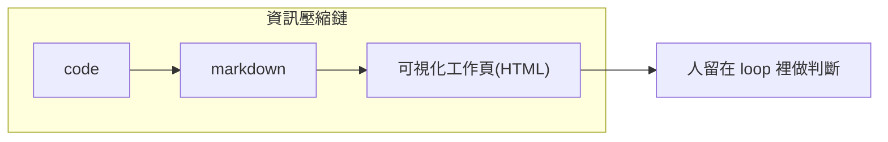
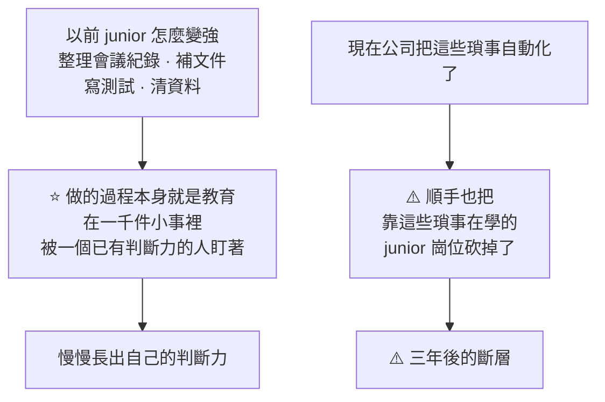

# 為什麼 Anthropic 工程師棄 Markdown 改用 HTML:當「理解」變成真正的瓶頸

**主題分類:** AI / 生產力與工作方法
**來源影片:**
1. YouTube〈Anthropic 工程師為什麼拋棄 Markdown 改用 HTML 跟 AI 工作?〉(Gary Chen,2026-05-21,約 13 分鐘;依繁中逐字稿整理)
2. YouTube〈开三个AI同时跑,结果自己累成狗?真正的瓶颈不是AI不够快〉(YAHA學堂,2026-09-06,約 14.4 分鐘,**無字幕、Whisper 轉錄**)—— 見 **§6**,補上 workload creep 的三種形式、「逼自己讀完每行從來不是答案」,以及 junior/senior 斷層的推論
**整理日期:** 2026-05-30(2026-09-07 增補 §6)

---

## 1. 哈佛研究:AI 讓人「更累」了

HBR(2026/2)追蹤一家 200 人科技公司 8 個月、40+ 場訪談:**AI 沒省事,反而工作量變多、步調變快、空檔被塞滿** → 壓力堆積、認知疲勞、品質下滑、決策變差 → burnout 與離職。

> 像《Four Thousand Weeks》的「現代版薛西弗斯」:不是推石頭,是清 email inbox,剛清空就「叮——你有新訊息」。**「我們用來掌控一切的科技,最後總會把那個『一切』本身變得更大。」** 你省下的時間不會變成休息,會變成下一個任務。

---

## 2. 真正的瓶頸從「產出」變成「理解」

AI 把 **產出成本壓到趨近於零** → 人人能更快做更多 → 能力的證明不再是「做不做得出來」,而是「**你有沒有真的搞懂你做出來的東西**」。產出變便宜,**理解變貴**。

研究指出最累的是 **不斷切換注意力、不斷檢查 AI 產出、開著的任務越來越多**:過去稀缺的是「誰來做」,現在稀缺的是「**誰來看、誰來判斷、誰來確認下一步**」。而且這種 **審核成本無法被量化**(沒多開會、沒多交報表,但腦子一直在切換比對),上級看不到、系統不記錄,於是「表面更有效率,實際累成狗」。

> **對 junior 特別殘忍:** 以前靠整理會議記錄、補文件、寫測試、清資料這些「瑣事」被有判斷力的人盯著、長出判斷力;現在公司把瑣事自動化、順手砍掉 junior 職缺——「每個今年被砍的 junior,都是本來三年後會變成 senior 的人,只是他不會出現了」。但 **學徒制的本質是「逼自己重複理解」,這個機制你自己就建得起來:逼自己搞懂每個你產出的東西,量不重要、深度才重要。**

---

## 3. 解法是「格式」:Markdown 的能力邊界

你跟 AI 大多用 **Markdown** 溝通(純文字、打得開、改得動、可 grep、可 git diff)——Claude Code、OpenClaw 的記憶系統底層就是一堆 markdown(對照 [[markdown-agent-memory]])。**markdown 會贏,贏在它一直站在人這一端。**

但 AI 越強,要被人讀懂的東西越多越複雜,**markdown 最先撐不住**:Anthropic 工程師 Thariq 的文〈The Unreasonable Effectiveness of HTML〉說「超過 100 行的 markdown 自己就讀不下去」。markdown 放不了圖、不能並排對比兩個方案、不能讓你動手調參數。

> **解法:用 HTML 當輸出格式**(瀏覽器打開、能放圖/表格/互動)。不是要你學前端,是讓 AI 把產出直接做成「一頁打開就能用」的東西。**HTML 不是更高級的 markdown,而是另一種工作介面**:markdown 適合承載文字,HTML 適合承載 **狀態、關係、對比、互動**。

---

## 4. 應用案例:HTML 工作頁的三種用法(把高耗腦的審核變成一眼能懂)

1. **拿來比較:** onboarding 畫面不確定怎麼呈現 → 叫 AI 一次生 6 個版本(版面/交互/資訊密度不同)排進同一頁、各標清楚取捨,**並排掃一眼就能比**。(markdown 只能逐個文字描述,你得在腦中把畫面拼回來——那個拼的動作就是審核成本。)
2. **拿來理解:** 看不懂公司的 rate limiter → 叫 AI 讀完 code 產一頁 explainer + 流程圖 + 「有哪些坑」區塊,甚至出 10 題選擇題確認你抓到重點。**同樣資訊量,更快理解並決策(低耗能審核)。**
3. **拿來決策:** 30 張 Jira 單要重排優先序 → 叫 AI 做一個可 **拖拉卡片** 的網頁、先幫你排好,你像玩遊戲一樣拖拽分欄,按一個鈕就把結果 **轉成一段 prompt 貼回 Claude** 繼續執行。

> 三個用法的共同點:**不生成更多東西塞給你看,而是把複雜資訊變成「能看、能比較、能下決定」的介面。** 不是用 HTML 全面取代 Markdown——要文字整理用 Markdown,要快速看懂狀態/比較方案/做決定用 HTML 工作頁。

**「不用讀完每一行」早就是常態:** CTO 看測試有沒有過、PM 直接拿產品來用、CEO 看幾個關鍵數字——都靠「一個對的介面」驗證真正重要的那幾件事。你跟 AI 的關係一樣:**問題不是逼自己讀完 AI 吐的每個字,而是有沒有一個夠好的介面,用最低力氣驗證該驗證的東西。**

---

## 5. AI Builder 怎麼脫穎而出:proof 要跟著 work 一起走

AI 時代產出太便宜,履歷/職稱/作品集越來越不能證明你真的懂(AI 能生出有模有樣的 prototype,但你答不出「為什麼選這架構、壓力測試會怎樣、自己改一段改不動」)。真正稀缺的是 **把理解跟作品綁在一起**,能清楚回答四個問題:

1. 你做的東西 **是什麼**?
2. 你 **為什麼** 選這個做法?
3. 這東西在 **什麼情況下會壞**?
4. 你在這次實作中 **學到了什麼**?

> **能力證明:不要只追求更多產出,而是更深的理解;不要讓作品跟解釋分開,讓解釋本身變成產出的一部分;不要只靠靜態標籤(履歷/頭銜),用一個個「可驗證的完成紀錄」公開展示你怎麼判斷、取捨、理解。** 呼應 [[karpathy-software-3-0]]「你可以外包思考,不能外包理解」——當 AI 把世界壓縮得越來越快,你的價值是「**我能做判斷,而且我能證明我理解自己交付了什麼**」。

---

## 6. ⭐⭐ 同一份研究的另外三塊(2026-09-07 增補,來源:YAHA學堂)

§1–§5 已經講完「產出變便宜、理解變貴」與 HTML 這個解法。
這一節補的是**同一份哈佛研究裡沒被前一支影片展開的部分**,以及一個更遠的推論。

### 6.1 workload creep:沒有人叫你多做,你自己就做了

研究抓到的關鍵詞是 **workload creep(工作量偷偷往上爬)**。

📌 **核實:研究確認了三種具體的強化形式**,而影片的描述與它們一一對得上:

| 研究命名的形式 | 影片的描述 |
|---|---|
| **Task expansion**(任務擴張) | **產品經理開始寫程式碼、研究員開始接工程的活** —— 因為 AI 讓這些事**看起來好像可以試一下** |
| **Blurred boundaries**(界線模糊) | **本來是休息的片刻被塞進一點工作** —— 「反正就一句話嘛、反正它可以先跑、反正等下回來看就好」 |
| **More multitasking**(更多同時進行) | 同時管著好幾條活著的線程 |

> ⭐⭐ 研究的機制解釋一句話講完:
> **「工作會擴張到填滿可用的產能,而 AI 大幅提高了那個產能。」**
> 省下來的時間**不會被再投資成「更少的任務」,而是被投資成「更多的任務、更大的範圍、更快的期待」** ——
> **而且幾乎立刻發生,幾乎從來沒有人明確決定過要這樣。**

⭐ 影片引了 Oliver Burkeman《Four Thousand Weeks》的**效率陷阱**當類比,畫面很準:

> **你剛把收件匣清空、往椅背一靠、深呼吸,覺得終於可以休息了 —— 下一秒提示音。**
> **你處理郵件的速度越快,寄給你的郵件就越多。**
>
> **AI 現在對你幹的就是這件事,只是快了十倍。**

### 6.2 ⭐ 為什麼「理解成本」沒人感覺得到:因為它不留痕跡

這解釋了 §2 那個瓶頸為什麼這麼難被管理層看見:

| 這些會被記錄 | ⚠️ 這件事不會 |
|---|---|
| 你加班 → 打卡系統看得到 | **你花一整個下午讀 AI 寫的東西、判斷哪裡能用哪裡要重寫** |
| 你多開一場會 → 日曆上有 | **你沒多開一場會,也沒多交一份報表** |
| 你多交一份報表 → 主管數得出來 | **但你的腦子一直在切換、回想、比對、判斷** |

> ⭐⭐ **「所以過去稀缺的是『誰來做』,現在稀缺的是『誰來看、誰來判、誰來決定下一步』。」**
>
> ⚠️ 而最耗神的是最後那個判斷:**哪一段是 AI 自己亂補的,哪一段真的可以用** ——
> **這個判斷沒有工具能幫你做,只能你自己讀。**

⚠️ 多工的隱藏成本也在這裡:AI 在跑的時候你不想乾等,就去開第二件、第三件;
**等你回到第一件,得重新讀、重新回憶剛剛發生什麼、哪些決定已經做過、哪些風險還沒看。**

### 6.3 ⭐⭐⭐ 「逼自己讀完每一行」從來就不是答案

這一段是本節最實用的思路轉向。很多人聽到「理解很重要」的反應是「那我就每一行都讀」——
**但這件事本來就不成立,AI 出現之前也做不到。**

> **管一個你不完全理解的東西,人類早就在幹了:**

| 角色 | 他不讀什麼 | 他靠什麼 |
|---|---|---|
| **CTO** | 不讀每個工程師的每一行程式碼 | **看測試有沒有過** |
| **產品經理** | 不看後端怎麼實作 | **直接拿產品來用,看它有沒有解決問題** |
| **CEO** | 不對每一筆帳 | **看那幾個關鍵數字對不對** |

> ⭐⭐ **共同點:靠一個對的「介面」,去驗證真正重要的那幾件事 —— 細節根本沒讀完。**
>
> **所以真正的問題只有一個:你有沒有一個夠好的介面,讓你用最低的力氣,驗到真正該驗的東西?**

📎 這正是 §3–§4 那個 HTML 解法的**理論依據** —— 它不是「換個格式比較潮」,
**是在做「一個夠好的介面」這件事。**

⭐ 影片作者的自述很誠實,也很有代表性:

> 「一開始用 AI 寫程式,我還會掙扎要不要一行一行讀它寫的程式碼;
> 後來我只讀它生出來的 Markdown 文件;**再後來,連那份 Markdown 我都會掙扎要不要讀,因為真的太長了。**
> **我的注意力沒有跟著 AI 的產能一起變多。**」
>
> ⭐ **「我缺的從來就不是 output,我缺的是更低成本的理解方式。」**

⚠️ 他也明確表態**不主張用 HTML 全面取代 Markdown**:

| 場景 | 用哪個 |
|---|---|
| **文字整理** | **Markdown** |
| **要回到一個任務、快速看懂狀態、比較方案做決定** | **HTML 工作頁** |

> ⭐ **「HTML 不是比較高級的 Markdown,它是另一種工作介面。」**

### 6.4 ⚠️⚠️ 一個更遠的推論:被砍掉的 junior,是三年後不會出現的 senior

這是影片自己標為最重要的一段,而且它**不在哈佛那份研究裡**,是作者的推論。

> ⭐ **「瑣事可以自動化,但那個『被盯著做一千件小事』的機制,得有人替代掉 ——
> 不然你的團隊會出現一個斷層。」**

⚠️⚠️ **關於那組倦怠數據,影片的處理值得學:**

| 層級 | 倦怠感最重的比例 |
|---|---|
| **Associate** | **62%** |
| **Entry level** | **61%** |
| **C-suite** | **38%** |

> ⭐ 講者**主動說明**:「這組數字出自**另一份職場倦怠調查**,不是剛才那篇哈佛研究裡的 ——
> 那篇是質性研究、沒有百分比。**這兩個來源我分開講,你要引用的時候也建議分開。**」
>
> ⚠️ **本文採用同樣的處理:兩個來源分開,且該倦怠調查的具體出處本文未能核實,請自行回查。**

### 6.5 ⭐⭐ 應用案例:四個問題與三種人的行動

#### 交付前的四問(可以直接當自我檢查表)

> **① 你做的這個東西是什麼?**
> **② 你為什麼選這個做法,不選另一個?**
> **③ 這個東西在什麼情況下會壞掉?**
> **④ 你在這次實作裡學到了什麼?**

⭐ **答得完就是真的懂了;答不完的部分,那就是你的補課清單。**

而這四問正好是 AI 生不出來的東西:

> **「為什麼這樣設計、改了哪裡會垮、你刻意沒做什麼、以及背後的原因 —— 這種東西 AI 生不出來。
> 你一旦不懂,別人多問兩句就會露餡。」**

⭐ 所謂**品味**也是從這裡長出來的:
**「它沒什麼神祕的,就是你把夠多東西理解得夠深,深到開始認得出哪些有效、哪些會壞、哪些重要。」**

#### 三種人,三種下一步

| 你是誰 | 你的瓶頸 | 今天就能做的事 |
|---|---|---|
| **團隊裡在審 AI 產出的那個人** | ⚠️ **跟 AI 快不快沒關係,是你的介面太爛** | 下次要 AI 給你方案比較或現狀說明時,**直接叫它輸出成一頁 HTML,不要再接受 300 行的 Markdown**。成本是一句話 |
| **剛入行 / 擔心被取代的人** | ⚠️ **重點完全不在工具** | ⭐ **把專案數量砍掉,選一個做深**,然後用上面四問把它講清楚 —— **因為你要競爭的東西,已經不是「你做不做得出來」了** |
| **在帶團隊、決定要不要招 junior 的人** | ⚠️ **你砍掉的不是成本,是你三年後的 senior** | 瑣事照樣自動化,**但要替代掉那個「被盯著做一千件小事」的機制** |

> ⭐⭐ 收束的那句話值得記:
> **「以前你的價值是『我可以很快產出東西』,現在這句話已經不值錢了。
> 真正值錢的是『我能做判斷,而且我能證明我理解自己交付了什麼』。」**
>
> ⭐ 落到實作:**不要只交一個結果,要讓「解釋」本身變成產出的一部分。**

### 6.6 核實狀態

#### ✅ 已核實

| 說法 | 核實結果 |
|---|---|
| HBR 文章〈AI Doesn't Reduce Work—It Intensifies It〉,**2026 年 2 月** | **屬實** |
| 作者為 **Aruna Ranganathan(UC Berkeley Haas)與 Xingqi Maggie Ye** | **屬實** |
| **八個月的民族誌研究、約 200 人的美國科技公司** | **屬實** |
| 三種強化形式(任務擴張 / 界線模糊 / 更多多工) | **屬實**,與影片描述一一對應 |
| **workload creep** 的機制:工作擴張到填滿可用產能 | **屬實** |
| Thariq Shihipar 的 HTML 文章為 Anthropic 官方部落格內容 | **屬實**(見 §3–§4 原有來源) |
| Oliver Burkeman《Four Thousand Weeks》的效率陷阱 | **屬實**,為該書知名論點 |

#### ⚠️ 未能核實 / 屬作者推論

- ⚠️ **倦怠數據 62% / 61% / 38%** —— **出自另一份未指名的職場倦怠調查**,本文未能查到出處。
  ⭐ 但**講者自己主動把它和哈佛研究切開講**,這個處理是負責任的。
- ⚠️ **「被砍掉的 junior 是三年後不會出現的 senior」** —— **作者的推論,不是研究結論。**
- ⚠️ **「我看過的情況,通常一個都答不出來」**(指用 AI 寫出 app 的人答不出三個問題)—— **個人觀察,無樣本。**
- ⚠️ 該片**無字幕**,逐字稿以 CPU 版 faster-whisper 轉錄取得,**非官方字幕**。
  轉錄中的專有名詞已校正:「clot code」為 **Claude Code**、「U.C. Barkley」為 **UC Berkeley**、
  「Oliver Berkman」為 **Oliver Burkeman**、「Therik Shehipar」為 **Thariq Shihipar**、
  「workload creep」原文即英文、「所士」為**瑣事**、「創斷 / 判段」為**判斷**。

---

## 來源

- [YouTube:Anthropic 工程師為什麼拋棄 Markdown 改用 HTML 跟 AI 工作?(Gary Chen)](https://youtu.be/BhHMGRcbPkQ)(§1–§5)
- ⭐ [开三个AI同时跑,结果自己累成狗?真正的瓶颈不是AI不够快 — YAHA學堂](https://www.youtube.com/watch?v=X2A6fANij9Q)(2026-09-06,約 14.4 分鐘;§6 來源)
- 一手來源與核實:
  - ⭐⭐ [AI Doesn't Reduce Work—It Intensifies It — Harvard Business Review](https://hbr.org/2026/02/ai-doesnt-reduce-work-it-intensifies-it)(2026-02,Aruna Ranganathan 與 Xingqi Maggie Ye;**§6 的一手來源**)
  - [AI promised to free up workers' time. UC Berkeley Haas researchers found the opposite — Haas Newsroom](https://newsroom.haas.berkeley.edu/ai-promised-to-free-up-workers-time-uc-berkeley-haas-researchers-found-the-opposite/)(2026-02-18,三種強化形式的核實來源)
  - [Does AI Actually Free Up Workers' Time? — UC Berkeley Research](https://vcresearch.berkeley.edu/news/does-ai-actually-free-workers-time)
  - [Using Claude Code: The unreasonable effectiveness of HTML — Thariq Shihipar, Anthropic](https://claude.com/blog/using-claude-code-the-unreasonable-effectiveness-of-html)
  - Oliver Burkeman《Four Thousand Weeks: Time Management for Mortals》(§6.1 的效率陷阱)

> ⚠️ **§6 那支影片無字幕,逐字稿以 CPU 版 faster-whisper(small / int8 / zh)轉錄取得,非官方字幕**,可能有聽寫誤差;
> 專有名詞對照已列於 §6.6。**倦怠數據 62/61/38 出自另一份未指名的調查,本文未能核實,引用請與哈佛研究分開。**
