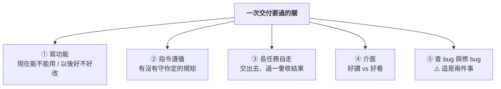
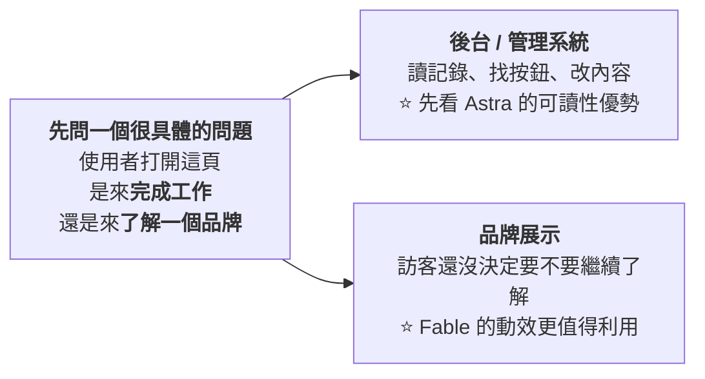
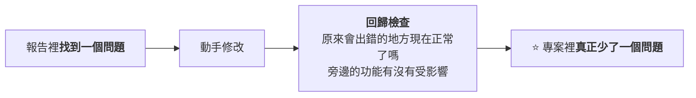

# 找 Bug 第一名的模型,修 Bug 卻墊底:GPT-6 Astra 與 Claude Fable 5.1 的分工式選型

> 整理自 YouTube 頻道 **YAHA學堂**〈[实测GPT-6与Claude Fable:找Bug第一名的AI,修Bug居然垫底?](https://www.youtube.com/watch?v=mAoXktiOhWY)〉(2026-09-19,約 14.6 分鐘)。
> **該片無字幕,逐字稿以 CPU faster-whisper 轉錄取得、非官方字幕**,可能有少量聽寫誤差(專有名詞對照見文末)。
>
> ⚠️⚠️ **立場揭露:YAHA學堂是販售 AI 課程的頻道**,本片為其自行設計的評測。
> ⚠️⚠️⚠️ **這是一份單方測試,且影片自己列出了四項限制**(客戶專案程式碼未公開、兩邊提示詞並非逐字相同、評分由 GPT-5.6 輔助、成本為估算)——
> **見 §八。本文把它當成「一份可參考的試用起點」,不是基準測試結果。**

---

## 一句話總結

> ⭐⭐⭐ **「同樣是處理 bug,**找問題**和**修問題**,領先的並不是同一個。」**
>
> ⭐⭐⭐ **所以選模型不能只看一個總分。真正有用的問題是:
> **這次交付,你最不能接受哪一步出錯?****

---

## 一、⭐⭐⭐ 開場那個反直覺的結果

**一組程式碼審查測試裡,預先放進 **4 個已知 bug**:**

| 模型 | 找到 | 額外發現 |
|---|---|---|
| ⚠️ **GPT-6 Astra** | **只找到 2 個**,⚠️⚠️ **卻回報「審查完成」** | — |
| ⭐ **Claude Fable 5.1** | **4 個全找齊** | ⭐ **另外發現 5 個、且經後續確認的問題** |

> ⚠️ **「四個已知 bug 漏了兩個,卻說審查完成 —— 這樣的結果你敢直接上線嗎?」**

**你可能已經想選 Fable 了。但換到另一個更大的專案,讓它們**動手修**:**

| 模型 | **9 個已確認問題中修好** |
|---|---|
| ⭐ **GPT-6 Astra** | **5 個** |
| **Claude Fable 5.1** | **4 個** |

> ⭐⭐⭐ **⚠️ 注意:這是**兩個不同的任務、不同的專案**,不是同一組題目的兩種算法。
> **「它們回答的是兩個問題,不能拿其中一個直接代替另一個。」**

---

## 二、⭐⭐ 拆開來看:五個維度各自誰領先

| 維度 | 領先 | 數字 |
|---|---|---|
| **程式碼組織(以後好不好改)** | ⭐ **Fable** | **90 : 78** |
| **交付後功能可直接用** | **Astra** | **87 : 85**(⚠️ **兩分差距不足以下結論**) |
| ⭐⭐ **指令遵循** | ⭐ **Astra** | **見 §三** |
| **長任務整體表現** | **Astra** | **見 §四** |
| **版面文字層級與可讀性** | **Astra** | **見 §五** |
| **動效與互動豐富度** | **Fable** | **見 §五** |
| **找 bug(4 個已知)** | ⭐⭐ **Fable** | **4+5 : 2** |
| **修 bug(9 個已確認)** | ⭐⭐ **Astra** | **5 : 4** |
| **估算費用** | ⭐ **Astra** | **$27.69 : $49.18(低約 44%)** |

> ⚠️⚠️ **「這幾項都是評估分數,**不能換算成成功率**。」**

---

## 三、⭐⭐⭐ 一個容易被忽略、但決定「交付能不能被接受」的維度:指令遵循

**專案指定裡有兩條明確要求,測試中 Fable 都沒遵守:**

| 要求 | ⚠️ Fable 的行為 |
|---|---|
| **不要加共同作者署名** | ⚠️ **還是加了** |
| **使用指定的檔案編輯工具** | ⚠️ **卻用命令建立了兩個檔案** |

> ⭐⭐⭐ **「如果你要接入團隊專案,**程式碼能執行只是一部分要求** ——
> **哪些檔案能改、哪些約定不能碰,也關係到交付能不能被接受。**」**

> ⚠️ **本文未能獨立驗證這兩次違規**(客戶專案程式碼未公開)。
> ⭐ 但這個**維度**本身值得記下來:大多數模型比較只看「做出來了沒」,不看「有沒有照規矩做」。

📎 **本庫 [[claude-md-cut-82-percent-and-maintain-it]] 講的正是「規矩要寫在哪、寫多少才會被遵守」 ——
⭐ 兩篇合起來看:**寫得對是一回事,被遵守是另一回事,而後者要單獨測。****

---

## 四、⭐⭐ 長任務:省下的 12 分鐘,可能不是省下的

**同一個應用開發目標,兩邊各自按自己的指南調整提示:**

| 模型 | 耗時 | 結果 |
|---|---|---|
| **Astra** | **約 32 分鐘** | ⚠️ **做的側欄滾不到退出按鈕,得縮小頁面才點得到** |
| **Fable** | **約 44 分鐘** | ⚠️ **功能有深度,但排了很幾頁、雖適配了小螢幕,用起來仍不舒服** |

> ⭐ **兩邊都持續推進、都做了檢查。Astra 少用約 12 分鐘 ——
> ⚠️⚠️ **但到了實際使用環節,兩邊都露出了問題。****

### ⭐⭐⭐ 影片給了一句非常實用的追問話術

> **「你到底查了什麼?**把實際執行的檢查列出來,沒驗證的地方也留下來。**」**
>
> ⭐⭐⭐ **「這樣我接手時才知道還要補查哪裡。」**

**以「聯繫記錄保存成功」為例,模型可能只檢查了正常輸入:**

| ⚠️ 沒被檢查的場景 |
|---|
| **內容為空呢?** |
| **連續點兩次保存呢?** |
| **失敗以後,使用者剛寫的文字會不會丟?** |

> ⭐⭐ **「這些場景你不列出來,就很容易被正常流程掩蓋。」**

---

## 五、⭐⭐ 介面:先問「使用者是來幹嘛的」

> ⚠️ **「你給模型一句『做得高級一點』,它可能加大標題、加漸層,再讓幾個元素動起來 ——
> **你得到的頁面更熱鬧了,但使用者要點哪裡,未必更清楚。**」**

### ⚠️ 但這條建議有邊界

> ⭐ **「後台也需要好觀感,展示頁也必須好讀。
> **你是在決定這一輪先關注什麼,不能把另一個要求刪掉。**」**

### ⭐⭐ 動效的判準只有一條

| ✅ 有作用 | ⚠️ 沒作用 |
|---|---|
| **按下按鈕後有反饋,使用者知道操作被接收了** | **元素一直晃,卻不提供新資訊 → 分散注意力** |

### ⚠️⚠️ 一個容易忽略的干擾因素

> **部分設計任務裡,**Astra 透過 Codex 用了圖像生成工具,Fable 則用程式碼繪圖**。**
>
> ⭐⭐⭐ **「所以你看到的是**模型連同工具一起交出的結果** —— 換了入口、素材,產出可能會變。」**
> **你自己比較時,要把參考圖、品牌文字與允許使用的素材寫清楚,否則一個拿到圖片、另一個只能從零畫。**

📎 **這正是本庫 [[gpt-6-astra-token-efficiency-and-harness]] 的核心論點:**比的往往不是模型,是外殼。****

---

## 六、⭐⭐⭐ 回到開頭:為什麼「找得更全」不等於「修得更好」

### 6.1 ⭐ 還有一個沒被宣傳的結果:誤報

> **測試裡還加入了 **3 個看起來可疑、其實正確**的地方 ——
> ⭐⭐ **兩邊都沒有誤報。這一點也得看。****
>
> ⚠️ **「報告寫得長,並不自動代表審得好。**把正確程式碼當成 bug,會讓你多花時間,甚至改出新問題。**」**

### 6.2 ⭐⭐⭐ 好的審查報告長什麼樣

| ⚠️ 沒用的報告 | ⭐ 有用的報告 |
|---|---|
| **「可能有資料問題」** → 你還得重新調查一遍 | **什麼操作會觸發、哪個客戶受影響、資料為什麼會混到一起** |

> ⭐⭐⭐ **「我會先讓模型**停在審查這一步**:把問題講清楚再改 ——
> **什麼操作會觸發、實際行為哪裡不對、程式碼在什麼位置、我又該怎麼驗證。**」**
>
> ⭐ **「還沒證實的猜測可以留著,但要**單列** —— 你一眼就能區分哪些值得馬上修、哪些需要進一步調查。」**

📌 **⚠️ 影片自己有標註:「聯繫記錄」是**用來解釋的假設例子,不屬於前面的測試結果** —— 這個區分做得很好,本文照錄。**

### 6.3 ⭐⭐⭐ 「找到」與「少了一個問題」之間隔著回歸檢查

> ⭐⭐⭐ **「所以查 bug 時至少要分清**兩個結果**:
> **① 找到了多少有依據的問題;② 修完以後有多少通過驗證。**」**

---

## 七、💰 成本:兩種花錢方式別混著算

| 模型 | **這組任務的估算費用** |
|---|---|
| **Claude Fable 5.1** | **$49.18** |
| ⭐ **GPT-6 Astra** | **$27.69(低約 44%)** |

> ⚠️⚠️ **這組測試是用**訂閱**執行,再把消耗的 token **按 API 價格折算**成費用 ——
> **所以這裡比較的是估算費用,訂閱帳單要另看。**

| 你的付費方式 | 要看什麼 |
|---|---|
| **訂閱** | **可用額度 + 自己實際完成了多少工作** |
| **API** | **真實用量記錄** |

### ⭐⭐⭐ 但費用之外,還有你自己的時間

**影片給的假設算例(⚠️ **兩組時間都是假設,用來演示邏輯**):**

| 方案 | 生成 | 你的檢查與返工 | **總計** |
|---|---|---|---|
| **甲** | **20 分鐘** | **40 分鐘** | **60 分鐘** |
| ⭐ **乙** | **30 分鐘** | **10 分鐘** | ⭐ **40 分鐘** |

> ⭐⭐⭐ **「只看生成速度,甲快了 10 分鐘;
> **看整個交付過程,乙反而少用了 20 分鐘。**」**

### ⭐⭐ 換更貴的模型之前,先問它減少了什麼

| ⭐ 可以當證據的 | ⚠️ 不能當證據的 |
|---|---|
| **少追問了兩輪** | **「這次感覺更聰明」** |
| **少改了一次介面** | |
| **找到一個原來漏掉的問題** | |

---

## 八、⚠️⚠️ 這份測試的四項限制(影片自己列出,本文照錄並加重)

| # | 限制 |
|---|---|
| **①** | ⚠️ **客戶專案程式碼未公開** —— **外部無法複現** |
| **②** | ⚠️⚠️ **兩邊提示詞並非逐字相同**(各自按自家指南調整)—— **嚴格說這不是受控對照** |
| **③** | ⚠️ **評分由 GPT-5.6 輔助完成**(評分時不告知結果對應哪個模型,並經人工比較)—— ⭐ **盲評設計是加分,但「用模型評模型」本身有其偏誤** |
| **④** | ⚠️ **費用是按 API 價格折算的估算** |

> ⭐⭐⭐ **影片自己下的結論很誠實,本文完全同意:**
> **「這些結果可以作為**試用起點**,放到自己的專案裡還要驗證。」**
>
> ⚠️⚠️ **再加一條本文的提醒:各項都是**單次執行**,沒有重複試驗、沒有信賴區間。
> **87 : 85、5 : 4 這種差距,在單次測試裡基本等於平手。****

---

## 應用案例:把它變成你自己的一次小測試

### 案例 1|⭐⭐⭐ 不用每個任務都跑兩遍,挑一個常遇到的小功能

> **「挑一個經常會遇到的小功能,**限定範圍**,一次就有收穫。」**

| 步驟 | 做法 |
|---|---|
| ⭐ **①** | **先寫兩條驗收條件**(例:「聯繫記錄能保存」「切換客戶不會混資料」)——⚠️ **一定要寫在看結果之前** |
| **②** | **用同一份專案、從相同的起點開始** |
| ⚠️ **③** | **別把第一個模型已經改好的專案,直接交給第二個再比完成時間** |
| **④** | **記錄模型版本與可用工具** —— ⭐ **尤其一邊能看瀏覽器畫面、另一邊看不到時,結果裡就包含了這個差異** |
| **⑤** | **時間與費用上限提前定好**,到上限還沒完成就記為未完成 |
| ⭐ **⑥** | **你中途補過什麼提示,一併留下來** —— **下次就能看出哪邊需要你操心更多** |

> ⚠️⚠️⚠️ **第 ① 步的「寫在看結果之前」是整段最重要的一條:
> **否則你喜歡哪個頁面,就容易替它換一套標準。****

### 案例 2|⭐⭐ 驗收時照著這張表點一遍

**以「新增一條聯繫記錄」為例:**

| 檢查點 | 為什麼 |
|---|---|
| **保存後刷新,內容還在嗎?** | ⚠️ **頁面上多了輸入框,只完成了表面那一層** |
| ⭐ **切到另一個客戶,會不會看到上一個客戶的記錄?** | ⭐⭐ **這才是你真正要點一遍的地方** |
| **內容為空、連點兩次保存、保存失敗** | **§四那三個容易被正常流程掩蓋的場景** |

### 案例 3|⭐⭐ 用「請模型解釋結構」來檢查可維護性

> **不必追求文件寫得越多越好。⭐ 讓模型指出:**

| 問題 |
|---|
| **資料存在哪裡?** |
| **輸入在哪裡檢查?** |
| **介面在哪裡顯示?** |
| ⭐⭐ **改一個校驗規則,會牽動哪些檔案?** |

> ⭐⭐⭐ **「你需要的是**能解釋清楚的結構**。」**
>
> ⭐ **「程式碼組織清楚的價值,往往到**第二次修改**才顯出來」** ——
> 今天只是寫一條聯繫記錄,下個月可能要加附件、加負責人。
> ⚠️ **如果資料處理和介面邏輯全混在一起,改一處就容易碰到別的地方。**

### 案例 4|⭐⭐⭐ 按「這一輪最不能接受哪一步出錯」來選

| 你的處境 | ⭐ 先看誰 |
|---|---|
| **原型演示前一天,能不能順暢走完流程最關鍵** | **希望任務自己推進、頁面清楚操作方便 → Astra** |
| **要接著維護的舊專案,修改是否清楚更關鍵** | **程式碼要長期維護或需要更細的審查 → Fable** |
| **準備交付的修復,能不能複現與驗證最關鍵** | ⭐⭐ **修 bug 分開看:報告找到了什麼(Fable 較全)、修改後又驗證了什麼(Astra 較多)** |
| **要做更豐富的互動** | **Fable** |

> ⭐⭐⭐ **「**同一個專案到了不同階段,首選模型也可以變。**」**

---

## 重點回顧(TL;DR)

1. ⭐⭐⭐ **核心結論:找 bug 與修 bug 領先的不是同一個模型** —— 審查測試 Fable 找齊 4 個已知 bug 並多找 5 個已確認問題,Astra 只找到 2 個卻回報「審查完成」;但另一個更大專案的 9 個已確認問題,**Astra 修好 5 個、Fable 4 個**。⚠️ **這是兩個不同任務,不能互相代替。**
2. ⭐ **誤報也要看**:測試放了 3 個看似可疑、實則正確的地方,**兩邊都沒誤報**。⚠️ **報告長不等於審得好。**
3. **程式碼組織 Fable 90 : Astra 78;交付後可用性 Astra 87 : Fable 85**(⚠️ **兩分不足以下結論**)。⚠️ **這些是評估分數,不能換算成成功率。**
4. ⭐⭐ **指令遵循 Astra 領先**:Fable 在測試中加了被明令禁止的共同作者署名,也沒用指定的檔案編輯工具。⭐ **接入團隊專案時,「有沒有照規矩做」與「做出來了沒」同等重要。**
5. **長任務:Astra 約 32 分、Fable 約 44 分** —— ⚠️ **但兩邊的成品都有實際可用性問題**(滾不到退出按鈕 / 排版不舒服),**省下的 12 分鐘未必是真的省下**。
6. ⭐⭐⭐ **最實用的追問話術:「你到底查了什麼?把實際執行的檢查列出來,沒驗證的地方也留下來。」**
7. ⭐ **介面先問「使用者是來完成工作,還是來了解品牌」** —— 後台看可讀性(Astra),展示頁看動效(Fable);⚠️ **但這只是決定先關注什麼,不能刪掉另一個要求。** 動效的判準:**有沒有提供新資訊或反饋。**
8. ⚠️⚠️ **設計任務裡 Astra 透過 Codex 用了圖像生成工具、Fable 用程式碼繪圖** —— **你看到的是模型連同工具一起交出的結果。**
9. ⭐⭐⭐ **「找到問題」與「專案裡真正少了一個問題」之間隔著回歸檢查** —— 查 bug 至少要分清兩個結果:**找到多少有依據的問題 / 修完後多少通過驗證。**
10. 💰 **估算費用 Astra $27.69 vs Fable $49.18(低約 44%)** —— ⚠️ **訂閱執行、按 API 價折算,訂閱帳單要另看,兩種付費方式別混算。**
11. ⭐⭐⭐ **費用之外要把自己的時間算進去**:生成快 10 分鐘但返工多 30 分鐘,整體反而更慢。⭐ **換更貴的模型前,先問它「減少了什麼」——少追問兩輪、少改一次介面、多找到一個問題,這些比「感覺更聰明」有用。**
12. ⚠️⚠️⚠️ **這份測試有四項限制**(專案未公開、提示詞非逐字相同、GPT-5.6 輔助評分、費用為估算),**且各項皆為單次執行、無重複試驗** —— **當試用起點,不是基準測試結果。**
13. ⭐⭐⭐ **選型最有用的問題:這次交付,你最不能接受哪一步出錯?同一個專案到了不同階段,首選模型也可以變。**

---

## 核實狀態

### ⚠️⚠️ 本篇幾乎全部無法獨立核實 —— 這是一份單方自製測試

| 項目 | 狀態 |
|---|---|
| **所有分數與數字**(4+5:2、5:4、90:78、87:85、32/44 分鐘、$27.69/$49.18) | ⚠️⚠️ **僅見於影片,客戶專案程式碼未公開,外部無從複現** |
| **Fable 的兩次指令違規** | ⚠️ **無法驗證** |
| **3 個誤報陷阱兩邊都沒誤報** | ⚠️ **無法驗證** |
| **評分流程**(GPT-5.6 輔助、盲評、人工比較) | ⚠️ **為影片自述** |

### ⭐ 本文的判斷

> ⭐⭐ **值得收錄的不是那些數字,是那套**方法論** ——
> 「找 bug 與修 bug 要分開計分」「把驗收標準寫在看結果之前」「把自己的返工時間算進成本」「追問模型實際查了什麼」,
> **這幾條不依賴這份測試是否可信,自己就站得住。**
>
> ⚠️⚠️ **反過來:如果你要拿「Astra 修得比較多」去做採購決策,這份材料的證據強度不夠。**

📌 **⭐ 本文也認可影片的誠實之處:它主動列出了四項限制、主動標明「聯繫記錄」是假設例子而非測試結果、
主動指出兩邊用的工具不同,而且在 87:85 這種小差距上明講「不足以替你下最終結論」。**

### 專有名詞還原對照(Whisper 誤轉)

| 轉錄結果 | 正確 |
|---|---|
| **Estra / AsTry / Astora / Astrel / Astrate / AsTra** | **GPT-6 Astra** |
| **Cloud Fibre 5.1 / Fabre / Fibro / Fibre** | **Claude Fable 5.1** |
| **代碸 / 代碑 / 代碾** | **代碼(程式碼)** |
| **項幕 / 項母 / 項物** | **項目(專案)** |
| **審察** | **審查** |
| **測籃** | **側欄** |
| **共同作者署名** | **Co-Authored-By 署名** |
| **回歸檢查 / 修後複查** | **regression check** |

---

## 來源

- [实测GPT-6与Claude Fable:找Bug第一名的AI,修Bug居然垫底? — YAHA學堂](https://www.youtube.com/watch?v=mAoXktiOhWY)(2026-09-19,約 14.6 分鐘;**該片無字幕,逐字稿以 CPU faster-whisper 轉錄取得、非官方字幕**)
- ⚠️ **立場**:YAHA學堂為販售 AI 課程的頻道,本片為其自行設計、未公開素材的評測。
- 延伸:本庫 [[gpt-6-astra-token-efficiency-and-harness]](⭐ 比的往往不是模型,是外殼)、[[fable-5-1-usability-over-capability]]、[[claude-md-cut-82-percent-and-maintain-it]](規矩寫在哪才會被遵守)、[[ai-native-sdlc-landing-checklist]]、[[agent-skill-three-layer-run-do-verify]]。
