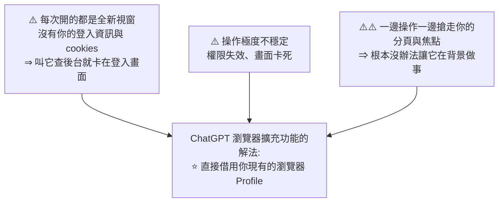
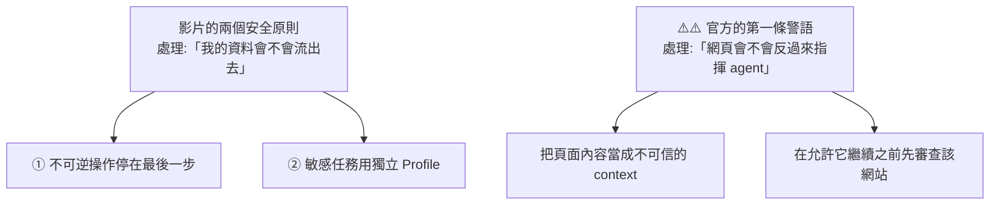
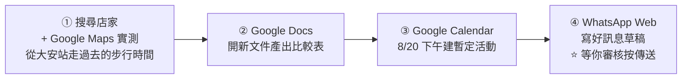

# ChatGPT 瀏覽器擴充功能:借用你「已經登入」的瀏覽器,在背景跨分頁做事

> 整理自 YouTube 頻道 **Gary Chen(@garytalksstuff)**〈ChatGPT Chrome 擴充功能到底有多強?幫你接手所有在瀏覽器裡的雜事!〉(2026-08-26,約 10.5 分鐘,官方 zh-TW 字幕)。
> 依 CLAUDE.md 慣例,**另比對 OpenAI 官方文件核實**,文中標出**四處影片講得比實際窄的地方**與**一個影片完全沒涵蓋的安全面**。

> 相關筆記:[[prompt-injection-5-techniques-defenses]](⭐ **官方安全警語直指這個攻擊面,而影片沒提**)、[[codex-as-a-platform-open-agent-harness]]、[[claude-code-2026-feature-timeline]]、[[multi-tool-ai-workflow]]、[[graph-engineering-node-edge-state]]

---

## 一句話總結

**以前讓 AI 操作瀏覽器,它開的是一個「什麼都沒登入」的全新視窗;這個擴充功能直接借用你現有的瀏覽器 Profile —— 你登入過的公司後台、Gmail、Drive 它都進得去,而且在背景跨分頁做事,不搶你的畫面。**

⭐ 講者的定位很明確:**這是他第一次覺得「瀏覽器 agent 真的穩定到可以拿來處理真實工作了」。**

---

## 一、⭐ 它解決的是什麼痛點

**講者開場直接拿 Claude in Chrome 做對照,而且講得很不客氣:**

> **「之前我用 Claude in Chrome 的時候,老實說體驗非常破碎 —— 不是權限動不動失效、要我一直重新登入,就是執行到一半卡住、遇到奇怪的 bug。很難真的把它當成日常工具。」**

**過去讓 AI 操作瀏覽器的三個痛點:**



**⭐ 借用現有 Profile 的三個直接後果:**

| | |
|---|---|
| **已登入的軟體它都能進去讀取與操作** | 公司管理後台、Gmail、甚至 Google Drive |
| ⭐ **你裝的其他擴充功能它也能無縫共用** | |
| ⭐⭐ **能在背景跨分頁做事** | 自己開新分頁,**甚至用 Tab Group 自動把同一個任務的相關頁面整理在一起**;在背景查資料、比對內容,**完全不搶走你眼前的畫面** |

---

## 二、⭐⭐ 三種入口怎麼選(全片最有結構的一段)

**這是最實用的部分 —— ChatGPT 有三條操作外部服務的路,講者給了清楚的分流:**

| 情況 | 用哪個 | 理由 |
|---|---|---|
| **App 有專屬 Plugin**(GitHub、Slack) | ⭐ **優先用 Plugin** | **走官方 API、傳遞結構化資料** ⇒ **反應最快、最穩定、消耗 token 最少、操作最精準安全** |
| **沒有 Plugin 但有網頁版** —— 公司內部系統、小眾 Web SaaS、或**需要沿用現有登入身分/cookies/已開分頁**的工作 | ⭐ **瀏覽器擴充功能** | 只要你在瀏覽器裡已登入,AI 就能直接進去點按鈕、查資料、整理報表 |
| **本機開發測試、查公開網頁資料、想把任務隔離在獨立視窗** | **ChatGPT App 內建 Browser** | ⚠️ **雖然現在也能在設定裡匯入憑證與 cookies,但它本質上依然是一個「獨立的沙盒環境」** |

> ⭐ **一句話總結**:**有專屬 Plugin 就用 Plugin;想沿用當前瀏覽器的分頁、登入身分與擴充功能就用擴充功能;本機開發測試就交給內建 Browser。**

### 兩大類最適合交給擴充功能的工作

**① 根本沒有 Plugin 的網頁 App**

預約系統、記帳網站、公司內部管理後台 —— **這些地方根本不可能有人去幫它寫專屬的官方 Plugin。**

⭐ **講者的客戶案例很有說服力:**
> 客戶內部的管理後台和工具都做得特別慢,**以前都要拜託內部工程師去開發 API 才能串接後續的自動化**。
> ⭐ **而擴充功能可以直接繞過這些繁雜的溝通,自己把工作自動化。**

**② 需要跨網頁、跨 Web App 接力的繁複工作**

例:老闆在 WhatsApp 問訂單進度 ⇒ 你得開公司 CRM 查資料 + 開 Google Calendar 確認排程 + 把整理好的回覆貼回 WhatsApp。**過去要自己開一堆分頁手動切換。**

---

## 三、⚠️⚠️ 四處影片講得比實際窄的地方(比對官方文件)

### ⭐⭐ 修正一:不只 Chrome —— 支援五種瀏覽器

**影片標題與全片都只講 Chrome。官方文件的實際支援範圍是:**

| 瀏覽器 | Tab mentions | 從桌面 app 控制瀏覽器 | ⭐ **Side chat** |
|---|---|---|---|
| **Chrome** | ✅ | ✅ | ✅ |
| **Edge** | ✅ | ✅ | ✅ |
| **Brave** | ✅ | ✅ | ✅ |
| **Vivaldi** | ✅ | ✅ | ✅ |
| ⚠️ **Opera** | ✅ | ✅ | ❌ **不支援 side chat,任務必須從桌面 app 發起** |

### ⭐ 修正二:有一個「Side chat」功能,影片完全沒提

> **可以在你正在看的頁面「旁邊」開啟 ChatGPT,詢問該頁面,或接續成任務 —— 而且能同時使用「頁面 context + 本機檔案 + 已連接的 app」。**

⭐ **這跟影片講的兩個入口(桌面 app 下指令、側邊欄打開插件)其實是同一件事,但官方把它命名並列為一個功能,而且點出了「三種來源的 context 可以合併使用」這一層。**

### ⚠️ 修正三:官方的安裝路徑是「Settings > Computer Use」,不是「Plugins」

**影片說**:打開 Codex 桌面版 → 左側選單 **Plugins** → 找到 Chrome → 安裝。

**官方文件的流程:**

```
① 在電腦上安裝該瀏覽器
② 在 ChatGPT 桌面 app 打開 ⭐ Settings > Computer Use
③ 選擇你的瀏覽器,依提示安裝所需的 plugin
④ 選 Install 進入擴充功能商店頁面並安裝
⑤ 檢視瀏覽器的權限提示
⑥ ⭐ 回到 Computer Use,確認該瀏覽器顯示「Manage」
⑦ 開一個 ChatGPT Work 或 Codex 對話,用 @ 提及你的瀏覽器
```

> ⚠️ **可能是 UI 改版或影片簡化了說法。以你當下版本的實際選單為準** —— 但「確認顯示 **Manage**」這個完成訊號是影片沒提到的,值得記。

### ⭐ 修正四:能力比影片展示的更多 —— 特別是 YouTube 逐字稿

**官方列出的能力包含影片沒示範的:**

| 能力 | 說明 |
|---|---|
| ⭐⭐ **YouTube 帶時間戳的影片逐字稿** | **可直接取得** |
| **使用開啟中分頁的 context** | |
| **自動化互動** | 更新帳號、輸入資料 |
| ⚠️ **存取瀏覽歷史** | **每次請求都需使用者確認**,而且被官方標為 **「Elevated Risk(高風險)」** |

> ⭐ **「YouTube 帶時間戳逐字稿」對本倉庫的工作流特別相關** —— 目前抓字幕靠 `yt-dlp`,沒字幕時要跑 Whisper。這是一條可能的替代路徑(⚠️ 但未實測)。

---

## 四、⚠️⚠️ 一個影片完全沒涵蓋的安全面:網頁可以攻擊 agent

**影片給了兩個安全原則,都很好 —— 但它們處理的都是「你的資料會不會外洩」。**

⭐⭐ **而官方文件的第一條安全警語處理的是完全不同的方向:**

> **「把頁面內容當成「不可信的 context」,並在允許 ChatGPT 繼續之前先審查該網站。」**

⚠️⚠️ **這是 prompt injection 的警告** —— 意思是:**你造訪的網頁上的文字,可能包含針對 agent 的指令。** 而這個 agent 現在正帶著你所有已登入的身分在瀏覽器裡動作。



> 📎 **這正是 [[prompt-injection-5-techniques-defenses]] 講的攻擊面,而它在這個場景下特別危險** —— 因為 agent 手上握著你「已經登入的所有東西」。
> 📎 也呼應 [[pi-minimal-agent-harness-teardown]] 引用的 Pi 官方說法:**「來自 repo 檔案、註解、文件或建置輸出的提示詞注入,是本地 agent 的預期風險。」** 換到瀏覽器場景,攻擊面從「你的 repo」擴大到「整個網際網路」。

### ⭐ 官方揭露的權限清單(比影片說的廣很多)

**存取:page debugger、網站資料、瀏覽歷史、通知、書籤、下載,以及「與原生應用程式通訊」。**

**資料保留**:OpenAI 表示只在「瀏覽活動**成為 ChatGPT context 的一部分時**」才儲存。

---

## 五、影片的兩個安全原則(仍然值得照做)

### ⭐ 原則一:不可逆的操作,一律停在最後一步

> **只要任務涉及寄出信件、發布社群貼文、刪除資料、甚至付款,務必在 Prompt 裡明確寫上「停在確認畫面,不要送出」,把最後的核准權留在自己手上。千萬不要把決策完全交給自動化。**

📎 **這跟 [[graph-engineering-node-edge-state]] 的「human approval node 處理價值判斷」、以及 [[claude-code-2026-feature-timeline]] 觀察到的「安全外掛產生修補但要你自己套用」是同一條原則的三個實例。**

### ⭐ 原則二:處理敏感任務時使用獨立的 Profile

> **切換一個乾淨的工作 Profile,可以避免你的私人分頁、瀏覽紀錄、通訊軟體的聊天名稱或敏感通知,被 AI 當成背景 context 讀取,甚至意外出現在你的任務畫面裡。**

⭐ **官方也證實了 Profile 這一層的重要性(從另一個角度)**:**「使用者無法在未安裝該擴充功能的 Profile 中使用它。」** ⇒ 也就是說 **Profile 就是它的作用邊界**,影片提醒的「務必確認裝在你要執行任務的那個 Profile 底下」是對的 —— **因為它只看得到那個 Profile 底下的瀏覽器視窗。**

---

## 六、兩個實測

### Demo 1|8 張發票 → Google Sheets 報表

**Prompt 刻意寫得很簡單**:附檔是本月的 8 張發票,幫我把發票資訊整理在 Google Sheets 上,**讓它變成一個排版專業、好閱讀、好理解的報表**,方便之後做分析以及請會計處理。

⭐ **講者說明了測試意圖**:只要求「排版好看」並說明後續目的,**是想測「模型現在對於『一份好報表』的定義究竟是什麼」**。

**結果:自動建了三張 Sheet**

| Sheet | 內容 |
|---|---|
| ① **發票明細** | 日期、廠商、金額、品項條列 |
| ② **品項明細** | |
| ③ **分析摘要** | 各類別支出佔比與加總 |

⭐ **連裡面該有的計算公式都自己寫好了**,排版與顏色配置也不錯。

⭐ **講者最驚豔的點是「操作速度」**:編排儲存格時滑鼠動得極快 —— 選取範圍、設定格式、調整欄寬 ——「**完全不是人類手動操作可以達到的境界**」,而且**影片完全沒有加速**。

⚠️ **但他自己也誠實界定了這個 demo 的意義:**
> **用 AI 建報表不是新鮮事,用 Claude Code 或其他 Google Sheets Plugin 一樣可以做得很好。**
> ⭐ **這個案例主要想給你看的是「GPT 在網頁介面操作的能力」,已經和一年前那種類似 Perplexity 的 Browser、或 GPT 之前出過的 AI 原生 Browser Atlas 完全不是同一個級別了。**

### ⭐⭐ Demo 2|跨網站接力規劃 Team Building

**任務**:規劃一場台北大安站附近、10 人的室內 Team Building 活動。



**過程中值得注意的細節:**
- ⭐ **它自己建了一個叫「規劃台北團隊活動」的 Tab Group**,在裡面開不同店家的網頁與 Google Maps 分頁
- 一邊比對 10 人的包場費用,一邊在 Google Maps 上**實測步行時間**
- Google Docs 裡把**活動類型、費用、步行時間、優缺點分析**整理好
- ⭐ Google Calendar 建活動時,**把推薦店家的地址與詳細時間表塞進說明欄**
- **整套約 20 分鐘**

⭐⭐ **講者對這個 demo 的評語才是重點:**
> **「不管任務步驟再多,它還是有辦法遵從我的指令、不會偏掉地把任務完成。**
> **⭐ 就算任務需要經過很長的步驟、中間經過上下文壓縮,一開始輸入的指令和資訊不會因為這些壓縮而被不小心丟失。」**

📎 **這一點值得對照 [[token-saving-three-moves-context-control]] 講的「自動 compact 是有損壓縮」** —— 講者這裡觀察到的是**指令與初始資訊在壓縮後仍被保留**,這正是好的壓縮策略該做到的事。

---

## 應用案例

### 案例 1|⭐⭐ 用「三種入口」的分流表決定該用哪條路

這是全片最可直接套用的東西。實務上的判斷順序:

```
① 這個服務有官方 Plugin 嗎?
   有 ⇒ ⭐ 用 Plugin(API + 結構化資料,最快最穩最省 token)

② 沒有,但有網頁版嗎?而且我平常就登入著?
   是 ⇒ ⭐ 用瀏覽器擴充功能

③ 我不想讓 AI 碰我平常的瀏覽器?
   是 ⇒ 用內建 Browser(獨立沙盒)
```

⭐ **第①條的理由值得記牢:Plugin 走 API 傳結構化資料,而擴充功能是在「操作 UI」。** UI 操作永遠比 API 慢、脆(版面一改就壞)、也更耗 token(要讀畫面)。**能走 API 就別走 UI。**

### 案例 2|⚠️⚠️ 把「網頁是不可信輸入」寫進你的使用習慣

官方那條警語值得變成具體動作:

| 情境 | 做法 |
|---|---|
| **叫它去你不熟的網站找資料** | ⚠️ **先自己看一眼那個網站** —— 官方明說「在允許 ChatGPT 繼續之前先審查該網站」 |
| **叫它處理使用者提交的內容**(工單、留言、表單) | ⚠️⚠️ **最高風險** —— 那些內容是別人寫的,可能包含針對 agent 的指令 |
| **它突然要做一件你沒交代的事** | ⭐ **這是注入的典型徵兆**,停下來看它剛讀了什麼頁面 |

⭐ **而這個場景的風險比一般 prompt injection 高一階**,因為 **agent 手上握著你所有已登入的身分** —— 注入成功的攻擊者等於拿到你的 Gmail、公司後台。

### 案例 3|⭐ 「停在確認畫面」該怎麼寫進 prompt

影片的原則很好,但要能用得寫得出來。實務上的句型:

```
❌ 太模糊:「小心一點」「不要亂做」
✅ 明確指定停點:
   「所有步驟做完後,停在寄送確認畫面,不要按送出,讓我檢查。」
   「在 Google Calendar 建立為『暫定』,不要發送邀請給任何人。」
   「草稿寫好留在對話框裡,不要傳送。」
```

⭐ **共同結構:指名「哪一個具體動作」不要做,而不是形容一種態度。** 📎 這跟 [[graph-engineering-node-edge-state]] 講的「每個 node 要寫清楚『遇到什麼情況絕對不能放行』」是同一件事。

### 案例 4|⭐ 這則消息放在 harness 那條線上看

📎 **對照 [[codex-as-a-platform-open-agent-harness]]** —— 那篇講 OpenAI 把 Codex harness 開源、主張「把 agent 帶進工作現場而不是把人叫進通用助理」。

⭐⭐ **這個瀏覽器擴充功能是同一個策略的另一種實作**:

| | 做法 |
|---|---|
| **Codex 平台化** | 讓開發者**把 agent 嵌進自己的產品** |
| ⭐ **瀏覽器擴充功能** | **讓 agent 直接進到「使用者已經在用的網頁」** —— 連嵌都不用嵌 |

⭐ **共同前提都是:不要求人搬家。** 而講者的結論也指向這個 —— **OpenAI 正在從「幫工程師寫 code 的工具」升級成「能幫所有人操作數位工作環境的通用 Agent」。**

---

## 重點回顧(TL;DR)

1. **核心差異:它直接借用你「現有的瀏覽器 Profile」** —— 已登入的公司後台、Gmail、Drive 都進得去,**連你裝的其他擴充功能也能無縫共用**。
2. **它解決的三個舊痛點**:①開的是沒有登入資訊的全新視窗 ②權限失效、畫面卡死 ③⚠️ **一邊操作一邊搶走你的分頁與焦點**。
3. ⭐ **能在背景跨分頁做事** —— 自己開新分頁,**用 Tab Group 自動把同一任務的相關頁面整理在一起**,不搶你眼前的畫面。
4. **講者拿 Claude in Chrome 做對照**,說那個體驗「非常破碎」(權限失效要一直重登、執行到一半卡住),⭐ **而這次是他第一次覺得瀏覽器 agent 穩定到可以處理真實工作**。
5. ⭐⭐ **三種入口的分流**:**有專屬 Plugin 就用 Plugin**(走官方 API、傳結構化資料,**最快最穩、最省 token、最精準安全**);**沒 Plugin 但有網頁版就用擴充功能**;**本機測試或想隔離就用內建 Browser**(⚠️ **雖能匯入憑證與 cookies,但本質仍是獨立沙盒**)。
6. **兩大類適合的工作**:①**根本不會有 Plugin 的網頁 App**(⭐ 客戶案例:內部後台以前要拜託工程師開 API 才能自動化,**現在可以直接繞過這些溝通**)②**跨網頁跨 Web App 的接力工作**。
7. ⭐⭐ **修正一:不只 Chrome —— 官方支援 Chrome、Edge、Brave、Opera、Vivaldi 五種。** 五種都支援 tab mentions 與從桌面 app 控制瀏覽器;⚠️ **只有 Opera 不支援 side chat**。
8. ⭐ **修正二:有「Side chat」功能,影片完全沒提** —— 在你看的頁面旁邊開 ChatGPT,**能同時用到「頁面 context + 本機檔案 + 已連接的 app」**。
9. ⚠️ **修正三:官方安裝路徑是 Settings > **Computer Use**,不是影片說的 Plugins**;而且**要確認瀏覽器顯示「Manage」**才算完成,最後用 `@` 提及瀏覽器。
10. ⭐ **修正四:官方列出的能力更多** —— 包含 ⭐⭐ **YouTube 帶時間戳的影片逐字稿**、使用開啟中分頁的 context、自動化互動(更新帳號、輸入資料),以及 ⚠️ **存取瀏覽歷史(每次需確認,官方標為「Elevated Risk」)**。
11. ⚠️⚠️ **影片完全沒涵蓋的安全面 —— 官方的第一條警語**:**「把頁面內容當成不可信的 context,並在允許 ChatGPT 繼續之前先審查該網站。」** 這是 **prompt injection** 的警告 —— **網頁上的文字可能包含針對 agent 的指令,而這個 agent 正帶著你所有已登入的身分在動作。**
12. ⭐ **影片的兩個安全原則處理的是「我的資料會不會流出去」;官方這條處理的是「網頁會不會反過來指揮 agent」** —— 兩個不同方向,都要顧。
13. **官方權限清單比影片說的廣**:page debugger、網站資料、瀏覽歷史、通知、書籤、下載、**與原生應用程式通訊**。資料保留:只在「瀏覽活動成為 ChatGPT context 的一部分時」才儲存。
14. ⭐ **安全原則一:不可逆的操作一律停在最後一步** —— 寄信、發文、刪資料、付款,**在 Prompt 裡明確寫「停在確認畫面、不要送出」**。
15. ⭐ **安全原則二:敏感任務用獨立 Profile** —— 避免私人分頁、瀏覽紀錄、聊天名稱被當成背景 context 讀取。⭐ **官方也證實 Profile 就是它的作用邊界**(「無法在未安裝擴充功能的 Profile 中使用」)。
16. **Demo 1(8 張發票 → Sheets)**:只給一句簡單 prompt,⭐ **自動建了三張 Sheet(發票明細 / 品項明細 / 分析摘要),連計算公式都寫好**。⭐ 最驚豔的是**操作速度 —— 影片完全沒加速**。⚠️ **但講者誠實界定:建報表本身不新鮮,重點是「網頁介面操作能力」已與一年前的 Perplexity 類 Browser 或 GPT 的 Atlas 不同級別。**
17. ⭐⭐ **Demo 2(跨網站接力,約 20 分鐘)**:自建 Tab Group → Google Maps 實測步行時間 → Google Docs 產出比較表 → Google Calendar 建暫定活動(**地址與時間表塞進說明欄**)→ WhatsApp Web 寫好草稿**等你按傳送**。
18. ⭐⭐ **講者對 Demo 2 的評語才是重點**:**「不管任務步驟再多,它還是能遵從指令不偏掉地完成;就算中間經過上下文壓縮,一開始輸入的指令和資訊不會因此被丟失。」**
19. ⭐ **結論**:OpenAI 方向明確 —— 從「幫工程師寫 code 的工具」或「一般問答 AI」,升級成**「能幫所有人操作數位工作環境的通用 Agent」**,而這個擴充功能是最重要的拼圖之一。

---

## 來源

- [ChatGPT Chrome 擴充功能到底有多強?幫你接手所有在瀏覽器裡的雜事! — Gary Chen(@garytalksstuff)](https://www.youtube.com/watch?v=Mhq6IS2vSQM)(2026-08-26,約 10.5 分鐘,官方 zh-TW 字幕)
- ⭐ [ChatGPT 瀏覽器擴充功能官方文件](https://learn.chatgpt.com/docs/chrome-extension)(原 `developers.openai.com/codex/chrome-extension`,已 308 導向)—— **已比對核實**:五種支援瀏覽器與各自的功能差異(**Opera 無 side chat**)、`Settings > Computer Use` 安裝流程與「Manage」完成訊號、side chat、YouTube 時間戳逐字稿、瀏覽歷史的「Elevated Risk」標示、完整權限清單、**「把頁面內容當成不可信 context」的安全警語**、以及 Profile 作用邊界
- 影片提供的擴充功能連結:[Chrome Web Store](https://chromewebstore.google.com/detail/chatgpt/hehggadaopoacecdllhhajmbjkdcmajg)
- 本倉庫相關筆記:[[prompt-injection-5-techniques-defenses]]、[[codex-as-a-platform-open-agent-harness]]、[[claude-code-2026-feature-timeline]]、[[graph-engineering-node-edge-state]]、[[token-saving-three-moves-context-control]]、[[pi-minimal-agent-harness-teardown]]、[[multi-tool-ai-workflow]]

> ⚠️ 此類產品迭代極快,選單位置、支援瀏覽器與權限範圍**可能已變動**;安裝前請以官方文件與當下的實際介面為準。
> ⚠️ 「YouTube 帶時間戳逐字稿」一項為官方文件所述,**本文未實測**。
