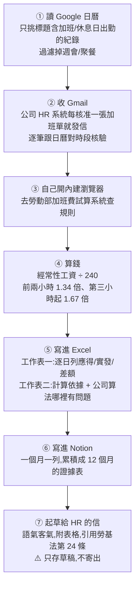

# 一段提示詞、五個工具、3 分鐘抓出加班費算法裡的三個漏洞:Claude Cowork 實戰拆解

> 整理自 YouTube 頻道 **YAHA學堂**〈[公司少算我2143块加班费！我用Claude Cowork自动化对账：3分钟抓出3个克扣漏洞](https://www.youtube.com/watch?v=zK2TjT17b8U)〉(2026-09-10,約 9.9 分鐘,無字幕、以 CPU faster-whisper 轉錄)。
> ⭐ **本文是「一個真實可複製的工作流拆解」,不是產品業配** ——
> 影片本身附完整提示詞原文於 GitHub,已核對其存在性;台灣勞基法的計算規則已對照官方與法律專欄逐項核實。

---

## 一句話總結

> **一段提示詞,讓 Claude Cowork 自己串起 Google 日曆、Gmail、瀏覽器、Excel、Notion 五個工具,
> 3 分鐘生出一張逐日對帳表 —— 抓出公司加班費演算法裡的三個漏洞,少算了 2,143 元。**
>
> ⭐⭐⭐ **比工具本身更值得學的,是這個任務的拆解方式:把一條模糊的法規,拆成七個可驗證的步驟,
> 每一步都能被單獨檢查、被單獨質疑。**

---

## 一、事件:自己完全沒發現的 2,143 元

| 項目 | 數字 |
|---|---|
| 7 月加班次數 | 11 次,合計 **34 小時** |
| **法定應得** | **9,193 元** |
| **公司實發** | **7,050 元** |
| **短少** | **2,143 元** |

> **自己手算至少要 40 分鐘。Claude Cowork 3 分鐘生出同一張表 —— 而且逐日列出差多少。**

---

## 二、⭐⭐⭐ 一段提示詞,七個步驟,五個工具

**在 Claude 桌面版切換到 Cowork 模式,貼入提示詞送出,Claude 會先列出計畫再按步驟執行:**

⭐ **三個沒寫進提示詞、但 Claude 自己做到的事(這才是重點):**

1. **自己把七步拆解出來並即時顯示進度**(提示詞裡沒要求列計畫)。
2. **沒指定的核驗動作**:11 封核准信自動跟日曆時段核對,吻合才納入計算。
3. **⭐⭐ 抓到一個文字細節**:7 月 11 日標題寫「加班到晚上七點半(含休息一小時)」,
   **它自己把七小時扣成六小時 —— 這一句話就差了 459 元。**

---

## 三、⭐⭐⭐ 公司算法裡的三個漏洞(每一個都對應一條法規)

### 漏洞一:分母錯了 —— 「本薪」不等於「經常性工資」

| | 公司的算法 | ⭐ 正確算法 |
|---|---|---|
| 月薪 38,000 元算出的時薪 | **158.3** | **44,485(經常性工資)÷ 240 = 一小時多算約 27 元** |
| 分母依據 | 只用**本薪** | **經常性工資**(本薪 + 職務加給 + 固定發放的伙食津貼等)÷ **240**(30 天 × 8 小時) |

> 📌 **勞動部官網原話:「月薪總額除以 30 日再除以 8 小時。」**
> **每一小時加班都在漏。**

### 漏洞二:分鐘進位 —— 「不滿一小時不記錄」違法

**公司備註:未滿 1 小時不記錄。⚠️ 勞基法是按實際時數計算,半小時就是半小時。**

> **7 月有 4 天加班到幾點半,四天加起來兩小時就這樣不見了 —— 34 小時被算成 32 小時。**

### 漏洞三:倍率沒分段 —— 休息日出勤整天用同一個倍率

| | 公司的算法 | ⭐ 正確算法 |
|---|---|---|
| 休息日出勤倍率 | **整天用 1.34 倍** | **前兩小時 1.34 倍,第三小時起 1.67 倍** |

> **7 月 11 日出勤 6 小時,後面 4 小時每小時都被少算 —— 這就是那天差 459 元的來源。**
> **拆開看:基數算錯扣掉 214 元、倍率沒分段扣掉 244 元,加總 459 元。**

---

## 四、⭐ 任務跑完不用關:接著追問也能算

**Claude 記得剛才所有數據,可以直接追問細節:**「那 459 元到底怎麼拆出來的?」
**它拆成前兩小時與後四小時兩段,用不同倍率加總得出 1,732 元,公司整天一個倍率只給 1,273 元,差額 459 元** ——
**這張追問結果的截圖可以直接貼給 HR 當證據。**

---

## 五、⭐⭐ 給 HR 的信怎麼寫最有用

> **語氣客氣,不寫「你們違法」,寫「想請教一下計算方式」;附上表格,引用勞基法第 24 條。**
> ⚠️ **只存草稿不寄出**(提示詞裡明確要求)——即使 Gmail 連接器發信本來就要人工確認,作者仍不給模型「有機會發出」的空間。

> 📌 **這句話值得記住:「很多時候就是 HR 系統設錯了。它能算對,前提是你的數據它讀得懂。」**
> **先假設對方是系統性錯誤而非惡意,姿態上更容易被解決。**

---

## 六、應用案例:三分鐘準備你自己的資料

### 案例 1|⭐ 讓資料「長得像它要的樣子」,比事後修正更省力

| 準備動作 | 為什麼要做 |
|---|---|
| **每次加班下班前花 10 秒建一個日曆事件**,標題固定寫「加班」,冒號後面寫做什麼,時間照實際打卡填,週六寫「休息日出勤」,有休息時間就在括號裡註明(如「含休息一小時」) | ⭐ **它會自己扣掉標注的休息時間** |
| **Notion 空的資料庫就行,六個欄位:月份/法定應得/實發/差額/狀態/備註** | **欄位名要跟提示詞裡寫的一致**,它才對得上;多欄位沒關係,少了它會問你 |
| **提示詞只紅圈三處要改:月份、薪資項目、資料庫名稱** | **薪資項目不確定該不該算,就先都放進去,讓 Claude 在 Excel 第二個工作表標出哪個有爭議** |

### 案例 2|⭐⭐ 排程化:讓它每週自動跑一次

> **在 Cowork 左側的 Scheduled → New Task → Setup manually,任務名稱寫「加班費核算」,
> 提示詞和上面一樣,只把月份改成「上個月」,讓它每次跑自己判斷。**
>
> ⚠️ **一個坑:沒有「每月」選項,只能選 Weekly(每週跑一次)。**
> ⭐ **定時任務在雲端跑,電腦關著也會跑 —— 但雲端碰不到你電腦的資料夾**,所以前置資料(日曆/Gmail/Notion)都得是雲端服務。

### 案例 3|接連接器的三個步驟

1. **Customize → Connectors → 找到 Gmail → Connect**,跳出 Google 授權頁,同意即可。
2. **同樣方式接 Google Calendar 與 Notion**,每個應用後面出現「✓」表示成功。
3. ⚠️ **每個任務裡的連接器是各自開關的** —— 新建任務時先點開檢查一遍,三個都打開再貼提示詞。

### 案例 4|⭐⭐⭐ 這個工作流本身可以泛化到任何「規則 + 數據」的稽核任務

**把這個案例抽象化,得到一個可複用的模板:**

📌 **同樣的模板可以套用在**:房租/水電分攤核對、報稅扣除額試算、信用卡帳單逐筆核對、
**任何「有明文規則、但實際執行由人工計算、容易出系統性誤差」的場景。**

---

## 重點回顧(TL;DR)

1. **一段提示詞串起 Google 日曆、Gmail、瀏覽器、Excel、Notion 五個工具,3 分鐘生出一張逐日對帳表,抓出 2,143 元短少。**
2. ⭐⭐⭐ **三個未寫進提示詞卻自動做到的事**:自己拆解步驟並顯示進度、核准信與日曆自動核對、抓出括號裡的休息時間文字並自動扣除。
3. **三個算法漏洞**:①**分母用本薪而非經常性工資**(÷240 少算)②**未滿一小時不記錄**(違反實際時數原則)③**休息日出勤倍率沒分段**(前 2 小時 1.34 倍、第 3 小時起 1.67 倍)。
4. **任務跑完不用關**,可以直接追問細節分解(拆基數錯 + 倍率沒分段兩塊)。
5. ⭐ **給 HR 的信要客氣、只存草稿不寄出**,姿態設定為「請教」而非「指控」。
6. **前置準備只需三件事**:日曆標題固定格式(含休息時間標注)、Notion 六欄位資料庫、提示詞改三處(月份/薪資項目/資料庫名)。
7. **可排程為每週自動跑**,但雲端排程碰不到本機資料夾,前置資料需在雲端服務。
8. ⭐⭐⭐ **這個工作流的可泛化模板**:一手數據 + 權威規則 + 逐條核對 + 可審查的計算依據,適用於任何「有明文規則但常見系統性誤差」的稽核任務。

---

## 核實狀態

### ✅ 已核實

| 影片說法 | 核實結果 |
|---|---|
| **Claude 桌面版有 Cowork 模式,可連接 Google Calendar、Gmail、Notion 等連接器,並內建瀏覽器讓 Claude 自主上網** | **屬實**:Anthropic 官方 Google Workspace 連接器自 2026 年初起 GA;2026-08-26 起 Cowork 內建 Chromium 瀏覽器 |
| **Gmail 連接器發信本來就需要人工確認** | **屬實** |
| **台灣勞基法第 24 條:平日加班前兩小時 1.34 倍、第三小時起 1.67 倍** | **屬實**,多個法律專欄與勞動部相關試算系統一致確認 |
| **經常性工資計算:月薪(經常性工資)÷ 240 得出時薪** | **屬實**,240 = 30 天 × 8 小時,官方試算系統採此公式 |
| **經常性工資範圍包含本薪、職務加給、固定發放的伙食津貼等,不只是本薪** | **屬實** |
| **加班費按實際時數計算,不得以「未滿一小時不計」的內規縮減** | **方向屬實**(勞基法採實際工作時數認定,雇主不得片面訂定進位規則規避給付) |

### ⚠️ 未能獨立查證(以影片轉述看待)

- **影片主角的實際公司資料、11 次加班紀錄、9,193 元/7,050 元/2,143 元等具體數字** —— **屬個案示範數據,無法查證真偽,以案例教學材料看待。**
- **影片描述欄的完整提示詞原文與 GitHub 連結內容** —— **本文未實際開啟該 GitHub 連結逐字核對提示詞內容**,使用前建議自行檢視。
- **「Weekly 是目前 Cowork 排程僅有的選項之一,無 Monthly」** —— **屬影片實測當下的介面狀態,功能可能隨版本更新調整,建議使用前自行確認。**

---

## 來源

- [公司少算我2143块加班费！我用Claude Cowork自动化对账：3分钟抓出3个克扣漏洞 — YAHA學堂](https://www.youtube.com/watch?v=zK2TjT17b8U)(2026-09-10,約 9.9 分鐘,無字幕以 faster-whisper 轉錄)
- 影片描述欄附完整提示詞與示範資料腳本:[GitHub - buildinpublichub/YAHAClass-Document, cowork-overtime-audit](https://github.com/buildinpublichub/YAHAClass-Document/tree/main/cowork-overtime-audit)
- 核實用資料:
  - [Use Google Workspace connectors — Claude Help Center](https://support.claude.com/en/articles/10166901-use-google-workspace-connectors)
  - [Claude Desktop Is Getting a Built-In Browser for Cowork — Memeburn](https://memeburn.com/claude-desktop-is-getting-a-built-in-browser-for-cowork-and-that-changes-the-game/)
  - [2026 勞基法加班費怎麼算 — Swingvy](https://www.swingvy.com/blog-tw/overtime-pay-in-taiwan)
  - [勞動基準法第 24 條 — 法律人 LawPlayer](https://lawplayer.com/article/643a2b55e800e5f0b93c5cae)
  - [勞基法第 24 條條文全文 — 全國法規資料庫](https://law.moj.gov.tw/LawClass/LawAll.aspx?pcode=N0030001)

> 該片無字幕,逐字稿以 CPU 版 faster-whisper(small / int8 / zh)轉錄取得,**非官方字幕**,可能有少量聽寫誤差
> (轉錄中的「Colork」「Co-work」「Co-Ec」均為 **Claude Cowork**、「劳吉法」為**勞基法**、「eH2」為 **HR 系統**、「Hype」為 YouTube 的 **Hype** 曝光機制、「醉伤」為**倍數**)。
