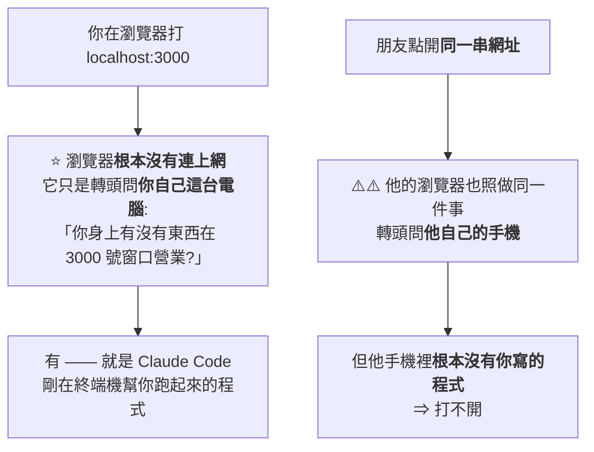
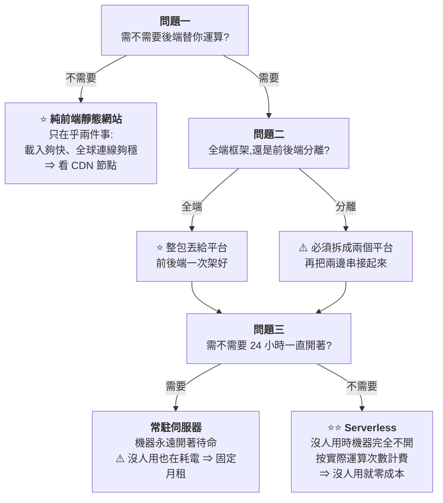
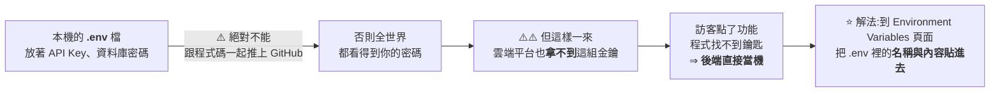

# 給非技術人員的部署:為什麼 localhost 傳給朋友打不開,以及三個問題選平台

> 整理自 YouTube 頻道 **Gary Chen**〈[給非技術人員的部署教學,Vibe Coding 上線前必看](https://www.youtube.com/watch?v=6bvEcpm72W0)〉(2026-09-16,約 20.2 分鐘,官方 zh-TW 字幕)。
> ⚠️ **立場揭露:作者在說明欄推廣自己的 Patreon**(完整文章與選平台的提示詞模板);**本文只整理公開影片內容,不轉述付費素材。**
> ⭐ **平台定價與免費額度已比對公開資料核實**,兩處需補正列於文末。
>
> ⭐ **2026-09-22 增補 YAHA學堂**〈[URL发给朋友打不开?localhost 不是网址,是只对你有效的暗号](https://www.youtube.com/watch?v=8unONuKIaPs)〉(2026-09-21,約 20.6 分鐘,無字幕以 faster-whisper 轉錄),成為 **§九** —— ⚠️ **該片內容與本筆記 §一至 §八高度重疊**(同樣的餐廳比喻、三個決定、平台推薦與後台四個地方),本文僅記錄此一事實、**不對成因做任何判斷**,並摘出該片三句講得更凝練的說法。

---

## 一句話總結

> **部署 = 租一間 24 小時不打烊的店面、把整套廚房搬過去、在門口掛上招牌。**
>
> ⭐⭐⭐ **而選平台不該從「研究各家規格」開始,要從**三個關於你自己專案的問題**開始 ——
> 問完,十幾家平台自己就會排好隊。**

---

## 一、⭐⭐ 先搞懂為什麼 localhost 傳出去會打不開

**這是幾乎每個 vibe coder 都踩過的第一個坑:做好小工具,把 `localhost:3000` 傳給朋友,對方回「打不開」。**

| 你以為 | 實際上 |
|---|---|
| 網址複製給人就能用(像 `google.com`) | ⚠️ **`localhost` 翻成中文就是「本機」** |

> ⭐⭐⭐ **一句話說清楚:`localhost` 不是你 App 的公開地址,
> 它更像是一句「對設備自己說的暗號」—— 誰點開這個連結,誰的瀏覽器就轉頭去問誰的設備。**

⚠️ **而且只要你把終端機關掉,那個程式就不見了。**

### 那把整包程式碼寄給他呢?

> ⚠️ **那是工程師的做法** —— 對方必須自己裝環境、裝套件,還得跑來找你拿 API 金鑰。
> ⭐ **你真正想要的是:任何完全不懂技術的人,隨手點一下連結、什麼都不用裝,就能立刻開始用。**

---

## 二、⭐⭐⭐ 部署到底是什麼:開餐廳的三件事

**在自己電腦上寫程式 = 你在家裡的廚房試煮了一道私房菜。菜再厲害,除了你沒人吃得到。**
**部署 = 決定走出家門,到街上開一家正式的餐廳。**

| # | 開餐廳 | 對應到軟體 |
|---|---|---|
| **1** | ⭐ **租一間 24 小時不打烊的店面** | **去雲端租一台永遠開著、不會關機的伺服器** —— 因為你的筆電會闔上、會帶出門,但用戶可能半夜、或從地球另一端連進來 |
| **2** | **把廚具、醬料、食材全部搬進店裡**,並確認**煮得出跟家裡一樣的味道** | ⭐⭐ **把程式碼、執行環境、API 金鑰完整搬到遠端伺服器**,讓程式在上面順利跑起來 |
| **3** | **在門口掛上明亮好記的招牌** | **幫伺服器綁定一個固定的公開網址**(如 `gary.com`) |

> ⭐ **租店面 + 搬廚房 + 掛招牌 = 部署。**

---

## 三、⭐ 去哪裡弄那台「永遠開著的電腦」:三條路

| 路線 | 做法 | ⚠️ 問題 |
|---|---|---|
| **① 自己在家養機器** | 筆電不關機,或買台迷你主機插網路線 24 小時開著 | **技術上行得通**,但⚠️ **停電或斷線網站就掛**,還要自己手動修;⚠️⚠️ **更麻煩的是資安 —— 等於把私人設備與家用網路直接暴露在公開網路上** |
| **② 租雲端虛擬主機(VPS)** | DigitalOcean、Linode、AWS Lightsail,每月幾塊美金 | ⚠️ **拿到的是一間「全空的毛胚屋」** —— 只有黑底白字的終端機,連視窗桌面都沒有。作業系統、防火牆、執行環境、讓程式穩定跑在背景,**全部要自己一行行打指令組裝**。⭐ **AI 現在能幫你搞定大部分設定,但後續理解與維護的成本還是太高** |
| ⭐⭐ **③ 託管部署平台** | Vercel、Netlify、Railway、Cloudflare | ⭐ **把第二條路的繁瑣設定全打包成現成服務**:你只要把 GitHub 授權給它,**之後每次推上 GitHub,平台自動下載最新版、配好網址、直接上線** |

> ⭐⭐⭐ **對「只想把精力集中在做好產品、完全不想管伺服器設定」的人,第三條路是唯一首選。**

---

## 四、⭐⭐⭐ 三個問題選平台(全片精華)

> ⚠️ **很多人的第一反應是跑去研究各家平台的規格 —— 但你這樣看只會越看越混亂。**
> ⭐⭐ **因為平台只是工具,你必須先搞清楚自己的專案需要什麼。**

### 問題一:前端 vs 後端

| 角色 | 餐廳比喻 | 具體是什麼 |
|---|---|---|
| **前端** | **外場** | 你在螢幕上看到的按鈕、輸入框、顏色排版、動畫 —— **訪客看得見摸得著的介面** |
| **後端** | **內場** | 替使用者記帳算錢、保護密碼、**拿著 API 金鑰去呼叫 AI** —— ⚠️ **訪客看不見、也絕對不能讓外人看見的敏感運算** |

⭐ **不是所有店都需要開廚房。** 個人作品集、部落格文章、活動介紹頁、純在瀏覽器裡跑的小遊戲 —— 都是**純前端靜態網站**。

> ⭐⭐ **最簡單的自我檢查:不需要登入、不存私密資料、沒有敏感金鑰要藏在後端 ⇒ 就是純靜態。**
> **需要登入、需要存取資料、需要呼叫 AI ⇒ 就是需要後端的動態網站。**
> 📌 **不確定就直接問你的 AI:「我這個專案是純靜態網站,還是有包含後端運算?」**

⭐ **靜態網站在乎的是 CDN(全球內容分發網路)**:把網頁檔案自動複製到全球幾百個機房,台灣訪客由台灣機房送出、美國訪客由美國機房送出,**幾乎瞬間秒開**。

### 問題二:全端框架 vs 前後端分離

| | **全端框架** | **前後端分離** |
|---|---|---|
| **比喻** | 小餐館 —— **點餐櫃檯跟廚房在同一個空間** | **外場與內場徹底拆開** |
| **具體** | 用 Next.js 這類框架,在同一個專案裡一邊寫前端畫面、一邊寫後端邏輯 | 電腦裡有**兩個分開的專案**:前端可能用 React、後端另外用 Python 或 Node.js |
| **部署** | ⭐ **最省事 —— 整包丟給平台就好** | ⚠️ **必須分開放兩個平台,再串接起來** |

> ⭐⭐⭐ **最簡單的判斷方法(不用看程式碼):**
> **開一個終端機視窗、打一行指令,整個網站就能動 ⇒ 全端。**
> **必須先開一個視窗跑後端、再開第二個視窗跑前端 ⇒ 前後端分離。**

### 問題三:常駐伺服器 vs Serverless

| | **常駐伺服器** | ⭐ **Serverless** |
|---|---|---|
| **運作方式** | 機房裡真的有一台電腦 **24 小時開著不關機** | ⭐⭐ **平常根本沒有電腦在開機** —— 訪客按按鈕的瞬間,雲端才在幾毫秒內啟動一段程式,算完幾秒內又立刻關閉 |
| **適合** | 長時間持續的任務:**十幾分鐘的影片轉檔、定時抓資料的爬蟲、多人即時連線聊天室** | **短暫、觸發式的動作:登入驗證、記一筆帳、呼叫一次 AI** |
| **計費** | ⚠️ **固定月租** —— 半夜沒人用也在耗電 | ⭐ **按實際運算次數計費,沒人用就完全零成本** ⇒ 所以這類平台免費額度通常很大方 |

---

## 五、⭐⭐ 平台分類與推薦

| 類別 | 代表廠商 | ⭐ 推薦與理由 |
|---|---|---|
| **① 純靜態託管** | Cloudflare Pages、Vercel、Netlify、GitHub Pages | ⭐⭐ **純靜態首推 Cloudflare Pages** —— 全球節點最多、**給個人開發者的免費流量基本無上限**;⭐ **若做行銷活動頁、想收 Email 報名又不想寫後端 ⇒ Netlify**(內建表單收集) |
| **② Serverless 全端託管** | **Vercel**(Netlify 現在也支援) | ⭐⭐⭐ **寫 Next.js 首推 Vercel** —— **因為 Next.js 就是 Vercel 自己開發與維護的**,自家框架自己最懂,支援度與整合度市面最好;免費額度也大方 |
| **③ 常駐伺服器與容器** | **Railway、Render**(Zeabur 亦屬此類) | ⭐ **需要不關機的機器就選 Railway 或 Render**,介面簡單好懂;⚠️ **通常有每月最低月租**(影片說 5–7 美元,見文末補正) |
| **④ 雲端巨頭** | AWS、Google Cloud、Azure | ⚠️⚠️ **一進後台會被上百種服務嚇傻,對只想快速做產品的人是「拿牛刀殺雞」** |

> ⭐⭐⭐ **影片點破了一件很多人不知道的事:**
> **「Vercel、Railway 這些平台,底層幾乎全都是租用 AWS 的機房 ——
> 只是它們幫你把最痛苦的伺服器維護包裝成了一顆簡單的按鈕。
> 我們多付一點點錢,買到的其實是**不用自己半夜爬起來修機房**的寶貴時間。」**

---

## 六、⭐⭐ 交給 AI:用平台的 MCP

> ⭐ **註冊帳號是整個流程裡「為數不多真的需要你親自動手」的事。**

**帳號好了之後,不需要自己進後台點一堆設定 ——**
**去找對應平台的 MCP**(用 Vercel 就找 Vercel 的 MCP、用 Netlify 就找 Netlify 的 MCP)。

> **MCP 就是讓你的 AI agent 擁有直接操作平台的能力,替你一鍵搞定上傳與部署。**

📎 對照本庫 [[function-calling-mcp-a2a]] 與 [[mcp-server-first-build-four-pitfalls]] ——
**這是 MCP 在「非技術使用者」身上最直接的價值:把後台操作變成對話。**

---

## 七、⭐⭐⭐ 但你還是要看懂後台的四個地方

> ⚠️ **「這不代表所有東西都丟給 MCP 就沒事了 —— 打開後台的時候,你還是要知道自己在看什麼。」**

### ① Deployments(部署狀態)

**專案的即時看板:每一次發布紀錄是亮綠燈成功,還是冒紅字報錯。**

> ⚠️⚠️ **新手最常踩的坑:看到「部署成功」不代表網站點開就能正常跑!**
> **很多人興沖沖點開,發現按鈕沒反應或直接跳錯誤 —— 原因常常出在下一項。**

### ② ⭐⭐⭐ Environment Variables(環境變數)—— 最常見的失敗原因

> ⭐⭐ **這一步做完,那個「部署成功但動不了」的網站才算真正活過來。**

### ③ Domains(網域)

**平台會自動配一串免費預設網址,但後面拖著一長串亂數,傳給客戶少了專業感。**
⭐ **想換成 `gary.com` 這種乾淨門牌,就在這頁把買好的網域綁上去。**

### ④ ⭐⭐ Logs(日誌)

> **網站的即時活動紀錄簿 —— 程式在雲端執行時每分每秒發生了什麼。**

⭐⭐⭐ **最實用的用法:**

> **朋友試用時遇到問題,你不需要自己瞎猜哪裡壞掉 ——
> 出事的當下 **Runtime Logs 裡就會跳出紅色錯誤訊息**。
> 把那段錯誤複製貼給 AI,或**直接讓 AI 透過 MCP 去讀日誌**,
> AI 就能根據 logs 提供的證據抓出原因並修復。**

📎 **這正是 [[agent-paid-api-cost-guardrails-mcp]] 與 [[claude-cowork-overtime-pay-audit-prompt]] 的同一條原則:
⭐ 把「一手證據」交給 AI,比讓它猜有效得多。**

---

## 八、⚠️ 影片結尾的資安提醒(值得保留)

> ⚠️⚠️ **「把網站部署上線,並不等於你的產品就是安全的。
> 網站一旦公開,往往才是資安風險的開始。」**
>
> ⭐ **「這支影片雖然幫大家把流程簡化,讓技術小白也能享受部署的成就感,
> 但這絕對不代表真正的 production level 軟體就這麼簡單。
> 資安本身是一個需要嚴肅對待的專業領域。」**

📎 **延伸:[[vibe-coding-security-threat-modeling]](同作者的資安入門)、
[[anthropic-threat-intelligence-2026-09]] §四(API key 已成為攻擊目標,
⭐⭐ **而「把金鑰貼進 Environment Variables」正是這件事的第一線**)。**

---

## 九、⭐ 第二個來源:同一套內容在另一個頻道出現(2026-09-22 增補,來源:YAHA學堂)

> **YAHA學堂**〈[URL发给朋友打不开?localhost 不是网址,是只对你有效的暗号](https://www.youtube.com/watch?v=8unONuKIaPs)〉
> (2026-09-21,約 20.6 分鐘,無字幕,逐字稿以 CPU faster-whisper 轉錄)。

### 9.1 ⚠️ 本節的存在理由:提醒未來的自己「這篇已經收完了」

**本文比對後確認:該片的內容與本筆記 §一到 §八**高度重疊**,包含:**

| 重疊處 |
|---|
| **開場同樣用「把網址發給朋友打不開」+ localhost 是「對設備自己說的暗號」** |
| **同樣用**開餐廳三件事**比喻部署(租 24 小時店面 / 搬廚房與食材 / 掛招牌)** |
| **同樣的「那台永遠開著的電腦」三條路**(自己養機器 / VPS 毛胚房 / 託管平台) |
| ⭐ **同樣的三個決定**(要不要後端 / 全端還是分離 / 要不要一直開著) |
| **同樣的「一個終端視窗 vs 兩個」判斷法** |
| **同樣的平台分類與推薦**(純靜態首推 Cloudflare Pages、要收表單用 Netlify、Next.js 首推 Vercel、常駐用 Railway / Render) |
| **同樣點出 Vercel / Railway 底層租用 AWS 機房** |
| **同樣的後台四個地方**(Deployments / Environment Variables / Domains / Logs) |
| **同樣的結尾資安提醒**(上線不等於安全) |

> ⚠️ **本文只記錄「兩支影片內容高度重疊」這個可觀察的事實,
> **不對雷同的成因做任何判斷或指控** —— 教學內容用相同比喻與框架本來就可能發生,
> 兩位作者也都沒有對此表示過任何意見。**

⭐ **對使用本庫的人,實務結論只有一句:**這個主題已經收完了,不需要為該片再開一篇**。**

### 9.2 ⭐ 該片幾個值得補進來的說法

| 說法 | 為什麼值得留 |
|---|---|
| ⭐⭐⭐ **「你猜出來的是**可能性**,日誌給你的是**證據**。帶著證據去找 AI,它才知道該往哪查。」** | **本筆記 §七④ 已有同樣主張,但這句話的版本更好記,值得直接拿去用** |
| ⭐⭐ **「你在整個鏈條裡真正不可替代的位置,是**做判斷**和**看懂後台那四個地方**,不是敲指令。」** | ⭐ **這是對「把髒活交給 AI」最準確的界線劃法** |
| ⭐ **VPS 是「一間全空的毛胚房」** —— 只有黑底白字的終端,連桌面視窗都沒有 | **比本筆記 §三原本的描述更具體** |
| ⚠️ **「部署不是一門技術,是**三個決定**」** | **與本筆記 §四同義,但這個說法更凝練** |

> ⭐ **該片沒有提出本筆記尚未涵蓋的技術資訊**,所列平台、定價區間與後台欄位皆一致;
> ⚠️ **本筆記 §核實狀態 的兩處補正(Railway 月租含 $5 用量額度、Cloudflare Pages 免費流量的但書)同樣適用於該片。**

---

## 應用案例

### 案例 1|⭐⭐⭐ 三分鐘走完決策樹(拿你手上的專案直接對)

| 步驟 | 你要回答 | 判斷方法 |
|---|---|---|
| **①** | 需要後端嗎? | **需要登入 / 存資料 / 呼叫 AI ⇒ 需要** |
| **②** | 全端還是分離? | ⭐ **開一個終端機就能跑 ⇒ 全端;要開兩個 ⇒ 分離** |
| **③** | 需要 24 小時開機嗎? | **功能都是「按一下、幾秒算完」⇒ 不需要,選 Serverless** |

**影片主角的記帳軟體走完三題:有後端 → Next.js 全端 → 短運算 ⇒ **Vercel**。**

### 案例 2|⭐⭐ 「部署成功但打不開」的除錯順序

⭐ **照這個順序查,九成問題在第 2 步就解決:**

1. **Deployments 是不是綠燈?** 紅字 ⇒ 是打包失敗,看錯誤訊息
2. ⭐⭐ **Environment Variables 填了沒?** —— **最常見的原因**,本機 `.env` 裡有幾個就要補幾個
3. **Runtime Logs 有沒有紅色錯誤?** 有 ⇒ 複製貼給 AI(或讓 AI 用 MCP 讀)
4. 網域有沒有綁對

### 案例 3|⭐ 什麼時候該選常駐伺服器而不是 Serverless

⚠️ **Serverless 雖然免費額度大方,但有一類任務它做不好:**

| 你的功能 | 建議 |
|---|---|
| 登入驗證、記一筆帳、呼叫一次 AI(幾秒內算完) | ⭐ **Serverless** |
| **影片轉檔、長時間爬蟲、多人即時連線聊天室** | ⭐ **常駐伺服器**(Railway / Render) |
| **前後端分離裡那個獨立的後端** | ⭐ **常駐伺服器** |

📌 **判準很簡單:你的運算是「一次幾秒」還是「持續好幾分鐘 / 一直連著」。**

---

## 重點回顧(TL;DR)

1. ⭐⭐ **`localhost` 不是公開地址,是「對設備自己說的暗號」** —— 誰點開,誰的瀏覽器就轉頭問誰的設備。關掉終端機程式就不見了。
2. ⭐⭐⭐ **部署 = 租 24 小時店面 + 搬整套廚房(程式碼/執行環境/API 金鑰)+ 掛招牌(公開網址)。**
3. **三條路**:自己養機器(⚠️ 停電就掛、資安風險大)、VPS(⚠️ 毛胚屋,維護成本高)、⭐ **託管平台(唯一首選)**。
4. ⭐⭐⭐ **選平台從「三個關於自己專案的問題」開始,不是從研究規格開始。**
5. **問題一:需不需要後端?** 不需要登入/存資料/呼叫 AI ⇒ 純靜態,只在乎 CDN。
6. **問題二:全端還是分離?** ⭐ **開一個終端機就能跑 ⇒ 全端;要開兩個 ⇒ 分離(必須拆兩個平台)。**
7. **問題三:要不要 24 小時開機?** 短運算 ⇒ **Serverless(沒人用零成本)**;長任務/持續連線 ⇒ **常駐伺服器(固定月租)**。
8. **推薦**:純靜態 → **Cloudflare Pages**(節點最多、免費流量大方);要收表單 → **Netlify**;Next.js 全端 → ⭐ **Vercel**(Next.js 就是 Vercel 做的);常駐 → **Railway / Render**;⚠️ **AWS 對新手是拿牛刀殺雞**。
9. ⭐⭐ **這些平台底層幾乎都租 AWS 機房 —— 你多付的錢買的是「不用半夜爬起來修機房」。**
10. **部署交給平台的 MCP**,讓 AI agent 直接操作。
11. ⭐⭐⭐ **但要看懂後台四區塊**:Deployments(綠燈/紅字)、**Environment Variables(「部署成功卻打不開」的最常見原因)**、Domains、**Logs(出錯時把紅字給 AI,或讓 AI 用 MCP 自己讀)**。
12. ⚠️ **上線 ≠ 安全。網站一旦公開,往往才是資安風險的開始。**

---

## 核實狀態

### ✅ 已核實

| 影片說法 | 核實結果 |
|---|---|
| ⭐ **Next.js 由 Vercel 開發與維護** | **屬實** |
| **Cloudflare Pages 給個人的免費流量基本無上限** | ⭐ **屬實**:**靜態資產頻寬在所有方案(含免費)都是不計量的**,且免費方案含無限站台、每月 500 次建置 |
| **Railway / Render 屬常駐伺服器類、有最低月租** | **方向屬實**(見下方補正) |
| **Netlify 內建表單收集** | **屬實** |
| **Vercel / Railway 等平台底層多租用大型雲機房** | **方向屬實**(業界普遍做法) |

### ⚠️ 需要補正

| 項目 | 補正內容 |
|---|---|
| ⚠️ **「常駐平台每月最低 5–7 美元」** | **Railway 的 Hobby 方案為 $5/月**,且**含 $5 使用額度 —— 但即使沒用完,$5 訂閱費仍照收**。⚠️ **Render 的 Hobby 方案實為 $0 + 運算用量**(Pro 為 $25/月 + 運算),**並非固定最低月租**。⭐ **所以「5–7 美元最低月租」對 Railway 成立,對 Render 不精確。** |
| ⚠️ **「Cloudflare Pages 免費流量無上限」需加一個但書** | ⭐⭐ **靜態資產頻寬確實不計量,但「動態請求」(Pages Functions)會吃 Workers 免費方案的額度(每日 10 萬次請求)。** 📌 **也就是說:純靜態確實近乎無上限;一旦用了 Functions 做動態運算,就有每日上限。** |

### ⚠️ 未能獨立查證(以影片說法看待)

- **Railway 的 CPU/RAM 實際單價**(公開資料另載 CPU 約 $20/vCPU/月、RAM 約 $10/GB/月)—— **本文未逐項驗算對一般小專案的實際月費影響。**
- **各平台免費額度的具體數字**(Vercel 的個人免費額度等)—— **變動頻繁,使用前請以官方定價頁為準。**
- **Zeabur「之前出過事情」** —— ⚠️ **影片未說明細節,本文亦未查證該事件,此處僅原樣記錄影片提及。**
- **影片示範的記帳軟體與後台畫面** —— **屬作者演示,無法外部驗證。**

> ⚠️ **雲端平台的定價與免費額度變動極快,本文所列以 2026-09 查得的公開資料為準。
> ⭐ 實際採用前務必查閱各平台官方定價頁。**

---

## 來源

- ⭐ [URL发给朋友打不开?localhost 不是网址,是只对你有效的暗号 — YAHA學堂](https://www.youtube.com/watch?v=8unONuKIaPs)(2026-09-21,約 20.6 分鐘;**§九來源**。**該片無字幕也無自動字幕,逐字稿以 CPU faster-whisper 轉錄取得、非官方字幕**)

- [給非技術人員的部署教學,Vibe Coding 上線前必看 — Gary Chen](https://www.youtube.com/watch?v=6bvEcpm72W0)(2026-09-16,約 20.2 分鐘,官方 zh-TW 字幕。⚠️ 作者推廣自有 Patreon)
- 核實用公開資料:
  - [Pricing Plans — Railway Docs](https://docs.railway.com/pricing/plans)
  - [Railway vs Render: which platform fits your workload in 2026 — Northflank](https://northflank.com/blog/railway-vs-render)
  - [Cloudflare Pages Free Tier Limits & Pricing 2026 — Temps](https://temps.sh/blog/cloudflare-pages-free-tier-limits-2026)
  - [Cloudflare Pages Pricing 2026: Free Tier Limits, Workers Costs & When to Upgrade — DEV](https://dev.to/nayankyada/cloudflare-pages-pricing-2026-free-tier-limits-workers-costs-when-to-upgrade-2ono)
  - [Cloudflare Pages 官方](https://pages.cloudflare.com/)
- 延伸:本庫 [[git-github-for-vibe-coders]](同作者的前一步:把程式碼推上 GitHub)、[[vibe-coding-security-threat-modeling]](同作者的資安入門)、[[anthropic-threat-intelligence-2026-09]](API key 已成攻擊目標)、[[function-calling-mcp-a2a]]、[[mcp-server-first-build-four-pitfalls]]、[[ai-brownfield-codebase-five-steps]]。
