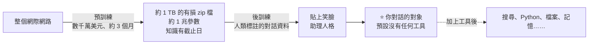
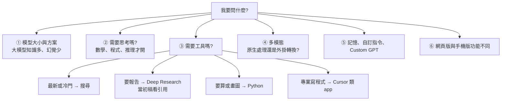

# Karpathy〈How I use LLMs〉:你在跟一個「1 TB 的壓縮檔」說話——一般人用 LLM 的完整心智模型

**主題分類:** 科技 / AI 生產力 — LLM 使用心法、工具選擇、多模態
**來源:** Andrej Karpathy〈[How I use LLMs](https://www.youtube.com/watch?v=EWvNQjAaOHw)〉(2025-02-27,約 2 小時 11 分)
**素材取得:** 使用者提供的本機檔案 `new/karpathy_8years_conclusion/Callan_-_Andrej_Karpathy_spent_8_years_at_OpenAI_and_Tesla_Last_week_he_cond_4JC4JH.mp4`(1.1 GB、129 分鐘,**缺原片開頭約 3 分鐘**);**原片無官方字幕,逐字稿以 CPU faster-whisper 轉錄、非官方字幕**。
**整理日期:** 2026-09-29

> ⚠️⚠️ **這支影片在社群上被錯誤包裝過,先校正:**
> 素材檔名來自 X 上一批爆紅貼文:「**Karpathy 在 OpenAI 與 Tesla 待了 8 年,上週把畢生所學濃縮成一堂免費 2 小時課程——Agents → Loops → Graphs → Self-Improving Systems**,比 1.5 萬美元的 bootcamp 還好。」
> - ❌ **不是「上週」**:這是 **2025 年 2 月 27 日**發布的影片,2026 年 8 月前後被大量轉貼成「新課程」。
> - ❌ **內容也不是「Agents → Loops → Graphs → Self-Improving Systems」**:它是給一般使用者的**實用操作導覽**——ChatGPT、Claude、Gemini、Grok、Perplexity、Cursor、NotebookLM 等工具**怎麼用、什麼時候用哪個**。
> - ✅ 它確實免費,也確實值得看;只是**要知道自己在看什麼**。
>
> ⏳ **時效提醒:** 片中的模型與功能是 **2025 年 2 月**的狀態(GPT-4o、o1 pro、Claude 3.7 Sonnet 剛發布、Grok 3……)。**心智模型與使用原則仍然適用,但「哪個工具有什麼功能」大多已經變了**(見 §9)。

---

## TL;DR

1. ⭐⭐⭐ **你在跟一個壓縮檔說話:** 預訓練把整個網路壓成「約 1 TB、有損、機率式的 zip 檔」(知識,會過時);後訓練替它貼上「助理人格」(風格)。**預設它沒有計算機、沒有瀏覽器、沒有 Python**。
2. ⭐⭐ **上下文視窗 = 工作記憶:** 換話題就開新對話——舊 token 會**分散注意力、降低準確度,還讓每一步略貴略慢**。
3. ⭐⭐ **知道自己在用哪個模型、哪個方案**:免費版可能是小模型;大模型知識多、寫作好、幻覺少。
4. ⭐⭐ **思考模型(RL 訓練)**:數學、程式、推理題才開;旅遊建議這種不需要等一分鐘。**先用不思考的,答不好再切。**
5. ⭐⭐⭐ **工具:** 最新或冷門資訊 → **搜尋**;需要一份研究報告 → **Deep Research**(但一律當**初稿**,要看引用);讀論文、讀書 → **上傳文件一起讀**;算數 → **Python 直譯器**(沒有工具的模型會在腦中「幻覺」出很接近但錯的答案)。
6. ⭐⭐ **程式:** 專業寫程式不去網頁複製貼上,用 **Cursor 這類有檔案上下文的 app**;他在這裡提到「**vibe coding——這個詞可能是我創的**」。
7. ⭐⭐ **多模態:** 他自己約**一半提問用語音**(手機上約 8 成);分清楚「**假語音**」(語音轉文字再轉回)和「**真語音**」(模型直接處理音訊 token)。
8. ⭐ **生活品質功能:** 記憶、自訂指令、Custom GPTs(本質上就是**存起來的 few-shot 提示**)。

---

## 1. ⭐⭐⭐ 心智模型:你在跟什麼東西說話



**Karpathy 替 ChatGPT 寫的自我介紹:**
> 「嗨,我是 ChatGPT。**我是一個 1 TB 的 zip 檔。**我的知識來自網際網路,**大約半年前我把它整個讀過一遍,只記得模糊的樣子**。我迷人的個性是 OpenAI 的人類標註員**用範例程式化**出來的。」

| 性質 | 意涵 | 怎麼用 |
|---|---|---|
| **知識有截止日** | 預訓練太貴,不常重做 ⇒ 模型「有點過時」 | 最近的事一定要**搜尋** |
| **記憶是機率式、模糊的** | **網路上常出現的東西記得清楚,冷門的記不清**——跟人很像 | 常見知識可以直接問;冷門或高風險的要查一手來源 |
| **預設沒有工具** | 沒有計算機、瀏覽器、Python | 看清楚 app 有沒有接工具 |

### 他怎麼判斷「可以直接問」

| 例子 | 為什麼可以 | 他怎麼驗證 |
|---|---|---|
| 一杯美式有多少咖啡因?(約 63 mg) | 不是新資訊、網路上**非常常見** | 查一手來源確認 |
| 流鼻水吃 DayQuil 還是 NyQuil? | 常見藥物、**不是高風險情境** | **把藥盒拿出來對成分** |

> ⭐ 「**我不保證這是對的,這只是它對網路的模糊回憶。**」

---

## 2. ⭐⭐ 兩條基本功

### 2.1 換話題就開新對話

> 「**把上下文視窗裡的 token 當成珍貴資源。**」

| 舊 token 太多的代價 | 說明 |
|---|---|
| **① 分散注意力** | 模型在後面取樣時可能被前面無關的內容干擾,**降低準確度** |
| **② 稍微更貴、更慢** | 視窗越長,算下一個 token 的成本越高 |

### 2.2 知道你用的是哪個模型

- 沒登入或免費方案**可能是小模型**(例如當時的 GPT-4o mini):創意較差、知識較少、**較容易幻覺**。
- 他自己付 ChatGPT **Pro(每月 200 美元)**,「因為寫程式很多,這對我來說還是很便宜」。
- ⭐ **「LLM 議會」(LLM council):** 他常付好幾家,**同一個問題問所有模型**再比較——例如問去哪裡度假,Claude 和 Gemini 都推薦了瑞士策馬特,他就真的去了。

---

## 3. ⭐⭐ 思考模型:什麼時候值得等

- 訓練第三階段是**強化學習**:模型在大量數學、程式題上練習,**自己發現有效的思考策略**(嘗試、回頭、重新檢查假設)——這些很難由人類標註員直接寫死。他引用 DeepSeek R1 論文為第一篇公開討論的。
- **實例:** 他的梯度檢查(gradient check)失敗,GPT-4o(不思考)列了一堆「可以檢查的東西」但都沒抓到核心;**o1 pro 想了約 1 分鐘,找到參數打包/解包的順序不一致**。
  - 有趣的是:**Claude 3.5 Sonnet(當時不是思考模型)也答對了**;Gemini、Grok 3、Perplexity 上的 DeepSeek R1 也都解出來。

> ⭐ 他的做法:「**我通常先用不思考的模型,因為回得很快。懷疑答得不夠好時,才切到思考模型。**」

---

## 4. ⭐⭐⭐ 工具:讓模型不只靠模糊記憶

### 4.1 網路搜尋

**機制:** 模型輸出一個特殊的「搜尋」token → app 暫停取樣、去搜尋、把網頁內容**塞進上下文視窗** → 模型根據這些內容回答。

**他用搜尋的判斷標準:**
> 「**只要我預期答案可以靠 Google 搜尋、點前幾個連結找到,就用搜尋工具。**」尤其是:**最近的事、會變動的事、冷門的事**。

| 他的實際查詢 | 為什麼用搜尋 |
|---|---|
| 今天股市有開嗎?(總統日) | 時效性 |
| 《白蓮花度假村》第三季在哪拍? | 冷門 + 新 |
| Vercel 有提供 PostgreSQL 嗎? | 產品會變 |
| 明天蘋果發表會有什麼傳聞? | 最新 |
| Palantir 股價為什麼在漲? | 最新 |
| 去越南旅行安全嗎? | 會隨時間改變 |
| Twitter 上一直在吵的 USAID 是怎麼回事? | ⭐ **看到熱門話題想知道來龍去脈**——單則推文往往缺乏完整脈絡 |

(當時 Claude 還沒有搜尋功能、Gemini 2.0 Pro 實驗版也沒有;他提醒**不同模型、不同 app 的工具整合程度不一**。)

### 4.2 Deep Research

- **= 搜尋 + 思考,跑很久**(數十分鐘),產出一份像客製研究報告的東西,附引用。
- 範例:研究 Bryan Johnson 長壽配方裡的 **Ca-AKG**——人體/動物研究、可能機制、安全疑慮。ChatGPT 想了約 5 分鐘、看了 27 個來源。
- 他當時的評價:**ChatGPT 的版本最完整、最好讀**;Perplexity 與 Grok 的 DeepSearch 較短。
- ⚠️ **失敗案例:** 請它列美國 LLM 實驗室的規模與融資表——**漏了 xAI、把 Hugging Face 和 EleutherAI 算進去**,數字也不可全信。

> ⭐⭐⭐ 「**任何內容隨時都可能是幻覺、捏造或誤解。所以引用很重要。把它當成初稿、當成要去讀的論文清單,不要當成定論。**」

### 4.3 上傳文件:跟 LLM 一起讀

- 上傳 PDF 時,**圖片很可能被丟掉**,PDF 大多被轉成純文字放進上下文。
- **讀論文:** 例如 Arc Institute 的 DNA 語言模型論文(Evo 2),先要摘要,再邊讀邊問。
- ⭐ **讀書:** 「**我現在幾乎不再獨自讀書了。**」例:讀亞當·斯密《國富論》(1776),從古騰堡計畫複製章節貼給 Claude,先要摘要、再邊讀邊問。
  - 為什麼要貼原文:**模型「知道」國富論,但不記得那一章的細節**——把原文放進上下文,等於提醒它。
  - 特別適合**其他領域的文件**(生物)或**很久以前的文本**。
- 他當時的抱怨:「**沒有工具能讓我在閱讀時直接選取段落發問**,我只能笨拙地來回複製貼上。」

> ⭐ 「**Don't read books alone.**」

### 4.4 Python 直譯器

| 模型 | 問一個大數乘法時 |
|---|---|
| ChatGPT | ✅ 自動寫 Python 算 |
| Claude | ✅ 寫 **JavaScript** 算 |
| Grok 3 | ⚠️ **在腦中算,非常接近但錯了** |
| Gemini 2.0 Pro | 較小的數在腦中算對;**加大就錯** |

> ⭐ 「**不同 LLM 有不同的工具可用,你得自己記住。沒有工具時,它們會盡力而為——也就是可能幻覺出一個結果給你。**」

### 4.5 ChatGPT 進階資料分析:「很資淺的資料分析師」

範例:搜尋 OpenAI 歷年估值 → 畫對數圖 → 擬合趨勢線外推到 2030。
- ⚠️ **陷阱一:** 2015 年資料是「未知」,它在程式裡**偷偷填了 0.1(1 億美元)**,沒告訴你。
- ⚠️ **陷阱二:** 它說 2030 年約 **1.7 兆**,但圖上的變數其實是**約 20 兆**——被抓包後才道歉。

> ⭐ 「**我自己熟程式,每次都會讀它的程式碼。如果你讀不懂、沒辦法驗證,我會猶豫要不要推薦你用這些工具。**」

### 4.6 Claude Artifacts 與圖表

- **Artifacts:** 例:把亞當·斯密的維基百科介紹做成 20 張閃卡,再請 Claude **寫一個 React 閃卡 app** 直接在瀏覽器裡跑——「**不是工程師寫好 app 給你客製,而是 Claude 直接為你寫一個 app**」(但沒有後端、沒有資料庫)。
- ⭐ **他自己真正常用的:畫概念圖。** 「請為這一章畫一張概念圖」→ Claude 用 **Mermaid** 畫出論證結構(國富論第一卷第三章:分工受市場規模限制 → 水運比陸運容易 → 靠水運的早期文明繁榮)。
  > 「如果你是視覺型思考者,**任何東西都能畫成圖:書、章節、原始碼**。」

📎 本庫的每篇筆記都搭配 Mermaid,就是同一個做法。

---

## 5. ⭐⭐ 寫程式:離開網頁,用有上下文的 app

> 「我大部分時間在寫程式,但**不會去 ChatGPT 要程式碼片段——太慢了,它沒有跟我專業合作寫程式的上下文**。」

| 演進 | 快捷鍵 | 功能 |
|---|---|---|
| 第一代 | Cmd+K | 「把這行改成……」 |
| 第二代 | Cmd+L | 「解釋這段程式」 |
| ⭐ 當時 | Cmd+I(**Composer**) | **在你的程式庫上當自主 agent**:執行指令、跨檔案修改 |

- 示範:用 Cursor(底層呼叫 **Claude 3.7 Sonnet** API)從零建一個井字遊戲,再要求「有人贏時放彩帶」——它自己裝了 `react-confetti`、加樣式,還去**下載了一個勝利音效**(「我不知道那個網址從哪來的」)。
- ⭐ 「**這叫 vibe coding——這個詞我可能是創造者。**」意思是**把控制權交給 Composer,只告訴它要做什麼,然後希望它能動**。
- ⚠️ 「**最壞的情況,你隨時可以退回傳統寫程式**——因為所有檔案都在這裡。」

📎 關於 vibe coding 之後的演進,見本庫 [[karpathy-software-3-0]]。

---

## 6. ⭐⭐ 多模態:語音、圖片、影片

### 6.1 語音:「假語音」vs「真語音」

> ⭐ 「我大約**一半**的提問是用說的,**手機上大概 8 成**——因為我懶得打字。」

| 類型 | 原理 | 例子 |
|---|---|---|
| **假語音** | 語音 → 文字 → 模型 → 文字 → 語音(外掛轉換模型) | 手機上的麥克風鍵;電腦上用系統級聽寫 app(他用 **SuperWhisper**,綁 F5 鍵) |
| **真語音** | 把音訊切成頻譜、量化成**音訊 token**(例如 10 萬種),**模型直接聽與說**,中間沒有文字 | ChatGPT **Advanced Voice Mode**(當時)、Grok 的語音模式 |

- 真語音能做假語音做不到的事:**用尤達、海盜的聲音說話、講故事、極快地數數**。
- ⚠️ 他的吐槽:ChatGPT 的進階語音「**非常拘謹**,拒絕很多事」(明明剛發出牛叫聲,卻說自己不能模仿狐狸叫);Grok 的語音模式則有各種「放飛」人格。
- **他的建議:產品名、函式庫名這類容易聽錯的,還是打字**;日常問題用說的就好。

📎 本庫 [[voice-input-ai-context-transformation]] 對語音輸入有更完整的討論。

### 6.2 NotebookLM:客製 Podcast

- 上傳來源(PDF、網頁、文字)→ 可以對話,也可以**一鍵生成約 30 分鐘的雙人 podcast**,還能「互動模式」中途插話提問。
- 他的用法:**散步或長途開車時,聽自己有興趣但不是專家的冷門主題**——「人類做的 podcast 不會涵蓋這麼小眾的主題」。他還把一系列生成的節目放上 Spotify(〈Histories of Mysteries〉)。

### 6.3 圖片輸入:先轉錄,再提問

> ⭐ **兩步驟:**「我喜歡**先讓它把相關資訊轉成文字**,確認它看到的數值是對的,**再**針對文字提問。」

| 例子 | 做法 |
|---|---|
| 長壽配方營養標示 | 轉成表格 → 依成分分組、依可能的安全性排序 |
| ⭐ **血液檢查報告**(20 頁 PDF) | 分段截圖上傳 → 確認數字 → 請它解讀;「**血檢不是冷門知識,我比較放心;但當然還是要跟真正的醫生談**」 |
| 高露潔牙膏成分 | 問哪些是必要功能成分、哪些可以不要 |
| 迷因 | 請它解釋笑點(一群烏鴉叫 murder → 「企圖謀殺」) |

**Mac 小技巧:** `Ctrl+Shift+Cmd+4` 框選螢幕區域到剪貼簿,直接貼進對話。

### 6.4 圖片、影片輸出

- 圖片生成(當時 DALL·E 3、Ideogram):**他用來做 YouTube 縮圖與圖示**;當時 DALL·E 其實是「模型先寫描述,再交給另一個圖片模型」,不是模型原生產生。
- 影片輸入:手機進階語音可以開鏡頭,邊指邊問(認出書、CO₂ 偵測器、中土世界地圖)——「**我不太用,但會拿來示範給父母或祖父母**」。
- 影片生成:當時覺得 **Veo 2** 接近最佳。

---

## 7. ⭐ 生活品質功能

| 功能 | 說明 | 他的用法 |
|---|---|---|
| **記憶** | 模型寫下關於你的小段文字,存進「記憶庫」,**之後每次對話都預先放進上下文**;可編輯、刪除 | 久了會越來越懂你;例:電影推薦 |
| **自訂指令** | 全域設定模型怎麼跟你說話 | 「**不要像 HR 業務夥伴那樣說話,正常跟我說就好**」「盡量有教育性」;學韓文時指定敬語程度 |
| ⭐ **Custom GPTs** | **本質上就是把常用提示存起來**,每次只換輸入 | 全部都跟學韓文有關(見下) |

### Custom GPT 的做法:few-shot 提示

| 他的 GPT | 功能 |
|---|---|
| **韓文單字擷取器** | 給一句話 → 輸出「韓文;英文」格式的字典形單字,**可直接貼進 Anki** |
| **韓文詳細翻譯器** | 先整句翻譯,再**逐片段拆解**對應(Google 翻譯常省略助詞);還能追問 |
| **韓綜字幕截圖翻譯** | 截圖《單身即地獄》燒在畫面裡的字幕 → OCR → 翻譯 → 拆解 |

> ⭐⭐ 「**我給 LLM 指令時,一定會先描述任務,再給具體範例**——這叫 **few-shot 提示**,我發現它**總是能提高準確度**。」
> 「就像教人一樣:用說的可以,但**示範給他看**好得多。」
> 他用 **XML 風格的標籤**標出範例的開頭與結尾,讓模型分得清楚。

---

## 8. 總結:挑選與使用 LLM 時要追蹤的六件事



> ⭐ 他的當時結論:「**ChatGPT 是現任者、功能最多,是很好的預設**;但其他家在特定地方已經追上甚至超越——搜尋他仍用 Perplexity、做小 app 與圖表用 Claude Artifacts、想聊天用 ChatGPT 進階語音、嫌它拘謹就換 Grok。」

---

## 9. ⏳ 2025-02 → 2026-09:哪些過時了,哪些沒有

| 片中狀態(2025-02) | 需要更新的地方(概略,細節請查各家官方) |
|---|---|
| Claude **沒有**搜尋、當時剛推出 3.7 與思考模式 | 之後各家主力產品大多已整合搜尋與思考模式;模型世代也已多次更替 |
| 「記憶功能**只有 ChatGPT 有**」 | 其他家也陸續推出記憶類功能 |
| 「沒有工具能在閱讀時直接選取段落發問」 | 已有許多閱讀器、瀏覽器擴充與 AI 原生閱讀工具 |
| Cursor Composer 是 agent 寫程式的代表 | 之後出現大量 CLI 與桌面 coding agent(本庫 `knowledge/technology/claude-code/` 等有許多筆記) |
| Deep Research 需要 200 美元方案 | 各家方案與額度多次調整 |

**⭐ 沒有過時的部分(本文認為是這支影片真正的價值):**
1. **「壓縮檔」心智模型**——知識模糊、有截止日、常見的記得清楚。
2. **換話題開新對話、把上下文當珍貴資源。**
3. **知道自己用哪個模型、有沒有工具**;沒工具時它會「盡力而為」= 可能幻覺。
4. **Deep Research、資料分析的產出都是初稿**,要看引用、讀程式碼。
5. **圖片先轉錄、確認,再提問。**
6. **few-shot:描述任務 + 給範例。**

📌 **背景:** 據 CNBC 報導,Karpathy 已於 **2026 年 5 月加入 Anthropic**;這支影片是他在 Eureka Labs 時期、面向一般觀眾系列的第二支(第一支是〈Deep Dive into LLMs like ChatGPT〉)。

---

## 10. 應用案例

### 案例一:一週的 LLM 使用分流表(照影片原則)

| 情境 | 用什麼 | 關鍵動作 |
|---|---|---|
| 「這個 API 現在還支援嗎?」 | 搜尋 | 點開引用確認 |
| 評估兩款筆電 | Deep Research | 當初稿,挑 2–3 個來源自己讀 |
| 讀一篇陌生領域論文 | 上傳 PDF | 先摘要、再邊讀邊問、最後請它畫概念圖 |
| 算房貸或整理報表 | Python / 資料分析 | **讀它寫的程式碼**,檢查有沒有偷偷補值 |
| 修一個卡了一小時的 bug | 先一般模型 → 不行再開思考模型 | 同一題丟給 2–3 家比較(LLM 議會) |
| 開車時想了解某個冷門主題 | NotebookLM podcast | 上傳 3–5 份來源 |

### 案例二:把自己重複的提示做成 few-shot 工具

例:每天要把會議逐字稿整理成待辦清單。
1. **描述任務**:「從逐字稿中擷取待辦事項,格式為:負責人|事項|期限;沒有期限就寫『未定』。」
2. **給 3 個範例**,用標籤包起來:
   ```xml
   <example>
   <input>……小王說下週三前把報價單寄給客戶……</input>
   <output>小王|寄報價單給客戶|下週三</output>
   </example>
   ```
3. 存成 Custom GPT / Claude Project / 自己的 skill,之後只貼逐字稿。

### 案例三:用「壓縮檔」模型判斷要不要信

問 LLM 一個問題前,先問自己兩件事:
- **這個知識在網路上常見嗎?**(常見 → 記得較清楚)
- **這是最近才發生或會變動的嗎?**(是 → 一定要搜尋)
- 再加一條:**答錯的代價高嗎?**(高 → 查一手來源,像他去對藥盒成分)

---

## 來源

- 原始影片:[How I use LLMs](https://www.youtube.com/watch?v=EWvNQjAaOHw)(Andrej Karpathy,2025-02-27)——**原片無官方字幕,本文逐字稿以 CPU faster-whisper 轉錄自使用者提供的本機檔案 `new/karpathy_8years_conclusion/`,非官方字幕**
- 爆紅轉貼範例(說法有誤,僅供辨識來源):[X 貼文一](https://x.com/LunarResearcher/status/2088613309041852892)、[X 貼文二](https://x.com/kaorixbt/status/2093722881972682867)、[YouTube 轉貼](https://www.youtube.com/watch?v=3CRtS3bY_D4)
- Karpathy 加入 Anthropic:[CNBC(2026-05-19)](https://www.cnbc.com/2026/05/19/anthropic-hires-openai-cofounder-andrej-karpathy-former-tesla-ai-lead.html)
- 片中提到的工具:[Tiktokenizer](https://tiktokenizer.vercel.app/)、[ChatGPT](https://chatgpt.com/)、[Claude](https://claude.ai/)、[Gemini](https://gemini.google.com/)、[Grok](https://grok.com/)、[Perplexity](https://www.perplexity.ai/)、[NotebookLM](https://notebooklm.google.com/)、[Cursor](https://www.cursor.com/)、[Excalidraw](https://excalidraw.com/)
- 片中提到的論文:[DeepSeek-R1(arXiv 2501.12948)](https://arxiv.org/abs/2501.12948)

📎 相關筆記:[[karpathy-software-3-0]]、[[llm-wiki-karpathy]]、[[voice-input-ai-context-transformation]]、[[multi-tool-ai-workflow]]

**Whisper 專有名詞還原對照:** ChaChiPT/Chashi PT/Cheshire PT/Chachi BD → ChatGPT;Claud/Cloud → Claude;GPT-40 → GPT-4o;Grock/GROC → Grok;perplexly/Proplexity → Perplexity;DeepSeq → DeepSeek;Curser/Cursure → Cursor;SuperWhiskr → SuperWhisper;Dali/Dolly → DALL·E;VO2 → Veo 2;CAAKG/CA AKG → Ca-AKG;NICOL → NyQuil;Both of Nations → Wealth of Nations。
