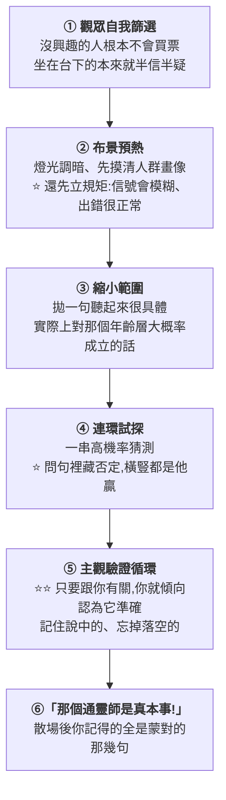
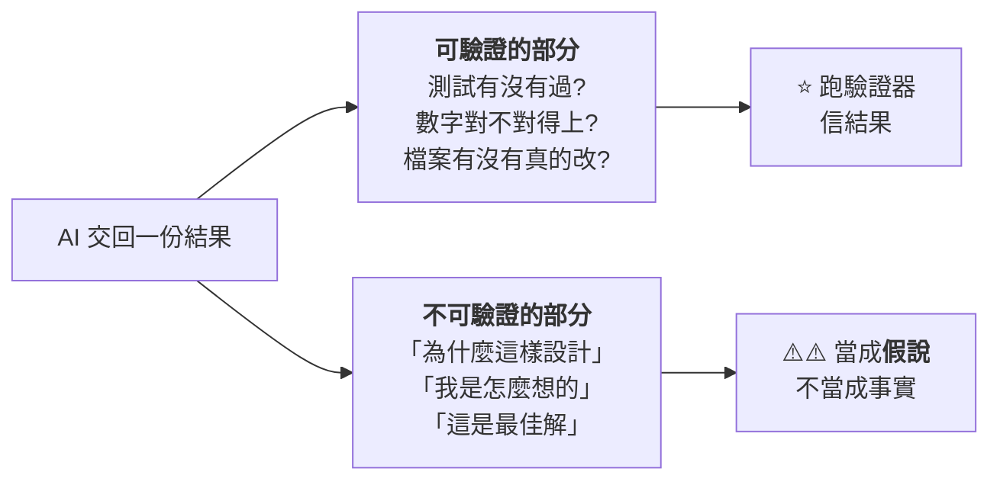

# LLMentalist 效應:AI 像通靈師一樣「冷讀」你,以及驗證器能管到哪裡為止

> 整理自 YouTube 頻道 **Why QQ**〈[三年前旧文高赞冲上HN,AI是什么?读心术?如何用好AI?](https://www.youtube.com/watch?v=I3bnBM4vNnY)〉(2026-09-24,約 9.9 分鐘,官方 zh-Hans 字幕)。
>
> ⭐⭐ **本文已讀 Baldur Bjarnason 的[原文〈The LLMentalist Effect〉](https://softwarecrisis.dev/letters/llmentalist/)核實**:
> 兩個選項、六個步驟、RLHF 的論點、占星師的故事都對得上;
> ⚠️ **但抓到一處:影片說「心理學研究發現自認聰明的人更容易上當」,原文其實沒有引用任何研究**(見 §七)。
>
> ⚠️ **這是一篇 2023 年的評論文章,不是實證研究。** 作者的立場很鮮明,本文照錄它的論點,也照錄反對方的聲音。

---

## 一句話總結

> ⭐⭐⭐ **影片最後兩句話本文認為最值得帶走:**
> **「說得像人不算本事,經得起驗證才算。」**
> **「無法驗證的那一部分,永遠給自己的判斷留個問號。」**

---

## 一、⭐ 這篇文章在問什麼

**Baldur Bjarnason 在 2023-07-04 寫下〈The LLMentalist Effect〉,擺了兩個選項(✅ 原文已核實):**

| 選項 | 內容 |
|---|---|
| **A** | **科技業無意間造出了一種全新的心智,原理完全未知** |
| ⭐ **B**(作者選這個) | **「智能的幻覺在使用者的腦子裡,不在 LLM 本身」** |

> **作者的意思是:大模型的回答只是統計上合理的文字接龍;
> **你覺得它理解你,這個「理解」發生在你的腦子裡,模型從頭到尾沒有參與**。**

📌 **這篇文章 2025 年 2 月上過一次 Hacker News(144 分、133 則留言),2026-09-20 又被頂上首頁(222 分、300 多則留言)。**
⚠️ **本文未回溯 HN 原帖核對這些數字。**

---

## 二、⭐⭐⭐ 冷讀術:通靈師不需要知道你任何事

> **「他只要說一些**統計上對大多數人都成立**的話,剩下的部分由你自己把意義補進去。」**

### ⭐ 這套話術有實驗背書:Forer 效應

> **心理學家 Bertram Forer 給全班學生做性格測試,然後發給每個人**同一份**描述 —— 全是從星座書抄來的套話。
> 學生給「貼合度」打分,**滿分 5 分,平均約 4.3 分**。**

📌 **本文補充:Forer 的研究發表於 1949 年,平均分為 4.26。⭐ 這組數字是影片補的,原文沒有提。**

### ⭐⭐⭐ 通靈師的六個步驟(✅ 原文已核實)

**⭐ 第④步那招特別陰險:**

> **他問:「你不彈鋼琴吧?」你說「對」—— 他說「我就知道」;你說「彈」—— 他說「我就覺得你彈」。**

**⭐ 第⑤步的「Forer 語句」:**

> **「你對自己要求一直很高。」—— 聽起來量身訂做,實際上幾乎人人點頭。**

**⭐⭐ 最狠的一點(✅ 原文已核實):很多通靈師把自己也騙了。**

> **原文記了一位占星師:他後來才發現自己**排錯了星盤**,客戶照樣大呼準確 —— 他因此才明白冷讀的真正機制。**

---

## 三、⭐⭐⭐ 作者的主張:六個步驟原樣套在聊天機器人身上,每一步都對得上

| 通靈師 | 聊天機器人(作者的對照) |
|---|---|
| **① 觀眾自我篩選** | **不信 AI 的人根本不打開對話框** |
| **② 布景預熱 + 先立規矩** | ⭐ **鋪天蓋地的 AGI 宣傳完成了預熱;廠商那句「可能產生幻覺、仍在早期階段」恰好成了出錯時的現成藉口** |
| **③ 摸到觀眾資訊** | **你敲下的 prompt** |
| **④ 句句針對你** | **實際上是統計上最可能的續寫 —— 靠訓練資料鋪得夠廣,總能拼出像樣的回應** |
| **⑤ 主觀驗證循環** | ⭐⭐ **一輪輪聊下去,越聊越覺得它懂你** |

### ⭐⭐ 作者最毒辣的一個觀察:RLHF

**✅ 原文已核實:**

> **「提供這些回饋的工作者,大多數甚至全部都是低薪勞工 ……
> 他們**幾乎完全依據語氣與句子結構**來為對話排序。」**
>
> ⭐⭐ **作者據此推論:RLHF「實際上變成了一套專門優化語言模型**產出認可性語句**的獎勵系統」。**

> ⭐ **影片的轉述很清楚:「語氣自信、結構完整、態度肯定就拿高分,事實錯一點沒關係,只要氣勢對。」**

⚠️⚠️ **影片也提醒了時效性,本文照錄:**
**「這是他 2023 年針對當時聊天模型的批判 —— 今天的後訓練早已不止早期 RLHF 這一條路。」**

📎 **本庫 [[system-one-models-jev-calibrated-decisions]] §四記了另外兩種後訓練目標:
**RLVR 優化「答案對不對」、RLCD 優化「機率要誠實」** —— 正好是對「只優化語氣」這個批評的兩種回應。**

---

## 四、⭐⭐⭐ 三年後:被討論的對象換了

> **2023 年作者批評的是 chatbot:你給一段 prompt,模型回一段話,判斷它聰不聰明**只能靠你的主觀感受** —— 冷讀效應在這個場景裡確實無解。**
>
> ⭐⭐ **但 2026 年工程師日常用的,越來越多是**整個 Agent 系統**:
> 模型外面包著一層 harness,掛著記憶、工具、程式碼庫與環境。**

> ⭐⭐⭐ **影片提了一個值得停下來想的問題:
> **「你說『AI 完成了這個任務』,你說的到底是模型,還是這一整套系統?」****

### ⭐⭐⭐ 這套系統帶來了 2023 年沒有的東西:外部驗證器

| 場景 | 驗證器 |
|---|---|
| **改完程式** | ⭐ **跑一遍測試,47 個用例全過 —— bug 修沒修,環境說了算** |
| **遊戲裡出牌** | **環境執行、回傳獎勵;連續決策一百次,分數曲線擺在那裡** |

> ⭐⭐ **HN 上有人一句話點破:「通靈師缺的,恰恰是這種**可驗證的回饋機制**,再加上無限次重試。」**(⚠️ 社群評論)
>
> ⭐⭐⭐ **影片最漂亮的一句:「**冷讀術在劇院裡無敵,但它從來沒通過過一次單元測試**。」**

📎 **這與本庫 [[rsi-recursive-self-improvement-anthropic]] §9.5 的「所有 RSI 路線最後都卡在驗證器」、
[[cloudflare-security-audit-skill-pipeline]] 的「驗證者不能是發現者」是同一條線。**

---

## 五、⚠️⚠️⚠️ 但驗證器只管得到它能驗證的那一部分

| ✅ 有驗證器 | ⚠️ 沒有驗證器 |
|---|---|
| **「程式碼通過測試」** | **「所以這個架構是最合理的」** |
| **「數學答案驗算無誤」** | **「我的推理過程準確描述了我是怎麼得到答案的」** |

> ⚠️⚠️ **「現實裡的 Agent 經常處於混合態:**分析得頭頭是道、理由全是編的,但程式碼真的能跑**。
> 它做對了一件事,同時完全談不上知道自己為什麼做對。」**
>
> ⭐⭐⭐ **「驗證器沒有讓讀心術效應消失 —— 它只是把這個效應**推到了可驗證邊界之外**。
> 而邊界之外的輸出,照樣流暢、自信、貼心。」**

---

## 六、⭐⭐⭐ 一個工程定義:工具的關鍵是可靠性,不是有沒有智能

> ⭐⭐ **HN 上有人問:「如果 LLM 能力越來越強,我們又一直說它只是個工具,這兩件事矛盾嗎?」**
>
> **影片引用的一個工程定義很漂亮:**
> **「工具的關鍵從來不看有沒有智能,看的是**可靠性** —— 給定同樣的輸入,它產生的效果**可以理解、可以預期、可以重複**。」**

### ⭐⭐⭐ 評價一個 AI 系統,其實就三件事

| 維度 | 問題 |
|---|---|
| **能力** | **它**偶爾**能做到什麼?** |
| ⭐ **可靠性** | **它能不能**穩定**做到?** |
| ⭐⭐ **可驗證性** | **我們**怎麼知道**它做到了?** |

> ⭐⭐ **「以後拿到 AI 的輸出,先問這三件事,比問它聰不聰明有用得多。」**
> **「對工程師來說,最值錢的問題恐怕是:它穩不穩定。」**

### ⭐ HN 評論區為什麼吵了 300 多樓:其實是在吵三個不同的問題

| 派別 | 在意什麼 |
|---|---|
| **看行為** | **能完成任務就夠了,機器內部有沒有心智沒那麼重要**(有人直接拉回圖靈測試) |
| **看工程** | **承認能力是真的,但重點在**可靠性**:穩定、可預期、可驗證** |
| **原文依然成立** | **長對話之後把模型當成智能主體的傾向,到今天還存在** |

> ⚠️ **以上皆為社群評論的歸納,不是研究結論。**

### ⭐⭐⭐ 錯覺升級了:從「它理解我」到「它是同一個人」

> **HN 一條評論點得很深:**
> **2023 年,我們覺得「它真的理解我」—— 這可能是讀心術效應。**
> **2026 年,模型確實能完成相當複雜的任務,但新的擬人化錯覺變成了:
> **「它認識我、它有自己的想法、昨天那個它和今天這個它是同一個主體」**。**
>
> ⭐⭐⭐ **「實際上,這種連續人格大部分來自 system prompt、記憶、對話歷史與工具狀態 —— **是 harness 造出來的效果**。」**
>
> ⭐⭐ **「三年前我們高估的可能是智能;今天我們更容易高估的,是**主體性**。」**

📎 **本庫 [[supermemory-memory-layer]] 講的「畫像注入系統提示詞,模型開口前就知道你是誰」,正是這種「連續人格」的具體工程來源之一。**

---

## 七、⚠️ 本文核實後的補正

| 影片說法 | ⭐ **原文實際** |
|---|---|
| ⚠️⚠️ **「心理學研究發現,自認為聰明的人反而更容易上當」** | ⚠️⚠️ **原文**沒有引用任何研究** —— 這是作者自己的論點:自認聰明的人會調動才智去合理化模糊的話。**本文把它當作者的主張看待,不當研究結論** |
| **Forer 1948 年、平均 4.3 分** | ⭐ **原文沒提 Forer 的數字**(只舉了「你對自己要求很高」這類語句當例子);這組數字是影片補的。⭐ **一般引用為 1949 年發表、平均 4.26 分** |

---

## 應用案例

### 案例 1|⭐⭐⭐ 拿到 AI 的輸出,先把它拆成「可驗證」與「不可驗證」兩半

> ⭐⭐ **實際做法:code review 時,對「測試全過」給高信任;對 AI 附上的「這個設計是因為……」給低信任 ——
> **理由要你自己重新推一遍才算數**。**

### 案例 2|⭐⭐ 小心那些「聽起來量身訂做」的回答

**一個自我檢查:把 AI 剛剛對你說的那句「很懂你」的話,換成別人的情境再讀一次。**

| 如果…… | 代表 |
|---|---|
| **放在任何人身上都成立** | ⚠️ **那是 Forer 語句,不是它懂你** |
| **只對你的具體情況成立,而且可以查證** | ⭐ **這才是真的用上了你給的資訊** |

### 案例 3|⭐⭐⭐ 評估一個 AI 工具時,用「能力 / 可靠性 / 可驗證性」三欄打分

| 欄位 | 怎麼測 |
|---|---|
| **能力** | **挑最難的案例,看它**做不做得到**** |
| ⭐ **可靠性** | ⭐⭐ **同一個輸入跑 5–10 次,看結果**散不散**** |
| ⭐⭐ **可驗證性** | **它的輸出有沒有辦法被機械地檢查?沒有的話,你要花多少人力去確認?** |

> ⭐⭐⭐ **大多數試用只測了第一欄。第二、三欄才決定它能不能放進你的日常流程。**

📎 **「同一題跑多次看散不散」這個作法,本庫 [[xiaomi-mimo-v26-rl-live-dashboard-scaling]] 的動態採樣與
[[astra-vs-fable-find-bugs-vs-fix-bugs]] 的「單次測試差兩分等於平手」都有提到。**

---

## 重點回顧(TL;DR)

1. **Baldur Bjarnason 2023 年的〈The LLMentalist Effect〉**:聊天機器人的「智能」與通靈師的冷讀術用的是同一套機制 —— **智能的幻覺在使用者腦子裡,不在模型裡**。
2. ⭐⭐ **冷讀術不需要知道你任何事**:說統計上對多數人成立的話,剩下由你自己補意義(Forer 效應:同一份套話,學生給貼合度打平均約 4.3 / 5 分)。
3. ⭐⭐⭐ **通靈師六步**:觀眾自我篩選 → 布景預熱並先立好出錯藉口 → 縮小範圍 → 連環試探 → **主觀驗證循環** → 散場時只記得說中的。**很多通靈師把自己也騙了。**
4. ⭐⭐ **作者認為六步原樣對得上聊天機器人**:廠商的「可能產生幻覺」恰好是出錯時的現成藉口;**早期 RLHF 由低薪標註員依語氣與結構打分,等於在優化「聽起來對」**。⚠️ 這是 2023 年的批判,今天的後訓練已不止這一條路。
5. ⭐⭐⭐ **2026 年的變化:對象從 chatbot 換成整個 Agent 系統,多了外部驗證器** —— 「冷讀術在劇院裡無敵,但從來沒通過過一次單元測試」。
6. ⚠️⚠️⚠️ **但驗證器只管得到它能驗證的部分**:「程式能跑」可驗證,「所以這個架構最合理」不可驗證。**驗證器沒讓讀心術效應消失,只是把它推到可驗證邊界之外。**
7. ⭐⭐⭐ **評價 AI 系統的三件事:能力(偶爾做到什麼)、可靠性(能不能穩定做到)、可驗證性(怎麼知道做到了)。** 比問「聰不聰明」有用得多。
8. ⭐⭐ **錯覺升級了**:三年前高估的是**智能**,今天更容易高估的是**主體性** —— 「它認識我、昨天和今天是同一個它」大多是 system prompt、記憶與工具狀態造出來的。
9. ⚠️ **本文補正**:影片說「心理學研究發現自認聰明的人更易上當」,**原文沒有引用任何研究**,只是作者的論點。
10. ⭐⭐⭐ **一句話:說得像人不算本事,經得起驗證才算;無法驗證的部分,永遠給自己的判斷留個問號。**

---

## 核實狀態

### ✅ 已核實(原文)

| 項目 | 結果 |
|---|---|
| **發表日期 2023-07-04** | ✅ |
| **兩個選項、作者選「幻覺在使用者腦中」** | ✅ |
| **六個步驟的名稱與順序** | ✅ |
| **RLHF 標註員低薪、依語氣與句子結構排序、等於優化認可性語句** | ✅ |
| **占星師排錯星盤、客戶照樣說準** | ✅ |

### ⚠️ 需補正

| 項目 | 說明 |
|---|---|
| **「心理學研究發現自認聰明的人更易上當」** | ⚠️ **原文未引研究,屬作者論點** |

### ⚠️ 未能核實

- **HN 兩次上首頁的分數與留言數(144 / 133、222 / 300+)。**
- **影片引用的各則 HN 評論** —— ⚠️ **皆為社群個人意見,無樣本代表性。**
- **Forer 研究的細節** —— 本文依一般引用(1949 年發表、平均 4.26),未取得原始論文核對。

---

## 來源

- [三年前旧文高赞冲上HN,AI是什么?读心术?如何用好AI? — Why QQ](https://www.youtube.com/watch?v=I3bnBM4vNnY)(2026-09-24,約 9.9 分鐘,官方 zh-Hans 字幕)
- ⭐⭐⭐ **一手素材**:[The LLMentalist Effect: how chat-based Large Language Models replicate the mechanisms of a psychic's con — Baldur Bjarnason](https://softwarecrisis.dev/letters/llmentalist/)(2023-07-04)
- 延伸:本庫 [[rsi-recursive-self-improvement-anthropic]](§9.5 驗證器是所有 RSI 路線的共同卡點)、[[cloudflare-security-audit-skill-pipeline]](驗證者不能是發現者)、[[system-one-models-jev-calibrated-decisions]](RLVR 與 RLCD:「只優化語氣」之外的兩種後訓練目標)、[[supermemory-memory-layer]](「連續人格」的工程來源)、[[output-style-communication-not-intelligence]]。
