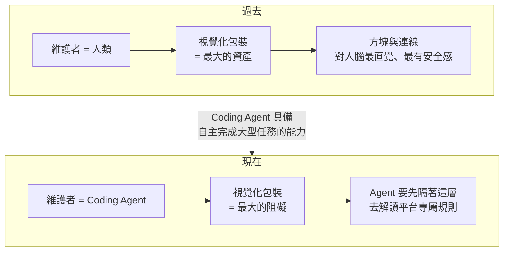
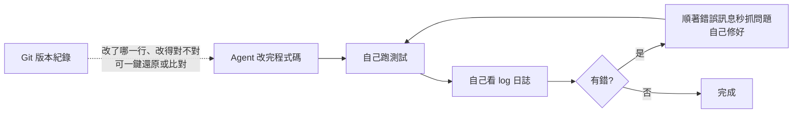
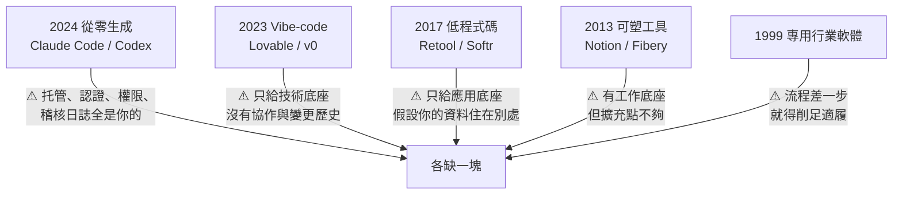
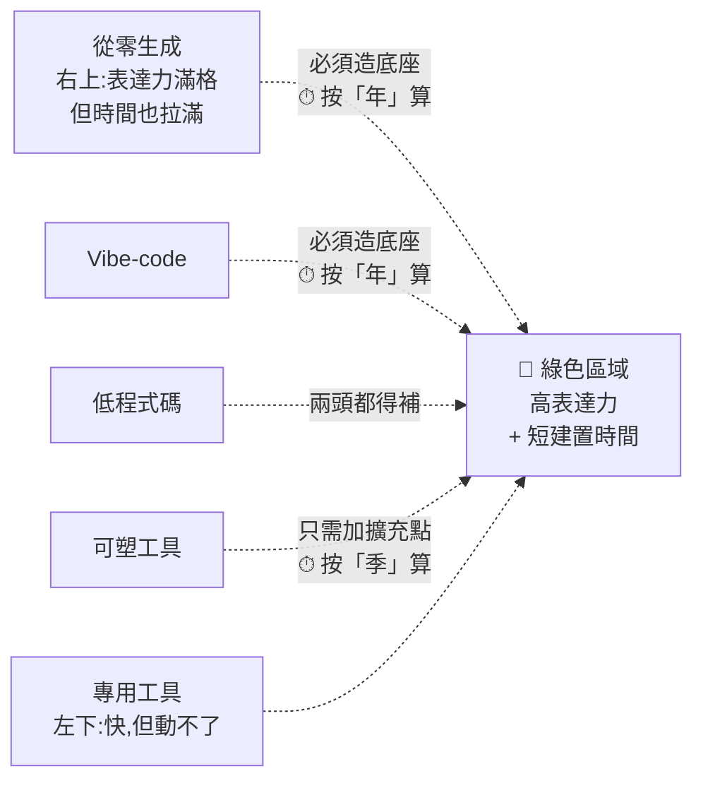

# Make 與 n8n 還值得學嗎:當維護的人從你換成 Agent,視覺化就從資產變成阻礙

**主題分類:** AI 生產力 —— 自動化工具選型與遷移判準
**來源影片:**
1. YouTube〈Make 跟 n8n 還值得學嗎?2026 年新手現在該把時間花在哪〉(Gary Chen,2026-09-05,約 13.8 分鐘,**官方 zh-TW 字幕**)
2. YouTube〈还在用 No-Code/Low-Code?AI 時代新公式:可塑軟體 = 80% 底座 + 20% 代碼〉(Why QQ,2026-09-06,約 9.5 分鐘,**官方 zh-Hans 字幕**)—— 見 **§12**,補上「離開低程式碼之後要建在什麼上面」,並與 §1–§6 形成張力
**整理日期:** 2026-09-06(2026-09-07 增補 §12)

> ⚠️ **立場揭露:** 作者在影片中推廣自己的 Patreon(轉換範本與提示詞工具),並預告後續的部署教學影片。
> 本文只整理論證與判準,**不轉述付費內容**。

> 📎 相關筆記:[[defining-tasks-not-prompts]](怎麼把需求講清楚)、
> [[git-github-for-vibe-coders]](本文 §5 提到的版本紀錄)、
> [[ai-brownfield-codebase-five-steps]](接手舊系統的方法)、
> [[graph-engineering-node-edge-state]](節點/邊/狀態的另一種視角)

---

## 0. 一句話總結

> **Make 與 n8n 的價值,建立在「建流程、盯維護的人是你自己」這個前提上。
> 當那個人換成 Coding Agent,視覺化那層包裝就從最大的資產變成最大的阻礙。**

作者的結論分三種人給,講得很清楚:

| 你是誰 | 建議 |
|---|---|
| **剛起步的新手** | ⭐ **真的不用再學了** |
| **手邊有跑得順的舊流程** | ⭐ **不用急著拆**(只有兩種情況該搬,見 §6) |
| **面對全新的自動化需求** | ⭐ **大膽走 Agent-first** |

---

## 1. 先承認它們當年解決了什麼

要理解為什麼現在不建議學,得先承認它們**當年真的很強**。

過去要把不同軟體串起來,中間必然牽涉到:

```text
API 串接 · 權限驗證 · 資料格式轉換 · 出錯時怎麼處理
```

**這些過去全部都要靠寫程式才能搞定**,對不會寫程式的人門檻太高。

⭐ Make 與 n8n 最厲害的地方是:**把原本複雜的程式碼全部變成視覺化的圖形介面** ——
把看不見的邏輯,變成畫面上一個個清楚的方塊和連線。

> 觸發條件(有人填了表單)→ 處理步驟(資料寫進試算表)→ 後續動作(自動發通知)
>
> **流程跑起來,你就能親眼看到資料一步一步從左邊流到右邊,哪一步打勾、哪一步丟出什麼資料,一目了然。**

**不用背語法、不用管伺服器,一個下午就能做出第一版能跑的自動化。** 這在當年是巨大的突破。

---

## 2. 但它有一個很早就會撞到的天花板

⚠️ 只要把它應用在**複雜的業務**上,很快就會遇到瓶頸:

| 步驟數 | 體感 |
|---|---|
| **3–5 個** | 連線很漂亮、很清楚 |
| **幾十個節點** | ⚠️ **連線像蜘蛛網一樣密密麻麻** |

而且問題不只是「看起來亂」:

> **每一段資料轉換的設定、每一個條件判斷,都分散藏在幾十個不同的跳出視窗和選單裡。**
> 只要其中一個環節出錯,你往往要點開十幾個節點,一個一個去查到底是哪裡的欄位對應寫錯了。

⭐ **關鍵是:過去我們非常願意接受這種麻煩。** 因為當時只有兩個選擇 ——
**要嘛學寫程式、管伺服器,要嘛用圖形介面拉線。** 對大多數人來說後者明顯輕鬆得多。

---

## 3. ⭐⭐⭐ 前提變了:維護的人換人了

這是整支影片的軸心。



### 3.1 一個容易被忽略的事實:底層本來就一樣

> **在 Make 或 n8n 裡拉出來的流程,跟工程師用程式碼寫出來的自動化,底層本質上完全是一模一樣的東西。**

不管用什麼工具,一套自動化最後要做的就只有這幾件事:

```text
什麼時候觸發? → 讀取什麼資料? → 中間經過哪些判斷?
→ 執行什麼動作? → 出錯時怎麼處理?
```

⭐ **「Make 和 n8n 就如同所有的 low-code 工具一樣,底層都是程式碼,只是把介面包裝得比較讓人賞心悅目。」**

### 3.2 為什麼那層包裝對 Agent 是負擔

| | Agent 面對純程式碼 | Agent 面對 Make / n8n |
|---|---|---|
| **語言熟悉度** | ⭐ **程式語言本來就是它的母語**(訓練時讀的就是海量標準程式碼) | ⚠️ 必須額外理解**平台專屬**的節點規則、資料結構、設定限制 |
| **處理效率** | 精確讀取與修改,**速度與 token 效率都高** | ⚠️ **多繞一大圈,浪費大量 token** |
| **出錯風險** | 直接讀錯誤訊息 | ⚠️ 官方文件沒寫清楚、或剛好更新了節點規則 ⇒ **Agent 很容易因為搞不懂遊戲規則而出錯** |

### 3.3 ⭐ 一個具體的對照(影片舉的例子)

假設你有一套流程:**每天盯一個 YouTube 頻道,有新影片就抓逐字稿、丟給 AI 做摘要、寄到信箱。**
某天摘要突然不寄了,你把問題丟給 Agent ——

| 走 Make | 走純程式碼 |
|---|---|
| 它面對的是 **Make 匯出來的一大包 JSON 設定檔**,裡面全是平台自己發明的節點編號與欄位代號 | 它直接**讀錯誤訊息、找到出錯的那一行** |
| ⚠️ 得先搞懂「裝著你工作流的這個平台是怎麼運作的」——**像在解讀別人家的密碼本** | 修好,再跑一次測試確認,**一氣呵成** |
| 才有辦法推測是哪個節點的欄位對應斷掉了 | — |

> ⭐ **「同樣一件事,隔著包裝跟直接面對原文,效率是天壤之別。」**

---

## 4. ⚠️ 「可是它們現在也有內建 AI 了啊?」

這是影片自己提出並回答的反駁,處理得很誠實。

**它承認:** 確實有整合。你可以用白話聊兩句就搭出基礎流程 ——
**只要串三、五個步驟、快速做 prototype,這確實又快又方便。**

**但真正的差別在後面:**

> **當流程變得更複雜、需要長期維護的時候 —— 誰更容易改壞?日後誰更好迭代、更好新增功能?**

### 差別一|生態自由度

在 Make / n8n 上,只要業務變更、想串新工具,**你永遠得先去查平台到底有沒有支援這個節點。**

⭐ 影片舉的例子很到位:

> 今天某家推出一個很猛的新模型,但接口跟舊版有一點點不一樣,**官方節點還沒更新**。
> 你想嚐鮮,就只能用平台的**萬用 HTTP 節點自己硬串** ——
> ⚠️ **可是走到這一步,其實已經回頭在手寫 API 串接了。**

反觀交給 Coding Agent:一句話交代下去,它自己去接其他工具、去 GitHub 找現成套件,
或直接對接官方 API 來寫。**開發與擴充的自由度不在同一個量級。**

### 差別二|⭐⭐ 成熟的除錯機制

純程式碼背後有**軟體工程累積了幾十年的成熟除錯機制**:



> ⭐ **「整個發現問題、修改到驗證的閉環,Agent 在它的環境裡就能全自動搞定 ——
> 根本不需要你親自點開每一個節點去排查。」**

---

## 5. 「可是我就是不會寫程式」——這個擔心過期了

過去只要你看不懂程式碼,視覺化的方塊確實是理解邏輯**最好的方式**。但規則改了:

> 遇到問題時,**直接用白話問它**:「這個流程是怎麼跑的?」「為什麼剛才那筆通知沒寄出去?」
> Agent 會自己去讀底層程式碼、執行日誌和測試結果,**然後用白話解釋給你聽**。
> 更習慣看圖的話,**也可以直接叫它在對話框裡畫一張流程圖給你**。

⭐⭐ 所以視覺化沒有失去價值,是**角色變了**:

| | 過去 | 現在 |
|---|---|---|
| **視覺化的定位** | ⚠️ 你**必須**回到畫布上去拉那些密密麻麻的節點 | ⭐ **理解全貌的地圖 / 監控看板** —— 讓你看狀態、掌握全局 |

---

## 6. ⭐⭐ 舊流程什麼時候才該搬(這節最實用)

影片在這裡很克制,先講了工程領域的老原則:

> **「只要一套系統現在跑得順順的、沒出什麼毛病,就別急著去動它。」**
> 為了追新技術硬去重構,**反而是在給自己找麻煩、徒增營運風險。**

**只有兩種情況建議搬:**

| # | 情況 | 徵狀 |
|---|---|---|
| **①** | **這條流程常常出錯,每次要改大家都提心吊膽** | 缺乏測試與版本紀錄;裡面可能還塞了一堆自訂的 JavaScript 腳本 ⇒ **改一個地方壞三個地方** |
| **②** | **日後需要頻繁迭代,或可預見會有一場大改版** | 既然未來還會一直調整甚至打掉重練,**不如趁這個機會順勢用純程式碼重新架構** |

> ⭐ **原則一句話:跑得好好的就別沒事找事;只有常出狀況、或未來需要一直改動的,才值得搬過來重寫。**

### ⭐ 給已經學過的人的一段話

> **「你在拉節點的過程中,其實已經練會自動化最核心的思考:什麼時候觸發、資料怎麼流、出錯怎麼接。
> 這些觀念一點都沒過期,反而是你指揮 Agent 的最大優勢。」**
>
> 你比完全沒碰過自動化的人**更會把需求講清楚,也更能一眼看出 Agent 哪裡做錯。**

---

## 7. ⚠️⚠️ 換過去要自己承擔的那一塊:部署

影片特地幫 Make / n8n 說了一句公道話,而這是**整支影片最該記住的代價**:

> **這兩個平台會幫你處理好部署的問題** —— 設定好之後時間一到自動觸發、
> 中間掛掉自動重試、每一次執行都留下紀錄。
> **你從來不需要煩惱自己的流程到底是在哪一台電腦上跑的。**

⚠️ **改用 Agent 寫程式,這件事就得自己面對。**

所謂部署,白話講就是**把寫好的程式放上雲端、讓它 24 小時待命** ——
這樣你不需要為了一個每天早上的任務,讓筆電開一整晚不關機。

影片點名的免費現成工具:

| 工具 | 適合 |
|---|---|
| **GitHub Actions** | 程式放上 GitHub,時間到自動跑;**跑失敗會主動寄信通知你** |
| **Netlify / Vercel** | 註冊帳號,剩下的 Agent 可以幫你搞定 |

---

## 8. 應用案例:非技術背景的人怎麼跟 Agent 開口

影片給的模板很簡單 —— **把它當成一個真人工程師**,一次交代清楚四件事:

```text
① 你為什麼要做這件事,什麼時候需要自動跑
② 你現在人工是怎麼處理的(資料從哪裡抓、要送到哪裡)
③ 你想要什麼結果,怎樣才算做好
④ 請它給架構建議,並幫你想可以部署在哪裡
```

⭐ **完全沒有技術背景的話,直接講明:**

> 「中間如果需要用到什麼 API Key 或設定權限,**請一步一步教我怎麼申請**。」

### 一個可以立刻套用的完整範例

```text
我要做一件事:每天早上 8 點,把我訂閱的三個 YouTube 頻道的新影片
抓下來、產出重點摘要,寄到我的 Gmail。

我現在是人工做的:自己點開頻道看有沒有新片,有的話手動複製逐字稿
貼給 AI 摘要,再自己貼進信件寄給自己。

做好的標準:沒有新片就不要寄空信;摘要要含影片標題與連結;
同一支影片不要重複寄。

請先給我架構建議,並幫我想可以部署在哪裡(我完全沒有技術背景,
中間需要申請的 API Key 或權限設定,請一步一步教我)。
```

> ⭐ 注意這個範例裡三件事都齊了:**觸發時機、現在的人工做法、驗收標準** ——
> 而「沒有新片就不要寄空信」「同一支影片不要重複寄」正是**最容易被漏掉、卻最會出事的邊界條件**。

---

## 9. 角色升級:從填欄位的人變成系統負責人

> **過去我們花大把時間研究「這個欄位怎麼填、那個節點怎麼接」,把精力都耗在瑣碎的設定細節上。**
>
> ⭐ **現在你真正要扮演的角色是系統負責人 —— 由你來決定什麼事情該自動化、把關安全邊界、定義驗收標準;
> 而 Agent 是那個幫你把想法精準落實到程式碼裡的貼身助手。**

---

## 10. ⭐ 影片未提、但會改變結論的三點補充

這三點都經過查證,而且**其中兩點會讓「該不該搬」的答案更細緻**。

### ① ⚠️ n8n 有自架版 —— 那「平台幫你處理部署」就不成立了

§7 那句公道話**只適用於 Cloud 版**。n8n **可以自架**,而自架就代表:
**部署、擴容、備份、升級全部回到你身上。**

> ⭐ 所以真正的對照不是「低程式碼 vs 程式碼」,而是:
> **n8n Cloud(平台顧部署)/ n8n 自架(你顧部署)/ Agent + GitHub Actions(你顧部署但工具更成熟)**
> —— **如果你本來就在自架 n8n,那「換過去要自己面對部署」這個代價其實不存在。**

### ② ⭐⭐ 計費模型的差異會直接影響「該不該搬」

| 平台 | 計費單位 | 意涵 |
|---|---|---|
| **n8n** | **execution(整條流程跑一次)** | ⭐ **不管流程有幾個步驟、處理多少資料,都算一次** |
| **Make** | **operation(每個步驟)** | ⚠️ **流程越複雜,同一次執行就越貴** |

> ⭐⭐ 這條補充很重要,因為它反過來影響 §6 的判準:
> **在 Make 上,「流程長大」本身就是持續增加的成本 ⇒ 搬走的誘因更強;
> 在 n8n 上,流程長大不會讓單次執行變貴 ⇒ 誘因主要來自維護痛苦,而不是帳單。**

### ③ ⚠️ 「低程式碼沒有版本紀錄」不完全成立

影片說舊流程「缺乏測試和版本紀錄」——這對一般方案成立,
但 **n8n 的自架商業方案有內建 Git 版本控制**(連同 SSO、多環境)。

> ⭐ 所以更精確的說法是:**版本紀錄在低程式碼平台是「要另外付費、且綁在特定方案」的功能,
> 在程式碼世界則是免費的預設值。**

---

## 11. 與公開資料的核實

### ✅ 影片說法準確

| 影片說法 | 核實 |
|---|---|
| Make / n8n 現在都有內建 AI,可用白話生流程、改節點 | **屬實** —— n8n 有 **AI Workflow Builder**,可用自然語言描述目標自動生出含節點、邏輯與設定的流程,並支援用提示詞繼續修 |
| n8n 有 AI Agent 節點、可做多 agent 與 RAG、可換模型 | **屬實** |
| GitHub Actions 可排程執行、失敗會通知 | **屬實** |
| low-code 底層都是程式碼,只是包裝了介面 | **屬實**,為業界共識 |

### ⚠️ 未獨立查證(以影片觀點看待)

- **Agent 處理平台匯出 JSON 比處理程式碼「浪費大量 token」** —— 方向合理(§3.2 的論證成立),
  **但影片沒有給任何實測數字**,本文也未找到公開的對照基準。
- 「官方節點還沒更新只能用萬用 HTTP 節點硬串」為**通則描述**,未指名具體案例。
- 作者 Patreon 上的轉換範本與提示詞工具的實際效果。

> ⚠️ 本文的 §10 為查證後的補充,**不是影片內容**。

---

## 12. ⭐⭐⭐ 另一半的答案:「換成程式碼」之後,那些程式碼要建在什麼上面?(2026-09-07 增補,來源:Why QQ)

§0–§11 回答的是**「該不該離開低程式碼」**,結論是 Agent-first。
但那個結論留了一個洞:**離開之後,你的程式碼要跑在什麼上面?**

這一節補上另一半,而且它跟前面**有張力** —— 這正是最值得讀的部分。

> **Fibery 創辦人 Michael Dubakov(在生產力工具這行做了 22 年)2019 年押注無程式碼革命。
> 2026 年 8 月他公開承認:這個賭注只兌現了一半。**
>
> ⭐ **「無程式碼沒有贏下市場。真正回來的東西讓所有人沒想到:代碼本身。」**

大模型把寫程式的成本打下來之後,**低程式碼與無程式碼廠商反而開始拼命往自家產品裡塞程式碼**。
他把這個趨勢叫 **malleable software(可塑軟體)**,公式一行:

> ## 80% 堅實底座 + 20% 定制程式碼

📌 **核實:原文用詞為 “80% solid bases + 20% custom code is an ideal solution for productivity tools.”**

### 12.1 為什麼「叫 Agent 從零寫一個」不夠

⚠️ 這一段直接回應 §3 的樂觀:

> **一個人玩,可以** —— 自己用的小工具,寫崩了重寫就行。
> **可一旦加上「協作」這個維度,難度立刻上台階。**

你需要的東西會變成:

```text
帶關係的資料儲存 · 並發編輯 · 通知 · 變更歷史 · 權限體系
```

> ⭐⭐ **「這些才是真正的髒活累活,佔了系統的大頭,還一點也不酷。」**

⭐ 每個工程師都踩過的那個坑:**「demo 一個下午就出來,上線拖三個月。」**

### 12.2 五條路,各缺一塊(按出生年份排開)



| 路線 | 給你什麼 | ⚠️ 缺什麼 |
|---|---|---|
| **從零生成** | 表達力拉滿 | 前 80% 快到讓人上頭,**剩下 20% 會教你做人** —— 托管、登入認證、權限與稽核日誌**沒有一樣能靠一句提示詞糊過去** |
| **Vibe-code** | 托管、資料庫、認證、部署開箱即用 | ⭐ **只是技術底座**。協作、評論、變更歷史一概沒有。廠商的對策是不停加元件,**但協作語義與變更歷史不是堆元件堆得出來的,補課的計價單位是「年」** |
| **低程式碼** | 認證、權限、托管、稽核日誌 | ⭐ **給的是應用底座,離工作底座差一層** —— **它假設你的資料存在別處**(Retool 最擅長給既有資料庫套一層管理介面);就算自帶資料庫,存的也只是應用自己的資料,**你的團隊在裡面的工作痕跡它管不了** |
| **可塑工具** | 資料模型自己捏、上手飛快、很多東西開箱即有 | ⚠️ **擴充點不夠**(想想 Jira 外掛的開發體驗)。缺的是**讓剩下那 20% 也能 vibe-code** |
| **專用軟體** | 為你的行業量身定做 | ⚠️ **流程只要跟它的假設差一步,你就得削足適履**。⭐ 而且它有個宿命:**一旦變得通用、變得靈活,它就不再專用了 —— 靈活和專用是死對頭** |

⭐ 講者對第五條的評語很公道:**「你的流程跟它匹配,直接買,別猶豫。」**
(原文舉的例子是:連蘑菇農場都找得到一個叫 Kinoko 的專用工具。)

### 12.3 ⭐⭐ 三種「底座」不是同一種東西

這是本節最實用的分類 —— **市面上的「底座」根本不是一回事。**

| 底座類型 | 包含什麼 | 誰在給 |
|---|---|---|
| **技術底座** | 伺服器、原始資料庫、認證 | Vibe-code 平台 |
| **應用底座** | UI 元件、連接器、存取控制 | 低程式碼平台 |
| ⭐ **工作底座** | **資料本身就住在裡面**,連同團隊圍繞資料需要的一切:**協作、歷史、權限** | 可塑工具 |

> ⭐ 一個很好的歷史對照:
> **「過去你手裡唯一的底座是編譯器和作業系統,其他全是你的問題。
> 那是真駭客的黃金年代,也意味著什麼都得自己造。」**
>
> **今天有了更高的抽象層,真正的問題變成:抽象該停在哪一層?**

**兩個極端都不行:**

| | 底座硬度 | 表達力 |
|---|---|---|
| **專用工具** | ⚠️ **最硬,硬到改不動** | 低 |
| **Codex 這類** | ⚠️ **幾乎沒有底座** | 拉滿 |
| ⭐ **甜點在中間** | **底座管所有團隊都一樣的東西** | **定制程式碼管你不一樣的東西** |

### 12.4 ⭐⭐⭐ 那 20% 定制程式碼:量不大,分量極重

**它是什麼:**

```text
你的專屬介面(例:種植車間平板上的採收畫面)
你的業務規則(例:菌批的品質判定)
你的外部連接(例:批發客戶的 API、濕度感測器)
```

> ⭐ **「這部分就是你的公司本身。沒有任何廠商能替你建模。」**

**但定制程式碼要成立,必須滿足兩個條件** —— 這是全篇最工程化的一段:

| # | 條件 | 為什麼 |
|---|---|---|
| **①** | ⭐ **繼承底座** —— **權限、歷史、資料完整性自動對定制程式碼生效** | ⚠️ 若每個生成的應用都自己帶一套認證與稽核,**那就全完了** |
| **②** | ⭐ **有邊界** —— **定制程式碼可以把自己寫崩,但絕不能腐蝕底座**,出問題能一鍵回滾 | ⚠️ **一個爛應用應該只是麻煩,不能變成丟資料的事故** |

📌 **核實:原文為 “It inherits the base. Permissions, history and data integrity apply to custom code automatically.”
與 “It is bounded. Custom code can break itself, but it cannot corrupt the base.”**

> ⭐⭐ **這兩條可以直接拿去當你自己內部工具的驗收標準**,不論你用什麼平台:
> **「我的自訂邏輯,權限管得到它嗎?它改壞了,回得去嗎?」**

### 12.5 為什麼「可塑工具最有機會先到」

原文畫了一張座標圖:**橫軸表達力、縱軸建置時間**。



> ⭐⭐ **關鍵的不對稱:加擴充點按「季度」算,造底座按「年」算。**
> 所以 Dubakov 押注**可塑工具最有機會先到終點**。

⚠️ 他也留了一個大問號:**AI 從零生成會不會把整張地圖直接作廢?**
他的回答是 **「現在還沒有」**。並給自己設了驗收日期:**2030 年回來看那家蘑菇農場有沒有扔掉表格。**

### 12.6 ⭐⭐⭐ 全篇最值錢的一條原則:選底座,別選介面

> ## 「選底座,別選介面。」

**理由是一個關於「什麼會累積」的判斷:**

| | 會不會累積 | 兩年後想換 |
|---|---|---|
| **資料、歷史、權限** | ⭐ **會不斷累積** | ⚠️ **遷移成本高到讓你絕望** |
| **介面** | ❌ 不累積 | ⭐ **AI 幾分鐘就生成一個新的** |

> ⭐ 講者給了一個很有畫面的對照:
> **「前端框架三年一換,你心疼過嗎?可生產庫裡的資料,你動一次試試。」**

**而這件事正在反轉:**

> **過去廠商賣的是介面,底座是藏在底下的無聊水管;
> 現在倒過來了 —— 介面幾分鐘生成一個,底座還是要搭好幾年。
> 誰的底座扎實,誰手裡就攥著複利。**

⭐ **對個人工程師同樣成立:你累積的領域模型與資料資產,比你寫的任何介面都值錢。**

### 12.7 ⚠️⚠️ 兩篇的張力:同一個決定,兩種相反的建議

**這一節不能只是接在後面,因為它跟 §1–§6 有真正的衝突。**

| | **§1–§6(Gary Chen)** | **§12(Dubakov)** |
|---|---|---|
| **問題** | 我該不該離開 Make / n8n? | 我的內部工具該建在什麼上面? |
| **建議** | ⭐ **走 Agent-first,交給 Coding Agent 寫純程式碼** | ⚠️ **純程式碼不夠 —— 你會在最後 20% 卡三個月** |
| **理由** | Agent 讀寫程式碼是母語;有成熟的測試與版本工具 | 協作、權限、變更歷史這些髒活佔了系統大頭,**而且不酷** |

**⭐ 怎麼調和?我認為兩者其實在講不同規模的東西:**

| 你要做的東西 | 適用哪一篇 |
|---|---|
| **單向的自動化流程**(定時抓 → 處理 → 送出) | ⭐ **§1–§6** —— 沒有協作維度,純程式碼確實更好維護 |
| **多人協作的內部系統**(有登入、有權限、多人同時編輯、要留紀錄) | ⭐ **§12** —— 這時「從零生成」的最後 20% 會咬死你 |

> ⭐⭐ **一句判準:問你自己「這東西有沒有第二個使用者」。**
> **沒有 → Agent-first 寫程式碼就好。**
> **有 → 你需要一個底座,而且要照 §12.4 那兩個條件去挑。**

⚠️ 另外注意一個共同點:**兩篇都同意「介面/流程圖那一層正在變便宜」** ——
Gary Chen 說視覺化拉節點不用學了,Dubakov 說介面幾分鐘生成一個。
**他們真正的分歧只在:那便宜掉的東西底下,還剩什麼是貴的。**

### 12.8 應用案例:三個選型提問

講者的收束很乾淨,可以直接拿去用:

> **① 底座是誰的?**
> **② 定制程式碼能不能繼承底座?**(權限、歷史自動生效嗎?)
> **③ 兩年後資料搬不搬得走?**

**落到實作的具體檢查:**

| 提問 | 具體怎麼查 |
|---|---|
| ① | 我的資料實際存在哪個系統?**是「住在底座裡」還是「底座只是套了層 UI」?** |
| ② | 我自己寫的那段邏輯,**平台的權限系統管得到它嗎**?它的操作會不會進稽核日誌? |
| ③ | **能不能匯出成標準格式**(不是只有 PDF / 截圖)?**歷史紀錄與權限設定匯不匯得出來?** |

⚠️ 第 ③ 點特別容易被忽略:**很多平台能匯出「資料」,但匯不出「歷史」與「權限」** ——
而後兩者往往才是你這兩年真正累積下來的東西。

### 12.9 核實狀態

#### ✅ 已核實(比對 Dubakov 原文)

| 說法 | 核實結果 |
|---|---|
| **80% solid bases + 20% custom code** 為原文公式 | **屬實**,原句為 “80% solid bases + 20% custom code is an ideal solution for productivity tools.” |
| 五條路線與年份(2024 從零生成 / 2023 Vibe-code / 2017 低程式碼 / 2013 可塑工具 / 1999 專用軟體) | **全部屬實** |
| 三種底座:tech base / app base / work base 的內容 | **屬實** |
| 定制程式碼的兩個條件(繼承底座、有邊界) | **屬實**,兩句均為原文 |
| 表達力 vs 建置時間的「綠色區域」 | **屬實** |
| **「選底座,別選介面」** | **屬實**,原句為 “Select your base, not the interfaces. Data, history and permissions accumulate and are relatively hard to re-pick in two years.” |
| 押注可塑工具最先到、2030 驗收 | **屬實** |

#### ⚠️ 立場與未核實

- ⚠️⚠️ **Dubakov 是 Fibery 的創辦人,而 Fibery 正是他推薦的「可塑工具」類別。**
  ⭐ 影片作者自己有明說這點:**「這不就是帶貨嗎?帶貨成分確實有,但邏輯自洽。」**
  **本文採用其框架,不採用其產品推薦。**
- ⚠️ 他自述「用 Fibery 的 Custom Apps 一小時就把蘑菇農場的管理空間搭出來」—— **未核實**。
- ⚠️ 蘑菇農場是**虛構案例**,不是真實客戶。
- ⚠️ §12.7 的張力分析與 §12.8 的具體檢查清單**為本文延伸,非影片或原文內容**。

---

## 來源

- [Make 跟 n8n 還值得學嗎?2026 年新手現在該把時間花在哪 — Gary Chen](https://www.youtube.com/watch?v=UQDSftGndms)(2026-09-05,約 13.8 分鐘,官方 zh-TW 字幕;§0–§11)
- ⭐ [还在用 No-Code/Low-Code?AI時代新公式:可塑软件 = 80%底座 + 20%代码 — Why QQ](https://www.youtube.com/watch?v=jJ5WAKs0eGE)(2026-09-06,約 9.5 分鐘,官方 zh-Hans 字幕;§12 來源)
- ⭐⭐ [Malleable software = solid bases + custom code — Michael Dubakov](https://www.mdubakov.me/malleable-software-solid-bases-custom-code/)(2026-08,**§12 的一手來源,已比對原文用詞**)
- 核實與補充來源:
  - [AI Workflow Builder — n8n Docs](https://docs.n8n.io/advanced-ai/ai-workflow-builder/)
  - [n8n execution advantage:pricing model — n8n Blog](https://blog.n8n.io/n8n-execution-advantage/)
  - [n8n Plans and Pricing](https://n8n.io/pricing/)
  - [How to self-host n8n: setup, architecture, and pricing guide (2026) — Northflank](https://northflank.com/blog/how-to-self-host-n8n-setup-architecture-and-pricing-guide)
  - [GitHub Actions — 排程與通知](https://docs.github.com/actions)

> ⚠️ 本文為對一支公開影片的整理與查證。§11 已標示核實狀態,§10 為影片未提的補充。
> **作者在片中推廣自有 Patreon 內容,本文未引用其付費素材。**
> 平台功能與計費模型變動快速,以各家官方定價頁為準。
