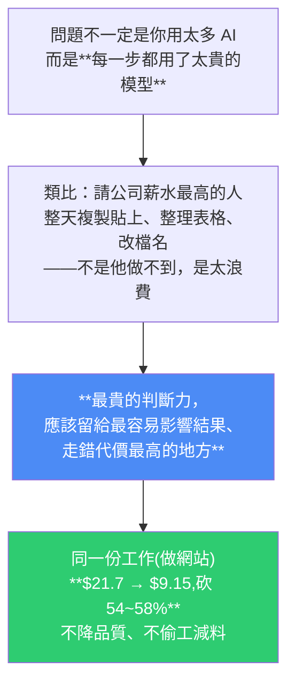
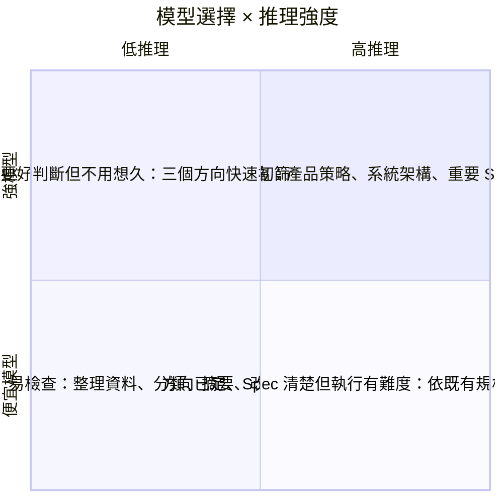
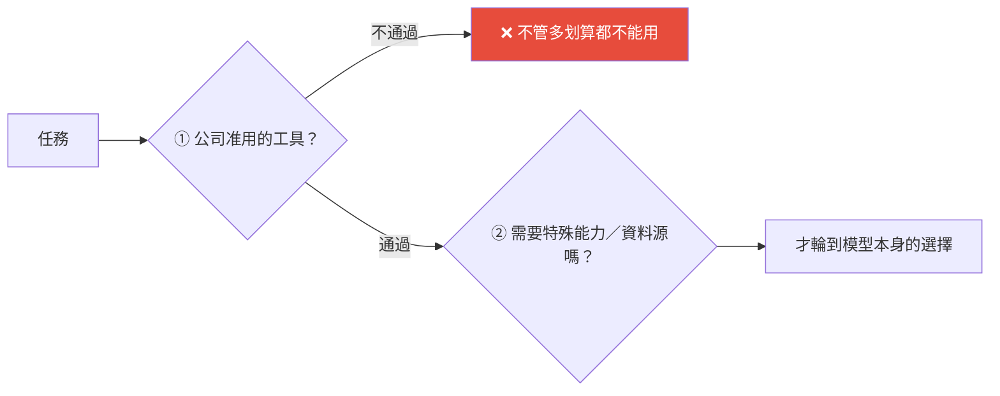
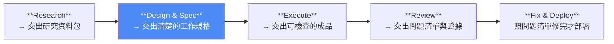
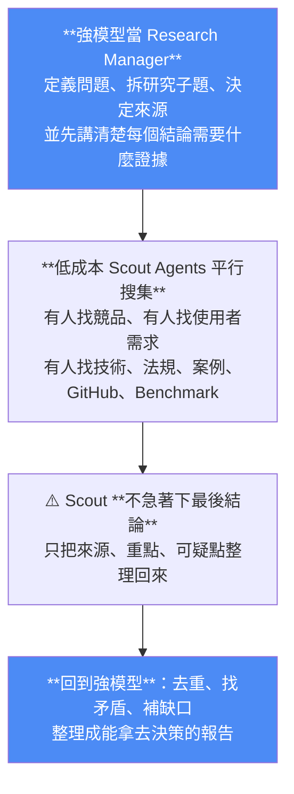
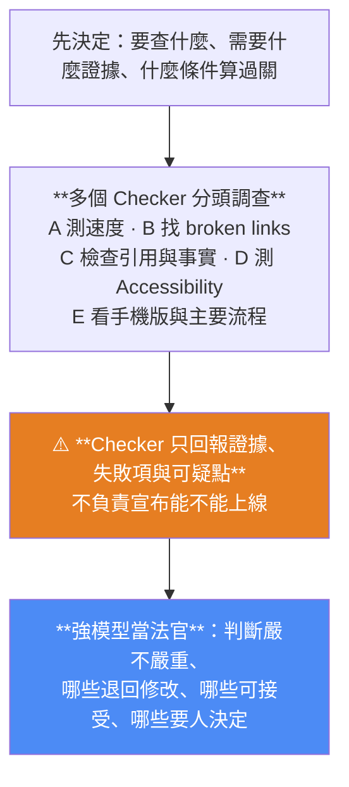

# Model Routing:同一份任務,Token 成本從 $21.7 降到 $9.15 —— 重點是「算力分配」不是「挑模型」

> 整理自 YouTube「Gary Chen」〈同樣用 AI 做任務,為什麼我可以只花一半的 Token 成本?給新手的 Model Routing 模型分工教學〉(2026-08-05,約 15.5 分鐘,官方 zh-TW 字幕)。
>
> 開場的觀察很準:**Fable 5、GPT-5.6 這些新模型接連上線,但很多人第一個感受到的不是生產力爆炸,而是 Token 額度爆炸。**
>
> 全片最重要的一句重新定義:**Model Routing 不是 Model Selection(挑模型),更準確的說法是 Compute Allocation(算力分配)。**

---

## 一句話總結



---

## 一、Model Routing 是兩個維度,不是一個

多數人把它理解成「這個任務要用強模型還是便宜模型」——**這只回答了一半**。因為同一個模型,你還可以讓它用不同的**推理強度**工作。

| 維度 | 意思 |
|---|---|
| **模型選擇** | 你**派誰上場**:最強最貴、判斷力最好的?還是便宜快速、適合大量執行的? |
| **推理強度** | 你叫它**用多少腦力**:快速回答就好?還是多想幾步、反覆檢查、花更多 token 去推理? |

**兩兩相乘 = 四個象限:**



| 象限 | 適用 |
|---|---|
| **強模型 + 高推理** | 方向不明、走錯代價高——產品策略、系統架構、重要 Spec、最後的高風險 Review。**這裡判斷錯,後面做再快都只是往錯的方向跑** |
| **強模型 + 低推理** | 需要好判斷但不用想很久——例如手上三個產品方向,先快速初篩哪個值得研究 |
| **便宜模型 + 高推理** | 方向已定、Spec 清楚,但執行本身有難度——依既有規格補一段複雜邏輯 |
| **便宜模型 + 低推理** | 機械、重複、易檢查對錯——整理資料、分類、摘要、改格式、跑固定檢查 |

---

## 二、⚠️ 但選模型之前,要先過兩道限制

這一段很多技術向的討論會略過,但實務上它是**前置條件**:



### 第一道:公司允許你用哪些工具

在公司裡用 AI,**第一個問題通常不是哪個模型最強,而是「這份資料能不能丟進去」**。客戶資料、財務資料、法務草稿、還沒發布的產品計畫——**不能因為某個模型看起來划算就直接丟到外部 API**。

> 影片的說法很傳神:那不是 Model Routing,**那比較像是把公司資安部門的血壓拿來做壓力測試**。

如果公司批准的是 ChatGPT Enterprise、Claude Team、Microsoft Copilot,就先從這些裡面選。

### 第二道:這個任務需不需要特殊能力

有些工作綁定特定資料源:Live Web、X、公司內部資料庫、逐字稿資料庫、CRM,或能搜尋歷史資料的系統。

> **重點不是它是不是宇宙最強模型,而是它有沒有接到你需要的那條資料流。**

### 過完兩道限制,才輪到模型本身

| 任務性質 | 用什麼 |
|---|---|
| 方向未定、任務混亂,需要判斷力 / taste / 策略 | **日常主力模型**(最信任的強模型),例如 GPT-5.6 Sol 或 Fable 5 |
| 規格清楚、輸出格式固定、知道怎麼檢查,只需大量生產 | **負責做工的模型**,例如 GPT-5.6 Terra、GPT-5.4 或 Sonnet 5 |

---

## 三、為什麼分工能省一半而不掉品質?

**因為一份工作裡,不同步驟需要的智力本來就不一樣。**

以做網站為例:前段是「處理未知的方向」(客戶是誰、要解決什麼問題、競品怎麼做、頁面架構);方向定下來後,**後面就變成純執行**(讀 code、寫 code、改頁面、跑測試、修 bug)。

> ⭐ **而最花 token 的,剛好就是後面的執行。全程用最貴的模型,等於把最高單價套在輸出量最大的地方。**

### 作者實測的三種做法(這段是本片的實證核心)

| 做法 | 結果 |
|---|---|
| Fable 規劃 + Opus 實作 | 品質好 |
| Fable 同時負責規劃與實作 | **品質沒差太多** |
| **Plan 與實作都交給 Opus** | ⚠️ **單價便宜,但成品品質掉很多**——來回修改到堪用時,**反而花了跟前面差不多的錢,而且時間消耗直接翻倍** |

> ⭐ **由此得出的關鍵洞察:真正的成本不只是 API 單價,而是「完成一份可用成品的總成本」。**

**總成本 = 四塊:**

```
① Token 花多少
② 跑錯後要重跑幾次
③ 人要花多少時間檢查
④ 方向一開始就走錯的代價
```

- **便宜模型沒有 Spec 就亂做 → 重跑三次 → 耗時耗力。**
- **最強模型整天被拿去改格式 → 只是在亂燒預算。**

> **目標不是把單價壓到最低,而是用合理的成本做出真的能交付的成品。**

---

## 四、五步流程:關鍵不在切分,在「交接」

> **只是把任務切成五塊還不叫 Routing,真正的關鍵是把交接設計好。**



> **讓每一步的 Output 變成下一步的 Input——出了問題你才知道該退回哪一步檢查。**

有了這條交付鏈,你才有辦法逐步判斷:這一步需要什麼模型特色?模型要多強?推理要開多深?

### ① Research:拆成一支小團隊,而不是一個對話框

多數人做 AI 研究其實只是「叫模型幫我 Google 一下」——**搜尋、判斷、結論全壓在同一個模型身上,很容易漏東漏西**。



> **把開頭與結尾留給高品質高單價的模型,中間大量、可拆分的資料搜集就可以替換成便宜模型。**

### ② Design & Spec:用強模型 + 高推理

> **Spec 白話講就是交接文件,而且要清楚到「換一個模型、換一個人、甚至隔兩週後的你自己回來看,都知道要交什麼、怎麼判斷有沒有做完」。**

一份好的 Spec 至少要講清楚:有哪些頁面、每一頁服務誰、資料從哪來、設計原則、**Success Criteria**,以及**什麼事情不能做**。

**為什麼這裡要開高推理**:因為那些你自己還沒想清楚的地方,都需要在這裡被抓出來。

影片舉的好 Spec 範例是可驗收的寫法,例如:首頁要在三秒內讓第一次來的目標客群理解產品賣點、案例頁要看得到導入前後的差異、手機版不能把主要 CTA 擠出第一屏。

### ③ Execute:一個判斷標準決定能不能省

規格清楚後,負責做工的模型才適合大量上場。把頁面、文案整理、資料轉換、code 與測試準備拆成獨立工作包,**每包講清楚:輸入是什麼、要交什麼、不能碰什麼、完成怎麼判斷**。

| 工作性質 | 配置 |
|---|---|
| 規則固定、容易驗收(產品資料轉 JSON、補 metadata、套版、整理 CSV) | 便宜模型 **+ 低推理** |
| Spec 清楚但技術難度較高 | 便宜模型 **+ 高推理** |

> ⭐ **判斷標準只有一條:「你能驗收的事情,才適合交給比較便宜的模型大量做。」**
>
> 反過來——**如果你自己都不知道什麼叫做好,那便宜模型做得再快,也只是快速產生一堆你不敢用的東西。**

### ④ Review:當成 Investigation,不是抓錯字



> **為什麼 Checker 不能當法官:五個 Agent 如果同時當法官,最後通常只會得到五份互相矛盾的判決。**

**成本配置**:一般初檢用低成本模型;**當證據互相衝突,或問題涉及安全、法規、商業決策時,再拉高推理強度、甚至直接交給人。**

### ⑤ Fix & Deploy:便宜模型,但有一個升級條件

Review 把問題講清楚後,局部改 code、補格式、重跑測試與部署都可以用低成本模型——因為方向已定,它只需照著問題修。

> ⚠️ **但如果修改時發現「問題不是實作錯,而是 Spec 本身就錯了」,那就不要叫便宜模型硬修——直接升級回強模型,重新處理方向。**

---

## 五、成本實算:$21.7 → $9.15

**假設做一個中型行銷網站的 token 用量:**

| 階段 | Input | Output |
|---|---|---|
| Research + Planning | 30 萬 | 4 萬 |
| Execute | 30 萬 | **15 萬** |
| Review | 12 萬 | 3 萬 |
| Fix + Deploy | 10 萬 | 5 萬 |
| **合計** | **82 萬** | **27 萬** |

### 方法 A:全程 Fable 5

```
82 萬 Input  × $10/M  ≈ $8.2
27 萬 Output × $50/M  ≈ $13.5
────────────────────────────
總計 ≈ $21.7
```

### 方法 B:Model Routing

| 階段 | 用什麼 | 成本 |
|---|---|---|
| Research + Planning | **Fable 5**(方向最重要) | ≈ $5 |
| Execute | **Sonnet 5**(優惠價) | ≈ $2.1 |
| Review | **Opus 4.8** | ≈ $1.35 |
| Fix + Deploy | **Sonnet 5** | ≈ $0.7 |
| **總計** | | **≈ $9.15** |

> **省下 $12.55,約 58%。只是換了模型,帳單就少了超過一半。**

### ⭐ 這組算式解釋了「為什麼執行階段最值得 Routing」

> **因為 Output token 通常比 Input 貴,模型寫得越多,價差就越明顯。**
>
> **所以不要只看 Input 單價便宜多少,要看這一步最後會輸出多少東西。**

⚠️ **但作者也誠實提醒**:Routing 不保證每個任務都能省一半。**如果 Spec 寫得很爛、或便宜模型根本做不了這份任務,只要重跑一次,就可能把省下來的錢和時間全部填回去。**

---

## 六、沒有全套訂閱怎麼辦?

**Model Routing 不要求你把所有模型湊齊**,而是先弄清楚每個角色需要什麼能力。

要把不同模型串起來,可以用 **OpenRouter** 這類平台——把它理解成「AI 模型的總機」:把不同模型放進同一個按量計費的 API 入口,再接到支援它的 agent 或客戶端。

⚠️ **但三個提醒**:
1. **OpenRouter 只是把模型接在同一個入口,不會自動替你把工作拆好**;
2. 不同模型對 **tool use、特殊參數、資料政策**的支援不完全一樣;
3. **正式處理公司或客戶資料前,要先確認隱私設定與實際相容性。**

---

## 七、可直接執行的一張表

挑一個你最常重複的工作流程,列出每一步的:

| 欄位 |
|---|
| Input |
| Output |
| **錯誤代價** |
| **驗收方式** |
| 模型層級 |
| 推理強度 |
| ⭐ **升級條件**——出現什麼問題時,便宜模型必須停下來,把工作退回給強模型或交給人 |

> **這張表做出來,Routing 才不會只是一句概念,而是可以直接執行的系統。**

---

## 八、應用案例

### 案例 1|先算你自己的「Output 重心」在哪一步

本片最可操作的一條:**不要只比 input 單價,要看哪一步的 output 量最大。**

做法:挑一個你常跑的工作流,粗估每一步的 output token 量。**output 最大的那一步,就是 Routing 的第一優先。** 在網站案例裡是 Execute(15 萬 output,佔總 output 的 55%)。

### 案例 2|用「你能不能驗收」決定該不該省

這是全片最好用的判準,而且不需要任何工具:

```
這一步的成果好壞，我能不能快速客觀地檢查？
  ✅ 能（格式對不對、連結能不能開、測試過不過、欄位符不符規格）
      → 適合便宜模型大量做
  ❌ 不能（我自己都說不清什麼叫好）
      → 便宜模型只會快速產生一堆你不敢用的東西
```

📌 這跟本庫 [[google-agentic-engineering-day4-5]] 那句「**你的驗證能力,就是你自動化能力的上限**」是同一件事的成本版本。

### 案例 3|把 Review 從「檢查錯字」升級成「調查 + 法官」兩層

多數人的 AI review 是丟給一個模型說「幫我檢查」。改成:

1. **先定義要查什麼、需要什麼證據、什麼算過關**;
2. **多個 Checker 分頭查,只回報證據與可疑點,不下判決**;
3. **強模型當法官彙整判斷**,爭議或涉及安全/法規/商業決策時交給人。

📌 這與本庫 [[graph-engineering-explained-euler-to-agents]] 觀察到的 Claude Code deep research 分配完全一致——**那個 108 agent 的流程裡,查核與投票佔了 75 個**,而最後由 1 個 agent 產出報告。**兩個獨立來源都指向「驗證要並行、裁決要集中」。**

### 案例 4|給每一步加上「升級條件」

這是最容易被漏掉、但最能防止災難的一欄:**什麼情況下便宜模型必須停下來?**

最典型的觸發條件就是影片說的那個:**修 bug 時發現「不是實作錯,是 Spec 錯了」** —— 這時候硬修只會越修越歪,必須退回強模型重新處理方向。

📌 這跟本庫 [[loop-vs-graph-debate-engineering-view]] 的「回邊必須帶失敗原因與建議修改範圍」是同一個機制:**失敗要能分類,才知道該退回哪一層。**

### 案例 5|本倉庫的自我檢視

拿這套框架看我們的四個 cron 與筆記整理流程:

| 步驟 | 目前配置 | 依本片該怎麼配 |
|---|---|---|
| 列影片 / 去重 | 純程式(grep、yt-dlp) | ✅ 對——**這根本不該用模型** |
| 逐字稿取得 | Whisper small(CPU) | ✅ 對——固定、可驗收(掃幻覺迴圈) |
| **寫筆記** | 目前一律用同一個強模型 | ⚠️ **這是唯一的 output 重心**,但因為要 taste 與結構判斷,**留在強模型是合理的** |
| README 更新 / commit | 同上 | ⚠️ **這步是機械性、可驗收的**(改數字、加一列、跑 git),理論上最適合便宜模型 |

**結論:我們的流程本來就大部分跑在確定性程式上,Routing 空間有限;真正可以省的是「README 更新 + commit」那一段。** 但考量它跟寫筆記在同一個 session 內連續進行,拆開的交接成本可能大於省下的 token——**這正是影片說的「Routing 不保證每個任務都能省」。**

---

## 重點回顧(TL;DR)

- **問題不是你用太多 AI,是每一步都用了太貴的模型**——像請薪水最高的人整天複製貼上。
- **兩個維度**:模型選擇(派誰上場)× 推理強度(用多少腦力)= 四象限。
- **⚠️ 選模型前先過兩道限制**:①**公司准用的工具**(這份資料能不能丟進去)②**是否需要特殊資料源**(重點不是最強,是有沒有接到你要的那條資料流)。
- **⭐ 真正的成本 = Token + 重跑次數 + 人的檢查時間 + 方向走錯的代價。** 實測:Plan 與實作都用便宜模型,**單價低但品質掉、來回修完花掉差不多的錢且時間翻倍**。
- **五步交付鏈**:Research → Design & Spec → Execute → Review → Fix & Deploy;**關鍵不是切分,是讓每一步的 Output 成為下一步的 Input**,出問題才知道退回哪一步。
- **Research 拆成小團隊**:強模型當 Manager 定義問題與證據要求 → 便宜 Scout 平行搜集(**只回報來源與可疑點,不下結論**)→ 強模型去重、找矛盾、收斂。
- **Spec 要寫到「換人換模型隔兩週都看得懂」**,含 Success Criteria 與**什麼不能做**;這一步用強模型 + 高推理。
- **⭐ Execute 的判準:你能驗收的事情,才適合交給便宜模型大量做。**
- **Review 當成 Investigation**:多 Checker 只回報證據、**強模型當法官**(五個 agent 同時當法官只會得到五份矛盾判決)。
- **Fix 的升級條件**:發現**問題出在 Spec 而非實作**時,不要硬修,退回強模型。
- **成本實算**:82 萬 input / 27 萬 output;全程 Fable 5 ≈ **$21.7** vs Routing ≈ **$9.15**(Fable 規劃 + Sonnet 執行 + Opus 4.8 Review + Sonnet 修),**省 58%**。
- **⭐ 為什麼 Execute 最值得 Routing:Output token 通常比 Input 貴,寫得越多價差越明顯——別只看 input 單價,要看這一步會輸出多少。**
- **⚠️ 不保證都能省**:Spec 爛或便宜模型做不動,重跑一次就把省的全填回去。
- **⭐ 最終定義:Model Routing 不是 Model Selection,是 Compute Allocation(算力分配)。** 不要今天 Fable 強就全換 Fable——**要建立的是一套架構:任務可拆、模型可換、資料權限清楚、驗收標準存在、出錯可回退**,這樣模型榜單更新時工作流才不用重做。

---

## 來源

- Gary Chen(YouTube),〈同樣用 AI 做任務,為什麼我可以只花一半的 Token 成本?給新手的 Model Routing 模型分工教學〉(2026-08-05,約 15.5 分鐘):<https://www.youtube.com/watch?v=ZLM6Qy7pAHk>
  - 本文依該片**官方 zh-TW 字幕**整理(非 Whisper 轉錄)。
  - 影片時間戳:0:00 Token 為什麼一直爆 / 1:13 什麼是 Model Routing / 4:37 為什麼分工能省一半 / 6:22 五步流程怎麼拆 / 11:20 成本實算砍 54% / 15:00 重點是算力分配。
  - ⚠️ **文中價格與模型定位為影片錄製當下的假設數字**(作者自己也強調「不是要你背價格,重點是看懂成本結構」);**模型價格與優惠隨時會變,實際採用前請以官方定價頁為準**。作者另在 Patreon 提供 Model Routing Prompt Set 與各家模型定位整理,本文僅整理影片中公開說明的方法。
- 延伸(本庫):[Google 課程 Day 4+5:講清楚/設邊界/做驗收](../ai-agents/foundations/google-agentic-engineering-day4-5.md)(驗證能力 = 自動化能力上限) · [未來一年的 6 個 AI Agent 趨勢](../ai-agents/foundations/six-ai-agent-trends-next-year.md)(Token Budget 與看菜下飯) · [Graph Engineering 八分鐘](../ai-agents/foundations/graph-engineering-explained-euler-to-agents.md)(驗證並行、裁決集中) · [Loop 與 Graph 之爭](../ai-agents/foundations/loop-vs-graph-debate-engineering-view.md)(回邊要帶證據) · [GPT-5.6 Sol 與 Luna 定價](../ai-industry/gpt-5-6-sol-kernel-self-optimization-luna-pricing.md) · [你不是不會寫 Prompt,是不會定義任務](./defining-tasks-not-prompts.md)
