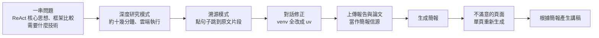

# 用 Skywork 從查資料到做簡報:AI 研究助理該看的三個能力(溯源、自訂信源、單頁重生)

**主題分類:** 科技 / AI 生產力 — 深度研究、文件與簡報生成工具
**來源:** YouTube〈专属研究员已就位,从查论文到做PPT,一人搞定全流程?!〉(程序员老王,2025-09-11,約 7.5 分;**該片無字幕,逐字稿以 CPU faster-whisper 轉錄、非官方字幕**)
**整理日期:** 2026-10-02

> ⚠️⚠️ **立場揭露:這是一支產品推廣影片。** 片尾提供 Skywork 的**邀請碼**(月度會員 9 折、年度 6.6 折),屬聯盟/推廣性質。本文**不評價產品好壞**,只萃取影片示範中**可遷移到任何 AI 研究工具的判斷標準**。
> ⏳ 2025 年 9 月的影片;產品功能與價格可能已變,請以官方為準。

---

## TL;DR

1. ⭐ **情境:** 自學 AI agent 時被一堆名詞淹沒——「ReAct 不是寫網頁的嗎?」「LangChain、PydanticAI、CrewAI 是什麼關係?」問一般 AI 聊天,答案頭頭是道,**但不知道哪裡挖了坑**。
2. ⭐⭐ **影片示範的流程:** 深度研究模式產出報告(約十幾分鐘,**可關網頁讓它在雲端跑**)→ 對報告追問與修正 → 把報告與原始論文**上傳當信源**做簡報 → 不滿意的頁面**單頁重新生成** → 根據簡報生成講稿。
3. ⭐⭐⭐ **值得帶走的三個標準(適用任何工具):**
   - **溯源**:能不能點報告裡的一句話,**直接跳到它引用的原文片段**?
   - **自訂信源**:能不能限定 AI **只在你給的可信資料範圍內**創作,而不是上網亂搜?
   - **局部修改**:能不能**只重做一頁 / 一段**,而不是整份推倒重來?
4. ⭐ **老王抓到的錯:** 報告推薦用 `venv` 管理虛擬環境——不算錯,但 Python 開發者現在有更好的 **uv**。⇒ **AI 報告要有人審**。

---

## 1. 先釐清名詞:ReAct ≠ React

影片開頭的困惑很典型:
| 名詞 | 是什麼 |
|---|---|
| **ReAct**(論文) | Yao 等人 2022 年提出的 agent 範式:**推理(Reasoning)與行動(Acting)交錯進行**——想一步、呼叫工具、看結果、再想下一步 |
| **React**(前端) | Meta 的網頁 UI 函式庫,和 agent 無關 |
| **LangChain、PydanticAI、CrewAI** | 實作 agent 的框架/函式庫;前兩者偏單一 agent 與工具整合,CrewAI 主打多 agent 角色協作 |

📎 本庫關於 agent 基礎的筆記可參考 [[harness-loop-graph-troubleshooting-map]](若想理解這些框架在 agent 架構裡的位置)。

---

## 2. 影片示範的完整流程

| 階段 | 影片示範的重點 |
|---|---|
| **研究** | 選「文件 + 深度模式 + 研究報告」;它先找到 ReAct 論文原文深入,再分別蒐集各框架資料比較,最後整理技術棧 |
| ⭐ **溯源** | 報告附所有參考文獻;**點句子旁的溯源圖示,直接跳到引用的原始片段**;論文附原始連結 |
| **修正** | 「把所有 venv 換成 uv」→ 它重新查資料並更新;還能追問「uv 為什麼比 venv 好」再補進文件 ⇒ 報告是**會持續成長的學習工作區**,不是一次性的靜態摘要 |
| ⭐ **簡報** | **上傳自己的報告與論文當信源**——「讓 AI 在我們自己劃定的可信範圍內創作」 |
| ⭐ **單頁重生** | AI 做簡報常像抽卡;**只對一兩頁不滿意時,只重做那一頁**,並維持整體風格一致 |
| **講稿** | 依簡報產生演講稿,完成「研究 → 分享」整條流程 |

---

## 3. ⭐⭐⭐ 挑選 AI 研究工具的檢查表(不限 Skywork)

| 能力 | 為什麼重要 | 怎麼測 |
|---|---|---|
| **句子級溯源** | 只列參考文獻不夠;要能驗證**這一句**到底出自哪裡 | 挑報告裡最關鍵的三個主張,點溯源看原文是否真的這樣說 |
| **自訂信源 / 限定範圍** | 避免 AI 引用不可靠的網頁 | 上傳 2–3 份文件,問一個文件外的問題,看它會不會老實說「資料中沒有」 |
| **對話式修訂** | 報告會隨學習持續更新 | 要求全文替換某個概念,檢查是否改得一致 |
| **局部重生** | 省時間、維持其他部分不變 | 只重做一頁,檢查其他頁是否完全沒動 |
| **背景執行** | 深度研究常需要十幾分鐘 | 關掉網頁再回來,看任務是否繼續 |

> ⭐ 這些標準和本庫 [[openai-devday-2026-dots-sol-codex]] §8 談的「別只看『已完成』,要回到內容本身驗收」是同一件事。

---

## 4. ⚠️ 老王示範的「審稿」才是重點

- 報告大部分寫得很好,**但推薦 venv 而非 uv**——「這個知識點沒有錯,但 Python 程式設計師都知道現在有更好的工具」。
- ⇒ **領域專家的審稿無法省略**;AI 研究工具的價值是**把初稿與資料蒐集的時間壓短**,不是取代判斷。
- 📎 與 Karpathy 的建議一致:「**Deep Research 的產出一律當初稿,要看引用**」(見 [[karpathy-how-i-use-llms]] §4.2)。

---

## 5. 應用案例

### 案例一:團隊技術選型的「研究 → 決策」流程

1. 用任一深度研究工具,列出要回答的 4–5 個具體問題(比較維度寫清楚)。
2. **逐一點開關鍵主張的溯源**,至少驗證最影響決策的三點。
3. 把報告 + 官方文件**當作唯一信源**做簡報,避免 AI 在簡報階段又引入新的未驗證資訊。
4. 簡報只重做有問題的頁面;會議後把決策補回報告。

### 案例二:自學新領域時建立「會成長的筆記」

- 第一次產出報告後,每學到一個新點就讓 AI 補進同一份文件,並保留溯源。
- 發現 AI 推薦過時工具(如 venv → uv),**直接要求全文修正並說明理由**——修正本身也是學習。

---

## 來源

- YouTube:[专属研究员已就位,从查论文到做PPT,一人搞定全流程?!](https://www.youtube.com/watch?v=yDR5EIvIni4)(程序员老王,2025-09-11)——**該片無字幕,逐字稿以 CPU faster-whisper 轉錄、非官方字幕**;**含產品推廣與邀請碼**
- 論文:[ReAct: Synergizing Reasoning and Acting in Language Models](https://arxiv.org/abs/2210.03629)(Yao et al.,2022)
- 工具官網:[Skywork](https://skywork.ai/)、[uv](https://docs.astral.sh/uv/)

**Whisper 專有名詞還原對照:** react 框架 → ReAct;lanche / Lanchin → LangChain;排单题和AI / Pidentic / Pedantic AI → PydanticAI;Curve AI → CrewAI;V-INV / Vinv → venv;溯原 → 溯源。
