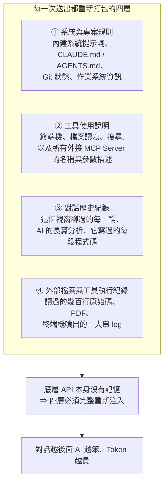
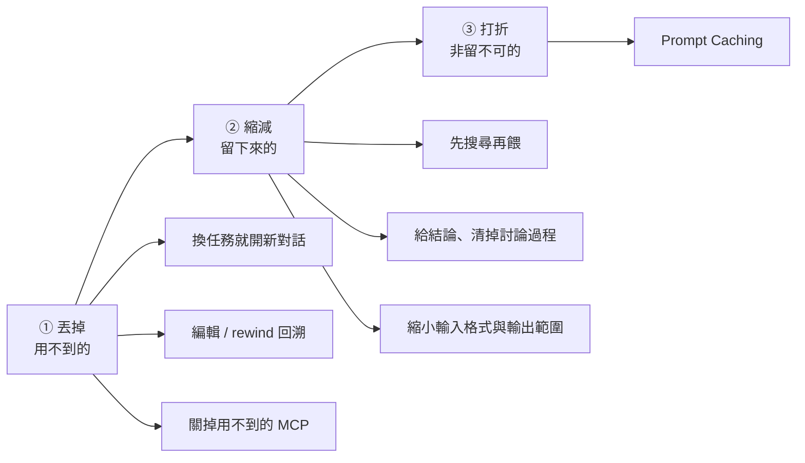
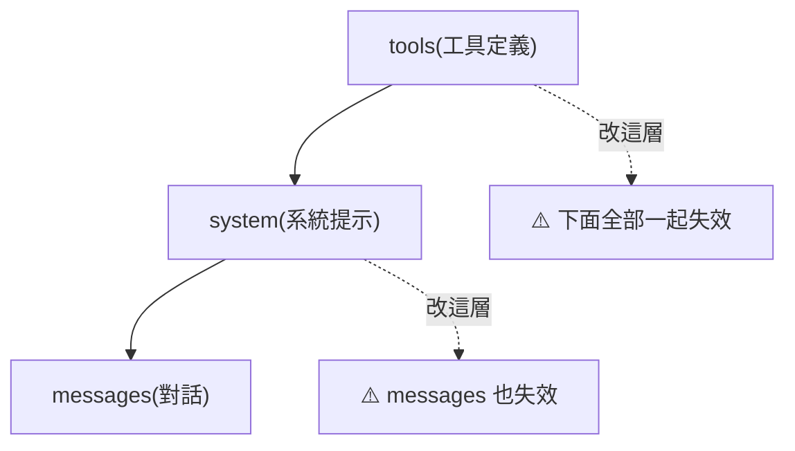
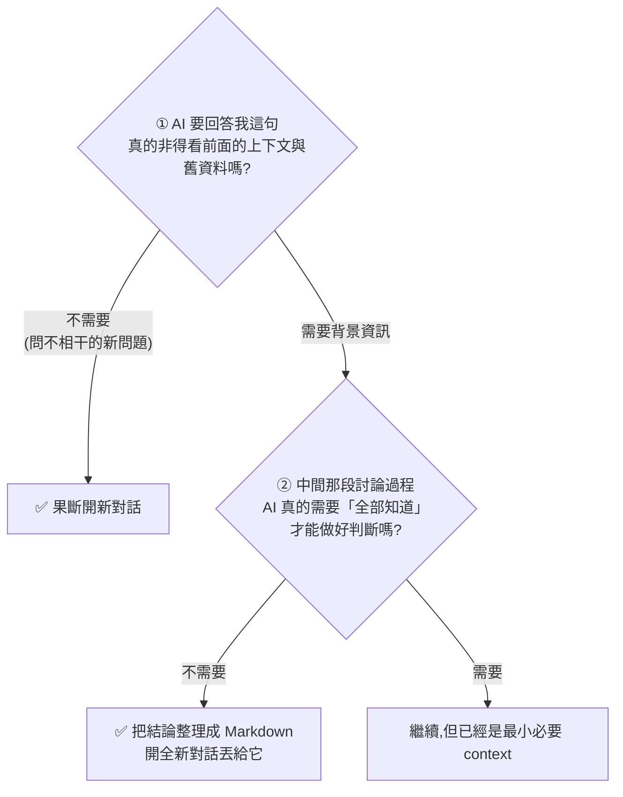

# AI 額度老是不夠用?三招省 Token:丟掉、縮減、打折

> 整理自 YouTube 頻道 **Gary Chen(@garytalksstuff)**〈AI 額度老是不夠用?三招省 Token 的實戰方法〉(2026-08-19,約 11 分鐘,官方 zh-TW 字幕)。
> 依 CLAUDE.md 慣例,**Prompt Caching 段落另比對 Anthropic 官方文件核實**,文中標出**三處影片講得不夠精確或漏掉的地方**。

> 相關筆記:[[context-engineering-processing-vs-thinking]]、[[claude-md-cut-82-percent-and-maintain-it]]、[[model-routing-compute-allocation]]、[[claude-throttling-opus-4-7]]

---

## 一句話總結

**省 Token 的重點不在「把 Prompt 寫短」,而在控制每次被重新打包送出的那包 Context。** 三個動作:**丟掉用不到的 → 縮減留下來的 → 非留不可的交給 Prompt Caching 打折。**

⭐ 而講者最後點出的動機更值得記:**省下來的不只是錢,是幫 agent 清出乾淨的 context** —— 少了雜訊,注意力更集中,產出品質也更好。

---

## 一、先搞懂:你按下送出時,模型到底收到什麼

很多人以為自己只傳了眼前那行短短的字。實際上系統會把**四層資料**一口氣打包塞給模型:



⭐ **關鍵在第 ② 層被嚴重低估**:光是工具清單,每次請求就可能先吃掉**幾千個 Token**,而且**你一個字都還沒打**。

### 雪球效應

| 輪次 | 歷史紀錄 | 你打的字佔整包比例 |
|---|---|---|
| 第 1 輪 | 空的 | 高 |
| 第 10、20 輪 | AI 的長篇分析 + 讀過的檔案 + 報錯 log **全部累積** | ⚠️ **可能不到 1%** |

> 就算你只回一句「幫我改第二行」,模型依然要把前面累積的所有內容**全部重讀一遍** —— 剩下的 99% 全是越滾越大的舊 Context。

---

## 二、⚠️ 兩個「聽起來合理但沒用」的直覺

| 直覺做法 | 為什麼效果有限 |
|---|---|
| **Prompt 寫短一點 / 叫 AI 簡短回答** | 對話視窗早就累積幾萬 Token,把眼前 Prompt 從 50 字縮成 5 字,**省下的比例微乎其微** |
| **換成便宜的小模型** | ⚠️ 一旦寫錯 code 或答非所問,**逼你來回重試好幾次,整趟累積下來反而燒更多** |

> ⭐ 這第二點與 [[model-routing-compute-allocation]] 的結論一致:**便宜模型的成本要算「完成任務的總成本」,不是單次 token 單價。**

---

## 三、三個核心動作



### 動作一:丟掉用不到的(效果最立竿見影)

核心概念:**只要是下一次請求根本用不到的內容,就讓它徹底離開對話視窗。**

**1. ⭐ 換任務,就開新對話** —— 最容易養成、效果也最好的習慣。
> 剛跟 AI 改完登入功能,順手丟一句「幫我看另一份不相干的報表」—— 這時模型還背著上一段任務的所有程式碼、報錯紀錄、工具輸出。**等於每問一句新問題,都在為早就結束的舊進度白白燒額度。**

**2. 善用編輯 / 分支回溯** —— 打錯字或指令不清,模型吐了一堆沒用的內容時:
```
❌ 在底下接著回「不對,我剛剛打錯了,重新來一次」
   ⇒ 那整段錯誤的長篇大論永遠卡在歷史紀錄裡,之後每次對話都被動送出

✅ 回頭編輯剛剛那句指令,或用 rewind 回到送出錯誤 Prompt 之前
   ⇒ 把失敗的產出徹底抹掉
```

**3. 精簡掛載的工具與 MCP Server** —— 每個 MCP 工具背後的說明文件與參數定義,**每次送出都會被完整塞進 Context**。只是要寫個小功能或改文章,就把用不到的網頁搜尋、資料庫等 MCP 果斷關掉。

### 動作二:縮減留下來的

有些背景資料確定接下來會用到,不能丟。那就問:**能不能只萃取真正關鍵的部分,把體積縮到最小?**

**1. ⭐ 先搜尋,再餵給模型**
> 不要把上百頁 PDF 或幾千行程式碼整包丟進去讓模型自己撈。如果問題本來就有明確的關鍵字、函式名稱或錯誤代碼,**先用搜尋工具找出最相關的那幾段,只餵那幾段** —— 光做這動作,每次請求消耗就能**從好幾萬降到幾百**。

**2. ⭐⭐ 給結論,把中間的討論過程清掉**
> 你跟 AI 來回討論半天、推翻兩三個方案才敲定架構。但下一步模型**只需要知道最終確認的規格和限制**,不需要知道那些被淘汰的廢案怎麼來的。
>
> 做法:把最終結論整理成一份 Markdown → **開全新對話**把檔案餵進去。

⚠️ **關於自動 compact / 摘要功能,講者的態度很明確:**
> 「這當然有幫助,但**不要把它當成萬靈丹**。因為摘要本質上是一種**有損壓縮** —— 它會保留大方向,但也可能漏掉細節。**真正重要的規格、限制、決策,最好還是你主動整理成一份乾淨的 Markdown。**」

**3. 縮小輸入格式與輸出範圍**
- 輸入:能用純文字或程式碼傳的,就不要丟幾 MB 的肥大截圖
- 輸出:只改某個函式就**明確要求它只輸出修改後的段落**,不要讓它熱心地整篇重寫

> ⭐ 講者的白話金句:**「AI 聽你說話比較便宜,但你聽 AI 說話比較貴。」**(輸出 Token 比輸入貴,也更吃額度)

### 動作三:把非留不可的拿去打折(Prompt Caching)

主流模型商都有 **Prompt Caching(提示詞快取)**:把對話中重複用到的提示詞暫存在伺服器上,後續請求更快、成本更低。

影片給的數字(以 Claude Opus 5):

| 項目 | 價格 |
|---|---|
| 一般輸入 | **$5 / 百萬 Token** |
| 命中快取後讀取 | **$0.5 / 百萬 Token(打一折)** |

**✅ 官方文件核實:完全正確。** cache read 就是基礎輸入的 **0.1×**。

---

## 四、⭐⭐ 三處影片講得不夠精確 / 漏掉的(比對官方文件)

### 補正一:快取預設是 5 分鐘,不是 1 小時

影片說「Prompt Caching **通常是 1 小時**」。

**官方文件:預設 TTL 是 5 分鐘。1 小時是要另外指定、而且要額外付費的選項**(`"cache_control": {"type": "ephemeral", "ttl": "1h"}`)。

| 環境 | 實際 TTL |
|---|---|
| Anthropic API 預設 | **5 分鐘** |
| 指定 `ttl: "1h"` | 1 小時(**寫入成本翻倍**,見補正二) |
| **Claude Code** | ⭐ **1 小時** —— 所以影片講的在 Claude Code 裡是對的,但當成通則會錯 |

⭐ 還有一個更容易踩的細節,影片沒提:**TTL 是從「送出請求的那一刻」開始算,不是從回應結束算。** 如果一個回應串流了 4 分鐘,那在 5 分鐘 TTL 下,**你只剩大約 1 分鐘可以接著問** —— 長 thinking / 長輸出會把自己的快取窗口吃掉一大半。

### ⭐ 補正二:快取不是免費的 —— 寫入要加價

影片只講「讀取打一折」,漏掉**寫入端要加錢**:

| 操作 | 相對基礎輸入 | Opus 5 換算 |
|---|---|---|
| 一般輸入 | 1× | $5 / M |
| **5 分鐘快取寫入** | **1.25×** | **$6.25 / M** |
| **1 小時快取寫入** | **2×** | **$10 / M** |
| 快取命中讀取 | 0.1× | $0.5 / M |

⚠️ **實務意義:快取只在「會被重複讀取」時划算。**
- 一段 context **寫入後至少要被讀到 1 次以上**才回本(5 分鐘檔:寫多付 0.25,每次讀省 0.9 → 讀 1 次就賺)
- 但如果你**寫進去卻沒再問就跑掉**,那是**淨虧 25%(或 1 小時檔的 100%)**
- ⭐ 所以「開了新 session、塞了一大包 CLAUDE.md 和 MCP 定義、問一句就關掉」是最貴的用法 —— 這正好反向支持動作一「換任務開新對話」要**成批做**,不是每問一句就開一個

### ⭐ 補正三:破壞快取的動作,官方版本更完整也更嚴重

影片點名三個:**中途換模型、中途調思考強度、中途打開加速模式**。✅ 官方文件都證實會失效(`speed`、`thinking parameters`、`effort setting`)。

但官方揭露了一個影片沒講的**層級結構**:



> **快取遵循 `tools → system → messages` 的階層。改動某一層,就會讓那一層與其後所有層全部失效。**

⭐ **這比影片的說法嚴重得多,而且直接連到動作一的第 3 點:**
**對話進行到一半才裝上 / 移除一個 MCP Server,改的是最上層的 `tools`** —— 會把**整包快取從頭打掉**,連系統提示與整段對話歷史都要重新付全額寫進去。

> ✅ **正確做法:MCP 的增減要在「開新對話之前」就決定好,不要中途調整。**

官方列出的其他失效觸發還包括:切換 web search、切換 citations、`tool_choice` 改動、**在任何位置增刪圖片**。

---

## 五、按 Enter 前的兩個自問題

講者給的「記不住細節也用得上」的收斂版:



---

## 應用案例

### 案例 1|⭐ 用「快取回本點」重新設計你的 session 節奏

把補正二的數字接回動作一,會得到一個影片沒推到底的結論:

```
❌ 反模式:每個小問題都開一個新 session
   每次都重新寫入 CLAUDE.md + 工具定義(1.25× 或 2× 價),問一句就關
   ⇒ 專案規則那幾千 token,每次都用「比一般輸入還貴」的價格重付

✅ 正確節奏:「換任務」才開新對話,同一任務內把問題成批問完
   第一次請求寫入快取(多付 25%),之後每輪讀取都打一折
```

⭐ **這兩個原則不衝突,分界線是「任務」不是「問題」:**
- 同一任務內的多輪往返 → **留在同一 session 吃快取**
- 換到不相干的任務 → **開新的**(因為舊 context 已成純負擔)

### 案例 2|⚠️ MCP 管理:從「裝好裝滿」改成「按任務組」

因為 `tools` 是快取層級的最上層,**中途動它 = 整包重算**。實務做法:

| 任務類型 | 只掛載 |
|---|---|
| 寫程式 / 改 code | 檔案讀寫、終端機、LSP |
| 寫作 / 整理筆記 | 搜尋、檔案讀寫 |
| 資料查詢 | 資料庫 MCP |

⚠️ **重點不是「MCP 越少越好」,而是「一個 session 內不要中途改」。** 開工前決定好,開工後就不要動。

> 本倉庫的 [[claude-md-cut-82-percent-and-maintain-it]] 砍的是第 ① 層(專案規則),這篇砍的是第 ② 層(工具定義)—— **兩層都在「你還沒打字就已經花掉的成本」裡。**

### 案例 3|把「給結論、清掉過程」做成固定交接流程

講者在 Patreon 放了一支 prompt 做這件事。自己做的話,結論檔至少要含四塊:

```markdown
## 已確認的決定
- (規格、架構、限制,附一句理由)
## 還沒解掉的問題
- (待決事項 + 目前傾向)
## 明確排除的選項
- (⭐ 這塊最重要 —— 沒寫的話新 session 會把你們推翻過的廢案再提一次)
## 現在的檔案 / 狀態
- (改到哪、下一步從哪接)
```

⚠️ **「明確排除的選項」是多數人漏掉的一塊。** 只寫結論不寫「否決了什麼」,新開的對話沒有那段討論記憶,很容易熱心地把被淘汰的方案重新推薦一輪 —— 你又得再吵一次,反而更貴。

> 這與 [[context-engineering-processing-vs-thinking]] 的主張一致:**要餵給模型的是「處理過的結論」,不是「思考的過程」。**

### 案例 4|「先搜尋再餵」在本倉庫的實例

本倉庫的 `INDEX-SOURCES.md` 與 `scripts/build_source_index.py` 就是這個原則的產物:

```bash
# ❌ 讓 AI 讀遍 198 篇筆記找某支影片有沒有整理過
# ✅ 對一份預先建好的索引做精確比對
grep -F -- "<video_id>" INDEX-SOURCES.md
```

⭐ **一次 grep(幾十個 token)取代掉讀幾百個檔案(幾十萬 token)** —— 而且更準。這正是「輸入端先做檢索,只餵相關片段」的最小可行版本。

### 案例 5|判斷輸出範圍的一句話規則

因為輸出比輸入貴,下指令時養成加一句:

| 情境 | 加上 |
|---|---|
| 改一個函式 | 「只輸出修改後的那個函式,不要重貼整個檔案」 |
| 改文章某段 | 「只給我改動的段落與前後各一句」 |
| 要它分析 | 「先給結論三點,我要細節再問」 |

⚠️ 例外:**要它做整體重構或跨檔案改動時不要硬限制輸出** —— 為了省輸出 token 而讓它只給片段,你反而要多問好幾輪把碎片拼起來,總成本更高。

---

## 重點回顧(TL;DR)

1. **省 Token 的重點不是把 Prompt 寫短,是控制那包 Context。** 對話累積幾萬 token 時,把 50 字縮成 5 字省下的比例微乎其微。
2. **每次送出重新打包四層**:①系統與專案規則(系統提示、CLAUDE.md、Git 狀態)②**工具使用說明(含所有 MCP 的名稱與參數描述,可能先吃掉幾千 token)**③對話歷史 ④外部檔案與工具執行紀錄。因為 **API 本身沒有記憶**,四層每輪都要完整重送。
3. **雪球效應**:到第 10、20 輪,你打的那句指令**可能不到整包的 1%**,剩下 99% 全是舊 Context。
4. **⚠️ 換小模型不一定省** —— 它寫錯 code 逼你來回重試,整趟反而更貴。
5. **三個動作:丟掉用不到的 → 縮減留下來的 → 非留不可的拿去打折。**
6. **丟掉**:①**換任務就開新對話**(最有效)②**編輯 / rewind 回溯**,而不是在底下回「我剛剛打錯了」(否則錯誤產出永遠卡在歷史裡)③關掉用不到的 MCP。
7. **縮減**:①**先搜尋再餵**(從好幾萬降到幾百)②**給結論、清掉中間討論過程**,整理成 Markdown 開新對話餵進去 ③縮小輸入格式與輸出範圍。
8. **⚠️ 自動 compact 不是萬靈丹** —— 摘要是**有損壓縮**,重要的規格/限制/決策要自己整理成乾淨的 Markdown。
9. **「AI 聽你說話比較便宜,你聽 AI 說話比較貴」** —— 輸出 token 比輸入貴,所以要明確限制輸出範圍。
10. **打折**:Prompt Caching。**命中後讀取打一折(0.1×)** ✅ 官方核實正確,Opus 5 $5/M → $0.5/M。
11. **⭐ 補正一:快取預設 TTL 是 5 分鐘,不是 1 小時。** 1 小時要另外指定且加價;**Claude Code 用的是 1 小時**,所以影片的說法在 Claude Code 裡對,當成通則會錯。而且 **TTL 從送出請求那刻起算,不是回應結束** —— 長輸出會吃掉自己的快取窗口。
12. **⭐ 補正二:快取寫入要加價** —— 5 分鐘檔 **1.25×**、1 小時檔 **2×**。⇒ **寫進去卻沒再讀就跑掉是淨虧**;「開新 session 塞滿規則、問一句就關」是最貴的用法。
13. **⭐ 補正三:快取有 `tools → system → messages` 的階層,改上層會讓下層全部失效。** ⇒ **對話中途裝/移除 MCP 會把整包快取從頭打掉** —— MCP 的增減要在開新對話前決定好。影片點名的換模型 / 調思考強度 / 開加速模式 ✅ 官方都證實,另外還有 web search、citations、`tool_choice`、增刪圖片。
14. **按 Enter 前兩個自問題**:① 這句真的需要前面的上下文嗎?不需要就開新對話。② 中間的討論過程 AI 真的需要全部知道嗎?不需要就整理成 Markdown 開新對話。
15. **⭐ 講者的真正動機**:「Token 燒得多本身不是壞事,真正浪費的是**讓早就沒用的 Context 在每輪請求裡白白吃掉額度**。」省下來的是**乾淨的 context、更集中的注意力、更好的產出** —— 他把這稱為「清理 AI 時代的技術債」。

---

## 來源

- [AI 額度老是不夠用?三招省 Token 的實戰方法 — Gary Chen(@garytalksstuff)](https://www.youtube.com/watch?v=d4329xvSDK4)(2026-08-19,約 11 分鐘,官方 zh-TW 字幕)
- [Anthropic 官方文件:Prompt caching](https://platform.claude.com/docs/en/build-with-claude/prompt-caching) —— 核實 TTL 預設 5 分鐘與 1 小時選項、cache write 1.25×/2× 與 cache read 0.1× 的價格倍率、`tools → system → messages` 快取失效階層
- 本倉庫相關筆記:[[context-engineering-processing-vs-thinking]]、[[claude-md-cut-82-percent-and-maintain-it]]、[[model-routing-compute-allocation]]、[[claude-throttling-opus-4-7]]

> ⚠️ 價格與 TTL 以整理時的官方文件為準,模型商調整頻繁,實際請以當下官方定價頁為準。
