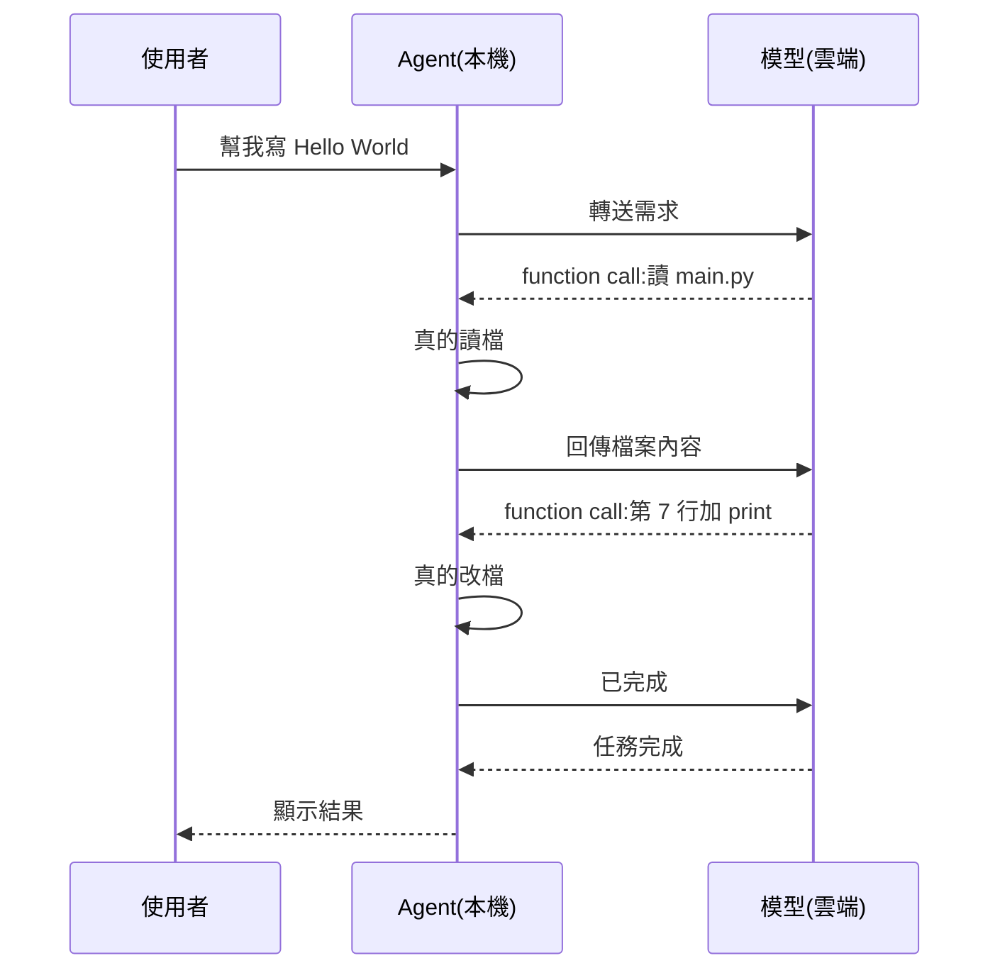
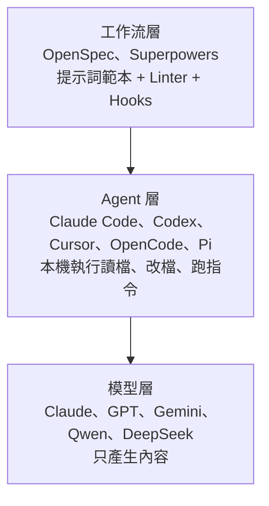
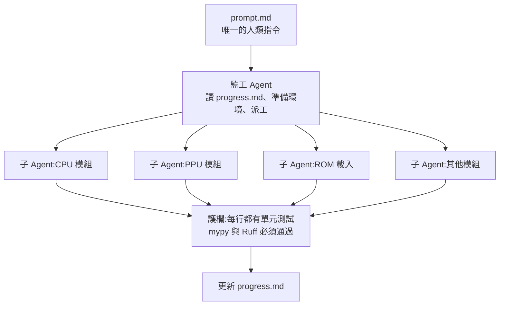

# Vibe Coding 全解:模型、Agent、工作流三層,以及「需求 → 設計 → 任務 → 子 Agent」實戰流程(程序员老王)

**主題分類:** 科技 / AI 生產力 — AI 編程工具的層次與實戰流程
**來源影片(程序员老王,皆無字幕,逐字稿以 CPU faster-whisper 轉錄、非官方字幕):**
- 〈VibeCoding就该这么做!〉(2026-05-14)— 實戰:從零做 FC(紅白機)模擬器跑超級瑪利歐
- 〈Vibe Coding是什么?从AI模型、Agent到工作流,彻底搞懂AI编程工具〉(2026-06-25)— 概念:Claude、Claude Code、OpenSpec、Superpowers 各自是哪一層
**整理日期:** 2026-10-02

> ⚠️ 作者在兩集都推廣自己的「知識星球」付費社群(完整工程與提示詞放在那裡)。本文只整理影片公開講解的流程,**不轉載其付費內容**;下方提示詞範本是依影片口述的「四段式」結構改寫。

---

## TL;DR

1. ⭐⭐ **三層結構:** **模型**(Claude、GPT、Gemini、Qwen、DeepSeek——只會「吐出一段內容」)→ **Agent**(跑在你電腦上的程式,替模型讀檔、改檔、執行指令:Claude Code、Codex、Antigravity、Cursor、Copilot、OpenCode、Pi)→ **工作流**(把一大套提示詞、Linter、Hook 打包成固定流程:OpenSpec、Superpowers)。
2. ⭐ **三層彼此獨立、可以混搭**——例如 OpenCode 接 Claude 模型,或 Claude Code 接國產模型。
3. ⭐⭐⭐ **實戰四步:需求(Proposal.md)→ 設計(詳細設計)→ 任務(每模組 checklist + progress.md)→ 生成「監工 Agent + N 個子 Agent」的總提示詞,一次跑完。**
4. ⭐⭐ **每則提示詞都寫成四段:目標、輸入、輸出、步驟**;不懂的領域就叫 AI「**主動提問,不要猜我的意圖**」。
5. ⭐⭐ **每一步開新對話**,前一步的成果都已濃縮在文件裡——上下文短、省 token、少幻覺、不怕自動壓縮把細節壓掉。
6. ⭐ **語言選 Python / JS / Rust**,再配**型別檢查(mypy)+ Linter(Ruff)+ 單元測試(pytest)**當護欄;結果:約 15 分鐘生成模擬器,**196 個測試全過**,可跑但達不到 60 幀。
7. 💬 結語:「**工具一年換三茬,底下這套結構是不變的**;再火的東西也不過是同一個老故事加了點佐料、起了個新名字。」

---

## 1. 概念篇:AI 編程工具的三層

### 1.1 史前:對著聊天視窗複製貼上

最早的 Vibe Coding 是:在聊天網頁描述需求 → 複製 AI 給的程式碼 → 本機執行 → 把錯誤訊息貼回去 → 循環。老王自嘲這叫「基於大語言模型與生物介質傳導的編程與調試方法」(人肉搬運)。他第一個這樣寫成的程式是 2023 年 4 月的 [memory_map_visualizer](https://github.com/cradiator/memory_map_visualizer),repo 裡附了當時完整的聊天紀錄。

### 1.2 模型層:只負責「吐出內容」

- 聊天網站本身沒有智慧,只是把訊息轉給背後的大模型;Claude、GPT、Gemini、Qwen、DeepSeek 原本指的都是**背後的模型**。
- 各家定位:GPT 主打全模態、Gemini 和 Google 自家產品整合、國產模型受晶片與算力限制而更重視效率與架構創新。
- **Claude 是特例**:不能寫歌、畫圖、做影片,但「把寫程式卷上了天」,所以即使價格高仍是寫程式首選;Sonnet、Opus、Mythos、Fable 都是 Claude 的不同等級。

### 1.3 Agent 層:給 AI 一雙手

聊天介面沒辦法直接寫你的程式,原因有二:
1. 模型與網頁**跑在廠商的伺服器上**,碰不到你本機硬碟;
2. 模型**唯一能做的是產生一段內容**——它說「我要讀 main.py」,沒人代勞的話檔案不會自己跑過去。

⇒ 需要一個**跑在使用者電腦上的程式**替 AI 執行指令,這就是 **Agent**。實際上 AI 不會說「在第 7 行加 print」,而是回傳 **function calling**(通常是 JSON),Agent 靠這個格式分辨「這是指令」還是「要顯示給使用者的文字」。



- 開發 Agent 的門檻遠低於訓練模型,所以 Agent 很多:模型廠自製(Claude Code、Codex、Antigravity)、第三方(Cursor、Copilot)、開源(OpenCode、Pi)。
- **Agent 與模型沒有綁定**,大多能自由搭配。
- **Andrej Karpathy 在 2025 年初**把「只提需求、AI 寫的程式碼看都不看、全憑感覺」的寫法命名為 **Vibe Coding**。

### 1.4 工作流層:把溝通技巧打包

Agent 普及後,大家發現 AI 寫的程式會**目光短淺**(修好一個 bug、引入新 bug,甚至破壞原本邏輯)、**需求不明**(「我要薩爾達,它給我原神」)——雖然多半是我們自己沒說清楚。於是發展出一套溝通技巧:

| 技巧 | 做法 |
|---|---|
| 先討論需求 | 讓 AI 不斷提問、整理答案 |
| **SDD**(Spec-Driven Development) | 先寫規格文件,再依文件開發 |
| **TDD**(Test-Driven Development) | 先寫測試,寫程式變成「讓測試通過」 |
| 靜態檢查關卡 | 寫完必須通過各種 checker 才算完成 |

整套話術「字數能寫一篇高考作文」,於是有人把它們做成**範本**分享:

| 工具 | 流程 | 用法 |
|---|---|---|
| **OpenSpec** | 討論 → 需求與規格 → 程式碼(**SDD**) | `/openspec explore 我想做薩爾達` → `/openspec propose`(轉成文件)→ `/openspec apply`(轉成程式碼) |
| **Superpowers** | 討論 → 需求與測試 → 程式碼(**TDD**) | 類似,只是指令不同 |

這些工具通常利用 Agent 內建的**提示詞範本(slash command)**,並附帶**小程式與規則**來約束 AI:例如確保文件格式正確的 **Linter**、防止已定稿文件被 AI 隨意修改的 **Hooks**。整套東西讓開發變成固定順序——也就是「**工作流**」。



---

## 2. 實戰篇:從零做一個 FC 模擬器

### 2.0 準備:選語言 + 裝護欄

| 語言 | 為什麼適合 Vibe Coding |
|---|---|
| **Python、JS** | 「AI 世界的母語」;叫 AI 隨便寫 Hello World 大概率就是這兩個;第三方庫最多,AI 不必重造輪子 |
| **Rust** | AI 沒那麼拿手,但**語法嚴格到苛刻**——寫的痛苦由 AI 承擔,安全性由我們享受 |

老王用 **uv** 建一個空的 Python 工程,並裝好三個護欄,彌補 Python 太靈活 + AI 自由發揮的不確定性:
- **mypy**(型別檢查)
- **Ruff**(語法 / 風格檢查)
- **pytest**(單元測試)

另外放一個超級瑪利歐 ROM 供測試。

### 2.1 第一步:需求——四段式提示詞 + 讓 AI 反問

> 寫出來的東西總覺得「差一口氣」,根本原因是**我們自己也不知道自己要什麼**。

每則提示詞都分四段(範例依影片口述改寫):

```text
【目標】我想用 Python 開發一個 FC 模擬器,最終能執行超級瑪利歐。現在請幫我完成需求文件。
【輸入】目前資料夾是一個 uv 建立的 Python 工程;rom/ 資料夾下有超級瑪利歐的映像檔。
【輸出】請在 docs/ 下產生需求文件 proposal.md。
【步驟】我完全不了解 FC 模擬器。請用提問的方式幫我確定需求,
       不要猜測我的意圖,任何不明確的地方都必須先問我。
```

貼進 Claude Code(或 Codex、Gemini CLI)後,它會問一連串問題,最後產生 `proposal.md`——從技術角度釐清到底要做什麼。現在的強模型通常順便做好了**概要設計**(老王的需求文件裡已切出 ROM 載入、CPU 模擬、PPU 模擬等模組)。

### 2.2 第二步:詳細設計——開新對話

- 同樣用四段式,步驟裡**再次要求 AI 主動提問**,降低設計的不確定性。
- ⭐ **開一個新對話**:前面討論的成果已濃縮在 `proposal.md`;「**把關鍵資訊存在檔案裡,讓每次對話都盡量少做事、上下文盡量短**」——省 token,也能減少幻覺。之後每一步都照這個做法。

### 2.3 第三步:切任務

為什麼不直接照設計寫?專案大時,所有程式碼都堆在同一個上下文裡——又慢又貴,而且上下文太長時 AI 會**自動摘要壓縮**,很可能把正在寫的模組 N 的細節壓掉,更容易出 bug。

提示詞重點:
1. **每個模組一份獨立的任務清單**,用 checklist 標記完成與否(方便之後開多個 Agent 並行);
2. 一份總的 **`progress.md`** 記錄每個模組是否完成;
3. 這一步**不再讓 AI 提問**——需求與設計已經夠細。

### 2.4 第四步:讓 AI 寫出「監工 + 子 Agent」的總提示詞

現在多數編程 Agent 都能**自動生成子 Agent**,所以架構是:



- 整個實作過程**沒有人工參與**,唯一的命令是監工 Agent 一開始收到的提示詞——它得同時寫清監工與每個子 Agent 的工作,所以很複雜。
- ⭐ **這份提示詞也讓 AI 生成**:用一則「產生提示詞的提示詞」說明主 / 子 Agent 各自職責、要求每行程式碼都有單元測試並通過 mypy 與 Ruff、最後再給 AI 一次提問機會,輸出到 `prompt.md`。
- 生成的 `prompt.md` 包含:監工如何準備環境、如何切分子 Agent、**每個子 Agent 的提示詞**(含詳細設計與任務檔路徑、如何實作、如何測試驗證)。

### 2.5 執行與結果

- 用 Claude Code 命令列讀 `prompt.md` 執行。影片為了示範開了**全權限參數**;⚠️ 老王提醒實務上應**用 permission policy 管權限,或把專案放進 Docker**,避免提示詞注入。
- **約 15 分鐘**寫完:能跑超級瑪利歐,但有點拖慢、達不到 60 幀。後續優化就**重複 Proposal → Design → Coding** 的流程。
- 產出:每模組一個程式檔(與詳細設計一致)、每模組一個測試檔;手動跑 mypy、Ruff 都通過,**196 個測試全過**。
- ⭐ 這些測試與檢查對持續開發極重要——「**未來加新功能時,AI 才不會破壞原有功能**」。

---

## 3. 應用案例

### 案例一:把四步流程套到內部工具

想做一個「把 CSV 銷售報表轉成週報 PDF」的內部工具,但你不熟 PDF 排版:
1. **需求**:四段式提示詞,步驟寫「我不懂 PDF 函式庫,請逐題問我」→ `docs/proposal.md`(會被問到:頁面大小?要不要圖表?中文字型?)。
2. **設計**:新對話,讀 proposal → `docs/design.md`(模組:CSV 解析、彙總計算、圖表、PDF 輸出)。
3. **任務**:新對話 → `tasks/<模組>.md` checklist + `progress.md`。
4. **總提示詞**:新對話,請 AI 產生 `prompt.md`,規定每個子 Agent 必須寫 pytest、通過 mypy 與 Ruff。
5. 在 Docker 容器裡讓 Claude Code 執行 `prompt.md`。

### 案例二:判斷一個新工具在哪一層

| 你聽到的名字 | 層級 | 換掉它會影響什麼 |
|---|---|---|
| Claude Opus / GPT / DeepSeek | 模型 | 程式碼品質、價格 |
| Claude Code / Codex / Cursor / OpenCode | Agent | 能操作哪些東西、權限管理、子 Agent 能力 |
| OpenSpec / Superpowers / 自訂 slash command | 工作流 | 開發順序與約束(SDD 或 TDD) |

下次看到「最新最強的 AI 編程神器」,先問它屬於哪一層,就知道它是否真的取代你現有的東西。

### 案例三:為什麼長任務要「開新對話 + 寫檔」

同一個對話裡做完需求、設計、寫 20 個模組,上下文會被自動壓縮多次,第 15 個模組時 AI 可能已忘記第 3 個模組的介面約定。把介面寫進 `design.md`,每個子 Agent 只讀自己需要的那份文件——這和 [[gemini-cli-prompt-to-agent-progress-notes]] 用 `progress.md` 對抗「lost in the middle」是同一個原理。

---

## 來源

- YouTube(程序员老王,皆無字幕,逐字稿以 CPU faster-whisper 轉錄、非官方字幕):
  - [VibeCoding就该这么做!](https://www.youtube.com/watch?v=ytT4-lGEf6A)(2026-05-14)
  - [Vibe Coding是什么?从AI模型、Agent到工作流,彻底搞懂AI编程工具](https://www.youtube.com/watch?v=EUYt0Q-hPeo)(2026-06-25)
- 作者第一個 Vibe Coding 專案:[cradiator/memory_map_visualizer](https://github.com/cradiator/memory_map_visualizer)
- 工作流工具:[OpenSpec](https://github.com/Fission-AI/OpenSpec)、[Superpowers](https://github.com/obra/superpowers)
- Vibe Coding 一詞出處:[Andrej Karpathy 的貼文(2025-02)](https://x.com/karpathy/status/1886192184808149383)

📎 相關筆記:[[gemini-cli-prompt-to-agent-progress-notes]]、[[to-tickets-spec-to-agent-workunits]]、[[matt-pocock-skills-teardown]]、[[karpathy-how-i-use-llms]]、[[pi-minimal-agent-harness-teardown]]

**Whisper 專有名詞還原對照:** 外部coding / Web Coding / Wipe Coding → Vibe Coding;Cloud → Claude;Answerpick / Anthropeak → Anthropic;Jamenite / Giminite → Gemini;签问 → 千問(Qwen);Misos → Mythos;FunctionColing → function calling;Anti Gravity → Antigravity;Andrey Kapasi → Andrej Karpathy;OpenSpark / OpenSpack → OpenSpec;买派 → mypy;Raf / ROF → Ruff;UV / 优威 → uv;Geminal CLI → Gemini CLI;紫Agent → 子 Agent;知识清球 / 支持星球 → 知識星球。
