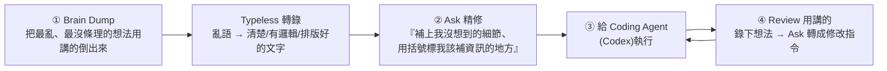
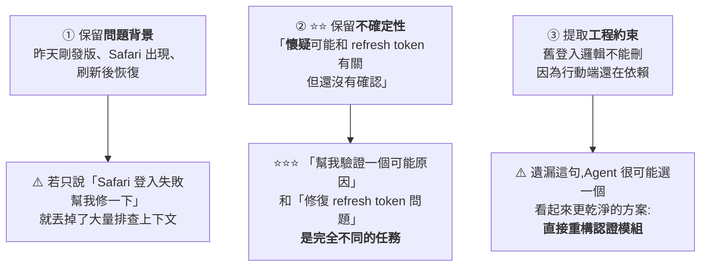
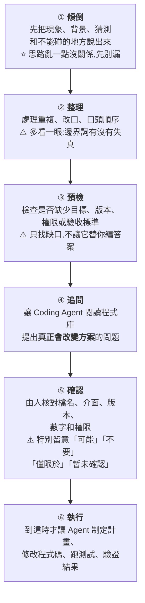

# AI 時代最被低估的技能:語音輸入,以及「把世界看成一場 context 轉換遊戲」

> 整理自 YouTube「Gary Chen」〈語音輸入 x AI 怎麼用?AI 時代最被低估的工作技能!ft. Typeless〉(2026-07-07,約 12 分鐘)。這支不講 prompt、不講 Claude/Codex,而講一個「作者幾乎每天用、但 99% 的人忽略」的技巧——**語音輸入**。表面是工具介紹,底層是一個視角:**知識工作者本質是 context 的搬運者與轉化者,而 AI 讓這種轉換的成本趨近於零。**
>
> ⚠️ 影片含 Typeless 工具推廣(作者有分潤);本筆記聚焦方法與觀念,工具僅為載體。
>
> ⭐ **2026-09-13 增補 Why QQ**〈[Karpathy 都在用语音喂 AI:我用 Typeless 重做了 Coding Agent 工作流](https://www.youtube.com/watch?v=98Mz0a1wJag)〉(2026-09-12,約 12.4 分鐘,官方 zh-Hans 字幕),成為 **§4:Voice Spec Loop 六步** —— 把同一個主題推進到「交代複雜排查任務給 Coding Agent」的場景,並帶來一篇**可查證的研究**說明:**判斷語音輸入好不好,不能只看順不順,要看它有沒有守住事實、假設與邊界。**
> ⚠️ **該片同樣含 Typeless 聯盟連結(作者收佣金),且作者在片中明講。**

---

## 一句話總結

**語音輸入不是配角,是 AI 時代與 AI 協作的核心技能之一**——因為它同時解決兩件事:**① 效率**(說話比打字快 3 倍)與 **② context 的豐富度與精準度**(打字有成本、你會下意識壓縮省略,而那些被略過的細節正好定義了你的品味)。而全片真正的重點不是語音輸入,是**「把世界看成一場 context 轉換遊戲」的視角**。

---

## 1. 為什麼語音輸入在 AI 時代這麼重要

- **效率**:史丹佛研究指出**說話比打字快 3 倍**——同樣時間能指派給 Agent 的任務多 3 倍(打字要 9 小時的工作量,語音 3 小時做完)。
- **context 的豐富度與精準度(更重要)**:**打字是有成本的**,你會下意識想省力、能少打一個字就少打,結果丟給 AI 的永遠是「被大腦壓縮、精簡過的版本」。**用講的幾乎沒有摩擦力**,可以很自然地把背景、脈絡、還有你打字時偷懶想略過的小細節全倒出來——而**對 AI 來說,正是這些「你以為不重要」的細節,定義了你的品味、以及成果是否符合你的預期。**

---

## 2. 實戰工作流(語音 + Codex 從 0 到 1 做個人網站)

1. **Brain Dump(先把想法全講出來)**:開發初期把所有想法用講的做 brain dump——這時想法最雜、最沒條理。**若用打字,會不自覺邊打邊修、邊打邊篩,很多腦中很粗略、卻最能代表你品味的想法,就在「想把句子打通順」的過程中被遺忘了。** 用講的相反:沒有摩擦力,你不會陷入一直審查自己說得是否合邏輯/通順,只需專注把想法講出來。
2. **轉錄免精修**:Typeless 把混亂語言直接轉成清楚、有邏輯、排版好的文字,**跳過精修文字與排版的繁瑣過程**;中英夾雜與專有名詞也能準確轉錄。(對比 Apple Dictation:中英切換不準、常漏字、要修好幾輪。)
3. **Ask 功能——不急著送 prompt,先讓它幫你想更深**:brain dump 後**不要馬上送出**,選取轉錄文字、按 `Control+Space` 觸發 **Ask**,說「這是要給 coding agent 的提示詞,幫我補上我沒想到的細節,並在你覺得我該補資訊的地方用括號標起來」。它會用括號標出可補充處 → **引導你做更深入的思考、訓練你把意圖表達清楚**(正是作者一直強調的:告訴 AI 你到底想要什麼)。來回調整讓資訊更完整,產出更符合想像。
   - 同一個 Ask 也拿來:**回客戶 Email**(口述完 → 請它照你的語氣與本意轉成專業信)。
4. **不懂的名詞即時查(不打斷心流)**:開發中 AI 常丟一堆看不懂的名詞。以前要切出去開 GPT 打字搜尋、心流就斷了;現在直接 `Control+Space` 問 Typeless「這什麼意思?用白話解釋」→ 秒回、不切視窗、不打字。(研究:工作被打斷後要 **23 分鐘**才能恢復專注 → 每用一次就等於省 23 分鐘。)
5. **Review 也用講的**:大部分人討論完/review 完就忘了,頂多記兩句、或花時間重新回想再轉成 prompt。作者**用 Typeless 把 review 的想法錄下來**(和同事討論、或自己看著產出 brain dump),再用 Ask 轉成「給 coding agent 的清楚修改指令」。同法可套用:客戶會議 → Codex 提示詞、一堆混亂想法 → 完整提案。
6. **走路捕捉靈感**:Typeless 有手機版(吵雜處辨識也不錯)。「做產品這麼多年,最好的想法幾乎沒有一個是坐在電腦前想出來的,都是在走路、洗澡時冒出來的」,而靈感保鮮期超短。**Codex 手機版 / Claude Code remote control + Typeless mobile** → 邊遛狗散步邊對手機講話,Agent 邊聽邊工作。作者現在一半工作時間都在走路。

> **效率帳**:每天打 1 萬字約 2 小時,用講的只要 30 分鐘 → 一天省 1.5 小時、一週省近一個工作天。**但**有些人就是喜歡安靜打字幫助思考——這只是作者的個人習慣。

---

## 3. 核心觀念:世界是一場「context 轉換遊戲」

> 全片真正的重點**不是語音輸入、不是 AI coding、也不是 Typeless 怎麼用**,而是**這個視角本身**。

- **知識工作者說穿了就是 context 的搬運者與轉化者**:產品經理把一場 meeting 變成一個軟體上線;你把腦中一團模糊想法變成遞給老闆的簡報——**本質都是同一件事:把一種形式的 context 轉換成另一種形式的**。一旦用這視角看世界,它無所不在(和朋友閒聊 → 旅行計畫;洗澡念頭 → 創業起點;甜言蜜語 → 生日情書)。
- **人的角色**:人是這世界裡「**負責捕捉 context 並賦予它意義**」的角色。**AI 讓 context 之間的轉換變得前所未有地容易**,那留給人類的是什麼?——**你一路累積的失敗與成功、獨一無二的價值觀與信念、選擇做什麼/不做什麼的判斷力。**
- 「從想法到成果,在人類歷史上從來沒有像現在這麼容易過」;語音輸入 + AI 工具讓**「腦中念頭化為行動的成本低到幾乎等於零」**——這是作者眼中「軟體/AI 最浪漫的地方」。

---

---

## 4. ⭐⭐⭐ Voice Spec Loop 六步:語音的價值不是「更快」,是「守住事實、假設與邊界」(2026-09-13 增補,來源:Why QQ)

**§1–§3 講的是「語音為什麼重要」與「怎麼用它從 0 到 1 做東西」。
這一節換一個更難的場景:當你腦子裡壓著一堆背景,要把它交給一個跑很快的 Coding Agent。**

> ⚠️ **立場揭露:作者在影片與說明欄放了 Typeless 的**專屬聯盟連結**(訂閱可得 $5 折扣、他收佣金),並在片中明講。
> **本節只整理其方法論與可查證的研究,不轉述其推廣的定價細節;工具可替換,流程才是重點。**

### 4.1 ⭐⭐⭐ 問題定義:Agent 不是不幹活,是幹得太快

> **「最讓人崩潰的往往不是 Agent 不幹活,而是它幹得特別快 ——
> 咔咔一頓輸出之後,你才發現:它從一開始就理解錯了。」**

**影片用的真實案例(一個很典型的排查任務):**

| 你腦子裡知道的事 | 性質 |
|---|---|
| 昨天剛發版,上線後才出現 | **事實** |
| Safari 比較容易重現,多刷新幾次偶爾又恢復 | **事實** |
| 可能和 refresh token 有關 | ⚠️ **假設(不是結論)** |
| 看過 Google Provider 設定與 Better Auth 這個庫 | **已做過的排查** |
| **舊的登入邏輯現在不能刪,因為行動端還在依賴** | ⚠️⚠️ **約束** |
| 這次只允許排查,**不要重構認證模組** | ⚠️⚠️ **禁止事項** |
| 希望先分析可能原因、要收集哪些證據、下一步排查路徑 | **目標** |

**⚠️ 但真到寫 prompt 時,多數人只敲一句:「幫我查一下 Safari 登入偶發失敗,可能和 refresh token 有關。」**

> ⭐⭐⭐ **「複雜任務裡的第一處錯誤,經常不是程式碼寫錯,而是人把自己知道的東西省掉了。」**

### 4.2 ⭐⭐ 為什麼是語音:它降低的是「表達成本」,不是幫你想清楚

**Karpathy 的習慣(影片引用):當他覺得只靠鍵盤交代不清背景時,會切到語音做一段約十分鐘的自由講述 ——
不急著排版,也不怕說得顛三倒四。**

> **他的原話大意:模型有時只是需要更多資訊才能搞懂你到底想做什麼,但人懶得把它們全打出來。**

⭐ **影片對這件事的定調非常克制,值得抄下來:**

> **「重點不是語音比鍵盤高級。真正影響輸入品質的,往往是**表達成本**。」**
> **「我不會把它說成『工具替我想清楚了』—— 它降低的是表達和整理的摩擦,工程判斷仍然在我手裡。」**

📌 **那些「看起來不值得專門寫一段、但漏掉就跑偏」的零碎資訊:**
- 「這只是我的猜測,不是結論。」
- 「先調查,不要直接改程式碼。」
- 「舊程式碼雖然很難看,但現在不能動。」

> ⭐⭐ **這些資訊不一定在程式碼庫裡 —— 很多時候它們只存在於當前處理問題的那個人腦子裡。**

### 4.3 ⭐⭐⭐ 系統聽寫 vs 結構化整理:差在哪

**同一段口述,兩種處理:**

| | 系統聽寫 | ⭐ 結構化整理 |
|---|---|---|
| 做的事 | **把聲音轉成文字** | **整理成一份適合交給 Agent 的任務說明** |
| ⚠️ 問題 | **事實、假設、約束、目標全部堆在一起** | 分層保留 |
| Agent 收到後 | ⚠️ **還要自己判斷:哪些該信?哪些只是猜測?哪些事不能做?** | 直接可執行 |

**三個關鍵的保留:**

> ⭐⭐ **一句話點破真實專案的特性:「很多程式碼不是不能優化,而是**當前不能動**。
> 這些隱藏條件,往往決定了最終方案。」**

📌 **另一個程式設計師專屬的現實問題:我們思考時用中文,但專案裡的變數名、報錯、issue 和技術文件大多是英文。**
⭐ **做法:內容確認後再把中文任務說明整份轉成英文** —— 方便和變數名、報錯、文件放在一起對照。
⚠️ **轉換時要檢查「可能」「不要」「僅限於」這些邊界詞有沒有在譯文中被保留。**

### 4.4 ⭐⭐⭐ 規格預檢:像提交 PR 前先跑一遍 Lint

> ⚠️ **「只要我說得夠多,Agent 就一定能理解嗎?不一定 —— 資訊多不等於有效資訊多。
> 你可能講了很久,依然沒說版本範圍,也沒說什麼叫完成。」**

**⭐ 影片用的預檢提示詞(可直接抄):**

> **「請檢查這段任務說明是否明確包含:目標、已確認事實、未確認假設、檔名、介面名、
> 版本、時間範圍、權限邊界、禁止事項和驗收標準。
> **只列出缺失或含糊的項目,不要自行補全。**」**

⚠️⚠️ **最後那句「不要自行補全」是整段的關鍵 —— 否則工具會把缺口用幻覺填滿。**

#### ⭐⭐ 能力邊界要講清楚:靜態檢查 vs 動態追問

| 誰做 | 能做什麼 | ⚠️ 不能做什麼 |
|---|---|---|
| **語音/整理工具** | 檢查任務說明裡**有沒有寫出**檔名、版本、權限 | ⚠️ **不能確認檔名是不是真的、版本範圍對不對、權限是否已批准** |
| **Coding Agent** | ⭐ **讀完專案後再追問** | — |
| **人** | ⭐⭐ **核實事實與邊界、拍板** | — |

**⭐ 所以不要立刻讓 Agent 改程式碼,而是補一句:**

> **「先閱讀相關程式碼和歷史紀錄,不要修改檔案。
> 請先指出我的任務說明中哪些問題會改變排查方案。」**

> ⭐⭐⭐ **「我很喜歡這裡的分工:整理工具做**輸入前的靜態檢查**,Coding Agent 做**進入專案後的動態追問**。
> 這是兩碼事,但正好能接起來。」**

### 4.5 ⭐⭐⭐ 一篇研究說明「順不順」不是好標準

**影片引用 2026 年的一篇預印本,研究語音轉寫錯誤與鍵盤錯誤如何影響模型。**

> ⭐ **核實後,這篇是《Should We Type or Talk to LLM Agents? A Comprehensive Study of Voice and Keyboard Input Perturbations》,
> 其中 **HIVE = Human Input-Variation Engine**(17 個擾動運算子 + 2 個對照),
> 跨 5 個模型、6 個基準、19 種條件、每種 5 個種子,**累計 55 萬次評分生成**。**

| 發現 | 內容 |
|---|---|
| ⭐ **語音的代價確實比較大** | **語音擾動平均掉 9.7 分,鍵盤錯誤只掉 3.0 分** |
| ⭐⭐⭐ **但主因不是「嗯」「啊」** | **懲罰與「口語 vs 正式語域」相關,不只是填充詞** —— 原文:**「填充詞是充分條件,但不是必要條件」** |
| ⭐⭐⭐ **真正的預測因子** | **「原問題的 token 有多少存活下來」(r = +0.79)** —— **破壞 token 很傷,新增 token 幾乎無害** |
| ⭐ **只在生成式任務上出現** | 需要**建構答案**的任務才有差;選擇題(選答案)沒有 |
| ⭐⭐ **推理能buffer打字錯誤,但救不了語音** | 開啟延伸推理幾乎消除鍵盤錯誤的懲罰,**但語音的懲罰基本不變** |

⭐⭐⭐ **影片從中提煉出的判準,正好呼應 §4.3:**

> **「更容易傷到結果的,是原問題中的詞和邏輯關係在壓縮、重排或改寫時被破壞。**
> **比如你原來明明說『我**懷疑** refresh token 有問題』,整理之後卻變成『refresh token 有問題』——**
> **只少了幾個字,任務就從『沿著這個方向排查』變成了『按既定結論修復』。」**

> ⭐⭐ **所以判斷一段語音輸入好不好,不會只看它順不順,還要檢查它有沒有守住事實、假設和邊界。**

📎 **這條發現也解釋了為什麼「自動整理」是雙面刃:整理得越「乾淨」,越容易把「我懷疑」磨成「結論」。**

### 4.6 ⭐⭐ 另一個佐證:Anthropic 的 40 萬次會話分析

> **影片引用:Anthropic 分析過約 40 萬次 Claude Code 會話,
> 使用者表現出的領域知識越強,會話達到「驗證成功」的比例也越高。**

⭐ **影片自己先把話說死,態度很好:**

> **「這不能直接證明長 prompt 更好,更不能證明兩者之間一定存在因果關係。
> 它至少說明:人對問題的理解,仍然會影響 Agent 被帶到哪裡。」**

📌 **核實後補充該研究幾個更具體的數字(影片未提):**

| 發現 | 數字 |
|---|---|
| 樣本 | 約 **40 萬**次會話、**23.5 萬**人,期間 2025-10 至 2026-04 |
| ⭐⭐ **領域知識比「是不是工程師」更能預測成功** | 軟體工程師 **34%** 驗證成功 vs 非軟體職業 **29%** —— **只差 5 個百分點** |
| ⭐ 專家 vs 新手 | 專家評級會話 **28–33%** vs 新手 **15%** |
| ⭐⭐⭐ **同一句指令,專家換到的工作量更大** | 專家觸發約 **12 個 Claude 動作、3,200 字輸出**;新手約 **5 個動作、600 字** —— **動作差 2.4 倍、輸出差 5 倍以上** |
| 分工樣態 | **人做多數「做什麼」的規劃決策,Claude 做多數「怎麼做」的執行決策** |

> ⭐⭐ **一個新接手專案的人看到登入失敗,可能只看到一條報錯;
> 經歷過幾次發版的人,還會想到灰度範圍、舊版本相容、登入態遷移、快取、埋點和回滾路徑。**
> **「語音不會憑空製造專業知識,它只是把表達的門檻降下來,讓人更願意把已經知道的東西說出來。」**

### 4.7 ⭐⭐⭐ Voice Spec Loop 六步(本節的核心產出)

| 角色 | 負責 |
|---|---|
| **語音/整理工具** | **降低表達和整理的摩擦** |
| **Coding Agent** | **讀專案、執行** |
| ⭐⭐ **人** | **事實、邊界、拍板** |

> ⭐⭐⭐ **「這套流程看起來多了幾步,其實只是把後面的返工,提前變成了一次便宜得多的檢查。」**

### 4.8 ⭐⭐ 什麼時候該切回鍵盤(這一段最誠實)

| 場景 | 用什麼 |
|---|---|
| **檔案路徑、Shell 參數、正規表達式、必須一字不差的函式名** | ⭐ **鍵盤**(錯一個字元都可能出事) |
| **解釋舊邏輯為什麼不能動、上次發版到底改過什麼** | ⭐ **語音**(打字很容易讓你把一整段背景壓成一句話) |

> ⭐⭐⭐ **「鍵盤管『每個字元要對』,語音管『來龍去脈別漏』—— 不是輸贏,是分工。」**

⚠️ **一條不能跳過的邊界:涉及公司程式碼、客戶資訊和敏感資料時,先遵守所在組織的安全要求。
工具再方便,這條也不能跳過。**(⭐ 語音輸入通常會把音訊送到第三方服務,這一點要自己確認。)

### 4.9 ⭐ 一個更大的判斷:為什麼現在反而要在任務定義上多花兩分鐘

**影片引用 OpenAI 介紹 Codex 團隊工程實踐的一個判斷:**

> **他們把應用介面、日誌、指標和追蹤都變成 Agent 可以查詢的上下文,
> Codex 因而可以重現問題、操作 UI 並驗證修復。**
>
> ⭐⭐⭐ **那篇文章裡有個判斷很直接:「對 Agent 來說,執行期無法存取的知識,實際上就等於不存在。」**

⭐ **而這正好接上本節的主題:**

> **「以前程式碼寫得慢,很多問題會在實現過程中被迫想清楚。
> 現在 Agent 可以很快給出一個看上去完整的實現 —— **理解偏了,返工也來得更快**。
> 所以我現在反而更願意在任務定義上多花兩分鐘:
> **把目標和邊界說清楚,通常比事後解釋『我不是這個意思』便宜。**」**

📎 這與本庫 [[anthropic-html-work-pages]] 的「產出變便宜、理解變貴」是同一件事的上游 ——
**那篇講的是「產出之後怎麼驗」,這節講的是「產出之前怎麼交代」。**

### 4.10 應用案例:今天就能跑一次的自測

⭐ **影片給的測試設計很聰明,值得照做:**

| 步驟 | 做法 |
|---|---|
| **選題** | ⚠️ **別拿「把按鈕改成藍色」來測** —— 找一個**你腦子裡有背景、但每次敲鍵盤解釋都嫌麻煩**的問題 |
| **執行** | 先說完整 → 再檢查事實、假設和邊界 → 才送出 |
| ⭐⭐ **觀測指標** | **第一輪結束後,你還要糾正 Agent 多少次,才能把它拉回原來的方向?** |

> ⭐ **這個指標比「我覺得比較順」有用得多,因為它可量化、可對照。**

**作者最後留下的問題,也是一個很好的自我檢查:**

> **「你最近一次因為 Agent 返工,是因為**自己少說了一句**,還是**它自作主張多做了一步**?」**
> 📌 **兩者的解法完全不同:前者要補 §4.7 的第①②步(傾倒與整理),後者要補第③⑤步(預檢與確認邊界)。**

### 4.11 核實狀態

#### ✅ 已核實

| 影片說法 | 核實結果 |
|---|---|
| **一篇 2026 年預印本研究語音轉寫與鍵盤錯誤對模型的影響,約 55 萬次評分生成** | ⭐ **屬實**,論文為《Should We Type or Talk to LLM Agents?》;**HIVE 是其擾動引擎(Human Input-Variation Engine)的名字,不是資料集**;規模為 **5 模型 × 6 基準 × 19 條件 × 5 種子 = 55 萬次評分生成** |
| **「多一點『嗯』『啊』沒想像中致命」** | **屬實**,論文原文:**「填充詞是充分條件,但不是必要條件」**;懲罰主要與**語域**相關 |
| **「真正傷結果的是原詞與邏輯關係被破壞」** | ⭐⭐ **屬實且比影片更強**:論文指出主導預測因子是**原問題 token 的存活率(r = +0.79)**,**破壞 token 有害、新增 token 影響極小** |
| **Anthropic 分析約 40 萬次 Claude Code 會話,領域知識越強、驗證成功比例越高** | **屬實**,研究發表於 2026-06-16,涵蓋 2025-10 至 2026-04 約 **40 萬**次會話、**23.5 萬**人 |
| **Karpathy 用語音向 LLM 交代背景的習慣** | **方向屬實**(其公開分享中多次提及),**確切措辭未逐字核對** |

#### ⭐ 影片未提、值得補上的三點

1. **HIVE 研究的兩個更有用的發現**:①**模態差異只出現在生成式任務**,選擇題沒有;
   ②⭐⭐ **開啟延伸推理幾乎能消除鍵盤錯誤的懲罰,但對語音的懲罰基本無效** ——
   **這代表「讓模型多想一下」救得了打字錯誤,救不了語音把邏輯關係講糊的問題。**
2. **Anthropic 研究更關鍵的一個對照**:軟體工程師 **34%** vs 非軟體職業 **29%** 驗證成功 ——
   ⭐⭐ **領域知識比「會不會寫程式」更能預測成功**。
3. ⭐⭐⭐ **同一句指令,專家觸發約 12 個動作 / 3,200 字輸出,新手約 5 個動作 / 600 字** ——
   **這是「把背景說完整」最直接的量化價值。**

#### ⚠️ 未能獨立查證(以影片轉述看待)

- **OpenAI 關於 Codex 團隊工程實踐的那篇文章與「執行期無法存取的知識等於不存在」的原句** —— **未定位到原文。**
- **Typeless 的具體功能表現**(整理後保留邊界詞、Ask Anything 預檢、中轉英)—— ⚠️ **為作者實測示範,且作者持有該產品聯盟連結,本文未獨立驗證其效果。**
- **免費版每週 8,000 字額度等定價資訊** —— **屬推廣內容,本文不轉述細節,亦未核實。**

> ⭐⭐⭐ **最後一句話值得單獨記住,也是本節為何值得寫下來的理由:**
> **「工具以後肯定還會換,但不管換哪一個,事實、猜測和邊界都得由你講清楚。」**

## 應用案例 / 怎麼用這套思路

- **把語音輸入變成和 AI 協作的預設輸入法**:遇到「要給 agent 交代任務、要 review 產出、要回信、要記靈感」時,先**用講的 brain dump**(別急著打字省略細節),再讓工具轉錄+精修。省時之外,更關鍵是把「你以為不重要的細節」也交給 AI——那才是符不符合你品味的關鍵。
- **善用「Ask / 反問補資訊」逼自己想清楚意圖**:別直接送 prompt,先請工具「標出我該補充的地方」——這訓練的是本庫 [[defining-tasks-not-prompts]] 一直講的「表達意圖」能力,和 [[loop-engineering-when-and-how-gary-chen]] 的「先定義清楚再執行」同源。
- **保護心流:不懂的詞就地問,不切視窗**(每次省 ~23 分鐘的重新專注成本);review 一律錄下來再轉指令,別讓珍貴的 context 討論完就蒸發。
- **移動辦公新範式**:手機版語音 + Codex/Claude Code 遠端,把「走路/散步」變成捕捉靈感與指派任務的時間——呼應 [[codex-beginner-guide-four-basics]](Codex 桌面/手機)與 [[cross-model-review-claude-codex-harness]] 的自建工作流。
- **最該內化的是那個視角**:把日常工作重新理解成「context 轉換」——meeting→文件、需求→提示詞、想法→提案,都是同一件事;人的價值在於「捕捉並賦予意義、以及判斷做什麼不做什麼」,把重複的轉換交給 AI。
- **工具選用提醒**:Apple Dictation 免費但中英切換弱;Typeless 準且會修冗詞、自動排版,但**會讀取螢幕上下文**輔助轉錄(社群曾有隱私爭議)——若工作對資安要求嚴格,先查它的資安認證再決定。

> 延伸對照:[[defining-tasks-not-prompts]](表達意圖)、[[codex-beginner-guide-four-basics]]、[[loop-engineering-when-and-how-gary-chen]]、[[cross-model-review-claude-codex-harness]]、[[three-valuable-ai-skills]](AI 調度力/工作流設計力)、[[anthropic-html-work-pages]](產出變便宜、理解變貴)。

---

## 來源

- Gary Chen(@garytalksstuff),〈語音輸入 x AI 怎麼用?AI 時代最被低估的工作技能!ft. Typeless〉,YouTube:<https://youtu.be/5XeVLt9WejM>(2026-07-07,約 12 分鐘)
- ⭐ [Karpathy 都在用语音喂 AI:我用 Typeless 重做了 Coding Agent 工作流 — Why QQ](https://www.youtube.com/watch?v=98Mz0a1wJag)(2026-09-12,約 12.4 分鐘,官方 zh-Hans 字幕;**§4 來源**。⚠️ 含 Typeless 聯盟連結)
- §4 的一手素材與核實來源:
  - ⭐⭐ [Should We Type or Talk to LLM Agents? A Comprehensive Study of Voice and Keyboard Input Perturbations — arXiv 2608.03970](https://arxiv.org/html/2608.03970v1)(**HIVE = Human Input-Variation Engine**;55 萬次評分生成;token 存活率 r=+0.79)
  - ⭐⭐ [How Claude Code is used in practice — Anthropic Research](https://www.anthropic.com/research/claude-code-expertise)(約 40 萬次會話、23.5 萬人;領域知識比程式背景更能預測成功)
- 本文 §1–§3 依 Gary Chen 該片**官方 zh-TW 字幕**整理。提及工具/研究:Typeless(語音轉錄 + Ask 功能 + 手機版,含分潤連結與資安爭議說明)、Apple Dictation、Codex、Claude Code remote control;史丹佛「說話比打字快 3 倍」、「工作被打斷需 23 分鐘恢復專注」等研究依影片轉述。
