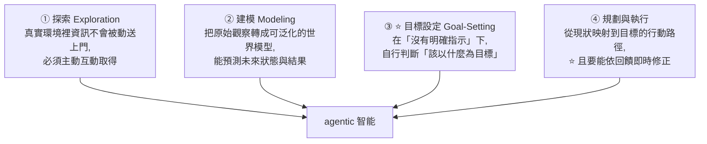

# ARC-AGI-3:人類 100%、前沿 AI 不到 1% —— 一個用「行動效率」而不是「對不對」計分的 agentic 基準

> 整理自論文 **ARC-AGI-3: A New Challenge for Frontier Agentic Intelligence**(arXiv:2603.24621v2,2026-04-17)。
> 作者:**ARC Prize Foundation**(基準設計者兼共同創辦人 **François Chollet**、共同創辦人 Mike Knoop、主席 Gregory Kamradt 等)。
> 依 CLAUDE.md 慣例,**以本機 PyMuPDF 抽取 PDF 全文閱讀**。

> 相關筆記:[[safety-evaluation-crisis]](⭐ **同樣在講「評測本身出了什麼問題」**)、[[rsi-recursive-self-improvement-anthropic]]、[[agentic-harness-engineering-observability-evolution]]、[[recursive-agent-harness-harness-recursion]]

---

## 一句話總結

**ARC-AGI-3 把測驗從「靜態題目答不答得對」換成「互動環境裡,你要花幾步才學會並解決它」。**

⭐⭐ **而最刺眼的一組數字:人類能解 100% 的環境;截至 2026 年 3 月,前沿 AI 系統得分「低於 1%」。**

---

## 一、系列脈絡:ARC-AGI-1 → 2 → 3

| 版本 | 年份 | 測什麼 | 人類解一題的時間 |
|---|---|---|---|
| **ARC-AGI-1** | 2019(隨〈On the Measure of Intelligence〉發表) | **靜態網格題的流體智力** | ⭐ **約 30 秒** |
| **ARC-AGI-2** | 2025-03 | **靜態任務上的推理「複雜度擴展」** —— 多步推理、序列規則套用、符號詮釋 | ⭐ **約 300 秒** |
| ⭐ **ARC-AGI-3** | 2026 | ⭐ **agentic 智能** —— 互動式回合制環境 | (見下方計分法) |

⭐ **整個系列的共同主張**:把通用智能評估為 **skill-acquisition efficiency(技能習得效率)**,而不是特定任務的表現。**全系列都刻意避開語言與外部知識,只用 Core Knowledge 先驗。**

**ARC-AGI-1 為什麼耐用了五年**:每一題都獨一無二 ⇒ **排除記憶**;每題只給極少數範例 ⇒ **防止用海量訓練資料做統計式模式比對**。

---

## 二、⭐⭐ 前兩代最有價值的發現(這節比基準本身更值得讀)

### 發現一:它精準標定了「測試時推理」這個轉折點

> ⭐ **ARC-AGI-1 之所以能抵抗「預訓練規模化」,是因為「沒有測試時適應的基礎 LLM」只能做記憶與內插式檢索 —— 無法泛化到從未見過的任務,即使那些任務很初階。**
> ⚠️ **截至 2026 年 3 月,最新一代的「基礎」LLM 在 ARC-AGI-1 上仍然表現不佳。**

⭐⭐ **而測試時推理(test-time reasoning)是讓 LLM 系統開始展現「非零流體智力」的關鍵創新** —— 催生了 **LRM(Large Reasoning Model)** 典範,最早由 OpenAI 的 o1 / o3 在 ARC-AGI-1 上展示。

> ⭐ **論文的自我定位很有意思:「它當時是唯一能精準標定『前沿 AI 流體推理誕生』的基準。」**

### ⭐⭐ 發現二:LRM 的流體智力有一個明確的邊界

**現代 LRM 能自動化一個領域,需要「同時」滿足兩個條件:**

```
① 基礎模型對該領域有「足夠的知識覆蓋」
② 該領域能提供「精確的正確性回饋」(即所謂「可驗證領域」)
```

⭐⭐ **然後論文寫了全篇最值得記的一段話:**

> **「這強烈暗示 AI 的推理能力綁在 LRM 的知識上。花一點時間體會這有多奇怪:人類的推理能力並不受領域知識所限制。」**

⭐ **而它順帶修正了一個流行說法:**
> **把 LLM 描述成「鋸齒狀智能(jagged intelligence)」是不精確的 —— 實際上它們仍然受限於「任務特定的訓練」,只不過現在訓練的是「任務特定的推理鏈」,而不是字面上的任務資料。**

**推論出來的產業圖像也很清楚:**
- ⚠️ **收集領域知識與建造驗證器是昂貴的**(從 AI coding agent 的程式環境就看得出來)
- **未來 LLM 對新領域的自動化,將由產業投資驅動** —— 先發生在「資料、算力、人力湊得齊,且 ROI 為正」的領域
- **許多科學領域(如藥物發現)因為機制性強而高度可自動化**
- ⚠️⚠️ **但「能高效適應、產生典範轉移級創新」的機器仍然遠在能力範圍之外。即使最新的 LRM 仍受人類智能瓶頸所限、覆蓋新領域的能力有限 —— 這是它們仍不算 AGI 的關鍵論據。**

### 📊 競賽史(順帶看到技術路線的變化)

| 年份 | 競賽 | 規模 | 最佳成績與方法 |
|---|---|---|---|
| 2020 | Kaggle ARC Challenge | $20K,913 隊 | 約 **20%** —— **對手工原語做暴力程式搜尋**(此後三年的主流解法) |
| 2022 / 2023 | Lab42 ARCathon ×2 | 各 $100K | — |
| 2024 | ARC Prize(ARC-AGI-1) | **>$1M,1,430 隊,47 篇論文** | ⭐ **測試時訓練(test-time training)成為突破性技術,私有測試集 53.5%** |
| 2025 | ARC Prize(ARC-AGI-2) | 1,455 隊,90 篇論文 | **NVIDIA NVARC 第一,24%** —— **合成資料生成 + 在 4B 參數模型上做測試時訓練** |

⚠️ **85% 的大獎門檻,兩年都沒人拿到。**

---

## 三、ARC-AGI-3 測的四件事



⭐⭐ **而 ARC-AGI-3 最大的門檻在這句話:**

> **agent「從來不會被告知目標,也不會拿到任何指示」。它必須自主推斷每個新環境的機制,包括「什麼算贏」。**

論文稱之為「**對『未知的未知』的自主導航**」。

---

## 四、⭐⭐ 計分法:把智能定義成「效率」

**論文的立場很明確:高智能的系統不只是「解得開」,而是「用最少資源解開」。**

**可以計量的資源有很多**(探索的狀態數、時間、算力、風險)。⭐ **而 ARC-AGI-3 做了一個「有主張的決定」:把這些全部收斂成單一純量 —— 行動效率(action efficiency)。**

### 行動效率的定義與三個性質

> **行動效率 = 「首次接觸」一個新環境時,解開它所需的移動/回合數。**

| 性質 | 說明 |
|---|---|
| ⭐ **① 懲罰暴力嘗試** | **盲目試很多選項的系統,被視為不如「快速建立環境模型再有效規劃執行」的系統聰明** |
| **② 同時涵蓋資料效率與風險效率** | 動作越少 ⇒ 暴露在環境危害下的機會越低 |
| ⭐ **③ 讓人機可以直接比較** | 建立人類在同樣環境上的行動效率基線,就能量化 AI 離「人類水準的技能習得」還有多遠 |

⭐⭐ **「打敗 ARC-AGI-3」的定義:在「初次見到」的環境上,行動效率達到或超越人類水準,並在所有私有環境上取平均。**

### ⭐ 一個重要的界定:什麼「不算」一個動作

> **動作 = 一次會影響環境狀態的離散互動(提交指令、移動或輸入)。**
> ⭐⭐ **「不改變環境的內部操作 —— 工具呼叫、推理步驟、模型內部的重試 —— 都不計入動作數。」**

⚠️ **這個界定很關鍵**:它讓「想很久」不受懲罰,**但「亂試」會**。等於明確宣告:**這個基準測的是「思考的品質」,不是「思考的成本」。**

### RHAE(Relative Human Action Efficiency,唸作 "Ray")

```
① 對 AI 完成的每一關,計算它花了幾個動作
② 跟人類基線比較 —— 基線定義為「上四分位中位數的最佳人類動作數」
③ ⭐ 關卡分數用「效率的平方」
④ 每關分數範圍 0% ~ 115%(超過 100% = 超越人類效率)
⑤ 環境分數 = 該環境所有關卡分數的加權平均
⑥ 總分 = 各環境分數總和 ÷ 環境總數,落在 0% ~ 100%
```

⭐⭐ **「取平方」的效果用論文自己的例子最清楚:**
> **人類最佳 10 個動作,AI 花了 100 個 ⇒ 得分 (10/100)² = 1%。**

⚠️ **不平方的話是 10%。取平方讓「差一個數量級」對應到「差兩個數量級的分數」** —— 這是一個刻意放大的懲罰,呼應「懲罰暴力嘗試」的設計意圖。

---

## 五、環境的規格與設計原則

### 規格

| 項目 | 內容 |
|---|---|
| **結構** | 每個環境是一系列**關卡**;抵達勝利條件(terminal frame)即過關 |
| ⭐ **回合制** | **刻意不做即時制** —— 為了讓挑戰是「離線推理」而非「即時感覺動作反射」。環境狀態不會非同步於 agent 的動作而改變 |
| **觀察空間** | ⭐ **64×64 網格,每格 16 種顏色之一**,稱為一個 frame;frame 序列可表現非互動的動畫(如物件移動) |
| **動作空間** | **五個按鍵動作 + 一個 Undo(回到前一狀態)**,加上**一個以座標選取網格單元的動作** |

⭐ **動作空間刻意做小,目的是「讓複雜度落在環境的邏輯上,而不是操作的難度上」。**

### ⭐ 設計原則(幾條特別值得學)

**① 只用 Core Knowledge 先驗**:物件性、基本幾何與拓樸(對稱、旋轉、內外、連通、洞)、基本物理(重力、動量、彈跳)、**agentness(認出某些物件是帶著意圖在追求目標的)**。

⚠️⚠️ **絕不使用語言或文化符號** —— 不用數字、字母、可辨識的真實世界圖像(花、鑰匙),也不用文化慣例(例如綠色代表「通行」)。

**② ⭐⭐ 新穎性的檢驗方法很聰明:**
> **測試「有沒有一支程式能同時解開兩個不同環境,而且長度比『兩支獨立解法程式串接起來』短至少 50%」。如果有,那這兩個環境很可能不夠不同。**

⭐ **這是用「Kolmogorov 複雜度」的直覺來操作化「新穎性」** —— 如果兩個東西能被大幅共同壓縮,它們就不是真的兩個東西。

**③ 人類可解**:設計成人類在**約 20 分鐘**的有界遊玩時段內可解(多數只要幾分鐘)。

**④ ⭐ 難度來自「組合」而非「艱澀」**:後面的關卡預期需要**累積並整合前面關卡學到的概念**,而不是靠變得更難懂或更龐大。

**⑤ 教學關**:第一關刻意簡單(對人與 AI 皆然)。⭐ **「隨機 agent 偶爾會誤打誤撞過關,這在設計上是可接受的」** —— 開場關的目的是**在沒有指示的情況下傳達核心互動模式**。

**⑥ 多重機制**:每個環境含多種機制;⚠️ **「單一機制然後放大尺寸或難度」被視為反模式**。

**⑦ 至少 6 關**。

**⑧ ⭐ 環境 ID 是四個字元;較長的名稱不對外公開,以免洩漏關於目標或機制的語意資訊。**

---

## 六、⭐ 怎麼造出來的(工程細節意外地有參考價值)

### 遊戲工作室與生產管線

**成立了一個 in-house 遊戲工作室**,在共用的技術與設計約束下產出新環境。

⭐ **一個誠實的流程發現:**
> **原本假設環境可以「一個做完再做下一個」序列式開發。實務上不是這樣 —— 因為發想、實作、試玩、修訂的速度各不相同,⭐ 吞吐量最高的做法是「單一開發者同時讓三到四個環境在管線的不同階段推進」。**

**四階段管線**:規格(概念描述先集體審查,及早抓出重大設計問題)→ 內部(原型 + 團隊測試)→ **外部(真人測試,確認符合人類表現標準)** → 完成。

### ⭐ 引擎選型的取捨

> **一開始用 Unity,但發現它「對所需的迭代速度來說太重、太慢」。自建引擎能對效能、工具與評估有更緊的控制。**
> ⭐ **最終引擎用 Python 實作,達到「每秒 1,000 frame」的最低效能目標。**

### ⭐⭐ 自動化驗證:兩層

**① 環境資格檢驗(deterministic qualification)**

| 測試 | 目的 |
|---|---|
| **隨機跑 50,000 步** | 確認**沒有任何關卡會被意外通過** —— 防止瑣碎或退化的獎勵路徑 |
| **隨機跑 1,000,000 步** | 強化上述約束:**非教學關在無資訊的隨機遊玩下必須保持未被通過** |
| **第三次 1,000,000 步全關卡掃描** | 兼作效能與 fuzzing 測試 —— 在這個規模下,隨機測試對**挖出邊界崩潰、畸形轉移、無效 frame 輸出、隱藏狀態不一致、罕見動作序列缺陷**特別有用 |
| **錄製回放** | 已知良好的錄影在「贏」與「輸」兩種條件下重播,確認引擎能序列化並忠實重執行動作軌跡 —— 用於回歸測試、除錯、稽核與未來的模型分析 |

**② ⭐⭐ 基於圖的狀態空間建構與勝率估計**

```
把環境建模成「可達狀態的有向圖」
  節點 = 一個唯一的環境狀態(⭐ 節點識別用 hash,
        讓「抵達同一底層狀態」的不同軌跡自動合併)
  邊   = 從該狀態出發的一個有效玩家動作
⇒ 把重複模擬轉換成「緊湊的狀態空間近似」,
   而不是一堆各自獨立的 rollout
```

**追蹤的指標**:合併密度、觀察到的最大深度、循環偵測、可達圖是否已完全探索。

⭐⭐ **而最關鍵的是這個驗收門檻:**
> **即使無法窮舉完整的圖,系統仍能對「隨機策略解開該環境的機率」給出數學上有依據的界限。**
> **驗收門檻:隨機策略解開一關的頻率,不得高於「一萬分之一」。**

> ⭐ 論文舉的圖例(環境 ls20 的第一關)顯示 **P_win 恰好是 1/355** —— 那是**教學關**,依上述設計原則屬於刻意可被誤打誤撞的例外。

---

## 七、⭐⭐ 資料集組成:公開/私有比例被「倒過來」了

| 資料集 | 用途 | 環境數 |
|---|---|---|
| **Public Demo** | 展示格式與基本機制的公開集,社群的「大門」 | **25** |
| **Semi-Private** | 用於測試「外部 API 後面的前沿模型」(⚠️ 因此承擔小幅資料外洩風險) | **55** |
| **Fully Private** | 用於官方競賽,只給極少數夥伴 | **55** |

⭐⭐ **最重要的一條結構性改變:**
> **ARC-AGI-2 的公開:私有大約是 10:1。ARC-AGI-3 把這個比例「倒過來」——**
> **公開集從「訓練資源」轉變為「展示介面」,而私有集成為評估的主要基礎。**

⭐ **而且公開集「刻意不完整代表私有集的機制」**,以降低過擬合或針對性最佳化的風險;私有集則**刻意相對公開集為分布外(out-of-distribution)**,機制更廣更多樣、重疊有限。

---

## 應用案例

### 案例 1|⭐⭐ 用「不算動作」的界定,反推你自己的評估在測什麼

ARC-AGI-3 明確規定**工具呼叫、推理步驟、內部重試不計入動作數**。這個界定值得拿來檢查任何評估:

```
你的評估把什麼算進「成本」?

只算「最終答案對不對」        ⇒ 完全不懲罰暴力嘗試
算「花了多少 token」          ⇒ 懲罰「想得久」,也懲罰「試得多」
⭐ 算「改變了世界幾次」        ⇒ 只懲罰「試得多」,不懲罰「想得久」
```

⭐ **第三種最貼近真實世界的成本結構** —— 在真實系統裡,多想一秒幾乎免費,**但多執行一次寫入、多打一次 API、多做一次不可逆操作,代價都是真的。**

⚠️ 這也提示了一個常被忽略的評估盲點:**一個「答對率」很高但「動手次數」很多的 agent,在生產環境可能是災難。**

### 案例 2|⭐ 「壓縮測試」可以拿來檢查你的測試案例是不是重複的

ARC-AGI-3 檢查新穎性的方法可以直接借用:

```
兩個測試案例(或兩篇筆記、兩個 skill)是不是真的不同?
⇒ 問:能不能寫一支東西同時涵蓋兩者,
      而長度比「兩份獨立版本串起來」短 50% 以上?
⇒ 如果可以 ⇒ ⚠️ 它們大概是同一件事的兩個樣子
```

⭐ **這比「看起來不太一樣」客觀得多**,而且不需要任何主觀判斷。

### 案例 3|⚠️ 「基礎模型 vs 推理模型」在能力上不是同一件事

論文的發現值得記成一條判準:

| | 能做什麼 |
|---|---|
| **基礎 LLM(無測試時適應)** | ⚠️ **限於記憶與內插式檢索** —— 對從未見過的任務**即使很初階也無法泛化** |
| ⭐ **LRM(有測試時推理)** | 開始展現**非零的流體智力** |

⭐⭐ **但 LRM 也有明確邊界:需要「足夠的領域知識覆蓋」+「精確的正確性回饋」兩個條件同時成立。**

**實務推論**:當你考慮把 AI 用在一個新領域時,先問這兩題 ——
1. **模型對這個領域有足夠知識嗎?**
2. ⭐ **這個領域能自動判斷「對不對」嗎?**(可驗證領域)

⚠️ **兩題有一題答不出來,自動化的難度會陡增** —— 而論文明說「**收集領域知識與建造驗證器是昂貴的**」。

### 案例 4|⭐ 公開/私有比例倒轉,是對「基準被刷爆」的結構性回應

📎 這一點跟本倉庫兩篇直接相連:
- [[safety-evaluation-crisis]] —— 評測本身的危機
- [[agentic-harness-engineering-observability-evolution]] 那篇引用的**資料洩漏問題**

⭐ **ARC-AGI-3 的做法值得記:當公開集主要被拿去訓練而不是被拿去理解時,就把它縮小成「展示介面」,把評估重心整個移到私有集。**

⚠️ **而且它還做了一件更細的事:讓公開集「刻意不完整代表」私有集的機制** —— 這樣即使有人針對公開集最佳化,那些最佳化也遷移不過去。

---

## 重點回顧(TL;DR)

1. **ARC-AGI-3 是互動式基準**,用新穎、抽象、回合制的環境測 agentic 智能:**探索、建模、目標設定、規劃與執行**,而且**完全不給指示**。
2. ⭐⭐ **人類能解 100% 的環境;截至 2026 年 3 月,前沿 AI 系統得分低於 1%。**
3. **系列脈絡**:ARC-AGI-1(2019,靜態網格,人類約 **30 秒**/題)→ ARC-AGI-2(2025-03,推理複雜度擴展,人類約 **300 秒**/題)→ ARC-AGI-3(agentic)。⭐ **全系列都把智能評估為「技能習得效率」,並刻意避開語言與外部知識。**
4. ⭐ **ARC-AGI-1 為何耐用**:每題獨一無二(排除記憶)+ 每題極少範例(防止統計式模式比對)。
5. ⭐⭐ **它精準標定了「測試時推理」這個轉折**:基礎 LLM(無測試時適應)**只能記憶與內插檢索,對沒見過的任務即使初階也無法泛化**;⚠️ **截至 2026 年 3 月最新的基礎 LLM 在 ARC-AGI-1 上仍表現不佳**。**測試時推理才讓 LLM 展現非零流體智力,催生 LRM 典範(o1/o3 首次展示)。**
6. ⭐⭐ **LRM 的邊界條件**:能自動化一個領域需要**同時**滿足 ①**足夠的領域知識覆蓋** ②**精確的正確性回饋(可驗證領域)**。
7. ⭐⭐ **最值得記的一段話**:「**這強烈暗示 AI 的推理能力綁在 LRM 的知識上。花一點時間體會這有多奇怪:人類的推理能力並不受領域知識所限制。**」並修正「鋸齒狀智能」的說法 —— **LLM 仍受任務特定訓練所限,只是現在訓的是「任務特定的推理鏈」而非字面資料。**
8. ⚠️ **論文對 AGI 的判斷**:能高效適應、產生典範轉移級創新的機器**仍遠在能力範圍外**;**即使最新 LRM 仍受人類智能瓶頸所限、覆蓋新領域的能力有限** —— 這是它們不算 AGI 的關鍵論據。
9. **競賽史**:2020 Kaggle 約 **20%**(暴力程式搜尋)→ 2024 ARC Prize **53.5%**(⭐ **測試時訓練成為突破**)→ 2025 ARC Prize on ARC-AGI-2 **24%**(NVIDIA NVARC:**合成資料 + 4B 模型上做測試時訓練**)。⚠️ **85% 大獎門檻兩年都沒人拿到。**
10. ⭐⭐ **最大的門檻**:agent **從來不被告知目標,也沒有任何指示** —— 必須自主推斷環境機制**包括「什麼算贏」**。論文稱之為「對未知的未知的自主導航」。
11. ⭐⭐ **計分創新:把智能定義成效率,並把所有資源收斂成單一純量「行動效率」** = 首次接觸一個新環境時,解開它所需的回合數。三個性質:**懲罰暴力嘗試**、涵蓋資料與風險效率、**讓人機可直接比較**。
12. ⭐ **「打敗 ARC-AGI-3」= 在初次見到的環境上達到或超越人類的行動效率**(所有私有環境取平均)。
13. ⭐⭐ **一個關鍵界定:工具呼叫、推理步驟、內部重試「不計入動作數」** —— **只有改變環境狀態的互動才算**。等於宣告:**測的是思考品質,不是思考成本;想久不罰,亂試才罰。**
14. **RHAE(唸作 "Ray")**:對比**上四分位中位數的最佳人類動作數**,⭐ **關卡分數取「效率的平方」** —— 人類 10 步、AI 100 步 ⇒ **(10/100)² = 1%**(不平方會是 10%)。單關 **0%–115%**,總分 0%–100%。
15. **環境規格**:**64×64 網格 × 16 色**的 frame;動作空間是**五個按鍵 + Undo + 座標選取**。⭐ **回合制而非即時制,是為了讓挑戰落在「離線推理」而非「反射神經」;動作空間刻意做小,讓複雜度落在邏輯而非操作。**
16. **設計原則**:僅用 Core Knowledge 先驗(物件性、幾何拓樸、物理、**agentness**);⚠️ **絕不用語言或文化符號**(不用數字、字母、可辨識圖像、也不用「綠色=通行」這種慣例)。
17. ⭐⭐ **新穎性的操作化檢驗很聰明**:若「一支程式能同時解開兩個環境,且比兩支獨立解法串接短 50% 以上」,**那兩個環境就不夠不同** —— 用可壓縮性來定義重複。
18. **其他原則**:人類約 **20 分鐘**內可解;⭐ **難度來自「組合」而非艱澀**(後面關卡要整合前面學到的概念);**教學關刻意簡單、允許隨機誤打誤撞**;每環境**多重機制**(單一機制放大是反模式)、**至少 6 關**;⭐ **環境 ID 只有四字元,長名不公開以免洩漏語意**。
19. ⭐ **工程上的誠實發現**:原以為環境可序列式開發,實際上**單一開發者同時推進三到四個環境**吞吐量最高;⭐ **Unity 太重太慢,改自建 Python 引擎達到 1,000 FPS**。
20. **自動化驗證兩層**:①**資格檢驗** —— 隨機 50,000 步確認無關卡被意外通過、**100 萬步**確認非教學關在隨機遊玩下不被通過、第三次 100 萬步兼做 fuzzing、**錄製回放驗證可重現性**;②⭐⭐ **基於圖的狀態空間** —— 節點用 **hash 識別**讓不同軌跡自動合併,追蹤合併密度/最大深度/循環/是否完全探索。
21. ⭐⭐ **驗收門檻:隨機策略解開一關的頻率不得高於「一萬分之一」**(即使圖無法窮舉,系統仍能給出數學上有依據的機率界限)。
22. ⭐⭐ **公開:私有比例被倒轉**:ARC-AGI-2 約 **10:1**,ARC-AGI-3 變成 **Public Demo 25 / Semi-Private 55 / Fully Private 55**。**公開集從「訓練資源」變成「展示介面」,評估重心整個移到私有集**;而且**公開集刻意不完整代表私有集的機制**,私有集刻意為分布外。

---

## 來源

- [ARC-AGI-3: A New Challenge for Frontier Agentic Intelligence](https://arxiv.org/abs/2603.24621)(arXiv:2603.24621v2,2026-04-17)—— ARC Prize Foundation
- 論文引用的前作:〈**On the Measure of Intelligence**〉(2019,ARC-AGI-1 隨此發表)
- 相關競賽:2020 Kaggle Abstraction and Reasoning Challenge、2022/2023 Lab42 ARCathon、2024 與 2025 ARC Prize
- 本倉庫相關筆記:[[safety-evaluation-crisis]]、[[rsi-recursive-self-improvement-anthropic]]、[[agentic-harness-engineering-observability-evolution]]、[[recursive-agent-harness-harness-recursion]]

> ⚠️ 本文為論文內容之整理;分數與時間點(如「截至 2026 年 3 月前沿 AI 低於 1%」)均為論文發表當時的狀態,**很可能已經改變**。基準本身也可能有後續版本。
