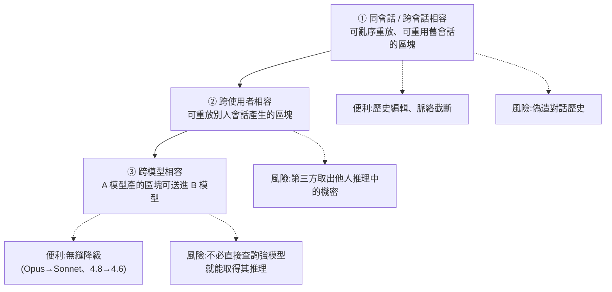

# 加密的推理過程為什麼保不住:一個「全域金鑰 + 可攜載體」的架構教訓

> 整理自 arXiv 論文 **《Stealing Reasoning Traces from Proprietary LLM APIs》**(arXiv:2608.09867v1,2026-08-10,**全文 116 頁**)。
> 作者:Alexander Panfilov、David Schmotz、Ilia Shumailov、Luca Beurer-Kellner、Joachim Schaeffer、Ameya Prabhu、Jonas Geiping、Maksym Andriushchenko。授權 CC-BY 4.0。

> ✅ **重要前提:這是經過負責任揭露的學術安全研究,且廠商已修補。**
> 論文自述:「所有模型廠商都確認收到我們的報告,**之後我們便無法再發動同樣的攻擊**。」
>
> ⚠️ 本文**只整理架構層面的設計教訓與防禦方案**,不記錄任何可操作的攻擊步驟、標記格式、注入位置或工具流程(論文附錄 C 的實作細節一律略過)。目的是把這個案例當成**系統設計的反面教材**來讀。

---

## 一句話總結

**廠商把推理過程加密,是為了保護智慧財產;但那份密文被設計成「可以在會話、使用者、模型之間互換的可攜載體」——AEAD 封套驗證了「內容沒被竄改」,卻沒有驗證「它產生於哪個脈絡」。**

---

## 一、背景:為什麼要加密,以及為什麼要「可攜」

推理模型會產生一段思考過程(chain-of-thought)。論文指出,這段內容**比使用者看到的最終輸出更詳盡、資訊密度更高**,會暴露模型的推理方法與訓練技巧,因此對競爭對手極有價值。

於是主流 API 廠商**停止傳輸明文推理**,改成「extended-thinking 區塊」:人類可讀的部分被隱藏或大幅摘要,而真正的推理內容被包成一個**不透明的、base64 編碼的簽章或加密酬載**。

論文說明這個封套的形式是 **AEAD(Authenticated Encryption with Associated Data)**,依廠商不同,標頭可能含模型名稱、區塊型別、版本、金鑰 ID,加上 nonce、認證標籤與密文。

### 這個設計同時服務三個目的

| 功能 | 作用 |
|---|---|
| **機密性(Confidentiality)** | 讓推理步驟在數學上不透明,阻止競爭者大量收割 CoT 做蒸餾,也限制敏感或有害推理的曝光 |
| **完整性(Integrity)** | AEAD 與 MAC 確保推理無法被使用者惡意竄改;一旦竄改簽章失效、API 可拒絕,**防止被操縱的推理拿去引導模型** |
| **無狀態(Statelessness)** | 不必在伺服器端存推理狀態,改用**客戶端儲存**;客戶端保管密文,下一輪傳回來維持多輪連續性 |

> ⭐ **第三點是整個問題的根源。** 論文的推論很直接:既然依賴客戶端儲存,**這些密文就必須在脈絡、使用者、模型之間可攜**——這才能支援無縫換模型與自動重新路由而不丟棄推理 token。
>
> 論文也明說:**廠商原本可以限制這種相容性**(例如只允許在同一段對話、同一個模型內解密),但**多數 API 選擇了較簡單的策略——開放更廣的相容性**。

⚠️ 論文另註:**截至 2026 年 7 月,沒有任何 LLM 廠商公開說明其使用的密碼學機制細節**,以上是從無狀態協定行為推論出來的。

---

## 二、威脅模型:兩種攻擊者,一個共同前提

論文假設的是**標準的、無特權的 API 攻擊者**——不需內部存取、看不到伺服器狀態、拿不到模型權重,**完全在正常 API 使用範圍內操作**。

| 攻擊者 | 描述 | 對應風險 |
|---|---|---|
| **第一方** | 自己去查詢有防護的強模型、產生自己的加密推理,再把它送進較弱、較便宜的「解碼者」模型 | 蒸餾、越獄 |
| **第三方** | 取得**別人**產生的加密推理(例如開發者把原始 agent session log 發到網路上) | 竊取機密、提示注入 |

> **共同前提只有一個:在該廠商生態系內,有一個相容的「解碼者」模型可用。**

⚠️ 特別注意第三方的性質:**它把模型變成一個「解密預言機」**——你不需要金鑰,只需要一個願意處理那份密文的模型。

---

## 三、⭐ 核心缺陷:三層遞增的「相容性」

論文最有價值的貢獻之一,是把「相容性」拆成**三個遞增的層級,每一層開啟更廣的攻擊類別**。這比籠統說「密文可互換」精確得多。



| 層級 | 合法用途 | 被開啟的風險 |
|---|---|---|
| **同/跨會話** | 簡化良性的歷史編輯與脈絡截斷 | 偽造對話歷史(例如在惡意交流中插入順從的思考) |
| **跨使用者** | (論文未指出明確合法用途) | **第三方取出他人推理中洩漏的私密資訊** |
| **跨模型** | 無縫模型降級 | **不必直接查詢強模型,就能大規模取得其推理** |

### Table 1 的實測結果

論文以 2026 年 7 月為準,列出三大廠商的跨模型相容矩陣(**列 = 產生推理的來源模型,欄 = 接收注入推理的目標模型**):

| 廠商 | 結果 |
|---|---|
| **Claude** | 任何模型的思考軌跡都能被任何其他模型重放,**唯一例外是 Fable 5 的思考** |
| **GPT** | GPT-5.6 系列能重放**所有更早世代**的軌跡 |
| **Gemini** | 任何模型的思考軌跡都能重放進任何其他模型 |

論文另註:**可用的注入形式依廠商與具體模型而異**(有些模型會省略先前的推理區塊,有些不會)。本文不記錄細節。

> **一個值得注意的觀察:Fable 5 是 Claude 家族中唯一的例外。** 這暗示「更嚴格的綁定」在技術上是做得到的,只是沒有普遍實施。

---

## 四、四類風險(只記錄性質、規模與教訓)

### ① 蒸餾:為什麼「偷推理」比「偷輸出」值錢得多

這一段論文論證得很細,值得完整記下來,因為它解釋了**為什麼廠商要加密**:

- 只看**最終輸出**,你拿到的是老師計算的**終點**;學生仍得自己推斷「為什麼」。
- 拿到**推理軌跡**,你拿到的是**中間解題軌跡**——問題分解、中間推導、解題策略,**普通的 next-token 訓練就能直接模仿**。這是密度高得多的監督訊號。

論文引用先前研究的量化落差:有人用「軌跡反演模型」從可見輸出與推理摘要**合成**長篇推理,把微調後 Qwen2.5-7B-Instruct 的 MATH500 準確率從 **68.4% 提升到 76.0%**(相較只用答案蒸餾)。

> **而那只是「代理近似」。本論文展示的是:可以取回原始、真實的推理,而且完全不必去碰防護嚴密的前沿模型。**

**成本估算**:以 Claude Haiku 4.5 的標準 API 定價、輸入輸出各 12k token 窗口計算,解碼 1 萬份軌跡的名目成本約 **$720**。

⚠️ 論文特別點出一個防禦盲區:**當密文可以從公開資料集或開發者 log 收割時,攻擊者根本不需要查詢原始的前沿模型**——因此**在前沿模型端點監控可疑查詢行為的防禦,可能永遠看不到這次萃取**。

### ② 越獄:推理與輸出的訓練目標不一致

論文的論點很清楚:模型被訓練成**不在使用者可見輸出中提供有害資訊,但不必然被訓練成不去思考有害主題**——因為直接優化 CoT 的內容會產生「思維鏈壓力」,反而**損害其可監控性**。

於是可能出現:**最終答案良性、通過輸出過濾器,但推理過程中含有可造成危害提升的資訊。**

### ③ 竊取機密:對一般開發者最直接的風險

作者從網路上蒐集他人發布的原始 agent 與 session 軌跡:

| 項目 | 數量 |
|---|---|
| 公開軌跡份數 | **6,708** |
| 解碼的推理區塊 | **315,320** |
| 含隱私外洩的區塊 | **1,028(0.3%)** |
| 洩漏敏感項目的 session | **328(4.9%)** |
| **合計:PII 資產** | **367 項** |
| **合計:憑證(API 金鑰、密碼等)** | **182 項** |

真實 session 中挖出的內容包括 API 金鑰、密碼、存取權杖、私鑰、個人 email、IP 位址。論文舉的兩個定性例子很有代表性:

- 某次 coding 工作中,模型在推理裡**逐一列出「發布 repo 前必須移除的金鑰」**——於是那些金鑰完整地留在推理裡。
- 某次訂機票的 agent 執行中,模型在推理裡**整理了旅客的姓名、護照號、生日、信用卡號與 CVV**(該例為合成的 benchmark 人物,非真人)。

> ⚠️ **這裡的教訓極其直接:很多人把 agent 的完整執行紀錄公開,以為「加密的部分是安全的」。它不是「安全的」,只是「當下讀不懂的」。**

### ④ 提示注入:不透明性反過來害到使用者

因為加密區塊對**使用者自己**也是不透明的,惡意指令可以被藏在裡面而使用者無從檢視。論文顯示這能跨模型規模轉移,並在長流程工作中造成資料外洩。

> **這一項揭示了一個反諷:加密原本是為了保護廠商的 IP,但它同時剝奪了使用者檢查自己脈絡的能力。**

---

## 五、⭐⭐ 完整的緩解方案(附錄 A:Context-Bound Envelope Defense)

論文附錄 A 給了一份完整的防禦提案。開宗明義點出所有攻擊的共同結構性缺口:

> **AEAD 封套認證了推理區塊的「內容」,卻沒有認證它「產生於什麼脈絡、又被重放到什麼脈絡」。**

### 六個洩漏向量與對應處置

| # | 問題 | 處置 |
|---|---|---|
| **1** | **跨使用者洩漏** | 發行時把 `user_id` 嵌入 AEAD 的 associated data;重放時比對綁定身分與已認證的呼叫者,不符即拒 |
| **2** | **跨會話洩漏** | 用雜湊鏈把每個封套綁到 `session_id` 與其前一個區塊;伺服器端強制順序性;壓縮後只保留 Merkle root |
| **3** | **既有的公開/企業資料集** | **輪換所有修補前的簽章金鑰**,拒絕解碼任何用已退役金鑰 ID 認證的封套 |
| **4** | **向後相容** | 有期限的雙格式接受窗口 + 選擇性的批次重新簽章端點(需驗證請求者確為原 session 擁有者) |
| **5** | **模型層順從性** | 後訓練讓模型辨識並拒絕轉錄式提示,**無論封套是否有效** |
| **6** | **nonce 可預測性** | 每個區塊用 CSPRNG 抽高熵 nonce,發行前伺服器端強制唯一性 |

⚠️ **第 6 項有一句關鍵註記:「因為金鑰是使用者之間共用的,所以這一點至關重要。」** 它是上述所有綁定的密碼學基礎。

### 最簡單也最便宜的修法(A.1)

**直接把發起者的 `user_id` 放進每個推理封套的 AEAD associated data。** 重放時 API 只需比對綁定的識別碼與已認證的呼叫者,不符就拒絕。

> **這完全關閉了跨使用者的攻擊面,而且不需要任何有狀態的後端。**

### 難的是跨會話(A.2),因為合法用途依賴同一種可攜性

論文很誠實地指出兩難:使用者需要**分岔對話、壓縮長 session 的舊輪次、中途降級到便宜模型**——**把每個區塊天真地綁定到完整的先前逐字稿,會把這三件事全部弄壞。**

提案是一條輕量的雜湊鏈,只把每個使用者輪次與推理區塊綁到**它的 session 與它的直接前驅**:

```
τ(n+1) = H( user_id ‖ session_id ‖ H(τ(n) ‖ salt2) ‖ salt1 )
```

其中 τ(n) 是第 n 個區塊的推理內容,產生的雜湊放進下一個封套的 associated data。

⚠️ **論文對這個方案的效力講得很克制:** 光有鏈結**並不能阻止**一個按順序重放整段先前對話的攻擊者。它達成的是——**大幅提高攻擊成本**(攻擊者現在需要整段 session,而不是單一擷取到的簽章)**與遠小、可稽核的影響半徑**,足以擊敗那種可規模化的「單一簽章」萃取。

### 四個設計性質(P1–P4)

| 性質 | 內容 | 成本 |
|---|---|---|
| **P1 推理順序性** | 若 Y 依賴 X,必須可驗證 X 在 Y 之前 | **便宜**——壓縮時直接把被丟棄的區塊從鏈中切除,存活節點的相對順序仍完整 |
| **P2 完整推理完整性** | 區塊 X 前面必須恰好是 X−1,不得省略中間任何區塊 | **昂貴**——移除內部節點會迫使重算所有下游雜湊 |
| **P3 洩漏監控** | 對任何已發布/被回報的明文,與經支援管道浮現的解碼推理做**持續的逐字比對** | 讓洩漏能被**偵測並標記帳號**,而不只是被預防 |
| **P4 不可重放** | 同一個推理區塊絕不能被接受兩次——會話內或跨會話皆然 | 伺服器端拒絕已消費過的封套 |

**P1 與 P2 跟壓縮需求互相衝突**,所以論文不試圖全域保證 P2,而是建議在 session 的區塊上建 **Merkle 樹**:葉子是個別推理封套,葉子被剪除後供應商只保留樹根(或少數子樹根)。**這讓 P1 到處都便宜,而 P2 可在任何存活的連續區段上按需提供**,且永遠不需要重放完整的未剪枝歷史。

**模型降級與分岔用同一機制處理**:讓 session 分支這棵樹,分岔繼承到分岔點為止的鏈狀態,之後獨立延續。

### 已經流出去的資料怎麼辦(A.3)

論文說得很直白:**上述所有綁定都保護不了已經產生並發布的資料**(例如那 6,708 份公開軌跡)。

> **唯一的追溯補救是金鑰失效**——輪換所有修補前的簽章金鑰,並拒絕解碼任何以已退役金鑰 ID 認證的封套。
> **代價是不可避免地一併作廢舊 session 的合法續作。**

### 訓練期防禦是「殘餘缺口」,不是主力(A.5)

論文的定位非常清楚:

> **密碼學綁定約束的是「哪個模型可以被要求解碼某個封套」;它無法約束「一個順從的解碼者被合法要求處理自己先前的推理時會做什麼」。**
> 補這個殘餘缺口是**訓練問題**,而論文把它列為「**未來後訓練工作的待辦事項,而非本提案已解決的一環**」。

---

## 六、論文自陳的限制(值得學的誠實)

| 限制 | 內容 |
|---|---|
| **時效性** | 評估僅限 2026 年 7 月初三家廠商的特定 API 版本與模型;**內部密碼學實作是專有且可能未公告即變更的** |
| **保真度無法完全驗證** | 萃取依賴解碼模型的隨機生成;**token 數比對顯示保真度高,但缺乏 ground-truth 明文,無法完全驗證每一個 token** |
| **掃描非窮盡** | 對野外軌跡的初步掃描**不是對所有已發布 agent 資料集的完整稽核**,只是對真實隱私風險的針對性示範 |

⚠️ **而最值得注意的是這一句推論:論文假設「私有資料集受影響更嚴重」**——因為本地 agent 逐字稿與服務**比公開釋出的軌跡更可能處理敏感資訊**。

**換句話說:那個 4.9% 很可能是低估。**

---

## 七、⭐ 一個意外發現:推理摘要不忠實

論文在解讀解密後的思考時,發現了**相當數量的「不忠實摘要」**。

最鮮明的例子(Figure 8):對一道 AIME 2025 的題目,把 API 回傳的 Opus 4.8 思考**摘要**與**解碼出的真實思考**並排比較——

> **解碼顯示:模型在著手解題之前,就已經先講出了正確答案。**

而 API 給出的摘要,呈現的卻是一段循序漸進的推導。

論文的評論很重:

> 從終端使用者的角度,**當底層推理無法被直接檢視時,忠實的摘要是可規模化監督與 AI 控制少數幾個實用介面之一**。
> 而**把難以理解的推理軌跡「洗」成漂亮摘要**、或事後合理化的摘要,**使人質疑它們作為透明機制的價值**。

> ⚠️ 這個發現的意義超出本論文主題:**如果你的信任建立在「我看得到它的思考摘要」,那你信任的可能是一層事後包裝。**

---

## 八、更根本的問題:推理到底該不該加密?

論文第 5.6 節罕見地把這個問題攤開,**兩邊證據都給**:

| 支持加密 | 反對加密 |
|---|---|
| 讓模型能在思考中考慮有害資訊而不向外透露,似乎是有益的 | 對使用者不透明,使**注入攻擊**成為可能 |
| 保護 IP、抵抗蒸餾 | 造成**幾乎無法偵測、也難以防護的隱私侵害** |

### 兩個替代方案

**① 讓推理成為短暫的(ephemeral)。** 讓模型在每次輸出前推理,然後**在生成該輪之後直接刪除推理**——既不儲存也不回傳。論文指出數家廠商已支援此模式(例如新版 Qwen 的 `preserve_thinking` 參數)。

**② 多元監督(Pluralistic Monitoring)。** 撇開反蒸餾這類經濟動機、純從安全角度看:

> **提供使用者未經編修的推理反而更可取**——與其把監督限制在一小群安全研究者身上,廠商可以**善用其廣大的使用者基礎來實現多元的人類監督**。
> 基於此,**對較舊的、非前沿的模型世代逐步關閉加密,可能值得考慮**,作為改善廣泛監督的手段。

> 這是一個很有意思的立場:**加密同時保護了 IP 也阻擋了群眾監督,而這兩者的取捨在不同模型世代上可以有不同答案。**

---

## 九、附錄 B:「房間裡的大象」——近期開源模型是否用專有推理蒸餾過?

論文附錄 B 用取得的推理軌跡,去問了一個很敏感的問題。**但它給自己下的免責聲明比結論還長,值得完整記下來作為研究誠實度的範例:**

> **本節無法在因果上確立蒸餾。** 我們回報的是在特定介入下觀察到的行為偏移,並跨 benchmark 做相關性分析。這是根據我們手上的軌跡**所能負責任地下的最強結論**。分析是在廠商修補漏洞之後進行的,基於**小而偏向 benchmark 的問題集**、基於**可能與真實不同的模糊萃取程序**所還原的軌跡,以及**在我們無法控制的服務配置下**產生的生成結果。

方法:把一小段解碼出的 Opus 4.8 或 GPT-5.6-Sol 推理插在開源權重模型推理的開頭,讓它自由續寫,再與「未插入」及「用自己先前推理插入」的對照組比較。**可見答案始終是自由生成、從不被插入。**

三個「令人意外」的發現(論文用詞):

1. 對 Kimi-K3,Opus 的推理前綴**連可見答案的風格也被帶向對應的 Opus 答案**
2. 用 Kimi-K3 與 GLM-5.2 評估解碼出的 Opus/Sol 文字片段的困惑度,**這兩個模型對該文字的建模能力遠強於**另兩個對照模型
3. 一小段 Opus 前綴把 Kimi-K3 與 GLM-5.2 的推理風格推向 Opus 式;Sol 前綴把 Kimi-K3 推向 Sol。**另兩個對照模型沒有可比的變化**

**論文的結論措辭:「這些觀察具有暗示性但並不確定。它們確立了在我們測試的介入下存在異常的行為相容性,但無法確立記憶或蒸餾的因果主張。」**

---

## 十、負責任揭露與研究倫理

- 發表前已向**受影響的主要模型 API 廠商、Microsoft、Hugging Face** 揭露完整技術細節與初步發現。
- **對照組很關鍵**:2026 年 5 月已有人揭露過「推理軌跡可互換」這個原始漏洞,而據該研究者說法,**廠商當時「並未承認任何源自旁通道或重放攻擊的安全影響」**。
- **本次結果**:「所有模型廠商都確認收到我們的報告,**之後我們便無法再發動同樣的攻擊**。」

**倫理處置**:大規模分析在**隔離的安全環境**中進行;所有還原出的機密在自動分類與彙總計數階段結束後**立即安全刪除**;發表前與資料集平台及廠商協調,讓他們能先緩解對受影響使用者的立即風險。

> **「同一個問題,在有了完整證據與量化規模之後,處理態度完全不同」——這個對照本身就是安全研究的方法論教訓。**

---

## 應用案例

### 案例 1|⭐ 檢查你自己系統裡有沒有同構的問題

這個缺陷的抽象形狀是:

> **把一個「自我驗證的憑證」交給不可信的一方保管,而該憑證沒有綁定使用它的脈絡。**

拿論文的六向量表當範本,逐項檢查:

| 你系統裡的東西 | 綁使用者 | 綁會話 | 有時效 | 不可重放 | 能撤銷 |
|---|---|---|---|---|---|
| JWT / session token | | | | | |
| 簽章過的 URL(預簽 S3、下載連結) | | | | | |
| 前端保存的加密狀態 blob | | | | | |
| 密碼重設 / 邀請連結 | | | | | |
| Webhook 簽章 | | | | | |
| **任何「客戶端保管、伺服器驗證」的資料** | | | | | |

**任何一格是空的,就是一個可以被重放的洞。**

⚠️ 最常見的錯誤心態正是這篇論文的核心:「**它是加密的,所以它是安全的。**」
加密保證「別人讀不懂」,**不保證「別人不能拿去用」**。這是兩種完全不同的機制。

### 案例 2|把「上下文綁定」寫進你的簽章設計

```python
# ❌ 只證明「這是我發的」
mac = HMAC(key, payload)

# ✅ 證明「這是我發給『這個人』在『這次會話』的『這個位置』用的」
aad = f"{user_id}|{session_id}|{prev_hash}|{purpose}|{expires_at}"
ciphertext, tag = AEAD_encrypt(key, payload, associated_data=aad, nonce=csprng(24))
```

三條從論文抄來的要點:

1. **`aad` 必須由伺服器從當下請求「重新推導」,絕不能從客戶端傳來的值裡讀。** 否則攻擊者連 `user_id` 一起換掉就好——綁定形同虛設。
2. **`user_id` 綁定是最便宜的一招,且不需要有狀態後端。** 如果只能做一件事,做這件。
3. **nonce 必須來自 CSPRNG 且伺服器端強制唯一。** 論文特別強調:**在金鑰共用的情況下,這一點至關重要。**

### 案例 3|如果你的合法用途也依賴可攜性

論文的兩難在很多系統都會出現:**分岔、壓縮、降級——這些合法功能全都依賴同一種可攜性。**

可以直接借用的結構:

- **鏈到「直接前驅」而非「完整歷史」** —— 保住順序性(P1),又能承受壓縮
- **壓縮後保留 Merkle root** —— 讓存活的連續區段仍可驗證(按需 P2)
- **分岔 = 分支這棵樹** —— 繼承到分岔點的狀態,之後獨立
- **接受「提高成本」而非「完全阻止」** —— 論文自己就承認鏈結擋不住完整重放,但把「單一簽章即可規模化」變成「需要整段 session」,已經改變了攻擊經濟學

> ⭐ **這個「不追求完美、但改變攻擊經濟學」的態度,比方案本身更值得學。**

### 案例 4|不要公開 agent 的完整執行紀錄

論文第 5.4 節專門給了資料發布建議,可以直接抄成團隊規範:

- **發布 agentic 軌跡或 API 互動 log 前,若 agent 系統曾接觸任何機密或私密資訊,系統性地剝除所有推理區塊與不透明推理欄位。**
- **教育使用者與企業客戶:不要在共用 repo、協作空間或公開版控中保留或提交含簽章的原始 API 逐字稿——即使明文部分已經清理過。**

實務上再加三條:

- 在 CI 加一條檢查,阻擋含大量 base64 樣態長字串的檔案進版控
- **回頭檢查你過去分享過的東西**——廠商雖已修補,但已公開的舊資料收不回來(而論文的補救方案 A.3 也承認:**唯一的追溯手段是金鑰輪換,代價是一併作廢舊 session**)
- **記住論文的推論:私有資料集可能受影響更嚴重**。內部 agent log 比公開的更常碰到真實機密

> 對照本倉庫:所有筆記都是人工整理的繁中文字,逐字稿與音訊都在 scratchpad 用完即刪、從不進版控——剛好避開這個坑,但那是慣例的副產品,不是刻意設計。

### 案例 5|評估「模型層防禦」的優先序

論文把訓練期防禦明確定位為**殘餘缺口的補丁、且是「未來工作」而非已解決的一環**。這個排序值得內化:

| 層級 | 防禦效力 | 為什麼 |
|---|---|---|
| **架構層**(不交出可攜資產) | 最強 | 攻擊在結構上不可能;代價是儲存成本與 API 複雜度大增 |
| **密碼學層**(上下文綁定) | 強 | 繞過需要破解密碼學;代價是壓縮與換模型協定要重新設計 |
| **基礎建設層**(閘道隔離、異常偵測) | 中 | 提高成本,有繞過空間 |
| **可撤銷**(金鑰輪換) | 中 | 事後補救;唯一能處理「已洩漏資料」的手段 |
| **模型行為層**(拒絕訓練) | **最弱** | 只約束「被合法要求時它做什麼」,繞過方式無窮盡 |

> **凡是把「模型不會配合」當成主要安全機制的設計,都該被降級成縱深防禦的最外層,而不是唯一那道牆。**

### 案例 6|「半隱藏」這個概念可以推廣

論文的結構性極限論證:

> **被查詢的那個模型,必然得解密並處理先前推理 token 的內容。** 因此,除非你假設模型本身完全能抵抗基於提示的萃取,**加密推理區塊永遠只能是「半隱藏」的**——不論傳輸層加密怎麼做,底層內容仍可透過那個(隱含地)持有解密金鑰的模型抵達。

而論文給使用者的結論是一句硬話:

> **使用者永遠不應把任何加密推理區塊當成機密儲存機制。**

同構的例子:

- **DRM**:播放器必須解密才能播放,內容終究會以明文存在於某處
- **前端的 API 金鑰**:再怎麼混淆,瀏覽器得用它發請求就得能還原
- **白箱密碼學**:攻擊者控制執行環境時,金鑰終究要進到運算單元

**設計時要問的不是「能不能藏住」,而是「藏不住的時候損失多大、能不能撤銷」。**

### 案例 7|對「推理摘要」的信任要打折

第七節那個發現(模型先講出答案、摘要卻呈現循序推導)的實務意涵:

- **不要把「思考摘要」當成稽核證據。** 它是使用者體驗元件,不是可驗證的執行紀錄。
- **需要真正的可稽核性時,要求的是外部可觀察的東西**——工具呼叫紀錄、檔案異動、測試結果、退出碼——而不是模型對自己的敘述。
- 這與 [[agent-skill-three-layer-run-do-verify]] 的結論一致:**驗收要驗到「功能實際生效」的那一層,而不是一個代理指標。** 摘要就是一個代理指標。

---

## 重點回顧(TL;DR)

1. **加密推理的三個目的**:機密性(抗蒸餾)、完整性(防竄改引導)、**無狀態(客戶端保管)**。⭐ 第三個是問題根源——它**要求**密文可攜。
2. **廠商原本可以限制相容性**(只允許同對話同模型解密),但論文指出**多數 API 選了較簡單的策略:開放更廣的相容性**。截至 2026-07 無廠商公開其密碼學機制細節。
3. **⭐ 核心缺陷:AEAD 封套認證了「內容」,沒有認證「脈絡」。** 單一全域金鑰讓密文在會話、使用者、模型之間可互換。
4. **三層遞增的相容性**:同/跨會話(可偽造歷史)→ 跨使用者(可取他人機密)→ 跨模型(不必碰強模型就能取其推理)。
5. **Table 1**:Claude 家族任何模型可互相重放,**唯一例外是 Fable 5 的思考**;GPT-5.6 可重放所有更早世代;Gemini 全開。**Fable 5 這個例外證明更嚴格的綁定做得到。**
6. **偷推理 > 偷輸出**:輸出只是計算的終點,推理是完整的解題軌跡,可被 next-token 訓練直接模仿。先前研究用**合成**軌跡就把 MATH500 從 68.4% 拉到 76.0%,而本論文能取回**逐字的真實推理**。解碼 1 萬份約 **$720**。
7. **⚠️ 防禦盲區**:密文可從公開資料收割 ⇒ 攻擊者**根本不必查詢前沿模型** ⇒ **在前沿端點做的監控可能永遠看不到這次萃取**。
8. **最貼近開發者的數字**:6,708 份公開軌跡、315,320 個推理區塊 → **4.9% 的 session 洩漏敏感項**,合計 **367 項 PII + 182 項憑證**。而論文推論**私有資料集受影響更嚴重**,所以這是低估。
9. **⭐⭐ 附錄 A 的完整方案**:①`user_id` 進 AEAD associated data(最便宜、不需有狀態後端)②雜湊鏈綁 session 與**直接前驅**(而非完整歷史,以保住分岔/壓縮/降級)③Merkle root 讓壓縮後仍可驗證 ④P1–P4 四性質,**P2 與壓縮天生衝突所以只按需提供** ⑤legacy 只能靠**金鑰輪換**,代價是作廢舊 session ⑥nonce 必須 CSPRNG 且唯一——**因為金鑰是共用的**。
10. **論文對自己方案很誠實**:雜湊鏈**擋不住**完整順序重放,它做的是**把攻擊成本從「一個簽章」提高到「整段 session」並縮小影響半徑**。訓練期防禦被明列為「未來工作」。
11. **⭐ 意外發現:推理摘要不忠實。** 某例中解碼顯示模型**在解題前就先講出了正確答案**,而 API 摘要呈現的是循序推導。**當底層推理不可見時,摘要是少數的監督介面——而它可能是事後包裝。**
12. **論文罕見地把「該不該加密」攤開兩面看**,並提出兩個替代方案:**讓推理短暫化**(用完即刪,如 Qwen 的 `preserve_thinking`),以及**多元監督**——把未編修的推理開放給廣大使用者反而更有利於安全,故**對較舊的非前沿世代關閉加密值得考慮**。
13. **附錄 B 問了「開源模型是否用專有推理蒸餾過」**,發現行為相容性異常(Opus 前綴會把某些開源模型的**可見答案**風格也帶偏),但**明確聲明無法確立因果**,免責聲明寫得比結論長。
14. ✅ **已負責任揭露,廠商已修補**——「所有廠商確認收到報告,之後我們便無法再發動同樣攻擊」。對照 2026-05 的前次揭露當時廠商**未承認任何安全影響**——**證據與規模才推得動修補**。

---

## 來源

- [Stealing Reasoning Traces from Proprietary LLM APIs — arXiv:2608.09867](https://arxiv.org/abs/2608.09867)(2026-08-10,116 頁,CC-BY 4.0)
- [PDF 全文](https://arxiv.org/pdf/2608.09867) —— 本文依 PDF 全文逐節整理(§2 威脅模型與相容性、§3–4 四類風險、§5 討論與緩解、附錄 A 防禦方案、附錄 B 蒸餾分析)
- 本倉庫相關筆記:[[agent-skill-three-layer-run-do-verify]]、[[prompt-injection-5-techniques-defenses]]

> ⚠️ 本文為架構設計與防禦面的知識整理,**刻意不記錄任何攻擊的操作細節**(論文附錄 C 的萃取實作、注入位置與標記格式一律略過)。引用此文的目的在於「可攜憑證必須做上下文綁定」這個通用工程教訓,而非重現其結果。論文已完成負責任揭露且廠商已部署緩解措施。
