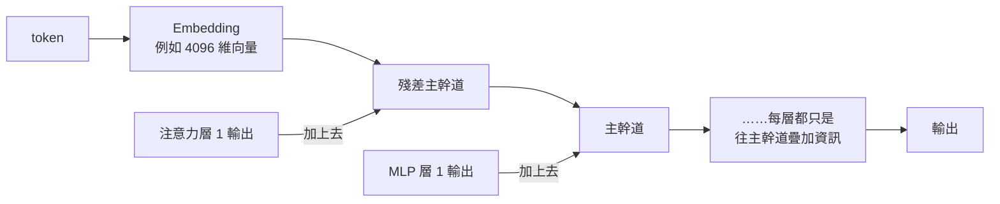
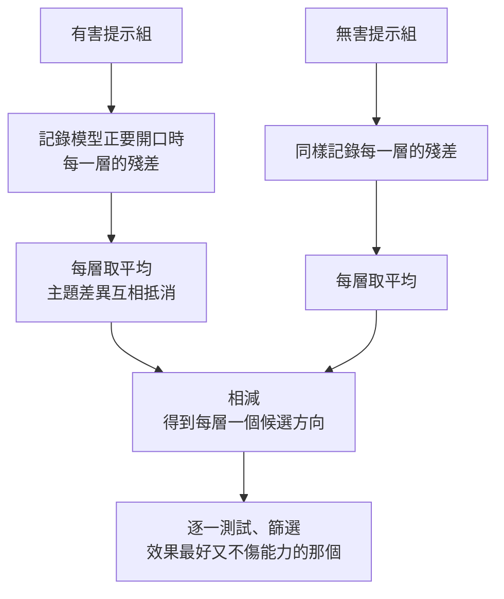

# LLM Abliteration 是什麼:「拒絕」原來只是殘差流裡的一個方向

**主題分類:** 科技 / AI 安全 — 可解釋性、安全對齊的脆弱性
**來源:** YouTube〈llm abliteration是什么?〉(程序员老王,2026-10-01,約 11.6 分;**該片無字幕,逐字稿以 CPU faster-whisper 轉錄、非官方字幕**)
**一手素材核實:** Arditi et al.〈[Refusal in Language Models Is Mediated by a Single Direction](https://arxiv.org/abs/2406.11717)〉(arXiv 2406.11717,2024)
**整理日期:** 2026-10-02

> ⚠️ **為什麼收這篇:** 這是理解「**開源權重模型的安全對齊有多脆弱**」的關鍵概念,屬公開的可解釋性研究。本文著重**原理與安全意涵**,不提供操作步驟。

---

## TL;DR

1. ⭐ **Abliteration** 是網友造的詞:**ablate(消融)+ obliterate(抹除)**——在**不微調、不重新訓練**的前提下,移除模型的拒絕行為。
2. ⭐⭐⭐ **核心發現(Arditi 等,2024):** 在 13 個開源對話模型(最大到 72B)裡,**「拒絕」由殘差流中的單一方向所中介**——抹掉它,模型不再拒絕有害請求;硬加上它,模型連「番茄炒蛋怎麼做」都會說對不起。
3. ⭐⭐ **找方向的方法很樸素:** 有害提示與無害提示各跑一遍,記下模型「正要開口回答」那一刻每層的殘差,**兩組平均相減**——主題差異互相抵消,剩下的就是「拒絕 vs 允許」的差別。
4. ⭐ **還能把它「燒進」權重:** 所有往殘差主幹道寫資料的矩陣都改掉,讓它們在拒絕方向上的輸出恆為 0——數學上等同執行時動態刪除。
5. ⚠️⚠️ **安全意涵:** 論文直言這**凸顯了目前安全微調的脆弱性**——對開源權重模型,安全對齊可以被低成本移除。
6. ⭐ **更大的圖景:** 不只拒絕,「真假」「拍不拍馬屁」也被發現對應某個方向——**也許很多看似複雜的模型行為,底層就是幾根箭頭**。

---

## 1. 先懂殘差流:模型的「資料主幹道」

- 每個 token 經過 embedding 變成固定長度的向量(例如 **4096 維**)。
- ⭐ 真實模型裡,每個模組的輸入**不是前一個模組的輸出**,而是一條**主幹道**:注意力的輸出**加到**主幹道上,MLP 的輸出再**加上去**,一路加到最後一層。
- 這條主幹道叫**殘差連接 / 殘差流(residual stream)**;設計初衷是避免訓練時的**梯度消失**。
- 📎 殘差流的改良見本庫 [[attention-residuals]]。

> 老王:「這 4096 個承載所有模組輸出的數字,就像人類的中樞神經,似乎藏著智能的核心秘密——遺憾的是,科學家研究了十幾年還沒完全弄懂。」

---

## 2. ⭐⭐ 概念 = 方向:從 word2vec 到拒絕

- **2013 年 word2vec** 的經典發現:**國王 − 男人 + 女人 ≈ 女王**。
- 含意:**「性別」這個概念在向量空間裡對應一個固定方向**——往這方向多走一點,女性含意就多一點。
- ⭐ 那「**拒絕**」會不會也是某個方向?→ 這正是 Arditi 等人 2024 年的論文標題:**Refusal in Language Models Is Mediated by a Single Direction**。

| ✅ 論文發現 | 內容 |
|---|---|
| **範圍** | **13 個熱門開源對話模型**,最大 **72B** 參數(影片舉例 Llama、Qwen、Gemma 等系列) |
| **抹除方向** | 模型**不再拒絕**有害指令 |
| **加入方向** | 模型**連無害請求都拒絕** |
| **結論** | 拒絕由殘差流中的**一維子空間**中介 |

---

## 3. 怎麼找到這個方向(概念層次)

| 步驟 | 重點 |
|---|---|
| **① 兩組提示** | 有害組(模型預設都會拒絕)與無害組(都不會拒絕),**主題五花八門**(影片說各 128 題) |
| **② 選位置** | 記錄的不是問句最後的問號,而是**聊天模板裡「assistant」那類標記 token** 的殘差——這一刻模型剛讀完問題、**正要開口**,「要不要拒絕」的決定已經形成 |
| **③ 平均相減** | ⭐ 兩組各自平均,主題雜訊互相抵消;**有害組共有「請求 + 拒絕」、無害組共有「請求 + 允許」**,相減後只剩「拒絕 vs 允許」的差別 |
| **④ 篩選** | 每層一個候選方向,逐一試;判斷拒絕與否只看**回答的第一個 token**(「I'm sorry」「As an AI」這類開頭的機率) |
| **⑤ 反向驗證** | 把方向**加到**無害問題上,模型要開始拒絕才算數 |
| **⑥ 防止變傻** | 用 **KL 散度**比較原模型與修改後模型在無害問題上的輸出分布,**差太多的方向直接淘汰**——避免「不拒絕了,但開始胡說八道」 |

### 從「執行時刪除」到「改權重」

- 執行時動態刪除方向很麻煩(載入方式跟一般模型不同)。
- ⭐ 但所有往主幹道寫資料的地方——embedding、每一層注意力與 MLP 的輸出——**都是矩陣乘法**;把這些矩陣在拒絕方向上的分量去掉(論文稱 **weight orthogonalization**),**數學上等同**執行時刪除。
- ⇒ 產出一個**不會拒絕**的模型檔。影片提到 Hugging Face 上已有大量這類處理過的模型,也有人做了專門的工具庫。

---

## 4. ⚠️⚠️ 這對 AI 安全意味著什麼

| 面向 | 說明 |
|---|---|
| **安全微調很淺** | ✅ 論文原話:這「**凸顯了目前安全微調方法的脆弱性**」——拒絕行為只是一個方向,而不是深植於模型的能力限制 |
| **開源權重的兩難** | 權重公開後,任何人都能低成本移除拒絕;**開源模型的安全不能只靠模型本身的拒絕** |
| **與越獄的關係** | ✅ 論文也分析了**對抗性後綴**如何壓制這個拒絕方向的傳播——提供了越獄機制的解釋 |
| **防禦的方向** | 需要**縱深防禦**:輸入/輸出分類器、部署層的監控、能力層面的限制,而不是只靠「模型會說不」 |

📎 本庫 [[alignment-illusion-safety-shallow]](同作者的安全對齊系列)、[[rsi-recursive-self-improvement-anthropic]](前沿模型安全)可對照閱讀。

---

## 5. ⭐ 更大的圖景:概念就是方向?

> 老王:「如果拒絕是一個方向,那別的呢?其實已經有人找到了——**一句話是真是假,是一個方向;模型拍不拍你馬屁,也是一個方向。**我們覺得 AI 有脾氣、有性格,說不定拆開來看,就是這麼幾根箭頭。」

- 「真假方向」見 Marks & Tegmark〈The Geometry of Truth〉(2023);「拍馬屁」(sycophancy)方向見對比激活加法(Contrastive Activation Addition)一類研究。
- ⭐ 老王的類比:電與磁最後統一成幾條方程,五花八門的化學反應不過是原子與電子的排列——**AI 看似千頭萬緒,底層也許就是幾條簡單規則,例如「一個概念就是一個方向」**。

---

## 6. 應用案例

### 案例一:評估要不要用「開源模型 + 自建防護」

你的產品要部署一個開源模型給外部用戶用:
- ⚠️ **不要假設模型的拒絕就是你的安全機制**——別人拿到同一份權重就能移除它;你自己的部署雖然沒被改,但這說明**拒絕只是一層很淺的行為**。
- ✅ 加上**獨立的輸入/輸出分類器**、日誌稽核、敏感操作的權限控管。

### 案例二:用「方向」的思維理解模型行為

調整模型風格時(例如太愛道歉、太愛拍馬屁),研究上可用的思路是**對比兩組行為、取平均差**來找方向,再做「激活引導」(activation steering)——這比改提示詞更根本,但也更需要可解釋性工具與評測。

### 案例三:讀可解釋性論文的檢查清單

| 問題 | 本論文的答案 |
|---|---|
| 測了幾個模型、多大? | 13 個,最大 72B |
| 怎麼證明是「因果」而不是「相關」? | **雙向驗證**:刪除→不拒絕;加入→無害也拒絕 |
| 有沒有檢查副作用? | 有:用 KL 散度確認無害問題上的行為沒大變 |
| 有沒有談安全意涵? | 有:明說安全微調脆弱 |

---

## 來源

- YouTube:[llm abliteration是什么?](https://www.youtube.com/watch?v=qbReD1cGykQ)(程序员老王,2026-10-01)——**該片無字幕,逐字稿以 CPU faster-whisper 轉錄、非官方字幕**
- 論文:[Refusal in Language Models Is Mediated by a Single Direction](https://arxiv.org/abs/2406.11717)(Arditi, Obeso, Syed, Paleka, Panickssery, Gurnee, Nanda,2024)
- 論文:[The Geometry of Truth](https://arxiv.org/abs/2310.06824)(Marks & Tegmark,2023)
- 論文:[Efficient Estimation of Word Representations in Vector Space(word2vec)](https://arxiv.org/abs/1301.3781)(Mikolov et al.,2013)

**Whisper 專有名詞還原對照:** Abolition/Ubiliter Ritter → abliteration / abliterator;Inbadding/Invading/Inviting → embedding;惨差/殉差 → 殘差;Lama、千吻、Gama → Llama、Qwen、Gemma;World to Wack → word2vec;RDT → Arditi;T度 → 梯度。
