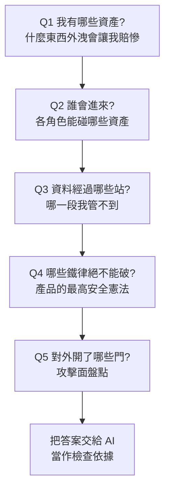
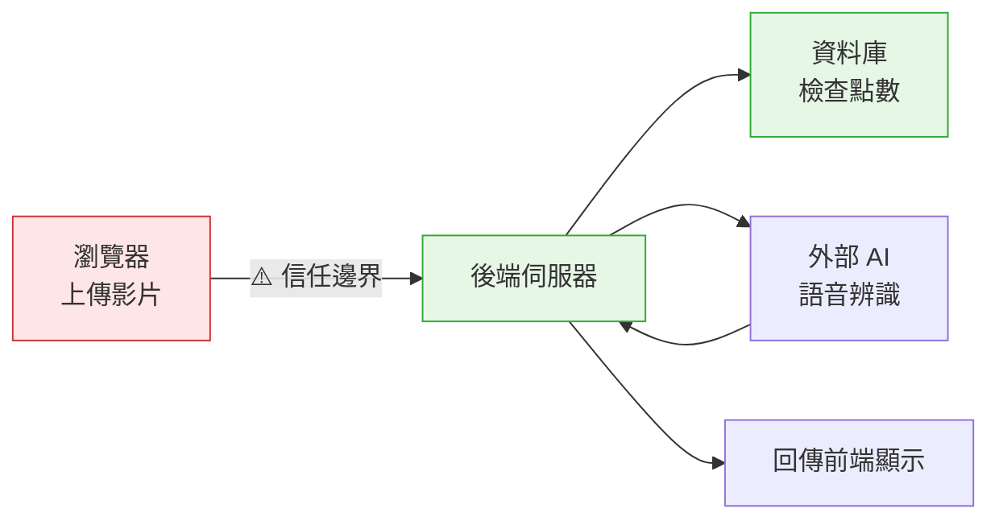
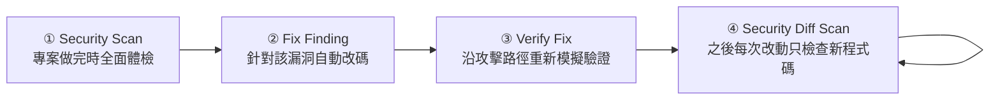

# 非技術者的資安入門:用五個問題做威脅建模,再交給 Codex Security 掃描

**主題分類:** AI 安全 / 應用安全 —— Vibe Coding 產品上線前的資安把關
**來源影片:** YouTube〈給非技術人員的資安教學,Vibe Coding 必學的基本功〉(Gary Chen,2026-08-29,約 22.7 分鐘)
**整理日期:** 2026-08-30

> ⚠️ 本影片無官方字幕也無自動字幕,逐字稿以 CPU 版 faster-whisper 轉錄取得,**非官方字幕**(專有名詞對照見文末)。
> 影片中關於 Codex Security Plugin 的可查證規格**已比對 OpenAI 官方文件與 `openai/codex-security` 倉庫核實**,補正集中在 §6。

> 相關筆記:[[prompt-injection-5-techniques-defenses]](另一種攻擊面)、[[codex-desktop-full-workflow-guide]](Codex 桌面版與插件生態)、[[codex-as-a-platform-open-agent-harness]]

---

## 0. 一句話總結

> **功能會動,不代表可以上線。**
> 你自己測的時候每一步都是正常操作;一放上網路,外面全是不按牌理出牌的人。

影片的價值不在教你寫安全的程式碼,而在給非技術者一套**不需要看懂程式碼就能執行的思考流程** ——
先用五個問題把「要保護什麼、誰能碰什麼、哪些規則絕不能破」講清楚,
再把這些規則交給 AI 當檢查依據。

**這套流程有正式名稱:威脅建模(Threat Modeling)。**

---

## 1. 先有一把尺:CIA 原則

資安的定義很白話:**不管別人怎麼亂搞你的系統,功能都能正常運作,使用者資料也被保護得好好的。**

產品上線後的災難分三類,正好對應資安最經典的三個支柱:

| 災難 | 具體情境(以 AI 字幕工具為例) | 專有名詞 |
|---|---|---|
| **資料被偷看** | 甲創作者上傳了下週才要發布的獨家影片,乙登入後系統沒分清權限,把別人的專案也列出來,整包被載走 | **機密性 Confidentiality** |
| **規則被竄改** | 校對好的字幕被他人惡意修改;或有人利用漏洞把自己的帳號改成無限點數 | **完整性 Integrity** |
| **系統被搞掛** | 有人灌入大量請求把伺服器塞死,付費用戶急著出片卻連登入都進不去 | **可用性 Availability** |

> **CIA 的用途不是讓你馬上抓出漏洞,而是在「不知道該防什麼」時給你一個思考方向。**
> 影片給了一個很實際的用法:**寫提示詞請 AI 檢查時,直接把這個框架引用進去。**

---

## 2. 五個問題:不看程式碼也能做的威脅建模



### Q1|資產(Asset):先知道家裡什麼最值錢

不要一開始就想怎麼防駭客,**先老老實實列出「出事會讓你痛到不行」的清單**。以 AI 字幕工具為例:

- **串接 AI 服務的 API 金鑰** —— 這把鑰匙直接綁著信用卡。外洩被拿去狂刷免費運算,睡一覺醒來可能收到幾十萬台幣帳單。
- 創作者上傳的**未公開影片與字幕稿** —— 外洩等於客戶的商業機密泡湯。
- 使用者的**帳號密碼**與**點數餘額**。
- **資料庫密碼** —— 被攻破就是全體用戶個資在網路上裸奔,還可能有法律責任。

> **先確認金庫在哪,才知道防護精力該花在哪** —— 而不是在無關緊要的細節上白忙。

### Q2|權限:身份驗證 ≠ 授權

把角色與資產配對,明確規定誰能碰什麼:

| 角色 | 可存取 |
|---|---|
| 路人訪客(未註冊) | 只有公開首頁 |
| 免費用戶 | 只有自己上傳的短影片;不能碰別人專案,不能用付費功能 |
| 付費用戶 | 自己的長影片專案 + 點數資產 |
| 管理員(你) | 後台數據與伺服器設定 |

程式碼裡要靠兩道防線落實,**兩者缺一不可**:

| 防線 | 英文 | 管什麼 |
|---|---|---|
| **身份驗證** | Authentication | **你是誰** —— 確認登入者是小明,而且是免費用戶 |
| **授權** | Authorization | **你能不能做這件事** —— 小明雖然登入了,但能不能看這筆資料? |

> ⭐ **這是用 AI 寫程式最常見的盲點:** 看到畫面上串好 Google 登入、沒登入的人進不來,就覺得安全了。
> 但那只做到第一步。AI 幫你寫的後端很可能**只確認了「這個人有登入」,卻在撈資料時漏掉「這筆資料屬不屬於他」**。
>
> 表面上大家都在網頁上乖乖看自己的專案;但只要有人繞過畫面直接向後端要資料,
> 系統因為只認登入狀態,就會把其他創作者的未公開檔案直接吐出去。

### Q3|信任邊界(Trust Boundary):哪一段是你管不到的

把資料的移動路線畫出來,才看得出該在哪個交界點設檢查:



- **不可控的外部區**:使用者的瀏覽器跑在對方電腦上,**他隨時能修改數值或偽造請求**。
- **內部安全區**:你的後端與資料庫跑在自己的雲端環境。
- 兩者交界處就是**信任邊界**。

> ⭐ **最常踩的地雷:把檢查權限的邏輯放錯位置。**
> AI 為了畫面即時,常把扣點邏輯寫在前端 —— 網頁算好「這支影片 10 分鐘扣 10 點」,再把結果傳給後端。
> 有人在瀏覽器把數字改成扣 0 點,後端要是照單全收,你的算力就被白嫖了。

**由此得出的鐵律:**

> **所有跟錢、點數、權限有關的計算,一律要在後端親自重算。
> 所有從外部送進來的資料,後端一律當成可疑包裹。**

### Q4|安全不變條件(Security Invariant):產品的最高憲法

意外和惡意隨時會發生 —— 網路卡頓、金流伺服器因逾時重送通知、有人寫腳本一秒內送出上百個請求。
**沒有定好絕對底線,就會鬧出商業災難。**

影片的例子很具體:使用者買 100 點,金流商(Stripe、綠界這類)在扣款成功後通知你的伺服器。
若因網路延遲或系統重試**連送兩次**通知,而後端沒有「同一筆訂單編號永遠只能加一次點數」的死命令,
系統就會傻傻入帳兩次,平白多送 100 點。

字幕工具的三條憲法範例:

1. **同一筆付款通知,永遠只能入帳一次。**
2. **點數不足時,絕對不能啟動需要扣點的 AI 運算。**
3. **任何人都絕不能讀取或修改不屬於自己的專案。**

> ⭐ **為什麼這對非技術者特別重要:** 你可能看不懂底層程式碼,**但講出這幾條憲法並不困難**。
> 請 AI 做資安體檢時,直接把憲法丟給它:「這是我的最高安全憲法,請找出任何會打破規則的漏洞。」

### Q5|攻擊面(Attack Surface):對外開了哪些門

站在攻擊者視角反推。**所有使用者可以輸入文字、上傳檔案、或點擊觸發運算的地方,都是攻擊面。**

| 攻擊面 | 攻擊情境 | 對應防禦 |
|---|---|---|
| 會員註冊(送 5 分鐘免費試用) | 寫腳本一分鐘刷一千個免洗帳號 | 加真人驗證 |
| 產生字幕(每次都要付費算力) | 幾千個請求同時湧入,API 帳單半小時被吸乾幾千美金 | 每分鐘 rate limit + 單日用量上限 |
| 影片上傳 | 惡意丟幾十 GB 超大檔,伺服器直接塞爆 | 嚴格限制檔案大小與格式 |

---

## 3. 把規則交給 Codex Security Plugin

五個問題的答案,就是給 AI 的**檢查依據**。

> **為什麼不能只丟一句「幫我掃描」?**
> AI 看得懂程式碼怎麼寫,**但它不知道你產品內部的規矩**。
> 假設有個成本很高的進階功能,程式寫得很順、只要登入就能點 —— 在 AI 眼裡「能跑、有檢查登入」就算過關;
> 但你原本的規劃是「只有付費用戶能用」。沒說明,AI 就不會把它當問題。

### 兩種給規則的方式

1. **直接把五個問題的答案貼進對話框。**
2. ⭐ **在專案根目錄建立 `SECURITY.md`,把規則寫進去** —— Codex Security **每次掃描都會自動讀取這個檔案**。

沒靈感的話,plugin 內建 **Define Security Policy** 技能:它會掃描你的程式碼、盤點專案裡的資安規則,再幫你寫進 `SECURITY.md`。

### 給了規則之後,AI 的行為會不一樣

不再漫無目的地閒逛程式碼,而是**順著資料流動方向追查**:緊盯外部傳進來的危險資料,
看它在系統內部闖蕩時有沒有在各檢查點被權限規則攔下。
若某個惡意輸入一路暢通、最後碰到機密資產,就判定存在**攻擊路徑**。

> ⭐ 影片強調它**不會看到黑影就開槍** —— 會反覆確認這條路徑真的走得通、
> 且程式碼裡完全沒有其他防線能擋,才正式寫進報告,避免假警報浪費時間。

---

## 4. 兩個 High 風險的白話拆解

> ⚠️ 影片明確聲明:**畫面中的報告是教學模擬,不是說 What'Sub 真的有這些問題。** 本文沿用此立場。

### ① 資料庫底層缺少用戶隔離機制 → RLS

拆成兩個重點就懂了:

- **「用戶隔離機制」**:用戶 A 只能存取自己的資料,絕不能跨權限偷看別人的專案。
- **「在資料庫底層缺少」**:代表你可能只把「讓用戶看不到別人資料」的邏輯**寫在前端畫面上**。

後果:使用者在瀏覽器雖然只點得到自己的專案,**但網頁本來就有連線資料庫的權限**。
只要有人繞過前端介面直接向資料庫下指令,底層完全沒設防,就會把所有用戶的機密檔案通通吐出去。

**正解是 RLS(Row-Level Security,資料列層級安全)** —— 直接在資料庫上寫下最底層的隔離規則:
不管請求從哪裡來,只要當前登入的是用戶 A,資料庫就只准交出屬於 A 的資料。
(用 Supabase 或 Firebase 做產品的人會非常常看到這個名詞。)

> ⭐⭐ **這帶出資安架構最核心的思維:永遠假設外圍防護都已經被突破了。**
> 高手從不把希望寄託在外面的門有多堅固 —— 前端限制、API 檢查、防火牆,任何一道都可能因一時疏忽被繞過。
> **真正的安全是:就算前面全被繞過、壞人直接站到核心資料庫面前,資料庫自己依然保有最後一道底線。**

### ② 扣點機制存在時間差 → Race Condition

流程漏洞:使用者點「產生字幕」→ 系統查餘額看到 10 點夠用 → 把音訊送給外部 AI 辨識。
**但在等辨識的這幾秒內,點數其實還沒扣。**

攻擊:帳號只剩 10 點、跑一次要 8 點。寫個腳本在同一毫秒送出 10 個請求 ——
這 10 個請求同時查餘額,看到的都是「10 點,充足」,於是後端觸發了 **10 次**昂貴運算。
他只付了 8 點,卻白嫖 80 點的算力,多出來的 72 點雲端帳單由你買單。

**正解是「先預扣再運算」**,做成像飯店訂房或刷信用卡的預授權:
第一個請求確認餘額足夠的**瞬間**,立刻凍結 8 點(可用餘額變成 2 點),才把音訊送去運算。
後面 9 個請求就算只慢 0.幾秒,看到的餘額也只剩 2 點,系統立刻全部拒絕。

> ⭐ **心法:不要以為使用者會按部就班操作。** AI 幫你寫的程式通常只應付得了「正常人的單人操作」;
> 一放上網路,自動化腳本會用毫秒級的速度攻擊。**只要邏輯裡有 0.幾秒的空檔,就會被放大成壞人的提款機。**

---

## 5. 四步修補流程



第三步的存在很關鍵:**確認漏洞是真的被封死,而不是表面修好、底層依然有破綻。**
第四步則是持續防護 —— 確保新功能沒有不小心帶進新漏洞。

---

## 6. 與官方文件的核實與補正

已比對 OpenAI 官方文件與 `openai/codex-security` 倉庫。

### ✅ 影片正確的部分

| 影片說法 | 核實結果 |
|---|---|
| Codex Security 是 OpenAI 官方推出的 plugin | **屬實**,倉庫 `openai/codex-security`,**Apache-2.0 開源**,2026-03 進入 research preview |
| 安裝方式:到 Codex 的 Plugins 搜尋 Codex Security 點安裝 | **屬實**。CLI 端在 repo 裡跑 `codex` 後輸入 `/plugins` 搜尋安裝;桌面版在側邊欄 Plugins |
| 掃描會自動讀取 `SECURITY.md` | **屬實**。官方原文:「Add `SECURITY.md` to the repository root for persistent security guidance」 |
| Claude 用戶也有對應的 security review 插件 | 與公開資訊一致 |

### ⚠️ 需要補正或補充的部分

1. **`SECURITY.md` 支援巢狀,而且「離程式碼越近的優先」。**
   影片只講了「放在專案資料夾裡」。官方文件明載支援**巢狀 `SECURITY.md`** 做目錄層級的規則,
   且**最靠近程式碼的那一份優先**。monorepo 或前後端分離的專案,可以針對不同子目錄寫不同規則。

2. **除了 plugin,還有獨立 CLI 與 SDK,而且有明確的環境需求。**
   影片只示範了 plugin。官方另提供:

   ```bash
   npm install @openai/codex-security
   codex-security login
   codex-security scan /path/to/directory
   ```

   **需要 Node.js 22.13.0 以上與 Python 3.10 以上。** CI 環境可改設 `OPENAI_API_KEY` 取代登入。
   另有 TypeScript SDK(支援 `mode: "deep"`、`workers`、`maxTimeHours` 等參數)、
   Docker Compose 的批量掃描,以及可自架的 findings service。

3. **官方建議的掃描模型設定,影片沒提。**
   官方文件建議用 **`gpt-5.6-sol` 搭配 `xhigh` 推理強度**以取得最佳掃描品質。
   對「一句話掃全專案」的使用者,這個設定會直接影響結果品質。

4. **部分請求需要額外核准。**
   倉庫 README 註明:某些 cybersecurity 請求與受保護的 findings 需經 **Trusted Access for Cyber** 核准
   (申請在 `chatgpt.com/cyber`)。影片沒提到這層門檻。

5. **High / Medium / Low 三級的說法,官方頁面未明列。**
   影片說報告分這三級。我讀到的官方說明頁提到 findings 會附「severity rationale」,
   **但未明確列出等級名稱**。此處以**影片轉述**看待,實際等級以你跑出來的報告為準。

6. **「What'Sub 事件」的性質要講清楚。**
   What'Sub 確有其事(壹加壹 2026-08-18 推出的 AI 字幕工具,上線後迅速引發討論,
   社群普遍視為 Vibe Coding 代表作),影片描述的是**有資工背景網友指出潛在資安隱患**。
   ⚠️ 我**未查到「確實發生資料外洩」的獨立佐證**。影片本身也很克制,明講報告畫面是教學模擬。
   **本文不將其寫成既成事實。**

---

## 7. 應用案例

### 案例 A|上線前的 30 分鐘自檢清單

不用寫程式,拿紙筆或開個 `SECURITY.md` 就能做:

```markdown
## 資產
- OPENAI_API_KEY(綁信用卡,外洩=帳單災難)
- 使用者上傳的原始檔與產出檔(客戶商業機密)
- users 資料表(email、密碼雜湊、點數餘額)

## 角色與權限
- 訪客:僅首頁
- 免費用戶:僅自己的專案,不得使用 X 功能
- 付費用戶:自己的專案 + 扣點功能
- 管理員:後台

## 安全憲法(絕不可破)
1. 同一筆金流通知只能入帳一次(以訂單編號去重)
2. 餘額不足時不得啟動任何扣點運算
3. 任何人不得讀寫不屬於自己的資料列

## 攻擊面與防禦
- 註冊:真人驗證
- 產生功能:每分鐘 rate limit + 單日上限
- 上傳:限制大小與副檔名
```

寫完丟給 AI:「這是我的最高安全憲法,請審查所有程式碼,找出任何會打破規則的漏洞。」

### 案例 B|判斷「AI 說安全了」是否可信

當 AI 回覆「已加上登入檢查,安全了」,用 Q2 反問一句:

> **「登入檢查是身份驗證。請告訴我,撈資料的那段程式碼有沒有檢查這筆資料屬於當前使用者?」**

這一問就能戳破最常見的授權缺口 —— 而且**完全不需要你看得懂程式碼**。

### 案例 C|把前端算的東西搬回後端

在 AI 產生的程式碼裡搜尋這類模式:前端計算金額/點數/折扣後,把**結果**送給後端。
用 Q3 的鐵律要求改寫:

> **「請把扣點計算移到後端重算,後端不得信任前端送來的任何金額或點數數字。」**

### 案例 D|給既有專案補 RLS

若你用 Supabase / Firebase 且從沒設過 RLS,那所有資料表目前很可能是「只要能連線就全看得到」。
用 §4① 的思維:**先假設前端與 API 全被繞過**,再問「此時資料庫自己擋不擋得住?」

---

## 8. 影片的收尾論點

網路上有評論說「非技術背景的人本來就不該自己做產品,不然一定搞出一堆資安問題」。
影片的立場是相反的:

> **Vibe Coding 帶來的是一場技術平權。** 有好的產品品味與敏銳的痛點觀察,
> 沒有技術背景也能靠 AI 把想法實作出來。
>
> **但當使用者願意把隱私資料、商業檔案和辛苦賺來的錢交給你的軟體時,
> 就必須學會用正確的思維和工具把這道防線守好。功能正常只是起點。**

---

## 來源

- [給非技術人員的資安教學,Vibe Coding 必學的基本功 — Gary Chen](https://www.youtube.com/watch?v=t9WA-BkLUps)(2026-08-29,約 22.7 分鐘)
- 核實用的官方資料:
  - [openai/codex-security](https://github.com/openai/codex-security) —— CLI 與 TypeScript SDK,Apache-2.0;Node.js 22.13.0+ / Python 3.10+
  - [Codex Security 官方文件](https://learn.chatgpt.com/docs/security/plugin) —— plugin 安裝與使用
  - [Run a Codex Security scan](https://learn.chatgpt.com/docs/security/plugin/scans) —— `SECURITY.md` 自動讀取與巢狀優先序
  - [Get started with the Codex Security Plugin — OpenAI](https://openai.com/daybreak/codex-security-plugin/)
- 背景參考:[AI 是品味放大器?從 What'Sub 看 Vibe Coding](https://www.aiposthub.com/ai-taste-amplifier-whatsub-vibe-coding/)

### 逐字稿取得方式與專有名詞還原對照

**該片無官方字幕也無自動字幕,逐字稿以 CPU 版 faster-whisper(small、int8、`vad_filter=True`)轉錄取得,非官方字幕。**
中英夾雜處誤聽較多,以下為已還原的對照:

| Whisper 輸出 | 正確 |
|---|---|
| What's Up / WhatsApp | **What'Sub** |
| E-1 | **壹加壹**(頻道名) |
| SARS 產品 | **SaaS 產品** |
| Therese | **Threads** |
| 資安不變條件 / 安全不便條件 | **安全不變條件(Security Invariant)** |
| Thread Modeling | **Threat Modeling(威脅建模)** |
| AttackService | **Attack Surface(攻擊面)** |
| 資料列層級安全 / 資疗列层级安全 | **RLS(Row-Level Security)** |
| 擺飄 / 白嫖 | **白嫖** |
| RAID LIMIT | **rate limit** |
| Cloud Cloud Security Review | **Claude Code Security Review** |
| Codex Security Plugging / Codext Security | **Codex Security Plugin** |
| Define Security Policy Scale | **Define Security Policy(技能名)** |
| Fixed Finding / SecurityDivscan | **Fix Finding / Security Diff Scan** |
| 全線 / 方限 | **權限** |
| 信任邊界 ✓ | Trust Boundary |

> ⚠️ 文中凡屬「影片轉述、未經一手來源核實」者(High/Medium/Low 三級、What'Sub 事件性質)已於 §6 標明。
