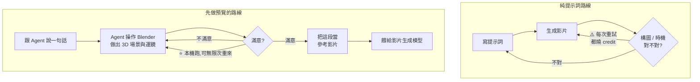

# 用 Agent 五分鐘上手 Blender:把 3D 預覽當成 AI 影片的「參考影片」

**主題分類:** 應用 AI / 設計 —— AI 影片製作流程與 MCP 整合
**來源影片:** YouTube〈에이전트로 5분 만에 블렌더 입문 실사용하기 (Codex, Claude)〉(Deno / Denoise AI,2026-09-05,約 9.4 分鐘,**官方韓文字幕**)
**整理日期:** 2026-09-06

> ⚠️⚠️ **立場揭露:** 該片主體是 **Higgsfield 的 Blender 外掛**,說明欄的連結**帶有推薦參數**,
> ComfyUI 連結也標明是「Deno 推薦連結」。**本文只整理方法論與可驗證的機制,不背書任何產品。**

> 📎 相關筆記:[[claude-design-review]]、[[mcp-server-first-build-four-pitfalls]](MCP 的機制面)、
> [[products-for-ai-ax-axo-luckin-mcp]](把既有軟體開放給 Agent 用的思路)

---

## 0. 一句話總結

> **與其用提示詞反覆抽卡,不如先在 Blender 裡把鏡頭「排」出來,
> 再把那段 3D 預覽當成參考影片餵給影片生成模型。**
>
> ⭐⭐ 而讓這件事對非 3D 背景的人可行的關鍵,是**你不必學 Blender 的 UI ——
> 由 Agent 透過 MCP 去操作它。**

作者的自述很有代表性:

> 「我一直對 Blender 有興趣,但一想到要把這些複雜 UI 和一堆功能一個一個學會就有壓力,所以一直往後拖。
> **然後今天在三十分鐘內,之前所有的擔心都消失了。**」

---

## 1. 這條流程在解什麼問題



### ⭐⭐ 兩個好處(作者自己排的順序)

| # | 好處 | 說明 |
|---|---|---|
| **①** | **做得出提示詞做不出來的鏡頭** | 影片舉的例子是**攝影機角度急劇變化**的鏡頭 —— **這種東西用提示詞幾乎不可能穩定講清楚** |
| **②** | ⭐ **成本** —— 作者說**這才是最大的優點** | 見下 |

### 成本這一條值得展開

> 如果你要求構圖與時機**完全按你想的來**,用純提示詞就得**消耗難以想像的 credit**,
> 然後從一堆結果裡挑順眼的、再靠剪接補救。

而 Blender 這條路:

> **本機跑,所以在動用商用模型之前,可以無限次重試,直到 Blender 那邊做到滿意為止。**
> **等到那段預覽幾乎已經是成品了,再拿去餵生成模型 —— 一次就成功的機率大幅提高。**

⭐ 換句話說:**把「昂貴的隨機重試」換成「免費的確定性迭代」。**

📎 這與 [[lowcode-automation-vs-agent-first]] 的 Plan 階段、
[[ai-native-sdlc-landing-checklist]] §5② 的「把昂貴的返工提前到最便宜的時候」是同一個結構 ——
**只是這裡的「便宜」指的是本機算力而不是雲端 credit。**

---

## 2. 機制:MCP 把 Blender 變成 Agent 能操作的工具


**幾個要分清楚的邊界:**

| 這一段 | 在哪裡跑 | 花不花錢 |
|---|---|---|
| **Blender 的 3D 場景組建與算圖** | ⭐ **完全在本機** | **不花錢** |
| **外掛本身** | — | **免費下載** |
| ⚠️ **Agent(Claude / Codex)** | 雲端 | **依你的方案 / credit 計費** |
| ⚠️ **最後的 AI 影片生成** | 雲端 | **依你的方案 / credit 計費** |

> ⚠️ 影片正文一度說「用 Claude 連 Blender 做影片**是 100% 免費**」,
> **但說明欄自己補了更精確的版本** ——
> **「免費」指的是 Blender 這一段的本機作業;Agent 與 AI 影片生成會另外產生費用。**
> **引用時請用說明欄那個版本。**

---

## 3. 實際做了什麼(作者的示範)

**他給 Claude Code 的提示詞就這麼一句:**

```text
做一支 20 秒的影片:一顆巨大的網球以超高速在天空飛行,
在建築物之間動態地穿梭。
```

然後**他就離開座位了** —— Claude 讀相關文件、著手作業。回來後覺得畫面有點平,**再請它修改**。

> ⭐ 作者的感想:**「就這樣在很短的時間裡,一個世界觀就被『咚』地一聲建構出來了。」**
> 他說想到自己喜歡的遊戲 GTA,「**現在真的是只要有 Agent 和企劃能力,想做什麼都做得到的世界**」。

### ⭐⭐ 他做了一個對照實驗(這是這支影片最有價值的部分)

**同一個場景,兩條路各做一次,直接比:**

| 做法 | 結果 |
|---|---|
| **只用提示詞** | — |
| **把 Blender 預覽當參考影片** | — |

> ⭐ 結論:**「要演出動態的鏡頭時,Blender 確實是必要的元素。」**

**而且他把適用邊界講清楚了:**

| 情境 | 需不需要 Blender |
|---|---|
| 網球穿越市區這種 —— **一致性沒那麼重要** | 還好 |
| ⭐ **必須精準維持攝影機構圖與透視感** | **「Blender 現在可以說是必須的」** |

📌 另一個他先前做過的測試:**哈雷機車經過的鏡頭** ——
**攝影機角度、構圖、時機都做得幾乎一模一樣。**

---

## 4. 安裝與接線(操作步驟)

> ⚠️ 這一節是 2026-09-06 的畫面流程,**UI 可能已變動,以官方文件為準**。

| 步驟 | 動作 |
|---|---|
| **①** | 到 Higgsfield 右上角的 **Plugin** 選單(藏得有點深),滑鼠移上去後下方會出現 **Blender** 按鈕 |
| **②** | 進去後點最上方的 **Download** 下載外掛 |
| **③** | 開 Blender,把首次啟動的浮動訊息點掉,**把剛下載的檔案拖放進去** |
| **④** | 跳出訊息後按 **OK**,外掛就裝好了 |
| **⑤** | 回 Higgsfield 外掛頁面往下捲,找到 **「複製 Higgsfield Bridge URL」** 按鈕 |
| **⑥** | 到 Claude Code:**設定 → 使用者自訂 → 連接器(Connector) → 右上角「新增」** |
| **⑦** | 名稱隨意(如 `Higgsfield Blender`),下方網址欄 **Ctrl+V** 貼上剛才複製的 URL,下一步完成 |
| **⑧** | 開著 Blender,直接跟 Claude 或 Codex 說你想做什麼 |

### ⚠️ 一個實測踩到的限制

> **裝完外掛後,Blender 內部也會出現一個能跟 Agent 對話的輸入框 ——
> 但那裡不支援韓文輸入,只能用英文。**
> 所以作者**不在 Blender 內部用**,而是走上面的 Claude Code 連接器路線。

⭐ **推論(未經測試):中文輸入很可能有同樣問題** —— 若你要用中文下指令,
**走外部 Agent(Claude Code / Codex)而不是 Blender 內建輸入框,是比較穩的做法。**

---

## 5. ⭐⭐ 應用案例:這個模式可以搬到別的地方

這支影片真正可複用的,不是 Blender,而是那個結構:

> **當「最終產出」很貴且不可控時,先在一個便宜且確定性高的環境裡把「意圖」固化下來,
> 再把它當成約束餵給那個昂貴的環節。**

| 昂貴且隨機的環節 | 便宜且確定的前置 | 前置產物當成什麼 |
|---|---|---|
| **AI 影片生成** | **Blender 本機預覽** | **參考影片**(構圖 / 運鏡 / 時機) |
| AI 生圖 | 手繪草稿、3D 擺位、ControlNet 骨架 | 姿勢與構圖約束 |
| LLM 長任務 | 先讓它寫一份 `plan.md` | 執行前的審查點(見 [[ai-native-sdlc-landing-checklist]]) |
| 昂貴的雲端 CI | 本機先跑一次可複現的環境 | 避免把偶然成立的結果推上去 |

### 給想試的人的三個提醒

1. **⚠️ 先算清楚哪一段花錢。** 本機的 Blender 迭代不花錢,**但 Agent 的每一次來回都在燒你的方案額度** ——
   一句話丟過去讓它跑十分鐘,那十分鐘是要付費的。
2. **⭐ 讓 Agent 做的是「排鏡頭」,不是「做成品」。** 預覽只要能表達**構圖、運鏡、時機**就夠了,
   材質與打光交給後面的生成模型 —— **在 Blender 裡追求精緻是把便宜的那段做貴了。**
3. **⚠️ 這條流程綁定了一個第三方外掛。** 它現在免費,但**你的工作流會依賴它** ——
   影片本身就是一則產品推廣,**評估時請把「這個橋接哪天不維護了怎麼辦」算進去。**

---

## 6. 核實狀態

### ✅ 可從影片與說明欄直接確認

| 說法 | 狀態 |
|---|---|
| 該片主題為 Higgsfield 的 Blender 外掛 + MCP,連接 Claude / Codex | **屬實** |
| Blender 的 3D 組建與算圖在本機進行 | **屬實** |
| 外掛本身免費下載 | **屬實** |
| ⭐ **說明欄自行補正:Agent 使用與 AI 影片生成會依方案 / credit 另外產生費用** | **屬實**,且與正文的「100% 免費」說法不一致 —— **以說明欄為準** |
| Blender 內建輸入框不支援韓文、僅能英文 | **屬實**(作者實測) |

### ⚠️ 未能獨立查證(以影片示範看待)

- **「三十分鐘就從零上手」** —— 這是作者個人體感,**而且他本來就是影片製作者**,並非完全的初學者基準。
- **兩條路線的對照結果** —— 影片有播出畫面,**但沒有量化指標**(沒有給 credit 消耗、成功率或重試次數)。
- **哈雷機車鏡頭「幾乎一模一樣」** —— 為主觀評價。
- **Higgsfield Bridge 的實際協定細節**、外掛能操作 Blender 到什麼程度(有哪些工具、權限邊界)
  —— ⚠️ **影片完全沒提,本文也未實測。** 這是**接任何 MCP 之前都該先問清楚的事**,
  見 [[mcp-server-first-build-four-pitfalls]]。

> ⚠️ 本文為對一支公開影片的整理。**該片為產品推廣性質,連結帶推薦參數;
> 本文不背書該產品,亦未實際安裝測試。** 安裝任何第三方 MCP 連接器前,
> 請自行確認它取得的權限範圍。

---

## 來源

- [에이전트로 5분 만에 블렌더 입문 실사용하기 (Codex, Claude) — Deno / Denoise AI](https://www.youtube.com/watch?v=tBnpspp4IH8)(2026-09-05,約 9.4 分鐘,官方韓文字幕)
- 相關:
  - [Blender 官方網站](https://www.blender.org/)
  - [Model Context Protocol 官方文件](https://modelcontextprotocol.io/)
  - 本倉庫相關筆記:[[mcp-server-first-build-four-pitfalls]]、[[claude-design-review]]、[[ai-native-sdlc-landing-checklist]]

> ⚠️ 影片為韓文,本文依**官方韓文字幕**翻譯整理;操作步驟為 2026-09-06 的介面,**UI 可能已變動**。
> ⚠️ 該片含產品推廣與推薦連結,已於檔頭標明立場。
