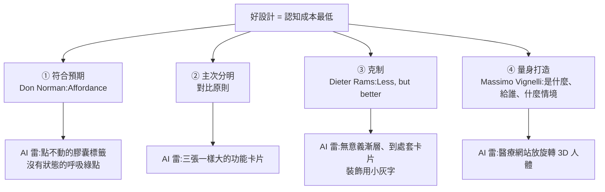
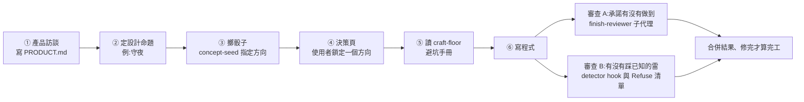

# Impeccable 深度解析:AI 做的網站為什麼有「AI 味」,以及一個 skill 怎麼把設計師流程教給 AI

**主題分類:** 科技 / 應用 AI — AI 前端設計工作流
**來源:** YouTube〈怎麼樣做出沒有 AI 味的設計?/impeccable 深度解析!〉(Gary Chen @garychenai,2026-09-26,約 16.8 分;**依官方繁中字幕整理**)
**原始碼核實:** 已 `git clone --depth 1` [pbakaus/impeccable](https://github.com/pbakaus/impeccable)(Apache-2.0,本文查詢時 71,560 star,最後 commit 2026-09-24 `9d715cc`,npm 套件 4.1.0),讀 README、`skill/reference/`(`init.md`、`new-work.md`、`craft-floor.md`)與 `skill/agents/impeccable-finish-reviewer.md`
**整理日期:** 2026-09-27

> ⚠️ **立場揭露:** 作者在說明欄與片尾推廣自己的付費社群「AI 實戰營」(Skool / 頻道會員),並表示 Impeccable 後續三個微調步驟會放在**會員專屬影片**拆解。**本文不轉述付費內容**;後續指令改以 repo 公開文件補齊(見 §6)。
> 📌 本庫另有一篇較早的 [[ai-website-building-claude-code]](Debug Tuboshu)提過「裝 `impeccable` skill 避免 AI 一直做同樣風格」,本篇是對這個 skill 本身的完整拆解。

---

## TL;DR

1. ⭐⭐ **「AI 味」的清單每年都在變**(2022 紫漸層發光 → 2025 米白雜誌斜體 → 2026 粗黑邊框 + 硬陰影 + 貼紙),所以**別背清單,要回到設計原則**:符合預期、主次分明、克制、量身打造。
2. ⭐⭐⭐ **AI 會踩雷的根本原因:「你根本沒告訴它」**。只有兩三行 prompt 時,模型只能吐出「全世界網頁的統計平均值」。
3. ⭐⭐ **Impeccable 的做法 = 把一流設計師的流程寫成 skill**:先產品訪談(寫 `PRODUCT.md`,**刻意不問顏色與字體**)→ **擲骰子**抽視覺方向 → 讀避坑手冊 `craft-floor` → 做完再跑**兩層審查**。
4. ⚠️ **成本差距很大**:同一個需求,一般 AI 約 2 分鐘,Impeccable 跑了**一個多小時**。**要見人的門面值得跑完整套;內部工具用一般 AI 就夠。**
5. ✅ 本文核實:「擲骰子」確有其事,是 `impeccable concept-seed` 腳本;「67 條毛病」與 README 的「**61 條確定性偵測規則 + 只能靠 LLM 判斷的檢查**」口徑不同(見 §7)。

---

## 1. AI 味的演化:長相換了三次,你還是認得出來

| 年份 | AI 網頁的典型長相 |
|---|---|
| **2022** | 科技感紫色漸層、亮青色、深色背景中間一團發光彩暈 |
| **2025** | 文藝雜誌風:米白底 + 斜體字 |
| **2026** | 粗黑邊框、立體黑陰影、到處貼小貼紙 |

> ⭐ 影片的觀察:**門檻消失後,大家都用 AI 做網站,結果高度同質化**;於是「撕掉 AI 味」變成凸顯品味的方式。
> ⭐⭐ 因為模型一直迭代、套路一直換,**與其追清單,不如問「它到底違反了哪條設計原則」**。

---

## 2. ⭐⭐⭐ 好設計的四個維度(影片作者的主觀框架)

作者先聲明**設計很主觀、也要看受眾**,他自己的定義是一句話:
> **「把使用者的認知成本降到最低,讓你一眼抓到重點,而且每一次操作都完全符合預期。」**

| 維度 | 原則 | 生活例子 | AI 常見的雷 |
|---|---|---|---|
| **① 符合預期** | **東西的外觀本身就該告訴你怎麼用**(Affordance) | 裝了「拉」的門把,門就不能是用推的 | ⚠️ 標題上方一顆長得像按鈕的**膠囊標籤,點了沒反應**;角落一直閃的綠點,**背後沒有任何系統狀態** |
| **② 主次分明** | **重要程度不同,視覺差距就要大到一眼看出** | 報紙頭條永遠最大 | ⚠️ 功能區**幾乎必出三張一樣大的卡片**,看完不知道產品最厲害的是哪個 |
| **③ 克制** | **每條邊框、每個顏色、每段間距都要有目的** | Rams 的 Less, but better | ⚠️ 無意義漸層、隨處卡片、點不進去的 pills;**全部拔掉後資訊一點都沒少** |
| **④ 量身打造** | **先弄懂:這是什麼、給誰用、在什麼情境用** | 藥袋字大樸素 vs 洋芋片包裝花俏 | ⚠️ 醫療諮詢站給科技藍 + 旋轉 3D 人體 + 「準確率 99%」;**焦慮的病人只想找急診電話** |

> ⭐⭐⭐ **為什麼 AI 一直踩這些雷?「因為你根本沒告訴它。」**
> 手上只有兩三行 prompt、缺乏上下文時,**它唯一能做的就是把統計平均值吐給你**,再用漸層和假按鈕把畫面塞滿。

---

## 3. 實測:同一個需求,一般 AI vs Impeccable

**需求:** 幫工程師監控網站的 landing page,核心功能只有一個——**半夜網站掛掉就打電話叫你起床**。

| | 一般 AI | Impeccable |
|---|---|---|
| **耗時** | **不到 2 分鐘** | ⚠️ **一個多小時**(token 也多很多) |
| **產出** | 大標題、手機效果圖、三張功能卡片、使用步驟、定價表;手機版也沒跑版 | 深色開發者主控台;**亮紅燈、跳出撥號警報,把產品機制直接動態跑給你看** |
| ⭐ **遮住產品名測試** | **換成任何公司名都說得通** —— 沒大毛病,但關掉就忘 | **遮掉名字依然只屬於這個產品** |
| **缺點** | 罐頭公版,沒有記憶點 | ⚠️ **第一屏資訊量過大、到處是極小的英文字,讀起來費力** |

> ⭐⭐ **「遮住產品名」是本片最好用的檢驗法**:如果換成別家公司的名字也毫無違和感,這頁就沒有替你的產品設計任何東西。
> ⚠️ 作者也承認:**Impeccable 不是阿拉丁神燈,不會一次到位**;它最大的價值是「先定義設計 context 文件、先想清楚受眾」。

---

## 4. ⭐⭐⭐ Impeccable 的流程拆解(✅ 已對原始碼核實)

### 4.1 ① 產品訪談:刻意不問你喜歡什麼顏色

影片:它只問產品底層事實——**有哪些功能、沒有哪些功能、使用者來要完成什麼任務、哪些設計絕對不能做**;**完全不問顏色與字體偏好**。

✅ **`skill/reference/init.md` 原文規定:**
- 「**Do not ask for an aesthetic direction, emotional feel, visual references, colors, typography, or style during init.**」
- 問之前先掃專案(文件、設定、路由、品牌資產),**只問 repo 答不出來的實質缺口**;每輪最多三個問題。
- 沒有框架時,**技術棧是使用者的決定**,要問一次並記錄在 `## Stack`。

> ⭐ 作者自己的補強習慣:**在 `AGENTS.md` 裡寫明「前端改動都要參考 `PRODUCT.md` 與 impeccable skill」**,避免 agent 之後忘記。

### 4.2 ② ③ 擲骰子:防止 AI 自動退回最安全的答案

影片的例子:產品核心體驗是「**守夜**」——平時幾乎感覺不到它,出事時要像警鈴一樣把你叫醒。Impeccable 找現實世界裡「**長時間安靜監看、異常時立即升高訊號**」的系統當隱喻:**大樓火警總機、醫院夜班觀察紀錄表、暴風雨中的燈塔守夜日誌**,然後**隨機抽一個當主提案**。

> ⭐⭐ **為什麼要擲骰子?** AI 自己挑只會選最安全的:科技藍、功能卡片、通用儀表板。
> **抽到燈塔不代表最後要做成燈塔網站;它代表 AI 不能用一句「太大膽」就略過,必須認真證明這個方向能不能幫工程師更快理解產品。**

✅ **`skill/reference/new-work.md` 核實(比影片講得更完整):**

| 機制 | 原始碼規定 |
|---|---|
| **骰子是腳本,不是提示詞** | 必須跑 `impeccable concept-seed --scope direction --mode <mode>`;⚠️ 「**在這個腳本跑完之前寫任何程式碼都算違約**,不論 harness、模型或時間壓力」 |
| **主提案 + 挑戰者** | 腳本**指定**要做的方向,另外發幾張「挑戰者」;每個挑戰者只用兩個軸比較:**受眾辨識度、產品清晰度** |
| **輸了也要留下東西** | 被判「declined」的挑戰者,要說出它有哪一項紀律是主方向缺的,並**把主方向拉高到那個水準**,寫成具名的一行 |
| **Impeccable 自己的選擇** | 可加一張「IMPECCABLE'S PICK」卡,**但永遠不能放在第一位**,而且要誠實寫出「這個方向很常見」的風險 |
| **重抽三種口味** | plain(同樣範圍再抽)、safer(保守)、bolder(只用外來形式);**口味由使用者決定,不是 AI** |
| **永遠留一扇門** | 「業界標準做法」是一個常駐選項;**AI 不可推薦它**,但使用者選了就要全力做好,不准偷塞怪東西 |

> 影片說每張提案都會寫清楚「第一眼長什麼樣、設計理由、可能的風險」——✅ 原始碼要求每張卡片同樣欄位:thesis、palette、materials、first viewport、honest risk。

### 4.3 ⑤ craft-floor:避坑手冊

影片形容它是「**防呆避坑手冊**」,把 AI 的壞習慣收斂成具體規則。✅ `skill/reference/craft-floor.md` 分兩部分:

| 區塊 | 內容摘錄 |
|---|---|
| **Verify(做完要實際檢查)** | 對比度:內文 ≥ 4.5:1、大字 ≥ 3:1;**彩色底上的次要文字從該色相調,絕不用灰**;內文行長 65–75ch;**一個精心設計的動態時刻,而不是每區塊都一樣的淡入**;hover/disabled/loading/error/empty 狀態;⭐ **文字選取、游標、捲軸、focus ring 這些「你沒畫的部分」也要套主題色** |
| **Refuse(類別預設,要有理由才能用)** | 一樣大的「圖示 + 標題 + 文字」卡片當頁面骨架;**巢狀卡片永遠是錯的**;大數字 + 小標籤的 hero-metric 模板;漸層文字;裝飾性玻璃模糊;卡片左邊超過 1px 的彩色邊條;`box-shadow: 4px 4px 0` 硬陰影(除非真的是新野獸派);**用 monospace 假裝「很技術」**;用 emoji 當圖示系統;依類別選深淺色(應依使用場景與環境光) |
| ⭐ **唯一的硬禁令** | **標題上方的 kicker / eyebrow 小標**:「**這一條是禁令,不是預設:沒有任何 brief 能把它贏回來。**」 |

> ⭐ 對照 §1:2026 年那種「粗黑邊框 + 立體黑陰影」,正是 Refuse 清單裡的 hard offset shadow;影片說的「裝模作樣的小標籤」就是 eyebrow 禁令。
> ⭐ 手冊最後一句:**「地板只管機制,不選方向。所有檢查都綠了,就把頁面花在你承諾的那個世界上。」**

### 4.4 ⑥ 兩層審查

| 層 | 影片說法 | ✅ 原始碼對應 |
|---|---|---|
| **A:這件事做對了嗎** | 回扣設計命題:平時符不符合「守夜」?出事時工程師能不能幾秒內看懂哪個服務掛了、多嚴重、下一步做什麼? | **`impeccable-finish-reviewer` 子代理**:「**建置執行緒注意力重力之外的新眼睛**」;**不改任何檔案**,只依截圖與合約逐條檢查 persistence、fidelity、ceiling、**contract promise by promise**、truth、floor |
| **B:有沒有犯已知的錯** | 拿避坑清單像掃描器一樣逐行抓漏(巢狀卡片、公版小標籤、無意義漸層) | **design hook** 在每次 UI 檔案編輯後跑確定性偵測器、Stop 時再跑深一層;finish-reviewer 另外拿 Refuse 清單對截圖 |

✅ **finish-reviewer 的第一行只能是四個詞之一:`recapture` / `rebuild` / `fix` / `ship`**,而且「**這個詞是推導出來的,不是感覺出來的**」——只有在沒有任何 contradicted 或 missing 的項目時才能 `ship`。原文還寫:「**你是使用者之前的最後一道關,不是替同事緩和壞消息的同事。**」

> 📎 這與 [[shopify-helix-checkpoints-and-gates]] 的「關卡由獨立角色判定、不讓做事的 agent 自己說完成」是同一個設計;快檢查放編輯後、深檢查放 Stop 的分工,詳見 [[claude-code-hooks-complete-guide]] §10。

---

## 5. 什麼時候值得花這個成本

| 情境 | 建議 |
|---|---|
| ⭐ **產品首頁、核心 landing page 等要見人的門面** | **值得跑完整套**(訪談 → 方向 → 避坑 → 雙審查) |
| **自己用的內部介面、簡單 UI** | **一般 AI 就夠**;作者提到他 demo Astra 時用一段簡單提示詞做的網頁已有一定水準(見 [[astra-vs-fable-find-bugs-vs-fix-bugs]]) |

✅ README 另有一個省成本的旋鈕:**build path**。`/impeccable init` 會問一次,記在 `.impeccable/config.json` 的 `buildPath`:
- **`comp`(先出設計稿)**:先生成一張完整設計圖再照著做——**構圖更大膽、較慢**;
- **`code`(直接寫程式)**:野心寫進方向合約、完工時再審——**較精簡、較快**。
- 沒有圖片生成能力的 harness 根本不會出現這個選項。

---

## 6. 影片沒講、README 公開寫著的部分

| 項目 | 內容 |
|---|---|
| **24 個指令** | 都走 `/impeccable <command>`:`craft`、`init`、`shape`、`critique`、`audit`、`polish`、`bolder`、`quieter`、`distill`、`harden`、`typeset`、`layout`、`animate`、`live` 等;常用的可 `/impeccable pin audit` 變成獨立的 `/audit` |
| **安裝** | 官方推薦 `npx impeccable install`,再在工具裡跑 `/impeccable init`(影片的做法是把 repo 連結丟給 Claude Code / Codex 叫它安裝,也可行) |
| **不靠 LLM 的偵測** | CLI 與瀏覽器擴充功能能跑那 61 條確定性規則,**不需要 LLM、不需要 API key**;也能 `npx impeccable detect https://example.com` 檢查線上網站 |
| ⚠️ **hook 的安全提醒** | Claude Code 的 hook 裝在 `.claude/settings.local.json`;README 明寫:**hook 的執行不受模型工具核准影響,第一次編輯或 Stop 可能就會下載並快取引擎**,無人值守前要先檢查已安裝的 hook |
| **`.impeccable/` 進不進 git** | 截圖、session、快取不要進;`config.json`、`design.json`、`surfaces/*.md`、`critique/*.md` 要進 |
| **起源** | README 自述:**從 Anthropic 官方 `frontend-design` skill 出發**再擴充 |

---

## 7. ⚠️ 補正與核實

| 影片說法 | 核實結果 |
|---|---|
| 「官方整理了 **67 條** AI 最常犯的設計毛病」 | ⚠️ README 寫的是「**61 條確定性偵測規則,加上只能靠 LLM 判斷的 critique 檢查**」。67 可能是官網把兩者合計的口徑,**本文未能在 repo 或官網找到 67 這個數字**,引用時以 README 為準 |
| 擲骰子隨機抽方向 | ✅ 屬實,是 `concept-seed` 腳本;而且**跑腳本前寫程式碼算違約**,強度比影片描述的更高 |
| 訪談不問顏色字體 | ✅ `init.md` 明文禁止在 init 問美學方向、顏色、字體 |
| 兩層審查 | ✅ 屬實;一層是獨立子代理 finish-reviewer,一層是 detector hook + Refuse 清單 |
| [[claude-code-hooks-complete-guide]] 提到的「持續嘮叨會讓模型變保守」原始碼註解 | ⚠️ 本次讀原始碼**仍沒找到這句**;最接近的是 `docs/CLI-CONTRACT.md`:live 預覽期間**不在中途發警告,因為「nagging mid-cycle derails it」**(會打斷變體流程)——意思相近,但不是「變保守」 |

---

## 8. 應用案例

### 案例一:幫一間牙醫診所改官網(套用四維度自檢)

原本 AI 產出:藍白配色、三張等大卡片「專業團隊 / 先進設備 / 溫馨環境」、hero 上方一顆「✨ 2026 全新開幕」膠囊標籤。

| 維度 | 自檢 | 改法 |
|---|---|---|
| 符合預期 | 膠囊標籤看起來可點但點不動 | 刪掉;或真的連到開幕優惠頁 |
| 主次分明 | 三張卡一樣大,病人找不到「預約」 | **預約按鈕 + 電話做成唯一主角**,其他退後 |
| 克制 | 「溫馨環境」卡片沒有資訊 | 換成一張真實診間照片,或直接拿掉 |
| 量身打造 | 牙痛的人半夜上網 | 首屏放**「今天能不能看診」與急診電話** |

最後做「**遮住診所名**」測試:如果換成隔壁診所的名字也成立,代表還沒做完。

### 案例二:把 Impeccable 的「骰子」概念用在非設計工作

寫產品 slogan、簡報標題、命名時,AI 同樣會滑向平均值。仿照 `concept-seed`:
1. 先列 5 個**真實世界的隱喻**(例如記帳 App:存錢筒、帳房先生、航海日誌、體重計、收據盒);
2. **用亂數抽一個當主提案**,要求 AI 必須認真發展它,不准用「太大膽」帶過;
3. 另外保留一個「業界標準寫法」選項,但**不讓 AI 推薦它**,由你決定要不要退回安全牌。

### 案例三:團隊導入時的最低成本設定

- 只在**對外門面**跑 `/impeccable craft`;內部後台跑一般 AI + `/impeccable audit` 抓明顯問題即可。
- `PRODUCT.md` 進版控,並在 `AGENTS.md` / `CLAUDE.md` 寫「前端改動先讀 `PRODUCT.md`」(影片作者的做法)。
- CI 或 PR 檢查跑 `npx impeccable detect`,不需要 API key。

---

## 來源

- YouTube:[怎麼樣做出沒有 AI 味的設計?/impeccable 深度解析!](https://www.youtube.com/watch?v=QuQ2FOznK18)(Gary Chen @garychenai,2026-09-26;官方繁中字幕)
- GitHub:[pbakaus/impeccable](https://github.com/pbakaus/impeccable)(README、`skill/reference/init.md`、`skill/reference/new-work.md`、`skill/reference/craft-floor.md`、`skill/agents/impeccable-finish-reviewer.md`、`docs/CLI-CONTRACT.md`;commit `9d715cc`)
- 官網:[impeccable.style](https://impeccable.style)
- Anthropic 官方起點:[anthropics/skills — frontend-design](https://github.com/anthropics/skills/tree/main/skills/frontend-design)
- Claude Code hooks 安全說明:[code.claude.com/docs/en/hooks#security-considerations](https://code.claude.com/docs/en/hooks#security-considerations)
