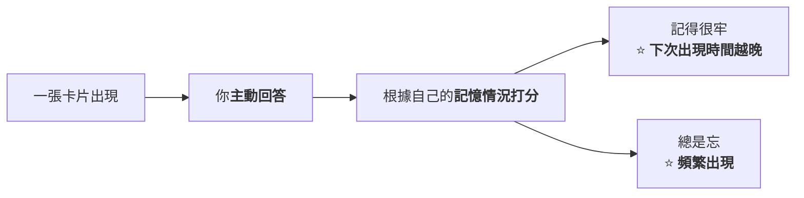
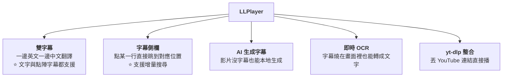
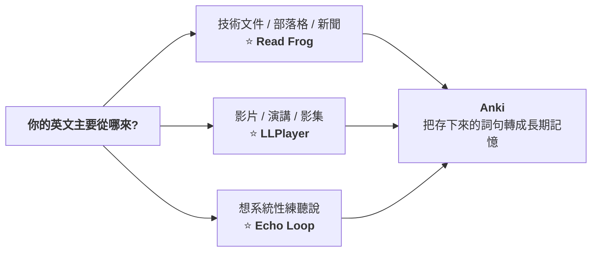

# 五個開源英語學習專案:從聽力訓練流程到「把每天看的英文網頁變成教材」

> 整理自 YouTube 頻道 **仕宇JavaPub**〈[5 个 GitHub 上开源的英语学习神器](https://www.youtube.com/watch?v=YRZnUoGrsh0)〉(2026-09-13,約 6.8 分鐘)。
> **該片無字幕也無自動字幕,逐字稿以 CPU faster-whisper 轉錄取得、非官方字幕**,可能有少量聽寫誤差(專有名詞對照見文末)。
>
> ⭐⭐⭐ **五個專案本文都已 `git clone` 下來讀過原始碼**(Anki 與 Enjoy 兩個以官方文件為主),
> **抓到四處影片講得不準或漏掉的關鍵資訊**(見 §六)。
>
> ⚠️ **立場揭露:該片說明欄含多家雲端廠商的推薦/聯盟連結**(阿里雲 `userCode=`、騰訊雲、百度雲 `ambassadorId=`、京東雲)
> **以及作者自營社群與公眾號**。⭐ 這些連結與影片內容本身無直接關聯,但仍應知情。

---

## 一句話總結

> ⭐⭐⭐ **這五個專案解決的問題**完全不重疊** ——
> **Echo Loop 管「怎麼練」、Enjoy 管「練什麼與方法論」、Anki 管「怎麼不忘」、
> Read Frog 管「把你每天已經在看的東西變成教材」、LLPlayer 管「把任何影片變成可反覆精聽的材料」。**
>
> ⭐⭐ **「開源專案比較有意思的地方,是它們不一定把所有功能都做進去 ——
> 很多專案就是專門解決學習過程中的**某一類**問題。」**

---

## 概覽

| # | 專案 | ⭐ **實際 star 數** | 語言 | 授權 | 解決什麼 |
|---|---|---|---|---|---|
| **1** | ⭐ **Echo Loop** (`echo-loop/Echo-Loop`) | **3,619** | **Dart / Flutter** | **AGPL-3.0** | **聽說訓練的完整流程** |
| **2** | **Enjoy**(`ZuodaoTech/everyone-can-use-english`) | **37,757** | **TypeScript** | **GPL-3.0** | **學習方法論 + 工具集** |
| **3** | **Anki**(`ankitects/anki`) | **31,309** | ⭐ **Rust** | **見 §四** | **長期記憶** |
| **4** | ⭐ **Read Frog / 陪讀蛙**(`mengxi-ream/read-frog`) | **9,760** | **TypeScript** | **GPL-3.0** | **把英文網頁變成教材** |
| **5** | ⭐ **LLPlayer**(`umlx5h/LLPlayer`) | **4,182** | ⭐ **C# / WPF** | **GPL-3.0** | **把影片變成外語學習播放器** |

📌 **⭐ star 數為本文 2026-09-20 實際查詢 GitHub API 所得,與影片口述略有出入(影片錄於 09-13)。**

---

## 一、⭐⭐⭐ Echo Loop:把「精聽該怎麼做」寫成一條流程

> ⚠️ **「很多人練聽力的時候做法其實比較隨機 —— 找一段影片聽幾遍,聽不懂再看字幕,過幾天可能就又忘了。」**
>
> ⭐⭐⭐ **Echo Loop 的做法不是給你一個播放器,而是**把訓練這件事做成一條流程**。**

### 1.1 ⭐⭐⭐ 首次學習的四個子步驟 ——⚠️ **但順序跟影片說的不一樣**

**影片說:盲聽 → 精聽 → 跟讀 → 複述。**

> ⚠️⚠️⚠️ **本文讀原始碼發現:那是**舊版(v1)**的順序。
> **目前預設的 v2 順序是:精聽 → 跟讀 → 盲聽(可跳過)→ 複述。****

**`lib/models/learning_plan.dart` 的原始註解寫得很清楚:**

```dart
case LearningStage.firstLearn:
  // v1（存量音频）：盲听优先的旧顺序
  // v2（新建音频）：精听 → 跟读 → 盲听(可跳过) → 复述，让用户更早感受逐句精听的价值
  return v == 1
      ? const [
          SubStageType.blindListen,
          SubStageType.intensiveListen,
          SubStageType.listenAndRepeat,
          SubStageType.retell,
        ]
      : const [
          SubStageType.intensiveListen,
          SubStageType.listenAndRepeat,
          SubStageType.blindListen,
          SubStageType.retell,
        ];
```

**⭐ 而且 `kLatestPlanVersions` 確認所有階段的預設版本都是 2:**

```dart
const Map<LearningStage, int> kLatestPlanVersions = {
  LearningStage.firstLearn: 2,
  LearningStage.review0: 2,
  // …review1 / review2 / review4 / review7 / review14 / review28 皆為 2
};
```

> ⭐⭐ **改動理由值得記下來:**「讓使用者更早感受逐句精聽的價值」** ——
> **盲聽放在最前面會讓新手第一步就受挫,所以把它後置、而且做成可跳過。**

### 1.2 四個子步驟各自在做什麼(依影片說明)

| 子步驟 | 內容 |
|---|---|
| **精聽** | **一句一句聽,把自己聽不懂或容易聽錯的地方標出來** |
| **跟讀** | **盡量模仿原音的發音、節奏、語調** |
| **盲聽** | **不看字幕,把整段內容完整聽一遍** |
| ⭐ **複述** | ⭐⭐ **不是照著原文念,而是盡力**用自己的話**把內容重新講出來** |

### 1.3 ⭐⭐⭐ 間隔複習:七輪,而且程式碼裡存的是「間隔」不是「里程碑」

**影片說:6 小時、1 天、2 天、4 天、7 天、14 天、28 天。**

> ⭐ **本文讀 `lib/database/enums.dart` 核實:**里程碑是對的,但實作細節有個值得注意的區別**。**

```dart
/// 复习间隔（小时）
///
/// 这里的语义是"距上一轮完成后的等待时长"，不是"距首次学习完成的累计里程碑"。
int get intervalHours => switch (this) {
  firstLearn => 0,
  review0 => 6,     // 首轮复习
  review1 => 18,    // 第二轮
  review2 => 24,    // 第三轮
  review4 => 48,    // 第四轮
  review7 => 72,    // 第五轮
  review14 => 168,  // 第六轮
  review28 => 336,  // 第七轮
  completed => 0,
};
```

| 階段 | **存的間隔** | **累計** |
|---|---|---|
| `review0` | **6 小時** | **6 小時** |
| `review1` | **18 小時** | **1 天** |
| `review2` | **24 小時** | **2 天** |
| `review4` | **48 小時** | **4 天** |
| `review7` | **72 小時** | **7 天** |
| `review14` | **168 小時** | **14 天** |
| `review28` | **336 小時** | **28 天** |

> ⭐⭐⭐ **這個設計差異是有實際後果的:**
> **因為存的是「距上一輪**完成**後的等待時長」,所以你某一輪拖了三天才做,
> 後面整條時程會**跟著往後推**,而不是按絕對日期硬排。**
>
> ⭐ **對照 §三 Anki 的間隔重複邏輯,這是「相對排程」而非「絕對里程碑」的典型實作。**

### 1.4 ⭐ 複習階段做的事跟首次學習不同

**⭐ 本文讀 `enums.dart` 的 `allSubStages` 核實,複習輪的子步驟是:**

| 階段 | **v2 子步驟** |
|---|---|
| `review0` | **難點練習 → 盲聽** |
| `review1` | **難點練習 → 盲聽** |
| `review2/4/7/14` | **難點練習 → 盲聽 → 段落複述** |
| ⭐ `review28` | **難點練習 → 盲聽 → 段落複述**(⚠️ v1 曾有「全文摘要複述」,v2 已移除) |

> ⭐⭐ **也就是說:複習輪的重心是**你自己標記的難點**,不是重聽全部。**
> **這正是間隔重複的核心 ——「把複習時間盡量放在那些快要忘掉的內容上」。**

---

## 二、⭐ Enjoy:「人人都能用英語」不只是一本書

> **它最早是一套英語學習內容(口語、語音、朗讀、字典、語法、精讀),
> ⭐ **但現在更像一整套學習體系 + 一個叫 Enjoy 的 AI 工具**。**

📌 **⚠️ 影片旁白把工具名念成「AGE」 —— ⭐ 正確是 **Enjoy**(官網 `enjoy.bot`)。**

| 組成 | 內容 |
|---|---|
| ⭐ **「一千小時」訓練方案** | **把英語拆成長期訓練:美式英語語音塑造、認知學習、自主訓練與具體訓練任務** |
| **Enjoy(AI 工具)** | **跟讀練習、AI 發音評估、閃卡生成、電子書整合** |
| ⭐⭐ **瀏覽器擴充** | **支援 YouTube 與 Netflix** —— 把你正在看的真實內容變成學習材料 |
| **形態** | **Web 版為主、Chrome 擴充,桌面版規劃中** |

> ⭐⭐⭐ **影片點出的理念很值得記:**
> **「傳統英語學習軟體通常是廠商自己備好課程,使用者照課程學;
> AI 加進來以後,**學習材料變得非常靈活** —— 你在看的 YouTube 或 Netflix 美劇,本身都可以變成教材。」**
>
> ⭐ **「這個專案比較特別的地方,不一定是某個功能有多強,而是它強調一個理念:**英語最終是拿來用的**。」**

> ⚠️ **本文查得該 repo 最後一次推送是 **2026-06-29**(距今約 3 個月),
> **比其他四個專案明顯不活躍** —— 若要投入時間,這點要先知道。**

---

## 三、⭐⭐ Anki:它不是英語學習軟體

> ⭐⭐⭐ **「準確來說,它是一個**間隔重複記憶**的工具。」**
> **所以你可以拿它背英語,也可以拿它背醫學知識、考試內容、程式概念。**

### 3.1 ⭐ 核心邏輯很簡單



> ⭐⭐⭐ **「它並不是每天讓你把所有內容都重複一遍,
> 而是**把複習時間盡量放在那些快要忘掉的內容上**。」**

### 3.2 ⭐ 卡片自由度很高

| 可放內容 |
|---|
| **文字、圖片、音訊、影片** |
| **例:正面放英文句子,背面放中文解釋 + 原聲音訊 + 單字用法** |
| ⭐ **也可以把句子中間挖掉一個詞**(填空題),強迫自己回憶 |

📌 **⭐ 本文補充:Anki 主程式現在是 **Rust** 寫的(31,309 star),並非多數人以為的純 Python;
⚠️ **授權是 `NOASSERTION`(GitHub 無法自動識別),不是單純的一個標準授權** —— 要商用前請自行確認。**

---

## 四、⭐⭐⭐ Read Frog(陪讀蛙):把你每天已經在看的英文變成教材

> ⭐ **最適合「平時本來就要大量讀英文」的人:技術文件、國外部落格、新聞網站、論文。**

| 功能 | 說明 |
|---|---|
| **雙語模式** | **裝瀏覽器擴充後,英文原文與翻譯同時顯示** |
| **選取即查** | **遇到不認識的單字或句子,選中就能翻譯、解釋、朗讀,不用再複製貼到翻譯軟體** |
| ⭐⭐ **把上下文一起交給 AI** | **見 §4.1 —— 這是本專案最關鍵的設計** |
| **YouTube 字幕、文字轉語音** | **支援** |
| **存下來複習** | **好的單字、例句、筆記可以保存,再生成閃卡** |

### 4.1 ⭐⭐⭐ 「把上下文一起交給 AI」實際上是怎麼做的

**影片的說法是:「很多英文單字單獨拿出來可能有很多意思,尤其技術文件裡常出現專業術語 ——
如果只是單獨翻譯一個詞很容易翻錯,把前後文一起交給 AI 通常更容易理解。」**

> ⭐⭐ **本文讀 `src/utils/constants/prompt.ts` 核實了具體做法 —— 它是用**提示詞 token 注入**實作的:**

```ts
export const WEB_PAGE_PROMPT_TOKENS = [
  "targetLanguage", "input", "webTitle", "webDescription",
  "webContent", "webSummary",
] as const
```

**預設的系統提示詞結尾長這樣:**

```
## Document Metadata for Context Awareness
Webpage title: {{webTitle}}
Webpage summary: {{webSummary}}
```

> ⚠️⚠️ **精確地說:預設注入的是**網頁標題 + 網頁摘要**,不是整頁原文。**
> ⭐ **`webContent`(整頁內容)這個 token **存在**,但預設提示詞沒有用它** ——
> **要用得自己在「個人化提示詞」裡加進去。這對成本有直接影響:整頁內容會讓每次翻譯的輸入 token 暴增。**

### 4.2 ⭐⭐ 兩個值得抄走的工程細節

**① 批次翻譯的分隔符號**

```ts
export const BATCH_SEPARATOR = "%%"
export const BATCH_SEPARATOR_LINE_PATTERN = /\r?\n[ \t]*%%[ \t]*\r?\n/
```

> ⭐ **把多個段落合併成一次請求,用 `%%` 單獨成行來切分** —— 減少請求數。

**② ⭐⭐⭐ 「不需要翻譯」的哨兵值**

```ts
export const NO_TRANSLATION_SENTINEL = "{{NO_TRANSLATION_NEEDED}}"
```

**原始碼註解解釋了為什麼要長成這樣:**

> ⭐⭐⭐ **「這個字面值**刻意長得像一個提示詞 token**:因為 `replaceTokens` 只會替換已知的 token,
> 所以它能**原封不動地存活過提示詞組裝**。」**

> ⭐⭐ **這是個很漂亮的技巧:用「假 token」當哨兵,天然不會被模板引擎吃掉。**
> **而且它會被快取(快取只存真值),在內容端才映射成空字串。**

### 4.3 ⭐ 它內建兩套提示詞

| 提示詞 | 取向 |
|---|---|
| **預設** | **忠實翻譯,保持段落數與格式完全相同** |
| ⭐ **Precision Rewrite(精準改寫)** | **「翻譯即改寫」** —— **意義優先於形式、根除翻譯腔、術語用權威譯法**,並有一段「靜默內部工作流」要模型先產草稿、自我檢查、再只輸出成品 |

📎 **這套「先草稿 → 自檢 → 只輸出成品」的提示詞結構,與本庫 [[claude-md-cut-82-percent-and-maintain-it]] 的模組化提示詞框架是同一類手法。**

---

## 五、⭐⭐⭐ LLPlayer:把任何影片變成外語學習播放器

> ⭐ **「普通播放器最大的目標是把影片看得舒服;LLPlayer 的目標是**讓你在看影片時方便學外語**。」**



### 5.1 ⭐⭐ 本文讀原始碼補上的規格細節

| 項目 | ⭐ **實際情況** |
|---|---|
| ⭐⭐ **ASR 引擎** | **支援**兩套**:`whisper.cpp` 與 `faster-whisper`**(影片只說「調用 Whisper」) |
| **OCR 引擎** | ⭐ **Tesseract OCR **與** Microsoft OCR 兩套** |
| **翻譯引擎** | **Google、DeepL、Ollama、LM Studio、OpenAI 等多家** |
| ⭐ **上下文感知翻譯** | **用 LLM 辨識字幕上下文來提高準確度**(與 §4.1 是同一個思路) |
| **字幕下載器** | **內建,支援 opensubtitles.org** |
| ⭐ **瀏覽器擴充整合** | **可搭配 Yomitan、10ten 等查詞擴充** |

📎 ⭐⭐ **它同時支援 whisper.cpp 與 faster-whisper 這件事,正好對應本庫
[[whisper-cpp-vs-faster-whisper-benchmark]] 的結論:**兩者各有適用素材,不是誰取代誰**。**

### 5.2 ⚠️⚠️⚠️ 影片完全沒提的一件事:**它只跑 Windows**

**README 的 Requirements 寫得很明確:**

| 項目 | 需求 |
|---|---|
| ⚠️⚠️ **作業系統** | **Windows 10 x64(Version 1903 以上)或 Windows 11 x64** —— **沒有 macOS / Linux** |
| **執行環境** | **.NET Desktop Runtime 10** |
| ⚠️⚠️⚠️ **MSVC Redistributable ≥ 2022** | **若未安裝,程式**可以啟動**,但**一開 ASR 或 OCR 就會當掉**** |

> ⚠️⚠️ **最後那條特別惡劣:它不是啟動就報錯,而是**你用到核心功能那一刻才崩潰**。
> **如果你打算用它,先把 VC++ Redistributable 裝好。**

---

## 六、⭐⭐⭐ 本文讀原始碼抓到的四處補正

| # | 影片說法 | ⭐ **實際情況** |
|---|---|---|
| **①** | **Echo Loop 首次學習是「盲聽 → 精聽 → 跟讀 → 複述」** | ⚠️⚠️ **那是 v1。目前預設 v2 是「精聽 → 跟讀 → 盲聽(可跳過)→ 複述」**,改動理由寫在程式碼註解裡:讓使用者更早感受逐句精聽的價值 |
| **②** | **Read Frog「把網頁上下文一起交給 AI」** | ⚠️ **預設注入的是**標題 + 摘要**,不是整頁原文;`webContent` token 存在但預設沒用** |
| **③** | **(未提)** | ⚠️⚠️⚠️ **LLPlayer **只支援 Windows**,而且缺 MSVC Redistributable 時會在啟用 ASR/OCR 的當下當掉** |
| **④** | **工具叫「AGE」** | ⭐ **正確是 **Enjoy**(`enjoy.bot`)** |

### ⭐ 另外兩點本文補充

| 項目 |
|---|
| ⭐ **Anki 主程式是 **Rust** 寫的,授權為 `NOASSERTION`** —— 商用前要自行確認 |
| ⚠️ **Enjoy 的 repo 最後推送是 2026-06-29(約 3 個月前),明顯比其他四個不活躍** |

---

## 應用案例:怎麼把這五個湊成一條動線

### 案例 1|⭐⭐⭐ 按「你的英文輸入從哪裡來」選,而不是按 star 數選



> ⭐⭐ **Anki 是**匯流點**,不是入口** —— 前面三個負責產生材料,它負責讓材料不被忘掉。

### 案例 2|⭐⭐ 一個實際可跑的動線(技術人版本)

| 步驟 | 做什麼 |
|---|---|
| **①** | **看英文技術文件時開 Read Frog 雙語模式**,遇到看不懂的術語選取即查 |
| ⭐ **②** | ⭐⭐ **把不熟的詞句**存下來**(Read Frog 支援保存單字、例句、筆記並生成閃卡) |
| **③** | **匯入 Anki**,正面放英文句、背面放解釋 + 用法;⭐ **或把句中關鍵詞挖空** |
| **④** | **看 conference talk 時用 LLPlayer**:沒字幕就本地 Whisper 生成,雙字幕對照,聽不清就點字幕列回跳 |
| ⭐ **⑤** | **想認真練聽說,用 Echo Loop 的七輪流程跑同一段素材** |

### 案例 3|⭐⭐⭐ 就算一個都不裝,Echo Loop 的流程本身就可以直接抄

> ⭐⭐ **它最有價值的東西不是 App,是那套被寫死在程式碼裡的訓練規格。**

**你可以用任何播放器 + 任何筆記軟體照著做:**

| 階段 | 做什麼 | 何時做 |
|---|---|---|
| **首次** | **精聽(逐句、標難點)→ 跟讀 → 盲聽 → 用自己的話複述** | **Day 0** |
| **R0** | **難點練習 → 盲聽** | **6 小時後** |
| **R1** | **難點練習 → 盲聽** | **累計 1 天** |
| **R2 / R4 / R7 / R14 / R28** | **難點練習 → 盲聽 → 段落複述** | **累計 2 / 4 / 7 / 14 / 28 天** |

> ⭐⭐⭐ **兩個關鍵原則(都來自原始碼,不是我編的):**
> **① 複習輪的重心是**你自己標記的難點**,不是重聽全部;**
> **② 間隔是「距上一輪**完成**後」算的 —— **拖延不會讓你錯過,只會把整條時程往後推**。**

### 案例 4|⭐⭐ Read Frog 的兩個技巧可以搬到你自己的翻譯/AI 專案

| 技巧 | 怎麼用 |
|---|---|
| ⭐ **批次分隔符號** | **多段合併成一次請求,用 `%%` 單獨成行切分** —— 減少請求數與往返延遲 |
| ⭐⭐⭐ **假 token 當哨兵** | **`{{NO_TRANSLATION_NEEDED}}`** —— **因為模板引擎只替換已知 token,長得像 token 的哨兵能原封不動存活過組裝**,比用自然語言(「不需要翻譯」)可靠得多 |

```python
# 哨兵值的概念示範:只替換已知 token,未知的原樣留下
KNOWN = {"targetLanguage", "input", "webTitle", "webSummary"}
SENTINEL = "{{NO_TRANSLATION_NEEDED}}"

def replace_tokens(template: str, values: dict[str, str]) -> str:
    """把模板裡的已知 token 換成實際值,未知 token 原樣保留。

    Args:
        template: 含 {{token}} 佔位符的提示詞模板。
        values: token 名稱到實際值的對照表。

    Returns:
        str: 替換後的提示詞;SENTINEL 因不在 KNOWN 中而原樣存活。
    """
    out = template
    for name in KNOWN:
        out = out.replace("{{%s}}" % name, values.get(name, ""))
    return out
```

---

## 重點回顧(TL;DR)

1. ⭐⭐⭐ **五個專案解決的問題完全不重疊** —— 練法(Echo Loop)、方法論(Enjoy)、記憶(Anki)、閱讀材料(Read Frog)、影片材料(LLPlayer)。
2. ⚠️⚠️ **補正一:Echo Loop 首次學習的順序已經改了** —— v1 是盲聽優先,**v2(現行預設)是精聽 → 跟讀 → 盲聽(可跳過)→ 複述**,理由寫在程式碼註解:讓使用者更早感受逐句精聽的價值。
3. ⭐⭐⭐ **Echo Loop 的七輪間隔**(6 小時 / 1 / 2 / 4 / 7 / 14 / 28 天)里程碑屬實,但**程式碼存的是「距上一輪完成後的等待時長」** —— **你拖延不會錯過,整條時程會跟著往後推**。
4. ⭐⭐ **複習輪的重心是「你自己標記的難點」,不是重聽全部。**
5. ⭐ **Enjoy 是「人人都能用英語」裡的 AI 工具**(影片念成「AGE」);有「一千小時」訓練方案、跟讀、AI 發音評估、閃卡,**瀏覽器擴充支援 YouTube 與 Netflix**。⚠️ **但 repo 已約 3 個月沒推送。**
6. ⭐⭐⭐ **Anki 不是英語軟體,是間隔重複工具** —— 複習時間放在快忘掉的內容上。📌 **主程式是 Rust,授權為 `NOASSERTION`。**
7. ⚠️⚠️ **補正二:Read Frog「把上下文交給 AI」預設只注入標題 + 摘要**,不是整頁原文;`webContent` token 存在但預設沒用(**用了會讓輸入 token 暴增**)。
8. ⭐⭐⭐ **Read Frog 有兩個可以直接抄的工程技巧**:`%%` 批次分隔符號,以及 **`{{NO_TRANSLATION_NEEDED}}` 這種「假 token 哨兵」——因為模板引擎只替換已知 token,它能原封不動存活過提示詞組裝**。
9. ⭐ **Read Frog 內建兩套提示詞**:忠實翻譯,以及「翻譯即改寫」的 Precision Rewrite(含先草稿 → 自檢 → 只輸出成品的靜默工作流)。
10. ⭐⭐ **LLPlayer 的 ASR 同時支援 whisper.cpp 與 faster-whisper**、OCR 同時支援 Tesseract 與 Microsoft OCR、內建 opensubtitles 下載器、可搭配 Yomitan/10ten。
11. ⚠️⚠️⚠️ **補正三:LLPlayer 只支援 Windows 10 x64 (1903+) / Windows 11**,且 **缺 MSVC Redistributable ≥ 2022 時,程式能啟動但一開 ASR/OCR 就當掉**。
12. ⭐⭐⭐ **Echo Loop 最有價值的不是 App,是那套寫死在程式碼裡的訓練規格** —— 用任何播放器 + 筆記軟體都能照著跑。

---

## 核實狀態

### ✅ 已核實(已 clone 並讀過原始碼)

| 項目 | 結果 |
|---|---|
| **Echo Loop 的七輪間隔與各階段子步驟** | ⭐ **屬實**(`lib/database/enums.dart`、`lib/models/learning_plan.dart`) |
| **Read Frog 的上下文注入機制與兩套內建提示詞** | ⭐ **屬實**(`src/utils/constants/prompt.ts`) |
| **LLPlayer 的 ASR/OCR/翻譯引擎與平台需求** | ⭐ **屬實**(`README.md`、`FlyleafLib/MediaPlayer/SubtitlesASR.cs`、`FlyleafLib/Engine/WhisperCppModel.cs`) |
| **五個 repo 的 star 數、語言、授權、最後推送時間** | ⭐ **2026-09-20 查 GitHub API 所得** |
| **Enjoy 的定位、一千小時方案、瀏覽器擴充支援 YouTube/Netflix** | **以官方 repo 頁面核實** |

### ⚠️ 未能核實

- ⚠️ **Anki 的細部行為** —— **本文未 clone Anki(repo 龐大),以通用知識與 GitHub API 中繼資料為主。**
- ⚠️ **Echo Loop / Enjoy / Read Frog / LLPlayer 的實際使用體驗** —— **本文只讀原始碼,未實際安裝執行任一專案。**
- ⚠️ **各專案的功能是否都如 README 所述可用** —— **未驗證。**
- ⚠️ **影片對「很多人練聽力比較隨機」等學習行為的描述** —— **屬作者個人觀察,無研究依據。**

> 📌 **⭐ 依本庫慣例,三個 clone 已在整理完成後刪除,未進版控。**

### 專有名詞還原對照(Whisper 誤轉)

| 轉錄結果 | 正確 |
|---|---|
| **HLOP / Each Lab / 一時老婆** | **Echo Loop** |
| **Anyone Can You See Glace** | **everyone-can-use-english(人人都能用英語)** |
| ⭐ **AGE** | ⭐ **Enjoy** |
| **Red Frog / 培杜瓦** | **Read Frog(陪讀蛙)** |
| **LAL Player / LL Player** | **LLPlayer** |
| **斯特 / 詞 / ster** | **star** |
| **項面 / 項幕 / 項模 / 項部 / 頑目 / 順目** | **項目(專案)** |
| **學乡 / 學乌 / 學書 / 學乳 / 學系** | **學習** |
| **英譯 / 英诲 / 英诱 / 音诱** | **英語** |
| **YTDLP** | **yt-dlp** |
| **NK** | **Anki** |

---

## 來源

- [5 个 GitHub 上开源的英语学习神器 — 仕宇JavaPub](https://www.youtube.com/watch?v=YRZnUoGrsh0)(2026-09-13,約 6.8 分鐘;**該片無字幕也無自動字幕,逐字稿以 CPU faster-whisper 轉錄取得、非官方字幕**)
- ⚠️ **立場**:該片說明欄含阿里雲、騰訊雲、百度雲、京東雲的推薦/聯盟連結,以及作者自營社群與公眾號。
- ⭐⭐ **一手素材(皆已 clone 讀過原始碼)**:
  - [echo-loop/Echo-Loop](https://github.com/echo-loop/Echo-Loop)(Dart/Flutter,AGPL-3.0;**§一的流程與間隔皆出自此**)
  - [mengxi-ream/read-frog](https://github.com/mengxi-ream/read-frog)(TypeScript,GPL-3.0;**§四的提示詞機制出自 `src/utils/constants/prompt.ts`**)
  - [umlx5h/LLPlayer](https://github.com/umlx5h/LLPlayer)(C#/WPF,GPL-3.0;**§五的引擎與平台需求出自 README 與 `FlyleafLib/`**)
- **官方頁面**:
  - [ZuodaoTech/everyone-can-use-english](https://github.com/ZuodaoTech/everyone-can-use-english)(TypeScript,GPL-3.0)
  - [ankitects/anki](https://github.com/ankitects/anki)(Rust)
- 延伸:本庫 [[whisper-cpp-vs-faster-whisper-benchmark]](⭐ LLPlayer 同時支援的兩套引擎)、[[claude-md-cut-82-percent-and-maintain-it]](提示詞的模組化結構)、[[token-vs-embedding-llm-and-rag]]。
