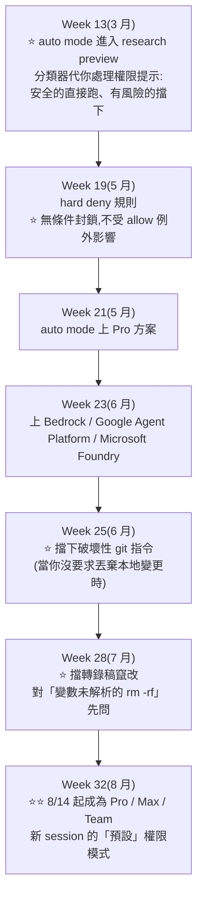
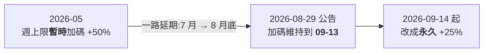
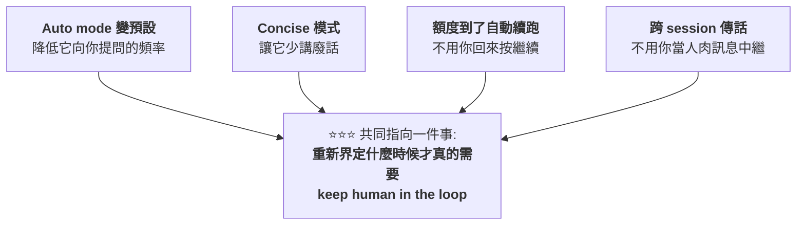

# Claude Code 2026 功能演進:從「權限提示」到「agent 艦隊」的半年軌跡

> 整理自 **Claude Code 官方 What's New**(週更摘要,涵蓋 **Week 13 / 2026-03-23 ~ Week 34 / 2026-08-21**,版本 v2.1.83 – v2.1.239)。
> **本文不是逐條轉錄,而是把半年的更新重新按主題歸類,並標出與本倉庫既有筆記的對應。**
>
> 2026-09-13 增補 **Gary Chen**〈[Claude Code 近期更新彙整,我好像又愛上 Claude Code 了](https://www.youtube.com/watch?v=dwGn39M5oX8)〉(2026-09-12,約 8.4 分鐘,官方 zh-TW 字幕),成為 **§八:Week 35–37 續篇** —— 七個沒開發表會的更新,含 **Auto mode 變預設背後那組很有說服力的對照數據**、跨 session 傳話的實際操作,以及 ⚠️ **週上限「+25% 永久」其實是相對現況 −17%** 的補正。

> 相關筆記:[[output-style-communication-not-intelligence]]、[[claude-dynamic-workflows]]、[[long-running-agents-goal-evaluation]]、[[claude-code-hooks-complete-guide]]、[[claude-md-cut-82-percent-and-maintain-it]]、[[continue-after-directory-move]]、[[claude-code-architecture-deep-dive]]

---

## 一句話總結

**把半年的更新排在一起看,一條主線非常清楚:Claude Code 正在從「一個會聽話的終端工具」變成「一個你要管理的 agent 艦隊」。**

⭐ 而權限模型的演變是這條線的縮影:**3 月引入 auto mode(分類器代你按核准)→ 8 月它成為 Pro / Max / Team 新 session 的預設。**

---

## 一、⭐ 最新一則:`/design`(Week 34,2026-08-17~21)

| 項目 | 內容 |
|---|---|
| **狀態** | **research preview** |
| **做什麼** | ⭐ **把 Claude Design 的 artboard 工作流帶進 CLI 與 Claude Code Desktop** |
| **建立在什麼上** | ⭐ **artifacts** |
| **流程** | **Claude 為你的 UI 起草「可編輯的 artboard」,你挑一個,它就把那個實作出來** |

⭐⭐ **這一項的意義不只是多一個指令** —— 它把「設計」與「實作」接在同一條 session 裡。以往是:在別的工具畫 → 描述給 Claude → 它猜你要什麼。現在是:**它畫幾個版本 → 你指一個 → 它照那個做。**

> 📎 對照 [[claude-design-review]] —— 那篇評測的是 Claude Design 這個獨立產品,**這裡是它被收進 Claude Code 的動作**。

**同週還有三項:**

| 功能 | 說明 |
|---|---|
| ⭐ **Concise 內建輸出風格** | **讓 Claude 先給結果、跳過開場白** |
| **Device card** | 任何跑著 `claude remote-control` 的機器,**會以裝置卡片出現在你手機上**,可從 Code 分頁直接在那台機器上開 session |
| **`ANTHROPIC_DEFAULT_MODEL`** | 設定新 session 預設從哪個模型開始 |

> ⭐ **Concise 這一項正好印證了 [[output-style-communication-not-intelligence]] 那篇的補正** —— 兩支談 output style 的影片都沒提到它,但它才是「治囉嗦」最直接的內建答案。

---

## 二、⭐⭐ 主線一:權限模型的半年演變

**這是全期最清楚的一條演進線,值得單獨拉出來看:**



⭐⭐ **這條線的定位講得很精準:auto mode 是「全部核准」與 `--dangerously-skip-permissions` 之間的中間地帶。**

⚠️ **而每一次補強都是針對一個具體的破壞面**:破壞性 git 指令、轉錄稿竄改、變數沒解析的 `rm -rf`。**這不是通用的安全論述,是一份實際踩過的清單。**

> 📎 對照 [[pi-minimal-agent-harness-teardown]] 的相反取捨(刻意不做權限系統)與 [[codex-as-a-platform-open-agent-harness]] 把審批做成協定原語 —— **三家對「該不該內建安全機制」給了三個不同答案。**

---

## 三、⭐⭐ 主線二:從「一個 session」到「一支艦隊」

**這條線的密度最高,幾乎每個月都有進展:**

| 週次 | 功能 | 意義 |
|---|---|---|
| **W20**(5 月) | ⭐ **Agent view(`claude agents`)** | **一個畫面看所有 session:什麼在跑、什麼卡在你身上、什麼做完了** |
| **W21** | 背景 session 出現在 `/resume`,釘選後保持存活 | |
| **W22**(5 月) | ⭐⭐ **Dynamic workflows** | **從 Claude 自己寫的腳本編排「數十到數百個」subagent** |
| **W24**(6 月) | ⭐ **Subagent 可以再生自己的 subagent** | **背景鏈上限五層深** |
| **W26** | 背景 subagent 的權限提示**改為浮到主 session**,不再自動拒絕 | |
| **W27**(7 月) | ⭐ **Subagent 預設在背景執行** | 讓 Claude 在它們跑的時候繼續工作 |
| **W28** | Agent view 每列顯示**帶顏色的狀態字** + **分類器寫的標題** | |
| **W29** | ⭐ **`/fork`** 把對話複製到新的背景 session,你繼續原本的工作 | |
| **W32**(8 月) | ⭐⭐ **跨 session 訊息傳遞**(macOS / Linux) | **session 之間可以互相傳話 —— Claude 把一個發現或決定從一個 session 傳到另一個,而不用你重講一遍** |
| **W33** | ⭐ **Fork mode 在互動 session 中預設開啟**;打 **`@`** 可以按名稱提及另一個 session | |

⭐⭐ **把 W32 的「跨 session 訊息」跟 W20 的「Agent view」放在一起,就是這條線的終點形狀:你不再是「跟一個 AI 對話」,而是「管一組正在各自工作的 agent」。**

> 📎 這正好呼應 [[graph-engineering-node-edge-state]] 講的「別把自己變成人肉 routing system」—— **而 W32 的跨 session 訊息,就是把 routing 從你手上拿走的一步。**
> 也對照 [[recursive-agent-harness-harness-recursion]]:W22 的 dynamic workflows 正是那篇論文說的「同一種 code-first 生成模式的生產版」。

---

## 四、主線三:讓長時間工作真的能跑完

| 週次 | 功能 |
|---|---|
| **W15**(4 月) | ⭐ **Monitor 工具** —— 把背景事件串進對話,讓 Claude 能 tail log 並即時反應;**`/loop` 在你省略間隔時會自我調節節奏** |
| **W20**(5 月) | ⭐⭐ **`/goal`** —— **讓 Claude 跨多輪持續工作,直到某個完成條件成立** |
| **W20** | Rewind 選單可用「Summarize up to here」**壓縮較早的上下文** |
| **W26**(6 月) | ⭐ **`/rewind` 可以從「`/clear` 執行之前」恢復對話** |
| **W33**(8 月) | **Desktop 上額度用完可自動續跑** —— 勾選後,額度重置時自動重試被中斷的那一輪 |

> 📎 `/goal` 對應 [[long-running-agents-goal-evaluation]];而「完成條件」正是 [[loop-engineering-when-and-how-gary-chen]] 講的 **Verifiable Goal**。

---

## 五、主線四:離開終端 —— 桌面、雲端、手機

| 週次 | 功能 |
|---|---|
| **W13–14**(3–4 月) | ⭐ **Computer use** 進入 research preview(先 Desktop 後 CLI)—— **Claude 可以開原生 app、點 UI、驗證改動**。定位很明確:**適合收尾那些「只有 GUI 才驗得了」的事** |
| **W16**(4 月) | ⭐ **Routines**(web)—— **從排程、GitHub 事件或 API 呼叫觸發模板化的雲端 agent**;**手機推播**;CLI 改為原生二進位檔 |
| **W17** | ⭐ **`/ultrareview`** 公開研究預覽 —— **一支在雲端跑的抓蟲 agent 艦隊**,結果自動回到你的 CLI 或 Desktop |
| **W25**(6 月) | ⭐⭐ **Artifacts** —— **把 session 的產出變成 claude.ai 上一個「會隨 session 進行而就地更新」的可分享頁面** |
| **W28**(7 月) | ⭐ **Desktop 內建瀏覽器** —— Claude 可以叫出文件、設計稿或任何網站並互動 |
| **W29** | ⭐⭐ **Artifacts 可以呼叫「觀看者自己的」MCP connector** —— 已發布的 artifact 能在別人打開時,透過那個人的 connector 拉即時資料、執行動作 |
| **W30**(7 月) | **Desktop 開 iOS 模擬器分頁**(公開測試)—— Claude 能跑你的 app 並點過去給你看 |
| **W32**(8 月) | ⭐ **自架環境** —— 在你組織自己的基礎設施上跑 Claude Code 雲端 session(Team / Enterprise 公開測試) |
| **W34**(8 月) | **Device card** —— 跑著 remote-control 的機器出現在手機上 |

⭐⭐ **W29 的 artifacts + 觀看者 MCP 是這條線裡最特別的一項** —— 它把「分享一個結果」變成「分享一個會用『對方的』資料源活起來的東西」。

---

## 六、⭐ 主線五:模型與成本

| 週次 | 內容 |
|---|---|
| **W16**(4 月) | **Opus 4.7** 成為 Max / Team Premium 預設;⭐ **新增 `xhigh` effort 等級,且被推薦為多數 coding 工作的設定**;`/effort` 互動滑桿;**`/usage` 顯示什麼在吃額度** |
| **W21**(5 月) | ⭐ **`/usage` 細分到 skill、subagent、plugin、MCP server 層級** |
| **W22**(5 月) | **Opus 4.8** 成為 Max / Team Premium / Enterprise 隨用隨付 / API 預設,**預設 high effort**,`/effort xhigh` 給最難的任務;**fast mode $10/$50 per MTok** |
| **W24**(6 月) | ⭐ **`fallbackModel`** —— 可設定最多三個依序嘗試的後備模型 |
| **W27**(7 月) | **Sonnet 5** 成為 Pro / Team Standard / Enterprise 訂閱席次預設 —— **原生 1M token 上下文、adaptive thinking 預設開啟** |
| **W30**(7 月) | ⭐ **Opus 5** 成為 Claude Code 預設 Opus,**1M token 上下文**,fast mode **$10/$50 per MTok** |
| **W34**(8 月) | **`ANTHROPIC_DEFAULT_MODEL`** |

> ⭐ **`/usage` 從「顯示額度」進化到「細分到 skill / subagent / plugin / MCP server」,是很值得注意的一步** —— 它承認了一件事:**當你裝了一堆東西之後,你其實不知道錢花在哪。**
> 📎 這跟 [[token-saving-three-moves-context-control]] 講的「每個 MCP 的說明都被打包進 context」是同一個問題的兩面 —— 一個講成因,一個給了量測工具。

---

## 七、其他值得記的單項

| 週次 | 功能 | 為什麼值得記 |
|---|---|---|
| **W18**(4–5 月) | ⭐⭐ **Windows 不再需要 Git Bash** —— Bash 不存在時 Claude Code **改用 PowerShell 當 shell 工具** | 這對 Windows 使用者是結構性改變 |
| **W18** | `claude project purge` 清理專案的本機狀態;把 **PR URL 貼進 `/resume`** 會找到建立它的那個 session | |
| **W19**(5 月) | ⭐ **Plugin 可從 `.zip` 與 URL 載入**(`--plugin-dir` 吃 zip、`--plugin-url` 抓封存檔);**hook 可以看到當前 effort 等級**(`effort.level` / `$CLAUDE_EFFORT`) | 📎 hook 那條可補進 [[claude-code-hooks-complete-guide]] |
| **W24**(6 月) | ⭐ **`/cd`** —— **在對話中途換工作目錄,而且不會重建 prompt 快取** | 📎 正是 [[continue-after-directory-move]] 的官方解法 |
| **W24** | **`--safe-mode`** 停用所有自訂設定以排查問題 | |
| **W25** | ⭐ **deny / ask 規則可以比對工具參數** —— `Tool(param:value)`,例如 `Agent(model:opus)`;**`/config key=value`** 可從 prompt、`-p` 模式與 Remote Control 設定任何設定 | |
| **W26** | ⭐ **`claude mcp login` / `logout`** —— 從 shell 認證 MCP server,不用進互動選單;**shell 模式會對指令輸出作出回應**(`! npm test` 不用再問第二次就給解釋) | |
| **W28**(7 月) | ⭐ **`/doctor`(別名 `/checkup`)** —— 完整的環境檢查,**能診斷也能修** | 📎 [[claude-md-cut-82-percent-and-maintain-it]] 提過 |
| **W29** | ⭐ **Screen reader 模式** —— 用純線性文字取代視覺化終端介面,支援 VoiceOver / NVDA | 無障礙 |
| **W30**(7 月) | ⭐ **Claude Security plugin** —— 對程式庫做**多 agent 漏洞掃描**,把你挑中的發現變成**你自己套用**的修補;**`/code-review` 改為背景 subagent** | ⚠️ 注意「你自己套用」這個設計 |
| **W17**(4 月) | **Session recap** —— 終端沒被聚焦時發生了什麼;**自訂主題** | |
| **W14**(4 月) | **`/powerup` 互動課程**;每工具的 MCP 結果大小上限可覆寫到 **500K**;plugin 執行檔進 Bash 工具的 `PATH` | |
| **W15**(4 月) | ⭐ **Ultraplan 早期預覽** —— 從 CLI 在雲端草擬計畫、在網頁編輯器審閱評論,再遠端執行或拉回本機;**`/team-onboarding`** 把你的設定打包成可重播的指南 | |
| **W13**(3 月) | **轉錄稿搜尋(`/`)**;**Windows 原生 PowerShell 工具**;⭐ **條件式 `if` hook** | 📎 hook 那條可補進 hooks 筆記 |

---

## 應用案例

### 案例 1|⭐⭐ 從權限模型的演變讀出一條產品哲學

把 auto mode 半年的軌跡排開,會看到一個很清楚的模式:

```
① 先做成 research preview(3 月)—— 不預設開啟
② 逐步補「具體破壞面」的防護
   破壞性 git → 轉錄稿竄改 → 未解析變數的 rm -rf
③ 逐步擴大方案覆蓋(Pro → 第三方雲)
④ ⭐ 五個月後才變成預設(8/14)
```

⭐ **值得學的是第 ② 步的性質**:每一條防護都對應一個**具體的、可命名的破壞方式**,而不是抽象的「安全性提升」。**這代表它們是從實際事故裡長出來的。**

⚠️ **而「五個月才變預設」也是個訊號** —— 把預設從「每次問」改成「分類器決定」,是把風險從使用者身上移到系統身上,這種改動應該慢。

### 案例 2|⭐ 用這條時間軸檢查自己的用法有沒有過時

半年裡有好幾個功能取代了原本要繞路的做法:

| 你如果還在… | 現在有 |
|---|---|
| 為了換目錄而重開 session | ⭐ **`/cd`**(不重建 prompt 快取) |
| `/clear` 之後才想起有東西要用 | ⭐ **`/rewind` 可以回到 `/clear` 之前** |
| 手動開好幾個終端管平行工作 | ⭐ **`claude agents` + 背景 subagent + 跨 session 訊息** |
| 自己寫腳本編排多個 agent | ⭐ **Dynamic workflows** |
| 用 `--dangerously-skip-permissions` 圖方便 | ⚠️ **auto mode** —— 現在已是預設 |
| 抱怨回覆太囉嗦、自己寫 output style | ⭐ **內建 `Concise`** |
| 在別的工具畫 UI 再描述給 Claude | ⭐ **`/design`** |

### 案例 3|⚠️ 注意兩個「刻意不自動」的設計

在一片自動化裡,有兩處官方刻意留了手動:

1. ⭐ **Claude Security plugin 的修補是「你自己套用」** —— 它掃描、它產生修補,**但不替你套用**
2. ⭐ **`/design` 是「它畫幾個、你挑一個」** —— 不是它直接決定

⭐ **共同點:在「有品味成分」或「有安全成分」的決策點上,把最後一步留給人。** 📎 這跟 [[graph-engineering-node-edge-state]] 講的「human approval 處理的是價值判斷而非邏輯判斷」是同一條原則。

### 案例 4|⭐ Artifacts + 觀看者 MCP:一個值得想清楚的能力

W29 那項的含意比表面大:

```
傳統分享:我把結果匯出成一份靜態文件給你
Artifacts:我分享一個頁面,它在我的 session 進行時就地更新
⭐ W29:我分享的頁面,會用「你自己的」MCP connector 拉即時資料、執行動作
```

⚠️ **第三層要特別小心**:那個頁面在別人的環境裡、用別人的憑證做事。**分享之前要想清楚頁面裡的程式碼會做什麼** —— 這跟 [[pi-minimal-agent-harness-teardown]] 提到的「裝第三方 extension 等於執行別人的程式碼」是同一類風險,只是方向相反(這次是你把東西送出去)。

---

---

## 八、⭐⭐⭐ Week 35–37 續篇:七個沒開發表會的更新(2026-09-13 增補,來源:Gary Chen)

§一到§七 的時間軸停在 **Week 34(2026-08-21)**。這一節把 **8 月下旬到 9 月中**這一波更新接上 ——
**全部藏在每週更新日誌裡,沒有發表會。**

> ⚠️ **立場揭露:** 作者在說明欄推廣自己的 Patreon(完整文章與提示詞模板)。
> **本節只整理其公開影片內容與官方可查證的部分,不轉述付費素材。**

⭐ **而這一節有一個貫穿全部七項的主軸,作者講得很直白:**

> **「Claude Code 這一波更新,非常明顯就是瞄準了 Codex 的強項在用力補洞。」**

### 8.1 ⭐⭐⭐ session 之間可以互相傳話了(跨 session 訊息)

**這是 §三「從一個 session 到一支艦隊」那條主線最實質的一塊拼圖。**

| 以前 | 現在 |
|---|---|
| 開兩個視窗(一個寫前端、一個寫後端),**狀態完全獨立** | 直接跟前端 session 說「**去通知後端 session,欄位已經改名了**」 |
| 前端改了欄位名,**你得自己切過去手動再講一次** | ⭐ **它自動把訊息傳過去** |

**操作方式:**

| 指令 / 工具 | 用途 |
|---|---|
| **`/list-agents`**(亦可用 `/peers`) | 看目前有哪些 session 在線上 |
| **`SendMessage`** | 新增的內部工具,專門傳遞訊息 |
| **`@` + session 名稱** | 在 prompt 裡精準點名要跟誰講話 |
| ⭐ **`/rename`** | 早就推出的功能,**同時開很多 session 時特別好用**(先把名字改成看得懂的) |

> ⭐⭐ **兩個設計細節值得記:**
> ① **為了保護 context window,傳的不是完整對話紀錄,而是自動整理出的一段簡短精要訊息**,只告訴對方需要知道的事。
> ② **有時候不用你開口** —— 它自己判斷這個改動會影響其他 session,就會主動同步過去。

📎 **這正好補上 §三 的缺口:§三 講的是「怎麼開出一支艦隊」,這裡講的是「艦隊成員之間怎麼對話」。**

⚠️ **影片沒提、但查證官方文件後值得補上的三點:**

| 項目 | 官方說明 |
|---|---|
| **最低版本** | **v2.1.224 以上** |
| ⚠️⚠️ **平台限制** | **沒有原生 Windows 支援**;Bedrock / AWS / Google Cloud Agent Platform / Microsoft Foundry 亦不支援 |
| ⭐ **你不會自己呼叫這兩個工具** | 你只是告訴 Claude「對方該知道什麼」,**由 Claude 自己寫訊息、自己挑目標**;訊息**永遠是文字,不是對話歷史、也不是檔案** |

### 8.2 ⚠️⚠️ 週上限額度:一個被包裝成「增加」的縮減

**這是本節最需要看清楚的一項,也是影片與外電解讀有落差的地方。**



| 說法 | 內容 |
|---|---|
| **影片的說法** | 「加碼幅度縮水了,但也正式成為常態」 |
| ⚠️⚠️ **外電算出的淨效果** | **以 +50% 時的 150 單位為基準,09-14 之後降到 125 —— 相對現況是 17% 的縮減** |

> ⭐ **補正:官方公告以「永久增加 25%」為標題,但相對於使用者當下實際擁有的額度是**淨減少**。**
> **多家外電與社群都點名了這個表述方式;Anthropic 員工亦承認「訊息本可以更清楚,應該先講變動」。**

📌 **一個容易搞混的重點(影片講對了):這次調整的只有「每週上限」,「每 5 小時上限」維持不變。**

**⭐ 附帶的小確幸:撞到 5 小時上限會自動續跑**

| 介面 | 行為 |
|---|---|
| **Desktop** | 跳出勾選框,勾起來 ⇒ **額度一重置就自動接著跑** |
| **CLI** | ⭐ **8 月中之後的版本預設就會自動續跑**(不需要的話去 config 關掉) |

> ⚠️ **只對 5 小時上限有效。撞到週上限代表額度用光,不會自動續。**

### 8.3 ⭐⭐ 內建瀏覽器(Desktop)—— 最明顯的「照著 Codex 補洞」

| 項目 | 內容 |
|---|---|
| **能做什麼** | 自己開網頁看套件官方文件、看 Figma 設計稿、看後台數據儀表板;**自己閱讀頁面、自己點連結** |
| ⭐ **資安設計** | **跑在沙盒環境、使用獨立 Profile**,**不會碰到你個人瀏覽器裡登入的帳號** |
| **可控性** | 可自由設定要不要保留登入狀態;**隨時可在設定裡整個關閉,或一鍵清空 session 資料** |

⭐⭐ **作者對這件事的產業判讀值得單獨記:**

> **「既然別人已經證明了使用者就是需要這個功能,那直接照做就能成功留住一群用戶 ——
> 對 Claude Code 團隊來說,根本就是一個現成的免費優化項目。我認為這是非常聰明且務實的做法。」**

📎 **對照本庫 [[chatgpt-browser-extension-agent]] 的安全討論:那篇記的是「擴充功能沿用你已登入的 Profile」的風險;
這裡 Claude 走的是相反路線 —— 獨立 Profile + 沙盒。⭐ 兩種取捨各有代價:沿用 Profile 方便但風險大,獨立 Profile 安全但要重新登入。**

### 8.4 iOS 模擬器(Desktop,公開 Beta)

| 項目 | 內容 |
|---|---|
| **做什麼** | 自動 build App、啟動模擬器,**模擬器直接出現在對話視窗旁邊** |
| ⭐ **價值** | 你看著它**自動在畫面上點擊、一頁一頁驗證它剛寫的 code 對不對**;隨時可以接手自己操作 |
| **前提** | **Mac + 已安裝 Xcode** |
| **方案** | Pro / Max / Team 皆可用(公開 Beta) |

> ⭐ **這是 §四「讓長時間工作真的能跑完」的延伸:把「開發 → 測試」的 loop 收進同一個畫面。**

### 8.5 ⭐⭐⭐ Auto mode 變成預設 —— 而且有一組很有說服力的數據

**2026-08-14 起,Pro / Max / Team 用戶新開的 session 預設跑在 Auto mode。**
**(已自訂權限模式或公司管理員設定過的,不會被強制覆蓋;隨時可手動切回。)**

⭐ **一個很佛心的細節:Auto mode 背後那個判斷動作安不安全的分類器,它的 API 呼叫不算在你的使用量裡。**

#### ⭐⭐⭐ 為什麼要改預設:因為人會累,機器不會

**Anthropic 找了 1,000 多位付費開發者做對照測試:**

| 組別 | 危險指令攔截率 |
|---|---|
| ⚠️ **人類手動按同意** | **只攔下 13.6%** |
| ⭐ **交給 Auto mode** | **擋下 89%** |

> ⚠️⚠️ **原因講白了就是懶:**
> **「session 越拉越長,人的注意力就會開始渙散。通常坐在電腦前兩三個小時之後,
> 基本上看到什麼視窗跳出來,大腦都會無腦按同意。但機器是不會累的。」**

**正式環境的數據也印證:**

| 組別 | session 中出現有害動作的比例 |
|---|---|
| 需要人工核准 | **6.3%** |
| ⭐ **Auto mode** | **2.4%** |

#### 外部驗證(兩家獨立機構)

| 機構 | 測試內容 | 結果 |
|---|---|---|
| **Apollo Research** | 兩週試點,**把合成攻擊注入真實的 coding trajectory** | ⭐ **分類器漏抓率從 12% 降到 7%** |
| **Trajectory Labs** | **Prompt Injection 攻擊測試**(刻意在網頁或檔案裡暗藏惡意指令) | ⭐⭐ **720 次攻擊全數被擋,成功率 0** |

📌 **生產力面:官方統計使用 Auto mode 的開發者,發 PR 的數量平均多約 25%** ——
**原因不難想像:被打斷的次數降低,可以一口氣跑完更長的任務。**

> 📎 **這一項讓 §二「權限模型的半年演變」有了完整的閉環:**
> **§二 記的是「3 月引入 auto mode → 8 月成為預設」這個事實,
> 這裡補上了「為什麼」—— 而理由不是「模型變強了」,是「⭐⭐ 人類這一關本來就不可靠」。**

⭐ **本節最值得帶走的一句話:這組數據推翻了一個很多人的直覺 ——
「人工核准 = 比較安全」。實際上長 session 裡的人工核准,安全性只有分類器的六分之一不到。**

### 8.6 Concise 模式

| 項目 | 內容 |
|---|---|
| **上線** | 2026-08-19 |
| **怎麼開** | `/config` → Output style 切成 **Concise** |
| ⚠️ **注意** | **設定完要開新 session 才生效** |
| **效果** | **直球對決:先給最終結果,不鋪陳,也不囉唆解釋剛剛做了什麼**;想知道細節再另外問 |

📎 對照 [[output-style-communication-not-intelligence]] —— **那篇講的是「輸出風格治的是它怎麼跟你講話」,Concise 就是官方版的答案。**

### 8.7 `/design` 指令的續篇

**§一 記的是 `/design` 剛出現(Week 34)。這裡補上實際用起來是什麼樣子:**

> **給一段需求敘述 ⇒ 直接產出一整面可互動編輯的 UI 畫板 ⇒
> 生成好幾個不同版本並排 ⇒ 挑一張順眼的、哪裡想微調就直接在上面點 ⇒
> 全部滿意後一鍵轉成程式碼。**

| 項目 | 內容 |
|---|---|
| **版本需求** | **v2.1.234 以上** |
| **可用介面** | ⭐ **CLI 與 Desktop 都能用** |
| **類似物** | 作者說跟 **Matt Pocock 的 prototype skill** 有異曲同工之妙 |

> ⭐ **一句話總結它的意義:「以前為了產 UI 要另外開一個工具,現在直接內建進 Claude Code 了。」**

### 8.8 ⭐⭐ 作者的工具分工:一個沒有平台信仰的實話

> **「大概一兩個月前,我的開發主力就轉向了 Codex —— 平常大概 70% 的時間用 Codex、30% 用 Claude。
> 因為 Codex 在整體產品體驗上真的做得太細緻了,有很多不起眼的小細節,用起來是真的順手。」**

⭐ **但他對這波更新的結論是正面的:**

> **「兩家頂尖的 AI 工具互相借鑑對方的優點,對我們這些使用者來說絕對是件好事。
> 至於今天要開哪個工具?完全取決於你當下的任務需求,不需要有什麼平台信仰。」**

### 8.9 ⭐ 把七項串起來看:一條很清楚的產品意圖



> ⭐⭐⭐ **作者的原話:「Anthropic 正在努力讓這個工具學習,什麼時候才真的需要 keep human in the loop。」**
>
> 📎 **這與 §二 結尾那條產品哲學完全一致,只是從「權限」一項擴大到了四項:
> 每一項都在減少「人類必須在場」的時刻,而 §8.5 的數據說明了為什麼這樣做反而更安全。**

### 8.10 應用案例

#### 案例 1|⭐⭐ 用跨 session 傳話重構「前後端分開開發」的流程

| 以前的做法 | ⭐ 現在的做法 |
|---|---|
| 開兩個 session,自己當人肉訊息中繼 | 先 **`/rename`** 把兩個 session 改成 `frontend` / `backend` |
| 改了介面就要記得去另一邊講一次(**很容易忘**) | 改完直接說「**通知 backend:`username` 欄位已改名為 `displayName`**」 |
| 忘記同步 ⇒ 兩邊實作對不上 | ⭐ 它有時**還會主動同步**(自行判斷影響範圍) |

⚠️ **但先確認三件事:版本 ≥ v2.1.224、不是 Windows、不是跑在 Bedrock / Vertex 那類雲端平台上。**

#### 案例 2|⭐⭐⭐ 重新評估「我堅持手動核准是不是真的比較安全」

📌 **這是本節最該拿去挑戰自己既有習慣的一項。**

**如果你屬於「我就是不開 Auto mode,我要每一條都自己看」那一派,先誠實回答三個問題:**

| 問題 | 對照數據 |
|---|---|
| 連續工作兩三小時後,你還真的在讀每個彈窗嗎? | **人類組只攔下 13.6%** |
| 你上次仔細讀完一個核准彈窗是什麼時候? | **Auto mode 攔下 89%** |
| 你的 session 有沒有出現過「事後才發現它做了什麼」? | 人工核准組 **6.3%** 出現有害動作 vs Auto mode **2.4%** |

> ⭐ **合理的折衷:開 Auto mode(讓分類器擋掉大宗),把人類的注意力留給真正不可逆的操作** ——
> 這也呼應 §三 的「刻意不自動」設計與 [[claude-code-hooks-complete-guide]] 的 hook 防線。
> **⚠️ 分類器仍有 7% 漏抓率,所以「不可逆操作的保護」還是要靠 hook,不能只靠 Auto mode。**

#### 案例 3|⭐ 9 月 14 日之後重新盤點你的額度

⚠️ **如果你的用量本來就貼著週上限跑,09-14 之後實際可用額度會比 09-13 之前少約 17%。**
**建議動作:**① 在 09-13 前記錄一次自己的週用量基準 ② 09-14 後對照,看是否需要調整工作分配
(例如把重活挪到 Codex,或改用 [[token-saving-three-moves-context-control]] 的省 token 三招)。

### 8.11 核實狀態

#### ✅ 已核實(對 Claude Code 官方部落格、官方文件與多家外電逐項比對)

| 影片說法 | 核實結果 |
|---|---|
| **跨 session 訊息:`SendMessage` 與 `ListAgents` 工具、`/list-agents` 指令** | **屬實**;⭐ **官方文件補充:亦可用 `/peers`,需 v2.1.224 以上,且無原生 Windows 支援、Bedrock/Vertex/Foundry 不支援**(影片未提) |
| **訊息是精簡摘要而非完整對話紀錄** | **屬實**,官方明確說明「訊息是一段文字,永遠不是對話歷史、也不是檔案」 |
| **Auto mode 自 2026-08-14 成為 Pro/Max/Team 新 session 預設** | **屬實** |
| **1,000 多位付費測試者:人類攔 13.6%、Auto mode 攔 89%** | **屬實**(官方數字為 **1,053 位**付費測試者) |
| **正式環境:人工核准組 6.3% vs Auto mode 2.4% 出現有害動作** | **屬實** |
| **Apollo Research 兩週試點,分類器漏抓率 12% → 7%** | **屬實**(Apollo Research 為英國 AI 安全新創) |
| **Trajectory Labs:720 次 prompt injection 攻擊全數擋下** | **屬實**;⭐ **官方補充:為 72 個間接注入情境、測試基準為 2026-07-17 當時的 Claude Code 與 Codex 公開版本** |
| **使用 Auto mode 的開發者發 PR 數量平均多約 25%** | **屬實** |
| **分類器的 API 呼叫不計入使用量** | **屬實** |
| **週上限 +50% 加碼維持到 09-13,09-14 起改為永久 +25%;5 小時上限不變** | **屬實** |

#### ⚠️ 需要補正 / 影片未點破的一點

- ⚠️⚠️ **「加碼幅度縮水」的實際幅度**:影片只說縮水,**外電算出的淨效果是相對現況 **−17%**(150 → 125 單位)。
  ⭐ **官方以「永久增加 25%」為標題,是相對於「原始基準」而非「使用者當下實際持有的額度」** ——
  多家媒體與社群點名此一表述;**Anthropic 員工亦承認訊息本可更清楚。**

#### ⚠️ 未能獨立查證(以影片轉述看待)

- **內建瀏覽器的沙盒與獨立 Profile 細節、可保留登入狀態、一鍵清空 session 資料** ——
  方向與 Anthropic 一貫做法一致,**但本文未能定位到逐項說明的官方文件。**
- **iOS 模擬器為公開 Beta、需 Xcode、Pro/Max/Team 可用** —— **未查得官方公告原文。**
- **Concise 模式上線日 2026-08-19、需開新 session 才生效** —— **未查得官方公告原文。**
- **`/design` 需 v2.1.234 以上** —— **未逐項核對版本日誌。**
- **作者「70% Codex / 30% Claude」的個人分工** —— **屬個人使用習慣,無需查證。**


## 重點回顧(TL;DR)

1. ⭐⭐ **半年主線:Claude Code 從「會聽話的終端工具」變成「你要管理的 agent 艦隊」。**
2. **最新(Week 34,8/17–21):`/design` research preview** —— **把 Claude Design 的 artboard 工作流帶進 CLI 與 Desktop,建立在 artifacts 上;Claude 起草可編輯 artboard,你挑一個它就實作。** 同週另有 **Concise 輸出風格**、**device card**(remote-control 機器出現在手機上)、**`ANTHROPIC_DEFAULT_MODEL`**。
3. ⭐⭐ **權限模型是全期最清楚的演進線**:3 月 auto mode 進 research preview(**定位是「全部核准」與 `--dangerously-skip-permissions` 之間的中間地帶**)→ 逐步補防護(**hard deny 無條件封鎖、擋破壞性 git、擋轉錄稿竄改、對未解析變數的 `rm -rf` 先問**)→ 擴大到 Pro 與三家雲 → **8/14 起成為 Pro/Max/Team 新 session 的預設**。⭐ **每條防護都對應一個具體可命名的破壞方式,不是抽象的安全論述。**
4. ⭐⭐ **艦隊化那條線**:`claude agents` 一畫面看全部 → **dynamic workflows 編排數十到數百個 subagent** → **subagent 可再生 subagent(上限五層)** → subagent 預設背景執行 → `/fork` → ⭐ **跨 session 訊息傳遞(Claude 把發現從一個 session 傳到另一個,不用你重講)** → fork mode 預設開啟、`@` 提及其他 session。
5. **長時間工作**:**Monitor**(串背景事件、能 tail log 即時反應)、**`/goal`**(跨輪持續工作直到完成條件成立)、**「Summarize up to here」壓縮早期上下文**、⭐ **`/rewind` 能回到 `/clear` 之前**、Desktop 額度重置後自動續跑。
6. **離開終端**:**computer use**(定位是「收尾那些只有 GUI 才驗得了的事」)、**Routines**(排程/GitHub 事件/API 觸發雲端 agent)、**`/ultrareview`**(雲端抓蟲 agent 艦隊)、**Artifacts**(會就地更新的可分享頁面)、Desktop 內建瀏覽器與 iOS 模擬器、**自架環境**。
7. ⭐⭐ **W29 的 Artifacts + 觀看者 MCP 最特別**:已發布的 artifact 能在別人打開時,**透過「那個人的」connector 拉即時資料、執行動作**。⚠️ 分享前要想清楚頁面裡的程式碼會做什麼。
8. **模型線**:Opus 4.7(**新增 `xhigh` 且被推薦為多數 coding 工作的設定**)→ Opus 4.8(**預設 high effort**)→ Sonnet 5(**原生 1M 上下文、adaptive thinking 預設開**)→ **Opus 5(1M 上下文、fast mode $10/$50 per MTok)**;另有 **`fallbackModel`(最多三個依序嘗試)**。
9. ⭐ **`/usage` 從「顯示額度」進化到「細分到 skill / subagent / plugin / MCP server」** —— 等於承認「裝了一堆東西之後你不知道錢花在哪」。
10. ⭐⭐ **Windows 不再需要 Git Bash** —— Bash 不存在時改用 **PowerShell** 當 shell 工具。
11. **其他實用單項**:⭐ **`/cd`(中途換目錄且不重建 prompt 快取)**、`--safe-mode`、⭐ **deny/ask 規則可比對工具參數 `Tool(param:value)`**、`/config key=value`、⭐ **`claude mcp login`/`logout`**、shell 模式會對指令輸出直接回應、⭐ **`/doctor`(別名 `/checkup`,能診斷也能修)**、**screen reader 模式**、plugin 可從 `.zip` 與 URL 載入、**hook 看得到 effort 等級**、**條件式 `if` hook**、MCP 結果大小可覆寫到 500K。
12. ⭐⭐⭐ **§八(Week 35–37)補上七項**:跨 session 傳話(`/list-agents`、`SendMessage`、`@名稱`,⚠️ 需 v2.1.224+、**無原生 Windows 支援**)、⚠️ **週上限「永久 +25%」實為相對現況 −17%**(5 小時上限不變、且撞到會自動續跑)、Desktop 內建瀏覽器(**沙盒 + 獨立 Profile**)、iOS 模擬器、**Auto mode 變預設**、Concise 模式、`/design` 實際用法。⭐⭐ **Auto mode 的數據最值得記:人類手動核准只攔下 13.6% 的危險指令,分類器攔下 89%** —— 理由不是模型變強,是**人會累、機器不會**。
13. ⭐ **兩個刻意不自動的設計值得注意**:**Claude Security plugin 產生修補但「你自己套用」**;**`/design` 是「它畫幾個、你挑一個」**。⭐ **共同原則:在有品味或有安全成分的決策點,把最後一步留給人。**

---

## 來源

- [What's new — Claude Code Docs](https://code.claude.com/docs/en/whats-new)(週更摘要;本文涵蓋 **Week 13 / 2026-03-23 至 Week 34 / 2026-08-21**,版本 v2.1.83 – v2.1.239)
- 官方另有逐條的 [changelog](https://code.claude.com/docs/en/changelog) 記錄每個 bug fix 與小改進
- ⭐ [Claude Code 近期更新彙整,我好像又愛上 Claude Code 了 — Gary Chen](https://www.youtube.com/watch?v=dwGn39M5oX8)(2026-09-12,約 8.4 分鐘,官方 zh-TW 字幕;**§八來源**。⚠️ 作者推廣自有 Patreon)
- §八的核實來源:
  - ⭐⭐ [Auto mode is now the default in Claude Code for Pro, Max, and Team plans — Anthropic 官方部落格](https://claude.com/blog/auto-mode-default-in-claude-code)(13.6% / 89% / 6.3% / 2.4% / Apollo Research / Trajectory Labs / +25% PR 皆出自此)
  - ⭐⭐ [Message your other Claude Code sessions — Claude Code Docs](https://code.claude.com/docs/en/cross-session-messaging)(`/peers` 別名、v2.1.224、無原生 Windows 支援)
  - [Anthropic is cutting Claude Code's current weekly limits by 17% — BleepingComputer](https://www.bleepingcomputer.com/news/artificial-intelligence/anthropic-is-cutting-claude-codes-current-weekly-limits-by-17-percent/)(§8.2 的補正依據)
  - [Claude Code Auto Mode Blocks 89% of Dangerous Commands and Prompt Injection Attacks — GBHackers](https://gbhackers.com/claude-code-auto-mode-blocks-attacks/)
- 本倉庫相關筆記:[[output-style-communication-not-intelligence]]、[[claude-dynamic-workflows]]、[[long-running-agents-goal-evaluation]]、[[claude-code-hooks-complete-guide]]、[[claude-md-cut-82-percent-and-maintain-it]]、[[continue-after-directory-move]]、[[claude-code-architecture-deep-dive]]、[[claude-design-review]]、[[graph-engineering-node-edge-state]]、[[token-saving-three-moves-context-control]]、[[loop-engineering-when-and-how-gary-chen]]、[[pi-minimal-agent-harness-teardown]]、[[chatgpt-browser-extension-agent]]、[[codex-as-a-platform-open-agent-harness]]

> ⚠️ **Claude Code 迭代極快(半年跨了 v2.1.83 → v2.1.239)**,本文是特定時點的快照。功能可能已改名、改預設值或移除(例如 `/output-style` 就在 v2.1.73 棄用、v2.1.91 移除)。**實際可用項目請以你當下版本的 `/help` 與官方文件為準。**
