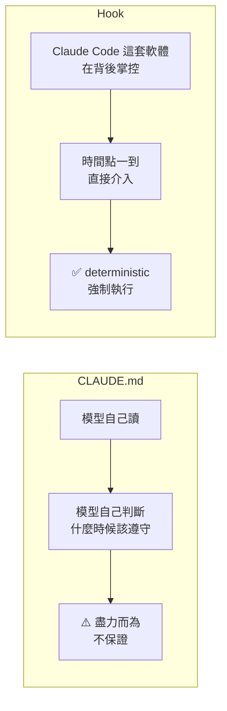
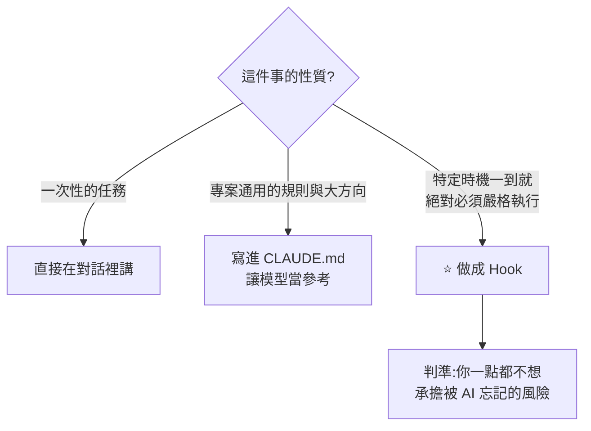
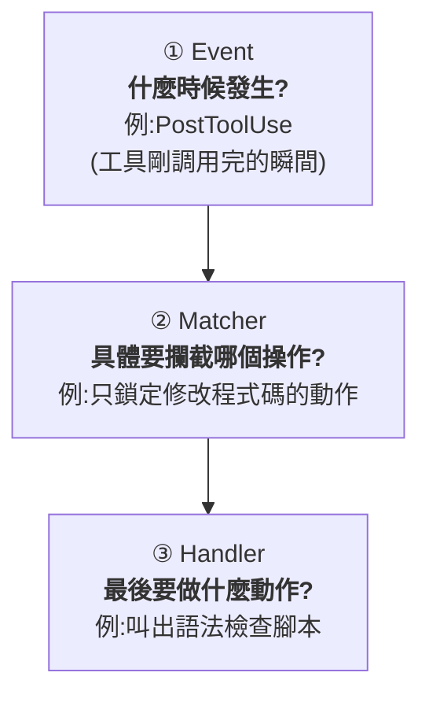
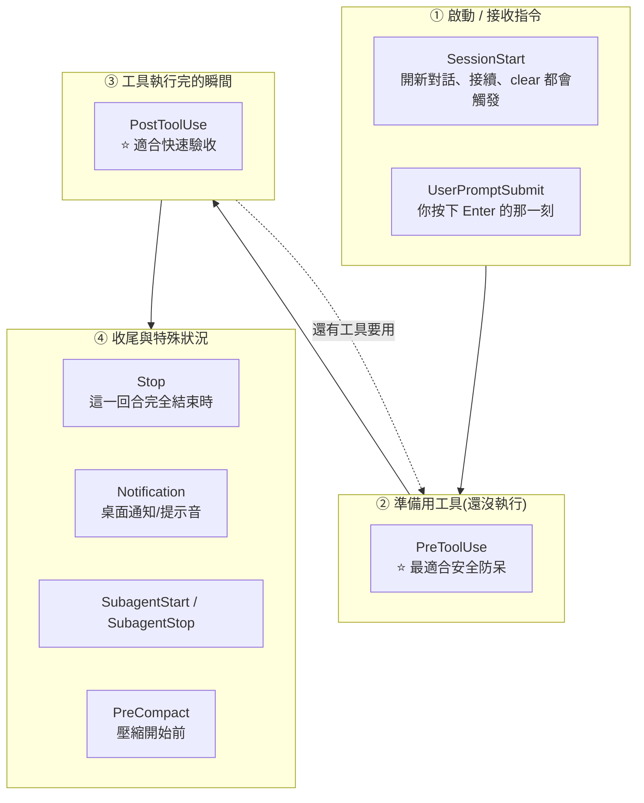
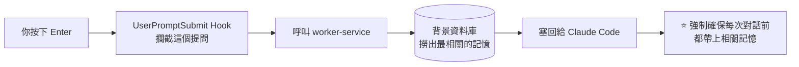
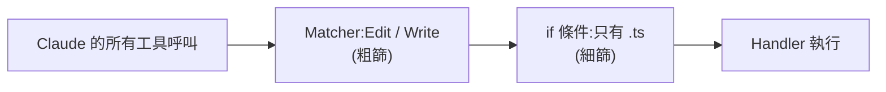
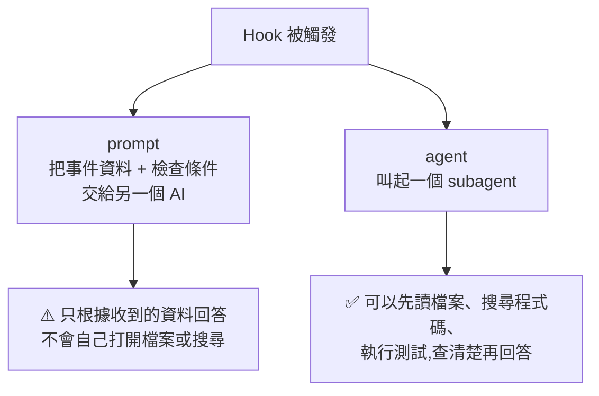
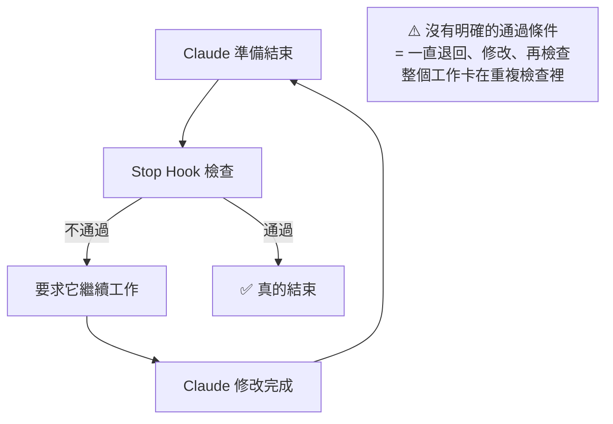
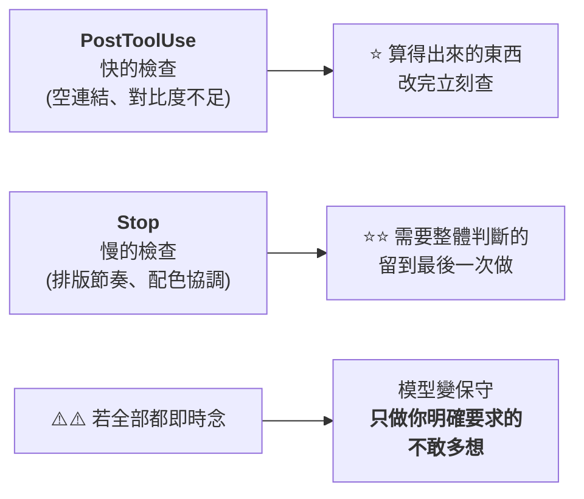
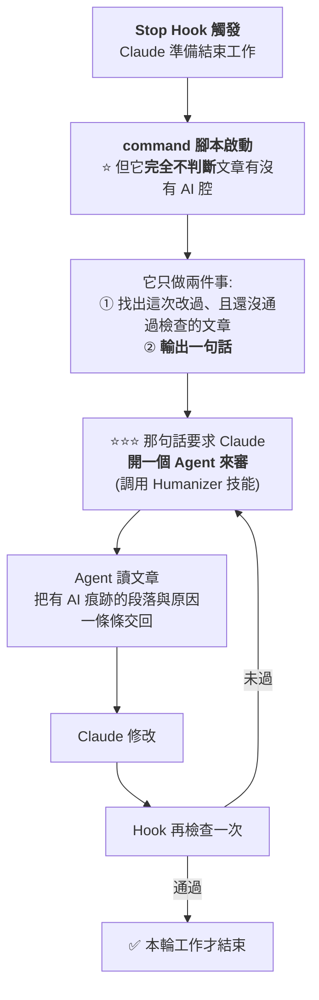

# Claude Code Hooks 完全指南:CLAUDE.md 是提醒紙條,Hook 才是自動門

> 整理自 YouTube 頻道 **Gary Chen**〈Mastering Claude Code Hooks: A Complete Guide to Essential Settings〉(2026-08,約 20 分鐘,官方繁中字幕)。
> 文中另**對照 Claude Code 官方 hooks 文件核實**事件與 handler 清單,標出與影片說法的差異。
>
> ⭐ **2026-09-16 增補 YAHA學堂**〈[官方隐藏的31个高阶玩法:Claude Code Hooks 自动化实战](https://www.youtube.com/watch?v=Y2yElMkwH_A)〉(2026-09-15,約 23.1 分鐘,無字幕以 faster-whisper 轉錄),成為 **§10** —— **嘮叨成本、Stop Hook 的官方保險、以及「讓不會判斷的腳本指揮 Agent」**。⭐⭐ **本節已 clone Superpowers 原始碼實測,抓到影片一處近一倍的數字誤差。**

> 📎 這是 [[claude-md-from-zero-to-mastery]] 與 [[claude-md-cut-82-percent-and-maintain-it]] 的**下一步**:那兩篇教你怎麼寫好 CLAUDE.md,**這篇教你什麼時候不該再靠 CLAUDE.md**。
> 其他相關:[[output-style-communication-not-intelligence]]、[[agent-skill-three-layer-run-do-verify]]、[[cross-model-review-claude-codex-harness]]

---

## 一句話總結

**CLAUDE.md 提供指示,Claude 會盡力遵守,卻不保證每次照做;Hook 是由軟體在背後掌控的強制機制 —— 時間點一到就直接介入,不靠模型判斷要不要做。**

---

## 一、為什麼需要 Hook

明明 CLAUDE.md 裡寫了「改完程式一定要跑測試」、「執行危險 git 指令前一定要先停下來」,Claude 卻還是常常忘記。

> **因為 CLAUDE.md 就像是給 AI 的一張提醒紙條。**

影片用了一個很好的比喻:

> **Hook 就像便利商店的自動門** —— 背後有一套非常死板、絕對會執行的規則:只要有人走到感應區,門就立刻打開,**完全沒有商量的空間**。



### ⭐ 三者的選擇框架



> 對照 [[agent-skill-three-layer-run-do-verify]] 的結論:**CLAUDE.md 是「上下文」,Hook 才是「強制配置」。** 安全邊界與不可逆操作的保護要靠後者。

---

## 二、三層架構:Event / Matcher / Handler

Hook 設定檔就是 JSON,通常放在專案的 `.claude/settings.json`。**不需要死背,搞懂三層就好。**



以「檢查程式碼有沒有語法錯誤」為例:

| 層 | 設定 | 意思 |
|---|---|---|
| **Event** | `PostToolUse` | 在 Claude 剛調用完工具的瞬間啟動 |
| **Matcher** | `Edit`、`Write` | Claude 會調用很多種工具,**這裡只鎖定修改檔案的動作** |
| **Handler** | `command` | 去把電腦裡的語法檢查腳本叫出來 |

**✅ 官方文件補充**:Matcher 還支援**正規表達式**(例如 `mcp__.*` 匹配所有 MCP 工具),`"*"` 或省略代表全部匹配。而 **符合條件的多個 handler 會平行執行**。

---

## 三、Event:依生命週期分四階段

⚠️ **數字先對齊**:影片說 Claude Code 目前有 **31 種 Event**;**核實時官方文件列出約 32–33 個**。這類數字會隨版本變動,**不用背,重點是分類**。

影片的建議很實在:**抓出 10 個最核心的就夠了。**



### 給第一次接觸的人:先記四個

| Event | 時機 |
|---|---|
| **SessionStart** | 對話開始或恢復時 |
| **PreToolUse** | Claude 準備使用工具、**但還沒真的執行**前 |
| **PostToolUse** | 工具**成功執行之後** |
| **Stop** | Claude 做完這一輪、準備停下來時 |

---

## 四、⭐⭐ 別人怎麼用:五個真實案例

這是全片最有價值的一段 —— 拆解熱門 GitHub repo 的實際用法。

### ① Superpowers — 用 SessionStart 對付「Skill 載入的隨機性」

> 作者用 `SessionStart` Hook 設定:**只要使用者一開啟對話,就強制 AI 載入 Superpowers 這項 Skill。**
> **正是為了對付 AI 載入 Skill 的隨機性** —— 確保每一個對話都確實載入了這項技能。

⭐ 這個用法很聰明:**Skill 的載入本來是模型自己決定的(所以會漏),Hook 把它變成必然。**

### ② Claude-Mem — 用 UserPromptSubmit 注入長期記憶

解決「AI 跨對話會失憶」的開源專案:



### ③ Matt Pocock 的 Skills — 用 PreToolUse 擋危險 git 指令

> 檢查 tool call 的內容,只要發現 Claude 試圖執行 `git reset --hard` 這種會把程式碼洗掉的指令、或危險的 `git push`,**就立刻攔截、當場中斷,並告訴它「你沒有權限執行這個操作」**。

### ④ Impeccable(前端設計 Skill)—— PostToolUse 與 Stop 的分工

**這個案例最值得學,因為它示範了「同一個工具用兩個 event 做不同深度的檢查」:**

| 階段 | 做什麼 | 為什麼放這裡 |
|---|---|---|
| **PostToolUse**(改完 UI 檔立刻) | 掃描程式碼揪錯:圖片標籤的連結是空的、**計算文字與背景顏色的數學對比值**不符標準 | 快速、單檔就能判斷 |
| **Stop**(整輪結束時) | 排版節奏、配色和諧度這類**深度美感檢查** | ⭐ **把整個工作階段改過的檔案全部統整起來做一次總體檢** |

> **理由講得很好:如果每改一行程式碼就跑深度檢查,開發速度會被嚴重拖慢。所以留到最後一次做完,是最聰明的做法。**

### ⑤ 影片作者自己的 cross-model review

用 `Stop` event:**Claude 寫完 plan 觸發 stop 時,去呼叫 Codex 進行 peer review。**(詳見 [[cross-model-review-claude-codex-harness]])

### 其他階段四的用途

- **Notification**:設成桌面通知或提示音 —— **Claude 背景工作時你可以先去泡咖啡**,等它需要你確認權限或回答問題時再把你叫回來
- **SubagentStart / SubagentStop**:很適合控管 subagent 的品質 —— **開始前補上任務規則與品質要求,做完後檢查產出有沒有達標**
- **PreCompact**:如果每次壓縮後總是漏掉關鍵決策、目前進度或不能更動的規則,**就在壓縮開始前先把這些整理保存下來**

---

## 五、Matcher:先粗篩,再細篩

Matcher 從所有可能的動作裡挑出這個 Hook 真正要處理的目標。例如設成 `Edit` 與 `Write`,代表**只關心修改檔案的動作** —— 讀取檔案、搜尋資料、執行其他工具時都不會往下跑。

**還想更細?下面可以再加 `if` 條件** —— 例如只檢查副檔名是 `.ts` 的程式碼。



---

## 六、Handler:五種類型

**✅ 官方文件核實:確實是 5 種,與影片一致。**

| Handler | 做什麼 | 典型場景 |
|---|---|---|
| **`command`** ⭐最常用 | 直接執行電腦上的指令或腳本 | 改完程式跑 lint / Prettier;執行指令前先跑檢查程式擋下危險操作 |
| **`http`** | 把 Hook 收到的資料傳到外部服務 | 工具執行失敗時自動把錯誤訊息送到 Slack |
| **`mcp_tool`** | 直接使用已連線的 MCP 工具 | 每次開始工作時自動從 Jira 抓回今天的任務 |
| **`prompt`** | 把事件資料 + 你的檢查條件交給另一個 AI 模型 | 檢查 commit 訊息有沒有符合團隊格式 |
| **`agent`** | 叫起一個 subagent,**可以先讀檔、搜尋、執行測試**再回答 | 宣稱功能完成時,實際跑測試驗收 |

### ⭐ prompt 與 agent 的關鍵差別



> 一句話:**prompt 是拿著現有資料直接回答;agent 可以先去查清楚再回答。**

**✅ 官方文件的兩個補充**(影片沒提,但實用):

- **`agent` 目前標示為 experimental**
- **逾時預設值不同**:`command` / `http` / `mcp_tool` 是 600 秒,**`prompt` 只有 30 秒,`agent` 60 秒** —— 這會直接影響你能在裡面做多深的檢查

### ⚠️ 不是每個 Event 都支援每種 Handler

> 有些 Event 可以用 `prompt` 和 `agent`,有些只能用 `command`、`http` 或 `mcp_tool`。
> **實際設定前,記得先請 AI 查一下官方文件,確認你選的 Event 能不能搭配這個 Handler。**

---

## 七、怎麼請 AI 幫你建立(兩個實作案例)

**要請 AI 建立 Hook,講清楚兩件事就夠了:什麼時候啟動、啟動之後要做什麼。**

### 案例一:提交前擋住金鑰(command handler)

給 Claude 的需求大致是:在全域設定裡建一個 Hook,**每當準備執行 git commit 時**,先檢查這次要提交的內容,**如果包含 `.env` 檔案或疑似 API 金鑰就擋下來**並指出是哪個檔案;沒發現就正常放行。最後請它**測試「有敏感資料會擋下」與「沒有敏感資料會放行」兩種情況**。

建立出來的結構:

| 層 | 值 |
|---|---|
| Event | `PreToolUse` |
| Matcher | `Bash`(只有準備執行終端機指令時才叫起) |
| Handler | `command` → 一支 `git-commit-secret-guard` 檢查程式 |
| 位置 | **全域** `~/.claude/settings.json` ⇒ 不管在哪個專案都生效 |

⭐ **注意它的兩段式判斷**:Matcher 會在**每一個** Bash 指令前叫起檢查程式,但**程式自己會先判斷這次是不是 git commit** —— 無關就安靜結束。

### 案例二:去除 AI 腔(需要質化判斷)

需求:**每當寫完一篇 Blog 文章、準備結束工作時**,啟動一個 Agent 讀取剛產出的文章,呼叫 **Humanizer Skill** 檢查有沒有 AI 味;有問題就把段落與原因交回來繼續修改,**檢查通過才能結束工作**。

| 層 | 值 |
|---|---|
| Event | **`Stop`** |
| Handler | `command` → `humanizer-gate` 檢查程式 |
| 位置 | 專案的 `.claude/settings.json` |

⭐ 有意思的設計:**這支程式自己不判斷文章有沒有 AI 味** —— 它只負責找出「這次修改過、而且還沒通過檢查」的文章,**再要求 Claude 開一個 Agent 來審查**。

---

## 八、⭐⭐ 建立完之後必須再檢查的兩件事

**這是全片最實用的部分 —— 因為這兩個問題不會在第一次測試時暴露出來。**

### ① 觸發範圍夠不夠精確

> Hook 的範圍如果設得太大,就會在很多無關的操作中被叫起,**浪費時間,也會一直打斷工作**。

**做法:Matcher 先縮小範圍,Handler 裡面再檢查更細的條件。**

### ② ⚠️ Stop Hook 有沒有設定結束條件

**這是最危險的坑:**



**Humanizer Gate 的兩道防線值得直接抄:**

1. **記錄「目前這個版本的文章是否已通過」** —— 通過之後,只要文章沒再被修改,下次就直接放行
2. **連續檢查三輪還是沒通過,就停止退回,交給人工確認**

> ⭐ 第 1 點還有一個細節:**如果文章後來又被修改,原本的通過紀錄就失效**,下次結束前還是要重新檢查。**這是「以內容版本為準」而不是「以時間為準」的正確做法。**

---

## 九、Codex 使用者要知道的兩個差異

**判斷方式完全通用**(先說清楚什麼時候啟動、啟動後做什麼),但**設定不能直接複製**。

| 差異 | Claude Code | Codex |
|---|---|---|
| **Event 數量** | 影片說 31 種(核實時官方文件約 32–33) | **11 種** |
| **Handler** | `command` / `http` / `mcp_tool` / `prompt` / `agent` | ⚠️ **目前真正會執行的只有 `command`** |

⭐ **但這不代表 Codex 做不到需要 AI 判斷的流程** —— 剛才的 Humanizer Gate 本身就是 `command` handler:**先執行檢查程式,再要求主要 Agent 呼叫 Skill 完成審查。** 同一個需求通常還是做得到,只是串接方式不同。

> **最簡單的做法:把你想解決的問題直接告訴 Codex,請它按目前支援的格式重新建立 —— 不要直接複製 Claude Code 的設定。**

而且 `PreToolUse` 與 `Stop` **兩邊都有支援**,所以上面兩個範例的基本做法都能搬過去。

---

---

## 十、⭐⭐⭐ 第二份實測:嘮叨成本、Stop Hook 的官方保險,與「讓不會判斷的腳本指揮 Agent」(2026-09-16 增補,來源:YAHA學堂)

> 📌 **來源:** YAHA學堂〈[官方隐藏的31个高阶玩法:Claude Code Hooks 自动化实战,少走90%弯路](https://www.youtube.com/watch?v=Y2yElMkwH_A)〉(2026-09-15,約 23.1 分鐘,無字幕、以 CPU faster-whisper 轉錄)。
> ⭐ **本節已 clone Superpowers 原始碼、讀官方 hooks 文件核實**,並抓到一個影片的數字誤差(見 §10.7)。

**§一–§九 已經把三層架構與 Event 清單講完。這一節補三樣新東西:
一個少有人講的成本、一個官方機制、一個很妙的用法。**

### 10.1 ⭐⭐⭐ 嘮叨成本:念太多次,模型會變得畏手畏腳

**這是全片最有價值、也最容易被忽略的一段 —— 而且跟 Hook 無關也用得上。**

> **前端設計 skill「Impeccable」在兩個時機各設了一道關:快的放前面(PostToolUse),慢的放後面(Stop)。**
> ⚠️ **多數人猜「深度檢查留到最後」是為了不拖慢速度。但它原始碼註釋裡寫的理由完全不是這個:**
>
> ⭐⭐⭐ **「如果每改一行就念他一次,這種持續不斷的嘮叨,會讓模型變得畏手畏腳、越來越保守。」**

**影片把它命名為「嘮叨成本」,並給了一個立刻能用的推論:**

> ⭐⭐ **下次 Claude 給你一版你不滿意的東西,別一條一條念它 —— 把問題一次講完。**
> **念太多次,它會開始只做你明確要求的,不敢多想。**

📌 **而且他們實測發現:等整個工作做完再把改過的檔案一次全查,效果一樣可靠。**
**所以「深度檢查留到最後」不是偷懶,是刻意的設計。**



📎 **這與本庫 [[claude-md-cut-82-percent-and-maintain-it]] §11 的「別把八模組整份抄進每個提示詞」是同一種紀律:
⭐ 約束不是越多越好 —— 約束本身有代價,而這個代價落在「模型願不願意多想一步」上。**

### 10.2 ⭐⭐ Stop Hook 無限迴圈:影片講了症狀,官方有配套機制

**影片描述的踩坑很真實:**

> **Stop Hook 每次擋住 Claude 結束,都會要求它繼續工作;等 Claude 改完再次準備結束,同一支 Hook 又啟動一次。**
> ⚠️ **「我第一次做這支 Hook 就踩到了 —— 它在那裡改了又被擋、被擋又改,來回轉了七八輪我才發現。
> 而它永遠不會自己停下來,因為我根本沒告訴它什麼叫過關。」**

**影片給的兩道保險:① 記錄通過狀態(過了就別再擋)② 次數上限(連續幾輪還是不過就交給人)。**

#### ⭐⭐⭐ 但官方其實已經內建了一層保險,影片沒提

**核實官方 hooks 文件後補上:**

| 機制 | 內容 |
|---|---|
| ⭐⭐ **自動覆蓋** | **Claude Code 在 Stop hook 連續阻止 8 次而沒有進展後,會自己覆蓋它** |
| ⭐⭐⭐ **`stop_hook_active` 欄位** | **你的 hook 腳本應該從 JSON 輸入解析這個欄位,為 `true` 就提前退出** |
| **可調上限** | 若你的 hook 合理地需要超過八次迭代才收斂,用環境變數 `CLAUDE_CODE_STOP_HOOK_BLOCK_CAP` 提高上限 |

**官方給的標準寫法:**

```bash
#!/bin/bash
INPUT=$(cat)
if [ "$(echo "$INPUT" | jq -r '.stop_hook_active')" = "true" ]; then
  exit 0  # 允許 Claude 停止
fi
# ... 你的 hook 邏輯的其餘部分
```

> ⭐⭐ **所以正確的做法是三道保險:官方的 `stop_hook_active`(必做)+ 影片的通過狀態記錄 + 次數上限。**
> ⚠️ **只做影片那兩道,你仍然會在「腳本自己觸發的繼續」上重複跑。**

### 10.3 ⭐⭐⭐ 最妙的用法:一支不會判斷的腳本,怎麼指揮 Agent

**前面的例子(擋 `.env`、擋 `git reset --hard`)都有明確規則,用 `command` 就夠。
⚠️ 但如果這件事根本沒有明確規則、只能靠感覺判斷呢?**

**影片的實際需求:Claude 寫出來的文章資訊都對,讀起來卻有一股很重的「AI 腔」。**



> ⭐⭐⭐ **關鍵原理在 §四已經出現過,但這裡才被用到極致:
> **腳本輸出什麼,Claude 就看到什麼**。**
>
> **所以一支普通的、不具備任何判斷力的 shell 腳本,
> 靠一句輸出就能指揮 Claude 去做一件「需要判斷力」的事。**

⭐ **可複用的一般化判準:**

> **只要你能用一句話講清楚「什麼樣叫合格」—— 哪怕這句話很主觀 ——
> 你就能把它變成一道門。**

#### ⚠️ 但作者誠實地標了一個邊界

> ⚠️⚠️ **「Hook 保證的是『這道檢測一定會發生』,它不保證『檢測的結果一定對』。
> 判斷 AI 腔的還是模型,模型還是可能看走眼。」**
>
> ⭐ **「但這已經是很大的進步了:以前是**你得記得去檢查**,現在是**它一定會被檢查**。」**

📎 **這個區分非常重要,也是整篇筆記的核心命題在另一個層次的重述:
§一講的是「CLAUDE.md 是提醒紙條、Hook 才是自動門」——
⭐⭐ 自動門保證的是「門會開」,不是「進來的人一定是好人」。**

### 10.4 ⭐⭐ 一件事值不值得做成 Hook:三個條件

> **三條都對得上,Hook 才跟你有關係;對不上,就別跟風。**

| # | 條件 |
|---|---|
| **1** | ⭐ **你會重複做** |
| **2** | ⭐ **它發生在固定時機** |
| **3** | ⭐⭐ **漏掉了你會有實際損失** |

📎 **這與 §八「建立完之後必須再檢查的兩件事」互補 ——
那節管「建完怎麼驗」,這三條管「該不該建」。**

### 10.5 ⭐⭐⭐ 就算你不打算自己建,也該帶走的兩件事

#### ① 看別人的工作流時,去看一眼他掛了什麼 Hook

> ⚠️ **「你裝過的 skill,可能就有幾個正在每次對話開頭偷偷往你的上下文塞東西,而你從來沒察覺。」**

#### ② ⭐⭐⭐ 學會分辨「它忘了」還是「它做不到」

| 症狀 | 性質 | 解法 |
|---|---|---|
| **交代它改完要跑測試,它沒跑** | ⭐ **忘了**(它明明做得到) | **掛 Hook 就解決** |
| **叫它去讀一個權限根本碰不到的檔案** | ⚠️⚠️ **做不到** | **掛十個 Hook 也沒用**,只會一直被擋在那裡 |

> ⭐⭐ **「以前你只能乾瞪眼猜它為什麼不聽話,現在你至少知道該往哪邊使勁。
> 光是這個分辨力,就能省掉很多瞎折騰的時間。」**

### 10.6 ⭐ 五分鐘起手式

> **打開你的 `CLAUDE.md`,找出那條你寫過、但 Claude 最常忘的規則 —— 那條就是你的第一個 Hook。**

**只要跟 Claude 說:**

> **「每次你改完 `.ts` 檔案之後,自動幫我跑一次測試,沒過就告訴我哪裡錯了。」**

⭐ **一句話、五分鐘,它會把設定跟腳本都建好。
不想要了就把 `settings.json` 裡那段刪掉 —— 不會留下任何東西,也不會影響現有專案。**

📌 **⭐ 而且 Hook 不是只有寫程式的人能用** —— 影片第二個例子就是拿來檢查文章的。
**用 Claude 寫文案、做研究、整理資料一樣能掛。⚠️ 但別掛太多,不然就會碰到 §10.1 的嘮叨成本。**

### 10.7 ⚠️⚠️ 一處需要修正,與兩處官方補正

#### ⚠️⚠️ Superpowers 的注入量不是 1,300 token

**影片說:「我去量了一下它注入的那份說明,大概 1,300 個 token,差不多是 2,000 字中文的量。」**

📌 **本文 clone 了 [obra/superpowers](https://github.com/obra/superpowers) 實際量測:**

| 項目 | 實測值 |
|---|---|
| 注入來源 | `skills/using-superpowers/SKILL.md` |
| 檔案大小 | **3,108 bytes** |
| 字元數 | **3,096** |
| ⭐ **tiktoken(cl100k_base)** | ⭐⭐ **718 token** |

> ⚠️⚠️ **實測約 718 token,不到影片所說 1,300 的六成。**
> ⭐ **可能原因:影片量測時的版本較舊,或計入了其他內容。
> 但就當前版本而言,1,300 這個數字偏高了近一倍。**
>
> 📌 **不過影片的「機制」描述完全正確** —— 已核實原始碼:
> 它確實把整份 `SKILL.md` 直接灌進去,並包在 **`<EXTREMELY_IMPORTANT>`** 標籤裡。

#### ⭐ 補正一:Superpowers 的 matcher 不含 `resume`

**影片說 SessionStart「不管你是開新對話、接續之前的記錄,還是輸入 clear 清空畫面」都會觸發。**

📌 **實際讀 `hooks/hooks.json`,Superpowers 的 matcher 是:**

```json
"SessionStart": [
  { "matcher": "startup|clear|compact", ... }
]
```

> ⚠️ **是 `startup` / `clear` / `compact` 三種,**不包含 `resume`** ——
> 也就是「接續之前的記錄」實際上不會觸發它的注入。**

⭐ **這是 matcher 精準度的好例子:同一個 Event 下,不同 matcher 的成本差很多。**

#### ⭐⭐ 補正二:Handler 五種已核實,且官方對 prompt / agent 的定位與影片一致

**官方文件確認的 handler `type` 共五種:**

| type | 說明 |
|---|---|
| **`command`** | 跑你電腦上的命令或腳本(最常用) |
| **`prompt`** | ⭐ 用 Claude 模型評估條件 —— **拿著你給它的資料直接回答** |
| **`agent`** | ⭐⭐ 同樣用模型,**但可以先自己去查清楚再回答** |
| `http` | — |
| `mcp_tool` | — |

> ⭐ **影片對 prompt / agent 差別的比喻很準確,官方也是同一個定位:**
> **「問 prompt『這個功能做完沒』,它只能看你丟給它的那幾行程式碼猜;
> 同樣一句話問 agent,它會自己把測試跑一遍,跑過了才說做完了。」**
>
> 📌 **官方原文:「對於需要判斷而不是確定性規則的決策,你也可以使用基於提示的 hooks 或基於代理的 hooks,它們使用 Claude 模型來評估條件。」**

#### ⭐ 補正三:官方另有 PreCompact / PostCompact / SessionEnd

**影片提到「對話壓縮前存決策」這個補充時機,官方確實有對應 Event:**

| Event | 觸發時機 | matcher 可用值 |
|---|---|---|
| **`PreCompact`** | **上下文壓縮之前** | `manual` / `auto` |
| **`PostCompact`** | 壓縮之後 | `manual` / `auto` |
| ⭐ **`SessionEnd`** | 會話終止時 | `clear` / `resume` / `logout` / `prompt_input_exit` / `other` |

> ⭐ **`SessionEnd` 的 matcher 值得記:它可以只在 `/clear` 時觸發,而不在正常退出時觸發。**

### 10.8 核實狀態

#### ✅ 已核實(clone 原始碼 + 讀官方文件)

| 影片說法 | 核實結果 |
|---|---|
| **Superpowers 用 SessionStart 把整份 skill 說明直接灌進上下文** | **屬實**,已讀 `hooks/session-start` 原始碼 |
| ⭐ **包在 `<EXTREMELY_IMPORTANT>` 標籤裡** | **屬實**,原始碼中確為此標籤名 |
| **Handler 官方五種:command / http / mcp_tool / prompt / agent** | **屬實** |
| ⭐ **prompt 直接回答、agent 可先查證再回答** | **屬實**,與官方「使用 Claude 模型評估條件」的定位一致 |
| **Stop Hook 會無限迴圈、需要通過狀態與次數上限** | ⭐ **症狀屬實**;**官方另有內建保險**(見 §10.2,影片未提) |
| **官方有「對話壓縮前」的時機** | **屬實**,即 `PreCompact`(另有 `PostCompact`) |
| **Codex 的 Event 數量較少、handler 基本只有 command** | ⚠️ **未獨立核實**(本文未查 Codex 文件),以影片說法看待 |

#### ⚠️ 需要修正

- ⚠️⚠️ **Superpowers 注入量「約 1,300 token」** ⇒ **實測(tiktoken cl100k_base)為 718 token**,約為所述的 55%。
- ⚠️ **SessionStart「接續之前的記錄也會觸發」** ⇒ **Superpowers 的 matcher 為 `startup|clear|compact`,不含 `resume`。**

#### ⚠️ 未能獨立查證(以影片轉述看待)

- **官方 hooks 事件「共 31 種」、常用速查表「只有 10 個」** —— ⚠️ **官方中文 hooks 指南並未以「31」這個數字呈現,本文未能定位到該計數的出處**;⭐ **但影片的核心主張(真正會用到的只有四個)與四個開源專案的實際用法一致,這部分成立。**
- **Impeccable 原始碼註釋中「持續嘮叨會讓模型變保守」的原句** —— ⚠️ **該 skill 本文未取得原始碼,無法核對註釋原文。⭐ 但這個主張與 §10.1 的設計(快檢查放 PostToolUse、慢檢查放 Stop)自洽。**
- **claude-mem 掛了 6 個 hook** —— **未核對其 settings.json。**
- **Matt Pocock 那套 skills 用 PreToolUse 擋危險 git 命令** —— 📎 **與本庫 [[matt-pocock-skills-teardown]] 的記錄方向一致,但本節未重新核對。**
- **作者自己兩個實戰的執行畫面**(擋 `.env`、擋 AI 腔)—— **屬影片演示,無法外部驗證。**

---

## 應用案例

### 案例 1|⭐ 找出你的第一個 Hook:三個篩選條件

影片給的起手式很好用 —— **找一件你經常提醒 AI、而且每次都發生在固定時機的事情**。把它變成可操作的檢查:

```
① 這件事會重複發生嗎?
   只發生一次 → 直接講就好,不要做 Hook

② 它的觸發時機固定嗎?
   時機不固定 → 寫進 CLAUDE.md 當參考

③ 忘記做的代價大嗎?
   代價小 → CLAUDE.md 就夠
   代價大(洗掉程式碼、洩漏金鑰、上線壞掉)→ ⭐ 做成 Hook
```

⚠️ **三個條件都成立才值得做 Hook。** 只滿足一兩個就做,反而是在增加維護負擔。

### 案例 2|把「兩段式判斷」當成 Hook 的標準寫法

案例一的結構值得變成慣例:

```
Matcher 粗篩(便宜、由 Claude Code 執行)
    ↓ 例:只在 Bash 指令前觸發
Handler 內部細篩(你自己的程式,可以很精確)
    ↓ 例:先判斷這次是不是 git commit,不是就 exit 0
真正的檢查邏輯
```

**好處**:Matcher 寫得太細會很難維護(工具名稱會變),寫得太粗又會一直被叫起。**把「粗篩交給設定、細篩交給程式」兩邊都輕鬆。**

### 案例 3|⚠️ Stop Hook 的防死迴圈模板

任何 Stop Hook 都該有這三樣:

```python
# ① 以「內容版本」為準的通過紀錄(不是以時間為準)
current_hash = hash_of(target_files)
if passed_hash == current_hash:
    exit(0)   # 已通過且內容沒變 → 直接放行

# ② 檢查邏輯
result = run_check()

# ③ 重試上限
if attempt_count >= 3:
    print("連續三輪未通過,交給人工確認")
    exit(0)   # ⭐ 一定要有出口
```

⚠️ **第 ③ 點最容易漏。** 沒有出口的 Stop Hook 會讓 Claude 陷入「修改 → 檢查 → 退回」的無限迴圈,而且**每一輪都在燒 token**。

### 案例 4|用「深淺分工」設計檢查

Impeccable 的 PostToolUse / Stop 分工是可推廣的模式:

| 檢查類型 | 放哪個 Event | 判準 |
|---|---|---|
| **單檔就能判斷、跑得快** | `PostToolUse` | 語法、空連結、對比度計算、lint |
| **需要跨檔案統整、跑得慢** | `Stop` | 整體一致性、架構檢查、完整測試 |

> **判準是「這個檢查需不需要看到全部改動」。** 需要的話放 Stop,否則每次改動都跑會嚴重拖慢開發。

### 案例 5|對照本倉庫:哪些提醒該變成 Hook

本倉庫的 `CLAUDE.md` 與 cron prompt 裡有一些「一直在提醒」的事情 —— 用三個條件篩一遍:

| 現有提醒 | 重複? | 時機固定? | 代價? | 判定 |
|---|---|---|---|---|
| **grep 去重指令的參數順序** | ✅ | ✅ 每次去重時 | ⚠️ **大**(白跑整批 Whisper) | ⭐ **適合 Hook**(PreToolUse 攔截寫錯的 grep) |
| **精準 `git add` 而非 `-A`** | ✅ | ✅ 每次 commit 前 | ⚠️ 大(誤入垃圾檔) | ⭐ **適合 Hook** |
| **Mermaid 語法規範** | ✅ | ✅ 寫完筆記時 | 中(圖表壞掉) | ⭐ **已用 `scripts/lint_mermaid.py` 解決**,可再掛 Stop hook 自動跑 |
| 「每篇要含應用案例」 | ✅ | ✅ | 小 | CLAUDE.md 就夠 |
| 繁體中文撰寫 | ✅ | ✅ | 小 | CLAUDE.md 就夠 |

⭐ **前三項共同點:它們都是「機器可以確定性判斷對錯」的事** —— 這正是 Hook 的甜蜜點。而後兩項屬於品質偏好,**沒有明確的通過/不通過界線,適合留在 CLAUDE.md**。

> **判準補充:如果你寫不出一支能回答「通過/不通過」的檢查程式,那它大概不該是 Hook。**

---

## 重點回顧(TL;DR)

1. **⭐ 核心區別**:CLAUDE.md 是**提醒紙條**(模型自己讀、自己判斷、盡力遵守);**Hook 是自動門**(軟體掌控、時間點一到強制介入、deterministic)。
2. **三者選擇**:一次性 → 直接講;專案通用方向 → CLAUDE.md;**特定時機必須嚴格執行、不想承擔被忘記的風險 → Hook**。
3. **三層架構**:**Event**(什麼時候發生)→ **Matcher**(攔截哪個操作)→ **Handler**(做什麼動作)。設定在 `.claude/settings.json`。
4. **Event 分四階段**,先記四個:`SessionStart` / `PreToolUse`(用工具前,**適合安全防呆**)/ `PostToolUse`(用完後,**適合快速驗收**)/ `Stop`(整輪結束)。⚠️ 影片說 31 種,核實時官方約 32–33 種 —— **會隨版本變動,重點是分類不是數字**。
5. **⭐ 五個真實案例**:Superpowers 用 `SessionStart` **對付 Skill 載入的隨機性**;Claude-Mem 用 `UserPromptSubmit` 攔截提問並注入長期記憶;Matt Pocock 用 `PreToolUse` 擋 `git reset --hard`;**Impeccable 把快檢查放 `PostToolUse`、深度美感檢查放 `Stop`**;作者自己用 `Stop` 呼叫 Codex 做 peer review。
6. **Impeccable 的分工理由值得記**:每改一行就跑深度檢查會嚴重拖慢開發,**所以把需要「看到全部改動」的檢查留到 Stop 統整做一次**。
7. **Matcher 粗篩 + `if` 細篩**(例如只檢查 `.ts`)。✅ 官方補充:Matcher **支援正規表達式**,符合條件的**多個 handler 會平行執行**。
8. **五種 Handler**(✅ 官方核實一致):`command`(最常用)/ `http` / `mcp_tool` / `prompt` / `agent`。
9. **⭐ prompt vs agent**:`prompt` **只能根據收到的資料回答**;`agent` **可以先讀檔、搜尋、跑測試再回答**。✅ 官方補充:`agent` 標示為 **experimental**,且**逾時預設差很多**(command/http/mcp_tool 600s、prompt 僅 30s、agent 60s)。
10. **⚠️ 不是每個 Event 都支援每種 Handler** —— 設定前先查官方文件。
11. **請 AI 建立時只要講兩件事**:什麼時候啟動、啟動後做什麼。
12. **⭐ 兩段式判斷是標準寫法**:Matcher 鎖 `Bash` 粗篩,**檢查程式自己再判斷這次是不是 git commit**,無關就安靜結束。
13. **⭐⭐ 建立完必須再檢查兩件事**:①**觸發範圍夠不夠精確**(太大會一直打斷工作)②**Stop Hook 有沒有結束條件**。
14. **Stop Hook 防死迴圈的兩道防線**:**以內容版本為準記錄「已通過」**(文章再被修改就失效)+ **連續三輪未通過就交人工**。
15. **Codex 差異兩點**:Event 數量(31 vs 11)、**Handler 只有 `command` 真正會執行**。⭐ **但仍能做需要 AI 判斷的流程** —— 先跑檢查程式,再要求主 Agent 呼叫 Skill。**不要直接複製設定,請 Codex 按它支援的格式重建。**
16. **⭐ 什麼該做成 Hook 的最終判準**:如果你**寫不出一支能回答「通過/不通過」的檢查程式**,那它大概不該是 Hook,應該留在 CLAUDE.md。

---

## 來源

- ⭐ [官方隐藏的31个高阶玩法:Claude Code Hooks 自动化实战,少走90%弯路 — YAHA學堂](https://www.youtube.com/watch?v=Y2yElMkwH_A)(2026-09-15,約 23.1 分鐘,無字幕以 CPU faster-whisper 轉錄;**§10 來源**)
- §10 的一手素材與核實來源:
  - ⭐⭐ [使用 hooks 自动化操作 — Claude Code 官方文件](https://code.claude.com/docs/zh-CN/hooks-guide)(**§10.2 的 `stop_hook_active` 與 8 次上限、§10.7 的 handler 五種與 PreCompact/SessionEnd 皆出自此**)
  - ⭐⭐ [obra/superpowers — GitHub](https://github.com/obra/superpowers)(**§10.7 的 718 token 實測與 matcher 修正,係 clone 原始碼後直接量測 `skills/using-superpowers/SKILL.md` 與 `hooks/hooks.json`**)
  - [thedotmack/claude-mem — GitHub](https://github.com/thedotmack/claude-mem)

- [Mastering Claude Code Hooks: A Complete Guide to Essential Settings — Gary Chen](https://www.youtube.com/watch?v=rLNGSDYkK-w)(2026-08,約 20 分鐘,官方繁中字幕)
- [Claude Code Hooks 官方文件](https://code.claude.com/docs/en/hooks) —— 已核實 handler 五種類型、逾時預設值、matcher 正規表達式支援、`agent` 為 experimental、事件清單
- 影片提及的專案:Superpowers、Claude-Mem、Matt Pocock Skills、Impeccable
- 本倉庫相關筆記:[[claude-md-from-zero-to-mastery]]、[[claude-md-cut-82-percent-and-maintain-it]]、[[cross-model-review-claude-codex-harness]]、[[agent-skill-three-layer-run-do-verify]]

> ⚠️ Hook 的事件清單與支援的 handler 組合**會隨版本變動**。文中數字以整理時的官方文件為準,實際設定前請以你的 Claude Code 版本文件為準。
