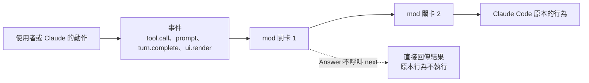

# Claude Code Mods:從「調旋鈕」到「改程式本身」——事件關卡、三種動作、會畫介面(howie和小能熊 + 官方文件 + 範例原始碼)

**主題分類:** 科技 / Claude Code 維運 — 擴充機制
**來源:** YouTube〈100 秒搞懂(今天刚发布的)claude code mods〉(howie和小能熊,2026-10-02,約 3 分 19 秒;英文旁白、無官方字幕,逐字稿以 CPU faster-whisper 轉錄、非官方字幕),細節已對照 Claude Code 官方文件,並 clone `anthropics/claude-code-playground` 讀了範例 mod 原始碼
**增補來源(§8):** YouTube〈Claude Code 的界面原来能自己改?ClaudeCode Mod 完整教程(2026)〉(YAHA學堂,2026-10-05,約 8 分;自動字幕被限流,逐字稿以 CPU faster-whisper 轉錄、非官方字幕)
**整理日期:** 2026-10-05

> 📌 立場:本片未見業配或付費推廣。影片只有 100 秒,本筆記大部分細節(檔案結構、事件名稱、安全範圍、內建 mods)來自官方文件與原始碼。

---

## TL;DR

1. ⭐ **一句話**:「Settings 和 skills 讓你**調** Claude Code;mods 讓你**改** Claude Code。」✅ 2026-10-01 起正式提供,需要 **v2.1.287 以上**。
2. ⭐⭐ **原理**:Claude Code 做的每件事都是**事件**(要用工具、送出 prompt、一輪結束、甚至畫面的每個部分要被畫出來之前)。**mod 是一小段 JS/TS 函式,站在事件經過的路上當關卡**,最後 Claude Code 才照原本的行為做。
3. ⭐⭐⭐ **每個關卡三種動作**:**Observe**(看一眼、記下來、放行)、**Rewrite**(改一下再放行)、**Answer**(攔下來自己回答,原本的行為不執行)。程式上就是:呼叫 `next(e)`、呼叫 `next(改過的 e)`、不呼叫 `next` 直接回傳結果。
4. ⭐⭐ **mod 會畫**:旁邊的 pane、prompt 上方的 band、按鈕、toast,**甚至重畫 Claude Code 自己的畫面**(spinner、工具呼叫那一列)。✅ 部分內建功能本身就是 mod,例如 **`/diff`**(`cc-plugin-diff`),可以關掉或換成自己的。
5. ⭐⭐⭐ **安全警告**:✅ **mods 沒有沙箱**,用你的權限執行——能讀寫你的檔案、讀環境變數與設定裡的 API key、看到你送的每個 prompt、**甚至在你被詢問前就核准工具呼叫**。安裝前用 **`claude plugin validate`** 列出它掛了哪些事件、呼叫哪些 API,只裝信任來源的。

---

## 1. Mod 和既有擴充機制的差別



| | **Mod** | Settings hook | Skill | MCP server |
|---|---|---|---|---|
| 是什麼 | plugin 裡的函式,**在 Claude Code 自己的行程內**被呼叫 | 事件發生時跑一個 shell 指令、HTTP 請求或 prompt | Claude 會讀的 `SKILL.md` 指示 | 給 Claude 工具的外部行程或服務 |
| 能改什麼 | 工具呼叫、prompt、指令、整輪、**介面畫什麼** | 工具呼叫或 prompt 要不要放行、參數與結果、補 context | Claude 知道什麼、怎麼做 | Claude 有哪些工具 |
| 能畫介面 | **能** | 不能 | 不能 | 不能 |
| 狀態 | **活在 session 裡,能記住東西**(變數在 hooks 之間共用) | 每次跑完就消失 | — | — |
| 用什麼寫 | JavaScript / TypeScript | 腳本 + `settings.json` | Markdown | 任何語言 |

> 影片的說法:「settings hook 每個事件跑一次腳本,然後就沒了;skill 是 Claude 讀的指示;MCP 給 Claude 工具;**mod 住在你的 session 裡,它會記得、它會畫**。」既有 settings hook 見 [[claude-code-hooks-complete-guide]],skill 見 [[building-claude-skills]]。

---

## 2. 一個 mod 長什麼樣(✅ 官方教學)

```text
first-mod/
├── .claude-plugin/
│   └── plugin.json      # plugin 的 manifest
└── hooks/
    ├── hooks.json       # {"modules": ["./register.js"]}——有 modules 才算 mod
    └── register.js      # 你的程式,叫 hooks module
```

```javascript
// hooks/register.js:數工具呼叫次數,顯示在 spinner 旁邊
let calls = 0                              // 兩個 hook 共用的狀態

export function register(on) {
  on('tool.call', async ($, e, next) => {  // Observe:記一筆就放行
    calls += 1
    $.ui.invalidate('ui.render')           // 請 Claude Code 重畫
    return next(e)
  })

  on('ui.render', { component: 'Spinner' }, async ($, e, next) => {
    // Rewrite:保留原本的 spinner,在字後面加上次數
    return next({ ...e, props: { ...e.props, suffix: ' · tool calls: ' + calls + '…' } })
  })
}
```

- 每個 hook 收到三個參數:**`$`**(mods API,`$.ui`、`$.command`、`$.session`……)、**`e`**(事件資料)、**`next`**(把事件傳給下一個 mod,最後交給 Claude Code)。
- 第二個參數 `{ component: 'Spinner' }`、`{ tool: 'Bash' }` 是 **matcher**,只處理符合的事件。
- **一個 mod 要碰外界(畫圖、加指令、呼叫模型、讀檔、開行程、連網)只能透過 `$`**——所以 Claude Code 能靠靜態分析列出它會做什麼。

**載入與熱重載:**
- 自己寫:`claude --plugin-dir ./first-mod`;Claude Code 監看這個資料夾,檔案一改就重新載入(重新執行 `register`,所以變數會歸零)。
- 叫 Claude 寫:直接說「make a mod that shows the current git branch above the prompt」。Claude 用內建的 `plugin-authoring` skill,寫到 `~/.claude/dev-mods/<session-id>/` 下;**存第一個檔時會問一次要不要啟用本 session 的熱重載**,之後每輪結束自動重載——「說要改什麼,看它當場變」。
- ⚠️ Claude 寫的 mod **只在那個 session 載入**,而且資料夾會依 `cleanupPeriodDays` 被清掉;要保留就把資料夾複製出來,用 `--plugin-dir` 或放進 marketplace。
- ⚠️ `claude -p`、`dontAsk` 模式、未信任的工作區、`--safe-mode`/`--bare`/`disableAllHooks` 下,Claude 寫的 mod 不會載入。

---

## 3. 三種動作的實例(✅ 讀範例原始碼)

| 動作 | 影片的例子 | 原始碼實際做法 |
|---|---|---|
| **Observe** | **token-weather**:每輪結束看 context 用了多少,在 prompt 上方畫天氣預報 | `turn.complete` 後呼叫 `$.session.usage()` 取 context 佔比,保留最近 12 次;`ui.render`(`AbovePrompt`)畫一行:☀ Clear(<25%)、☁ Cloudy(<50%)、☂ Showers(<75%)、☇ Storm(<90%)、↯ **Compact soon**(≥90%),加上 ▁▂▃ 長條趨勢圖。會略過 subagent 的回合(`e.agentId`) |
| **Rewrite** | Claude 讀工具輸出前,把 secret 塗黑,金鑰永遠到不了模型 | 📌 官方三個範例 mod **沒有**這一支;這是 mod 能做到的事(改寫工具呼叫/結果),不是現成範例 |
| **Answer** | **blast-radius**:Claude 要跑 `git reset --hard` 時攔下來,算出會丟掉什麼,等你決定 | `tool.call`(只看 Bash)先分類風險:`rm`、`git reset --hard`、`git clean`、`git push --force`(含 `--force-with-lease`、`+ref`)、`git checkout -- .`、alembic/rails/prisma/Django 等 migration;會追蹤同一行裡的 `cd`、`pushd`、`git -C` 算出實際目錄。開一個 pane 顯示影響範圍與 **Proceed(快捷鍵 1)/ Cancel(快捷鍵 2,預設焦點)** 按鈕,底下寫「Claude is waiting on your answer」(窄終端機改畫在 band);按 Cancel、逾時 10 分鐘、被中斷或出錯都會**回傳 `deny`**,並告訴 Claude「不要重試,除非使用者要求」 |

> 🔎 原始碼裡的工程細節:hook 自己只有 **10 秒**的執行時間,但花在 `$` 呼叫裡的時間不算,所以 blast-radius 用 `$.process.run(["sleep", "0.25"])` 輪詢等待按鈕。同時只 hold 一個呼叫,避免兩個 subagent 的危險指令同時穿過。

第三個範例 **replay-theater** 加了 `/replay` 指令,逐步重播上一輪 Claude 改了哪些檔案。

---

## 4. 會畫介面,也能取代內建功能

- 能畫:**pane**(transcript 旁邊)、**band**(prompt 上方)、tabs、按鈕、文字輸入框、toast。
- 能重畫 Claude Code 自己畫的東西:工具呼叫那一列、spinner、Claude 提問用的對話框。
- ⚠️ **唯一不能動的是權限確認提示**——mod 改不了 permission prompt 給你看的內容。
- ✅ **內建 mods**(`/plugin` → Installed → Built-in):

| 名稱 | 功能 | 能關嗎 |
|---|---|---|
| `cc-plugin-diff` | 接管 `/diff` 並畫它的 pane | 能;關掉後 `/diff` 由 Claude Code 原本的版本回應 |
| `cc-plugin-agents-md` | 把 `AGENTS.md` 當專案指示載入 | 能 |
| `cc-plugin-plugin-authoring` | 提供寫 mod 的 skill(不含 mod 程式碼) | 能 |
| `cc-plugin-sec-default` | 保護組織管理的設定,不被使用者裝的 mod 改掉 | 不能,由管理員設定 |
| `cc-plugin-telemetry` | 送出分析紀錄 | 能,或用 `DISABLE_TELEMETRY` |
| `cc-plugin-you-should-know` | 側邊 agent 在長任務中幫你看漏掉的事,在 prompt 上方提示 | 預設關閉 |

- 在哪裡會畫:終端機與 Desktop app 的 Code 分頁會畫;VS Code 擴充的聊天面板、`claude -p`、Agent SDK、雲端 session **hook 會跑但不畫**。

---

## 5. 安全:這次最該記住的一段

✅ 官方原文重點:mod 載入後可以——
- 以你的身分讀寫任何你帳號能碰的檔案、開程式、連網;
- 讀環境變數與設定檔(**包括裡面的 API key**);
- 看到你送的每個 prompt、Claude 的每次工具呼叫;
- 改寫 prompt 或工具呼叫、假裝你送出 prompt、傳訊息給你的其他 session;
- **在你被詢問前就核准工具呼叫**(連 `ask` 規則、你自己的 `PreToolUse` 擋下的都可能被它核准);
- 用你的方案或 API key 呼叫模型。

**mods 沒有沙箱**:就算開了 sandboxing,沙箱隔離的是 Claude 跑的 Bash 指令,**mod 自己開的行程在沙箱外**。

```bash
# 安裝前先看它會做什麼(不會執行它的程式碼)
claude plugin validate ./some-mod
#   ❯ ./register.js hooks: session.start, tool.call, command.run{command=tally}, ui.render{component=Spinner}
#   ❯ ./register.js calls: $.command.register, $.ui.invalidate
```

關掉的方法:單一 mod 在 `/plugin` 停用;整個 session 用 `--safe-mode`;所有自裝 mod 用 `"disableAllHooks": true`(⚠️ 這也會停掉你的 settings hooks 與自訂 status line,但**內建 mod 不受影響**)。組織管理員可用 managed settings(如 `allowManagedModsOnly`)限制。

---

## 6. 應用案例

### 案例一:把「一直在問的問題」變成畫面上的答案

影片結尾的建議:每個好 mod 都從一個你一直在問的問題開始——「context 還剩多少?」「這個指令會刪掉什麼?」找到你的問題,把答案放上螢幕。例如:
- 「我現在在哪個 branch?」⇒ 叫 Claude 寫一個在 prompt 上方顯示 git branch 的 mod。
- 「這輪花了多少錢?」⇒ `turn.complete` 後讀 usage,band 上顯示累計 token 與估算費用。
- 「Claude 是不是又在跑 `npm install` 了?」⇒ `tool.call` 匹配 Bash,遇到特定指令跳 toast。

### 案例二:團隊共用的安全閘門

團隊想擋掉 `git push --force` 到 `main`:以前用 settings hook(`PreToolUse` 腳本回傳 block);改用 mod 的好處是能**開 pane 顯示會覆蓋哪些 commit、讓人按 Proceed/Cancel**,而不是只能硬擋。做法:以 blast-radius 為範本修改,放進團隊的私有 marketplace,在 repo 設定裡註冊,所有人自動取得。

### 案例三:安裝別人的 mod 前的檢查清單

1. clone 下來,跑 `claude plugin validate`,看 `calls:` 有沒有 `$.process.run`、網路請求、讀檔、`env reads:`。
2. 一個只畫天氣預報的 mod 卻要讀環境變數或連網 ⇒ 不要裝。
3. 用 `claude --plugin-dir` 先在一次性 session 試,確認後才 `/plugin install`。
4. 記得它**不在沙箱裡**——「能看到你每個 prompt」這件事,對處理機密專案的人尤其重要。

---

## 7. 核實總表

| 類別 | 項目 |
|---|---|
| ✅ 已核實 | 10-01 起提供、JS/TS 函式、Observe/Rewrite/Answer 三種動作、pane/band/按鈕/toast/重畫內建畫面、`/diff` 是內建 mod 且可關閉替換、叫 Claude 寫 mod 並詢問一次熱重載、mods 不在沙箱且以你的權限執行、`claude plugin validate` 列出它碰什麼、token-weather 與 blast-radius 為官方範例 |
| 📌 補充 | 需 v2.1.287 以上;Claude 寫的 mod 只在原 session 載入且會被清掉;mod 能在你被詢問前核准工具呼叫;唯一不能改的是權限確認提示;hook 單次 10 秒限制;內建 mod 不受 `disableAllHooks` 影響 |
| 📌 需修正 | 影片把「塗黑 secret」與兩個範例並列,但它**不是官方範例 mod** |
| 🔁 本庫自我更正(10-05 增補時) | 初版此處寫「blast-radius 是 Proceed/Cancel 按鈕,影片說按 1/按 2 可能是版本差異」——**錯誤**。原始碼中兩個按鈕就綁了 `hotkey: "1"` 與 `hotkey: "2"`(預設焦點在 Cancel),影片說法正確 |
| ⚠️ 版本提醒 | 官方文件註明事件與方法會隨版本改變,以 mod 資料夾中自動產生的 `.claude-plugin/types/*.d.ts` 為準 |

---

## 8. 增補:實作教學與踩坑(YAHA學堂)

> 來源:YAHA學堂〈Claude Code 的界面原来能自己改?ClaudeCode Mod 完整教程(2026)〉(2026-10-05)。說明欄只附官方範例 repo 與作者的程式碼連結,本支未見聯盟連結。下列行為已對照官方範例原始碼。

### 8.1 跑官方範例:三步裝起來

1. clone [`claude-code-playground`](https://github.com/anthropics/claude-code-playground);
2. 把 `claude-code/mods` 加成**本地 plugin marketplace**(帶 `marketplace.json` 的資料夾或 GitHub repo 都算);
3. 安裝後在 Claude Code 裡 `/reload-plugins`,`/plugin` 會顯示「幾個 mod 在跑、叫什麼」。

⚠️ 本地 marketplace 指向的是你 clone 的資料夾——**clone 刪了或搬了,mod 就不載入**。只想試一次就用 `claude --plugin-dir <資料夾>`,關掉 session 就沒了。

### 8.2 blast-radius 實測

- 在測試 repo 叫 Claude 刪檔:**命令還沒跑,pane 先跳出**——上面是完整命令,下面是「放行會刪掉 3 個檔案、約 588 KB」,再往下逐一列出檔案,最底下「Claude is waiting on your answer」。
- **按 2 取消**:Claude 收到 `deny` 訊息,知道是你取消的、也知道原因,所以不會再刪一次;檔案都還在。
- **按 1 放行**:命令照原樣執行。「它就是在 Claude 決定要跑、和真的跑下去之間,加了一道門。」

### 8.3 replay-theater 的坑:只看得到 Edit 工具

作者叫 Claude 把一個函式改名、改了 5 個地方,打 `/replay` 卻顯示「這一輪沒有修改」——因為 Claude 用 **Bash 跑 `sed`/`perl`** 一次改完。加一句「每一處都用 Edit 工具改」重跑,`/replay` 才逐步列出第幾步改了哪個檔、哪一行。

✅ 原始碼印證:replay-theater 只記錄 `EDIT_TOOLS = new Set(["Edit", "Write", "MultiEdit"])` 的 `tool.call`,**透過 Bash 改的檔案完全看不到**。這也提醒:任何「觀察 Claude 改了什麼」的 mod,只掛在特定工具上都會有盲點。

### 8.4 從空資料夾寫 token-weather

- 三個檔:`plugin.json`(和一般 plugin 一樣)、`hooks.json`(一行指向程式檔)、程式本身(`.mjs` = 用 import/export 的 JS)。
- 啟動後黃色粗體的天氣列就出現在提示框上方;**在編輯器把 `Clear skies` 改成「晴,適合寫程式」存檔,畫面立刻改變**——以前改 plugin 要退出重開,現在接近所見即所得。
- 換成完整版後掛三個 hook:`session.start` 先讀一次、`turn.complete` 每輪結束讀一次(兩者都先讓事件照常發生再讀,屬於 Observe),`ui.render` 畫出百分比、token 數與「這一輪長了多少」。
- ⚠️ **坑:重新載入會讓模組變數歸零**——`register` 與 `session.start` 重跑,你一存檔,歷史紀錄就沒了(官方文件也這麼說;要跨重載保留請用 `$.state`)。
- **分享前跑 `claude plugin validate`**:作者的版本報錯「token weather readings 沒有宣告」,在自己建的 `types` 資料夾加宣告檔、並在 plugin 設定加一行後才通過(⚠️ 這個「自建 types」做法依影片描述,與 Claude Code 自動產生的 `.claude-plugin/types/` 不同,官方文件中對應段落本次未逐字核對)。通過後的輸出逐行列出掛了哪些事件、呼叫哪些 API、讀寫哪些狀態。

### 8.5 應用案例:把 replay-theater 的盲點變成團隊規範

若團隊想用「回放」做 code review,有兩個選擇:
1. 在 CLAUDE.md 規定「修改檔案一律用 Edit/Write 工具,不要用 `sed -i` 或 `perl -pi`」;
2. 或自己寫 mod:在 `turn.complete` 時跑一次 `git diff --stat` 補抓 Bash 造成的變更——不管 Claude 用哪個工具改,都看得到。

---

## 來源

- [YouTube:100 秒搞懂(今天刚发布的)claude code mods(howie和小能熊,2026-10-02)](https://www.youtube.com/watch?v=CSfhmC_tUh8)(無官方字幕,逐字稿以 CPU faster-whisper 轉錄、非官方字幕)
- [Claude Code Docs:Mods overview](https://code.claude.com/docs/en/plugins/mods/overview)
- [Claude Code Docs:Create a mod](https://code.claude.com/docs/en/plugins/mods/create)
- 範例原始碼:[anthropics/claude-code-playground — claude-code/mods](https://github.com/anthropics/claude-code-playground/tree/main/claude-code/mods)(token-weather、blast-radius、replay-theater)
- 內建 mod 原始碼:[anthropics/claude-code — mods](https://github.com/anthropics/claude-code/tree/main/mods)
- 型別定義:[mods/types/claude-code.d.ts](https://github.com/anthropics/claude-code/blob/main/mods/types/claude-code.d.ts)
- [YouTube:Claude Code 的界面原来能自己改?ClaudeCode Mod 完整教程(2026)(YAHA學堂,2026-10-05)](https://www.youtube.com/watch?v=0RTUj16alAU)(自動字幕被限流,逐字稿以 CPU faster-whisper 轉錄、非官方字幕)

📎 相關筆記:[[claude-code-hooks-complete-guide]]、[[building-claude-skills]]、[[claude-code-2026-feature-timeline]]、[[claude-code-architecture-deep-dive]]
