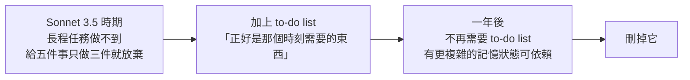
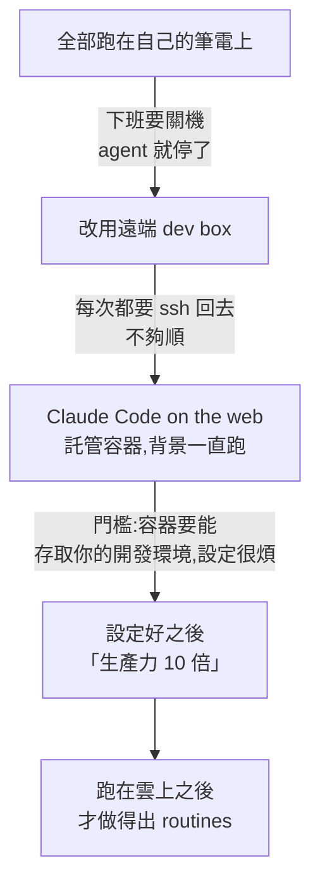
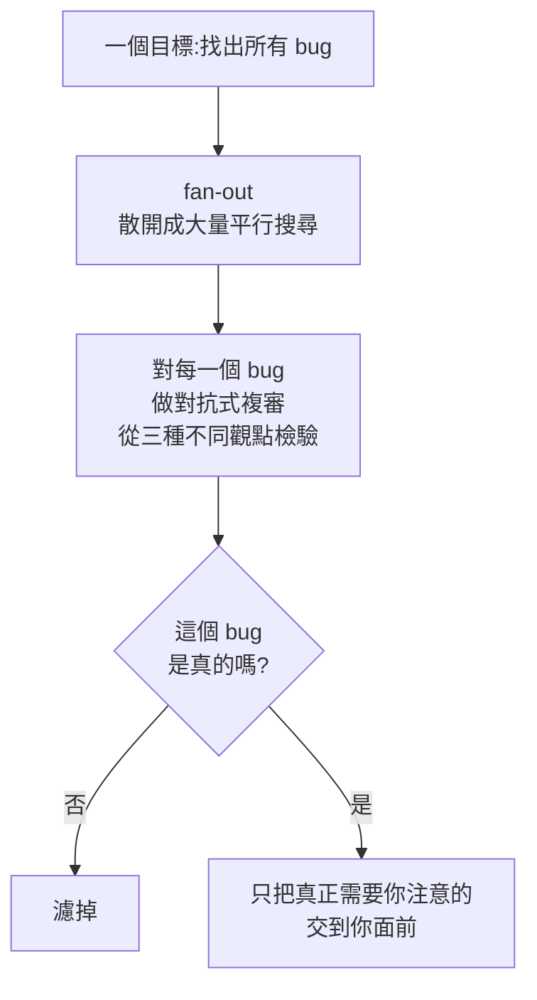
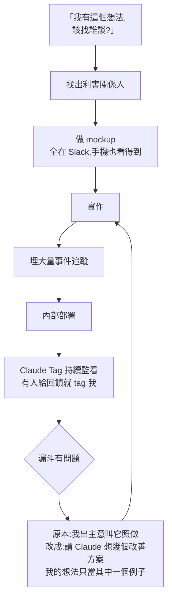

# Claude Code 團隊自己怎麼用 Claude Code:從盯 tool call 到只給目標

**主題分類:** Claude Code —— 團隊實務、工作流演進與 harness 設計取捨
**來源影片:** YouTube〈How the Claude Code team uses Claude Code〉(Anthropic 官方頻道 @claude,2026-09-02,約 22.4 分鐘,**官方英文字幕**)
**受訪者:** Thariq Shihipar、Sid Bidasaria、Robert Boyce(皆為 Claude Code 團隊成員)
**整理日期:** 2026-09-04

> 📎 相關筆記:[[claude-dynamic-workflows]](本文 §4 workflows 的專門拆解)、
> [[claude-code-loop-types-official]]、[[long-running-agents-goal-evaluation]]、
> [[defining-tasks-not-prompts]]、[[claude-code-2026-feature-timeline]]

---

## 0. 一句話總結

> **一年前用 Claude Code 是「下 prompt、給回饋、按同意」;現在團隊成員 70–80% 的工作
> 是在 Slack 裡丟一個目標給 Claude Tag,然後不看 transcript。**

這支影片的價值不在「官方教你用工具」,而在**三個工程判斷**:

1. **harness 的功能是替模型的失敗模式打補丁 —— 模型變強就該刪掉它。**
2. **fan-out 之後真正的問題是 filter-back**,那是個 MapReduce 問題,靠 test-time compute 解。
3. **把 UI 與 transcript 解耦**,是逼自己承認「模型已經夠好、不需要逐句監工」的強制手段。

---

## 1. 工作型態:70–80% 在 Slack,不再看 transcript

| 過去(約一年前) | 現在 |
|---|---|
| 在終端下 prompt | 在 **Claude Tag**(Slack 裡的 Claude)丟任務 |
| 在意每一次 tool call、每一個決策 | 只給**目標**,不管中間怎麼走 |
| 任務粒度:「實作這個 class」「寫這個函式」 | 任務粒度:遠比這複雜的完整問題 |
| 盯 transcript | 只在要**微調**或**想微管理**時才開 TUI / 桌面版(約 20%) |

> ⭐ **為什麼放在 Slack 特別有效(不只是方便):**
> Agent 待在 Slack 裡,就能自己去撈**產品脈絡** ——
> 「這個產品該長什麼樣,團隊做過哪些決定」都在對話紀錄裡。
> **能取得這些資訊、並知道怎麼把它們納入判斷,決策品質差很多。**

⚠️ 這裡有個容易被跳過的前提:**這是 Anthropic 內部的 Slack**,
產品決策討論本來就沉澱在裡面。你的團隊若把決策留在會議口頭或私訊,
把 agent 接進 Slack **不會**自動得到同樣效果 —— **紅利來自資料在那裡,不是來自介面在那裡。**

---

## 2. ⭐⭐⭐ 最重要的一課:harness 功能是有保存期限的

> 「技術的保存期限以前以**年**計。現在模型底層**每兩個月**就整個變一次,而且還在壓縮。」

### 案例:to-do list 的興起與消失

> ⭐⭐ **「你必須對自己做的東西非常不執著,因為它們很快就會消失。」**
>
> 團隊的自述很直接:**很多 harness 功能就是在替模型當下的失敗模式打補丁。**
> 模型變好之後,他們**有自由把這些功能拿掉**。

平衡這件事的是另一頭:**任務規模同時在變大**。
> 「現在我們在 Claude Code 裡做的是更大、更難的任務。
> 模型要**在那個規模下保持連貫**,需要的工具長得不一樣。」

### 案例:AskUserQuestion 的三個階段

| 階段 | 狀態 |
|---|---|
| **設計時** | 「花了我好久。**很難讓 Claude 好好地呼叫這個工具。**」原本只打算放在 plan 之後,後來改成模型可自主呼叫的一般工具 |
| **設計完成後** | 模型「突然就很會叫它了」 |
| **現在** | 「**我自己已經不太用這個工具了** —— 我直接產一個 artifact,讓 artifact 來問我問題。」HTML、有圖表、有 mockup |

> ⭐ 這正是同一個模式:**能力邊界移動得比功能設計還快。**
> 團隊的做法是**先把 primitive 做好**(權限怎麼運作、視覺化怎麼運作),
> **再讓它們互相疊起來**,而不是做死一條使用路徑。

---

## 3. loops 與 routines:一段被「筆電要關機」逼出來的演進

這一段的敘述很誠實,因為每一步都是被上一步的痛點逼出來的:

> 註:發言者說「我可以把筆電開著啊」——「可以,但我得走去停車場,別人會用奇怪的眼神看我。」

**跑在雲上解鎖的是什麼:**

> 「每天去看所有收到的回饋、按重要性分桶,**把它有高信心能修的那些修掉**。」

這就是 Boris 常講的 **loop 敘事**:
> **從「在一個 session 裡對模型下 prompt」,變成「對比 session 高一層的東西下 prompt」。**
> 那個東西再自己去修 bug、去替你辦事。

⚠️ **實務提醒:** 影片誠實說了門檻 ——
**要讓容器跑你的開發環境,得先把存取權設好,那一步「有點痛苦」。**
講者的評價是「絕對值得,做完之後生產力 10 倍」,但**那個設定成本是真的存在的**。

📌 官方對應功能(核實補充):
- **Routines** —— 跑在雲端,關機也繼續;可由**排程(預設或 cron)、API 呼叫、GitHub 事件**觸發。
- **Desktop scheduled tasks** —— 跑在你自己機器上,能直接碰本機檔案與工具。
- **`/loop`** —— 在 CLI session 內重複一個 prompt,適合輕量輪詢。

---

## 4. code review 怎麼變,以及它怎麼長出 workflows

### 4.1 人類 review 的價值往上移了

> 傳統人工 code review 常見的樣子:review 的人挑三個雞毛蒜皮的小問題貼上去,
> **本質上是在對你發訊號「我真的有讀」。**

現在那三個小問題 Claude 會自己找出來、自己改掉。所以:

| 交給 Claude | 留給人類 |
|---|---|
| 命名、風格、明顯 bug 等細節 | **這個 API 為什麼長這樣** |
| 逐行掃過去 | **服務邊界為什麼畫在這裡** |
| | 那些**寫 PR 時 Claude 還沒完全內化**的脈絡 |

> ⭐ 講者的說法很精準:**Claude 幫人類 reviewer 選擇把時間精力放在哪** ——
> 把你從「逐行讀所以忍不住挑毛病」裡拉出來,**提高你思考的抽象層級**。

### 4.2 從 fan-out 到 workflows

code review 是團隊第一次做**大規模 fan-out**:怎麼找出**每一個** bug?

> ⭐⭐ **關鍵洞察:fan-out 不是難點,filter-back 才是。**
> 「一旦你散開,資訊量就大到你必須再收回來。**這是個 MapReduce 問題。**
> 你必須為了人類的閱讀量把它濾回去 —— **因為我要是直接讀 fan-out 的輸出,我會瘋掉。**」
>
> 而建立信心的方法,就是**朝這個問題砸 test-time compute**。

**這個模式可以套到別的問題類別:** 效能問題、通用的深度研究……
影片舉的生活例子是「下週帶父母去 Tahoe,住哪?」——
fan out 十個搜尋(住宿 / 湯屋 / 景點)→ 幾個 agent 排序與挑重點 → 幾個 agent 驗證 → 給你結論。

### 4.3 ⭐ workflows 為什麼讓人比較敢信任

> 「因為是 **agent 在寫程式碼來編排 subagent**,它是**決定性的程式碼行為**
> 與 **agentic LLM 行為**的混合。」

具體的信任感來自哪:

> 「Claude 寫了一個 workflow 要迭代,我看到『這是一個會跑過這些項目的 for 迴圈』,
> 我就想:**對,for 迴圈不會漏掉其中一個,它會對每一項一視同仁地套同一套做法。**」

> ⭐ 這是很實用的一條設計原則:
> **把「不可以漏、不可以偏心」的部分交給程式碼保證,把「需要判斷」的部分交給模型。**
> 純 prompt 的 fan-out 你永遠不確定它是不是偷懶跳過了三筆。

另一句值得記:**「Claude 其實很會做自己的 harness」** ——
它能自己想出 fan-out 該長什麼形狀、拓撲怎麼接、
一層 agent 的輸出怎麼餵進下一層、最後怎麼收斂成給你的摘要。

---

## 5. ⭐⭐ 用 Claude Tag 開發 Claude Tag:UI 與 transcript 解耦

Robert 的主要工作是**確保 Claude Tag 能順利開發 Claude Tag 自己**:
讓開發環境與 dev loop **對 Claude 而言非常好用** ——
「我身為人類要做的每一件事、以及端到端驗證它有沒有動,它都能做。」

> ⚠️ 並且他點出這件事**會越來越難**:
> 「隨著我們做的軟體越來越複雜、整合越來越重,**這份工作也越來越難。**」

### 這一版最大的架構轉變

> **這是第一次,使用者介面與 transcript 徹底解耦。**

| | 傳統 Claude Code | Claude Tag |
|---|---|---|
| 你看到的 | 模型輸出的 token 本身 | **Claude 呼叫工具「送一則訊息給你」的結果** |
| 內心獨白 | 可見 | **在 Slack 裡看不到**(有連結可去看完整 transcript) |
| 抽象層級 | 貼著 token | **高一層** |

**心理上的轉折(這段最誠實):**

> 「一開始有點嚇人 —— **我沒辦法看到 Claude 想的每一件事。**
> 但它同時也很**解放**:Claude 自己選擇要跟我說什麼、什麼時候說。
> 我不再去想它在叫哪個工具、傳什麼參數。**這逼著你讓 Claude 自己煮。**」
>
> ⭐ 「而且**看到模型現在真的夠好** —— 我不用細看 transcript 也拿得到好結果 ——
> **這件事本身就是一種強制函數**,讓你意識到模型真的變強了。」

### 一個完整的產品開發循環(Thariq 的例子)

> ⭐ 最後那個轉折是重點:
> **從「我出主意、它執行」升級成「在更高層次和它一起工作」。**
> 講者說這一刻才是 Claude Tag 對他「真正 click 的時候」。

---

## 6. 三個 primitive:驗證、code review、回饋

主持人把上面的東西收束成一句:

> **驗證(verification)、code review、取得回饋(feedback) —— 這三件都是 Claude Code 的 primitive。**
> 回饋來源可以是事件庫、指標、Slack、GitHub issues,任何地方。

**驗證是團隊最看重的一塊:**

> 「Claude 幫我開 PR 的時候,**它會測、會把畫面截圖寄給我**。你就有信心了。」

⚠️ 但影片也誠實呈現了信任還沒到底的地方 ——
講者驗證新工具時的實際做法是:
1. 先叫 Claude **自己錄一段用 TUI 操作的影片**;
2. **然後自己 clone 下來試一遍**,「為了心安,至少要確認一下」;
3. 「我覺得**總有一天**我會連 clone 都不做了。」

> ⭐ 這個「總有一天」而不是「我現在就不做了」,是這支影片可信度的來源之一。

---

## 7. 應用案例:小團隊可以照抄的四件事

不需要 Anthropic 的規模也能做:

### ① 把 harness 當**會過期**的東西維護

每次模型大版本更新後,問自己:
> **我的 CLAUDE.md / skill / hook 裡,有哪幾條是在替上一代模型的失敗模式打補丁?**

跑一次 ablation:拿掉那幾條,看結果有沒有變差。
👉 做法見 [[claude-md-cut-82-percent-and-maintain-it]] 的提示詞負債與 Ablation 一節。

### ② fan-out 一定要配 filter-back

自己寫多 agent 流程時,**別只設計散開的那一半**。
至少加一層「對抗式複審」:對每個發現,換三個角度問「這是真的嗎?」
再把存活下來的排序給人看。
> **判準:如果你不敢直接讀原始輸出,那就是 filter-back 沒做夠。**

### ③ 讓「不能漏」的部分由程式碼保證

要對 40 個檔案做同一件事,**別寫 prompt 說「對每個檔案都做」**,
讓 agent 產一段 for 迴圈去跑。
> **決定性的骨架 + 模型的判斷力**,信任感差很多。

### ④ 先讓 agent 能端到端驗證,再談自動化

Robert 的工作重點值得抄:
> **凡是你身為人類要做的事(跑起來、測、看畫面),都要讓 agent 也能做。**

具體來說:一鍵起服務的腳本、能跑的測試、能截圖的方式。
**這一步沒做,後面的 loop / routine 都只是在生成沒人驗過的程式碼。**

---

## 8. 他們懷念舊的軟體工程什麼?

這段沒有商業目的,反而最真:

| 人 | 懷念的 | 現在怎麼看 |
|---|---|---|
| Sid | **效能工程** —— 深入一個系統把它調快的樂趣 | 「Claude 現在比我強多了,但我還是享受得到成果」;注意力轉向**從想法到原型到上線的速度** |
| Robert | 鑽 UI 細節 —— 曾花一整天用 CSS 疊 radial gradient,重現 **Mac OS 10.4 Aqua 按鈕** | 「Claude 現在直接就能做,我不會再手工做了」 |

Robert 的收尾很好:

> 他想起自己七、八歲想做電玩但還不會寫程式,**只好用 PowerPoint 做可點擊的形狀**。
> 「現在 Claude 讓整個軟體工程對我變得可及 ——
> 我不必說『我沒有這個技術能力所以解不了』,
> 我可以說『**這是我想達成的,我們拆解一下,看怎麼跟 Claude 一起做到**』。」

最後一句共識:

> **「軟體工程是一門關於變化的職業。」**
> 從手寫 JavaScript 到框架、到編譯器,一直都在變,只是**現在變得更快**。
> 「你解的問題不一樣了,但你還是在解問題。」

---

## 9. 與官方文件的核實

### ✅ 影片提到的功能都對應得上官方文件

| 影片說法 | 官方對應 |
|---|---|
| Claude Tag(Slack 裡的 Claude) | ✅ Claude Code in Slack —— 在 Slack 提 `@Claude` 丟 bug 就拿回 PR;Code + Chat 路由模式會自動判斷是不是編程任務 |
| routines 跑在雲上、關機也繼續 | ✅ Routines 跑在 Anthropic 雲端,可由**排程 / API / GitHub 事件**觸發;可從 web、桌面版或 CLI 的 `/schedule` 建立 |
| `/loop` | ✅ 在 CLI session 內重複 prompt,官方定位為「快速輪詢」 |
| workflows(agent 寫程式碼編排 subagent) | ✅ dynamic workflows,官方另有部落格〈A harness for every task〉專門講 |
| Claude Code on the web、桌面版、TUI | ✅ 終端 / IDE 擴充 / 桌面版 / 網頁四種 surface,共用同一套 CLAUDE.md、設定與 MCP |
| auto mode | ✅ 影片列在「這一年加進來的 primitive」之一 |

### ⭐ 影片未展開、值得補上的三點

1. **auto mode 的機制**:它不是「全部放行」,而是**把權限判斷交給一個獨立的分類器**;
   安全動作(一般檔案編輯、跑測試)自動放行,高風險動作(大量刪檔、推到受保護分支)會擋下來。
   —— 這正好呼應 §5「讓 Claude 自己煮」為什麼在心理上過得去。
2. **routines 的觸發器不只排程**:API 呼叫與 GitHub 事件同樣可以觸發,
   影片只講了「每天跑一次」的用法。
3. **surface 之間可以搬**:`claude --cloud` / `claude --teleport` / `/desktop` / Remote Control ——
   影片講的「從筆電到 dev box 到 web」這條演進,在產品上已經收斂成可雙向搬移的 session。

### ⚠️ 名詞小提醒

「Claude Tag」在中文語境常被叫成「Slack 版 Claude」。
官方文件的頁面名稱是 **Claude Code in Slack**;**Claude Tag** 是這個常駐 Slack 的非同步 agent 的稱呼。
引用時建議兩個都寫,免得對不上。

---

## 來源

- [How the Claude Code team uses Claude Code — Anthropic 官方 YouTube](https://www.youtube.com/watch?v=S-sYlFiGFv8)(2026-09-02,約 22.4 分鐘,官方英文字幕)
- 核實用官方文件:
  - [Claude Code Overview — Claude Docs](https://code.claude.com/docs/en/overview)
  - [Claude Code in Slack — Claude Docs](https://code.claude.com/docs/en/slack)
  - [Routines — Claude Docs](https://code.claude.com/docs/en/routines)
  - [Dynamic workflows — Claude Docs](https://code.claude.com/docs/en/workflows)
  - [A harness for every task: dynamic workflows in Claude Code — Anthropic Blog](https://claude.com/blog/a-harness-for-every-task-dynamic-workflows-in-claude-code)
  - [Scheduled tasks(`/loop`)— Claude Docs](https://code.claude.com/docs/en/scheduled-tasks)

> ⚠️ 本文為對一支官方影片的整理與查證。§9 已標示核實狀態。
> 這是 Anthropic 自家團隊談自家產品,**立場並非中立** ——
> 文中已盡量保留影片自述的門檻與限制(容器存取權設定的痛苦、驗證仍要自己 clone 一次、
> harness 難度隨軟體複雜度上升)。Claude Code 迭代快速,功能細節以官方文件為準。
