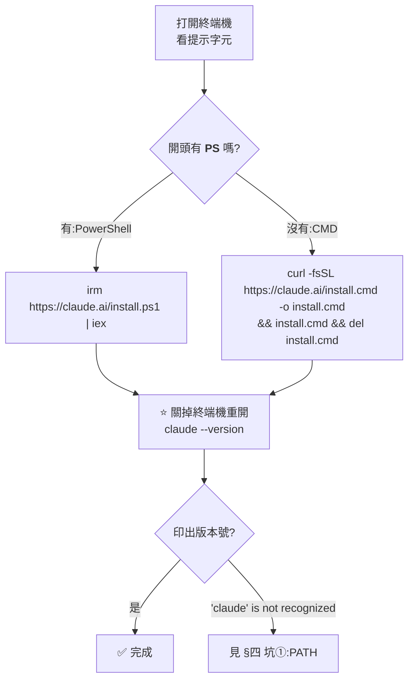

# Windows 原生安裝 Claude Code:一行指令,與五個報錯的官方修法

> 整理自 YouTube 頻道 **YAHA學堂**〈[别碰WSL!Windows原生安装Claude Code实测,5大报错排雷指南](https://www.youtube.com/watch?v=iHVpk9IM1Uk)〉(2026-09-22,約 8.9 分鐘)。
> **該片無字幕也無自動字幕,逐字稿以 CPU faster-whisper 轉錄取得、非官方字幕**;所有指令取自該片說明欄原文,並已逐條對照官方文件。
>
> ⭐⭐⭐ **本文已逐條比對官方文件 [Advanced setup](https://code.claude.com/docs/en/setup) 與 [Troubleshoot installation and login](https://code.claude.com/docs/en/troubleshoot-install)** ——
> **五個報錯的訊息原文與修法全部屬實**,並補上影片沒講的五件事(見 §六)。
>
> 📌 **影片標題的「別碰 WSL」要讀成「一般情況不需要 WSL」**:官方把原生 Windows 列為正式支援,但**沙箱功能只有 WSL 2 支援**(見 §二)。

---

## 一句話總結

> ⭐⭐⭐ **現在的官方做法是原生安裝器:**一行指令,不需要 Node.js、不需要 npm、不需要系統管理員權限,裝完會在背景自動更新**。**
> **網路上教你「先裝 Node 再 `npm install -g`」的教學是舊方法。**
>
> ⭐⭐ **一半的安裝失敗是**終端機開錯了**:PowerShell 的提示字元開頭有 `PS`,CMD 沒有。**

---

## 一、⭐⭐⭐ 安裝:先看提示字元,再貼對應的那一行



**PowerShell:**

```powershell
irm https://claude.ai/install.ps1 | iex
```

**CMD:**

```batch
curl -fsSL https://claude.ai/install.cmd -o install.cmd && install.cmd && del install.cmd
```

### ⭐⭐ 貼錯窗口時的訊息長這樣(✅ 官方原文)

| 你看到 | 代表 |
|---|---|
| **`The token '&&' is not a valid statement separator`** | ⚠️ **你在 PowerShell,卻貼了 CMD 的指令** |
| **`'irm' is not recognized as an internal or external command`** | ⚠️ **你在 CMD,卻貼了 PowerShell 的指令** |

> ⭐⭐ **影片的觀察很實在:「Windows 11 上兩個都在同一個終端視窗裡,顏色一樣、分頁一樣,**提示字元是唯一的區別**。網上一半的安裝失敗都是窗口開錯,指令本身沒毛病。」**

### ⭐ 驗證

```powershell
claude --version
```

✅ **官方:正常安裝會印出像 `2.1.211 (Claude Code)` 這樣的版本號。**

---

## 二、⭐⭐ 原生 Windows、WSL 2、桌面版怎麼選

**✅ 官方的比較表(已核實):**

| 選項 | 需要什麼 | ⭐ **沙箱** | 什麼時候用 |
|---|---|---|---|
| ⭐ **原生 Windows** | **不需要;Git for Windows 為選配** | ⚠️ **不支援** | **Windows 原生專案與工具** |
| **WSL 2** | **啟用 WSL 2** | ✅ **支援** | **Linux 工具鏈,或需要沙箱執行指令** |
| **WSL 1** | **啟用 WSL 1** | ⚠️ **不支援** | **WSL 2 不可用時** |

> ⭐⭐ **所以影片說「只有兩種情況才上 WSL 2:走 Linux 那套工具鏈,或者要沙箱隔離」—— ✅ 與官方完全一致。**

### ⭐ Git for Windows:選配,但裝了比較好

| | **沒裝 Git for Windows** | **裝了 Git for Windows** |
|---|---|---|
| **Claude Code 用什麼跑指令** | **PowerShell 工具** | **Git Bash(Bash 工具)**,PowerShell 工具同時可用 |

> ⭐ **影片建議安裝,並提醒安裝精靈只需要注意一頁:「Adjusting your PATH environment」保持中間那個預設的推薦選項即可。**
> ✅ **官方排錯文件也寫:安裝 Git for Windows 時要選「Add to PATH」。**

### 不想碰終端機

> **去 `claude.com/download` 裝 Claude 桌面版,裡面有 Code 分頁,跟命令列版共用設定。**

---

## 三、⭐⭐ 第一次啟動

| 步驟 | 發生什麼 |
|---|---|
| **①** | **選配色** |
| **②** | ⭐ **選登入方式:**任何訂閱都選第一個**,只有公司給的 Console 帳號才選第二個** |
| **③** | **跳出瀏覽器登入,完成後回終端機按 Enter** |
| **④** | ⭐ **第一次在一個新資料夾開啟,會問「信不信任這個資料夾」** —— 每換一個新資料夾都會問一次 |

### ⚠️⚠️ 登入後看到 `API Error 403`:不是壞了,是方案不對

> **影片:「Claude Code 要付費方案,免費帳號登入後會看到 API Error 403,看到它不用排錯。」**
>
> ✅ **官方原文:「Claude Code requires a **Pro, Max, Team, Enterprise, or Console** account. **The free claude.ai plan does not include Claude Code access.**」**

⚠️⚠️ **這個「登入後的 403」跟 §四 坑④「安裝下載時的 403」是兩回事** —— 影片特別點出這點,本文照錄。

---

## 四、⭐⭐⭐ 五個坑:報錯原文 + 官方修法(✅ 全部已核實)

### 坑① `'claude' is not recognized`:安裝目錄沒進 PATH

**✅ 官方:安裝器把執行檔放在 `%USERPROFILE%\.local\bin\claude.exe`。**

**先檢查 PATH 裡有沒有:**

```powershell
$env:PATH -split ';' | Select-String '\.local\\bin'
```

**沒有的話,加進使用者 PATH(✅ 官方指令):**

```powershell
$currentPath = [Environment]::GetEnvironmentVariable('PATH', 'User')
[Environment]::SetEnvironmentVariable('PATH', "$currentPath;$env:USERPROFILE\.local\bin", 'User')
```

**或用圖形介面:開始功能表搜「環境變數」→ 編輯帳戶的環境變數 → 使用者變數的 Path → 新增 `C:\Users\你的使用者名稱\.local\bin` → 確定 → 重開終端機。**

> ⭐ **影片的提醒:環境變數視窗上半部是「你這個使用者」,下半部是「整台機器」,**改上半部就好**。**
> **加了還是找不到?有輸出卻還是找不到 ⇒ 重跑一次安裝指令。**

### 坑② `Could not create SSL/TLS secure channel`:舊版 Windows 10 沒開 TLS 1.2

**✅ 官方修法:**

```powershell
[Net.ServicePointManager]::SecurityProtocol = [Net.SecurityProtocolType]::Tls12
irm https://claude.ai/install.ps1 | iex
```

📌 ⭐ **官方補充:若在公司網路看到 `unable to get local issuer certificate` 或 `SELF_SIGNED_CERT_IN_CHAIN`,通常是**做 TLS 檢查的公司代理**,需要讓安裝下載信任公司的 CA 憑證。**

### 坑③ `Claude Code does not support 32-bit Windows`:其實是開錯 PowerShell

> ⭐⭐ **影片作者說這是他自己第一次在 Windows 上裝時卡了 40 分鐘的坑,「差點以為機器不支援」。**

**✅ 官方原文:開始功能表裡有兩個 PowerShell —— `Windows PowerShell` 與 `Windows PowerShell (x86)`。**
**x86 那個以 32 位元行程執行,**即使機器是 64 位元也會觸發這個錯誤**。**

**確認系統是不是 64 位元:**

```powershell
[Environment]::Is64BitOperatingSystem
```

| 結果 | 處理 |
|---|---|
| ✅ **`True`** | **系統沒問題。關掉這個窗口,開**不帶 x86** 的 `Windows PowerShell` 重跑安裝** |
| ⚠️ **`False`** | **真的是 32 位元 Windows —— Claude Code 需要 64 位元作業系統** |

### 坑④ 安裝時 `403` / 下載失敗:網路、代理或地區

**先測一下通不通:**

```powershell
curl.exe -sI https://downloads.claude.ai/claude-code-releases/latest
```

**看到 200 就是通的。看到 403,✅ 官方列出的原因:**

| 原因 | 處理 |
|---|---|
| **公司代理或防火牆擋了** | **安裝前先設代理(兩行都要設)** |
| ⚠️ **所在地區不在支援名單** | **HTML 頁面會寫 `App unavailable in region`;見 [supported countries](https://www.anthropic.com/supported-countries)** |

```powershell
$env:HTTP_PROXY  = 'http://proxy.example.com:8080'
$env:HTTPS_PROXY = 'http://proxy.example.com:8080'
```

**⭐ 備胎:WinGet**

```powershell
winget install Anthropic.ClaudeCode
winget upgrade Anthropic.ClaudeCode   # ⚠️ 預設不會自動更新,要自己跑(見 §6.3)
```

### 坑⑤ 打 `claude` 卻彈出桌面 App

**✅ 官方原文:舊版 Claude Desktop 可能在 `WindowsApps` 目錄註冊一個 `Claude.exe`,它在 PATH 裡排在 CLI 前面,**把你的指令搶走了**。**

> ⭐ **修法很簡單:**把 Claude Desktop 更新到最新版**。**

📌 **影片旁白念成「Claude SH」,⭐ 官方原文是 `WindowsApps` 目錄裡的 `Claude.exe`。**

---

## 五、⭐⭐⭐ 自檢指令:`claude doctor`

> ⭐⭐ **影片說這是「大多數人不知道的自檢指令」:「10 秒鐘,頂你翻半小時文件。」**

```powershell
claude doctor
```

**✅ 官方說明:它**不啟動 session**,唯讀地印出安裝與設定診斷 ——
包括安裝健康狀況、設定檔驗證錯誤,以及附帶建議修法的警告;**也會顯示最近一次自動更新的結果**。**

---

## 六、⭐⭐ 本文補上的五件事(影片沒講,✅ 皆出自官方文件)

### 6.1 ⭐ 不需要系統管理員權限

> ✅ **官方:「Run the install command from PowerShell or CMD. **You do not need to run as Administrator.**」**
> **安裝位置在 `%USERPROFILE%` 底下,使用者本來就有寫入權限。**

### 6.2 ⭐ 系統需求:x64 **或 ARM64**

| 項目 | ✅ **官方需求** |
|---|---|
| **Windows 版本** | **Windows 10 1809+ 或 Windows Server 2019+** |
| **硬體** | **4 GB 以上 RAM,⭐ x64 或 ARM64 處理器** |
| **Shell** | **Bash、Zsh、PowerShell 或 CMD** |

> ⭐ **影片只談了 32 位元不支援;⭐ ARM64 的 Windows 筆電(例如 Snapdragon 機種)是官方支援的。**

### 6.3 ⭐⭐ WinGet 其實可以選擇自動更新

**影片說 WinGet 裝的「不會自動更新,要自己跑指令」—— ✅ 預設確實如此。**

> ⭐⭐ **但官方另有一個開關:設定環境變數 `CLAUDE_CODE_PACKAGE_MANAGER_AUTO_UPDATE=1`,
> Claude Code 會在有新版時**自己在背景跑 upgrade**,成功後提示你重啟。**
>
> ⚠️ **官方也註明:Claude Code 執行中時,Windows 會鎖住執行檔,WinGet 升級可能失敗 —— 這時它會改為顯示手動指令。**

### 6.4 ⭐ Git Bash 找不到時怎麼辦

**✅ 官方:沒設 `CLAUDE_CODE_GIT_BASH_PATH` 時,Claude Code 依序找 `bash.exe`:**

| 順序 | 位置 |
|---|---|
| **①** | **預設安裝位置 `C:\Program Files\Git` 與 `C:\Program Files (x86)\Git`** |
| **②** | **PATH 上的 `git`,取該安裝的 `bin\bash.exe`** |

**Git 裝在別處時,手動指定(✅ 官方範例):**

```json
{
  "env": {
    "CLAUDE_CODE_GIT_BASH_PATH": "C:\\Program Files\\Git\\bin\\bash.exe"
  }
}
```

> ⚠️ **官方細節:檔名必須是 `bash.exe`、`sh.exe`、`bash` 或 `sh` —— ⚠️ **指向 `git-bash.exe` 啟動器會被忽略**,改走自動偵測。**
> ⭐ **另一個安全設計:如果 `git` 位在你啟動 Claude Code 的資料夾裡、或其下含 `node_modules` / `.venv` / `env` 的路徑,Claude Code 會**跳過它** —— 避免執行專案自己塞進來的執行檔。**

### 6.5 ⚠️ 公司電腦被端點防護擋住

> ✅ **官方:若 AppLocker、群組原則的軟體限制或 EDR 代理程式在干擾,請 IT 把 `claude.exe` 及它啟動的子行程(`cmd.exe`、`bash.exe`)加入白名單。**

---

## 應用案例

### 案例 1|⭐⭐⭐ 裝完之後的第一個任務:整理一個亂資料夾

**影片示範的流程,很適合當「第一次用」的練習:**


> ⭐⭐ **兩個值得養成的習慣:**
> **① 「先寫、確認後再執行」—— 讓它先產出腳本,你看一眼再放行;**
> **② 權限先選「只允許這次」,熟悉之後再放寬。**

### 案例 2|⭐⭐ 一分鐘自我檢查清單

| # | 檢查 | 指令 |
|---|---|---|
| **①** | **提示字元有沒有 `PS`?** | — |
| **②** | **貼對應的那一行安裝指令** | 見 §一 |
| **③** | **關掉終端機重開,看版本號** | `claude --version` |
| **④** | ⭐ **不對勁就先讓它自己查** | `claude doctor` |
| **⑤** | **還是不行,對照 §四 的報錯原文** | — |

### 案例 3|⭐ 什麼時候該改走 WSL 2

| 你的情況 | 建議 |
|---|---|
| **一般 Windows 專案、PowerShell 腳本** | ⭐ **原生就好** |
| **專案依賴 Linux 工具鏈**(例:只在 Linux 跑得起來的建置腳本) | **WSL 2** |
| ⭐ **需要沙箱隔離執行指令** | ⚠️ **只有 WSL 2 支援沙箱** |

**⭐ WSL 2 路線(影片說明欄提供,✅ 官方寫明要在 WSL 終端機裡安裝與啟動,不是在 PowerShell 或 CMD):**

```powershell
wsl --install        # 系統管理員 PowerShell,跑完重開機
wsl -l -v            # VERSION 要是 2
```

```bash
# 在 Ubuntu 終端機裡
curl -fsSL https://claude.ai/install.sh | bash
```

---

## 重點回顧(TL;DR)

1. ⭐⭐⭐ **官方做法是原生安裝器,一行指令**:PowerShell 用 `irm https://claude.ai/install.ps1 | iex`,CMD 用 `install.cmd` 那行。**不需要 Node、npm,也不需要系統管理員權限。**
2. ⭐⭐ **一半的失敗是窗口開錯**:提示字元有 `PS` 是 PowerShell,沒有是 CMD。貼錯會看到 `The token '&&' is not a valid statement separator` 或 `'irm' is not recognized`。
3. ⭐ **原生安裝會在背景自動更新**;⚠️ WinGet 預設不會(但可用 `CLAUDE_CODE_PACKAGE_MANAGER_AUTO_UPDATE=1` 打開)。
4. ⭐⭐ **原生 Windows 是官方正式支援的**;WSL 2 只在需要 Linux 工具鏈或**沙箱**時才需要(⚠️ 原生 Windows 不支援沙箱)。
5. ⭐ **Git for Windows 是選配**:沒裝就用 PowerShell 工具,裝了就多一個 Git Bash 的 Bash 工具。
6. ⚠️⚠️ **登入後 `API Error 403` = 用的是免費方案**,Claude Code 需要 Pro / Max / Team / Enterprise / Console。**這跟安裝時的 403 是兩回事。**
7. ⭐⭐⭐ **五個坑(✅ 全部核實)**:① PATH 沒加 `%USERPROFILE%\.local\bin`;② 舊 Win10 要先開 **TLS 1.2**;③ 「不支援 32 位元」其實是開了 **PowerShell (x86)**,用 `[Environment]::Is64BitOperatingSystem` 確認;④ 安裝時 403 是**代理/防火牆或地區**,可改用 WinGet;⑤ 打 `claude` 卻開了桌面 App,是舊版桌面版在 `WindowsApps` 註冊的 `Claude.exe` 搶了 PATH,**更新桌面版即可**。
8. ⭐⭐ **`claude doctor`**:不啟動 session,唯讀印出安裝健康狀況、設定錯誤與最近一次自動更新結果。
9. ⭐ **本文補充**:支援 **ARM64**;Git Bash 路徑可用 `CLAUDE_CODE_GIT_BASH_PATH` 指定(但不能指向 `git-bash.exe`);公司電腦被 EDR 擋時要請 IT 把 `claude.exe` 與子行程加白名單。

---

## 核實狀態

### ✅ 已核實(官方文件)

| 項目 | 來源 |
|---|---|
| **兩行安裝指令、貼錯窗口的兩種錯誤訊息** | ✅ Advanced setup |
| **原生 / WSL 2 / WSL 1 比較表、原生不支援沙箱** | ✅ Advanced setup |
| **Git for Windows 為選配、沒裝時改用 PowerShell 工具** | ✅ Advanced setup + Troubleshoot |
| **不需系統管理員、Win10 1809+、x64 或 ARM64、4 GB RAM** | ✅ Advanced setup |
| **原生自動更新、WinGet 預設不自動更新、`CLAUDE_CODE_PACKAGE_MANAGER_AUTO_UPDATE`** | ✅ Advanced setup |
| **需要 Pro / Max / Team / Enterprise / Console,免費方案不含 Claude Code** | ✅ Advanced setup |
| **五個報錯的訊息原文與修法** | ✅ Troubleshoot installation and login |
| **`claude doctor` 的用途** | ✅ Advanced setup |
| **`CLAUDE_CODE_GIT_BASH_PATH`、搜尋順序與檔名限制、EDR 白名單** | ✅ Troubleshoot installation and login |

### ⚠️ 未能核實

- ⚠️ **影片的實際操作畫面**(整理資料夾的示範)—— **屬作者演示。**
- ⚠️ **本文未在乾淨的 Windows 機器上重跑一次完整安裝**;所有內容出自影片與官方文件的比對。

---

## 來源

- [别碰WSL!Windows原生安装Claude Code实测,5大报错排雷指南 — YAHA學堂](https://www.youtube.com/watch?v=iHVpk9IM1Uk)(2026-09-22,約 8.9 分鐘;**該片無字幕也無自動字幕,逐字稿以 CPU faster-whisper 轉錄取得、非官方字幕**;指令取自說明欄)
- ⭐⭐⭐ **核實依據**:
  - [Advanced setup — Claude Code 官方文件](https://code.claude.com/docs/en/setup)
  - [Troubleshoot installation and login — Claude Code 官方文件](https://code.claude.com/docs/en/troubleshoot-install)
  - [Terminal guide — Claude Code 官方文件](https://code.claude.com/docs/en/terminal-guide)
- [Git for Windows](https://git-scm.com/downloads/win)
- 延伸:本庫 [[claude-code-2026-feature-timeline]](⭐ W13 起的 Windows 原生 PowerShell 工具、W18「不再需要 Git Bash」)、[[claude-code-hooks-complete-guide]]、[[deployment-for-vibe-coders-platform-selection]](⭐ 同樣是給非技術人員的「環境準備」)。
