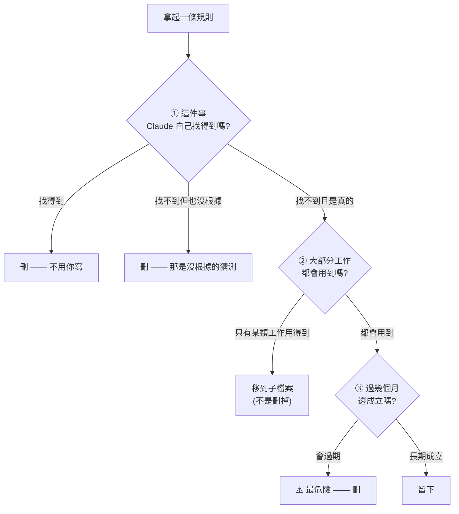
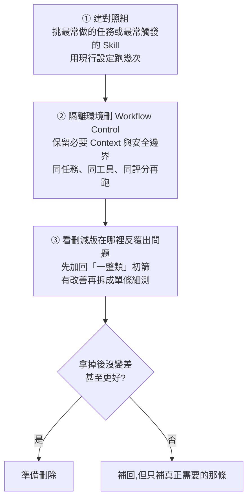

# CLAUDE.md 砍掉 82% 反而更聽話:三個篩選問題、五項該留的、以及一個減號的坑

> 整理自 YouTube 頻道 **YAHA學堂**〈別再寫廢話了!官方命令一鍵優化 CLAUDE.md,AI 聽話程度暴漲 10 倍〉(2026-08-12,約 9.5 分鐘,§1–8);2026-09-03 增補 **Gary Chen**〈[Claude Code 之父建議,每六個月刪光你的 CLAUDE.md?](https://www.youtube.com/watch?v=Z-4AsgTYv2c)〉(2026-09-02,約 15 分鐘,官方 zh-TW 字幕)轉述 **Boris Cherny 於 YC Startup School** 的對談,成為 **§9:提示詞負債、Ablation 測試與 Eval 過期**。

> 📎 同主題另兩篇,建議一起看:
> - [[claude-md-from-zero-to-mastery]](Gary Chen)—— 三層位置、減法三問、加法五問的**完整框架**
> - [[output-style-communication-not-intelligence]] —— 輸出風格,治的是「它怎麼跟你講話」
>
> **本篇的獨特價值在「怎麼驗證與怎麼維護」**:`/context` 量化佔用、`/insights` 找該加什麼、`/doctor` 砍不該留的,加上一個非常隱蔽的 YAML 語法坑。

---

## 一句話總結

**規則寫越多,重要的那幾條就被淹掉了。Anthropic 自己在優化 Opus 5 / Fable 5 時把系統提示詞砍掉超過八成,而且「在編程評測上沒有任何可測量的退步」——你的 CLAUDE.md 大概也可以。**

---

## 一、先量化:你的規則檔到底吃掉多少注意力

進 Claude Code 打 **`/context`**,會看到 CLAUDE.md 佔用的 token 數。影片實測的專案是 **798**。

> ⭐ **但重點不是它佔多大空間,是它「掛掉 Claude 多少注意力」。**

實際刪完之後:**798 → 143**,砍掉八成以上。

### ⚠️ 這裡有個坑:改完要重開 Claude Code 才生效

**Claude Code 只在開對話時讀一次 CLAUDE.md。** 你中間改了檔案再跑 `/context`,看到的還是舊數字——會誤以為沒生效。

---

## 二、兩種最典型的廢話規則

打開多數人的 CLAUDE.md,幾乎一定找得到這兩段:

| 廢話類型 | 長相 | 為什麼是廢話 |
|---|---|---|
| **列目錄結構** | 「`components/` 放組件、`pages/` 放頁面」 | Claude 自己 `ls` 一下就知道 |
| **泛泛而談的規範** | 「寫乾淨的程式碼、遵循最佳實踐、用有意義的變數名」 | **那是寫給人看安心的**,對模型沒有任何約束力 |

> 影片對第二種的處理很乾脆:**「刪掉更不用猶豫。」**

### 82% 這個數字不是隨口說的

**Anthropic 官方在優化 Opus 5 與 Fable 5 的 Claude Code 時,一口氣把系統提示詞砍掉超過八成**,而且用他們自己的話說:**在編程評測上沒有任何可測量的退步。**

**為什麼砍了反而更好?**

> **規則太多會互相打架,重要的那幾條就被淹掉了。**

---

## 三、⭐ 三個篩選問題(一條一條問,邊問邊刪)

影片拿一份 **72 行的真實專案檔**現場示範。



### 問題 ①:這件事 Claude 自己找得到嗎?

**不用猜,直接問它。** 影片實測:它自己去列目錄、讀 `package.json`、讀兩個原始碼檔案,**一個字都沒被告知**,就把 React、TypeScript、FastAPI、測試用什麼**全部自己翻出來了**。

> ⭐ **但真正有意思的是它最後補的那段**:PostgreSQL、Python 3.11、pytest 這幾個是 CLAUDE.md 裡寫的,**但程式碼裡找不到任何證據**。

於是得到一條很漂亮的雙向判準:

> **它自己找得到的,不用你寫;它找不到的,你寫了也是沒根據的猜測。**

⚠️ 第二種特別值得警惕——**那不只是廢話,而是可能已經錯掉的資訊**(專案早就換掉了,規則檔還留著)。

### 問題 ②:這條大部分工作都會用到嗎?

例:只跟前端有關的規則,改後端時完全用不上,**卻一直佔著位置**。

⚠️ 注意這一類**不是刪掉,是換個地方放**(見下面第五節)。

### 問題 ③:這件事過幾個月還成立嗎?

> **這種最危險。它可能兩個星期後就失效了,但會一直留著,讓未來的 Claude 照著過期的做法工作。**

---

## 四、清空之後該寫什麼?五項

刪到「什麼都不剩」時會慌:這樣 Claude 還知道什麼?**影片說這正是重點——先刪乾淨,再想清楚該寫什麼。**

| # | 該寫的 | 影片給的具體例子 |
|---|---|---|
| **1** | **絕對不能搞錯的規定** | 做網店,**價格必須含稅**。Claude 不知道這件事,做新頁面就會顯示未稅價,**客戶會看到錯的價格** |
| **2** | **有固定處理順序的事** | 「直接改網頁上的數字,下次同步就被覆蓋掉」——他自己踩過,改了半天全白改 |
| **3** | **改完一個地方,還有哪些要跟著改** | **這種連動關係最容易漏,寫進去最划算** |
| **4** | **做到什麼程度才算真的完成** | 改完購買流程**要實際下一筆測試訂單**。這種每次都要做的檢查,事先講清楚 |
| **5** | **遇到不懂該去哪找答案** | ⚠️ **只寫「東西放在哪」,不要把整份指南貼進來**——指南可能有 200 行,貼進來你就白刪了 |

> 第 3 與第 4 項正好對應到 [[agent-skill-three-layer-run-do-verify]] 的「驗」層:**把「做完」寫成可檢查的動作,而不是留給模型自己猜。**

---

## 五、分層放置:刪掉的東西沒丟,只是換個地方

「有些刪掉的東西明明還有用」——它們沒被丟掉,只是移到子檔案(例如 `frontend.md`)。

> ⭐ **關鍵好處:換完之後,開對話時一個 token 都不佔。** 只有真的做到相關工作時才被讀進來。

### ⚠️⚠️ 全片最隱蔽的坑:差一個減號

子檔案用 YAML frontmatter 標明適用範圍,而分隔線**必須是三個減號**:

```
✅ 正確            ❌ 錯誤(少一個)
---                --
(設定)             (設定)
---                --
```

**只差一個減號,規則就默默變成全局常駐——而且你根本不會發現。**

**驗證方式**:重開 Claude Code → 跑 `/context` → 找 **memory files** 那段。如果一份「不該佔位置」的檔案出現在那裡,就是這個問題。

### 怎麼確認規則「真的生效」

影片的驗證做法很值得抄:**問 Claude 規則,看它回答時有沒有標出處。**

實測結果比預期還好:

- 第一條標的出處是**只在前端才載入的路徑規則**
- 第二條標的出處是 **CLAUDE.md 主檔**
- **它分得清清楚楚**
- **更妙的是它自己把規則分成兩組**:前兩條「每次都要做」,後面幾條「改到價格、會員價、文案才要做」

> **這就是「文件精簡過 + 規則放對位置」的結果:Claude 不只全讀到了,還知道哪條什麼時候該用。**

---

## 六、⭐ 維護兩步法:半年後它一定會再漲回來

**為什麼會漲回來?因為你每次踩坑就想補一條規則。這種「只增不減」的做法,半年又變回 200 行。**

維護只有兩件事:**新增**與**修剪**,而且兩個都有官方工具。

### `/insights` —— 找出「該加什麼」

**你怎麼知道自己跟 Claude 合作時,哪些問題一直在重複?靠回憶是不準的。**

`/insights` 會**掃描你本地的對話記錄(最多 200 場),生成一份 HTML 報告**。報告內容很全,但**重點在「建議加進 CLAUDE.md」那一段**:

> **它根據你實際重複踩的坑,直接幫你把規則寫好。**
> **「我到底該寫什麼」這個最難的問題,它用你自己的資料回答了。**

### `/doctor` —— 砍掉「不該留的」

⚠️ **前提條件很重要:它只檢查已經 commit 進 git 的 CLAUDE.md。** 檔案還沒提交、或被 `.gitignore` 掉,`/doctor` 不會給你建議。

**它的判斷標準跟前面那三個問題幾乎一樣**——把 Claude 自己能從程式碼推出來的東西砍掉,保留真正有價值的。

影片實測它列出四塊(技術棧、目錄結構、建置命令、編碼規範),理由寫得很直白:

| 區塊 | `/doctor` 給的理由 |
|---|---|
| 目錄結構 | **「一個 `ls` 就重現了這些」** |
| 編碼規範(最誇張) | 二十幾條裡**絕大多數是「寫乾淨的程式碼」這種**;只留下四條 |
| 留下那四條的理由 | **「這幾條跟預設行為不一樣,光看程式碼會學到錯的寫法」** |

> ⭐ **最後那句是整支影片最好的「該留什麼」判準**:規則的價值不在於它對不對,而在於**它是否與模型的預設行為相異**。跟預設一致的規則,寫了等於沒寫。

---

## 七、同時用 Claude Code 和 Codex?兩種單檔同步法

如果兩邊都在用,現在一定在維護兩份一模一樣的文件。有兩種做法可以永遠不用同步:

### 方法一:`@` import(可以再加 Claude 專屬規則)

1. 把 **`AGENTS.md`** 當成你真正在維護的那一份
2. **`CLAUDE.md` 只留一個指標指過去**:

```
@AGENTS.md
```

⚠️ **這一行一定要放第一行,前面不能有空行。**

之後你只維護 `AGENTS.md`,`CLAUDE.md` 自動跟著變。驗證方式一樣:重開 Claude Code 跑 `/context`,看兩份是不是都被讀進來了。

### 方法二:軟連結(不需要 Claude 專屬規則時更乾脆)

建一個 **symlink**——可以想成快捷方式,**兩個名字指向同一份文件**。在檔案總管或 `ls -l` 看到箭頭就對了。

---

## 八、⚠️ 最後一個定位提醒

> **CLAUDE.md 是「上下文」,不是「強制配置」。Claude 會讀、會盡量遵照,但沒有保證。**

這句話決定了你該把什麼放進去、什麼不該:

- ✅ 適合放:**慣例、判準、順序、驗收標準**——這些即使偶爾沒遵守,代價可控
- ❌ 不適合放:**安全邊界、權限控制、不可逆操作的保護**——這些需要 hook 或工具層強制,不能靠「請你不要」

---

## 應用案例

### 案例 1|⭐ 今天就跑一次的三步健檢(10 分鐘)

```bash
# ① 先量化現況
/context          # 記下 CLAUDE.md 佔用的 token 數

# ② 讓官方工具告訴你砍哪裡
#    ⚠️ 前提:CLAUDE.md 必須已 commit 進 git
git add CLAUDE.md && git commit -m "wip: before trim"
/doctor

# ③ 讓它告訴你該補什麼(用你自己的踩坑記錄)
/insights

# ④ 改完後 —— 一定要重開 Claude Code 再驗證
/context          # 對比 token 數;順便看 memory files 有沒有不該出現的檔案
```

⚠️ **第 ④ 步的重開不能省**——Claude Code 只在開對話時讀一次,不重開你看到的是舊數字。

### 案例 2|把「三個問題」變成 code review 的一條檢查

每次有人想往 CLAUDE.md 加規則時,在 PR 裡問三句:

```markdown
## 新增 CLAUDE.md 規則的檢查
- [ ] Claude 自己從程式碼找得到嗎?(找得到 → 不要加)
- [ ] 這條跟模型的「預設行為」相異嗎?(一致 → 不要加,寫了等於沒寫)
- [ ] 三個月後還成立嗎?(會過期 → 不要加,或標上到期檢查日)
- [ ] 大部分工作都用得到嗎?(否 → 放子檔案,不要放主檔)
```

> **第二條是本片最有價值的新增判準**,來自 `/doctor` 的理由:「這幾條跟預設行為不一樣,光看程式碼會學到錯的寫法。」

### 案例 3|拿本倉庫的 `CLAUDE.md` 對照(誠實檢視)

用三個問題掃一遍本倉庫的 `CLAUDE.md`:

| 內容 | 判定 |
|---|---|
| 「所有筆記一律用繁體中文」 | ✅ **留** —— 與預設行為相異,且 Claude 從 repo 只能推測 |
| 「每篇必須包含應用案例」 | ✅ **留** —— 這是第 4 項「做到什麼程度算完成」 |
| 「程式類有 git repo 就先 clone 讀完原始碼」 | ✅ **留** —— 固定處理順序,而且與預設行為明顯相異 |
| **Mermaid 語法注意事項**(特殊字元要加引號等) | ✅ **留** —— 典型的「重複踩坑後補的規則」,正是 `/insights` 會建議的那種 |
| **YouTube 逐字稿流程**(遠端/本機實測結論、Whisper 配方) | ⚠️ **偏長但該留** —— 全是「Claude 猜不到、且踩過才知道」的環境事實 |
| 三層分類結構與現有中類清單 | ⚠️ **可考慮移到子檔或讓它自己 `ls`** —— 中類清單其實 `ls technology/` 就看得到,而且**它會過期**(這幾天就新增過 `personal-finance`) |
| 「兩個倉庫的分工」 | ✅ **留** —— 純粹的組織慣例,程式碼裡完全沒有證據 |

**結論:大部分內容通過檢查,但「現有中類清單」那段同時踩到問題 ① 與 ③**(自己找得到 + 會過期),是最該檢討的一段。

### 案例 4|`@` import 的實際用途不只跨工具

除了打通 Claude Code 與 Codex,同一招也適合:

- **把長而穩定的內容抽出去**:例如環境踩坑筆記,主檔只留 `@docs/environment-gotchas.md`
- **讓 CLAUDE.md 主檔保持可讀**:主檔只放最高優先級的五項,其餘 import
- ⚠️ **但要記得:import 進來的內容一樣佔 token**。真正省 token 的是「**條件式載入的子檔案**」(帶正確 YAML frontmatter 的那種),不是 import。**兩者不要搞混。**

### 案例 5|什麼時候該無視這支影片

影片的建議建立在「規則太多會互相打架」上,但有兩種情況相反:

| 情況 | 為什麼要多寫 |
|---|---|
| **多人協作、有外部合規要求** | 規則的讀者不只模型,還有人。此時 CLAUDE.md 兼具文件功能 |
| **模型持續在某件事上出錯** | 這正是 `/insights` 的邏輯——**重複踩的坑值得補規則**。刪減的對象是「沒出過事的泛泛規則」,不是「出過事的具體規則」 |

**判準始終是同一個:這條規則有沒有改變過模型的行為?** 沒有的話,它只是佔注意力。

---

## 九、⭐⭐⭐ 半年後怎麼辦:提示詞負債、Ablation 測試,與「Eval 也會過期」(2026-09-03 新增)

> 本節整理自 **Gary Chen**〈[Claude Code 之父建議,每六個月刪光你的 CLAUDE.md?](https://www.youtube.com/watch?v=Z-4AsgTYv2c)〉
> (2026-09-02,約 15 分鐘,官方 zh-TW 字幕),內容轉述自 **Boris Cherny 於 YC Startup School 的對談**。
>
> ⭐ **這一節正是本文 §6「半年後它一定會再漲回來」的續集** —— 那節講「會漲回來」,
> 這節講**到期之後該怎麼砍、以及怎麼證明砍對了**。

### 9.1 為什麼是「刪光」而不是「精簡」

Claude Code 團隊的做法不是寫好一套 system prompt 就長期沿用,而是**每次有新模型推出就大掃除一次** ——
重新檢查所有 prompt、tools 與 skills,確認哪些舊設定已經不需要。

Boris 用的詞是 **Unhobbling**(hobble 原意是把腳綁住,所以 unhobbling 是解開腳鐐)——
**不是把 base model 練得更強,而是拿掉那些限制模型表現的束縛。**
(本倉庫另有 [[context-engineering-claude-5-unhobbling]] 談同一概念。)

> ⚠️ **反過來想:你寫的 prompt 也可能讓模型顯得沒那麼好用。**
> 以前 agent 讀檔不可靠,你寫了一套繞路流程;以前它常漏格式,你加了六道檢查。
> **現在工具與模型都變強了,舊補丁卻還在 —— 那些補丁就從幫手變成阻力。**

### 9.2 提示詞負債

影片給這個現象一個很好記的名字:**提示詞負債(prompt debt)**,並用 SOP 類比:

> 新人寄錯一次附件,主管就多加一道簽核;另一個人寫錯檔名,又再加幾道檢查。
> 幾年後換了一個能力更強的員工,寄一封信還是要過層層關卡 ——
> **這時候拖慢他的已經不是能力,而是遺留下來的舊流程。**

### 9.3 ⭐⭐ 先分三類,再決定能不能動

Boris 沒有給一般人一套分類,這是影片作者補上的框架 —— **也是實務上最該先做的一步**:

| 類別 | 內容 | 能不能刪 |
|---|---|---|
| **① 必要 Context** | 模型不可能自己知道的背景:品牌定位、目標受眾、專案資料放哪 | ❌ **一定要留** —— 模型再強也不能通靈你的個人資訊 |
| **② Workflow Control** | 規定「一定要怎麼做」:每段先列三點、工具按固定順序、把模型本來就會的動作寫死 | ⭐ **最可能是為舊模型留的補丁,最該優先測試** |
| **③ 安全與驗收邊界** | 哪些資料不能碰、什麼操作要人工確認、引用必須附來源、達成什麼才能發布 | ⚠️ **千萬不要為了精簡就在真實環境裡關掉** —— 這些本來就不是用來提升智力的 |

> ⭐ **刪掉 Workflow Control 不是留白,而是換一種寫法:
> 把「你要怎麼做」換成「要達成什麼、不能踩哪條線、做到什麼程度算完成」。**
>
> 影片作者的一句話總結很精準:**「我不再教我的 agent 該怎麼走,我只告訴它要走到哪裡。」**

### 9.4 Ablation 測試三步驟(不需要 Anthropic 那種規模)



⚠️ **最關鍵的方法學細節:模型輸出帶有隨機性,所以舊設定與刪減版都必須各跑幾次,
比較的是「多次測試的平均表現、失敗率與穩定度」,而不是各挑一次最好的結果來比。**

⭐ 還有一條歸位原則:**某條規則若只在特定任務用得到,就不該放在全域的 `CLAUDE.md` / `AGENTS.md`,
而應該收進更精確的位置(例如專屬 skill)** —— 這與本文 §5「分層放置」是同一件事。

### 9.5 ⭐⭐⭐ Boris 講得最重的一句:大家做錯的是「驗證」

> **大家花最多時間在調 prompt,但真正做錯的地方是驗證。**

因為三個步驟能不能跑得動,全卡在同一件事:**你怎麼知道這次結果算好還是算壞?**

判準很硬:**模型有沒有辦法自己檢查?**

- 要求它驗證網頁 → **就要讓它真的打得開網頁**
- 要求測試通過 → **就要讓它真的跑得動測試**
- 要求引用附來源 → **就要讓它真的點得開原始連結**

> ⚠️ **一個模型驗證不了的標準,就只是一句空話** —— 最後還是回到你身上人工檢查。
> (品牌語氣、論證品質這種主觀項目,就固定一套評分標準或直接人工覆核。)

而驗證有個前提:**模型得先知道什麼叫好。**

> ⭐ 影片點破一個常見的自我欺騙:**我們常在 Claude 給出平庸結果時不耐煩,
> 但有時那是我們自己從來沒告訴過它「好」長什麼樣。**
>
> 所以設定目標時**不要只描述「好」,還要指定它必須拿出什麼證據證明達標,並要求它修到驗證通過為止** ——
> 例如明講「我要的不是原型、不是概念驗證,而是測過、反覆改過、明天就能上線的東西」。

### 9.6 ⭐⭐ Eval 本身也會過期

直覺上我們覺得 prompt 要一直改、但 eval 可以一路沿用。**Boris 說不是。**

> **一份 eval 大概只能活一到三個模型世代。** 模型進步太快,常常一份 eval 出來沒多久,
> 新模型就直接考滿分 —— **一旦考滿分,這份考卷就再也分不出好壞,只能整份丟掉重出。**
> **連 Anthropic 自己的 eval 都是消耗品。**

⭐ **所以當你的模型開始穩定考滿分,該做的不是慶祝,而是回頭去看它現在真正卡在哪裡,
拿那個地方當作新的一組測試任務。**

> **Prompt 與 eval 都不是永久資產。模型更新時,「用來指導它」與「用來測量它」的方法都得跟著更新。**

### 9.7 作者的實際紀錄(有具體數字的一段)

他的頻道從場景規劃、寫程式碼到品質審查整條線都用 Skill 跑,是過去一年一點一點長出來的 ——
**光影片製作那一個 Skill 就有三百多行**,裡面甚至有一張用文字畫的流程圖,把 Step 1 到 Step 9 全框起來、規定一步都不准跳。

趁換模型大掃除的結果:

| 項目 | 數字 |
|---|---|
| 涉及檔案 | **15 個** |
| 刪除 | **2,500 多行** |
| 加回 | **300 多行** |
| 花費 | **兩個完整工作天**(一邊測一邊補) |
| 結果 | 數百行的 skill **都壓到 100 行以內** |

⚠️ **他誠實提到過程中踩到了幾次「明確交代過不能碰」的禁忌** —— 所以才需要那兩天邊測邊補。
**這正好印證 §9.3 的分類:安全邊界不能跟 Workflow Control 一起砍掉。**

收益是:同樣品質下 context 有感變少、token 更省,**而且整條 workflow 好維護太多**。

### 9.8 大掃除前先問的兩個問題

延續本文 §3 的篩選精神,影片給了兩個更精簡的版本(可直接丟給 AI 讓它幫你標):

1. **這句話有沒有真的改變模型的行為?** 如果它本來就會這樣做,那這句只是在吃 context。
2. **這件事它自己查得到嗎?** 專案結構、有哪些指令 —— 它讀一下就知道,不需要再抄一份。

> **真正值得寫下來的,是它查不到的那些:你們不成文的慣例,以及某個決定背後的原因。**

### 9.9 與公開報導的核實

| 影片說法 | 核實結果 |
|---|---|
| 出自 Claude Code 之父 Boris Cherny 的訪談 | **屬實**,為 **YC Startup School(2026-07)**與 **Diana Hu** 的對談 |
| 建議每六個月刪光 CLAUDE.md、Skills、Hooks | **屬實**,原意是「先刪光、看模型怎麼做,再決定加回什麼」 |
| 用 ablation 逐條重新賺回每一行 | **屬實** |
| Eval 只能活 1–3 個模型世代 | **屬實** |
| Unhobbling 的定義 | 與報導一致 —— **給更難的任務、更少的指示、更多的信任** |

⭐ **影片未提、但很有份量的一個數字:** 據報導,**Claude Code 團隊為 Opus 5 移除了系統提示詞的 80% 以上,
而且在他們的程式測試中沒有記錄到任何退步。**

> ⚠️ 這個數字很值得對照本文標題那個「砍掉 82%」—— **兩者是不同層級的東西**:
> 本文 §1–8 講的是**使用者自己的 `CLAUDE.md`**,而這裡是 **Anthropic 對自家產品 system prompt** 的處理。
> 但方向完全一致,而且後者是由最了解該模型的團隊做出來的。

⚠️ 本節內容為影片對訪談的轉述,並經公開報導交叉比對;**訪談原話未經逐字核對。**

---

## 重點回顧(TL;DR)

1. **先量化再動手**:`/context` 看 CLAUDE.md 佔多少 token。影片實測 **798 → 143**。⚠️ **改完必須重開 Claude Code**,否則 `/context` 顯示的還是舊數字。
2. **兩種典型廢話**:①列目錄結構(`ls` 就有)②「寫乾淨的程式碼」這種泛泛規範(**寫給人看安心的**)。
3. **82% 有官方依據**:Anthropic 優化 Opus 5 / Fable 5 時把系統提示詞砍掉超過八成,**編程評測上沒有任何可測量的退步**。原因是**規則太多會互相打架,重要的被淹掉**。
4. **⭐ 三個篩選問題**:① Claude 自己找得到嗎(**直接問它**——它會自己讀 `package.json` 與原始碼)② 大部分工作都用得到嗎(否 → 移子檔)③ **過幾個月還成立嗎(這種最危險)**。
5. **雙向判準**:**它自己找得到的不用你寫;它找不到的,你寫了也是沒根據的猜測。** 影片實測就抓出三個「CLAUDE.md 寫了但程式碼裡查無實據」的項目。
6. **該留的五項**:絕對不能搞錯的規定 / 固定處理順序 / **改完還要連動改什麼**(最容易漏、最划算)/ **做到什麼程度算完成** / 遇到不懂去哪找答案(⚠️ **只寫位置,別把 200 行指南貼進來**)。
7. **⚠️⚠️ 一個減號的坑**:子檔案的 YAML frontmatter **必須三個減號**,打成兩個 → **規則默默變成全局常駐,而且你不會發現**。用 `/context` 的 memory files 段驗證。
8. **驗證生效的方法**:問它規則,看它**標不標出處**;實測它還會自己把規則分成「每次都要做」與「改到 X 才要做」兩組。
9. **⭐ 維護兩步法**:`/insights` 掃本地最多 200 場對話 → **根據你實際重複踩的坑直接把規則寫好**;`/doctor` 砍不該留的(⚠️ **只檢查已 commit 進 git 的檔案**)。
10. **⭐ `/doctor` 給出的最佳留存判準**:「**這幾條跟預設行為不一樣,光看程式碼會學到錯的寫法**」——**與預設一致的規則,寫了等於沒寫。**
11. **跨工具同步兩法**:`@AGENTS.md` import(⚠️ **必須第一行、前面不能有空行**)或建 **symlink**。
12. **⚠️ 定位提醒:CLAUDE.md 是上下文,不是強制配置。** Claude 會讀、會盡量遵照,**但沒有保證**——所以安全邊界與不可逆操作的保護要靠 hook,不能靠「請你不要」。

---

## 來源

- ⭐ [Claude Code 之父建議,每六個月刪光你的 CLAUDE.md? — Gary Chen](https://www.youtube.com/watch?v=Z-4AsgTYv2c)(2026-09-02,約 15 分鐘,官方 zh-TW 字幕)—— §9 的提示詞負債、三分類、Ablation 三步驟、驗證優先與 Eval 過期皆來自此片(內容轉述自 Boris Cherny 的訪談)
- 核實用報導(Boris Cherny 於 YC Startup School,2026-07,對談 Diana Hu):[barath.ai 的整理](https://www.barath.ai/learnings/boris-cherny-yc-startup-school-2026)、[Delete your CLAUDE.md every 6 months](https://lucadidomenico.studio/en/blog/delete-claude-md-every-6-months)
- [別再寫廢話了!官方命令一鍵優化 CLAUDE.md,AI 聽話程度暴漲 10 倍 — YAHA學堂](https://www.youtube.com/watch?v=pmWgyZM7mB8)(2026-08-12,約 9.5 分鐘)
- [Claude Code 官方文件](https://docs.anthropic.com/claude-code)
- 本倉庫相關筆記:[[claude-md-from-zero-to-mastery]]、[[output-style-communication-not-intelligence]]、[[agent-skill-three-layer-run-do-verify]]

> 該片無字幕,逐字稿以 CPU 版 faster-whisper(small / int8 / zh)轉錄取得,**非官方字幕**,可能有少量聽寫誤差。文中指令與專有名詞已依上下文校正(轉錄中的「Cloud 的點 MD」為 **CLAUDE.md**、「斜槓 Context」為 **`/context`**、「fab5」為 **Fable 5**、「Gate」為 **git**、「小老鼠符號」為 **`@`**、「軟鍊接」為 **symlink**)。
