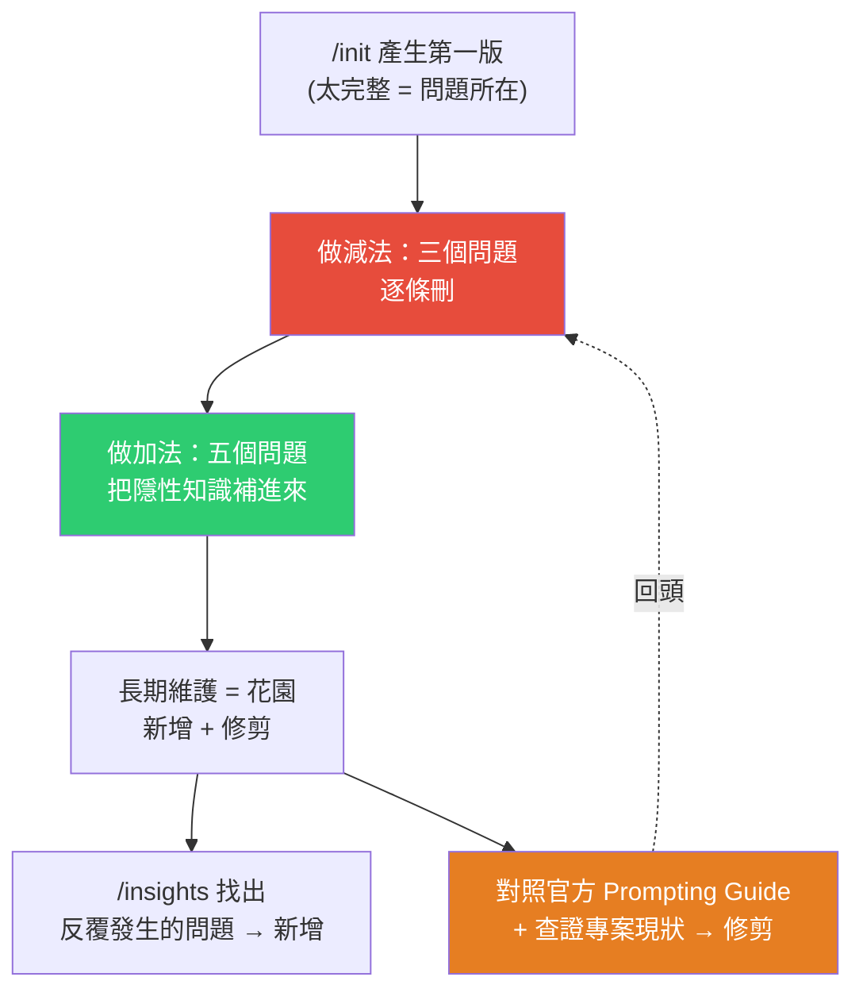
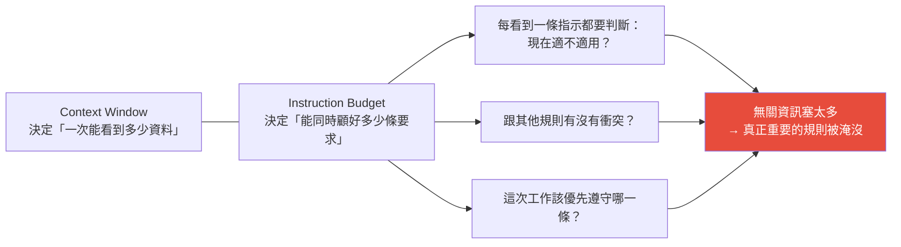
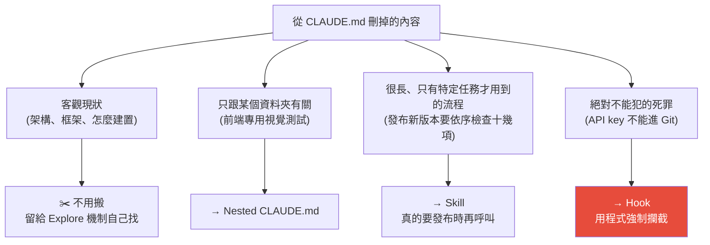

# 15 分鐘學完 CLAUDE.md:三個位置、做減法的三問、做加法的五問、以及怎麼「修剪」

> 整理自 YouTube「Gary Chen」〈15 分鐘學完 CLAUDE.md:從入門到精通〉(2026-07-30,約 16 分鐘,官方 zh-TW 字幕)。核心主張:**把 CLAUDE.md(Codex 裡叫 AGENTS.md)寫好,是用 AI 時投資報酬率最高的一件事**——但關鍵不在「寫得多完整」,而在**敢不敢刪**。`/init` 產生的內容大部分該砍掉,因為 Claude 本來就查得到;真正該寫的是「它怎麼翻程式碼都猜不到的隱性知識」。

---

## 一句話總結

---

## 一、CLAUDE.md 到底在做什麼

開啟對話時,只要專案裡有 CLAUDE.md,系統會**自動把內容注入 Context Window**——也就是說,**在你下任何指令之前,AI 已經被強迫讀完這份檔案,並把它當作最高指導原則**。好處是你不必每開一個新對話就重講一次專案架構與規矩。

Codex 的對應檔案是 **AGENTS.md**,功能一樣、概念完全通用。

---

## 二、三個位置,三種作用範圍

| 層級 | 位置 | 管什麼 | 例子 |
|---|---|---|---|
| **User Level** | 使用者目錄下的 `.claude/` | 這台電腦上**所有** session | 「只用繁體中文輸出」、「用第一性原理思考、金字塔原理結構化輸出」 |
| **Project Level** | 專案根目錄 | 整個專案的共同規則(**會跟程式碼一起進 Git**,確保團隊每個人的 Claude 吃到同一套指示) | 專案專屬、對話前必須先知道的資訊 |
| **`CLAUDE.local.md`** | 專案根目錄 | 只留在你個人電腦、**不上雲端** | 你自己的工作癖好,不想跟團隊分享 |
| **Nested Level** | 專案的子資料夾 | 該資料夾專屬 | `frontend/` 放 React UI 規範、`backend/` 放 Python 邏輯,兩邊規則不會搞混 |

**規則是疊加的,不是二選一。** 改前端程式碼時,Claude 會先讀 User Level 個人習慣 → 疊加 Project Level 專案設定 → 最後套用 Nested Level 專屬規則。**Nested 距離正在修改的檔案最近、最符合眼前工作,通常對這次任務影響最直接。**

> 原則:**規則放得越接近實際工作的檔案,適用範圍就越精準。**

影片在此處建議暫停一分鐘,自問:哪些是我的個人習慣?哪些是團隊共通標準?哪些只有特定資料夾需要?——分清楚了才知道該放哪一層。

---

## 三、`/init` 的陷阱:它整理得**太完整**

`/init` 會掃過整個專案,產生一份包含「專案做什麼、怎麼啟動/建置/測試、用了哪些框架、資料夾架構、觀察到的開發規範」的說明書。看起來很方便,**但問題正出在太完整**。

### 為什麼太完整反而不好?

1. **Claude 本來就查得到。** 給它任務時,它不會直接盲寫,而是**在背景啟動 Explore Subagent**,自己去掃資料夾、看 `package.json`。`/init` 寫進去的很多內容,是**它自己就會發現的事實**。
2. **浪費 token + 會被過期資訊誤導。** 這些內容每次新對話都被強制塞進 Context Window;萬一架構改了而你忘了更新,反而害它照著錯的做。
3. **最關鍵的是 Instruction Budget。**

**就算某段架構說明看起來「只是背景資料」,只要被放進 CLAUDE.md,Claude 每次開工都要分配一部分注意力去處理它。**

> 結論:`/init` 是起點,**不能照單全收**,要從第一行開始一條一條檢查。

---

## 四、做減法:刪掉時問自己的三個問題

| # | 問題 | 判斷 |
|---|---|---|
| 1 | **Explore subagent 能不能自己發現?** | 它很快找得到的 → **不要寫**。夠格留下的只有「怎麼翻程式碼都猜不到的隱性知識」或藏得很深的重要資訊 |
| 2 | **大部分工作都會用到嗎?** | 只跟前端有關(如改完畫面要跑某個視覺測試)→ 放進 **前端資料夾的 Nested CLAUDE.md**,等真的處理到前端再讀進來 |
| 3 | **過幾個月後還會成立嗎?** | 「目前暫時使用舊版 API」這種幾週後就失效 → 留著會讓未來的 Claude 繼續照過期做法工作 |

把關夠嚴的話,你會發現 `/init` 生出來的內容**已經被刪到很少了**。

---

## 五、做加法:把隱性知識萃取出來的五個問題

不用背分類,照著反問自己就好:

| # | 問題 | 影片舉的網路商店例子 |
|---|---|---|
| 1 | **有沒有絕對不能搞錯的規定?** | 所有對客顯示的價格**必須含稅**。Claude 不知道就可能在新頁面顯示未稅價——直接影響使用者、又很難自己猜到 |
| 2 | **有沒有固定的處理方式?** | 商品價格要**先改試算表再同步到網站**;直接改網頁上的數字,下次同步就被蓋掉 |
| 3 | **改完一處,還有哪些要跟著改?** | 會員價格調整後,首頁、結帳頁、常見問題、通知信件都要一起更新——這種容易漏掉的連動關係 |
| 4 | **做到什麼程度才算完成?** | 改完畫面要同時檢查電腦版與手機版;改完購買流程要**實際下一筆測試訂單** |
| 5 | **遇到不懂的事該去哪找答案?** | 寫文案 → 看品牌語氣指南;退款問題 → 看退款規則。**CLAUDE.md 只要告訴它資料放哪,真的需要時再去讀** |

> 所以一份好的 CLAUDE.md **內容通常不會很多**,主要留下:不能搞錯的規定、固定處理方式、容易漏掉的連動關係、完成前的檢查、其他重要資料的位置。

---

## 六、被刪掉的內容該搬去哪?(四個去處)

**第四點特別重要:** 只在 CLAUDE.md 裡寫「不要提交 API key」是**不夠的**——模型在處理複雜任務時很可能漏掉這條指示。正確做法是用 **Hook 在 `git commit` 之前用程式強制檢查**,偵測到疑似 API key 就直接擋下這次提交。

> 判準:**提醒**放 CLAUDE.md、**流程**放 Skill、**紅線**放 Hook。

---

## 七、長期維護:一份好的 CLAUDE.md 像一座花園

作者坦承自己的 CLAUDE.md 也走過同樣的路:`/init` 建立 → Claude 每犯一次錯就補一條規則 → **只增不減** → 檔案越來越肥 → Claude 腦袋又被塞滿。

維護只有兩件事:**新增**與**修剪**。

### 新增:用 `/insights` 找出反覆發生的問題

Claude Code 內建指令 `/insights` 會分析歷史紀錄、產生一份 HTML 報告:

- 回顧你平常怎麼用 Claude Code(習慣一次給完整規格?還是分幾輪慢慢改?)
- 找出**反覆出現的模式**(例如你是不是每次改完都要重新提醒它檢查檔案)
- **直接給建議**:某個要求被重複提醒很多次 → 產生一段可直接複製進 CLAUDE.md 的規則;某個流程經常重複 → 建議做成 Skill,甚至建議用 Hook

> 累積了一段使用紀錄的人,強烈建議跑一次 `/insights`,**只增加真正需要的規則**。

### 修剪:兩種該被勇敢砍掉的規則

**最大的心魔是:我們很習慣一直加規則,卻根本不敢刪既有規則。**

#### 第一種:因為模型變強了,所以不再需要的規則

Claude Code 官方團隊在幫最新一代的 **Fable 5 與 Opus 5** 優化系統提示詞時,**一口氣刪掉了原本超過 80% 的規則,而且刪完之後 Claude Code 的能力完全沒有退步。**

原因:**同一條規則在舊模型上能幫它少犯錯,到了新模型上反而變成一種限制。** 以前我們會很死板地規定「不要做什麼」,但現在模型聰明到懂得觀察你的工作習慣與偏好,舊規則反而綁手綁腳、讓它能力變差。

> 由此可知:**CLAUDE.md 的寫法會隨你使用的模型而變化。**

怎麼判斷模型變多強?最客觀的做法是**參考各家最新釋出的 Prompting Guide**(Anthropic 推 Fable 5、Codex 推 5.6 時都有官方指南),比對最新寫法,看哪些規則已經不需要了。

#### 第二種:已經跟真實情況不符的規則

檢查專案現狀——真實程式碼早就改了、工作流程已經不一樣了,**只要跟 codebase 的事實不符就直接砍掉**,避免誤導 AI。

---

## 八、實測:用「健檢 Prompt」跑一次舊專案,抓出三個問題

知道原則後最難的是執行:你不可能每週讀一次官方 Prompting Guide,也不可能記得專案裡每個改動。作者把整套修剪流程包成一組 **CLAUDE.md 健檢 Prompt**(Claude Code / Codex 都能用):

1. 先確認你現在用的是哪個模型;
2. 去對照那個模型的**官方 Prompting Guide**;
3. 回來看你的 CLAUDE.md,**一條一條查證**有沒有符合 best practice。

趁 Opus 5 發布時拿去健檢一個幾個月前的專案,抓出三個他自己完全沒發現的問題:

| # | 問題 | 建議的修法 |
|---|---|---|
| 1 | CLAUDE.md 裡的一些規則**跟專案裡另外幾份文件互相牴觸** | 那一整段刪掉,**只留一行 reference** 到真正正確的那份文件 |
| 2 | 一整段「開發完功能後怎麼用登入身分測試網頁」的流程**常駐在 CLAUDE.md** | **整段搬去 Skill** |
| 3 | **CLAUDE.md 和 AGENTS.md 要怎麼同步**(同時用 Claude 與 Codex 的人都遇過) | **直接在 CLAUDE.md 第一行 reference AGENTS.md**,之後只維護一個檔案;AI 透過這個 reference link 讀到真正在維護的 single source of truth |

第 3 點是這支影片最實用的小技巧之一——**用一行 reference 建立 single source of truth,取代維護兩份會漂移的檔案**。

---

## 九、收尾:Becoming

作者引凱文·凱利《必然》的核心觀念 **Becoming**——世界上沒有任何東西是有終點的,一切都在變成下一個版本的過程中。

> 很多時候我們不敢刪掉 CLAUDE.md 裡的舊規則,是因為潛意識裡**把它當成一份已經完成的規格書**。但事實上:**你的 codebase 是流動的,AI 的能力也是流動的,所以你的 CLAUDE.md 也更應該是流動的。**

---

## 應用案例

### 案例 1|拿這支影片的三問,對自己現有的 CLAUDE.md 做一次減法

打開你的 CLAUDE.md,逐條問:①Explore subagent 自己找得到嗎?②大部分工作都會用到嗎?③三個月後還成立嗎?——三題有任一題答案不利,就刪掉或往下搬。典型會被砍掉的:「本專案使用 React + Vite」「執行 `npm run dev` 啟動」「資料夾結構如下…」這類 `/init` 產物。

### 案例 2|用「提醒 / 流程 / 紅線」三分法重新分配內容

- 「改完前端要跑視覺測試」→ 這是**只跟前端有關的提醒** → `frontend/CLAUDE.md`。
- 「發版前要依序檢查十幾項」→ 這是**長流程** → 做成 Skill,要發版時才呼叫。
- 「API key 不准進 Git」「不准 force push main」→ 這是**紅線** → 寫 Hook 在 commit/push 前用程式擋。

**紅線靠提醒是擋不住的**,這是本片最該內化的一條。

### 案例 3|同時用 Claude Code 與 Codex 的人,今天就把兩份檔案合一

不要再手動同步 CLAUDE.md 和 AGENTS.md。挑一份當 single source of truth(建議 AGENTS.md,因為它是跨工具的通用命名),另一份第一行寫 reference 指過去。省下的不只是複製貼上的力氣,更是**兩份檔案內容漂移後互相牴觸**的風險——正是健檢抓出的問題 #1。

### 案例 4|每次大模型版本更新,把「讀官方 Prompting Guide + 健檢 CLAUDE.md」當成固定動作

官方團隊自己刪掉 80% 系統提示詞還沒退步,是很強的信號:**你為舊模型寫的規則,現在很可能正在拖累新模型。** 把「模型升級 → 對照官方指南 → 逐條查證 CLAUDE.md」做成一組固定 prompt(或直接做成 Skill),每次大版本更新跑一次。

### 案例 5|先跑 `/insights` 再決定要加什麼規則

不要憑印象加規則。累積幾週使用紀錄後跑 `/insights`,讓它從歷史對話裡找出「你反覆提醒了幾十次」的那些事——那才是真正值得寫進 CLAUDE.md 的。它還會直接判斷該做成規則、Skill 還是 Hook,省掉你自己分類。

### 案例 6|本倉庫自己就是活教材

本專案的 `CLAUDE.md` 目前包含了「排程備份指到 SCHEDULES.md」「寫作規範」「三層目錄結構」「YouTube 逐字稿取得流程與踩過的坑」等內容。用本片的三問檢查:**Whisper 配方與 grep 去重的坑屬於「怎麼翻程式碼都猜不到的隱性知識」,該留**;但那段很長的「逐字稿取得流程」其實更適合搬進 Skill,只有真的要處理影片時才載入——這正是健檢抓出的問題 #2 同一型。

---

## 重點回顧(TL;DR)

- **CLAUDE.md = 每次開新對話被強制注入 Context Window 的最高指導原則**;Codex 對應 AGENTS.md,概念通用。
- **三個位置疊加生效**:User(全機個人習慣)→ Project(團隊共同、進 Git)→ Nested(特定資料夾,離工作最近、影響最直接);另有不上雲的 `CLAUDE.local.md`。
- **`/init` 的問題是太完整**:Claude 有 Explore Subagent 會自己查,重寫一遍只是浪費 token、可能過期誤導,還吃掉 **Instruction Budget**(能同時顧好多少條要求)。
- **減法三問**:Explore 找得到嗎?/ 大部分工作都用得到嗎?/ 幾個月後還成立嗎?
- **加法五問**:不能搞錯的規定 / 固定處理方式 / 改完還要連動改哪裡 / 怎樣才算完成 / 不懂去哪找答案。
- **搬家四去處**:客觀現狀→留給 Explore;資料夾專屬→Nested;長流程→**Skill**;絕對紅線→**Hook**(只寫提醒擋不住)。
- **維護 = 新增 + 修剪**:`/insights` 找反覆問題來新增;對照**官方 Prompting Guide** 與**專案現狀**來修剪。官方團隊為 Fable 5 / Opus 5 刪掉 **80%+ 系統提示詞、能力沒退步**。
- **健檢實測三個發現**:規則與其他文件牴觸→改成一行 reference;長測試流程→搬去 Skill;CLAUDE.md 與 AGENTS.md→**第一行 reference,只維護一份**。
- **心法:Becoming。** codebase 是流動的、AI 能力是流動的,CLAUDE.md 也該是流動的——別把它當成已完成的規格書。

---

## 來源

- Gary Chen(YouTube),〈15 分鐘學完 CLAUDE.md:從入門到精通〉(2026-07-30,約 16 分鐘):<https://www.youtube.com/watch?v=wj7mHCviMvs>
  - 本文依該片**官方 zh-TW 字幕**整理(非 Whisper 轉錄)。
  - 影片時間戳:0:00 CLAUDE.md 是什麼 / 1:17 該放在哪個位置 / 4:06 用 `/init` 建立第一份 / 6:22 該寫什麼、該刪什麼 / 10:18 長期怎麼維護 / 13:19 健檢實測 / 14:47 總結。
  - 作者的「CLAUDE.md 健檢 Prompt」與完整文章放在其 Patreon(影片資訊欄有連結),本文僅整理影片中公開說明的方法與結論。
- 延伸(本庫):[Claude 5 時代的 Context Engineering 新規則(官方刪 80% 系統提示詞的來龍去脈)](../ai-agents/foundations/context-engineering-claude-5-unhobbling.md) · [Bitter Lesson:模型變強後該砍舊 prompt](../ai-agents/foundations/bitter-lesson-cut-old-patterns.md) · [Skill 實戰:從製作到維護](../ai-agents/applications/building-claude-skills.md) · [Claude Code 原始碼徹底拆解](./claude-code-architecture-deep-dive.md)
