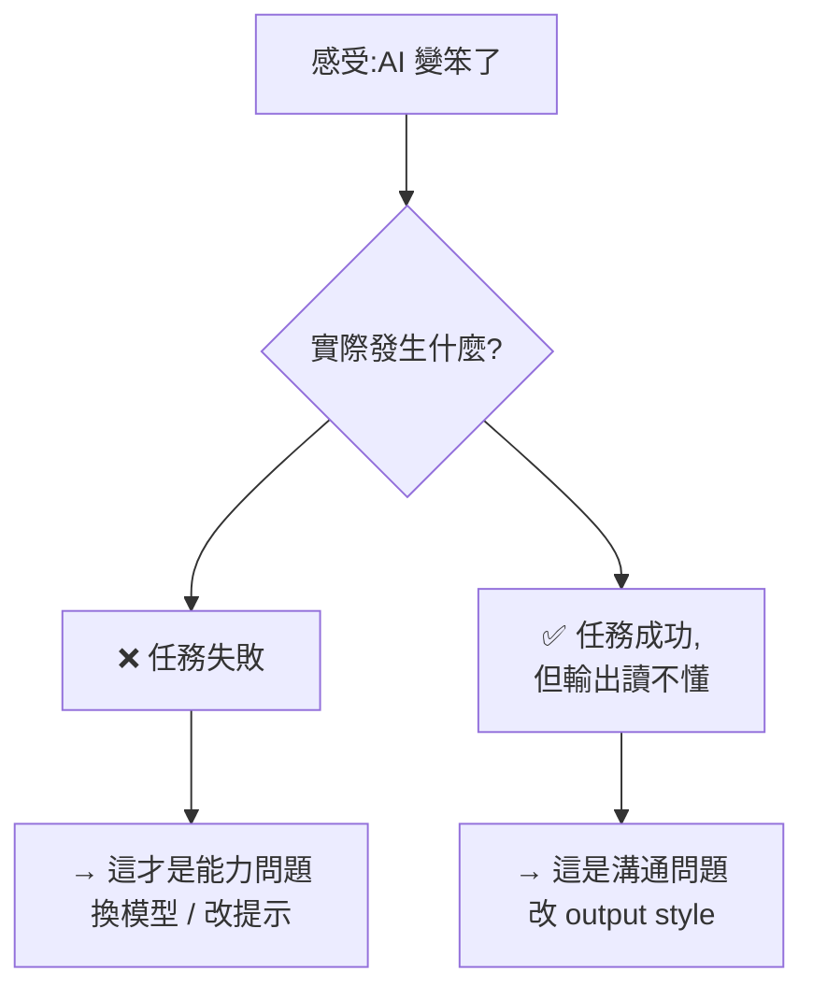
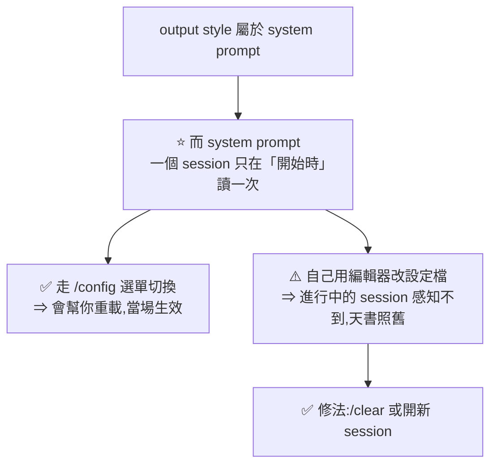
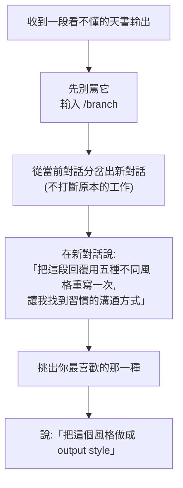

# Claude 不是變笨,是講話方式跟你對不上:用 output style 治好 AI 的囉嗦

> 整理自 YouTube 頻道 **Gary Chen**〈You Think Claude Got Dumber? You're Actually Just Missing This Setting〉(2026-08,約 11.7 分鐘,官方繁中字幕)。

> 📎 相關筆記:[[claude-md-from-zero-to-mastery]](CLAUDE.md 入門到精通)、[[model-routing-compute-allocation]](模型分工)、[[superpowers-vs-matt-skills-strong-model]](Matt Pocock 的 skills)

---

## 一句話總結

**大家抱怨「模型降智」的那些例子,幾乎沒有一個是「事情做錯了」——測試照樣過、功能照樣動,罵的全部是「看不懂它在說什麼」。既然是溝通問題,解法就不是換模型,而是給它一份「跟我說話的說明書」。**

---

## 一、先確認問題的性質:做錯了,還是說不清?

影片開頭舉了一個很傳神的例子。請 Opus 5 整理一個功能的做法,它回:

> 「這個設計的正交性保證了狀態收斂的冪等路徑,語意層的抽象已經內化在 pipeline 的攝取階段。」

**每個字都認識,合起來完全不知道在講什麼。**

這不是個案。影片引了兩個外部佐證:

| 來源 | 抱怨的內容 |
|---|---|
| 一篇在工程師圈流傳的部落格 | 讀 AI 的輸出**已經變成一種額外的認知勞動**;越來越冗長、術語密集、夾雜看似有道理的廢話 |
| **Matt Pocock**(公開發言) | Opus 5 最近講話「像天書」、非常囉嗦、一堆奇怪的 LLM 用語,每次看輸出都很痛苦 |

### ⭐ 關鍵觀察:沒有人說它「做錯了」

**測試照樣過,功能照樣動。** Matt 甚至承認他貼出來當反例的那段天書**其實是關鍵資訊**,只是讀不懂。



> **這個「做對了但說不清」與「根本做錯了」的區分,是全片最有價值的診斷步驟。**
> 影片的比喻:它像一個能力很強、但完全不會講人話的天才同事——事情做得漂亮,報告寫得像論文。
> **既然是溝通問題,解法不是把這位同事開除,而是給他一份報告格式規範。**

⚠️ **但要誠實地說:這個框架不能解釋所有「降智」抱怨。** 如果你遇到的是任務真的做錯、測試真的沒過,那 output style 幫不上忙——它**只改變說話方式,不改變寫程式的能力**。先分清楚自己屬於哪一種。

---

## 二、Lydia Hallie 的 ELI5 風格

影片的起點是 Claude Code 團隊工程師 **Lydia Hallie** 的一則推特貼文:Claude Code 可以自訂輸出風格,把指令寫成一個檔案丟進 output styles 資料夾,之後在設定裡隨時切換。

她分享的自用風格叫 **「Explain Like I'm Five」(解釋給五歲小孩聽)**,內容只有幾句話,大意是:

- 我今天累爆、腦子燒掉了,**把我當五歲小孩**
- 用**簡單的詞彙、簡短的句子**
- **只講最必要的事**
- 如果一定要用專有名詞,**講完後立刻解釋**
- 最後告訴我:**你做了什麼、有沒有成功、我接下來該做什麼**

她的使用時機很具體:**忙了一整天之後**,腦袋已經沒力氣讀長篇大論的時候。

> ⚠️ 再次強調(影片也特別提醒):**output style 只改變它跟你說話的方式,寫程式碼的能力完全不受影響。** 腦子還是同一顆腦子,只是規定了報告格式。

---

## 三、內建的 style(不用自己寫)

> ⭐⭐ **2026-08-22 更新(比對官方文件後修正)**:本節原本寫「內建四套」——**官方文件現在列的是 Default 加上四套,共五套**,新增的是 **`Concise`**。
> ⚠️ **而 `Concise` 恰恰是最貼近本篇主題(治囉嗦)的那一套** —— 兩支來源影片都沒提到它,大概是錄製時還沒有(需 **Claude Code v2.1.237 以上**)。**要治囉嗦,先試它,再考慮自己寫。**

輸入 `/config` → **Output style** 就會看到:

| Style | 特性 | 適合誰 |
|---|---|---|
| **Default** | 簡潔、有效率——你現在每天看到的樣子 | 一般狀況 |
| **Proactive** | 行動派,廢話更少,**能動手就直接動手**,不花時間多討論。官方註明這比 auto mode 的自主性引導更強,**而且不改變你的權限模式**——該問的還是會問 | 目標明確、趕進度時 |
| ⭐ **Concise**(新) | **先講結果**,跳過開場白與過程敘述,預設保持簡短;⭐ **但工程工作做得跟 Default 一樣徹底**,你要細節時它照給。⭐⭐ **而且一定完整保留:錯誤報告、安全警告、破壞性動作的確認** | ⭐ **嫌囉嗦的人的第一選擇** |
| **Learning** | 會**故意停下來留一小段程式碼讓你親手寫**(在程式碼裡放 `TODO(human)` 標記),邊用邊練 | 真的想學寫程式的人 |
| **Explanatory** | 每做一個改動都順便解釋:架構為何這樣設計、這段用了什麼 pattern、專案慣例是什麼 | 見下方 ⭐ |

> ⭐ **關於 Learning,YAHA 版補了一個很有說服力的用法**:**Lydia Hallie 自己說她所有的 side project 全開 Learning**,就是為了不讓手生。
> **如果你擔心天天用 AI 把自己用廢了,這個風格就是解藥。**

### ⭐ Explanatory 的正確用法與反效果

**該用的時候:** 接手別人的 code、進入新 repo、使用沒碰過的框架。

**千萬不要開的時候:** 做自己很熟的專案。

> **因為它會把你早就知道的事情再重複一遍——本來想解決囉嗦,結果變得更囉嗦。**

這個提醒很實在:**「解釋得更多」不等於「更好懂」,它取決於你已經知道多少。**

---

## 四、設定方式與 ⚠️ 三個坑(2026-08-22 補,已比對官方文件核實)

### 基本三步驟

1. **複製** 你要的 output style 文字
2. **貼給 Claude Code**,說「幫我把這個加進 output style」——它會自動放到正確位置
3. **輸入 `/config` → 找到 Output style → 選擇 → Enter**

不會做的話,直接請 Claude Code 手把手帶你做,或直接叫它幫你設定。

> ⚠️ **`/output-style` 這個獨立指令已經沒了** —— 官方文件註明它在 **v2.1.73 棄用、v2.1.91 移除**。現在只有兩條路:**`/config`** 或**直接編輯 `outputStyle` 設定值**。看到舊教學叫你打 `/output-style` 的,那是過期資訊。

### ⚠️⚠️ 坑一:`keep-coding-instructions` —— 這行決定它還是不是工程師

**這是 YAHA 版點出的最大坑,而官方文件完全證實。**

**背景**:Claude Code 開工前會先讀一份工作守則(system prompt),**你寫的 output style 規則是被加在這份守則的末尾**。但守則裡本來還有**一大段軟體工程規範**(官方明列:如何界定改動範圍、怎麼寫註解、如何驗證成果)。

⭐⭐ **關鍵:自訂 output style 預設會把那段工程規範「整個扔掉」——`keep-coding-instructions` 的預設值是 `false`。**

```markdown
---
name: ELI5
description: 把我當五歲小孩講話
keep-coding-instructions: true      # ⭐ 只換說話方式、程式照寫 ⇒ 必須 true
---

(以下是你的說話規則)
```

| 你的目的 | 該設什麼 |
|---|---|
| ⭐ **只想換說話方式,但程式要照樣好好寫** | **`true`** |
| 它根本不是在做軟體工程(寫作助理、資料分析) | 留空 / `false`(預設) |

> ⚠️ **預設值 `false` 是給「寫作助理」那種用途設計的。** 如果你只是嫌它囉嗦就自己寫了一套 style 卻沒加這行,**等於順手把工程規範也一起關掉了** —— 說話變好聽了,做事的品質卻默默掉了,而且不會有任何警告。

**✅ 官方 frontmatter 完整欄位:**

| 欄位 | 用途 | 預設 |
|---|---|---|
| `name` | 風格名稱 | **繼承檔名** |
| `description` | 顯示在 `/config` 選單裡的說明 | 無 |
| ⭐ `keep-coding-instructions` | 保留內建的軟體工程規範 | ⚠️ **`false`** |
| `force-for-plugin` | **僅 plugin 用**:plugin 啟用時自動套用、不需使用者選擇,**會覆蓋使用者的 `outputStyle` 設定**;多個 plugin 都設時取先載入的那個 | `false` |

> ⭐ **`force-for-plugin` 對有在維護 plugin 的人特別要注意** —— 它會蓋掉使用者自己的選擇,等於替別人決定 Claude 怎麼講話。用之前想清楚。

### ⚠️ 坑二:改檔案不會生效,要 `/clear`

**這是最容易鬼打牆的一個。**



**✅ 官方原文證實**:output style 是 system prompt 的一部分,而 Claude Code **在 session 開始時讀取一次**;變更**在 `/clear` 或新 session 之後才生效**。

> ⭐ **記住這條規矩:手動改完設定,必須 `/clear` 或重開 session。**
> 新增的風格檔要出現在選單裡,也是同一個道理。

### 📁 坑三:檔案到底放哪(⭐ 本文原先未能核實,現已由官方文件確認)

**自訂風格檔可以放三個層級**:

| 層級 | 路徑 |
|---|---|
| **使用者層** | `~/.claude/output-styles` |
| **專案層** | `.claude/output-styles` |
| 受管政策層 | 受管設定目錄下的 `.claude/output-styles` |

⭐ **專案層還有一個容易忽略的規則**:Claude Code 會從**工作目錄一路往上到 repo 根目錄**,載入沿途**每一個** `.claude/output-styles/`;**同名衝突時,離工作目錄最近的那個勝出。**

**而「當前選了哪一套」記在哪**:走 `/config` 選單挑選時,Claude Code 把選擇存到 **`.claude/settings.local.json`**(專案本地層級)。也可以直接編輯:

```json
{ "outputStyle": "Explanatory" }
```

---

## 四之二、⭐ 官方文件補充的三件事(兩支影片都沒提)

### ⭐⭐ ① 它只作用於「主對話」——subagent 不受影響

**這是最容易誤解的範圍限制:**

| 對象 | output style 有效嗎 |
|---|---|
| 主對話 | ✅ 有 |
| ⚠️ **subagent** | ❌ **無效** —— subagent 跑自己的 system prompt |
| **fork** | ✅ **有效**(例外)—— 因為 fork 繼承母對話的完整 system prompt |

> ⚠️ **實務意義**:如果你把工作大量丟給 subagent,**那些回覆不會照你的風格走**。覺得「明明設了卻沒用」時,先確認那段輸出到底是誰產的。
> ⭐ 而這也解釋了為什麼 `/branch`(fork)那招會成立 —— **fork 繼承完整 system prompt,所以在副本裡測風格才有意義。**

### ② token 成本:有兩個方向,不是只有省

| 面向 | 影響 |
|---|---|
| **輸入** | ⚠️ 加規則到 system prompt ⇒ **input token 增加**;但 **prompt caching 會在第一次請求之後把成本壓下來** |
| **輸出** | ⭐ **Explanatory 與 Learning 是「設計上就會更長」** ⇒ output token 增加;**`Concise` 則相反** |
| 自訂風格 | 取決於你叫它產出什麼 |

> ⭐ **這條直接接上 [[token-saving-three-moves-context-control]] 的「輸出比輸入貴」**:選 Explanatory 是**主動買貴**換學習效果 —— 值得,但要知道自己在買什麼。**而在自己熟的專案開 Explanatory,就是純粹花錢買你已經知道的事。**

### ③ ⭐ 這五個功能到底該用哪一個

官方給了一張很好用的對照表:

| 功能 | 怎麼運作 | 什麼時候用 |
|---|---|---|
| ⭐ **Output style** | **直接改 system prompt**,每一次回覆都套用 | 你要的是**不同的角色、語氣或預設輸出格式** |
| **CLAUDE.md** | 在 system prompt **之後**加一則 user message | Claude 應該一直知道你的**專案慣例與程式庫脈絡** |
| `--append-system-prompt` | **附加**到 system prompt,不移除任何東西 | 單次呼叫的一次性追加 |
| **Agents** | 跑一個有自己 system prompt / 模型 / 工具的 subagent | 要一個**獨立範圍**的助手處理特定任務 |
| **Skills** | 被叫用或判定相關時載入任務專屬指示 | 你有一個**可重複使用的工作流** |

⭐⭐ **兩個關鍵區分值得記:**
1. **output style 是「改寫」system prompt,`--append-system-prompt` 是「附加」** —— 前者會拿掉東西(見坑一),後者不會。
2. **講「你的專案是什麼」用 CLAUDE.md,講「你希望它怎麼說話」用 output style。** 混用是很多人 CLAUDE.md 越寫越肥的原因之一 —— 參見 [[claude-md-cut-82-percent-and-maintain-it]]。

> 📎 官方另有一頁 `debug-your-config` 專門處理「output style 沒生效」的診斷。

---

## 五、⭐ 怎麼生成「屬於你自己」的風格

因為每個人偏好的溝通方式不一樣,影片給了一套很聰明的做法:



**用 `/branch` 是這招的精髓**——你拿一段**真實的、你剛剛才讀不懂的輸出**當素材去比較,而不是憑空想像自己喜歡什麼風格,而且不會打斷手上的工作。

---

## 六、意外收穫:一個航太業的老標準

作者用上面那招時,發現了 **STE100(Simplified Technical English,簡化技術英文)**——這是**歐洲航太工業幾十年前訂的寫作標準**。

**為什麼會有這個標準?** 因為飛機維修手冊如果寫得讓人看不懂,維修人員做錯一步**就可能出人命**。

規矩很簡單:

- **句子要短**
- **一句話只講一個動作**
- **詞彙表要固定,而且一個詞只能有一個意思**

> **影片最有洞見的一句:技術文件寫到沒人看得懂,不是 AI 時代才出現的問題,而是工程界幾十年前就付出過代價、並且已經解決過的老問題。**
> **現在把這套成熟的解法拿來管理 AI 的說話方式,非常有意思。**

(補充:這個標準的正式名稱是 **ASD-STE100**,由歐洲航太與國防工業協會 ASD 維護。)

---

## 七、另一條路:Matt Pocock 的「wait what」skill

Matt Pocock 針對同一個問題的做法**不是 output style,而是一個叫 `wait what` 的 skill**。

差別在觸發方式:

| | output style | Matt 的 skill |
|---|---|---|
| 性質 | **常駐的說話規則** | **需要才用的翻譯功能** |
| 觸發 | 設定後每次輸出都生效 | AI 又開始講天書時**才召喚**——等於跟它說「蛤?你剛剛到底在說什麼?」 |
| 適合 | 覺得**每一次**輸出都艱澀難懂 | 覺得**只有少數時候**難懂 |

**有趣的是:這個 skill 裡面用的正是 STE100 標準**,再加上額外要求 AI **用你專案裡的詞彙**說話。

> **兩條路可以並存**:平常掛一套溫和的 output style,遇到特別難懂的再召喚翻譯。

---

## 八、⭐⭐ 三套實際設計案例與背後原則

影片作者的團隊自己設計了三套,依技術背景切分。**這一段是全片最可直接抄的部分。**

### ① 技術翻譯機(給純技術小白)

**設計出發點:小白最大的風險不是學得慢,是不知道自己正在做什麼。**

| 規則 | 理由 |
|---|---|
| **術語每次出現都用白話解釋** | ⚠️ 重點是「術語不要省略,而是要被解釋」 |
| 抽象概念用生活比喻(例:API 就像餐廳幫你點餐的服務生) | 建立直覺 |
| **會刪資料、會花錢、會動到正式環境的動作,先停下來用白話警告,等你點頭才動手** | 小白分不出哪些操作有風險 |

> **第一條的理由特別值得記:如果 AI 直接跳過所有術語,你用一年還是不知道什麼是 migration、什麼是 endpoint,之後看文件、跟工程師溝通都會卡住。**
> **AI 在進步,但你的技術認知並沒有進步。** 所以是「解釋術語」,不是「避開術語」。

### ② STE100 簡報版(給 vibe coder / 軟體 PM)

**設計出發點:這群人不需要學寫 code,他們需要的是精準的資訊拿去做決策。**

- 句子要短、**主動語態**、一個詞只有一個意思(直接套航太標準)
- **API、前後端、資料庫這種等級的詞:直接用,不解釋**
- **工程內部細節(migration、race condition):第一次出現給一行解釋**
- **每個改動必須講清楚:動到哪個功能、使用者會看到什麼變化**
- **要決策時,選項排成 trade-off**(A 快但有風險、B 慢但穩),然後給建議

> 注意這裡的分層很細緻:**不是「全部解釋」或「全部不解釋」,而是按詞彙的常見程度分兩級。**

### ③ 工程師版(從 ELI5 延伸)

**設計出發點:工程師缺的不是理解力,是注意力。**

- 像一個同事**站在你桌邊講話**:先講改了什麼、能不能動,**細節你要再問才給**
- **只要它做了你可能有意見的判斷**(例如沒問過你就把某個東西關掉),**必須放在第一句講,不准埋在報告最後面**

> **這一套的理由是全片最狠的一段:**
> **AI 丟給你一千字的輸出,你根本不會讀,只會眼睛掃過去、心裡想「應該沒問題吧」,然後按下確認。**
> **當輸出縮到幾行,你才會真的每一行都讀進去,才能擋住該擋下來的東西。**

**這已經不只是閱讀舒適度的問題,而是安全問題**——冗長的輸出會直接削弱人類的審查能力。

### ⭐ 三套共用的設計原則

> **光跟它說「講簡單一點」是沒有用的——它只會把長廢話換成短廢話。**

真正有效的兩件事:

1. **把你喜歡的溝通方式精鍊成「原則」**,而不是形容詞
2. **叫它用你的詞彙說話** —— 你的專案裡把使用者叫 `member`,就規定它不准叫 `user`。**它講的話越貼近你慣用的語言,你讀起來越不費力**

---

## 九、兩個進階玩法

### ① output style 跟著專案走

影片說 output style 存在**每個專案的 `settings.local.json`** 裡,所以 A 專案掛一套、B 專案掛另一套,互不影響。

實際搭配建議:

| 情境 | 掛哪套 |
|---|---|
| 新接觸的專案 | `Explanatory`,邊做邊學 |
| 趕時間 / vibe coding 隨便玩 | 言簡意賅的那套,衝進度 |
| 下班前或加班中 | Lydia 的 ELI5,讓自己頭不那麼痛 |

✅ **2026-08-22 更新:儲存路徑已由官方文件確認**(本文原先標記為未能核實)——**風格檔**放在三個層級的 `output-styles/` 目錄(使用者 `~/.claude/output-styles`、專案 `.claude/output-styles`、受管政策),**當前選用的風格**記在 **`.claude/settings.local.json`** 的 `outputStyle` 鍵。詳見第四節坑三。

> ⭐ **所以「跟著專案走」這個玩法是成立的**,而且比影片說的更細:**專案層會從工作目錄一路往上載入每一層的 `output-styles/`,同名時最接近工作目錄的勝出** —— monorepo 裡各子專案可以各有一套。

### ② 它不是設定一次就用到底的東西

> **你的能力會進步。三個月前需要解釋的概念,現在可能已經變成常識了。** 這時就把 style 的技術密度往上調。

影片說 Claude Code 團隊自己也是這樣用的:**不同專案、不同任務,甚至當天累不累,都會切換不同的 style。**

比喻很好:**就像同一首歌,有時想大聲、有時想小聲、有時開降噪、有時開通透——隨時調到自己耳朵最舒服的狀態。**

---

## 應用案例

### 案例 1|先做一次「診斷」,再決定要不要調

下次覺得「Claude 又變笨了」,先花 30 秒分類:

```
① 任務有沒有真的完成?測試過了嗎?功能動了嗎?
   → 沒有:這是能力/提示詞問題,output style 幫不上忙
   → 有:繼續問 ②

② 我讀完之後,知道它做了什麼嗎?
   → 不知道:✅ 這就是 output style 要解的問題
   → 知道但覺得太囉嗦:✅ 一樣是 output style
```

⚠️ **不要把所有不順都歸給「模型降智」。** 這個分類本身就能省下很多無謂的換模型與抱怨。

### 案例 2|用真實素材生成自己的風格(照抄 `/branch` 那招)

不要憑空寫 style。等到下次真的被一段輸出卡住時:

```
/branch

我想建立自己的 Claude Code Output Style。
請把上面那段回覆,用五種明顯不同的風格各重寫一次,
每種風格開頭先用一句話說明它的設計原則。
我要找出讀起來最不費力的一種。
```

挑好之後再說「把這個風格做成 output style」。

**用真實的、你剛剛才讀不懂的那段輸出當素材,比任何範本都準。**

### 案例 3|把「風險動作要先停」寫進去,不只給小白

技術翻譯機那條「會刪資料、會花錢、會動到正式環境的動作,先停下來警告」——**這條不該只給小白**。

工程師版那條「做了你可能有意見的判斷,必須放在第一句講」是同一件事的另一種寫法。兩條可以合併成一條通用規則寫進任何 style:

```markdown
## 必須放在回覆第一行的事(不准埋在後面)
- 任何刪除、覆寫、花錢、動到正式環境的動作 → 先問,等我同意
- 任何我沒要求、但你自己做的決定(關掉某功能、改了設定、跳過某步驟)
- 任何你做不到而繞道處理的事 → 明說繞了什麼,不要假裝完成
```

> 第三條呼應 [[agent-skill-three-layer-run-do-verify]] 的教訓:**降級要明說,靜默降級最危險。**

### 案例 4|「用我的詞彙說話」可以擴展成專案術語表

「使用者叫 member 不叫 user」這條可以系統化。在 `CLAUDE.md` 裡開一節:

```markdown
## 本專案用語(回覆時一律使用左欄,不要用右欄)
| 用這個 | 不要用 |
|---|---|
| member | user, customer |
| 訂閱方案 | plan, tier, subscription |
| 對帳單 | invoice, statement |
```

**好處不只是讀起來順**:當 AI 用你的詞彙說話,你更容易發現它其實誤解了領域概念——**用錯詞往往是理解錯的第一個徵兆**,而統一詞彙會讓這個徵兆浮出來。

### 案例 5|對照本倉庫:caveman 模式其實就是一套 output style

本 session 一直開著 caveman 模式(壓縮輸出、去除贅語、保留全部技術實質),**這本質上就是影片講的東西**——只是實作在 hook 而不是 output style。

而它印證了影片的核心原則:**它不是叫我「講簡單一點」,而是把規則精鍊成具體條款**——刪冠詞、刪填充詞、片語可接受、技術術語必須完整保留、程式碼與 commit 訊息照常寫。

⚠️ 也印證了「沒有絕對好壞」:同一份規則在**安全警告、不可逆操作確認、多步驟順序說明**時會自動退場(auto-clarity),因為那些場景**壓縮會製造歧義**。

> **任何 output style 都該想清楚:什麼時候它應該讓路。**

---

## 重點回顧(TL;DR)

1. **先分清楚是「做錯了」還是「說不清」。** 那些抱怨幾乎都是後者——測試照樣過,罵的是看不懂。Matt Pocock 貼的天書範例,他自己承認**那段其實是關鍵資訊**。
2. **output style 只改變說話方式,不影響寫程式的能力。** 同一顆腦子,換一種報告格式。
3. **Lydia Hallie(Claude Code 團隊)的 ELI5**:當我五歲、簡單詞彙、短句、只講必要的、術語講完馬上解釋、最後說「做了什麼/成不成功/我下一步做什麼」。
4. **內建五套(⭐ 已依官方文件修正,原寫四套)**:Default / Proactive(少廢話直接動手)/ ⭐ **Concise(先講結果、預設簡短,但工程做得跟 Default 一樣徹底,且一定完整保留錯誤報告與安全警告)** / Learning(留 `TODO(human)` 給你寫)/ Explanatory(每個改動都解釋)。⚠️ **`Concise` 是最貼近「治囉嗦」的那一套,兩支影片都沒提到(需 v2.1.237+)—— 自己動手寫之前先試它。**
5. **⚠️ Explanatory 只該用在不熟的專案。** 熟悉的專案開了會把你早就知道的事重講一遍——**本來想解決囉嗦,結果更囉嗦**。
6. **⭐ 生成自己的風格用 `/branch`**:拿一段真實讀不懂的輸出,叫它用五種風格重寫,挑一種做成 style。不打斷原本工作。
7. **STE100(ASD-STE100)**:歐洲航太幾十年前的寫作標準——短句、一句一動作、固定詞彙表且一詞一義。**技術文件沒人看得懂不是 AI 時代的新問題,工程界早就付出過代價並解決過。**
8. **Matt Pocock 的 `wait what` skill** 是另一條路:**常駐規則 vs 按需翻譯**。該 skill 內部用的正是 STE100 + 「用你專案的詞彙」。
9. **⭐⭐ 三套設計案例**:小白版(術語要解釋不是省略 + 風險動作先停)、vibe coder 版(詞彙分兩級 + 改動要說使用者看到什麼 + 選項排 trade-off)、工程師版(先講改了什麼 + **可能有意見的判斷放第一句**)。
10. **⭐ 核心原則:光說「講簡單一點」沒用,它只會把長廢話換成短廢話。** 要(a)把偏好精鍊成**原則**,(b)**叫它用你的詞彙**。
11. **最狠的一句**:AI 丟一千字你根本不會讀,只會掃過去心想「應該沒問題吧」然後按確認。**輸出縮到幾行,你才會真的讀進去,才擋得住該擋的東西。** —— 這是安全問題,不只是舒適度。
12. **不是設定一次就用到底**:能力會進步,技術密度要往上調;不同專案、不同任務、甚至當天累不累都可以切換。
13. ⚠️⚠️ **最大的坑:`keep-coding-instructions` 預設是 `false`。** 自訂 output style **預設會把內建的軟體工程規範整個扔掉**(官方明列:如何界定改動範圍、怎麼寫註解、如何驗證成果)。**只想換說話方式就必須寫 `keep-coding-instructions: true`** —— 否則說話變好聽,做事品質默默掉,而且**不會有任何警告**。
14. ⚠️ **改設定檔不會當場生效**:output style 屬於 system prompt,**一個 session 只在開始時讀一次**。走 `/config` 選單切換會重載(當場生效);**自己用編輯器改檔案,要 `/clear` 或重開 session**。新風格檔要出現在選單裡也是同理。
15. ⚠️ **`/output-style` 獨立指令已在 v2.1.73 棄用、v2.1.91 移除** —— 現在只能用 `/config` 或直接改 `outputStyle` 設定值。
16. **📁 檔案位置(官方確認)**:風格檔放 `~/.claude/output-styles`(使用者)或 `.claude/output-styles`(專案);⭐ **專案層會從工作目錄一路往上載入每一層,同名時最近的勝出**。選用的風格記在 `.claude/settings.local.json`。
17. ⭐⭐ **範圍限制:output style 只作用於主對話,subagent 不受影響**(它跑自己的 system prompt);**fork 是例外**,因為繼承母對話的完整 system prompt —— 這也正是 `/branch` 那招能成立的原因。
18. **token 成本有兩個方向**:規則進 system prompt ⇒ input 增加(prompt caching 會攤掉);而 **Explanatory / Learning 設計上就會產出更長的回覆 ⇒ output 增加,`Concise` 相反**。⭐ **在自己熟的專案開 Explanatory,是純粹花錢買你已經知道的事。**
19. ⭐ **該用哪個功能**:要**不同角色/語氣/預設格式** ⇒ output style(**改寫** system prompt);要它知道**專案慣例** ⇒ CLAUDE.md(在 system prompt 之後加 user message);一次性追加 ⇒ `--append-system-prompt`(**附加**、不移除);獨立範圍的助手 ⇒ Agents;可重用工作流 ⇒ Skills。

---

## 來源

- [You Think Claude Got Dumber? You're Actually Just Missing This Setting — Gary Chen](https://www.youtube.com/watch?v=E8Bx9OlpmdM)(2026-08,約 11.7 分鐘,官方繁中字幕)
- ⭐ [你以為 Fable 5 降智了?我實測在 ClaudeCode 加一行設置,AI 瞬間說人話 — YAHA学堂](https://youtu.be/nlNDzop6tBw)(2026-08-22,約 6.5 分鐘,官方 zh 字幕)—— **第四節的三個坑來自此片**(`keep-coding-instructions`、改檔案要 `/clear`、選單重載);另提供實測對比:同一問題預設風格 700 多字,換 ELI5 後不到 400 字
- ⭐ [Claude Code 官方文件:Output styles](https://code.claude.com/docs/en/output-styles) —— **已比對核實**:五種內建風格(含本文原先漏掉的 `Concise`)、frontmatter 四個欄位與 `keep-coding-instructions` 預設 `false`、三個層級的檔案路徑與就近優先規則、`/output-style` 的棄用與移除版本、**subagent 不套用 / fork 例外**、token 成本方向、以及與 CLAUDE.md / `--append-system-prompt` / Agents / Skills 的對照表
- 影片引用:Claude Code 團隊工程師 **Lydia Hallie** 的推特貼文(ELI5 output style)、**Matt Pocock** 對 Opus 5 輸出風格的公開評論與其 `wait what` skill
- [ASD-STE100 Simplified Technical English](https://www.asd-ste100.org/)(歐洲航太與國防工業協會維護的寫作標準)
- 本倉庫相關筆記:[[claude-md-from-zero-to-mastery]]、[[superpowers-vs-matt-skills-strong-model]]、[[agent-skill-three-layer-run-do-verify]]

> ✅ **2026-08-22:本文原先標記「未能就地核實儲存路徑」的部分,已比對官方文件確認並寫進第四節坑三。**
> ⚠️ 但**版本差異仍然存在** —— `Concise` 需 v2.1.237 以上、`/output-style` 在 v2.1.91 後已移除。**可用選項請以你當下的 `/config` 選單為準**;官方另有 `debug-your-config` 一頁專門診斷「output style 沒生效」。
