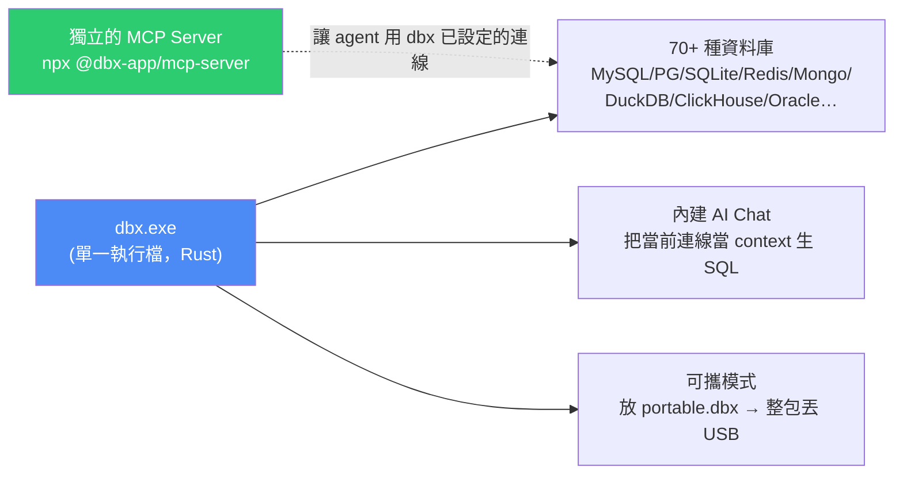

# dbx:單一執行檔的跨平台資料庫客戶端(Rust 寫)+ 內建 MCP Server 讓 Agent 直接操作資料庫

> 整理自 YouTube 頻道 **Jerry's Productivity Tech Channel(簡睿學堂)**〈工程師必備!dbx 輕量資料庫工具 + MCP Server 讓 AI Agent 直接操作資料〉(2026-07-06,約 10.5 分鐘,官方繁中字幕);技術細節另**直接 clone [`t8y2/dbx`](https://github.com/t8y2/dbx) 讀 README 與 repo 結構**核實。
>
> 一句話:**70+ 種資料庫、20MB、一個執行檔。不需要 Java Runtime,不需要安裝,還內建 AI Chat 與獨立的 MCP Server。**

---

## 一句話總結



---

## 一、它跟 DBeaver / DataGrip 差在哪

| | DBeaver / DataGrip / Aqua Data Studio | **dbx** |
|---|---|---|
| 執行環境 | **需要 Java Runtime** | **一個執行檔就跑**(Rust 開發) |
| 體積 | 大 | **約 20MB** |
| 平台 | 跨平台 | Windows / macOS / Linux,**另有 Web 介面** |
| 授權 | 多為商業或有限制 | **開源、免費** |
| 資料庫支援 | 多 | **70+ 種** |

> 影片的評語:**「在使用便利性上,可以說是沒有人有辦法可以跟它比較的。」**
>
> 實務上最有感的場景是**去客戶端維護**——不用安裝、不用考慮授權問題,執行檔丟過去就能用。

### 可攜模式的做法(很簡單)

**執行檔旁邊放一個 `portable.dbx` 檔案**,dbx 就會自動進入可攜狀態:在同層產生 `data/` 子目錄、裡面用 `dbx.db` 存連線等設定。整包複製到 USB 或客戶主機即可直接執行。

---

## 二、AI Chat 設定(影片示範用 OpenCode)

設定路徑:右上角 **設定 → AI**。

| 欄位 | 說明 |
|---|---|
| **Provider** | Claude 選 Claude、OpenAI 選 OpenAI;**用 OpenCode 這類相容端點就選 `OpenAI Compatible`** |
| **API Key** | 填入 |
| **Endpoint** | 影片示範 OpenCode 用 `https://opencode.ai/zen/go/v1` —— ⚠️ **`/v1` 一定要帶上** |
| **Model** | 點「重整」按鈕拉模型清單再選(影片用 `deepseek-v4-pro`) |
| 驗證 | 先 **Apply**,再點左下角 **Test** 確認 |

**設定完成後,它會把「當前連線資訊」當作 context 跟 AI 對話** —— 所以你可以直接問「幫我寫一句查某某資料的 SQL」,它知道你的表結構。

---

## 三、MCP Server:讓 AI Agent 直接操作資料庫

這是影片標題強調、也是 dbx 跟傳統工具拉開差距的地方。**原始碼補充的幾個關鍵細節值得注意:**

### ⚠️ MCP Server 是「獨立發布」的

> **安裝 dbx 桌面版「不會」自動安裝 MCP 執行檔。**

```bash
npx @dbx-app/mcp-server
```

`.mcp.json` 設定:

```json
{
  "mcpServers": {
    "dbx": { "command": "npx", "args": ["-y", "@dbx-app/mcp-server"] }
  }
}
```

### ⭐ 權限模型:三段式 + 中央政策(這段最重要)

在 **DBX Settings → MCP** 管理**連線白名單**與三種模式:

| UI 名稱 | 機器值 |
|---|---|
| **Read only** | `read_only` |
| **Data read/write** | `safe_write` |
| **Full access** | `high_risk_write` |

> ⭐ **設計上很嚴謹的一點**:舊的環境變數 `DBX_MCP_ALLOW_WRITES=0` 只在「中央 MCP 政策第一次被儲存之前」保有唯讀限制的相容性;**它永遠不能用來開啟寫入,也不能覆蓋已儲存的政策。**
>
> 也就是說 —— **權限只能從 UI 的中央政策收緊,不能靠環境變數偷偷放寬。** 這正是本庫 [[qm-yc-multiplayer-agent-harness]] 講的「較窄的 scope 只能更嚴」同一種思路。

**能力**:列出連線、瀏覽資料表、執行 SQL,**還能直接在 dbx UI 裡開啟資料表**。相容 Claude Code、Cursor、Windsurf 等任何 MCP client。

### 部署變體

| 情況 | 額外設定 |
|---|---|
| **Windows 可攜版** | MCP config 要加 `DBX_DATA_DIR`,指向 `DBX.exe` 旁的 `data` 目錄(含 `dbx.db` 那個) |
| **Web / Docker 部署** | 指向 Web 後端 API:`DBX_WEB_URL`;若登入頁需要密碼再加 `DBX_WEB_PASSWORD` |
| **離線 / 伺服器環境** | 有預編譯原生 binary(macOS/Linux/Windows),**不需要 Node.js**(npm 安裝其實只是用 Node launcher 包同一個 Rust binary) |

### 另有獨立 CLI

```bash
npm install -g @dbx-app/cli
# 或 brew tap t8y2/dbx && brew install dbx-cli
dbx connections list --json
dbx query local "select 1" --json
```

**`--json` 輸出** = 適合接進腳本與 agent workflow。

---

## 四、影片的實際示範

### 建立 SQLite 連線

`New Connection` → **60+ 種資料庫可選**(輸入 `SQLite` 搜尋)→ 填名稱、給顏色標記 → 選 `.db` 檔位置。

> 💡 **想建記憶體資料庫就在路徑填 `:memory:`**。
>
> 連線建好後右鍵 → `New Query` 開查詢分頁;`Ctrl+Enter` 執行;結果格可直接雙擊修改,**但記得按 Commit 才會寫回資料庫**。

### ⭐ 用 DuckDB 直接查 CSV / JSON(這招最實用)

**場景**:有一個很大的 CSV,用文字編輯器搜尋效率很差。

**做法**:建一個 **DuckDB** 連線(路徑可 `:memory:`,或新建一個 `.duckdb` 檔把結果存下來),然後直接 SQL 查檔案:

```sql
-- 直接查 CSV（路徑用單引號包起來）
SELECT * FROM 'C:/path/Northwind/CSV/Customers.csv';

-- 想變成正式資料表就套上 CREATE TABLE ... AS
CREATE TABLE Customers AS
SELECT * FROM 'C:/path/Northwind/CSV/Customers.csv';

-- JSON 同理，改副檔名即可
SELECT * FROM 'C:/path/Northwind/JSON/Customers.json';
```

建表後在連線上按 **F5 重整**就看得到。

> ⚠️ **直接查檔案時是唯讀的**(不能改);要能改就先 `CREATE TABLE ... AS` 落地成資料表。

---

## 五、應用案例

### 案例 1|把「大 CSV 查詢」從文字編輯器搬到 DuckDB

這是最低門檻、最高頻的用法:**任何超過幾萬行的 CSV/JSON,用 SQL 查都比 Ctrl+F 快得多**,而且能做 group by、join、聚合。

不需要先建表、不需要 import wizard —— **直接 `SELECT * FROM '檔案路徑'`**。光這一招就值得裝一次。

### 案例 2|給 agent 資料庫存取權時,權限要「只能收緊」

dbx 的 MCP 權限設計值得抄:**三段式模式(唯讀 / 資料讀寫 / 完全存取)+ 中央政策 + 連線白名單,而且環境變數永遠不能放寬已儲存的政策。**

反面教材是很多人給 agent 一組 DB 連線字串就完事 —— **那等於直接給 full access**。至少要做到:①預設唯讀 ②白名單限定哪些連線可見 ③寫入權限要顯式開啟且集中管理。

📌 對照本庫 [[google-agentic-engineering-day4-5]] 的 zero-trust 三層與 [[loop-vs-graph-debate-engineering-view]] 的「涉及權限與不可逆操作必須交給確定性規則」——**資料庫是最典型的不可逆操作面**。

### 案例 3|去客戶端 / 受限環境時的工具選擇

可攜模式(`portable.dbx` + `data/`)解決的是一個很真實的問題:**客戶主機不讓你裝軟體、或沒有 Java 環境**。單一執行檔 + 免費授權,這個組合在顧問與維運場景很有價值。

⚠️ 但要提醒自己:**把資料庫工具帶進客戶環境,連線設定會存在 `dbx.db` 裡** —— 離開前記得清理,別把客戶的連線資訊留在 USB 上或帶走。

### 案例 4|CLI 的 `--json` 適合接進自動化

`dbx connections list --json` / `dbx query local "..." --json` 這種輸出,可以直接接進 agent 的工具鏈或 CI 腳本 —— **比讓 agent 自己拼 DB driver 連線穩定得多**,而且權限受 dbx 的中央政策管。

### 案例 5|本倉庫的關聯

我們目前沒有資料庫類的工作流,所以 dbx 對本 repo 沒有直接用途。**但它的 MCP 權限模型是目前看過最完整的一個實例**,可以當成日後評估任何「給 agent 接資料源」的參考基準:**有沒有白名單?有沒有分級?環境變數能不能繞過?**

---

## 重點回顧(TL;DR)

- **dbx = Rust 寫的資料庫客戶端**,**70+ 種資料庫、約 20MB、單一執行檔**;不像 DBeaver/DataGrip 需要 Java Runtime。開源免費、跨平台(另有 Web 介面)。
- **可攜模式**:執行檔旁放 `portable.dbx` → 自動在 `data/` 建 `dbx.db` 存設定,整包丟 USB 或客戶主機。
- **內建 AI Chat**:把當前連線當 context 生 SQL;設定時 provider 選對(相容端點選 `OpenAI Compatible`),**Endpoint 記得帶 `/v1`**,先 Apply 再 Test。
- **⭐ MCP Server 是獨立發布的**(裝桌面版不會自動裝):`npx @dbx-app/mcp-server`;能列連線、瀏覽表、執行 SQL、在 UI 開表;支援 Claude Code / Cursor / Windsurf。
- **⭐ 權限模型**:Settings → MCP 管**連線白名單** + 三段式模式(`read_only` / `safe_write` / `high_risk_write`);**環境變數永遠不能放寬已儲存的中央政策,只能在政策首次儲存前維持唯讀相容**。
- **部署變體**:可攜版要設 `DBX_DATA_DIR`;Web/Docker 要設 `DBX_WEB_URL`(+ 密碼);有免 Node.js 的原生 binary;另有 `@dbx-app/cli`(`--json` 輸出適合腳本)。
- **⭐ 最實用的一招**:建 DuckDB 連線後**直接 `SELECT * FROM '檔案路徑.csv'`** 查大型 CSV/JSON,不必建表;要能改再 `CREATE TABLE ... AS` 落地。

---

## 來源

- Jerry's Productivity Tech Channel / 簡睿學堂(YouTube),〈工程師必備!dbx 輕量資料庫工具 + MCP Server 讓 AI Agent 直接操作資料〉(2026-07-06,約 10.5 分鐘):<https://youtu.be/h0lDdWYreSw>
  - 本文依該片**官方繁體中文字幕**整理(非 Whisper 轉錄)。影片時間軸:00:00 開場 / 02:13 UI Layout / 02:47 AI 設定 / 04:12 建立 SQLite 連線 / 06:44 查詢 CSV & JSON / 09:55 結語。
  - 作者的解說文章:<https://jdev.tw/blog/9228/>
- **專案原始碼**(MCP 權限模型、部署變體、CLI 等細節據此核實):<https://github.com/t8y2/dbx>
  - repo 結構:`crates/`(dbx-core / dbx-cli / dbx-mcp / dbx-web)、`apps/desktop`、`agents/`、`deploy/`。
  - ⚠️ 影片錄於 2026-07-06,repo 持續更新中(例如資料庫支援數從影片的「60 多種」到 README 現稱 70+);實際採用請以最新 README 為準。
- 範例資料:Northwind 資料庫(GitHub 可搜到並下載)。
- 延伸(本庫):[qm(YC 開源)的 scope 與安全姿態](../ai-agents/applications/qm-yc-multiplayer-agent-harness.md) · [Google 課程 Day 4+5:zero-trust 三層](../ai-agents/foundations/google-agentic-engineering-day4-5.md) · [Loop 與 Graph 之爭](../ai-agents/foundations/loop-vs-graph-debate-engineering-view.md)(不可逆操作交給確定性規則) · [MCP 史上最大改版](../ai-agents/foundations/mcp-2026-07-28-stateless-rewrite.md)
