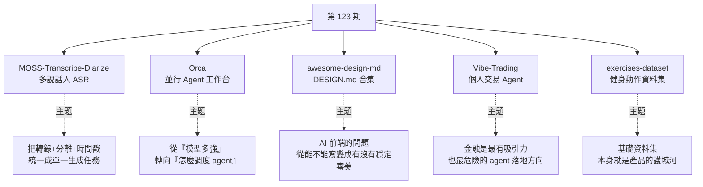

# 第 123 期:多說話人 ASR、並行 Agent 工作台、DESIGN.md 合集、AI 交易 Agent 與健身動作資料集

> GitHub 一週熱點第 123 期(2026/7/12 – 2026/7/18)。本期主軸:用 **0.9B 小模型**拿下多說話人轉錄第一名的 ASR、把多個 CLI Agent 並排跑的**工作台**、把知名網站視覺風格萃取成 **DESIGN.md** 的合集、港大開源的**個人交易 Agent**,以及 1324 個動作的**健身資料集**。

---

## 本期速覽

---

## 1. MOSS-Transcribe-Diarize —— 0.9B 的多說話人 ASR

- **連結:** <https://github.com/OpenMOSS/MOSS-Transcribe-Diarize>
- **要解決什麼:** 多說話人轉錄一直是語音辨識的難題——一場會議要同時處理環境噪音、多人分離、重疊發言,還要讓說話人身分**從頭到尾識別正確**。

**核心思路(這是它跟傳統做法的根本差異):**

| | 傳統做法 | MOSS-Transcribe |
|---|---|---|
| 架構 | ASR 一套系統 + 說話人分離另一套,最後**把結果對齊** | **把轉錄、說話人歸屬、時間戳預測統一建模成一個自迴歸生成任務** |
| 問題 | 流程複雜、容易錯位 | 輸入原始音訊,直接輸出 `[時間][S01]內容[時間]` 的結構化結果 |

**成績:** 2026-07-14 拿下 INTERSPEECH 2026 第二屆 MLC-SLM Challenge 第一名(涵蓋 14 種語言)。與 Doubao、ElevenLabs、Gemini、VibeVoice 相比,在**字元錯誤率(CER)**、**多說話人綜合字元錯誤率(cpCER)**、**說話人歸屬穩定性(Δcp)** 三項核心指標上均為最佳;在 OPENASR Leaderboard 取得全球開源模型第一。

**規格與部署:** 0.9B 模型配 **128k token 上下文視窗**,可直接處理約 **90 分鐘**的連續音訊。有線上 demo;可從 Hugging Face 下載模型,官方推薦用 SGLang Omni 或 vLLM 部署,工具包內建本地字幕工作流(上傳、審閱、字幕匯出)。另有基於更大模型的 pro 版 API。

**適用場景:** 會議紀要、Podcast 切片、長影片拆條。**0.9B 的體積對本地執行非常友善。**

> 📌 **本庫已有專門評估**:[[moss-transcribe-diarize-evaluation]] —— 針對「這個模型對我們的 YouTube 逐字稿流程有沒有幫助」做過評估,結論是**維持 faster-whisper**(我們的素材多為單人講述、痛點是幻覺迴圈而非說話人分離,且 MOSS-TD 是為 GPU 設計而我們的管線是 CPU-only)。

---

## 2. Orca —— 並行 AI Agent 工作台

- **連結:** <https://github.com/stablyai/orca>
- **定位:** 不是新模型、也不取代 Claude Code / Codex / OpenCode,而是**把這些 CLI Agent 放進同一個桌面工作台統一管理**。

**要解決的痛點:** 同一件事想同時開多個 Agent 各做一個方案再比較,方法有效但**手動管理很麻煩**——要開多個終端、多個 worktree、記住每個 Agent 改了什麼、自己切來切去看 diff。

**做法:** 讓 Codex、Claude Code、OpenCode、Cursor Agent、Copilot CLI 等並排執行,**每個 Agent 在自己的 git worktree 裡工作**;同一個需求發給多個 Agent 並行做,在一個介面看結果,挑最好的合併。

**值得注意的功能:**

| 功能 | 說明 |
|---|---|
| Parallel Worktrees | 每個 agent 獨立 worktree,互不干擾 |
| Terminal Splits | 多終端並排 |
| GitHub / Linear 整合 | 任務與 PR 串起來 |
| AI diff 評論 | 自動對差異給意見 |
| 遠端 SSH worktree | 在遠端機器上跑 |
| **手機端** | 電腦啟動任務、手機收到完成通知再跟進 |
| **Design Mode** | 在真實 Chromium 視窗點選 UI 元素,把 **HTML + CSS + 局部截圖**直接送給 Agent |

Design Mode 對前端除錯特別實用——光說「這個按鈕不好看」不夠,把真實 DOM、樣式與截圖一起給 Agent 才有用。

> ⚠️ **並行 Agent 不是越多越好**:跑五個 Agent 等於五份上下文、五份 token 消耗、五份要 review 的程式碼。小專案一個 Agent 就夠;**經常做實驗性功能或設計方案對比的人才值得上這類工作台。**

---

## 3. awesome-design-md —— DESIGN.md 設計系統資源合集

- **連結:** <https://github.com/VoltAgent/awesome-design-md>
- **背景:** DESIGN.md 是 Google 提出的規範,是**寫給 AI Agent 看的設計系統文件**——顏色、字體、按鈕、卡片、佈局密度、品牌氣質全寫進一個 Markdown,讓 AI 生成 UI 時不會每一輪都換風格。

**這個專案做的事:** 把很多真實網站的視覺風格**萃取成可複用的 DESIGN.md**,涵蓋 Claude、Mistral、Ollama、Cursor、Vercel、Linear、Notion、Stripe、Airbnb、Figma、Tesla、NVIDIA 等品牌,README 顯示目前已有 **70 多份**。

**用法極簡:** 挑一個你喜歡的網站風格 → 把對應的 DESIGN.md 複製到自己專案根目錄 → 告訴 Agent「按這個設計風格幫我做頁面」。**不需要 Figma 檔、不需要複雜匯出——對 LLM 來說 Markdown 是最好讀的格式。**

**為什麼會紅:** 這一兩年 AI 前端的問題正在轉移:

> ⚠️ **授權提醒:** 這類 DESIGN.md 只是風格參考,**不代表可以直接照搬品牌視覺做商業專案**。做正式產品時當成靈感與結構模板,再改成自己的品牌語言;對原型、內部工具、個人專案則能明顯減少 AI 生成 UI 的隨機感。

---

## 4. Vibe-Trading —— 個人 AI 交易 Agent

- **連結:** <https://github.com/HKUDS/Vibe-Trading>
- **來自:** 港大 HKUDS(近期在開源上非常活躍,且方向都相當接地氣)。
- **定位:** 把 Vibe Coding 的思路搬到**交易與投研**場景——一條命令把你的 Agent 變成帶交易能力的助手。

**它不只是聊天介面問「今天買什麼」,而是一整套金融 Agent 系統:**

| 模組 | 內容 |
|---|---|
| 架構 | FastAPI 後端 + React 前端 + MCP server |
| 技能 | **9 個類別、87 個專業 skills** |
| 資料源 | A 股、美股等多種市場的大量備選資料源 |
| 因子 | **Alpha Zoo** 內含數百個預置因子,可做因子分析與回測 |
| 券商 | Robinhood 等連接 |
| 工作流 | 研究假設、報告、session、scheduled research |
| 其他 | 回測工具、持久記憶、技能系統、各種 IM 通道 |

更新非常頻繁,近期加入 Longbridge 市場資料、改進中國市場資料取得、MCP server 支援 Streamable HTTP。

> ⚠️ **非投資建議。** 週報作者的提醒值得原樣記下:**金融是 Agent 落地裡最有吸引力、也最危險的方向之一。** 別只看它能不能「自動賺錢」,更值得關注的是它在**安全邊界、回測驗證、資料來源、權限隔離**上怎麼設計——**學這些才是關鍵**。股市有風險,投資需謹慎。

---

## 5. exercises-dataset —— 1324 個健身動作資料集

- **連結:** <https://github.com/hasaneyldrm/exercises-dataset>
- **內容:** 1324 個健身動作,每個動作都有**動畫 GIF、180×180 縮圖、動作分類、目標肌群、所需器械、多語言分步說明**。

**為什麼實用:** 做健身 App、訓練計畫工具、AI 健身教練的人,**最開始都卡在基礎資料上**——動作名稱、目標肌肉、器械、說明、圖片、動圖,一個個整理很麻煩,還要保證格式統一。這個專案已經全部整理成 JSON。

| 面向 | 覆蓋 |
|---|---|
| 部位 | 胸、背、肩、手臂、腿、腰腹、心肺 |
| 器械 | 自重、啞鈴、槓鈴、繩索、彈力帶、壺鈴、史密斯機等(**光自重動作就有 300 多個**,對居家訓練類應用友善) |
| 語言 | **9 種**(英、西、義、土、俄、中、印地、波蘭、韓) |

**貼心的附加工具:** 附 `index.html` 可直接在瀏覽器搜尋、篩選、檢視動作;附 `setup.html` 可產生資料庫建表語句、API 接入範例,**甚至能給 LLM 一段結構化 prompt 讓它幫你生成後端介面**。

> ⚠️ **授權要看清楚:** 專案程式碼與資料是 MIT,**但圖片與 GIF 來自 Gym visual,有單獨的媒體使用條款。**

---

## One more thing:兩份資料

| 資料 | 重點 |
|---|---|
| 中國工業互聯網研究院《Token 驅動智能經濟研究報告(2026)》 | Token 已不只是模型計費單位,而是智能經濟裡的**價值計量要素**。報告的說法:**Token 正在構築智能經濟體系的「價值協議層」**。類比:網際網路時代沒流量什麼都做不了,將來可能沒 token 就寸步難行 |
| 新戰略諮詢《50+ 人形機器人場景應用落地圖譜》 | 整理 50 多個應用案例、12 類以上場景、100 多家整合商,涵蓋工業製造、倉儲物流、電力能源、化工、公共服務、商業服務。**人形機器人真正落地通常在很具體的環節**(上下料、搬運、巡檢),這份圖譜的價值是看清「先在哪裡落地」 |

---

## 應用案例 / 這期怎麼用

1. **長音訊處理流程要不要換 MOSS-TD?** 先問三件事:①你的素材是**單人還是多人**?單人的話說話人分離用不上。②你的痛點是**辨識錯字還是說話人錯位**?③你有 GPU 嗎?——本庫 [[moss-transcribe-diarize-evaluation]] 走過這個判斷,結論是我們的 CPU + 單人講述場景維持 faster-whisper 就好。**但如果你要做會議紀要或多人 Podcast 切片,MOSS-TD 是目前最值得試的開源選項。**
2. **想試並行 Agent 前先算成本**:Orca 的價值在「同一需求多方案對比」,但**五個 Agent = 五份 token + 五份 review 負擔**。建議只在「方案不確定、值得花錢買多樣性」的任務上開並行,日常修 bug 用單 Agent。
3. **AI 生成 UI 風格不穩?** 從 awesome-design-md 挑一份 DESIGN.md 丟進專案根目錄,是**目前投報率最高的解法**——不必學新工具,對 LLM 也最好讀。注意別直接拿品牌視覺做商業產品。
4. **看 Vibe-Trading 學「危險領域的 agent 設計」**:即使你不做交易,它的**權限隔離、回測驗證、資料來源多備援**設計都值得參考——這正好對應本庫 [[production-agent-engineer-skills-2026]] 講的「高風險決策點要人機協同」。
5. **基礎資料集本身就是護城河**:exercises-dataset 說明了一件事——很多 App 的真正門檻不在功能,而在**乾淨、結構化、多語言的基礎資料**。開專案前先問:這個領域有沒有現成的開源資料集?

---

## 來源

- GitHub 一週熱點第 123 期(2026/7/12 – 2026/7/18):<https://github.com/itcoffee66/githubweekly/blob/main/_weekly/123.md>
- 本期專案:[MOSS-Transcribe-Diarize](https://github.com/OpenMOSS/MOSS-Transcribe-Diarize) · [Orca](https://github.com/stablyai/orca) · [awesome-design-md](https://github.com/VoltAgent/awesome-design-md) · [Vibe-Trading](https://github.com/HKUDS/Vibe-Trading) · [exercises-dataset](https://github.com/hasaneyldrm/exercises-dataset)
- 延伸(本庫):[MOSS-Transcribe-Diarize 對本倉庫工作流的評估](../dev-tools/moss-transcribe-diarize-evaluation.md) · [2026 Agent 工程師能力與面試題](../ai-agents/foundations/production-agent-engineer-skills-2026.md)
