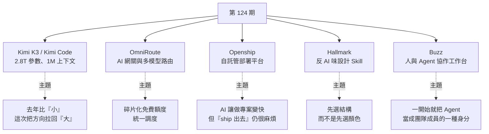
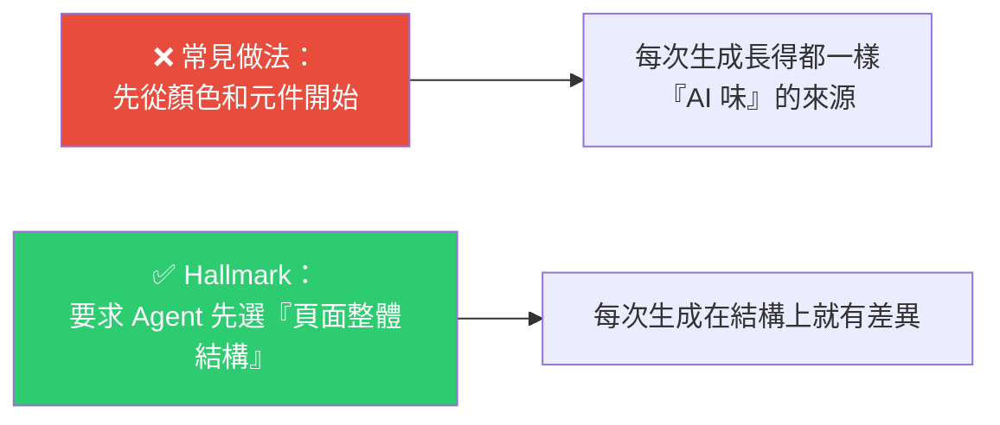

# 第 124 期:Kimi K3 與 Kimi Code、AI 網關、開源部署平台、反 AI 味設計 Skill 與 Block 協作工作台

> GitHub 一週熱點第 124 期(2026/7/19 – 2026/7/25)。本期主軸:WAIC 世界人工智慧大會期間發表的 **Kimi K3(2.8 兆參數、1M 上下文)** 與開源的 **Kimi Code**、把 160+ provider 統一成單一入口的 **AI 網關**、自託管的**開源部署平台**、讓 AI 生成的 UI「不要一眼看出是 AI 做的」的 **Skill**,以及 Block 開源、把人與 Agent 放進同一事件流的**協作工作台**。

---

## 本期速覽

---

## 1. Kimi K3 與 Kimi Code

- **連結:** <https://github.com/MoonshotAI/kimi-code>
- **背景:** 上週 WAIC(世界人工智慧大會)有三百多個全球新品首發,其中與開源關係最大的就是 Kimi 發表新旗艦 **Kimi K3**。

**規格與定位:**

| 項目 | 內容 |
|---|---|
| 總參數量 | **2.8 兆(國內首個 3T 參數級別模型)** |
| 上下文視窗 | **100 萬 token** |
| 定位 | 複雜工程任務、長程編程、3D 遊戲、複雜知識工作 |
| 整體水準 | 仍落後目前最強閉源的 Claude 5 與 GPT-5.6,**但已非常接近,並超越其他模型** |

**兩個最抓人的點:**

1. **1M token 上下文** —— 對聊天可能不直觀,但對程式碼與知識工作很關鍵。以前 Agent 處理大專案要不停壓縮、切檔案、丟上下文;1M token 意味著**有機會一次讀進更大範圍的 codebase、長文件、多輪歷史**,再持續做複雜任務。
2. **Coding 與 Agent 能力** —— 外部報導提到它在前端相關榜單表現很強,一度在 Frontend Code Arena 這類評測上超過 Claude Fable 5 與 GPT-5.6 Sol。**這數字還需更多第三方驗證**,但至少說明它不是只靠參數規模做噱頭。

**Kimi Code** 是 Kimi 版的 Claude Code,已開源。編程 agent 入口是兵家必爭之地;搭配 K3 的速度體感不錯,對自家 coding plan 使用更方便。

> ⚠️ **時間點要注意:** K3 於 7/16 已透過 Kimi App、Kimi.com、Kimi Work、Kimi Code 與 API 開放使用,但**完整權重計畫 7/27 才發布**——現在可以用,但要自行下載權重、本地部署、研究,得等權重正式落地。

> 💡 週報作者的觀察:**去年年底國產模型都在研究「小」,這次 Kimi 又把發展方向拉回「大」,而且效果很好。**

---

## 2. OmniRoute —— 免費 AI 網關與多模型路由代理

- **連結:** <https://github.com/diegosouzapw/OmniRoute>
- **目標:** **一個 endpoint 接 160 多個 provider**(其中 50 多個為免費或低成本來源),給 Claude Code、Codex、Cursor 等工具統一使用,**不必每個工具都配一遍 key、base URL、model name**。

**架構思路:** 前端工具只連一個 OpenAI 相容入口(例如 `http://localhost:20128/v1`),後面由 OmniRoute 負責模型路由、fallback、provider 健康檢查、API key 管理、成本策略與日誌統計。

**成本策略的典型路徑:**

**Free Stack:** 把一堆上游 provider 的免費層組合起來——Kiro、Qoder、Qwen 這類免費或 OAuth 入口,Pollinations 這種不需 API key 的免費模型源,還有號稱每天 5000 萬 token 免費額度的 LongCat。

**其他功能:** 160+ providers、13 種 routing strategies、MCP Server、A2A Protocol、Memory/Skills system,支援 Web / Desktop / PWA / Termux;主打 RTK + Caveman stacked compression,宣稱可節省 15%–95% 的 eligible token。

> ⚠️ **別誤會成「永久免費無上限」:** 免費額度本質來自上游平台,**規則隨時可能變,OAuth 帳號也可能有風控**,免費 provider 的穩定性與隱私邊界也各不相同。
>
> **適合:** 折騰型使用者、個人開發者、AI 工具重度玩家,用來統一管理各種模型來源或做低成本實驗。
> **企業生產環境要更謹慎**:至少要明確劃分**哪些 provider 可以走公司資料、哪些只能用於個人專案**。

---

## 3. Openship —— 開源自託管部署平台

- **連結:** <https://github.com/oblien/openship>
- **定位:** 自託管版的輕量部署控制台——推程式碼、建置容器、管理伺服器、設定網域 / SSL / 資料庫 / 備份,都在同一個地方完成。

**要解決的痛點:** 做一個 side project,前端放 Vercel、後端放 Railway、資料庫放 Supabase、排程又放別的地方。剛開始很方便,**但服務一多,帳單、環境變數、網域、日誌、部署紀錄就全散掉了。** Openship 想把部署這件事**收回自己的伺服器或桌面應用**。

**兩種使用方式:**

| 方式 | 適合 | 做法 |
|---|---|---|
| **桌面 app** | solo developer | 控制平面跑在自己電腦上,透過 SSH 驅動伺服器部署,**不需把 Openship 暴露到公網**。專案目錄執行 `openship init` 綁定,再 `openship deploy` |
| **自託管在伺服器** | 小團隊 | 一行安裝指令,也支援 Docker Compose。最低約 2 核 CPU / 2GB RAM / 20GB 磁碟;推薦 Ubuntu 24.04、4GB+ RAM、SSD。裝好用 `openship status` 檢查 daemon,再進 dashboard |

主打 **zero config files、zero pipelines、zero YAML** —— 盡量自動識別技術棧、自動建置、自動設定。方向很吸引人,因為**很多小專案的部署複雜度不是來自業務,而是來自一堆重複的基礎設施設定**。

> ⚠️ **越是聲稱自動化,越要實測對你的技術棧支援得怎麼樣。** Node、Docker、Postgres、Redis、靜態站可能很順;但**複雜 monorepo、自訂網路、私有 registry、多環境權限**就不一定。

> 💡 這個專案抓住的真實痛點:**AI 編程讓大家做專案更快了,但做出來以後怎麼持續部署、怎麼管理伺服器、怎麼把 side project 變成可維護的服務,仍然很麻煩。** 如果 Agent 負責寫程式碼,這類工具就負責把程式碼真的 ship 出去。

---

## 4. Hallmark —— 反「AI 味」設計 Skill

- **連結:** <https://github.com/Nutlope/hallmark>
- **目標很明確:** 讓 AI 編程工具生成的 UI,**不要一眼看上去就是 AI 做的**。

**核心設計哲學(這點最值得抄):**

專案內含 **20 多種頁面結構**、不同主題、反模式檢查與自我 critique;demo 頁展示 24 種頁面風格。實際運作時會用二十多種主題之一包裝、跑 **57 道「垃圾內容」檢測關卡**,外加一次輸出前的自我批評。

**安裝:** 讓支援 skill 的 Agent(Claude Code、Codex 等)自行安裝,或用類似 `npx skills add https://github.com/nutlope/hallmark --skill hallmark` 的方式。

**顯式呼叫的幾個動詞:**

| 指令 | 作用 |
|---|---|
| (預設模式) | 適合新頁面與新應用 |
| `hallmark audit <target>` | **審計**現有頁面,只給問題清單、不直接改 |
| `hallmark redesign <target>` | 在**保留內容與資訊結構**的前提下重做視覺層 |
| `hallmark study <screenshot \| URL>` | **研究**一個截圖或網址,把你喜歡的設計風格萃取出來 |

> **最適合:** 原型、landing page、後台首頁、作品集這類需要快速出視覺品質的場景。不一定能取代設計師,**但能讓 AI 前端少走最常見的爛路**。
>
> 📌 與上一期的 [awesome-design-md](./issue-123.md) 是互補的兩條路:那個是**給定一份風格規格**(抄現成品牌),Hallmark 是**強制結構多樣性 + 自我審查**(避免千篇一律)。

---

## 5. Buzz —— Block 開源的人與 AI Agent 協作工作台

- **連結:** <https://github.com/block/buzz>
- **定位:** 讓人與 AI Agent 在同一個 workspace 裡工作。不是聊天軟體、也不是 Git 平台,而是**把 channel、thread、程式碼 review、workflow、search、agent、git event 放進同一條事件歷史**。

**底層設計(這是最有意思的部分):** 基於 **Nostr relay**——每一條訊息、反應、workflow 步驟、review approval、git event **都是一個 signed event**。**人有自己的 key,Agent 也有自己的 key**,所以「Agent 做了什麼、誰讓它做的、在哪個 channel 發生」全都留下**可追溯紀錄**。

**要解決的問題:**

| 現況 | Buzz 的設想 |
|---|---|
| Slack 聊需求 + GitHub 管程式碼 + CI 跑 workflow + Linear 管任務 + 開 Claude Code / Codex 讓 Agent 幹活 | **把這些變成同一個 workspace 裡的同一類事件**,一個功能開發的全部內容都在同一個 room 裡 |
| 上下文在不同工具之間來回搬 | 上下文集中,且有簽章可追溯 |

**使用:** 可下載桌面應用(macOS / Linux / Windows),預設連本地 `ws://localhost:3000`;從原始碼跑需要 Docker、Hermit 或 Rust/Node/pnpm/just,執行 `just setup && just build`。

> 💡 **它代表的方向不是「給聊天軟體加 AI bot」,而是從一開始就把 Agent 當成團隊成員的一種身分。** 本質上在解決**多 Agent 協作與上下文組織**的問題。
>
> ⚠️ 願景很大,目前**別當成成熟的 GitHub / Slack / Jira 替代品**。週報作者認為這個思路至少在**離職交接專案**時會很方便(所有脈絡都在同一條事件流裡)。

---

## One more thing:兩份資料

| 資料 | 重點 |
|---|---|
| 至頂智庫《2026 全球 AI 算力發展研究報告》 | 從 AI 晶片、工作站、伺服器一路到算力中心。關鍵判斷:**算力基礎設施正從「傳統 IT 支撐」變成「科技創新與工業革命的戰略底座」**。十大趨勢包括:異構算力從 CPU+GPU 走向 **CPU+GPU+XPU**、超節點與高速互聯成為新型算力基礎設施的重要路徑、智能體與具身智能帶來新的推理算力需求 |
| 亞信 + 清華智產院 + 北郵 + 中國移動《智能體互聯網 Token 計費與運營白皮書》 | 不只講「一個 token 多少錢」,而是講**智能體經濟裡 token 怎麼計費、結算、運營**。最直接的一句:**2025–2026 供應側主導定價的窗口已經過去,Token 單價會被競爭快速抹平,真正能產生溢價的是 SLA、合規、責任與信任這些「契約層」能力**——以後不是誰轉賣 token 便宜誰賺錢,而是**誰能把 token 消耗與真實業務價值、責任邊界、合規稽核綁在一起,誰才有機會做成平台** |

> 這兩份跟本期的 Kimi K3、OmniRoute 正好接得上:**模型越大、Agent 越多、上下文越長,最後都要落到算力與 token 消耗上。**

---

## 應用案例 / 這期怎麼用

1. **1M 上下文不等於可以不做 context 工程**:K3 的 1M token 確實讓「一次讀進更大範圍 codebase」變可能,但本庫 [[codebase-memory-vs-codegraph-two-routes]] 的結論仍然成立——**瓶頸是輸入的信噪比,不是視窗大小**。視窗越大越貴、注意力越稀釋,該做的索引還是要做。
2. **想用 OmniRoute 前先劃紅線**:它最大的價值是把碎片化免費額度統一調度,但**免費 provider 的隱私邊界各不相同**。務必先明確「哪些資料絕對不能走免費通道」,再設定路由策略——這正是本庫 [[production-agent-engineer-skills-2026]] 講的**最小權限**在 provider 層的應用。
3. **UI 千篇一律的兩種解法可以疊加**:先用 awesome-design-md 挑一份 DESIGN.md 定調風格,再用 Hallmark 強制結構多樣性與自我審查。**前者管「像誰」,後者管「別每次都長一樣」。**
4. **把 `hallmark audit` 當成現有專案的免費體檢**:它只給問題清單、不直接改,風險極低,適合先跑一次看看自己的頁面被抓到哪些「AI 味」反模式。
5. **Openship 的定位提醒**:如果你也有「用 AI 很快做出小東西,但不會發布部署」的問題,**這正是目前 AI 工具鏈最明顯的斷點**。與其學一整套 K8s,不如先試這類把部署複雜度收斂到一個控制台的工具。
6. **Buzz 的 signed event 思路值得抄**:即使不用它,**「讓 Agent 的每個動作都有可追溯的身分與紀錄」**這個設計原則,對任何要上生產的多 Agent 系統都適用——對應本庫 [[harness-loop-graph-troubleshooting-map]] 講的「跟圖節點對齊的帶狀態 Trace」。

---

## 來源

- GitHub 一週熱點第 124 期(2026/7/19 – 2026/7/25):<https://github.com/itcoffee66/githubweekly/blob/main/_weekly/124.md>
- 本期專案:[Kimi Code](https://github.com/MoonshotAI/kimi-code) · [OmniRoute](https://github.com/diegosouzapw/OmniRoute) · [Openship](https://github.com/oblien/openship) · [Hallmark](https://github.com/Nutlope/hallmark) · [Buzz](https://github.com/block/buzz)
- 延伸(本庫):[第 123 期(awesome-design-md)](./issue-123.md) · [Codebase-Memory-MCP vs CodeGraph](../ai-agents/memory-retrieval/codebase-memory-vs-codegraph-two-routes.md) · [2026 Agent 工程師能力與面試題](../ai-agents/foundations/production-agent-engineer-skills-2026.md) · [Harness/Loop/Graph 三層排障地圖](../ai-agents/foundations/harness-loop-graph-troubleshooting-map.md)
